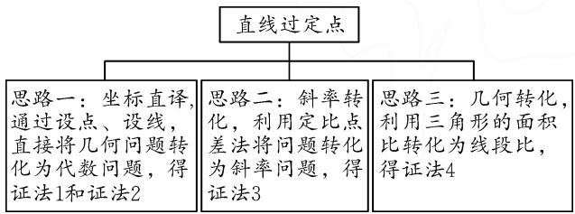
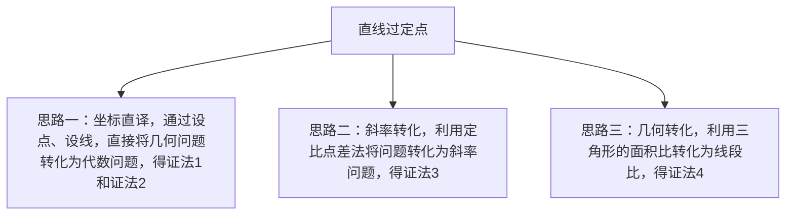

# 武汉市 2024 届高三二月调研试卷第 18 题的探究

# 广东省开平市开侨中学 胡健宾

# 1 试题呈现

题目 （湖北省武汉市 2024 届高中毕业生二月调研数学试题第 18 题）已知双曲线 $E: \frac{x^{2}}{a^{2}} - \frac{y^{2}}{b^{2}} = 1$ 的左、右焦点为 $F_{1}, F_{2}$ ，其右准线为 l，点 $F_{2}$ 到直线 l 的距离为 $\frac{3}{2}$ ，过点 $F_{2}$ 的动直线交双曲线 E 于 A, B 两点，当直线 AB 与 x 轴垂直时， $|AB| = 6$ .

(1)求双曲线 E 的标准方程; $\left(\text{答案:} x^{2}-\frac{y^{2}}{3}=1\right)$

(2)设直线 $AF_{1}$ 与直线 l 的交点为 P，证明：直线 PB 过定点.

# 2 试题分析与思维导图

试题问题设计层次分明,难易梯度合理,解法灵活多样.第(1)问属于封闭问题类型,强调基本方法的运用;第(2)问体现开放问题特征,强化探究运算思路,选择运算方法,彰显了数学运算与逻辑推理在探究和表述论证过程中深度融合的特征 $^{[1]}$ .

第(2)问的思维导图如图1所示.

flowchart

图1

# 3 解法探究

下面对第(2)问的解法进行分类探究.

思路一:坐标直译,通过设点、设线,直接将几何问题转化为代数问题.

证法 1: 当直线 AB 与 x 轴不重合时, 设其方程为 $x = my + 2$ .

由 $\left\{\begin{aligned}x^{2}-\frac{y^{2}}{3}&=1,\\ x&=my+2,\end{aligned}\right.$ 得 $(3m^{2}-1)y^{2}+12my+9=0.$

设 $A(x_{1},y_{1}),B(x_{2},y_{2})$ ，则 $\left\{ \begin{array}{l}y_{1} + y_{2} = \frac{-12m}{3m^{2} - 1},\\ y_{1}y_{2} = \frac{9}{3m^{2} - 1}. \end{array} \right.$

易得直线 $AF_{1}$ 的方程为 $y=\frac{y_{1}}{x_{1}+2}(x+2)$ .

令 $x = \frac{1}{2}$ , 得点 $P$ 坐标 $\left(\frac{1}{2}, \frac{5y_1}{2(x_1 + 2)}\right)$ .

所以直线 $PB$ 的方程为 $\left(x_{2} - \frac{1}{2}\right)(y - y_2) = \left[y_2 - \frac{5y_1}{2(x_1 + 2)}\right](x - x_2)$ .

令 y=0，则直线 PB 与 x 轴交点的横坐标

$$
\begin{array}{l} x = x _ {2} - \frac {y _ {2} \left(x _ {2} - \frac {1}{2}\right)}{y _ {2} - \frac {5 y _ {1}}{2 \left(x _ {1} + 2\right)}} \\ = \frac {x _ {1} y _ {2} - 5 x _ {2} y _ {1} + 2 y _ {2}}{2 x _ {1} y _ {2} - 5 y _ {1} + 4 y _ {2}} \\ = \frac {\left(m y _ {1} + 2\right) y _ {2} - 5 \left(m y _ {2} + 2\right) y _ {1} + 2 y _ {2}}{2 \left(m y _ {1} + 2\right) y _ {2} - 5 y _ {1} + 4 y _ {2}} \\ = \frac {- 4 m y _ {1} y _ {2} - 1 0 y _ {1} + 4 y _ {2}}{2 m y _ {1} y _ {2} - 5 y _ {1} + 8 y _ {2}} \\ = \frac {- 4 m y _ {1} y _ {2} - 1 0 (y _ {1} + y _ {2}) + 1 4 y _ {2}}{2 m y _ {1} y _ {2} - 5 (y _ {1} + y _ {2}) + 1 3 y _ {2}} \\ = \frac {- 3 6 m + 1 2 0 m + 1 4 (3 m ^ {2} - 1) y _ {2}}{1 8 m + 6 0 m + 1 3 (3 m ^ {2} - 1) y _ {2}} \\ = \frac {8 4 m + 1 4 (3 m ^ {2} - 1) y _ {2}}{7 8 m + 1 3 (3 m ^ {2} - 1) y _ {2}} = \frac {1 4}{1 3}. \\ \end{array}
$$

所以直线 PB 过点 $\left(\frac{14}{13},0\right)$ .

当直线 AB 与 x 轴重合时, 直线 PB 也与 x 轴重合, 也过点 $\left(\frac{14}{13}, 0\right)$ .

综上所述, 直线 PB 过定点 $\left(\frac{14}{13}, 0\right)$ .

证法 2: 设 $A(x_{1}, y_{1})$ , $B(x_{2}, y_{2})$ ，则直线 $AF_{1}$ : $y = \frac{y_{1}}{x_{1} + 2}(x + 2)$ ，于是 $P\left(\frac{1}{2}, \frac{5y_{1}}{2x_{1} + 4}\right)$ .

由 A, B, $F_{2}$ 三点共线，得 $\frac{y_{1}}{x_{1}-2} = \frac{y_{2}}{x_{2}-2}$ ，则 $y_{1}x_{2}-$

$y_{2}x_{1} = 2(y_{1} - y_{2})$ ，又根据题意可得 $y_{1}x_{2} + y_{2}x_{1} = \frac{1}{2} (y_{1} + y_{2})$ ，所以由此可得

$$
\left\{ \begin{array}{l} y _ {2} = \frac {- 3 y _ {1}}{4 x _ {1} - 5}, \\ x _ {2} = \frac {5}{4} + \frac {9}{1 6 x _ {1} - 2 0}. \end{array} \right.
$$

设直线 $PB$ 过点 $M(m,n)\left(m\neq \frac{1}{2}\right)$ ，则由 $k_{PM} = k_{BM}$ 可得 $\frac{-2nx_1 + 5y_1 - 4n}{(1 - 2m)x_1 + 2 - 4m} = \frac{-4nx_1 - 3y_1 + 5n}{(5 - 4m)x_1 + 5m - 4}.$

对比系数,可得 $\frac{1-2m}{2-4m}=\frac{5-4m}{5m-4}$ ,解得 $m=\frac{14}{13}$ .

由于分子 $x_{1}$ 的系数不对称, 因此 n=0.

综上所述, 直线 PB 过定点 $\left(\frac{14}{13}, 0\right)$ .

思路二:斜率方向,利用定比点差法将问题转化为斜率问题.

证法3: 设 $A(x_{1}, y_{1}), B(x_{2}, y_{2}), P\left(\frac{1}{2}, t\right)$ ，直线 PB 与 x 轴的交点为 $M(m, 0), \overrightarrow{AF_{2}} = \lambda \overrightarrow{F_{2}B}$ .

所以 $\left\{\begin{aligned}x_{1}+\lambda x_{2}&=2+2\lambda,\\ y_{1}+\lambda y_{2}&=0.\end{aligned}\right.$

由定比点差法，得 $x_{1}-\lambda x_{2}=\frac{1}{2}(1-\lambda)$ .

所以 $\lambda = -\frac{y_{1}}{y_{2}} = \frac{x_{1} - 2}{2 - x_{2}} = \frac{x_{1} - \frac{1}{2}}{x_{2} - \frac{1}{2}}.$

所以 $\left\{ \begin{array}{l} \frac{y_1}{x_1 - \frac{1}{2}} + \frac{y_2}{x_2 - \frac{1}{2}} = 0, \\ \frac{1}{x_1 - \frac{1}{2}} + \frac{1}{x_2 - \frac{1}{2}} = \frac{4}{3}. \end{array} \right.$

所以 $k_{PA} + k_{PB} = \frac{y_1 - t}{x_1 - \frac{1}{2}} +\frac{y_2 - t}{x_2 - \frac{1}{2}} = -\frac{4t}{3}.$

又 $k_{PA} = k_{PF_1}, k_{PB} = k_{PM}$ ，则 $\frac{t}{\frac{1}{2} + 2} + \frac{t}{\frac{1}{2} - m} = -\frac{4t}{3}$ ，所以 $m = \frac{14}{13}$ .

综上所述, 直线 PB 过定点 $\left(\frac{14}{13}, 0\right)$ .

思路三:几何转化,利用三角形的面积比转化为线段比.

证法 4: 设 $A(x_{1}, y_{1})$ , $B(x_{2}, y_{2})$ ，设 $x = \frac{1}{2}$ 与直线 AB 及 x 轴分别交于点 D 与点 H, PB 与 x 轴交点 M.

由 $A, B, F_{2}$ 共线，得 $y_{1}x_{2} - y_{2}x_{1} = 2y_{1} - 2y_{2}$ .

根据题意, 可得 $y_{1}x_{2} + y_{2}x_{1} = \frac{1}{2}y_{1} + \frac{1}{2}y_{2}$ .

所以 $\frac{y_{1}}{y_{2}}=\frac{x_{1}-2}{x_{2}-2}=\frac{x_{1}-\frac{1}{2}}{\frac{1}{2}-x_{2}}$ ，则 $\frac{AF_{2}}{BF_{2}}=\frac{AD}{BD}$ .

所以 $\frac{S_{\triangle PAF_{2}}}{S_{\triangle PBF_{2}}}=\frac{S_{\triangle PAD}}{S_{\triangle PBD}}$ ，则 $\frac{\sin\angle APF_{2}}{\sin\angle BPF_{2}}=\frac{\sin\angle APD}{\sin\angle BPD}$ .

又 $\angle APF_{2} + \angle F_{2}PF_{1} = \pi, \angle APD + \angle DPF_{1} = \pi,$ 所以 $\sin \angle APF_{2} = \sin \angle F_{2}PF_{1}$ ，且 $\sin \angle APD = \sin \angle DPF_{1}$ .

于是，可得 $\frac{\sin\angle F_2PF_1}{\sin\angle BPF_2} = \frac{\sin\angle DPF_1}{\sin\angle BPD}$ 所以 $\frac{PF_1\cdot PF_2\sin\angle F_2PF_1}{PM\cdot PF_2\sin\angle BPF_2} = \frac{PF_1\cdot PH\sin\angle DPF_1}{PM\cdot PH\sin\angle BPD}.$

所以 $\frac{S_{\triangle PF_1F_2}}{S_{\triangle PMF_2}} = \frac{S_{\triangle PF_1H}}{S_{\triangle PMH}}$ ，则 $\frac{F_1F_2}{MF_2} = \frac{F_1H}{MH}$ ，由此解得 $M\left(\frac{14}{13},0\right)$ .

综上所述, 直线 PB 过定点 $\left(\frac{14}{13}, 0\right)$ .

# 4 变式推广

本题第(2)问是整个题目命制的亮点,对它的引申推广就水到渠成了.经笔者探究,得如下两个结论:

定理 1 若点 $T_{1}(-t,0)$ , $T_{2}(t,0)$ ，过点 $T_{2}$ 的直线 l 与双曲线 $C: \frac{x^{2}}{a^{2}} - \frac{y^{2}}{b^{2}} = 1 (a > 0, b > 0)$ 交于点 $A(x_{1}, y_{1}), B(x_{2}, y_{2})$ ，直线 $AT_{1}$ 与直线 $x = \frac{a^{2}}{t}$ 交于点 P，则直线 PB 过点 $\left(\frac{t(t^{2} + 3a^{2})}{3t^{2} + a^{2}}, 0\right)$ .

定理 2 若点 $T_{1}(-t,0)$ , $T_{2}(t,0)$ ，过点 $T_{2}$ 的直线 l 与椭圆 $C: \frac{x^{2}}{a^{2}} + \frac{y^{2}}{b^{2}} = 1 (a > b > 0)$ 交于点 $A(x_{1}, y_{1}), B(x_{2}, y_{2})$ ，直线 $AT_{1}$ 与直线 $x = \frac{a^{2}}{t}$ 交于点 P，则直线 PB 过点 $\left(\frac{t(t^{2} + 3a^{2})}{3t^{2} + a^{2}}, 0\right)$ .

# 5 试题研究小结

解析几何中与动点、动直线有关的定点问题是重点题型,本题涉及的方法典型,简单总结为“定点问题需设参,巧用设点、设线来实现,妙用设而不求,整体换元策略来转化”.

# 参考文献：

[1] 张鹄, 孔峰, 李红春. 对 2019 年武汉市高三二月调考理科第 20 题的探究与思考 [J]. 数学通讯, 2019(8): 37-38, 43. Z