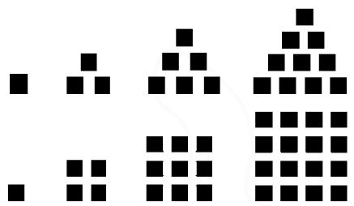

# 注重背景 渗透思想 发展能力\*

——以“数列的概念”教学为例

● 贵州省凯里市第一中学 贾士伟

摘要:以“数列的概念”教学为例,提出在教学过程中应高度重视知识的起源与背景探究,以及这些知识点之间的内在联系,为学生构建一个逻辑清晰、内容完整的知识体系,进而引导他们形成明确且系统化的学习路径.此外,教学活动的设计需精心融入启发性的问题情境,确保各环节之间紧密相扣、层层深入.通过精心设计的问题链,激发学生的数学思维,促进其核心数学技能的有效发展与提升.

关键词: 数学思想; 数学文化; 数列; 通项公式; 教学设计

课堂教学形式丰富多样,但无论哪种类型的课堂,我们的教学目标都应是帮助学生“认识数学与自然界、数学与人类社会的关系,认识数学的科学价值、文化价值,提高提出问题、分析和解决问题的能力,形成理性思维,发展智力和创新意识”[1].同时,我们也要引导学生认识数学在实际生活中的应用价值,强化他们的应用意识,使他们能够解决简单的实际问题.下面笔者以“数列的概念”的教学设计为例,提出要特别关注知识的背景和来源,并将这些内容融入教学中.

# 1 基本情况

# 1.1 课题背景与设计理念

在《普通高中数学课程标准(实验)》里面提到：“高中数学课程提倡体现数学的文化价值，并在适当的内容中提出对‘数学文化’的学习要求，设立‘数学史选讲’等专题。”“数列”部分蕴含着丰富的数学文化知识，在课堂教学中，我们应该渗透数学思想、数学文化，这有利于激发学生的学习兴趣，有利于学生进一步理解数学，有利于开拓学生视野、提升数学学科核心素养。

# 1.2 教材教法分析及教学重难点

“数列的概念”是人教 A 版选择性必修第二册第四章第一节的内容,这一章是必修第一册学习的函数知识的延续,数列是一种特殊的函数.本节所涉及的数列的通项公式、递推公式是这一章的核心知识.根据课程标准和班级学生情况,笔者将教学目标、重难点定位如下:

教学目标:(1)通过日常生活和数学中的实例,了解数列的概念和表示方法(列表法、图象法、通项公式法), 培养数学抽象核心素养; (2) 了解数列是一种特殊的函数; (3) 通过数列的前几项项归纳出数列的通项公式, 培养逻辑推理核心素养.

教学重点:数列的有关概念,通项公式.

教学难点:数列通项公式的理解;根据数列的前几项写出它的一个通项公式.

# 2 教学过程设计分析

# 2.1 课题介绍

对数列的研究源于现实生产、生活的需要,如存款利息、购房贷款等实际问题,都需要用有关数列的知识来解决.第四章“数列”主要包括如下内容:①数列的相关概念、表示(通项公式、递推公式)、前n项和的概念;②从定义、通项公式、性质、前n项和公式等角度研究两种特殊的数列,即等差数列和等比数列;③数学归纳法(选学).数列内容在课本中所占的篇幅并不多,但涉及的方法多(叠加法、叠乘法、待定系数法、倒序相加法、错位相减法、裂项求和法、分组求和法等等)、技巧多,是高考和竞赛的热点、核心内容之一.

设计意图:通过课题的介绍,学生可以知道为什么要学习数列,从哪些角度学习数列,从而对数列的学习有一个整体的认识和把握,方便构建知识体系.

# 2.2 几个引例

引例 1 在《庄子·天下篇》有这样一句话：“一尺之棰，日取其半，万世不竭。”请问这句话什么含义？

引例 2 传说古希腊毕达哥拉斯(Pythagoras, 约公元前 570 年—约公元前 500 年)学派的数学家经常在沙滩上研究数学问题, 它们在沙滩上画点或用小石子来表示数. 如三角形数: 1, 3, 6, 10, ……; 再如正方形

数:1,4,9,16,…….如图1.

natural_image

Abstract pixelated pattern of black squares arranged in three rows (no text or symbols)

图1

引例 3 有人说,大自然是懂数学的,比如树木的分权、花瓣的数量、向日葵种子的排列……都遵循了某种数学规律,与 1,1,2,3,5,8,13,21,34,55,……这列数有关.这一列数,我们把它称为斐波那契数,亦称之为斐波那契数列,又称黄金分割数列、费氏数列.斐波那契数列有什么特点呢?

设计意图:借助三个案例,巧妙地将数学史融入教学之中,从而让学生深刻感受到数学与自然界、人类社会的紧密联系.通过这一教学设计,向学生展示数学的科学价值和文化价值,期望学生能够领悟到数学不仅是一门科学,更承载着深厚的文化底蕴,进一步激发他们的学习兴趣和探索欲望.

# 2.3 概念剖析

# 2.3.1 数列的概念

(1) 定义: 按照一定顺序排列的一列数称为数列.  
(2)项:数列中的每一个数叫作这个数列的项. $a_{1}$ 称为数列 $\{a_{n}\}$ 的第1项(或称为首项), $a_{2}$ 称为第2项, $\cdots\cdots,a_{n}$ 称为第n项.  
(3)数列的表示:数列的一般形式可以写成 $a_{1}$ ， $a_{2}$ ， $a_{3}$ ，……， $a_{n}$ ，……，简记为 $\{a_{n}\}$ .

# 2.3.2 数列的分类

数列的分类见表 1.

表1

<table><tr><td>分类标准</td><td>名称</td><td>含义</td></tr><tr><td rowspan="2">按项的个数</td><td>有穷数列</td><td>项数有限的数列</td></tr><tr><td>无穷数列</td><td>项数无限的数列</td></tr><tr><td rowspan="4">按项的变化趋势</td><td>递增数列</td><td>从第2项起,每一项都大于它的前一项的数列</td></tr><tr><td>递减数列</td><td>从第2项起,每一项都小于它的前一项的数列</td></tr><tr><td>常数列</td><td>各项相等的数列</td></tr><tr><td>摆动数列</td><td>从第2项起,有些项大于它的前一项,有些项小于它的前一项的数列</td></tr></table>

注:如果一个数列是有穷数列,则该数列的最后一项可称为尾项.

# 2.3.3 数列的通项公式

如果数列 $\{a_{n}\}$ 的第n项与序号n之间的关系可以用一个式子来表示,那么就把这个公式叫作这个数列的通项公式.

注意:(1)数列的通项公式实际上是一个以正整数集 $N^{*}$ 或它的有限子集 $\{1,2,3,\cdots,n\}$ 为定义域的函数解析式。(2)同所有的函数关系不一定都有解析式一样,并不是所有的数列都有通项公式.

设计意图:鉴于本节内容新知繁多,为促进学生高效记忆与深刻理解,特精选核心要点,实施精讲细评.同时,采用思维导图的形式,直观展现知识脉络,助力学生构建清晰的知识结构图.

# 2.4 知识的深层次理解

问题 1 数列 $a_{1}, a_{2}, a_{3}, \cdots, a_{n}, \cdots$ 可记为数列 $\{a_{n}\}$ ，据此数列 $\frac{1}{2}, \frac{2}{5}, \frac{3}{10}, \frac{4}{17}, \frac{5}{26}, \cdots$ 可以记为 \_\_\_\_；

问题 2 数列 $\left\{\frac{1}{2n-1}\right\}$ 的首项是 \_\_\_\_，第 3 项是 \_\_\_\_，第 k 项是 \_\_\_\_，第 $m+1$ 项是 \_\_\_\_。

设计意图:数列作为一个全新的知识点,学生在初次接触时,往往会对相关的符号表示感到困惑.设计上面这两个问题,旨在帮助学生更好地理解数列的概念及其符号表示方法.通过这两个问题的解答,学生不仅能够加深对数列的理解,还能提升他们的数学抽象能力.此外,这一教学设计还为将来学习构造数列打下坚实的基础,起到了很好的铺垫作用.

问题3 数列 $\{a_{n}\}$ 与 $a_{n}$ 、集合 $\{a_{n}\}$ 有什么区别和联系？

设计意图:通过将已学过的概念、符号与最新学习的内容进行对比,旨在帮助学生更深入地理解和掌握这些概念和符号.通过对比学习,学生可以清晰地看到新旧知识之间的联系与区别,从而加深对新概念、新符号的理解.

问题 4 对于数列 $\{a_{n}\}$ ，若 $a_{n}=n^{2}+n$ ，则 $a_{3}=$ \_\_\_\_， $a_{m+1}=$ \_\_\_\_；

对于函数 $f(x)$ ，若 $f(x)=x^{2}+x$ ，则 $f(3)=$ \_\_\_\_， $f(m+1)=$ \_\_\_\_.

设计意图: 将数列与函数进行类比, 可以帮助学生更直观地理解数列的本质, 加深学生对数列概念、符号及运算的理解. 这一教学设计不仅为后续数列的深入学习打下坚实基础, 更能有效发展学生的数学抽象核心素养.

# 2.5 例题分析

例 1 下列说法中, 正确的是有 \_\_\_\_.

①数列 $\left\{\frac{n+1}{n}\right\}$ 的第k项为 $1+\frac{1}{k}$ ;  
②数列 0,2,4,6,8,……,可记为 $\{2n\}$ ;

(下转第39页)

的呈现方式与学生的年龄特征有关,比如针对高中生,在设计数列单元课件时,设计对比栏、类比板块、双向箭头、将数列单元的通项公式与一次函数进行对比学习.如果是文字材料,在使用简单易懂的语言来表述,避免出现句子歧义的现象.如果教学对象是较低年级的学生,可以设计一些活动的、具体的或者动画形式的教学材料吸引学生.

由于高中的数学内容以板块模式呈现,导致学生容易忽略知识之间的联系,相关认知负荷过低.比如在做函数部分的习题时,会出现求函数最值的问题,但因为当下所学的内容为函数的概念与相关性质,所以大部分学生的思维局限于当下所学的知识范围,而忽略了与前一章不等式知识的联系.所以,应合理安排教学内容,寻找知识间的关联性,引导学生体会学习材料的共同要素,促进新知识的理解与吸收.

综上,认知负荷理论揭示了内在、外在和相关认知负荷对学生学习的影响情况.这一理论在教学实践中能展现出强大的指导价值,通过提升学生学习能力,提高教师有效教学水平,以及分解教学资料、挖掘知识关联性等优化策略,能够科学地优化学生的认知负荷,为学生创造更高效的学习环境.

认知负荷理论为教育领域带来了新的研究视角与实践方法,随着教育环境的不断变化和学习需求的日益多元化,该理论仍有广阔的发展空间.未来,还需进一步探索其在不同学科、不同学习阶段以及新兴教学模式中的应用,以持续完善和拓展这一理论体系,为教育教学改革提供更坚实的理论支撑与实践指导.

# 参考文献：

[1]金婷婷. 认知负荷理论在初中数学教学中的应用——以动态几何问题为例[D]. 上海: 上海师范大学, 2024.  
[2] 刘元琪. 数学元认知、数学认知负荷与数学学习效率的现状及关系研究——以青海省数学师范生为例 [D]. 西宁: 青海师范大学, 2024.  
[3] Sweller J, Chandler P. Evidence for Cognitive Load Theory[J]. Cognition and Instruction, 1991, 8(4): 351-362.   
[4] 辛自强, 林崇德. 认知负荷与认知技能和图式获得的关系及其教学意义 [J]. 华东师范大学学报 (教育科学版), 2002(4): 55-60, 77.  
[5] 乔·加罗法洛, 韩向前. 发展数学学习的元认知 [J]. 应用心理学, 1989(1): 54-55. Z

# (上接第34页)

③数列 1,0,-1,-2 与数列 -2,-1,0,1 是相同的数列；  
④数列 1,3,5,7 可表示为 $\{1,3,5,7\}$ .

例 2 写出下列数列的一个通项公式：

(1)0,3,8,15,24,……;   
(2)1,-3,5,-7,9,…;   
(3) $\frac{1}{3},\frac{1}{8},\frac{1}{15},\frac{1}{24},\frac{1}{35}\cdots\cdots;$   
(4)1,11,111,1111,11111,…

设计意图:本环节旨在巩固学生对基本概念的理解,并通过这一过程培养学生的的数学抽象核心素养;培养学生观察、分析、归纳的能力,渗透特殊与一般的数学思想.

# 3 教学反思

# 3.1 体系的连贯性与数学视野的拓展

任何一个新内容都应该讲一下知识之间的联系，以及这些新概念从何而来，有什么用，学什么，怎么学。本节课在开篇就紧扣核心，对其进行简要介绍，以便让学生对此有个大致的了解。这样的教学方式能够帮助学生更好地理解和掌握数列的概念，为后续学习打下坚实的基础，这是其一。其二，数学教育不能仅是培养学生解题能力，还应拓展学生数学视野。基于这种想法,本节课选择了三个极具代表性的例子,涉及国学的“一尺之棰,日取其半,万世不竭”、毕达哥拉斯学派的形数、极具影响力的斐波那契数列.其三,本节课的难点不是数列的定义,而是数列相关符号的理解.基于此,本节课设置了“知识的深层次理解”这一环节,抓住学生的问题所在,突破难点.

# 3.2 注重知识的背景,渗透思想、发展能力

“数学的产生和发展,始终与人类社会的生产、生活有着密不可分的联系.任何一个概念的引入,总有它的现实或数学理论发展的需要.”因此,在新授课时,我们务必要阐明知识的深厚背景与广泛应用价值,让学生深刻理解数学概念、方法及思想的自然起源与合理发展.特别是章节起始课,更应清晰揭示知识的诞生历程、背景故事,并巧妙融入数学思想,旨在提升学生的特定能力.

华东师范大学崔允漷教授精炼地概括了“好课”的三大标准:教学高效、学习愉悦、考核理想.本节课正是这一理念的生动实践,不仅激发了学生的学习兴趣,还确保了教学的有效性.所选例题与练习,均兼具代表性与深度,旨在锤炼学生的抽象数学思维,同时培养其分析、观察与归纳的综合能力.

# 参考文献：

[1]中华人民共和国教育部.普通高中数学课程标准(2017年版)[S].北京:人民教育出版社,2018:1.Z