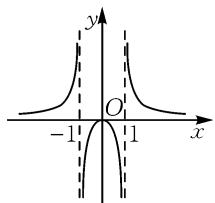

# 特殊思维巧应用,高考真题妙突破

# ● 福建省厦门第六中学 葛雯琳

摘要: 特殊思维与技巧、方法是解决与处理数学客观题时的一种基本思维方法. 结合 2025 年高考真题中的几类常见实例, 借助特殊思维与技巧、方法的巧妙应用, 利用特殊元素的选取, 结合特殊值、特殊点及特殊向量等的巧妙选取与解题应用, 优化过程提升效益, 总结特殊思维与方法的解题技巧与规律.

关键词: 特殊思维; 特殊值; 特殊点; 特殊向量; 创新

作为解决数学问题中最具特色的一种“巧技妙法”——特殊思维与技巧、方法，是立足数学“四基”与“四能”，创新并巧妙解决数学问题的一种思维方式，是数学知识的巧妙应用与数学能力的全面升华。而在解题中，采用特殊思维与技巧、方法，结合题设应用场景，巧妙选取特殊元素（如特殊值、特殊点、特殊向量、特殊数列、特殊图形等）进行应用，以特殊代替一般，通过特殊元素场景下对问题的突破与求解，来解答一般性条件下的综合问题，实现客观题这一“小题”的“小做”“巧做”“快做”，实现解题的最优化效益。

# 1 特殊值

在解决方程或不等式等相关问题,特别是涉及方程或不等式是否成立的条件与应用时,经常借助特殊值的巧妙选取,由此来判断相应的方程是否成立、相应的不等式是否成立等,从而直接判断特殊值场景下对相应的方程或不等式等的影响,进而实现问题的巧妙分析与判断.

例 1 （2025 年高考数学新高考Ⅱ卷·4）不等式 $\frac{x-4}{x-1} \geqslant 2$ 的解集为（）.

A. $\{x\mid-2\leqslant x\leqslant1\}$

B. $\{x\mid x\leqslant-2\}$

C. $\{x\mid-2\leqslant x<1\}$

D. $\{x\mid x>1\}$

解析:取特殊值 x=0, 代入不等式中, 有 $\frac{0-4}{0-1} \geqslant 2$ 成立, 由此排除选项 B, D.

而不等式 $\frac{x-4}{x-1}\geqslant2$ 中，显然满足 $x\neq1$ ，由此排除选项A.

故选择:C.

点评: 解决此类分式不等式问题时, 通常通过移项并化分式不等式为二次不等式, 进而结合不等式的解决来分析与处理. 而借助特殊值的选取, 更加巧妙地代入处理并巧妙排除, 对于简化不等式的求解与应用有着非常重要的作用.这里特殊值的选取,要注意各选项中数据之间的关系与区别,可以给特殊值的选取提供一定的帮助.

例 2 （2025 年高考数学新高考 I 卷·8）若实数 x, y, z 满足 $2 + \log_{2}x = 3 + \log_{3}y = 5 + \log_{5}z$ ，则 x, y, z 的大小关系不可能是（）.

A.x>y>z

B. $x > z > y$

C. y > x > z

D. y > z > x

解析:依题意,取特殊值 z=1, 可得 $2+\log_{2}x=3+\log_{3}y=5+\log_{5}1=5+0=5$ , 解得 $x=2^{3}=8$ , $y=3^{2}=9$ , 此时满足选项 C“y>x>z”的关系.

取特殊值 $z=\frac{1}{5}$ ，可得 $2+\log_{2}x=3+\log_{3}y=5+\log_{5}\frac{1}{5}=5-1=4$ ，解得 $x=2^{2}=4, y=3$ ，此时满足选项 A 中“x>y>z”的关系.

取特殊值 z=125，可得 $2+\log_{2}x=3+\log_{3}y=5+\log_{5}125=5+3=8$ ，解得 $x=2^{6}=64, y=3^{5}=243$ ，此时满足选项 D“y>z>x”的关系.

综上分析,故选择:B.

点评:解决此类比较大小的关系问题,借助特殊思维分析与判断时,随着特殊值的选取,可以合理排除不满足条件的选项,逐步接近正确的选项,解题目标明确,是解决此类综合问题,特别是函数值、代数式的大小关系等问题时比较常用的一种基本技巧、方法.解决此题时,由于结果的多样性,往往特殊值的选取比较繁多,可能会出现不同特殊值的选取而对应的结论相同的情况,从而导致特殊值验证的过程比较复杂.

# 2 特殊点

在函数图象、几何图形等综合问题中,基于函数图象上对应特殊点的选取与判断,或几何图形上对应特殊点的选取与判断,以特殊点带动相关图象或图形上其他元素的变形与应用,更加简捷、创新地处理相关的图象或图形等相关问题.

例 3 （2025 年高考数学天津卷·3）已知函数 $y=f(x)$ 的图象如图 1 所示，则 $f(x)$ 的解析式可能为（）.

A. $f(x) = \frac{x}{1 - |x|}$   
B. $f(x) = \frac{x}{|x| - 1}$   
C. $f(x) = \frac{|x|}{1 - x^2}$   
D. $f(x)=\frac{|x|}{x^{2}-1}$

解析:依题意,利用函数 $y=f(x)$ 的图象关于 y 轴对称,可知函数 $y=f(x)$ 是偶函数,由此可以排除选项 A,B.

而由函数 $y=f(x)$ 的图象, 取特殊点可知 $f(2)>0$ , 由此可以排除选项 C.

故选择:D.

点评:解决此类与函数图象相关的数学问题,特别是依托函数图象的综合应用时,往往借助函数图象上一些特殊点加以判断,由此来分析确定与合理排除.对于函数图象上特殊点的选取,比较常见的特殊点如坐标原点、x轴或y轴上的交点、图象最高点或最低点、平衡点等,由此来分析与判断,实现函数图象及其综合问题的分析与判断等.

例 4 （2025 年高考数学新高考 I 卷 · 10）（多选题）设抛物线 $C: y^{2} = 6x$ 的焦点为 F，过点 F 的直线交 C 于点 A, B，过点 A 作直线 $l: x = -\frac{3}{2}$ 的垂线，垂足为点 D，过点 F 且垂直于 AB 的直线交 l 于点 E，则（）.

A. $|AD|=|AF|$

B. $|AE|=|AB|$

C. $|AB|\geqslant6$

D. $|AE|\cdot|BE|\geqslant18$

解析: 结合抛物线的定义, 可知 $\left|AD\right| = \left|AF\right|$ , 故选项 A 正确.

由抛物线的基本性质, 可知抛物线的弦中通径最短, 可得 $\left|AB\right| \geqslant 2p = 6$ , 故选项 C 正确.

当 $AB \perp x$ 轴时，可得 $|AB| = 6$ ，此时 $|AE| = |BE| = 3\sqrt{2}$ ，可知 $|AE| < |AB|$ ，故选项 B 错误.

当 $AB \perp x$ 轴时， $|AE| \cdot |BE| = 18$ ; 当 AB 与 x 轴不垂直时，通过参数化和几何分析，计算知 $|AE| \cdot |BE| > 18$ . 故选项 D 正确.

故选择: ACD.

点评: 解决此类与几何图形相关的数学问题时, 借助动点的变化所对应的特殊点, 基于特殊思维, 借助 $AB \perp x$ 轴这一特殊场景来分析与应用, 通过矛盾的普遍性与特殊性之间的关系,以特殊来解决一般性的问题,是应试中比较常用的一种特殊视角,也是应试中的基本策略之一.

text_image

y
O
-1
1
x

图1

# 3 特殊向量

在解决平面向量及其综合应用问题中,有时也涉及与之对应的平面几何问题、解三角形问题、解析几何问题等,可以巧妙应用对应的平面向量知识,借助特殊向量的选取,以特殊形式来代替一般形式,给问题的优化与解答创造更加简捷的解题环境.

例 5 （2025 年高考数学上海卷·12）已知函数 $f(x)=\left\{\begin{aligned}-1,x&<0,\\ 0,x&=0,\quad a,b,c\end{aligned}\right.$ 为平面内三个不同的单位向量，且满足 $f(a\cdot b)+f(b\cdot c)+f(c\cdot a)=0$ ，则 $|a+b+c|$ 的取值范围为 \_\_\_\_。

解析:依题意,不妨设 $f(\boldsymbol{a} \cdot \boldsymbol{b}) = 0, f(\boldsymbol{b} \cdot \boldsymbol{c}) = 1, f(\boldsymbol{c} \cdot \boldsymbol{a}) = -1$ , 则知 $a \cdot b = 0, b \cdot c \in (0, 1], c \cdot a \in [-1, 0)$ .

不妨取特殊向量 $\boldsymbol{a}=(1,0)$ , $\boldsymbol{b}=(0,1)$ , $\boldsymbol{c}=(\cos\alpha,\sin\alpha)$ , $\alpha\in\left(\frac{\pi}{2},\pi\right)$ .

于是 $|\pmb {a} + \pmb {b} + \pmb{c}| = |(1 + \cos \alpha ,1 + \sin \alpha)| =$ $\sqrt{(1 + \cos\alpha)^2 + (1 + \sin\alpha)^2} = \sqrt{3 + 2(\sin\alpha + \cos\alpha)}.$

由于 $g(\alpha) = \sin \alpha +\cos \alpha = \sqrt{2}\sin \left(\alpha +\frac{\pi}{4}\right),\alpha \in$ $\left(\frac{\pi}{2},\pi\right)$ ，则 $g(\alpha)\in (-1,1)$

故 $|a+b+c|=\sqrt{3+2(\sin\alpha+\cos\alpha)}\in(1,\sqrt{5})$ ，即 $|a+b+c|$ 的取值范围为 $(1,\sqrt{5})$ .

故填： $(1,\sqrt{5})$ .

点评:基于平面向量的问题场景,结合单位向量的概念及题设中相应的条件,选取特殊向量加以代换处理,进而优化解题过程,实现问题的简捷处理与综合应用.这里选取两个垂直的特殊单位向量,以及一个单位圆上的一般向量(以三角换元形式来设置),对于问题的解决与应用起着非常重要的作用.

利用特殊思维与技巧、方法来分析并解决相应的数学问题时,特别是一些相应的数学客观题的分析与解决,是基于特殊元素(如本文中的特殊值、特殊点、特殊向量等)的巧妙选取,以特殊代替一般,使得一般问题更加灵活、更加具体,解决起来更加直接,实现特殊思维与一般思维的转化与升华,是夯实数学基础知识与提升数学基本技能的综合体现.Z