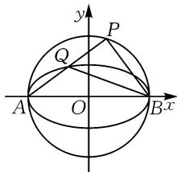
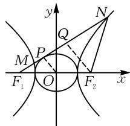

# 考点链接 题型归纳: 近年高考求离心率 问题剖析\*

● 莆田哲理中学 翁云琴

摘要:通过深入剖析近年来高考中圆锥曲线离心率问题的典型案例,归纳出三种解题核心方法,即利用圆锥曲线定义、基本量间关系和几何图形特征求解离心率,旨在帮助学生掌握圆锥曲线离心率知识点,提升解题效率和准确性.

关键词: 离心率; 解题策略; 变式拓展

在高中数学中,圆锥曲线的离心率问题占据着举足轻重的地位,它不仅是衡量学生掌握圆锥曲线几何量知识深度的试金石,还深刻检验了学生的空间想象能力、推理论证能力和运算求解能力.近年来,随着高考对学生数学综合能力要求的持续提升,离心率问题凭借其独特的魅力,频繁亮相于高考试题之中,成为广大师生关注的焦点.

本文旨在通过深入剖析近年来高考中出现的典型离心率问题案例,系统性地归纳出解决此类问题的常见题型及行之有效的解题策略.通过这一过程,我们力求揭示离心率问题背后的内在逻辑与规律,探索更为高效、精准的解题方法,并总结出一系列实用的解题技巧.以期助力学生更加全面、深刻地理解和掌握圆锥曲线离心率这一重要知识点,从而在应对相关题目时能够迅速找到切入点,提升解题效率与准确性.

# 1 利用圆锥曲线定义求离心率

例 1 （2024 年新高考Ⅰ卷第 12 题）设双曲线 C： $\frac{x^{2}}{a^{2}}-\frac{y^{2}}{b^{2}}=1(a>0,b>0)$ 的左、右焦点分别为 $F_{1}, F_{2}$ ，过 $F_{2}$ 作平行于 y 轴的直线交 C 于 A, B 两点，若 $\left|F_{1}A\right|=13,\left|AB\right|=10$ ，则 C 的离心率为 \_\_\_\_.

解法一:由题意可知, $|F_{1}A|=13$ , $|F_{2}A|=\frac{1}{2}|AB|=5$ .由 $|F_{1}A|-|F_{2}A|=2a=8$ ,得a=4.又x=c时, $y=\frac{b^{2}}{a}$ ,即 $|F_{2}A|=\frac{b^{2}}{a}=5$ ,即 $b^{2}=5a=20$ ,则 $c^{2}=a^{2}+b^{2}=16+20=36$ ,所以c=6.所以双曲线C的离心率为 $e=\frac{c}{a}=\frac{3}{2}$ .故填: $\frac{3}{2}$ .

解法二: 因为 $AB \perp x$ 轴, 所以 AB 是通径, 又AB=10，所以 $AF_{2}=BF_{2}=5$ 。又 $AF_{1}=13$ ，由勾股定理得 $F_{1}F_{2}=12$ ，所以 c=6。由双曲线的定义得 a=4，所以双曲线的离心率 $e=\frac{c}{a}=\frac{3}{2}$ 。

评析:与圆锥曲线焦点有关的问题,往往可以通过分析焦点三角形的边角关系求解离心率.首先利用第一定义求得a的值,进而利用通径或焦半径或焦点三角形等几何特征,构建方程(组)求得另一个基本量,再利用离心率的定义求得离心率的值.

变式1 在平面直角坐标系 $xOy$ 中，已知椭圆 $C_1$ 与双曲线 $C_2$ 共焦点，双曲线 $C_2$ 实轴的两端点将椭圆 $C_1$ 的长轴三等分，两曲线的交点与两焦点共圆，则双曲线 $C_2$ 的离心率为（ ）.

A. $\sqrt{3}$

B.2

C. $\sqrt{5}$

D. $\sqrt{6}$

解析:设双曲线 $C_{2}$ 的实半轴长为 a，半焦距为 c，由双曲线 $C_{2}$ 实轴的两端点将椭圆 $C_{1}$ 的长轴三等分，可得椭圆的长半轴长为 3a。设 P 为椭圆与双曲线在第一象限的交点，设 $\left|PF_{1}\right|=x,\left|PF_{2}\right|=y$ ，则可得 $\left\{\begin{aligned}x+y=6a,\\ x-y=2a,\end{aligned}\right.$ 解得 x=4a,y=2a。由题意知点 P 在以 $F_{1}F_{2}$ 为直径的圆上，所以 $x^{2}+y^{2}=4c^{2}$ ，于是可得

$20a^{2}=4c^{2}$ ，则离心率 $e=\frac{c}{a}=\sqrt{5}$ .
故选:C.

变式 2 如图 1, A, B 分别是椭圆 $C: \frac{x^{2}}{a^{2}} + \frac{y^{2}}{b^{2}} = 1 (a > b > 0)$ 的左、右顶点，点 P 在以 AB 为直径的圆 O 上(点 P 异于 A, B 两点)，线段 AP 与椭圆 C 交于另一点 Q，若直线 BP 的斜率是直线 BQ 的斜率的 4 倍，则椭圆 C 的离心率为()。

text_image

y
P
Q
A O B x

图1

A. $\frac{\sqrt{3}}{3}$

B. $\frac{1}{2}$

C. $\frac{\sqrt{3}}{2}$

D. $\frac{3}{4}$

解析: 易知 $A(-a,0)$ , $B(a,0)$ . 设 $P(x_{1},y_{1})$ , $Q(x_{2},y_{2})$ , 则 $\frac{x_{2}^{2}}{a^{2}}+\frac{y_{2}^{2}}{b^{2}}=1$ , 可得 $y_{2}^{2}=\frac{b^{2}(a^{2}-x_{2}^{2})}{a^{2}}$ . 易得 $k_{AQ}\cdot k_{BQ}=\frac{y_{2}-0}{x_{2}+a}\cdot\frac{y_{2}-0}{x_{2}-a}=\frac{y_{2}^{2}}{x_{2}^{2}-a^{2}}=-\frac{b^{2}}{a^{2}}=e^{2}-1$ , 又 $k_{AQ}\cdot k_{BP}=\frac{y_{2}-0}{x_{2}+a}\cdot\frac{y_{1}-0}{x_{1}-a}=-1$ , $4k_{BQ}=4\cdot\frac{y_{2}-0}{x_{2}-a}=k_{BP}=\frac{y_{1}-0}{x_{1}-a}$ , 所以 $k_{AP}\cdot k_{BP}=4k_{AP}\cdot k_{BQ}=4(e^{2}-1)=-1$ , 解得 $e=\frac{\sqrt{3}}{2}$ . 故选: C.

# 2 利用基本量间关系求离心率

例 2 （2023 年新高考Ⅰ卷第 16 题）已知双曲线 $C: \frac{x^{2}}{a^{2}} - \frac{y^{2}}{b^{2}} = 1 (a > 0, b > 0)$ 的左、右焦点分别为 $F_{1}$ ， $F_{2}$ ，点 A 在 C 上，点 B 在 y 轴上， $\overrightarrow{F_{1}A} \perp \overrightarrow{F_{1}B}, \overrightarrow{F_{2}A} = -\frac{2}{3}\overrightarrow{F_{2}B}$ ，则 C 的离心率为 \_\_\_\_.

解法一:依题意,设 $\left|AF_{2}\right|=2m$ ,则 $\left|BF_{2}\right|=3m=\left|BF_{1}\right|$ , $\left|AF_{1}\right|=2a+2m$ .

在 Rt△ABF $_{1}$ 中，9m $^{2}$ + (2a+2m) $^{2}$ = 25m $^{2}$ ，则 (a+3m)(a-m)=0，解得 a=m 或 a=-3m（舍去），所以 |AF $_{1}$ |=4a，|AF $_{2}$ |=2a，|BF $_{2}$ |=|BF $_{1}$ |=3a，则 |AB|=5a，从而 cos∠F $_{1}$ AF $_{2}$ = $\frac{|AF_{1}|}{|AB|}$ = $\frac{4a}{5a}$ = $\frac{4}{5}$ .

在 $\triangle AF_{1}F_{2}$ 中， $\cos \angle F_{1}AF_{2} = \frac{16a^{2} + 4a^{2} - 4c^{2}}{2 \times 4a \times 2a} = \frac{4}{5}$ ，整理得 $5c^{2} = 9a^{2}$ ，所以 $e = \frac{c}{a} = \frac{3\sqrt{5}}{5}$ .

解法二:依题意,可得 $F_{1}(-c,0)$ , $F_{2}(c,0)$ , 令 $A(x_{0},y_{0})$ , $B(0,t)$ .

因为 $\overrightarrow{F_2A} = -\frac{2}{3}\overrightarrow{F_2B}$ 所以可得 $(x_0 - c, y_0) = -\frac{2}{3}(-c, t)$ ，则 $x_0 = \frac{5}{3}c, y_0 = -\frac{2}{3}t.$

又 $\overrightarrow{F_1A} \perp \overrightarrow{F_1B}$ , 所以 $\overrightarrow{F_1A} \cdot \overrightarrow{F_1B} = \left( \frac{8}{3}c, -\frac{2}{3}t \right) \cdot (c, t) = \frac{8}{3}c^2 - \frac{2}{3}t^2 = 0$ , 则 $t^2 = 4c^2$ .

又点 A 在 C 上，则 $\frac{\frac{25}{9}c^{2}}{a^{2}} - \frac{\frac{4}{9}t^{2}}{b^{2}} = 1$ ，整理得 $\frac{25c^{2}}{9a^{2}} - \frac{4t^{2}}{9b^{2}} = 1$ ，则 $\frac{25c^{2}}{9a^{2}} - \frac{16c^{2}}{9b^{2}} = 1$ 。

所以 $25c^{2}b^{2} - 16c^{2}a^{2} = 9a^{2}b^{2}$ ，即 $25c^{2}(c^{2} - a^{2})-$ $16a^{2}c^{2}=9a^{2}(c^{2}-a^{2})$ ，整理得 $25c^{4}-50a^{2}c^{2}+9a^{4}=0$ ，也即 $(5c^{2}-9a^{2})(5c^{2}-a^{2})=0$ ，解得 $5c^{2}=9a^{2}$ 或 $5c^{2}=a^{2}$ .

又 e>1，所以 $e=\frac{3\sqrt{5}}{5}$ . 故填： $\frac{3\sqrt{5}}{5}$ .

评析: 解法一利用双曲线的定义与数乘的几何意义得到 $\left|AF_{2}\right|$ , $\left|BF_{2}\right|$ , $\left|BF_{1}\right|$ , $\left|AF_{1}\right|$ 关于 a, m 的表达式, 从而利用勾股定理求得 a = m, 进而利用余弦定理得到 a, c 的齐次方程, 从而得解. 解法二依题意设出各点坐标, 由向量坐标运算求得 $x_{0} = \frac{5}{3}c$ , $y_{0} = -\frac{2}{3}t$ , $t^{2} = 4c^{2}$ , 再将点 A 坐标代入双曲线 C 得到关于 a, b, c 的齐次方程, 从而得解. 以上两种方法的关键均是建立圆锥曲线的几何量之间的关系, 通过代数方法解决离心率问题. 通常需要列出包含这些几何量的方程或不等式, 然后通过代数方法消元求解, 以确定离心率的值.

变式 3 已知 P 为椭圆 $C: \frac{x^{2}}{a^{2}} + \frac{y^{2}}{b^{2}} = 1 (a > b > 0)$ 上的点，点 P 到椭圆焦点的距离的最小值为 2，最大值为 18，则椭圆的离心率为（）.

A. $\frac{3}{5}$

B. $\frac{4}{5}$

C. $\frac{5}{4}$

D. $\frac{5}{3}$

扫码看变式 3 至变式 6 的具体解析.

变式 4 直线 l 经过椭圆的一个顶点和一个焦点, 若椭圆中心到 l 的距离为其短轴长的 $\frac{1}{4}$ , 则该椭圆的离心率为().

A. $\frac{1}{3}$

B. $\frac{1}{2}$

C. $\frac{2}{3}$

D. $\frac{3}{4}$

# 3 利用几何图形特征求离心率

例 3 （2022 年高考乙卷·理·11）（多选题）双曲线 C 的两个焦点为 $F_{1}, F_{2}$ ，以 C 的实轴为直径的圆记为 D，过 $F_{1}$ 作 D 的切线与 C 交于 M, N 两点，且 $\cos\angle F_{1}NF_{2}=\frac{3}{5}$ ，则 C 的离心率为（）.

A. $\frac{\sqrt{5}}{2}$

B. $\frac{3}{2}$

C. $\frac{\sqrt{13}}{2}$

D. $\frac{\sqrt{17}}{2}$

解法一: 设双曲线的方程为 $\frac{x^{2}}{a^{2}} - \frac{y^{2}}{b^{2}} = 1 (a > 0, b > 0)$ ，如图2，设过 $F_{1}$ 的切线与圆 $D: x^{2} + y^{2} = a^{2}$ 相切于点 P，则 $|OP| = a, OP \perp PF_{1}$ 。又知 $|OF_{1}| = c$ ，所以 $|PF_{1}| = \sqrt{OF_{1}^{2} - OP^{2}} = \sqrt{c^{2} - a^{2}} =$

text_image

y
Q
N
M
P
F₁ O F₂ x

图 2

b. 过点 $F_{2}$ 作 $F_{2}Q \perp MN$ 于点 Q，则 $OP \parallel F_{2}Q$ ，又 O为 $F_{1}F_{2}$ 的中点，所以 $\left|F_{1}Q\right| = 2\left|PF_{1}\right| = 2b, \left|QF_{2}\right| = 2\left|OP\right| = 2a.$ 因为 $\cos \angle F_{1}NF_{2} = \frac{3}{5}, \angle F_{1}NF_{2} < \frac{\pi}{2},$ 所以 $\sin \angle F_{1}NF_{2} = \frac{4}{5}$ ，则知 $\left|NF_{2}\right| = \frac{\left|QF_{2}\right|}{\sin \angle F_{1}NF_{2}} = \frac{5a}{2}, \left|NQ\right| = \left|NF_{2}\right| \cdot \cos \angle F_{1}NF_{2} = \frac{3a}{2}.$

所以 $|NF_{1}|=|NQ|+|F_{1}Q|=\frac{3a}{2}+2b$ . 又由双曲线的定义可知 $|NF_{1}|-|NF_{2}|=2a$ ，所以 $\frac{3a}{2}+2b-\frac{5a}{2}=2a$ ，可得2b=3a，即 $\frac{b}{a}=\frac{3}{2}$ . 所以C的离心率 $e=\frac{c}{a}=\sqrt{1+\frac{b^{2}}{a^{2}}}=\sqrt{1+\frac{9}{4}}=\frac{\sqrt{13}}{2}$ .

当直线与双曲线交于同一支时, 同理可得选项 A 正确. 故选: AC.

解法二:(选项 C 的不同解法)依题不妨设双曲线方程为 $\frac{x^{2}}{a^{2}} - \frac{y^{2}}{b^{2}} = 1 (a > 0, b > 0)$ ，过 $F_{1}$ 作圆 D 的切线切点为 G，则可得 $OG \perp NF_{1}$ 。因为 $\cos \angle F_{1} NF_{2} = \frac{3}{5} > 0$ ，所以点 N 在双曲线的右上，于是 $|OG| = a, |OF_{1}| = c, |GF_{1}| = b$ 。

设 $\angle F_{1}NF_{2} = \alpha, \angle F_{2}F_{1}N = \beta$ ，由 $\cos \angle F_{1}NF_{2} = \frac{3}{5}$ ，得 $\cos \alpha = \frac{3}{5}$ ，则 $\sin \alpha = \frac{4}{5}$ ，又 $\sin \beta = \frac{a}{c}, \cos \beta = \frac{b}{c}$ ，则在 $\triangle F_{2}F_{1}N$ 中， $\sin \angle F_{1}F_{2}N = \sin (\pi - \alpha - \beta) = \sin (\alpha + \beta) = \sin \alpha \cos \beta + \cos \alpha \sin \beta = \frac{4}{5} \times \frac{b}{c} + \frac{3}{5} \times \frac{a}{c} = \frac{3a + 4b}{5c}$ .

由正弦定理得 $\frac{2c}{\sin\alpha} = \frac{|NF_2|}{\sin\beta} = \frac{|NF_1|}{\sin\angle F_1F_2N} = \frac{5c}{2}$ 所以 $|NF_{1}| = \frac{5c}{2}\sin \angle F_{1}F_{2}N = \frac{5c}{2}\times \frac{3a + 4b}{5c} = \frac{3a + 4b}{2},|NF_{2}| = \frac{5c}{2}\sin \beta = \frac{5c}{2}\times \frac{a}{c} = \frac{5a}{2}.$

由 $\left|NF_{1}\right|-\left|NF_{2}\right|=\frac{3a+4b}{2}-\frac{5a}{2}=\frac{4b-2a}{2}=2a$ ，可得2b=3a，即 $\frac{b}{a}=\frac{3}{2}$ ，所以双曲线的离心率e= $\frac{c}{a}=\sqrt{1+\frac{b^{2}}{a^{2}}}=\frac{\sqrt{13}}{2}$ .

当直线与双曲线交于同一点时, 同理可得选项 A 正确.

故选: AC.

评析: 解法一由题意设双曲线的方程为 $\frac{x^{2}}{a^{2}} - \frac{y^{2}}{b^{2}} = 1 (a > 0, b > 0)$ ，设过 $F_{1}$ 的切线与圆 D: $x^{2} + y^{2} = a^{2}$ 相切于点 P，从而可求得 $\left|PF_{1}\right|$ ，过点 $F_{2}$ 作 $F_{2}Q \perp MN$ 于点 Q，由中位线的性质可求得 $\left|F_{1}Q\right|$ ， $\left|QF_{2}\right|$ ，在 $Rt\triangle QNF_{2}$ 中，可求得 $\left|NF_{2}\right|$ ， $\left|NQ\right|$ ，利用双曲线的定义可得 a, b 的关系，再由离心率公式求解即可。解法二利用几何图形特征求离心率，主要是通过分析圆锥曲线的几何性质和图形特征来求解。这包括利用特殊三角形的性质（如等边三角形、直角三角形）、平行四边形的性质、圆的性质以及焦点三角形的几何关系。解题时，通常需要结合图形的对称性、中点、垂直平分线等几何特性，运用正弦定理、余弦定理、勾股定理等几何定理，建立参数之间的关系，从而求解离心率。解法二适用于题目中包含明显几何特征或图形信息的情况，能够直观地揭示离心率与其他几何量之间的关系。

变式 5 过双曲线 $E: \frac{x^{2}}{a^{2}} - \frac{y^{2}}{b^{2}} = 1 (a > 0, b > 0)$ 的左焦点 F 作 $x^{2} + y^{2} = a^{2}$ 的一条切线，设切点为 T，该切线与双曲线 E 在第一象限交于点 A，若 $\overrightarrow{FA} = 3\overrightarrow{FT}$ ，则双曲线 E 的离心率为（）.

A. $\sqrt{3}$

B. $\sqrt{5}$

C. $\frac{\sqrt{13}}{2}$

D. $\frac{\sqrt{15}}{2}$

变式6 已知 $F_{1}, F_{2}$ 是椭圆 $C: \frac{x^{2}}{a^{2}} + \frac{y^{2}}{b^{2}} = 1 (a > b > 0)$ 的两个焦点，点 $M$ 在 $C$ 上，若 $C$ 的离心率 $e \in \left(\frac{\sqrt{2}}{2}, 1\right)$ ，则使 $\triangle MF_{1}F_{2}$ 为直角三角形的点 $M$ 有（）个.

A.2

B.4

C.6

D.8

# 4 结语

文章通过对近年来高考中典型案例的深刻剖析，系统归纳了解决圆锥曲线要求离心率问题的常见题型及相应的解题策略。具体而言，从巧妙运用圆锥曲线的定义出发，到精心构建基本量之间的内在联系，再到灵活运用代数方法或几何图形的独特特征，详细阐述了解决离心率问题的三种核心方法，它们均被视为解决该类问题的有力工具，充分展示了数学解题过程中的灵活性与创造性。

在针对离心率问题的解题教学中,教师应积极发挥引导作用,帮助学生理清求解离心率问题的一般性思维路径,进而提升他们分析复杂问题并有效解决问题的能力.通过对上述题型的深入剖析与实践操作,旨在帮助学生积累丰富的数学活动经验,使他们在面对圆锥曲线相关问题时能够更加自信与从容.Z