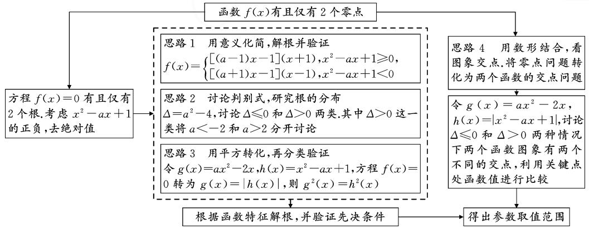
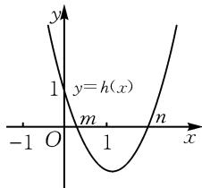
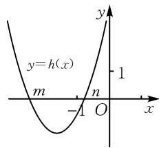
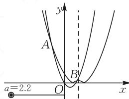
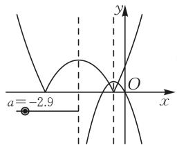

# 讲题比赛获奖论文

# 聚焦问题特征 实施有效策略

——以 2023 年天津卷第 15 题为例

● 天津市第一 ○ 二中学 纪洪伟  
● 天津市河东区教师发展中心 刘春红

# 1 试题呈现

(2023年天津卷第15题)若函数 $f(x) = ax^{2} - 2x - |x^{2} - ax + 1|$ 有且仅有两个零点，则 $a$ 的取值范围为 \_\_\_\_.

# 2 分析与思维导图

本题考查由函数零点个数求参数的取值范围.解答函数零点问题时,可利用函数与方程思想将函数 $f(x)$ 的零点转化为方程的根,通过研究方程的根从而解决函数的零点问题;也可以利用转化思想、数形结合思想将函数 $f(x)$ 的零点转化为两个新函数的交点的横坐标,结合图象解决问题.同时,本题属于含参问题,也要结合分类讨论思想研究不同情形.

本题函数中含有绝对值,实质上也是分段函数,因此,如何去绝对值比较关键.

思路 1 用意义化简,解根并验证

将函数解析式去绝对值后可得到 $f(x)=\left\{\begin{aligned}(a-1)x^{2}+(a-2)x-1,x^{2}-ax+1&\geqslant0,\\ (a+1)x^{2}-(a+2)x+1,x^{2}-ax+1&<0,\end{aligned}\right.$ 根据函数的结构特征因式分解，从而求出对应零点，分别在 a=1，a=-1 和 $a\neq1$ 且 $a\neq-1$ 的条件下验证零点是否满

足限制条件.

思路 2 讨论判别式,研究根的分布

令 $h(x)=x^{2}-ax+1=0$ ，分 $\Delta\leqslant0$ 和 $\Delta>0$ 两种情况讨论，从而得到对应分段函数解析式。其中当 $\Delta>0$ 时，解出方程 $f(x)=0$ 的根，分别为 $-1,\frac{1}{a-1},1$ 和 $\frac{1}{a+1}$ ，讨论根分布在对应限制区间内的情况。

思路 3 用平方转化,再分类验证

将函数 $f(x)$ 表示成两个函数的差. 令 $g(x) = ax^2 - 2x, h(x) = x^2 - ax + 1$ . 若 $f(x) = 0$ ，则 $g(x) = |h(x)|$ ，两边平方可以去掉绝对值，记作集合 $A_a = \{x \mid g^2(x) = h^2(x)\}$ . 将 $f(x) = 0$ 问题转化为 $x \in A_a$ 且 $g(x) \geqslant 0$ ，根据参数 $a$ 的范围分类验证.

思路 4 用数形结合,看图象交点

令 $g(x)=ax^{2}-2x, h(x)=|x^{2}-ax+1|$ ，于是将 $f(x)=0$ 转化成 $g(x)=h(x)$ ，构造出两个新函数 $g(x), h(x)$ 之后，在同一个坐标系中分别画出两个函数图象。依据题干要求，两个函数图象需要有两个公共点，寻找图象中关键点的位置信息，从而列出数量关系。

思维导图如图 1 所示.



<details>
<summary>flowchart</summary>

```mermaid
graph TD
    A["方程 f(x)=0 有且仅有2个根.考虑 x²−ax+1 的正负,去绝对值"] --> B["思路1 用意义化简,解根并验证"]
    B --> C["f(x)={[(a-1)x-1"](x+1),x²−ax+1≥0, [(a+1)x-1](x-1),x²−ax+1<0}]
    C --> D["思路2 讨论判别式,研究根的分布"]
    D --> E["Δ=a²-4,讨论 Δ≤0 和 Δ>0 两类.其中 Δ>0 这一类将 a<-2 和 a>2 分开讨论"]
    E --> F["思路3 用平方转化,再分类验证"]
    F --> G["令 g(x)=ax²-2x, h(x)=|x²−ax+1|,讨论 Δ≤0 和 Δ>0 两种情况下两个函数图象有两个不同的交点,利用关键点处函数值进行比较"]
    G --> H["根据函数特征解根,并验证先决条件"]
    H --> I["得出参数取值范围"]
    J["思路4 用数形结合,看图象交点.将零点问题转化为两个函数的交点问题"] --> K["令 g(x)=ax²-2x, h(x)=|x²−ax+1|,讨论 Δ≤0 和 Δ>0 两种情况下两个函数图象有两个不同的交点,利用关键点处函数值进行比较"]
    K --> L["得出参数取值范围"]
```
</details>

图1

# 3 试题解析

下面根据思维导图中的四种思路分别给出具体

的解析过程.

解析 1: 用意义化简, 解根并验证.

易得 $f(x)=ax^{2}-2x-|x^{2}-ax+1|=$ $\left\{\begin{aligned}(a-1)x^{2}+(a-2)x-1,x^{2}-ax+1&\geqslant0,\\ (a+1)x^{2}-(a+2)x+1,x^{2}-ax+1&<0,\end{aligned}\right.$ 进而可整理

为 $f(x)=\left\{\begin{aligned}[ (a-1)x-1](x+1),x^{2}-ax+1&\geqslant0,\\ [(a+1)x-1](x-1),x^{2}-ax+1&<0.\end{aligned}\right.$ 函数 $f(x)$ 有且仅有两个零点，即方程 $f(x)=0$ 有且仅有两个不等实根.

(1) $x^{2}-ax+1\geqslant0$ 时， $f(x)=\left[(a-1)x-1\right]\cdot(x+1)$ .  
①当 a=1 时，可知 $x^{2}-ax+1=\left(x-\frac{1}{2}\right)^{2}+\frac{3}{4}\geqslant0$ ，则 $f(x)=-x-1$ ，方程 $f(x)=0$ 只有一个实根 x=-1，不符合题意.  
② 当 $a \neq 1$ 时，由 $[(a - 1)x - 1](x + 1) = 0$ ，得 $x = -1$ 或 $\frac{1}{a - 1}$ ，验证条件 $x^2 - ax + 1 \geqslant 0$ ：

若-1是方程的根,则 $(-1)^{2}-a(-1)+1\geqslant0$ ,可得 $a\geqslant-2$ 且 $a\neq1$ ;

若 $\frac{1}{a-1}$ 是方程的根，则 $\left(\frac{1}{a-1}\right)^{2}-a\cdot\frac{1}{a-1}+1\geqslant0$ ，可得 $a\leqslant2$ 且 $a\neq1$ 。

(2) $x^{2}-ax+1<0$ 时， $f(x)=\left[(a+1)x-1\right]\cdot(x-1)$ .

①当 a = -1 时，可知 $x^{2} - ax + 1 = \left(x + \frac{1}{2}\right)^{2} + \frac{3}{4} \geqslant 0$ ，与 $x^{2} - ax + 1 < 0$ 矛盾.  
② 当 $a \neq -1$ 时，由 $[(a + 1)x - 1](x - 1) = 0$ ，得 $x = 1$ 或 $\frac{1}{a + 1}$ . 验证条件 $x^2 - ax + 1 < 0$ ：

若 1 是方程的根, 则 $1^{2}-a\cdot1+1<0$ , 可得 a>2;

若 $\frac{1}{a+1}$ 是方程的根，则 $\left(\frac{1}{a+1}\right)^{2}-a\cdot\frac{1}{a+1}+1<0$ ，可得a<-2。

由于方程 $f(x) = 0$ 有且仅有两个不等实根，则有三种可能，情况如下：

若两根分别为-1和 $\frac{1}{a-1}$ ，则 $\left\{\begin{aligned}-1\neq\frac{1}{a-1},\\ a\geqslant-2\text{且}a\neq1,\\ a\leqslant2\text{且}a\neq1,\end{aligned}\right.$ 可得 $-2\leqslant a\leqslant2$ ，且 $a\neq0,a\neq1$ ；

若两根分别为-1和1，则 $\left\{\begin{aligned}a&\geqslant-2\text{且}a\neq1,\\ a&>2,\end{aligned}\right.$ 可得a>2；

若两根分别为 $\frac{1}{a - 1}$ 和 $\frac{1}{a + 1}$ ，则 $\left\{ \begin{array}{l} a \leqslant 2 \text{且} a \neq 1, \\ a < -2, \end{array} \right.$ 可得 $a < -2$ 。

综上所述，a 的取值范围为 $(-∞,0)∪(0,1)∪(1,+∞)$ .

解析 2: 讨论判别式, 研究根的分布.

依题 $f(x) = ax^{2} - 2x - |x^{2} - ax + 1|$ ，如果函数 $f(x)$ 有且仅有两个零点，那么方程 $f(x) = 0$ 有且仅有两个不等实根. 设 $h(x) = x^{2} - ax + 1, \Delta = a^{2} - 4$ .

(1) 当 $\Delta \leqslant 0$ ，即 $-2 \leqslant a \leqslant 2$ 时， $h(x) \geqslant 0$ 恒成立，此时 $f(x) = (a - 1)x^{2} + (a - 2)x - 1$ .  
① 当 $a = 1$ 时，则 $f(x) = -x - 1$ ，方程 $f(x) = 0$ 只有一个实根 $x = -1$ ，不符合题意。  
② 当 $a \neq 1$ 时， $f(x) = [(a - 1)x - 1](x + 1)$ ，令 $f(x) = 0$ ，可得 x = -1 或 $\frac{1}{a - 1}$ .

若方程 $f(x)=0$ 有且仅有两个不等实根，则只需 $-1\neq\frac{1}{a-1}$ ，即 $a\neq0$ .

综合①②，可得 $-2 \leqslant a \leqslant 2$ ，且 $a \neq 0, a \neq 1$ .

(2) 当 $\Delta > 0$ ，即 a < -2 或 a > 2 时，令 $h(x) = 0$ 的两个根分别为 m, n，不妨设 m < n，则 $f(x)$ 即为 $f(x)=\left\{\begin{aligned}&\left[(a-1)x-1\right](x+1),&x\leqslant m\text{或}x\geqslant n,\\ &\left[(a+1)x-1\right](x-1),&m<x<n.\end{aligned}\right.$

① 当 a > 2 时，如图 2，由 $\left\{\begin{aligned}m+n &= a > 0,\\ mn &= 1,\end{aligned}\right.$ 得 0 < m < 1 < n.
令 $f(x)=0$ ，由 $[(a-1)x-1] \cdot (x+1)=0$ ，可得 x=-1 或 $\frac{1}{a-1}$ ，显然 -1 < m，则 x = -1



<details>
<summary>text_image</summary>

y
1
y=h(x)
m
-1 O 1 n x
</details>

图2

是方程的根，而 $h\left(\frac{1}{a - 1}\right) = \frac{-a + 2}{(a - 1)^2} < 0$ ，所以 $x = \frac{1}{a - 1}$ 不满足 $x \leqslant m$ 或 $x \geqslant n$ ，舍去；由 $[(a + 1)x - 1] \cdot (x - 1) = 0$ ，可得 $x = 1$ 或 $\frac{1}{a + 1}$ ，显然 $m < 1 < n$ ，则 $x = 1$ 是方程的根，而 $h\left(\frac{1}{a + 1}\right) = \frac{a + 2}{(a + 1)^2} > 0$ ，所以 $x = \frac{1}{a + 1}$ 不满足 $m < x < n$ ，舍去。所以，当 $a > 2$ 时，-1和1是方程 $f(x) = 0$ 两个根，则函数 $f(x)$ 有且仅有两个零点。

② 当 a<-2 时，如图 3，由 $\left\{\begin{aligned}m+n&=a<0,\\ mn&=1,\end{aligned}\right.$ 可知 m<-1<
n<0.



<details>
<summary>text_image</summary>

y=h(x)
m
-1
O
x
1
</details>

图 3

令 $f(x)=0$ ，由 $\left[(a-1)\cdot x-1\right](x+1)=0$ ，得 x=-1 或 $\frac{1}{a-1}$ ，显然 m<-1<n，则 x=

-1不是方程的根，应舍去.而 $h\left(\frac{1}{a - 1}\right) = \frac{-a + 2}{(a - 1)^2} >$ 0，所以 $x = \frac{1}{a - 1}$ 满足 $x\leqslant m$ 或 $x\geqslant n$ ，即 $x = \frac{1}{a - 1}$ 是方程的根.由 $[(a + 1)x - 1](x - 1) = 0$ ，可得到 $x = 1$ 或 $\frac{1}{a + 1}$ ，显然 $n <   1$ ，则 $x = 1$ 不是方程的根，舍去.而 $h\left(\frac{1}{a + 1}\right) = \frac{a + 2}{(a + 1)^2} <  0$ ，所以 $x = \frac{1}{a + 1}$ 满足 $m <   x <$ $n$ ，即 $x = \frac{1}{a + 1}$ 是方程的根.综上，当 $a <   - 2$ 时， $\frac{1}{a - 1}$ 和 $\frac{1}{a + 1}$ 是方程 $f(x) = 0$ 两个根，则函数 $f(x)$ 有且仅有两个零点.

综上所述， $a$ 的取值范围为 $(- \infty, 0) \cup (0, 1) \cup (1, +\infty)$ .

解析 3: 用平方转化, 再分类验证.

令 $g(x) = ax^2 - 2x, h(x) = x^2 - ax + 1$ ，则 $f(x) = g(x) - |h(x)|$ 。若 $f(x) = 0$ ，则 $g(x) = |h(x)|$ 。于是 $g^2(x) = h^2(x)$ ，即 $g^2(x) - h^2(x) = 0$ 。整理可得 $[g(x) - h(x)][g(x) + h(x)] = 0$ ，即 $[(a - 1)x - 1](x + 1)[(a + 1)x - 1](x - 1) = 0$ 。

记 $A_{a} = \{x\mid g^{2}(x) = h^{2}(x)\}$ ，则

$$
A _ {a} = \left\{ \begin{array}{l} \left\{\pm 1, \frac {1}{a - 1}, \frac {1}{a + 1} \right\}, a \neq 0, \pm 1, \pm 2, \\ \left\{\pm 1 \right\}, a = 0, \\ \left\{\pm 1, \frac {1}{2} \right\}, a = 1, \\ \left\{\pm 1, - \frac {1}{2} \right\}, a = - 1, \\ \left\{\pm 1, \frac {1}{3} \right\}, a = 2, \\ \left\{\pm 1, - \frac {1}{3} \right\}, a = - 2. \end{array} \right.
$$

若 $f(x) = 0$ ，等价于 $x\in A_{a}$ 且 $g(x)\geqslant 0$

其中 $g(1) = a - 2, g(-1) = a + 2, g\left(\frac{1}{a - 1}\right) = \frac{-a + 2}{(a - 1)^2}, g\left(\frac{1}{a + 1}\right) = -\frac{a + 2}{(a + 1)^2}.$

(1) 当 $a \neq 0, \pm 1, \pm 2$ 时, $g(1) \cdot g\left(\frac{1}{a - 1}\right) = -\frac{(a - 2)^2}{(a - 1)^2} < 0$ , $g(-1) \cdot g\left(\frac{1}{a + 1}\right) = -\frac{(a + 2)^2}{(a + 1)^2} < 0$ , 则集合 $\left\{1, \frac{1}{a - 1}\right\}$ 和 $\left\{-1, \frac{1}{a + 1}\right\}$ 中各有且仅有函数 $f(x)$ 的 1 个零点, 所以满足条件;

(2) 当 a=0 时， $g(1)=-2<0$ , $g(-1)=2>0$ ，函数 $f(x)$ 有且仅有 1 个零点，所以不满足条件；

(3) 当 a=1 时, $g(1)=-1<0$ , $g(-1)=3>0$ , $g\left(\frac{1}{2}\right)=-\frac{3}{4}<0$ , 函数 $f(x)$ 有且仅有 1 个零点, 所以不满足条件;  
(4) 当 a = -1 时, $g(1) = -3 < 0$ , $g(-1) = 1 > 0$ , $g\left(-\frac{1}{2}\right) = \frac{3}{4} > 0$ , 函数 $f(x)$ 有且仅有 2 个零点, 所以满足条件;  
(5) 当 a=2 时， $g(1)=0\geqslant0$ ， $g(-1)=4>0$ ， $g\left(\frac{1}{3}\right)=-\frac{4}{9}<0$ ，函数 $f(x)$ 有且仅有 2 个零点，所以满足条件；  
(6) 当 a = -2 时, $g(1) = -4 < 0$ , $g(-1) = 0 \geqslant 0$ , $g\left(-\frac{1}{3}\right) = \frac{4}{9} > 0$ , 函数 $f(x)$ 有且仅有 2 个零点, 所以满足条件.

综上所述，a 的取值范围为 $(-∞,0)∪(0,1)∪(1,+∞)$ .

解析 4: 用数形结合, 看图象交点.

由已知 $ax^2 - 2x - |x^2 - ax + 1| = 0$ 有且仅有两个根，转化为 $ax^2 - 2x = |x^2 - ax + 1|$ ，即 $y = ax^2 - 2x$ 与 $y = |x^2 - ax + 1|$ 函数图象有两个不同的交点。由于 $y = |x^2 - ax + 1|$ 带有绝对值，因此先考虑该函数的图象特点，令 $\Delta = a^2 - 4$ 。

(1) 当 $\Delta \leqslant 0$ ，即 $-2 \leqslant a \leqslant 2$ 时， $x^{2} - ax + 1 \geqslant 0$ 恒成立.

此时 $ax^2 - 2x = x^2 - ax + 1$ ，即 $(a - 1)x^2 + (a - 2)x - 1 = 0$ .

①当 a=1 时,该方程有且仅有一个实根,不合题意,舍去.  
② 当 $a \neq 1$ 时，保证 $(a - 1)x^{2} - (a - 2)x - 1 = 0$ 的判别式 $\Delta = a^2 > 0$ 成立即可，即 $a \neq 0$ .

此时 a 的取值范围为 $-2 \leqslant a \leqslant 2$ ，且 $a \neq 0, a \neq 1$ .

(2) 当 $\Delta > 0$ ，即 a < -2 或 a > 2 时，令 $g(x) = ax^{2} - 2x, h(x) = |x^{2} - ax + 1|$ .  
① 当 a > 2 时， $\frac{a}{2} > 1, \frac{2}{a} \in (0,1)$ ，易发现 $g(1) = h(1) = a - 2.$

如图 4 所示, 此时两个函数恒有两个不同的交点, 此时 a 的取值范围为 a > 2.

② 当 a < -2 时， $\frac{a}{2} < -1, \frac{2}{a} \in (-1,0)$ .



<details>
<summary>text_image</summary>

y
A
B
a=2.2 O x
</details>

图4

如图 5 所示, 此时只需要保证 $g\left(\frac{1}{a}\right) > h\left(\frac{1}{a}\right)$ 即可. 根据 $g\left(\frac{1}{a}\right) - h\left(\frac{1}{a}\right) =$ $-\frac{a+1}{a^{2}}>0$ , 解得 a<-1. 又
a<-2, 此时 a 的取值范围为
a<-2.

综上所述，a 的取值范围为 $(-∞,0)∪(0,1)∪(1,+∞)$ .



<details>
<summary>text_image</summary>

a=-2.9
O
x
y
</details>

图5

# 4 试题溯源

教材溯源: 在人教 A 版教材必修第一册习题中可以追溯到题目原型. 第 156 页第 13 题根据零点的个数求参数的取值范围; 第 160 页第 4 题根据方程解的个数求参数的取值范围.

(1)(必修第一册第156页第13题)有一道题“若函数 $f(x)=24ax^{2}+4x-1$ 在区间 $(-1,1)$ 内恰有一个零点，求实数a的取值范围”，某同学给出了如下解答：

由 $f(-1)f(1)=(24a-5)(24a+3)<0$ , 解得 $-\frac{1}{8}<a<\frac{5}{24}$ .

所以,实数 a 的取值范围是 $\left(-\frac{1}{8},\frac{5}{24}\right)$ .

上述解答正确吗？若不正确，请说明理由，并给出正确的解答.

(2)(必修第一册第160页第4题)已知函数 $f(x)=\left\{\begin{aligned}x^{3}+2x-3,x&\leqslant0,\\ -2+\ln x,x&>0,\end{aligned}\right.$ 求使方程 $f(x)=k(k<0)$ 的实数解个数分别为1,2,3时k的相应取值范围.

真题溯源:作为拔高题,近几年天津高考均考查了函数零点问题,而且都是含参的一元二次函数型.所以,此题型作为复习的重点,需要从一题多解的角度分析和解决.近三年高考题如下:

(3)(2020年天津高考第9题)已知函数 $f(x)=\left\{\begin{aligned}x^{3},&x\geqslant0,\\ -x,&x<0,\end{aligned}\right.$ 若函数 $g(x)=f(x)-|kx^{2}-2x|(k\in R)$ 恰有4个零点，则k的取值范围是().

A. $\left(-\infty,-\frac{1}{2}\right)\cup(2\sqrt{2},+\infty)$

B. $\left(-\infty,-\frac{1}{2}\right)\cup(0,2\sqrt{2})$

C. $(-∞,0)∪(0,2\sqrt{2})$

D. $(-∞,0)∪(2\sqrt{2},+∞)$

(4)(2021年天津高考第9题)设 $a\in R$ ，函数 $f(x)=\left\{\begin{aligned}\cos(2\pi x-2\pi a),&x<a,\\ x^{2}-2(a+1)x+a^{2}+5,x\geqslant a,\end{aligned}\right.$ 若函数 $f(x)$ 在区间 $(0,+\infty)$ 内恰有6个零点，则a的取值范围是（）.

A. $\left(2,\frac{9}{4}\right]\cup\left(\frac{5}{2},\frac{11}{4}\right]$

B. $\left(\frac{7}{4},2\right]\cup\left(\frac{5}{2},\frac{11}{4}\right]$

C. $\left(2,\frac{9}{4}\right]\cup\left[\frac{11}{4},3\right)$

D. $\left(\frac{7}{4},2\right)\cup\left[\frac{11}{4},3\right)$

(5)(2022年天津高考第15题)设 $a\in\mathbf{R}$ ，对任意实数x，记 $f(x)=\min\{|x|-2,x^{2}-ax+3a-5\}$ .若 $f(x)$ 至少有3个零点，则实数a的取值范围为\_\_\_\_.

# 5 变式练习

(1) 已知函数 $f(x)=\left|x^{2}-2x+\frac{1}{2}\right|$ ，若函数 $g(x)=f(x)-ax^{2}$ 有 4 个不同的零点，则实数 a 的取值范围为 \_\_\_\_.

分析:本题考查的是函数的零点与方程的关系,结合图象可得参数范围.

(2)设函数 $f(x) = \begin{cases} \ln x, & x > 0, \\ x^2 + (a + 2)x + 2a, & x \leqslant 0, \end{cases}$ 若方程 $f(x) = a|x| + 1$ 恰有2个实数解，则实数 $a$ 的取值范围是（ ）.

A. $(-∞,0]∪\left[\frac{1}{e^{2}},\frac{1}{2}\right]$

B. $\left(-\infty,\frac{1}{2}\right]\cup\left[1,+\infty\right)$

C. $(- \infty, 0] \cup \left\{\frac{1}{\mathrm{e}^2}\right\} \cup [1, +\infty)$

D. $(-∞,0]∪\left\{\frac{1}{e^{2}}\right\}∪\left[\frac{1}{2},+∞\right)$

分析:本题考查的是函数的零点与方程的关系,根据分段函数所过特殊点的位置对参数 a 进行分类讨论.

变式练习的具体解析略,可扫码查看.

  
扫码查看

# 6 小结

含参函数的零点问题,常以分段函数的形式来考查函数性质、函数零点的个数、参数的取值范围等问题,也充分体现了学生的直观想象与逻辑推理核心素养.对于已知分段函数零点的个数求参数范围问题,也可以考虑分离参数,将问题转化为新函数的交点问题.而本题分离参数比较复杂,因此不太适合用此方法.选择此法的关键是分离参数是否简洁方便.

总之,解决函数零点的个数问题,可以从方程和图象两个方面入手,利用方程思想和数形结合思想来处理.准确把握函数的零点、方程的根和两个函数图象的交点之间的联系,进行彼此之间的转化是解决该类问题的关键.在运用方程进行等式变形进而构造新函数时,要选择合适的函数,以便于作图、便于求出参数取值范围为原则.Z