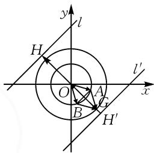

# 高中数学恒成立问题的求解策略探究

# ● 贵州省印江中学 赵 飞

摘要: 恒成立问题在高中数学中较为常见, 如何选择合适的解决方法是提高解题效率的关键. 本文中结合典型例题, 展示用分离参数法、数形结合法、构造函数法、赋值法四种常见的方法处理恒成立问题.

关键词:高中数学;恒成立问题;处理方法

高中数学恒成立问题指在给定的定义域内,某一或某些不等式、方程、函数取值等始终成立的一类问题.解答恒成立问题时,应针对不同的习题情境采取合理的处理方法.分离参数法、数形结合法、构造函数法、赋值法应用广泛,应做好应用研究,提高在解题中的应用意识,提升解答恒成立问题的效率.

# 1 分离参数法

分离参数法,是指将要求的参数经过变形、整理单独分离出来的一种处理方法 $^{[1]}$ .一般情况下,将参数分离后,应将解题的重点放在参数另一侧的数学式上,通过对数学式变形、运算,确定数学式的取值范围,根据参数与数学式的关系,确定最终的结果.

例 1 已知函数 $f(x)=x^{2}-x$ ，若对任意的 $x_{1}, x_{2} \in [1, +\infty)$ ，且 $x_{1} < x_{2}$ ，均有 $x_{2} f(x_{1}) - x_{1} f(x_{2}) > ax_{1} x_{2} (x_{2}^{2} - x_{1}^{2})$ 成立，则 a 的取值范围为（）.

$$
\mathrm{A.} [ 0, + \infty)
$$

$$
\mathrm{B.} \left(- \frac {1}{2}, 0\right)
$$

$$
\mathrm{C.} \left[ - \frac {1}{2}, + \infty\right)
$$

$$
\mathrm{D.} \left(- \infty , - \frac {1}{2} \right]
$$

解: 易得 $a < \frac{x_{2}f(x_{1}) - x_{1}f(x_{2})}{x_{1}x_{2}(x_{2}^{2} - x_{1}^{2})}$ ，又 $x_{2}f(x_{1}) - x_{1}f(x_{2}) = x_{2}(x_{1}^{2} - x_{1}) - x_{1}(x_{2}^{2} - x_{2}) = x_{1}x_{2} \cdot (x_{1} - x_{2})$ ，联立上述两式可得 $a < -\frac{1}{x_{1} + x_{2}}$ 。由 $1 < x_{1} < x_{2}$ ，得 $-\frac{1}{2} < -\frac{1}{x_{1} + x_{2}} < 0$ ，则满足题意的 a 的取值范围为 $\left(-\infty, -\frac{1}{2}\right]$ 。故选：D.

评析:该题考查函数、分离参数、不等式的性质等知识.解题时需要一定的技巧,一方面,观察所给的不等式,运用不等式的性质将参数 a 分离出来;另一方面,观察分离后参数另一边的数学式,借助函数解析式将 $x_{1}, x_{2}$ 代入,通过联立式子求出数学式的取值范围,参数 a 的取值范围也就不难确定了.

# 2 数形结合法

数与形联系紧密,为解决数学问题提供了一种可行的思路 $^{[2]}$ .在解决高中数学恒成立问题时,应用数形结合法可以避免烦琐的计算,使抽象的问题变得直观,从而快速求出结果.运用数形结合法求恒成立问题的关键在于深刻理解各种参数、数学式之间的关系,充分挖掘隐含条件,画出正确的图形.

例 2 已知 O 为坐标原点, 向量 $\overrightarrow{OA}$ 和 $\overrightarrow{OB}$ 为单位向量, 且满足 $(\overrightarrow{OA} + \overrightarrow{OB}) \cdot \overrightarrow{OB} = \frac{3}{2}$ , 点 C 在定直线 $y = x + 2\sqrt{2}$ 上, 若不等式 $|\overrightarrow{OA} + \overrightarrow{OB} + \overrightarrow{OC}| \geqslant T$ 恒成立, 则实数 T 的取值范围为 ( ).

$$
\mathrm{A.} (- \infty , 2 + \sqrt {3} ]
$$

$$
\mathrm{B.} (- \infty , 2 - \sqrt {3} ]
$$

$$
\mathrm{C.} (- \infty , 2 \sqrt {3} ]
$$

$$
\mathrm{D.} (- \infty , \sqrt {3} ]
$$

解: 因为向量 $\overrightarrow{OA}$ 和 $\overrightarrow{OB}$ 为单位向量, 则 $|\overrightarrow{OA}| = 1$ , $|\overrightarrow{OB}| = 1$ , $\overrightarrow{OA} \cdot \overrightarrow{OB} = |\overrightarrow{OA}| \cdot |\overrightarrow{OB}| \cdot \cos\langle\overrightarrow{OA}, \overrightarrow{OB}\rangle = \cos\langle\overrightarrow{OA}, \overrightarrow{OB}\rangle$ .

由 $(\overrightarrow{OA} +\overrightarrow{OB})\cdot \overrightarrow{OB} = \frac{3}{2}$ 得 $\overrightarrow{OA}\cdot \overrightarrow{OB} = \frac{1}{2}.$

由上述两式可以得到 $\cos\langle\overrightarrow{OA},\overrightarrow{OB}\rangle=\frac{1}{2}$ ，又由 $\langle\overrightarrow{OA},\overrightarrow{OB}\rangle\in[0,\pi]$ ，可得 $\langle\overrightarrow{OA},\overrightarrow{OB}\rangle=\frac{\pi}{3}$ ，即向量 $\overrightarrow{OA}$ 和 $\overrightarrow{OB}$ 的夹角为 $\frac{\pi}{3}$ 。所以点 A, B 同处在以 O 为圆心，以 1 为半径的圆上。

设 $\overrightarrow{OG} = \overrightarrow{OA} +\overrightarrow{OB}$ ，由向量的加法运算，易得 $|\overrightarrow{OG}| = |\overrightarrow{OA} +\overrightarrow{OB}| = \sqrt{3}$ ，则点 $G$ 在以 $O$ 为圆心，以 $\sqrt{3}$ 为半径的圆上. $|\overrightarrow{OA} +\overrightarrow{OB} +\overrightarrow{OC}| = |\overrightarrow{OG} +\overrightarrow{OC} |,$ $||\overrightarrow{OG} | - |\overrightarrow{OC} ||\leqslant |\overrightarrow{OG} +\overrightarrow{OC} |$ ，要想 $|\overrightarrow{OA} +\overrightarrow{OB} +\overrightarrow{OC} |$ 的值最小，则 $\overrightarrow{OG}$ 和 $\overrightarrow{OC}$ 在同一条直线上，且方向相反.画出直线 $y = x + 2\sqrt{2}$ 和直线 $y = x - 2\sqrt{2}$ 的图象，如图1所示.点C在图中的点H处，OH和直线 $y=x+2\sqrt{2}$ 垂直，最小值 $\left|\overrightarrow{GH^{\prime}}\right|=\frac{\left|2\sqrt{2}\right|}{\sqrt{2}}-\sqrt{3}=2-\sqrt{3}$ ，则T的取值范围为 $(-∞,2-√3]$ .故选：B.

text_image

y
l
H
O
A
B
G
H'
x
l'

图 1

评析:该题考查向量的运

算法则、圆的性质、点到直线的距离公式等.解题时，一方面，通过向量的加减运算、向量的数量积运算，推理出点 $A,B,G$ 在以 $O$ 为圆心的圆上，结合向量 $\overrightarrow{OA}$ 和 $\overrightarrow{OB}$ 的夹角、圆的半径及直线 $y = x + 2\sqrt{2}$ 画出对应的图形；另一方面，认真观察图形，确定当 $|\overrightarrow{OA} +\overrightarrow{OB} +$ $\overrightarrow{OC} |$ 取得最小值时点 $G$ 的具体位置，对照图形运用点到直线的距离公式计算.

# 3 构造函数法

构造函数法是高中数学解题中常用且难度较大的一种方法,是近年高考的热门考点.运用构造函数法解答恒成立问题时,需要深刻理解已知条件,结合解题经验,对所给的已知条件进行等价转化,通过观察数学式的形式构造函数.如构造的函数较为特殊,需要运用导数知识研究其单调性.

例 3 已知函数 $f(x)=(x+b)(ae^{x}-1)$ ，若 $f(x)\geqslant0$ 恒成立，则 a-b 的最小值为（）.

A. $\sqrt{e}$

B. $\ln 2$

C.e

D.1

解: 令 $f(x)=0$ , 得 x=-b 或 $x=\ln\frac{1}{a}$ , 即 x=-b 和 $x=\ln\frac{1}{a}$ 是函数 $f(x)$ 的零点. 显然 a>0. 由 $f(x)\geqslant0$ 恒成立, 得两个零点重合, 即 $-b=\ln\frac{1}{a}$ , 则 $a-b=a+\ln\frac{1}{a}$ . 令 $g(x)=x+\ln\frac{1}{x}(x>0)$ , 则 $g'(x)=1-\frac{1}{x}$ . 易得当 0<x<1 时, $g'(x)<0$ , 函数 $g(x)$ 单调递减; 当 x>1 时, $g'(x)>0$ , 函数 $g(x)$ 单调递增. 所以 $g(x)_{\min}=g(1)=1$ , 则 a-b 的最小值为 1. 故选: D.

点评:该题考查函数零点、构造函数法、导数等知识.解题难点在于结合已知条件及解题经验确定“x=-b 和 $x=\ln\frac{1}{a}$ 是函数 $f(x)$ 的零点”且两个零点重合,得出“ $-b=\ln\frac{1}{a}$ ”.在此基础上,构造函数.

# 4 赋值法

赋值法是指基于对已知条件的认识,赋予某些参数或数学式特殊值的一种方法,用于高中数学恒成立问题,可以更好地揭示潜在的规律,化抽象为具体.需要注意的是,赋的值并非随意选取,应对照要求解的问题,确定要赋的值,为顺利解决问题作铺垫.

例 4 已知定义在 R 上的函数 $f(x)$ 满足 $f\left(\frac{\pi}{2}\right)=\frac{1}{2e}$ ，且对所有的 $x,y\in R$ ，均有 $e^{\sin x}\cdot f(y)-e^{\sin y}\cdot f(x)\geqslant(e^{2\sin x}-e^{2\sin y})\cdot f(x)\cdot f(y)$ 恒成立，则 $f(x)$ 的最大值为（）.

A. $\frac{1}{2e}$

B. $\frac{1}{e}$

C.e

D.2e

解析: 令 $y=\frac{\pi}{2}$ ，则 $\mathrm{e}^{\sin x}\cdot f\left(\frac{\pi}{2}\right)-\mathrm{e}^{\sin\frac{\pi}{2}}\cdot f(x)\geqslant e^{2\sin\frac{\pi}{2}}\left(\mathrm{e}^{2\sin x}-\mathrm{e}^{2\sin\frac{\pi}{2}}\right)\cdot f(x)\cdot f\left(\frac{\pi}{2}\right)$ 。又 $f\left(\frac{\pi}{2}\right)=\frac{1}{2\mathrm{e}}$ ，所以 $\frac{1}{2\mathrm{e}}\cdot\mathrm{e}^{\sin x}-\mathrm{e}\cdot f(x)\geqslant\frac{1}{2\mathrm{e}}\cdot(\mathrm{e}^{2\sin x}-\mathrm{e}^{2})\cdot f(x)$ ，整理得 $f(x)\leqslant\frac{\mathrm{e}^{\sin x}}{\mathrm{e}^{2\sin x}+\mathrm{e}^{2}}$ 。

易知 $\sin x\in [-1,1]$ ，令 $m = \mathrm{e}^{\sin x}\in \left[\frac{1}{\mathrm{e}},\mathrm{e}\right]$ ，则 $f(x)\leqslant \frac{m}{m^2 + \mathrm{e}^2} = \frac{1}{m + \frac{\mathrm{e}^2}{m}}.$ 由对勾函数的性质，可得 $y =$ $m + \frac{\mathrm{e}^2}{m}$ 在 $\left[\frac{1}{\mathrm{e}},\mathrm{e}\right]$ 上单调递减，最小值为 $2\mathrm{e}$ ，所以 $\frac{m}{m^2 + \mathrm{e}^2}$ 的最大值为 $\frac{1}{2\mathrm{e}}.$ 又 $f(x)\leqslant \frac{m}{m^2 + \mathrm{e}^2}$ ，则 $f(x)$ 的最大值为 $\frac{1}{2\mathrm{e}}.$ 故选：A.

评析:该题考查三角函数、换元法、对勾函数等知识.解题时,通过令 $y=\frac{\pi}{2}$ 结合已知条件,对所给的不等式进行转化、整理得到“ $f(x)\leqslant\frac{\mathrm{e}^{\sin x}}{\mathrm{e}^{2\sin x}+\mathrm{e}^{2}}$ ”.在此基础上,通过换元,将要求的问题转化求对勾函数的最值问题.

# 参考文献：

[1] 杨新. 解答不等式恒成立问题的三种途径 [J]. 语数外学习 (高中版下旬), 2024(11): 45.

[2] 黄勇娇. 高中数学常见的恒成立问题的一般解法 [J]. 数理天地 (高中版), 2024(17): 10-11. Z