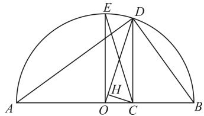

# “威力十足”的不等式链的应用

# ■王朝中

不等式链： $\frac{2}{\frac{1}{a} + \frac{1}{b}}\leqslant \sqrt{ab}\leqslant \frac{a + b}{2}\leqslant$ $\sqrt{\frac{a^{2}+b^{2}}{2}}(a,b\in\mathbf{R}_{+})$ ，当且仅当a=b时等号成立。不等式链揭示了两个变量 $a,b\in\mathbf{R}_{+}$ 的倒数和、积、和，以及平方和之间的不等关系，当这四个量中有一个为定值时，其他三个量都能取到最值。

# 一、数学文化中的“不等式链”

例 1 如图 1, 以 AB 为直径作半圆, 圆心为 O。过直径 AB 上一点 C 作 CD 垂直于 AB, 交半圆于点 D, 连接 AD, BD。你能利用这个图形得出不等式链的几何解释吗?

text_image

Geometric diagram of a semicircle with inscribed points and lines, labeled with letters A through H.

图1

解:不妨设 AC=a, CB=b，且 a>b，则以 O 为圆心的圆的半径 $r=\frac{a+b}{2}$ 。作 $OE \perp AB$ ，交半圆于点 E，则 $OE=\frac{a+b}{2}$ 。由 $CD^{2}=AC \cdot CB$ 得 $CD=\sqrt{ab}$ 。易得 $OC=\frac{a-b}{2}$ ， $CE=\sqrt{OE^{2}+OC^{2}}=\sqrt{\left(\frac{a+b}{2}\right)^{2}+\left(\frac{a-b}{2}\right)^{2}}=\sqrt{\frac{a^{2}+b^{2}}{2}}$ 。显然 $OD=\frac{a+b}{2}$ ，过点 C 作 $CH \perp OD$ 于点 H，则 $CD^{2}=DH \cdot OD$ ，所以 $DH=\frac{ab}{\frac{a+b}{2}}=\frac{2}{\frac{1}{a}+\frac{1}{b}}$ 。因为 CE>OE=OD\(>CD>DH\) ，所以当 \(a>b\) 时，\(\sqrt{\frac{a^2+b^2}{2}}>

$$
\frac {a + b}{2} > \sqrt {a b} > \frac {2}{\frac {1}{a} + \frac {1}{b}} 。
$$

natural_image

Silhouette of a person sitting on a ladder, gesturing with one hand (no text or symbols)

综上可得， $\frac{2}{\frac{1}{a} + \frac{1}{b}}\leqslant \sqrt{ab}\leqslant \frac{a + b}{2}\leqslant$ $\sqrt{\frac{a^{2}+b^{2}}{2}}$ ，其中 a, b 都是正数，当且仅当 a=b 时（点 C 与点 O 重合时）等号成立。

# 二、不等式求最值中的“不等式链”

例 2 若 a > 0, b > 0，且 $a + b = 4$ ，则下列不等式不恒成立的是（）。

A. $a^2 + b^2 \geqslant 8$

B. $\frac{1}{ab}\geqslant\frac{1}{4}$

C. $\sqrt{a} +\sqrt{b}\leqslant 2\sqrt{2}$

D. $\frac{1}{a} +\frac{1}{b}\leqslant 1$

解：对于 A，由 $a^{2}+b^{2}\geqslant2ab$ ，可得 $2(a^{2}+b^{2})\geqslant a^{2}+b^{2}+2ab=(a+b)^{2}$ 。因为 $a+b=4$ ，所以 $2(a^{2}+b^{2})\geqslant(a+b)^{2}=16$ ，即 $a^{2}+b^{2}\geqslant8$ ，当且仅当 a=b=2 时等号成立，A 正确。对于 B，由 $a+b=4$ ，可得 $a+b=4\geqslant2\sqrt{ab}$ ，即 $0<ab\leqslant4$ ，所以 $\frac{1}{ab}\geqslant\frac{1}{4}$ ，当且仅当 a=b=2 时等号成立，B 正确。对于 C，由 $a+b\geqslant2\sqrt{ab}$ ，可得 $2(a+b)\geqslant a+b+2\sqrt{ab}=(\sqrt{a}+\sqrt{b})^{2}$ ，所以 $8\geqslant(\sqrt{a}+\sqrt{b})^{2}$ ，即 $\sqrt{a}+\sqrt{b}\leqslant2\sqrt{2}$ ，当且仅当 a=b=2 时等号成立，C 正确。对于 D，易知 $\frac{1}{a}+\frac{1}{b}=\frac{1}{4}(a+b)\cdot\left(\frac{1}{a}+\frac{1}{b}\right)=\frac{1}{4}\left(1+\frac{a}{b}+\frac{b}{a}+1\right)\geqslant\frac{1}{4}\left(2+2\sqrt{\frac{a}{b}\cdot\frac{b}{a}}\right)=1$ ，即 $\frac{1}{a}+\frac{1}{b}\geqslant1$ ，当且仅当 a=b=2 时等号成立，D 错误。应选 D。

作者单位:陕西省洋县中学

(责任编辑 郭正华)