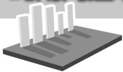

# 一、求值

例 1 （1）根据有关资料，围棋状态空间复杂度的上限 M 约为 $3^{361}$ ，而可观测宇宙中普通物质的原子总数 N 约为 $10^{80}$ ，则下列各数中与 $\frac{M}{N}$ 接近的是 \_\_\_\_。（参考数据： $\lg 3 \approx 0.48$ ）

A. $10^{33}$

B. $10^{53}$

C. $10^{73}$

D. $10^{93}$

(2)求值: $7^{\lg 20} \cdot \left(\frac{1}{2}\right)^{\lg 0.7} =$ \_\_\_\_。

解:(1)设 $x=\frac{M}{N}=\frac{3^{361}}{10^{80}}$ ，则 $\lg x=\lg\frac{M}{N}=$ $\lg M-\lg N=361\lg3-80\approx93.28$ ，所以 $x\approx10^{93.28}$ ，即 $\frac{M}{N}$ 最接近 $10^{93}$ 。应选 D。

(2) 设 $N = 7^{\lg 20} \cdot \left(\frac{1}{2}\right)^{\lg 0.7}$ , 两边取常用对数得 $\lg N = \lg 20 \cdot \lg 7 + \lg 0.7 \cdot \lg \frac{1}{2} = (1 + \lg 2) \cdot \lg 7 + (\lg 7 - 1) \cdot (-\lg 2) = \lg 7 + \lg 7 \cdot \lg 2 - \lg 2\lg 7 + \lg 2 = \lg 14$ , 所以 $N = 14$ , 所以 $7^{\lg 20} \cdot \left(\frac{1}{2}\right)^{\lg 0.7} = 14$ 。

# 二、解方程

例 2 设函数 $f(x)=a^{x-\frac{1}{2}}(a>0,a\neq1)$ ，且满足 $f(\lg a)=\sqrt{10}$ ，求 a 的取值范围。

解:由 $f(\lg a)=\sqrt{10}$ ，可得 $a^{\lg a-\frac{1}{2}}=\sqrt{10}$ ，两边取常用对数得 $\left(\lg a-\frac{1}{2}\right)\lg a=\lg\sqrt{10}=\frac{1}{2}$ ，所以 $(\lg a)^{2}-\frac{1}{2}\lg a-\frac{1}{2}=0$ ，所以 $\lg a=1$ 或 $\lg a=-\frac{1}{2}$ ，解得 a=10 或 $a=\frac{\sqrt{10}}{10}$ 。

或者，由 $a^{\lg a - \frac{1}{2}} = \sqrt{10}$ ，可得 $\lg a - \frac{1}{2} =$ $\log_a\sqrt{10} = \frac{\lg\sqrt{10}}{\lg a}$ ，所以 $(\lg a)^2 -\frac{1}{2}\lg a-$ $\frac{1}{2} = 0$ 。由此解得 $a = 10$ 或 $a = \frac{\sqrt{10}}{10}$

# 三、解不等式

例 3 光线每通过一块玻璃板,其强度要损失 10%, 把几块这样的玻璃板重叠起来, 设光线原来的强度为 a, 通过 x 块这样的玻璃板以后的强度为 y。

(1)试写出 y 关于 x 的函数关系式。

# 巧用两边取对数法解题

natural_image

3D illustration of a microchip or circuit board with vertical bars on top (no text or symbols)

# ■张振继(特级教师)

(2)通过多少块玻璃板以后,光线强度减弱到原来的 $\frac{1}{3}$ 以下?(参考数据: $\lg 3\approx0.4771$ )

解:(1)由已知条件得 $y=a(1-10\%)^{x}$ $(x\geqslant1,x\in\mathbf{N})$ 。

(2)由题意得 $a(1 - 10\%)^x \leqslant \frac{1}{3} a$ ，两边取常用对数得 $\lg \left(\frac{9}{10}\right)^x \leqslant \lg \frac{1}{3}$ ，即 $x \lg \frac{9}{10} \leqslant \lg \frac{1}{3}$ 。因为 $\lg \frac{9}{10} < 0$ ，所以 $x \geqslant \frac{\lg \frac{1}{3}}{\lg \frac{9}{10}} = \frac{-\lg 3}{2 \lg 3 - 1} \approx 10.4$ 。取 $x = 11$ ，故通过11块玻璃板以后，光线强度减弱到原来的 $\frac{1}{3}$ 以下。

# 四、求参数的取值范围

例 4 若 $2^{2x} < 2a^{x+1}$ 对任意的 $x \in [0,1]$ 成立，则正数 a 的取值范围是 \_\_\_\_。

解:由 $2^{2x}<2a^{x+1}$ ，可得 $2^{2x-1}<a^{x+1}$ ，两边取常用对数得 $(2x-1)\lg 2<(x+1)\lg a$ ，即 $x\lg\frac{4}{a}-\lg(2a)<0$ 。设函数 $f(x)=x\lg\frac{4}{a}-\lg(2a)$ 。由 $f(x)<0$ ，可得 $\left\{\begin{aligned}&f(0)<0,\\ &f(1)<0,\end{aligned}\right.$ 即 $\left\{\begin{aligned}&-\lg(2a)<0,\\&\lg\frac{4}{a}-\lg(2a)<0,\end{aligned}\right.$ 解得 $a>\sqrt{2}$ ，故正数 a 的取值范围是 $(\sqrt{2},+\infty)$ 。

或者，由 $2^{2x - 1} < a^{x + 1}$ ，可得 $a > 2^{\frac{2x - 1}{x + 1}} = 2^{2 - \frac{3}{x + 1}}, x \in [0,1]$ 。因为 $g(x) = 2^{2 - \frac{3}{x + 1}}$ 在 $[0, 1]$ 上为增函数，所以 $g(x)_{\max} = g(1) = \sqrt{2}$ ，故正数 $a$ 的取值范围是 $(\sqrt{2}, +\infty)$ 。

作者单位:河南省商丘市夏邑县佳合高中

(责任编辑 王琼霞)