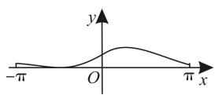
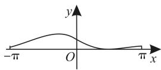
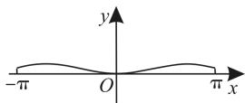
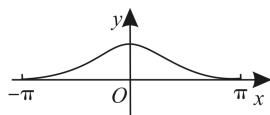

特殊值法,也叫特值法,它是通过设题中某个未知量为特殊值,利用简单的运算,得出最终答案的一种方法。下面举例分析特殊值法在解题中的应用。

# 一、求函数的值

例 1 已知函数 $f(x)$ 与 $g(x)$ 分别是定义域上的奇函数与偶函数，且 $f(x)+g(x)=x^{2}-\frac{1}{x+1}-2$ ，则 $f(2)=(\quad)$ 。

A. $-\frac{2}{3}$

B. $\frac{7}{3}$

C.-3

D. $\frac{11}{3}$

解析: 令 x=2, 可得 $f(2)+g(2)=4-\frac{1}{3}-2=\frac{5}{3}$ 。

再令 x = -2，可得 $f(-2) + g(-2) = 4 - \frac{1}{-2 + 1} - 2 = 3$ 。因为函数 $f(x)$ 与 $g(x)$ 分别是定义域上的奇函数与偶函数，所以 $f(2) = -f(-2)$ ， $g(2) = g(-2)$ ，所以 $-f(2) + g(2) = 3$ 。

上述两式相减得 $2f(2)=\frac{5}{3}-3=-\frac{4}{3}$ ，
所以 $f(2)=-\frac{2}{3}$ 。应选 A。

评注: 奇函数和偶函数的定义域关于原点对称。

# 二、求参数的值

例 2 已知函数 $f(x)=\frac{x^{2}+1}{(3x+2)(x-a)}$ 为偶函数，则 $a=(\quad)$ 。

A. $-\frac{4}{3}$

B. $\frac{2}{3}$

C. $-\frac{8}{3}$

D. $\frac{1}{3}$

解析: 因为 $f(x)$ 为偶函数, 所以 $f(-1)=f(1)$ , 所以 $\frac{(-1)^{2}+1}{[3\times(-1)+2](-1-a)}=\frac{1+1}{(3+2)(1-a)}$ , 解得 $a=\frac{2}{3}$ 。检验知 $a=\frac{2}{3}$ 符合题意。应选 B。

评注: 若定义在 I 上的函数 $f(x)$ 是偶函数, 且 $-a, a \in I$ , 则 $f(a) = f(-a)$ ; 若函数 $f(x)$ 为奇函数, 则 $f(a) = -f(-a)$ 。

text_image

巧用特殊值法解题

text_image

■吴衡

# 三、求函数的最值

例 3 定义在 $(0,+\infty)$ 上的函数 $f(x)$ ，对于任意的 $x,y\in(0,+\infty)$ ，总有 $f(x)+f(y)=f(xy)$ ，当x>1时， $f(x)<0$ 且 $f(e)=-1$ 。

(1) 判断函数 $f(x)$ 在 $(0, +\infty)$ 上的单调性，并证明。  
(2) 求函数 $f(x)$ 在 $\left[\frac{1}{e}, e^{2}\right]$ 上的最大值与最小值。

解析:(1) $f(x)$ 在 $(0,+\infty)$ 上单调递减。

证明如下: 设 $x_{1} > x_{2} > 0$ ，令 $xy = x_{1}$ ， $x = x_{2}$ ，则 $y = \frac{x_{1}}{x_{2}} > 1$ ，即 y > 1，所以 $f(y) < 0$ ，所以 $f\left(\frac{x_{1}}{x_{2}}\right) < 0$ 。由已知条件得 $f(x_{2}) + f\left(\frac{x_{1}}{x_{2}}\right) = f(x_{1})$ ，即 $f(x_{1}) - f(x_{2}) = f\left(\frac{x_{1}}{x_{2}}\right) < 0$ ，所以 $f(x_{1}) < f(x_{2})$ ，所以函数 $f(x)$ 在 $(0, +\infty)$ 上单调递减。

(2)已知 $f(\mathrm{e})=-1$ ，令 x=y=e，可得 $f(\mathrm{e}^{2})=f(\mathrm{e})+f(\mathrm{e})=-2$ 。令 x=y=1，可得 $f(1)+f(1)=f(1)$ ，即 $f(1)=0$ 。令 x=e， $y=\frac{1}{e}$ ，可得 $f(1)=f(\mathrm{e})+f\left(\frac{1}{\mathrm{e}}\right)=0$ ，即 $f\left(\frac{1}{\mathrm{e}}\right)=1$ 。

由(1)知函数 $f(x)$ 在 $\left[\frac{1}{e}, e^{2}\right]$ 上单调递减，所以 $f(x)_{\max} = f\left(\frac{1}{e}\right) = 1, f(x)_{\min} =$

$$
f \left(\mathrm{e} ^ {2}\right) = - 2 。
$$

评注: 函数 $f(x)$ 在 $[a, b]$ 上单调递减，则 $f(x)_{\max} = f(a)$ , $f(x)_{\min} = f(b)$ ; 函数 $f(x)$ 在 $[a, b]$ 上单调递增，则 $f(x)_{\max} = f(b)$ , $f(x)_{\min} = f(a)$ 。

# 四、比较大小

例 4 （1）已知 a < b < 0，则下列不等式恒成立的是（）。

A. $\frac{1}{a}<\frac{1}{b}$

B. $\frac{1}{a}>\frac{1}{b}$

C. $a^2 < b^2$

D. $\frac{a}{b}<1$

(2) 已知 $a > b > c > 1$ ，且 $ac < b^2$ 则（ ）。

A. $\log_a b > \log_b c > \log_c a$   
B. $\log_{c}b > \log_{b}a > \log_{a}c$   
C. $\log_b c > \log_a b > \log_c a$   
D. $\log_{b}a > \log_{c}b > \log_{a}c$

解析:(1)已知 a<b<0, 不妨令 a=-3, b=-2, 则 $-\frac{1}{3}>-\frac{1}{2}$ , 即 $\frac{1}{a}>\frac{1}{b}$ , A 不成立, B 成立。由 $(-3)^{2}>(-2)^{2}$ , C 不成立。由 $\frac{a}{b}=\frac{-3}{-2}>1$ , D 不成立。应选 B。

(2)已知 a > b > c > 1，且 $ac < b^{2}$ ，不妨令 a = 4, b = 3, c = 2，则 $\log_{4}3 < 1, \log_{3}2 < 1, \log_{2}4 = 2 > 1$ ，A，C 不成立。令 a = 6, b = 4, c = 2，则 $2 > \log_{4}6 > 1, \log_{2}4 = 2, \log_{6}2 < 1$ ，即 $\log_{c}b > \log_{b}a > \log_{a}c$ ，B 成立，D 不成立。应选 B。

评注: 对数式 $\log_{a}b(a>0,$ 且 $a\neq1,b>0)$ ，当 a>b 时， $\log_{a}b<1;$ 当 a<b 时， $\log_{a}b>1;$ 当 a=b 时， $\log_{a}b=1$ 。

# 五、求周期点

例 5 （多选题）华人数学家李天岩和美国数学家约克给出了“混沌”的数学定义，由此发展的混沌理论在生物学、经济学和社会学等领域都有重要作用。在混沌理论中，函数的周期点是一个关键概念，定义如下：设 $f(x)$ 是定义在 R 上的函数，对于 $x \in R$ ，令 $x_{n} = f(x_{n-1}) (n = 1, 2, 3, \cdots)$ ，若存在正整数 k，使得 $x_{k} = x_{0}$ ，且当 0 < j < k 时， $x_{j} \neq x_{0}$ ，则称 $x_{0}$ 是 $f(x)$ 的一个周期为 k 的周期点。若

函数 $f(x)=\left\{\begin{aligned}&2x,x<\frac{1}{2},\\ &2(1-x),x\geqslant\frac{1}{2},\end{aligned}\right.$ 则下列各值是 $f(x)$ 周期为 1 的周期点的是（）。

A. 0

B. $\frac{1}{3}$

C. $\frac{2}{3}$

D. 1

解析:对于 A, 当 $x_{0}=0$ 时, $x_{1}=f(0)=0=x_{0}$ , 符合题意, A 正确。对于 B, 当 $x_{0}=\frac{1}{3}$ 时, $x_{1}=f\left(\frac{1}{3}\right)=\frac{2}{3}$ , $x_{2}=f\left(\frac{2}{3}\right)=\frac{2}{3}$ , $x_{3}=\cdots=x_{n}=\frac{2}{3}$ , 所以 $\frac{1}{3}$ 不是 $f(x)$ 的周期点, B 错误。对于 C, 当 $x_{0}=\frac{2}{3}$ 时, 结合选项 B 得 $x_{1}=x_{2}=\cdots=x_{n}=\frac{2}{3}=x_{0}$ , 符合题意, C 正确。对于 D, 当 $x_{0}=1$ 时, $x_{1}=f(1)=0\neq x_{0}$ , 结合选项 A 知 1 不是 $f(x)$ 周期为 1 的周期点, D 错误。应选 AC。

评注:仔细品味新定义的概念、法则,对新定义所提取的信息进行加工,探求解决的方法。对新定义问题,应采取以下策略:首先,注重审题,提升对题目的理解能力;其次,重视知识的拓展;再次,强化知识间的联系。

函数 $y=\frac{1+\sin x}{2^{x}+2^{-x}}$ 在区间 $[-π,π]$ 上的图像可能是（）。

text_image

-π
O
y
π x

A

text_image

-π
O
y
π x

B

text_image

-π
O
y
π x

C

text_image

-π
O
y
π x

D

提示: 当 x=0 时, $y=\frac{1}{2}$ , 排除 C。当 $x=-\frac{\pi}{2}$ 时, y=0, 排除 B, D。应选 A。

作者单位:江苏省启东市吕四中学

(责任编辑 王琼霞)