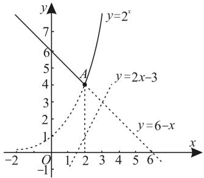

natural_image

Illustration of a person sitting at a desk with books and papers (no text or symbols visible)

# 求函数的值域（最值）的九种常用方法

# ■邓高雄

# 一、反解法

例1 函数 $y = \frac{1 - |x|}{1 + |x|}$ 的值域是\_\_\_\_。

解析:由 $y=\frac{1-|x|}{1+|x|}$ ，可得 $|x|=\frac{1-y}{1+y}$ 。因为 $|x|\geqslant0$ ，所以 $\frac{1-y}{1+y}\geqslant0$ 且 $y\neq-1$ ，所以 $-1<y\leqslant1$ ，即函数 $y=\frac{1-|x|}{1+|x|}$ 的值域是 $(-1,1]$ 。

评注: 解题时, 由已知解析式解出 $\left|x\right|$ , 根据 $\left|x\right| \geqslant 0$ 求出 y 的取值范围, 但要注意 $1 + y \neq 0$ 的情况。

# 二、判别式法

例 2 函数 $y=\frac{2x}{3+x^{2}}$ 的值域为 \_\_\_\_。

解析: 因为 $y=\frac{2x}{3+x^{2}}$ ，所以函数的定义域为 $x\in R$ ，所以函数 $y=\frac{2x}{3+x^{2}}$ 可化为关于 x 的一元二次方程 $yx^{2}-2x+3y=0$ 。

当 $y \neq 0$ 时，由 $x \in \mathbb{R}$ 结合 $\Delta = 4 - 12y^2 \geqslant 0$ 得 $-\frac{\sqrt{3}}{3} \leqslant y \leqslant \frac{\sqrt{3}}{3}$ ；当 $y = 0$ 时，可得 $x = 0$ ，且 $y = 0 \in \left[-\frac{\sqrt{3}}{3}, \frac{\sqrt{3}}{3}\right]$ 。

故函数 $y = \frac{2x}{3 + x^2}$ 的值域为 $\left[-\frac{\sqrt{3}}{3}, \frac{\sqrt{3}}{3}\right]$ 。

评注: 函数的值域与自变量的取值有关, 因此要注意函数的定义域。解题时, 要注意对 y=0 情况的讨论。

# 三、配方法

例3 函数 $y = \sqrt{-2x^2 + x + 3}$ 的值域为 \_\_\_\_。

解析: 因为函数 $y=\sqrt{-2\left(x-\frac{1}{4}\right)^{2}+\frac{25}{8}}$ ,

所以 $0 \leqslant y \leqslant \sqrt{\frac{25}{8}} = \frac{5\sqrt{2}}{4}$ , 所以此函数的值域为 $\left[0, \frac{5\sqrt{2}}{4}\right]$ 。

评注:对于二次函数 $y=ax^{2}+bx+c=a\left(x+\frac{b}{2a}\right)^{2}+\frac{4ac-b^{2}}{4a}(a\neq0)$ ，当 a>0 时，此函数有最小值 $\frac{4ac-b^{2}}{4a}$ ; 当 a<0 时，此函数有最大值 $\frac{4ac-b^{2}}{4a}$ 。

# 四、基本不等式法

例 4 函数 $y=\frac{(x+5)(x+2)}{x+1}(x>-1)$ 的最小值是 \_\_\_\_。

解析: 已知 x > -1, 可得 $x + 1 > 0$ 。

函数 $y=\frac{[(x+1)+4][(x+1)+1]}{x+1}=$ $\frac{(x+1)^{2}+5(x+1)+4}{x+1}=(x+1)+\frac{4}{x+1}+5\geqslant2\sqrt{(x+1)\cdot\frac{4}{x+1}}+5=9$ ，当且仅当 $x+1=\frac{4}{x+1}$ ，即x=1时等号成立，所以此函数的最小值是9。

评注: 已知 x, y 都是正数, 若积 xy 等于定值, 则当 x = y 时, 其和 $x + y$ 有最小值。

# 五、单调性法

例 5 函数 $f(x)=\left(\frac{1}{3}\right)^{x}-\log_{2}(x+2)$ 在区间 $[-1,1]$ 上的最大值为\_\_\_\_。

解析: 因为函数 $y=\left(\frac{1}{3}\right)^{x}$ 和函数 $y=-\log_{2}(x+2)$ 在区间 $[-1,1]$ 上均单调递减，所以函数 $f(x)=\left(\frac{1}{3}\right)^{x}-\log_{2}(x+2)$ 在区间 $[-1,1]$ 上单调递减，所以函数 $f(x)$ 的最大值为 $f(-1)=\left(\frac{1}{3}\right)^{-1}-\log_{2}1=3$ 。

评注:单调递减函数减去单调递增函数是单调递减函数。

# 六、换元法

例6 函数 $f(x) = x + \sqrt{x - 1}$ 的最小值为 \_\_\_\_。

解析: 令 $t=\sqrt{x-1}$ ，且 $t\geqslant0$ ，则 $x=t^{2}+1$ ，所以函数 $f(x)$ 等价于 $y=t^{2}+1+t, t\geqslant0$ ，配方得 $y=\left(t+\frac{1}{2}\right)^{2}+\frac{3}{4}, t\geqslant0$ 。因为 $t\geqslant0$ ，所以 $y\geqslant\frac{1}{4}+\frac{3}{4}=1$ ，故函数 $f(x)=x+\sqrt{x-1}$ 的最小值为 1。

评注: 利用换元法解题时要注意新元的取值范围。

# 七、数形结合法

例 7 定义 $\max\{a,b,c\}$ 为 a,b,c 中的最大值，设 $h(x)=\max\{2^{x},2x-3,6-x\}$ ，则 $h(x)$ 的最小值是（）。

A. 2

B. 3

C. 4

D. 6

解析: 已知函数 $h(x)=\max\{2^{x},2x-3,6-x\}$ ，在同一直角坐标系中画出函数 $y=2^{x},y=2x-3,y=6-x$ 的图像，如图 1 所示，则函数 $h(x)$ 的图像为图中的实线部分。

line

| Point | x | y |
|---|---|---|
| A | 2 | 4 |
| y=2^x | 1 | 7 |
| y=2x-3 | 2 | 4 |
| y=6-x | 6 | 0 |

图1

由图可知, 函数 $h(x)$ 在点 A 处取得最小值 $2^{2}=6-2=4$ , 故 $h(x)$ 的最小值为 4。应选 C。

评注: 利用图像法求函数最值的一般步骤: 画出函数的图像; 利用图像的交点找最高点、最低点; 确定函数的最大(小)值。

# 八、绝对值不等式法

例8 函数 $y = |x + 1| + |x - 2|$ 的值域为 \_\_\_\_。

解析: 因为 $\left|x+1\right|+\left|x-2\right|\geqslant\left|(x+1)\right)$

$-(x-2)|=3$ , 所以函数的值域为 $[3, +\infty)$ 。

评注:绝对值不等式的性质为 $\left|\left|a\right|-\left|b\right|\right|\leqslant\left|a\pm b\right|\leqslant\left|a\right|+\left|b\right|$ 。

# 九、正弦函数性质法

例 9 函数 $y=\frac{\sin x-1}{\cos x-2}$ 的值域是 \_\_\_\_。

解析:由 $y=\frac{\sin x-1}{\cos x-2}$ ，可得 $y(\cos x-2)=\sin x-1$ ，化简整理得 $1-2y=\sin x-y\cos x=\sqrt{1+y^{2}}\sin(x+\varphi)$ ，其中 $\varphi$ 为辅助角，所以 $\frac{1-2y}{\sqrt{1+y^{2}}}=\sin(x+\varphi)$ 。

由正弦函数的图像与性质得 $-1 \leqslant \sin (x + \varphi) \leqslant 1$ ，所以 $-1 \leqslant \frac{1 - 2y}{\sqrt{1 + y^2}} \leqslant 1$ ，所以 $\left|\frac{1 - 2y}{\sqrt{1 + y^2}}\right| \leqslant 1$ ，所以 $\frac{(1 - 2y)^2}{1 + y^2} \leqslant 1$ ，解得 $0 \leqslant y \leqslant \frac{4}{3}$ ，所以函数 $y = \frac{\sin x - 1}{\cos x - 2}$ 的值域是 $[0, \frac{4}{3}]$ 。

评注: 正弦函数 $y = \sin x, x \in R$ 是有界函数, 即 $\sin x \in [-1, 1], x \in R$ 。

# 感悟

已知定义在 R 上的函数 $f(x)$ 满足 $\forall x, y \in R, f(x + y) = f(x) + f(y) - 2024$ ，若函数 $g(x) = \frac{x\sqrt{2024 - x^{2}}}{2024 + x^{2}} + f(x)$ 的最大值和最小值分别为 M, m，则 $M + m =$ \_\_\_\_ 。

提示: 令 x=y=0，则 $f(0)=2f(0)-2024$ ，即 $f(0)=2024$ 。令 y=-x，则 $f(0)=f(x)+f(-x)-2024$ ，所以 $f(-x)-2024=-[f(x)-2024]$ ，所以 $h(x)=f(x)-2024$ 为奇函数，所以 $f(x)=h(x)+2024$ 。令 $G(x)=\frac{x\sqrt{2024-x^{2}}}{2024+x^{2}}+h(x)$ ，则 $G(-x)=-G(x)$ ，即 $G(x)$ 为奇函数，所以 $G(x)_{\max}+G(x)_{\min}=0$ 。又因为 $g(x)=\frac{x\sqrt{2024-x^{2}}}{2024+x^{2}}+h(x)+2024=G(x)+2024$ ，所以 $M+m=G(x)_{\max}+2024+G(x)_{\min}+2024=0+4048=4048$ 。

作者单位:湖北省巴东县第一高级中学

(责任编辑 王琼霞)