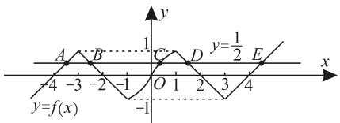

函数是高中数学的重点,也是同学们学习的一个难点。求解函数问题要有五种意识,下面举例说明。

# 一、要有函数性质的意识

对函数的考查,往往以多种函数的综合为载体,主要考查函数的性质及其应用。

例 1 已知函数 $f(x)=\mathrm{e}^{x}-\mathrm{e}^{-x}+\sin\frac{\pi}{4}x+1$ ，若对任意 $x\in[-2,2]$ ，都有 $f(x+1)+f(a-x^{2})>2$ ，则实数 a 的取值范围是 \_\_\_\_。

解: 因为 $y=e^{x}$ 与 $y=-e^{-x}$ 在定义域 R 上单调递增, 所以函数 $y=e^{x}-e^{-x}=e^{x}-\frac{1}{e^{x}}$ 在区间 $[-2,2]$ 上单调递增。对于 $y=\sin\frac{\pi}{4}x$ , 由 $-\frac{\pi}{2}+2k\pi\leqslant\frac{\pi}{4}x\leqslant\frac{\pi}{2}+2k\pi, k\in Z$ , 解得 $-2+8k\leqslant x\leqslant2+8k, k\in Z$ , 所以 $y=\sin\frac{\pi}{4}x$ 在 $[-2+8k,2+8k](k\in\mathbf{Z})$ 上单调递增, 当 k=0 时, $y=\sin\frac{\pi}{4}x$ 在区间 $[-2,2]$ 上单调递增, 所以函数 $f(x)=e^{x}-e^{-x}+\sin\frac{\pi}{4}x+1$ 在区间 $[-2,2]$ 上单调递增。令函数 $g(x)=f(x)-1=e^{x}-e^{-x}+\sin\frac{\pi}{4}x, x\in[-2,2]$ , 则 $g(-x)=e^{-x}-e^{x}-\sin\frac{\pi}{4}x=-g(x)$ , 所以 $g(x)$ 为奇函数且在 $[-2,2]$ 上单调递增。故原不等式等价于 $g(x+1)+g(a-x^{2})>0$ , 即 $g(x+1)>g(x^{2}-a)$ , 所以 $x+1>x^{2}-a$ 在 $[-2,2]$ 上恒成立, 即 $a>x^{2}-x-1$ 在 $[-2,2]$ 上恒成立。令函数 $h(x)=x^{2}-x-1, x\in[-2,2]$ , 则 $h(x)$ 在 $\left[-2,\frac{1}{2}\right]$ 上单调递减, 在 $\left[\frac{1}{2},2\right]$ 上单调递增。由 $h(2)=1, h(-2)=5$ , 结合二次函数 $h(x)$ 的图像得 $h(x)_{\max}=h(-2)=5$ , 所以 a>5, 即实数 a 的取值范围是 $\{a|a>5\}$ 。

# 二、要有函数图像的意识

利用函数图像可以直观地解决问题,尤其是对于选择题或填空题,十分有效。

例2 已知函数 $f(x)$ 是定义在 $\mathbf{R}$ 上的

# 求解函数问题要有五种意识

natural_image

Illustration of a woman holding a blueprints, no text or symbols present

# ■郑进连

奇函数，且当 $x \geqslant 0$ 时，函数 $f(x) = \left\{ \begin{array}{l} \log_2(x + 1), 0 \leqslant x < 1, \\ |x - 3| - 1, x \geqslant 1, \end{array} \right.$ 则方程 $f(x) = \frac{1}{2}$ 的所有实根之和为（ ）。

A. $\sqrt{2} - 2$

B. $\sqrt{2}+1$

C. $\sqrt{2}-1$

D. $\sqrt{2}$

解:由题意得方程 $f(x)=\frac{1}{2}$ 的实根是函数 $f(x)$ 的图像与直线 $y=\frac{1}{2}$ 的交点的横坐标。根据分段函数的解析式及 $f(x)$ 是定义在 R 上的奇函数，作出函数 $f(x)$ 与直线 $y=\frac{1}{2}$ 的图像，如图 1 所示。

line

| Point | x-axis position | y-axis value |
|---|---|---|
| A | -4 | 1 |
| B | -3 | 1 |
| C | -2 | 1 |
| D | -1 | 1 |
| E | 0 | 1 |
| F | 1 | -1 |
| G | 2 | -1 |
| H | 3 | -1 |
| I | 4 | -1 |

图1

由图可知， $y=\frac{1}{2}$ 与 $f(x)$ 的图像有 5 个交点，从左到右依次记为 A, B, C, D, E。根据 $f(x)=|x-3|-1(x\geqslant1)$ 的图像的对称性得 $x_{D}+x_{E}=6$ ，根据 $f(x)$ 是奇函数得 $x_{A}+x_{B}=-6$ ，所以 $x_{A}+x_{B}+x_{D}+x_{E}=-6+6=0$ 。由 $\log_{2}(x+1)=\frac{1}{2}$ 得 $x_{C}=\sqrt{2}-1$ ，所以 $x_{A}+x_{B}+x_{C}+x_{D}+x_{E}=\sqrt{2}-1$ 。应选 C。

# 三、要有换元的意识

当题目中出现的函数表达式比较复杂，且多处出现结构一致的代数式时，一般可采用局部换元法，通过换元将原函数化繁为简，这样有利于问题的解决。

例 3 函数 $y = x + \sqrt{x(2 - x)}$ 的值域为 \_\_\_\_。

解:(方法1)由 $x(2-x)\geqslant0$ 得 $0\leqslant x\leqslant2$ ，所以函数的定义域为 $[0,2]$ 。

令 $x = 2\sin^2\theta, \theta \in \left[0, \frac{\pi}{2}\right]$ ，则原函数等价于 $f(\theta) = 2\sin^2\theta + \sqrt{2\sin^2\theta(2 - 2\sin^2\theta)} = 2\sin^2\theta + 2\sin \theta \cos \theta = 1 - \cos 2\theta + \sin 2\theta = \sqrt{2}\sin \left(2\theta - \frac{\pi}{4}\right) + 1, \theta \in \left[0, \frac{\pi}{2}\right]$ 。

因为 $\theta \in \left[0, \frac{\pi}{2}\right]$ ，所以 $2\theta - \frac{\pi}{4} \in \left[-\frac{\pi}{4}, \frac{3\pi}{4}\right]$ ，所以 $-1 \leqslant \sqrt{2} \sin \left(2\theta - \frac{\pi}{4}\right) \leqslant \sqrt{2}$ ，所以 $\sqrt{2} \sin \left(2\theta - \frac{\pi}{4}\right) + 1 \in [0, \sqrt{2} + 1]$ ，所以函数 $y = x + \sqrt{x(2 - x)}$ 的值域为 $[0, \sqrt{2} + 1]$ 。

（方法2）由 $x(2 - x) = -(x - 1)^2 + 1 \geqslant 0$ ，可得 $(x - 1)^2 \leqslant 1$ ，所以 $-1 \leqslant x - 1 \leqslant 1$ ，所以令 $x - 1 = \sin \theta, \theta \in \left[-\frac{\pi}{2}, \frac{\pi}{2}\right]$ ，可得 $x = 1 + \sin \theta$ ，则原函数等价于 $f(\theta) = 1 + \sin \theta + \sqrt{(1 + \sin \theta)(2 - 1 - \sin \theta)} = 1 + \sin \theta + \cos \theta = \sqrt{2} \sin \left(\theta + \frac{\pi}{4}\right) + 1$ 。因为 $\theta \in \left[-\frac{\pi}{2}, \frac{\pi}{2}\right]$ ，所以 $\theta + \frac{\pi}{4} \in \left[-\frac{\pi}{4}, \frac{3\pi}{4}\right]$ ，所以 $-\frac{\sqrt{2}}{2} \leqslant \sin \left(\theta + \frac{\pi}{4}\right) \leqslant 1$ ，所以 $\sqrt{2} \sin \left(\theta + \frac{\pi}{4}\right) + 1 \in [0, \sqrt{2} + 1]$ ，所以函数 $y = x + \sqrt{x(2 - x)}$ 的值域为 $[0, \sqrt{2} + 1]$ 。

# 四、要有转化的意识

对于较复杂的函数问题,转化是一把“万能钥匙”,利用转化思维可以大大提高解题的效率,如揭示表达式的几何意义、将代数向几何转化、函数有零点问题转化为方程有解问题或两条曲线有交点问题、含参数不等式问题转化为函数的最值问题等。

例 4 若关于 x 的不等式 $(m-1)\sin^{2}x - m\sin x + m - 1 > 0$ 在 $\left(0, \frac{\pi}{2}\right]$ 上恒成立，则实数 m 的取值范围是 \_\_\_\_。

解: 令 $t=\sin x$ ，由 $x\in\left(0,\frac{\pi}{2}\right]$ 得 $t\in(0,1]$ ，则原不等式可转化为 $(m-1)t^{2}-mt+m-1>0$ 在 $t\in(0,1]$ 上恒成立，即 $(t^{2}-t+$ 1) $m > t^{2} + 1$ 在 $t \in (0,1]$ 上恒成立。

易得 $t^2 - t + 1 = \left(t - \frac{1}{2}\right)^2 + \frac{3}{4} > 0$ ，所以 $m > \frac{t^2 + 1}{t^2 - t + 1} = 1 + \frac{1}{t + \frac{1}{t} - 1}$ 在 $t \in (0, 1]$ 上

恒成立。令函数 $f(t) = t + \frac{1}{t} - 1$ ，则函数 $f(t)$ 在 $t \in (0,1]$ 上单调递减，所以 $f(t) \in [1, +\infty)$ ，所以 $1 + \frac{1}{t + \frac{1}{t} - 1} \in (1,2]$ ，故 $m > 2$ ，即实数 $m$ 的取值范围是 $(2, +\infty)$ 。

# 五、要有构造的意识

函数问题是每年高考的必考点,如比较大小问题、求解非常规不等式问题、求证函数不等式问题等,都可以借助函数的性质来解决,但有的题设中没有直接给出函数的表达式,这时可从问题的实际出发,构造恰当的函数,使所求问题迎刃而解。

例 5 已知 $f(x)$ 是定义在 R 上的偶函数，若对任意 $x_{1}, x_{2} \in [0, +\infty)$ 且 $x_{1} > x_{2}$ ，都有 $\frac{f(x_{1}) - f(x_{2})}{x_{1} - x_{2}} > x_{1} + x_{2}$ 恒成立，且 $f(3) = 0$ ，则满足 $f(m + 3) \leqslant m^{2} + 6m$ 的实数 m 的取值范围为（）。

A. $\left[-6,0\right]$

B. $[0,1]$

C. $[-3,2]$

D. $\left[-2,2\right]$

解：由 $\frac{f(x_1) - f(x_2)}{x_1 - x_2} > x_1 + x_2$ 可得 $f(x_{1}) - f(x_{2}) > x_{1}^{2} - x_{2}^{2}$ ，即 $f(x_{1}) - x_{1}^{2} > f(x_{2}) - x_{2}^{2}$ 。

设函数 $g(x)=f(x)-x^{2}$ ，则 $g(x_{1})>g(x_{2})$ 。因为 $x_{1}>x_{2}$ ，所以函数 $g(x)$ 在 $[0,+\infty)$ 上单调递增。又 $f(x)$ 是定义在 R 上的偶函数，所以 $g(-x)=f(-x)-(-x)^{2}=f(x)-x^{2}=g(x)$ ，所以 $g(x)$ 为 R 上的偶函数。由 $f(m+3)\leqslant m^{2}+6m$ ，可得 $f(m+3)-(m+3)^{2}\leqslant-9$ 。由 $g(3)=f(3)-9=-9$ ，可得 $g(m+3)\leqslant g(3)$ 。结合 $g(x)$ 的单调性和奇偶性得 $|m+3|\leqslant3$ ，解得 $-6\leqslant m\leqslant0$ 。应选 A。

作者单位:江苏省建湖县第二中学

(责任编辑 王琼霞)