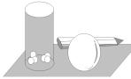

# 高一上半学年期末综合强化训练

# ■刘中亮(特级教师)

# 一、选择题

1. 已知集合 $A=\{x \mid x^{2}-2x-8>0\}$ ，则 $C_{R}A$ 等于（）。

A. $\left[-4,2\right]$

B. $(-4,2)$

C. $(-2,4)$

D. $\left[-2,4\right]$

2. 已知 $p: x + y > 3, q: x > 1$ 且 y > 2，则 q 是 p 的（）。

A. 充分不必要条件

B. 必要不充分条件

C. 充要条件

D. 既不充分也不必要条件

3. 已知 $a = \log_{2}3, b = \frac{1}{\lg 3}, c = 2^{0.4}$ ，则下列结论正确的是（）。

A. $c > b > a$

B. $b > c > a$

C. b > a > c

D. $a > b > c$

4. 使得“函数 $f(x)=\left(\frac{1}{3}\right)^{x^{2}-4tx}$ 在区间 (2,4) 上单调递减”成立的一个充分不必要条件可以是（）。

A. $t \geqslant 2$

B. $t \leqslant 1$

C. $t \geqslant 3$

D. $t \leqslant 0$

5. 已知 $a, b, c \in \mathbf{R}$ , 则 $b < a$ 的一个必要不充分条件是（ ）。

A. $a - \frac{1}{c^2} > b$

B. $a + \frac{1}{c^2} > b$

C. $|a| > |b|$

D. $a^3 > b^3$

6. 已知 $a = 2^{\frac{3}{4}}$ , $b = 3^{\frac{1}{2}}$ , $c = \log_{3}4$ , $d = \log_{4}5$ , 则 a, b, c, d 的大小关系为()。

A. $b > a > d > c$

B. $b > c > a > d$

C. $b > a > c > d$

D. $a > b > d > c$

7. 下列函数中最小值为 4 的是( )。

A. $y = x^{2} + 2x + 4$

B. $y = |\sin x| + \frac{4}{|\sin x|}$

C. $y=2^{x}+2^{2-x}$   
D. $y = \ln x + \frac{4}{\ln x}$

8. 记函数 $f(x)=\sin\left(\omega x+\frac{\pi}{4}\right)+b(\omega>$

0)的最小正周期为 T。若 $\frac{2\pi}{3}<T<\pi$ ，且 $y=f(x)$ 的图像关于点 $\left(\frac{3\pi}{2},2\right)$ 中心对称，则 $f\left(\frac{\pi}{2}\right)$ 等于（）。

A. 1

B. $\frac{3}{2}$

C. $\frac{5}{2}$

D. 3

9. 已知函数 $y = \sin \left( \omega x + \frac{\pi}{6} \right) (\omega > 0)$ 在 $\left(0, \frac{\pi}{3}\right)$ 上有且只有一个最大值点（即取得最大值对应的自变量），则 $\omega$ 的取值范围是（ ）。

A. $[1,7]$

B. $(1,7]$

C. $(1,7)$

D. $(4,7]$

10. 已知函数 $f(x)=\sin\left(\omega x-\frac{\pi}{4}\right)(\omega>0)$ ，若 $f(x)$ 在区间 $\left(\frac{\pi}{4},\frac{\pi}{2}\right)$ 上没有零点，则当 $\omega$ 取最大值时， $f\left(\frac{\pi}{6}\right)=(\quad)$ 。

A. $-\frac{1}{2}$

B. 0

C. $\frac{1}{2}$

D. 1

11.(多选题)已知 a, b, c, d 均为实数, 下列不等关系推导不成立的是()。

A. 若 $a > b, c < d$ ，则 $a + c > b + d$   
B. 若 $a > b, c > d$ ，则 $ac > bd$

C. 若 $a > b > 0, c > d > 0$ ，则 $\sqrt{\frac{a}{d}} > \sqrt{\frac{b}{c}}$

D. 若 $bc - ad > 0, \frac{c}{a} - \frac{d}{b} > 0$ ，则 $ab < 0$

12.(多选题)对于给定实数 a, 关于 x 的不等式 $(ax+2)(x-1)\leqslant0$ 的解集可能是()。

A. $\left\{x\mid -\frac{2}{a}\leqslant x\leqslant 1\right\}$

B. ∅

C. R

D. $\{x\mid x\leqslant 1\}$

13.（多选题）已知函数 $f(x) (x \in \mathbb{R})$ 满足当 $x > 0$ 时， $f(x) > 1$ ，且对任意实数 $x_1, x_2$ 满足 $f(x_1 + x_2) = f(x_1)f(x_2)$ ，当 $x_1 \neq x_2$ 时， $f(x_1) \neq f(x_2)$ ，则下列说法正确的是（）。

A. $f(x)$ 在 R 上单调递增

B. $f(0) = 0$ 或 $f(0) = 1$

C. $f(x)$ 为非奇非偶函数

D. 对任意实数 $x_{1}, x_{2}$ 满足 $\frac{1}{2}[f(x_{1}) + f(x_{2})] \geqslant f\left(\frac{x_{1} + x_{2}}{2}\right)$

14.(多选题)若关于 x 的不等式 $ax^{2}-4x+2<0$ 有实数解, 则 a 的值可能为( )。

A. 0

B. 3

C. 1

D.-2

15.(多选题)下列关于函数 $f(x)=\tan\left(2x+\frac{\pi}{6}\right)$ 的说法不正确的是()。

A. $f(x)$ 在区间 $\left(-\frac{\pi}{3}, \frac{\pi}{6}\right)$ 上单调递减

B. $f(x)$ 的最小正周期是 $\pi$

C. $f(x)$ 为非奇非偶函数

D. $f(x)$ 的图像关于点 $\left(-\frac{\pi}{12},0\right)$ 中心对称

# 二、填空题

16. 设常数 $a \in \mathbf{R}$ , 集合 $A = \{x \mid (x - 1)(x - a) \geqslant 0\}$ , $B = \{x \mid x \geqslant a - 1\}$ , 若 $A \cup B = \mathbf{R}$ , 则 $a$ 的取值范围为 \_\_\_\_。

17. 若正数 m, n 满足 $\frac{m^{2}}{25} + \frac{n^{2}}{16} = 1$ ，则 mn 的最大值为 \_\_\_\_。

18. 若函数 $f(x)=\log_{2}\frac{2^{x+1}-1}{2^{x}+k}$ 在 $(1,+\infty)$ 上满足 $f[f(x)]=x$ 恒成立，则 k=\_\_\_\_。

19. 设函数 $f(x)=x^{3}\cos x+1$ ，若 $f(2023)=-2022$ ，则 $f(-2023)=$ \_\_\_\_。

20. 下列命题正确的是\_\_\_\_。(写出所有

正确命题的序号)

①若奇函数 $f(x)$ 的周期为 4，则函数 $f(x)$ 的图像关于点 $(2,0)$ 对称。②若 $a \in (0,1)$ ，则 $a^{1+a} < a^{1+\frac{1}{a}}$ 。③函数 $f(x) = \ln \frac{1+x}{1-x}$ 是奇函数。④存在唯一的实数 a，使 $f(x) = \lg(ax + \sqrt{2x^{2} + 1})$ 为奇函数。

# 三、解答题

21. 已知集合 $A = \{x \mid 1 < x < 3\}$ ，集合 $B = \{x \mid 2m < x < 1 - m\}$ 。

(1) 当 m = -1 时, 求 $A \cup B$ 。

(2) 若 $B \subseteq A$ ，求实数 m 的取值范围。

22. 已知集合 $A = \{x \mid 0 \leqslant x \leqslant 2\}$ , $B = \{x \mid a \leqslant x \leqslant 3 - 2a\}$ 。

(1) 若 $(\complement_{\mathbb{R}}A) \cup B = \mathbf{R}$ ，求实数 a 的取值范围。

(2) 若 $A \cap B \neq B$ ，求实数 a 的取值范围。

23. 已知函数 $f(x)=ax^{2}-(2a+1)x-1(a\in\mathbf{R})$ 。

(1) $\forall x \in \mathbf{R}, f(x) \leqslant -\frac{3}{4}$ , 求 $a$ 的取值范围。

(2) 若 $a \leqslant 0, \forall x > 0, xf(x) \leqslant 1$ ，求 a 的取值范围。

24. 已知函数 $f(x)=\log_{3}(3^{x}+1)+kx$ $(k\in\mathbf{R})$ 为偶函数。

(1) 求 k 的值。

(2) 若函数 $g(x)=3^{f(x)+\frac{x}{2}}+m\cdot9^{x}-1$ , $x\in[0,\log_{3}5]$ ，问是否存在实数 m，使得 $g(x)$ 的最小值为 0，若存在，求出 m 的值；若不存在，请说明理由。

25. 设 D 是函数 $y = f(x)$ 的定义域的一个子集，若存在 $x_{0} \in D$ ，使得 $f(x_{0}) = -x_{0}$ 成立，则称 $x_{0}$ 是 $f(x)$ 的一个“准不动点”，也称 $f(x)$ 在区间 D 上存在准不动点。已知函数 $f(x) = \log_{\frac{1}{2}}(4^{x} + a \cdot 2^{x} - 2)$ 。

(1) 若 a=1，求函数 $f(x)$ 的准不动点。

(2) 若函数 $f(x)$ 在区间 $[0,1]$ 上存在准不动点，求实数 a 的取值范围。

26. 已知函数 $f(x)=2^{3x}+m\cdot2^{-3x}$ 为偶函数。

(1) 求 m 值。

(2) 若关于 $x$ 的不等式 $f\left(\frac{2x}{3}\right) \geqslant kf\left(-\frac{x}{3}\right)$ 恒成立，求 $k$ 的取值范围。

(3) 若 $f(c)=8^{-c}-c+4$ ，证明： $\frac{10}{3}<f(c)<\frac{53}{14}$ 。

27. 已知函数 $f(x) = 2\sin x \sin \left( x + \frac{\pi}{3} \right) + \cos 2x$ 。

(1) 求 $f(x)$ 的单调递增区间和最值。

(2) 若函数 $g(x) = f(x) - a$ 在 $x \in \left[0, \frac{\pi}{2}\right]$ 上有且仅有两个零点，求实数 $a$ 的取值范围。

28. 已知函数 $f(x) = 6\sin ax\cos ax + 2\sqrt{3}\cos^2 ax - \sqrt{3} (a > 0)$ 的最小正周期为 $\pi$ 。

(1) 将 $f(x)$ 化简成 $f(x) = A \sin (\omega x + \varphi) + B (A > 0, \omega > 0, |\varphi| < \frac{\pi}{3})$ 的形式。

(2)设函数 $g(x)=f\left(\frac{x}{2}\right)$ ，求函数 $h(x)=g\left(x-\frac{\pi}{6}\right)+g\left(\frac{5\pi}{6}-x\right)$ 在 $\left[\frac{\pi}{6},\frac{5\pi}{6}\right]$ 上的值域。

29. 已知定义在 $\mathbf{R}$ 上的函数 $f(x) = A\sin (\omega x + \varphi)\left(A > 0, \omega > 0, 0 \leqslant \varphi \leqslant \frac{\pi}{2}\right)$ , 若当 $x \in (0,7\pi)$ 时, $f(x)$ 只取到一个最大值和一个最小值, 且当 $x = \pi$ 时, 函数取得最大值3, 当 $x = 6\pi$ 时, 函数取得最小值-3。

(1) 求函数 $f(x)$ 的解析式。

(2) 是否存在实数 m，满足不等式 $f(\sqrt{-m^{2}+2m+3})>f(\sqrt{-m^{2}+4})$ ？若存在，求出实数 m 的取值范围（或值）；若不存在，请说明理由。

(3) 若将函数 $f(x)$ 的图像上的所有点保持横坐标不变，纵坐标变为原来的 $\frac{1}{3}$ ，得到函数 $g(x)$ 的图像，再将函数 $g(x)$ 的图像向左平移 $\varphi_{0}(\varphi_{0}>0)$ 个单位长度得到函数 $h(x)$ 的图像。已知函数 $F(x)=\mathrm{e}^{g(x)}+\lg h(x)$ 的最大值为 e，求满足条件的 $\varphi_{0}$ 的最小值。

# 参考答案与提示

# 一、选择题

1. 提示: 由不等式 $x^{2} - 2x - 8 > 0$ , 可得 $(x - 4)(x + 2) > 0$ , 解得 $x < -2$ 或 $x > 4$ , 即集合 $A = \{x \mid x < -2 \text{ 或 } x > 4\}$ , 所以 $\complement_{R} A = \{x \mid -2 \leqslant x \leqslant 4\} = [-2, 4]$ 。应选 D。

2. 提示: 若 x > 1 且 y > 2, 则 $x + y > 3$ 。反之不成立, 如 x = 0, y = 4。所以 q 是 p 的充分不必要条件。应选 A。

3. 提示: 因为 $y=\log_{2}x$ 在 $(0,+\infty)$ 上单调递增，且 $\sqrt{8}<\sqrt{9}<4$ ，所以 $\log_{2}\sqrt{8}<\log_{2}\sqrt{9}<\log_{2}4$ ，即 $\log_{2}2^{\frac{3}{2}}<\log_{2}3<\log_{2}2^{2}$ ，所以 $\frac{3}{2}<\log_{2}3<2$ ，即 $\frac{3}{2}<a<2$ 。因为 $b=\log_{3}10$ ，函数 $y=\log_{3}x$ 在 $(0,+\infty)$ 上单调递增，且 10>9，所以 $\log_{3}10>\log_{3}9=2$ ，即 b>2。因为 $y=2^{x}$ 为 R 上的增函数，且 $0<0.4<\frac{1}{2}$ ，所以 $1=2^{0}<2^{0.4}<2^{\frac{1}{2}}=\sqrt{2}<1.5$ ，即 1<c<1.5。由上得 b>a>c。应选 C。

4. 提示: 因为函数 $y=\left(\frac{1}{3}\right)^{x}$ 在 R 上单调递减, 且函数 $f(x)=\left(\frac{1}{3}\right)^{x^{2}-4tx}$ 在区间 (2, 4) 上单调递减, 所以函数 $y=x^{2}-4tx=(x-2t)^{2}-4t^{2}$ 在 (2, 4) 上单调递增, 所以 $2t \leqslant 2$ , 解得 $t \leqslant 1$ , 所以函数 $f(x)=\left(\frac{1}{3}\right)^{x^{2}-4tx}$ 在区间 (2, 4) 上单调递减的充要条件为 $t \leqslant 1$ , 那么其成立的一个充分不必要条件可以是 $t \leqslant 0$ 。应选 D。

5. 提示: 对于 A, 由 $a - \frac{1}{c^{2}} > b$ , 可得 a - b > $\frac{1}{c^{2}} > 0$ , 即 b < a, A 不符合题意。对于 B, 由 $a + \frac{1}{c^{2}} > b$ , 可得 $a - b > -\frac{1}{c^{2}}$ , 推不出 b < a, 反之, 若 b < a, 则 $b < a + \frac{1}{c^{2}}$ , B 符合题意。对于 C, 由 $|a| > |b|$ 推不出 b < a, 反之也不成立, C 不符合题意。对于 D, 由 $a^{3} > b^{3}$ 得b<a，反之也成立，D不符合题意。应选B。

6. 提示: $a = 2^{\frac{3}{4}} = (2\sqrt{2})^{\frac{1}{2}}$ 。函数 $y = \sqrt{x}$ 在 $[0, +\infty)$ 上单调递增, $\frac{9}{4} < 2\sqrt{2} < 3$ , 所以 $\frac{3}{2} < (2\sqrt{2})^{\frac{1}{2}} < 3^{\frac{1}{2}}$ , 即 $b > a > \frac{3}{2}$ 。因为函数 $y = \log_4 x$ 在 $(0, +\infty)$ 上单调递增, $\log_4 3 > 0$ , $\log_4 5 > 0$ , 所以 $2 = \log_4 16 > \log_4 15 = \log_4 3 + \log_4 5 = (\sqrt{\log_4 3} - \sqrt{\log_4 5})^2 + 2\sqrt{\log_4 3} \cdot \sqrt{\log_4 5} > 2\sqrt{\log_4 3} \cdot \sqrt{\log_4 5}$ , 所以 $\log_4 3 \cdot \log_4 5 < 1$ , 即 $\log_4 5 < \frac{1}{\log_4 3} = \log_3 4$ , 即 $c > d$ 。因为函数 $y = \log_3 x$ 在 $(0, +\infty)$ 上单调递增,且 $4 < 3\sqrt{3}$ , 所以 $\log_3 4 < \log_3 3\sqrt{3} = \frac{3}{2}$ , 即 $c < \frac{3}{2}$ 。综上可得, $b > a > \frac{3}{2} > c > d$ 。应选 C。

7. 提示: 对于 A, $y = x^{2} + 2x + 4 = (x + 1)^{2} + 3 \geqslant 3$ ，所以函数的最小值为 3，A 不符合题意。对于 B，因为 $0 < |\sin x| \leqslant 1$ ，所以 $y = |\sin x| + \frac{4}{|\sin x|} \geqslant 2\sqrt{|\sin x| \cdot \frac{4}{|\sin x|}} = 4$ ，当且仅当 $|\sin x| = \frac{4}{|\sin x|}$ ，即 $|\sin x| = 2$ 时取等号（而 $|\sin x| \leqslant 1$ ，显然等号取不到），所以 $y = |\sin x| + \frac{4}{|\sin x|} > 4$ 不成立，B 不符合题意。对于 C，因为 $2^{x} > 0$ ，所以 $y = 2^{x} + 2^{2-x} = 2^{x} + \frac{4}{2^{x}} \geqslant 2\sqrt{2^{x} \cdot \frac{4}{2^{x}}} = 4$ ，当且仅当 $2^{x} = 2$ ，即 x = 1 时取等号，所以函数的最小值为 4，C 符合题意。对于 D，取特殊值验证，当 $x = \frac{1}{e}$ 时， $y = \ln \frac{1}{e} + \frac{4}{\ln \frac{1}{e}} = -5 < 4$ ，即函数的最小值不是 4，D 不符合题意。应选 C。

8. 提示: 因为 $\frac{2\pi}{3} < T < \pi$ , 所以 $\frac{2\pi}{3} < \frac{2\pi}{\omega} < \pi$ , 解得 $2 < \omega < 3$ 。因为 $y = f(x)$ 的图像关于点 $\left(\frac{3\pi}{2}, 2\right)$ 中心对称, 所以 b = 2, 且 $\sin\left(\frac{3\pi}{2}\omega + \frac{\pi}{4}\right) = 0$ , 所以 $\frac{3\pi}{2}\omega + \frac{\pi}{4} = k\pi (k \in \mathbf{Z})$ , 即 $\omega = -\frac{1}{6} + \frac{2}{3}k (k \in \mathbf{Z})$ 。令 k = 4, 可得

$\omega=\frac{5}{2}$ ，所以 $f(x)=\sin\left(\frac{5}{2}x+\frac{\pi}{4}\right)+2$ ，所以 $f\left(\frac{\pi}{2}\right)=\sin\frac{3\pi}{2}+2=1$ 。应选 A。

9. 提示: 由 $x \in \left(0, \frac{\pi}{3}\right)$ , 可得 $\omega x + \frac{\pi}{6} \in \left(\frac{\pi}{6}, \frac{\omega \pi}{3} + \frac{\pi}{6}\right)$ 。由题意得 $\frac{\pi}{2} < \frac{\omega \pi}{3} + \frac{\pi}{6} \leqslant \frac{5\pi}{2}$ , 解得 $1 < \omega \leqslant 7$ , 即 $\omega \in (1,7]$ 。应选 B。

10. 提示: 由题意得 $\omega x - \frac{\pi}{4} \in \left( \frac{\omega - 1}{4} \pi, \frac{\omega \pi}{2} - \frac{\pi}{4} \right)$ 。因为 $f(x)$ 在区间 $\left( \frac{\pi}{4}, \frac{\pi}{2} \right)$ 上没有零点，所以 $\frac{\omega - 1}{4} \pi \geqslant k \pi, k \in Z$ ，且 $\frac{\omega \pi}{2} - \frac{\pi}{4} \leqslant (k + 1) \pi, k \in Z$ ，解得 $4k + 1 \leqslant \omega \leqslant 2k + \frac{5}{2}, k \in Z$ 。因为 $\omega > 0$ ，取 k = 0，所以 $1 \leqslant \omega \leqslant \frac{5}{2}$ ，所以 $\omega_{\max} = \frac{5}{2}$ ，此时 $f(x) = \sin \left( \frac{5}{2} x - \frac{\pi}{4} \right)$ ，所以 $f\left( \frac{\pi}{6} \right) = \sin \frac{\pi}{6} = \frac{1}{2}$ 。应选 C。

11. 提示: 对于 A, 若 a=2, b=1, c=-2, d=-1, 则 $a+c=b+d=0$ , A 错误。对于 B, 若 a=2, b=1, c=-1, d=-2, 则 ac=bd=-2, B 错误。对于 C, 因为 c>d>0, 所以 $\frac{c}{cd} > \frac{d}{cd} > 0$ , 即 $\frac{1}{d} > \frac{1}{c} > 0$ 。因为 a>b>0, 所以 $\frac{a}{d} > \frac{b}{c} > 0$ , 所以 $\sqrt{\frac{a}{d}} > \sqrt{\frac{b}{c}} > 0$ , C 正确。对于 D, 若 a=1, b=2, c=2, d=1, 满足 bc-ad>0, $\frac{c}{a} - \frac{d}{b} > 0$ , 而此时 ab=2>0, D 错误。应选 ABD。

12. 提示: 当 a=0 时, 不等式化为 $x-1 \leqslant 0$ , 解得 $x \leqslant 1$ , 则解集为 $\{x \mid x \leqslant 1\}$ 。当 a=-2 时, 不等式化为 $(x-1)^{2} \geqslant 0$ , 则解集为 R。当 a>0 时, 不等式化为 $\left(x+\frac{2}{a}\right)(x-1) \leqslant 0$ , 解得 $-\frac{2}{a} \leqslant x \leqslant 1$ , 则解集为 $\left\{x\left|-\frac{2}{a} \leqslant x \leqslant 1\right.\right\}$ 。当 a<0 时, 不等式化为 $\left(x+\frac{2}{a}\right)(x-1) \geqslant 0$ , 当 -2<a<0 时, 解得$x \leqslant 1$ 或 $x \geqslant -\frac{2}{a}$ , 其解集为 $\left\{x \mid x \leqslant 1 \text{ 或 } x \geqslant -\frac{2}{a} \right\}$ ; 当 $a < -2$ 时, 解得 $x \leqslant -\frac{2}{a}$ 或 $x \geqslant 1$ , 其解集为 $\left\{x \mid x \leqslant -\frac{2}{a}\text{ 或 } x \geqslant 1 \right\}$ 。应选 ACD。

13. 提示: 对于 B, 令 $x_{1}=1, x_{2}=0$ , 可得 $f(1)=f(1)f(0)$ 。由题意知 $f(1)>1\neq0$ , 所以 $f(0)=1$ , B 错误。对于 A, 当 x<0 时, -x>0, 则 $f(0)=f(x-x)=f(x)f(-x)=1$ 。因为 $f(-x)>1$ , 所以当 x<0 时, $0<f(x)<1$ , 即对任意 $x\in R, f(x)>0$ 。设任意 $x_{1}, x_{2}\in R$ 且 $x_{1}<x_{2}$ , 则 $x_{1}-x_{2}<0$ , 可得 $0<f(x_{1}-x_{2})<1$ , 所以 $f(x_{1})-f(x_{2})=f(x_{1}-x_{2}+x_{2})-f(x_{2})=f(x_{2})[f(x_{1}-x_{2})-1]<0$ , 即 $f(x_{1})<f(x_{2})$ , 所以函数 $f(x)$ 是 R 上的增函数, A 正确。对于 C, 由函数 $f(x)$ 是 R 上的增函数且 $f(0)=1$ , 可知 $f(x)$ 为非奇非偶函数, C 正确。对于 D, 易得 $f(x_{1})=f\left(\frac{x_{1}}{2}+\frac{x_{1}}{2}\right)=f^{2}\left(\frac{x_{1}}{2}\right)$ , 同理得 $f(x_{2})=f^{2}\left(\frac{x_{2}}{2}\right)$ , 所以 $\frac{1}{2}[f(x_{1})+f(x_{2})]=\frac{1}{2}\left[f^{2}\left(\frac{x_{1}}{2}\right)+f^{2}\left(\frac{x_{2}}{2}\right)\right]$ 。又因为 $f\left(\frac{x_{1}+x_{2}}{2}\right)=f\left(\frac{x_{1}}{2}\right)f\left(\frac{x_{2}}{2}\right)$ , 且 $x_{1}\neq x_{2}$ , 所以 $\frac{1}{2}[f(x_{1})+f(x_{2})]-f\left(\frac{x_{1}+x_{2}}{2}\right)=\frac{1}{2}\left[f^{2}\left(\frac{x_{1}}{2}\right)+f^{2}\left(\frac{x_{2}}{2}\right)-2f\left(\frac{x_{1}}{2}\right)f\left(\frac{x_{2}}{2}\right)\right]=\frac{1}{2}\left[f\left(\frac{x_{1}}{2}\right)-f\left(\frac{x_{2}}{2}\right)\right]^{2}>0$ , 所以 $\frac{1}{2}[f(x_{1})+f(x_{2})]>f\left(\frac{x_{1}+x_{2}}{2}\right)$ , D 正确。应选 ACD。

14. 提示: 当 a=0 时, 不等式 $-4x+2<0$ 有解, 符合题意; 当 a<0 时, 由 $\Delta=16-8a>0$ , 可得不等式 $ax^{2}-4x+2<0$ 有解; 当 a>0 时, 由 $\Delta=16-8a>0$ , 解得 0<a<2, 符合题意。综上可得, a 的取值范围为 $(-∞,2)$ 。对照选项, A, C, D 中 a 的值符合题意。应选 ACD。

15. 提示: 由 $x \in \left(-\frac{\pi}{3}, \frac{\pi}{6}\right)$ , 可得 $2x +$

$\frac{\pi}{6} \in \left(-\frac{\pi}{2}, \frac{\pi}{2}\right)$ ，则函数 $f(x) = \tan \left(2x + \frac{\pi}{6}\right)$ 在区间 $\left(-\frac{\pi}{3}, \frac{\pi}{6}\right)$ 上单调递增，A 错误。函数 $f(x) = \tan \left(2x + \frac{\pi}{6}\right)$ 的最小正周期是 $\frac{\pi}{2}$ ，B 错误。 $f(x)$ 为非奇非偶函数，C 正确。当 $x = -\frac{\pi}{12}$ 时， $f(x) = \tan 0 = 0$ ，则 $f(x)$ 关于点 $\left(-\frac{\pi}{12}, 0\right)$ 中心对称，D 正确。应选 AB。

# 二、填空题

16. 提示: 当 a > 1 时, $A = \{x \mid (x - 1)(x - a) \geqslant 0\} = \{x \mid x \leqslant 1 \text{ 或 } x \geqslant a\}$ , 因为 $B = \{x \mid x \geqslant a - 1\}$ , 又 $A \cup B = R$ , 所以 $a - 1 \leqslant 1$ , 解得 $a \leqslant 2$ , 所以 $1 < a \leqslant 2$ 。当 a = 1 时, $A = \{x \mid (x - 1)^2 \geqslant 0\} = R$ , $B = \{x \mid x \geqslant 0\}$ , 则 $A \cup B = R$ , 符合题意。当 a < 1 时, $A = \{x \mid (x - 1)(x - a) \geqslant 0\} = \{x \mid x \leqslant a \text{ 或 } x \geqslant 1\}$ , 因为 $B = \{x \mid x \geqslant a - 1\}$ , 又 $A \cup B = R$ , 所以 $a - 1 \leqslant a$ 恒成立, 所以 a < 1。综上可得, a 的取值范围为 $\{a \mid a \leqslant 2\}$ 。

17. 提示: 因为 $\frac{m^{2}}{25} + \frac{n^{2}}{16} = 1 \geqslant 2\sqrt{\frac{m^{2}}{25} \cdot \frac{n^{2}}{16}} = \frac{mn}{10}$ ，当且仅当 $\frac{m^{2}}{25} = \frac{n^{2}}{16}$ ，即 $4m = 5n = 10\sqrt{2}$ 时等号成立，所以 $mn \leqslant 10$ ，所以 mn 的最大值为 10。

18. 提示: 设 $y = \log_{2} \frac{2^{x+1} - 1}{2^{x} + k}$ ，则 $2^{y} = \frac{2^{x+1} - 1}{2^{x} + k}$ ，即 $2^{x} = \frac{-k \cdot 2^{y} - 1}{2^{y} - 2}$ 。由 $f[f(x)] = x$ 得 $f(y) = x$ ，则 $2^{x} = \frac{2^{y+1} - 1}{2^{y} + k}$ 。由上得 $\frac{-k \cdot 2^{y} - 1}{2^{y} - 2} = \frac{2^{y+1} - 1}{2^{y} + k}$ ，即 $(k + 2)[2^{2y} + (k - 2)2^{y} + 1] = 0$ 。因为 $2^{2y} + (k - 2)2^{y} + 1$ 不恒为 0，所以 $k + 2 = 0$ ，所以 k = -2（经验证，符合题意）。故 k = -2。

19. 提示: 函数 $f(x)=x^{3}\cos x+1$ 的定义域为 R。令 $g(x)=x^{3}\cos x, x\in\mathbb{R}$ ，则 $g(-x)=(-x)^{3}\cos(-x)=-x^{3}\cos x=-g(x)$ ，所以 $g(x)$ 为奇函数。又 $f(2023)=g(2023)+1=-2022$ ，所以 $g(2023)=$ -2023, 所以 $f(-2023)=g(-2023)+1=-g(2023)+1=2024$ 。

20. 提示: 函数 $f(x)$ 为奇函数, 则 $f(x) = -f(-x)$ 。函数 $f(x)$ 的周期 T = 4, 则 $f(x) = f(x + 4)$ 。据上得 $f(x + 4) + f(-x) = 0$ , 则函数 $f(x)$ 的图像关于点 (2, 0) 对称, ① 正确。若 $a \in (0,1)$ , 则 $\frac{1}{a} > 1$ , 可得 $1 + a < 1 + \frac{1}{a}$ , 而指数函数 $f(x) = a^{x} (0 < a < 1)$ 是 R 上的单调递减函数, 所以 $a^{1+a} > a^{1+\frac{1}{a}}$ , ② 错误。由函数 $f(x) = \ln \frac{1+x}{1-x}$ , 可得 $\frac{1+x}{1-x} > 0$ , 解得 -1 < x < 1, 即函数的定义域关于坐标原点对称, 且满足 $f(-x) = \ln \frac{1-x}{1+x} = \ln \left(\frac{1+x}{1-x}\right)^{-1} = -\ln \frac{1+x}{1-x} = -f(x)$ , 所以 $f(x) = \ln \frac{1+x}{1-x}$ 是奇函数, ③ 正确。要使函数 $f(x) = \lg (ax + \sqrt{2x^{2} + 1})$ 为奇函数, 需满足 $f(x) + f(-x) = 0$ 恒成立, 即 $\lg (ax + \sqrt{2x^{2} + 1}) + \lg (-ax + \sqrt{2x^{2} + 1}) = 0$ 恒成立, 则 $2x^{2} + 1 - (ax)^{2} = 1$ 恒成立, 所以 $a^{2} = 2$ , 即 $a = \pm \sqrt{2}$ , 检验知当 $a = \pm \sqrt{2}$ 时, 函数 $f(x) = \lg (ax + \sqrt{2x^{2} + 1})$ 为奇函数, ④ 错误。答案为①③。

# 三、解答题

21. 提示: (1) 当 m = -1 时, $B = \{x \mid -2 < x < 2\}$ , 所以 $A \cup B = \{x \mid -2 < x < 3\}$ 。

(2)要使 $B \subseteq A$ ，需要对集合 B 分情况讨论。当 $B = \varnothing$ ，由 $2m \geqslant 1 - m$ ，解得 $m \geqslant \frac{1}{3}$ ，满足 $B \subseteq A$ ；当 $B \neq \varnothing$ 时，要使 $B \subseteq A$ ，需满足 $\left\{\begin{aligned}&2m < 1 - m,\\ &2m \geqslant 1,\\ &1 - m \leqslant 3,\end{aligned}\right.$ 该不等式无解。综上得实数 m 的取值范围是 $\left[\frac{1}{3}, +\infty\right)$ 。

22. 提示: (1) 因为 $A = \{x \mid 0 \leqslant x \leqslant 2\}$ ，所以 $C_{R}A = \{x \mid x < 0 \text{ 或 } x > 2\}$ 。又 $B = \{x \mid a \leqslant x \leqslant 3 - 2a\}$ ，且 $(\complement_{R}A) \cup B = R$ ，所以

$\left\{ \begin{array}{l}3 - 2a\geqslant a,\\ a\leqslant 0,\quad \text{解得} a\leqslant 0, \text{所以实数} a\text{的取值范}\\ 3 - 2a\geqslant 2, \end{array} \right.$ 围是 $(-\infty ,0]$ 。

(2) 利用补集思想求解。若 $A \cap B = B$ ，则 $B \subseteq A$ 。当 $B = \emptyset$ 时，由 $3 - 2a < a$ ，解得 $a > 1$ ；当 $B \neq \emptyset$ 时，由 $3 - 2a \geqslant a$ ，可得 $a \leqslant 1$ ，要使 $B \subseteq A$ ，需满足 $\left\{ \begin{array}{l} a \geqslant 0, \\ 3 - 2a \leqslant 2, \end{array} \right.$ 所以 $\frac{1}{2} \leqslant a \leqslant 1$ 。综上可知，当 $A \cap B = B$ 时， $a \geqslant \frac{1}{2}$ 。所以当 $A \cap B \neq B$ 时，实数 $a$ 的取值范围是 $\left\{ a \mid a < \frac{1}{2} \right\}$ 。

23. 提示: (1) 由题意知, $\forall x \in \mathbf{R}, f(x) \leqslant -\frac{3}{4}$ , 即 $\forall x \in \mathbf{R}, ax^2 - (2a + 1)x - \frac{1}{4} \leqslant 0$ 。当 $a = 0$ 时, $-x - \frac{1}{4} \leqslant 0$ , 不符合题意。当 $a \neq 0$ 时, 需满足 $\left\{ \begin{array}{l} a < 0, \\ \Delta = [-(2a + 1)]^2 + a \leqslant 0, \end{array} \right.$ 解得 $-1 \leqslant a \leqslant -\frac{1}{4}$ 。故 $a$ 的取值范围为 $\left[-1, -\frac{1}{4}\right]$ 。

(2)由题意知， $\forall x > 0, xf(x) \leqslant 1$ ，即 $x[ax^2 - (2a + 1)x - 1] \leqslant 1$ ，也即 $ax^2 - 2ax - 1 \leqslant x + \frac{1}{x} (x > 0)$ 。

当 $a = 0$ 时， $-1\leqslant x + \frac{1}{x}$ 显然成立。

当 a<0 时，设 $h(x)=ax^{2}-2ax-1$ ，其图像开口向下，对称轴为直线 x=1，所以 $h(x)\leqslant h(1)=-1-a$ 。因为 x>0，所以 $x+\frac{1}{x}\geqslant2$ ，当且仅当 x=1 时等号成立，所以 $x+\frac{1}{x}$ 的最小值为 2。故 $-1-a\leqslant2$ ，解得 $a\geqslant-3$ ，所以 $-3\leqslant a<0$ 。

综上可得，a 的取值范围为 $[-3,0]$ 。

24. 提示：（1）由 $f(x)$ 是偶函数知 $f(x)=f(-x)$ 恒成立，所以 $\log_{3}(3^{x}+1)+kx=\log_{3}(3^{-x}+1)-kx$ ，可得 $\log_{3}\frac{3^{x}+1}{3^{-x}+1}=-2kx$ ，即 $\log_{3}3^{x}=-2kx$ ，所以 x=-2kx 对一切 $x\in R$ 恒成立，所以 $k=-\frac{1}{2}$ 。

(2)由 $k = -\frac{1}{2}$ 知 $g(x) = 3^{x} + m \cdot 9^{x}$ ， $x \in [0, \log_{3}5]$ 。令 $t = 3^{x}, t \in [1, 5]$ ，则 $g(x)$ 等价于 $h(t) = mt^{2} + t$ 。

① 当 m=0 时，由 $h(t)=t$ 在 $[1,5]$ 上单调递增，可得 $h(t)_{\min}=h(1)=1$ ，不符合题意。② 当 m>0 时， $h(t)$ 的图像的对称轴为 $t=-\frac{1}{2m}<0$ ，由 $h(t)$ 在 $[1,5]$ 上单调递增，可得 $h(t)_{\min}=h(1)=m+1>1$ ，不符合题意。③ 当 m<0 时， $h(t)$ 图像的对称轴为 $t=-\frac{1}{2m}>0$ ，当 $-\frac{1}{2m}<3$ ，即 $m<-\frac{1}{6}$ 时， $h(t)_{\min}=h(5)=25m+5$ ，令 $h(t)_{\min}=0$ ，解得 $m=-\frac{1}{5}$ ，符合题意；当 $-\frac{1}{2m}\geqslant3$ ，即 $-\frac{1}{6}\leqslant m<0$ 时， $h(t)_{\min}=h(1)=m+1$ ，令 $h(t)_{\min}=0$ ，解得 m=-1（舍去）。

综上可得,存在 $m=-\frac{1}{5}$ , 使得 $g(x)$ 的最小值为 0。

25. 提示: (1) 若 a=1, 则函数 $f(x)=\log_{\frac{1}{2}}(4^{x}+2^{x}-2)$ 。因为 $y=4^{x}, y=2^{x}-2$ 在 R 上均单调递增，则 $y=4^{x}+2^{x}-2$ 在 R 上单调递增，且 $y|_{x=0}=0$ ，所以 $4^{x}+2^{x}-2>0$ 的解集为 $(0,+\infty)$ ，即 $f(x)$ 的定义域为 $(0,+\infty)$ 。令 $f(x)=\log_{\frac{1}{2}}(4^{x}+2^{x}-2)=-x$ ，可得 $4^{x}+2^{x}-2=2^{x}$ ，解得 $x=\frac{1}{2}>0$ 。故当 a=1 时，函数 $f(x)$ 的准不动点为 $x_{0}=\frac{1}{2}$ 。

(2) 因为 $4^{x} + a \cdot 2^{x} - 2 > 0$ 在 $[0,1]$ 上恒成立，所以 $2^{x} - \frac{2}{2^{x}} > -a$ 在 $[0,1]$ 上恒成立。因为 $y = 2^{x}, y = -\frac{2}{2^{x}}$ 在 $[0,1]$ 上均单调递增，所以 $g(x) = 2^{x} - \frac{2}{2^{x}}$ 在 $[0,1]$ 上单调递增，且 $g(0) = -1$ ，则 -1 > -a，解得 a > 1。令 $f(x) = \log_{\frac{1}{2}} (4^{x} + a \cdot 2^{x} - 2) = -x$ ，则 $4^{x} + a \cdot 2^{x} - 2 = 2^{x}$ ，整理得 $1 - a = 2^{x} - \frac{2}{2^{x}}$ 。

由 $y = 1 - a$ 与 $g(x) = 2^{x} - \frac{2}{2^{x}}$ 在[0,1]上有交点，且 $g(0) = -1, g(1) = 1$ ，结合 $g(x)$ 的单调性得 $-1 \leqslant 1 - a \leqslant 1$ ，解得 $0 \leqslant a \leqslant 2$ 。

26. 提示: (1) 因为 $f(x)$ 为偶函数, 所以 $f(x)=f(-x)$ , 所以 $2^{3x}+m\cdot2^{-3x}=2^{-3x}+m\cdot2^{3x}$ , 即 $(m-1)(2^{3x}-2^{-3x})=0$ , 可得 m-1=0, 即 m=1。

(2)由(1)知 $f(x)=2^{3x}+2^{-3x}$ 。不等式 $f\left(\frac{2x}{3}\right)\geqslant kf\left(-\frac{x}{3}\right)$ 恒成立，即 $2^{2x}+2^{-2x}-k(2^{x}+2^{-x})\geqslant0$ 恒成立。因为 $2^{x}+2^{-x}>0$ ，所以 $k\leqslant\frac{2^{2x}+2^{-2x}}{2^{x}+2^{-x}}=\frac{(2^{x}+2^{-x})^{2}-2}{2^{x}+2^{-x}}=2^{x}+2^{-x}-\frac{2}{2^{x}+2^{-x}}$ 。令 $t=2^{x}+2^{-x}\geqslant2\sqrt{2^{x}\cdot2^{-x}}=2$ ，当且仅当 x=0 时等号成立，即 $t\geqslant2$ 。因为函数 $g(t)=t-\frac{2}{t}$ 在 $[2,+\infty)$ 上单调递增，所以 $g(t)\geqslant g(2)=2-1=1$ ，所以 $k\leqslant1$ ，即 k 的取值范围为 $(-∞,1]$ 。

(3)由 $f(c)=8^{-c}-c+4$ ，可得 $8^{c}+8^{-c}=8^{-c}-c+4$ ，即 $8^{c}+c-4=0$ 。设函数 $\varphi(x)=8^{x}+x-4$ ，则 $\varphi(x)$ 在 R 上单调递增。

因为 $\varphi(\log_{8}3)=3+\log_{8}3-4<0,\quad\varphi(\log_{8}3.5)=3.5+\log_{8}3.5-4=\log_{8}3.5-0.5>\log_{8}2\sqrt{2}-0.5=0$ ，所以 $0<\log_{8}3<c<\log_{8}3.5<1$ 。

设任意 $0 < x_{1} < x_{2}$ ，则 $f(x_{1}) - f(x_{2}) = 2^{3x_{1}} + 2^{-3x_{1}} - 2^{3x_{2}} - 2^{-3x_{2}} = 8^{x_{1}} - 8^{x_{2}} - \frac{8^{x_{1}} - 8^{x_{2}}}{8^{x_{1}} \cdot 8^{x_{2}}} = (8^{x_{1}} - 8^{x_{2}}) \cdot \frac{8^{x_{1} + x_{2}} - 1}{8^{x_{1} + x_{2}}}$ 。

因为 $8^{x_{1}}-8^{x_{2}}<0,8^{x_{1}+x_{2}}-1>0$ ，所以 $f(x_{1})-f(x_{2})<0$ ，即 $f(x_{1})<f(x_{2})$ ，所以 $f(x)$ 在 $(0,+\infty)$ 上单调递增，所以 $f(\log_{8}3)<f(c)<f(\log_{8}3.5)$ 。

因为 $f(\log_83) = 2^{3\log_83} + 2^{-3\log_83} = 8^{\log_83} + 8^{-\log_83} = 3 + \frac{1}{3} = \frac{10}{3}, f(\log_83.5) = 2^{3\log_83.5} + 2^{-3\log_83.5} = 8^{\log_83.5} + 8^{-\log_83.5} = \frac{7}{2} + \frac{2}{7} = \frac{53}{14}$ , 所以 $\frac{10}{3} < f(c) < \frac{53}{14}$ .

27. 提示: (1) 函数 $f(x)=2\sin x$

$\sin \left(x + \frac{\pi}{3}\right) + \cos 2x = 2\sin x\left(\frac{1}{2}\sin x + \frac{\sqrt{3}}{2}\cos x\right) + \cos 2x = \sin^2 x + \frac{\sqrt{3}}{2}\sin 2x + \cos 2x = \frac{1 - \cos 2x}{2} + \frac{\sqrt{3}}{2}\sin 2x + \cos 2x = \frac{\sqrt{3}}{2}\cdot$ $\sin 2x + \frac{1}{2}\cos 2x + \frac{1}{2} = \sin \left(2x + \frac{\pi}{6}\right) + \frac{1}{2}$ 。令 $-\frac{\pi}{2} + 2k\pi \leqslant 2x + \frac{\pi}{6} \leqslant \frac{\pi}{2} + 2k\pi, k \in \mathbf{Z}$ ，可得 $-\frac{\pi}{3} + k\pi \leqslant x \leqslant \frac{\pi}{6} + k\pi, k \in \mathbf{Z}$ ，所以 $f(x)$ 的单调递增区间为 $\left[-\frac{\pi}{3} + k\pi, \frac{\pi}{6} + k\pi\right], k \in \mathbf{Z}$ 。

易得函数 $f(x)$ 的最大值为 $\frac{3}{2}$ ，最小值为 $-\frac{1}{2}$ 。

(2) 由 $x \in \left[0, \frac{\pi}{2}\right]$ , 可得 $2x + \frac{\pi}{6} \in \left[\frac{\pi}{6}, \frac{7\pi}{6}\right]$ , 所以函数 $f(x)$ 在 $\left[\frac{\pi}{6}, \frac{7\pi}{6}\right]$ 上与 $y = a$ 的图像有两个交点, 即 $g(x) = f(x) - a$ 有两个零点。由 $f(0) = 1$ , $f\left(\frac{\pi}{6}\right) = \frac{3}{2}$ , $f\left(\frac{\pi}{2}\right) = 0$ , 结合图像得实数 $a \in \left[1, \frac{3}{2}\right)$ 。

28. 提示: (1) $f(x)=3\sin 2ax+2\sqrt{3}\cdot\frac{1+\cos 2ax}{2}-\sqrt{3}=3\sin 2ax+\sqrt{3}\cos 2ax=2\sqrt{3}\sin\left(2ax+\frac{\pi}{6}\right)$ 。根据题意得 $\frac{2\pi}{2a}=\pi$ ，解得 a=1，所以函数 $f(x)=2\sqrt{3}\sin\left(2x+\frac{\pi}{6}\right)$ 。

(2)由(1)知 $g(x)=2\sqrt{3}\sin\left(x+\frac{\pi}{6}\right)$ ，则函数 $h(x)=2\sqrt{3}\sin x+2\sqrt{3}\sin(\pi-x)=4\sqrt{3}\sin x$ ，所以当 $x=\frac{\pi}{6}$ 或 $x=\frac{5\pi}{6}$ 时， $h(x)$ 取得最小值，其最小值为 $2\sqrt{3}$ ，当 $x=\frac{\pi}{2}$ 时， $h(x)$ 取得最大值，其最大值为 $4\sqrt{3}$ ，所以 $h(x)$ 在 $\left[\frac{\pi}{6},\frac{5\pi}{6}\right]$ 上的值域为 $[2\sqrt{3},4\sqrt{3}]$ 。

29. 提示: (1) 根据题意得 $f(x)_{\max} = f(\pi) = 3$ , $f(x)_{\min} = f(6\pi) = -3$ , 所以 A = 3。因为当 $x \in (0, 7\pi)$ 时, $f(x)$ 只取到一个最大值和一个最小值, 所以最小正周期 T =

$\frac{2\pi}{\omega}=2\times(6\pi-\pi)=10\pi$ , 所以 $\omega=\frac{1}{5}$ 。由“五点作图法”知 $\frac{1}{5}\times\pi+\varphi=\frac{\pi}{2}$ ，所以 $\varphi=\frac{3\pi}{10}$ ，所以函数 $f(x)=3\sin\left(\frac{1}{5}x+\frac{3\pi}{10}\right)$ 。

(2)根据题意得 $\left\{\begin{aligned}-m^{2}+2m+3&\geqslant0,\\-m^{2}+4&\geqslant0,\end{aligned}\right.$ 解得 $-1\leqslant m\leqslant2$ 。因为 $-m^{2}+2m+3=-(m-1)^{2}+4\leqslant4$ ，所以 $0\leqslant\sqrt{-m^{2}+2m+3}\leqslant2$ 。同理可得， $0\leqslant\sqrt{-m^{2}+4}\leqslant2$ ，所以 $\frac{3\pi}{10}\leqslant\frac{1}{5}\sqrt{-m^{2}+2m+3}+\frac{3\pi}{10}\leqslant\frac{2}{5}+\frac{3\pi}{10}<\pi,\frac{3\pi}{10}\leqslant\frac{1}{5}\sqrt{-m^{2}+4}+\frac{3\pi}{10}\leqslant\frac{2}{5}+\frac{3\pi}{10}<\pi$ 。易知函数 $f(x)$ 在区间 $[-4\pi,\pi]$ 上单调递增，所以 $f(\sqrt{-m^{2}+2m+3})>f(\sqrt{-m^{2}+4})$ 等价于 $\sqrt{-m^{2}+2m+3}>\sqrt{-m^{2}+4}$ ，解得 $m>\frac{1}{2}$ 。综上可知，存在 $m\in\left(\frac{1}{2},2\right]$ ，使不等式 $f(\sqrt{-m^{2}+2m+3})>f(\sqrt{-m^{2}+4})$ 成立。

(3)根据题意得 $g(x)=\sin\left(\frac{1}{5}x+\frac{3\pi}{10}\right)$ ， $h(x)=\sin\left(\frac{1}{5}x+\frac{3\pi}{10}+\frac{1}{5}\varphi_{0}\right)$ 。由函数 $y=e^{x}$ 与函数 $y=\lg x$ 均为增函数，结合 $F(x)$ 的定义域知 $-1 \leqslant g(x) \leqslant 1, 0 < h(x) \leqslant 1$ ，所以当 $g(x)=\sin\left(\frac{1}{5}x+\frac{3\pi}{10}\right)=1$ 与 $h(x)=\sin\left(\frac{1}{5}x+\frac{3\pi}{10}+\frac{1}{5}\varphi_{0}\right)=1$ 都成立时，函数 $F(x)$ 取得最大值 e。由 $g(x)=\sin\left(\frac{1}{5}x+\frac{3\pi}{10}\right)=1$ ，可得 $\frac{1}{5}x+\frac{3\pi}{10}=\frac{\pi}{2}+2k\pi, k\in Z$ 。由 $h(x)=\sin\left(\frac{1}{5}x+\frac{3\pi}{10}+\frac{1}{5}\varphi_{0}\right)=\sin\left(\frac{\pi}{2}+2k\pi+\frac{1}{5}\varphi_{0}\right)=1, k\in Z$ ，可得 $\cos\frac{1}{5}\varphi_{0}=1$ ，所以 $\frac{1}{5}\varphi_{0}=2k\pi, k\in Z$ ，所以 $\varphi_{0}=10k\pi, k\in Z$ 。又 $\varphi_{0}>0$ ，所以 $\varphi_{0}$ 的最小值为 $10\pi$ 。

作者单位:河南省开封市第十中学

(责任编辑 郭正华)