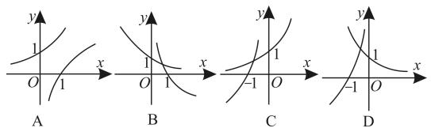
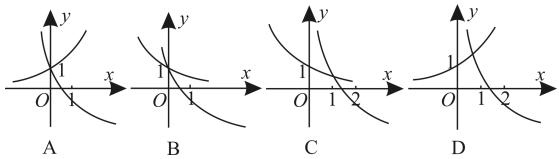

# 高一上学期知识归纳与题型赏析

natural_image

Illustration of a boy with glasses and thoughtful expression, hand on chin (no text or symbols)

# ■赵昆 张文伟

# 题型 1: 集合的基本概念与集合间的基本关系

研究集合问题,先看集合中的代表元素,再看元素的限制条件。对于含有字母的集合,在求出字母的值后,要注意检验集合是否满足互异性。已知两集合间的关系求参数,关键是将两集合间的关系转化为元素间的关系,进而转化为参数满足的关系。解决集合问题,要合理利用数轴、Venn图,要注意“空集”这一“陷阱”,当集合中含有字母参数时,要注意分类讨论。

例 1 已知集合 $A=\{0,1,2\}$ ，则集合 $B=\{x-y \mid x \in A, y \in A\}$ 中元素的个数是（）。

A. 1

B. 3

C. 5

D. 9

解: 当 x=0 时, y=0,1,2, 此时 x-y 的值分别为 0,-1,-2; 当 x=1 时, y=0,1,2, 此时 x-y 的值分别为 1,0,-1; 当 x=2 时, y=0,1,2, 此时 x-y 的值分别为 2,1,0。综上可知, x-y 的可能取值为 -2,-1,0,1,2, 共 5 个。应选 C。

跟踪训练 1:(多选题)已知集合 $A=\{0, m, m^{2}-3m+2\}$ ，且 $\{2\}\subseteq A$ ，则实数 m 的取值不可以为（）。

A. 2

B. 3

C. 0

D.-2

提示:由 $\{2\}\subseteq A$ 可知,若m=2,则 $m^{2}-3m+2=0$ ,这与 $m^{2}-3m+2\neq0$ 相矛盾。若 $m^{2}-3m+2=2$ ,则 $m^{2}-3m=0$ ,即m=0或m=3。因为 $m\neq0$ ,所以m=3,此时 $A=\{0,3,2\}$ 符合题意,故m的值可以为3。应选ACD。

# 题型 2: 充分条件与必要条件

充分、必要、充要条件的两种判断方法：利用定义，直接判断“若 p，则 q”“若 q，则 p”的真假;利用集合间的包含关系,设命题 p 对应的集合为 A, 命题 q 对应的集合为 B, 若 $A \subseteq B$ , 则 p 是 q 的充分条件或 q 是 p 的必要条件, 若 $A \subsetneq B$ , 则 p 是 q 的充分不必要条件或 q 是 p 的必要不充分条件, 若 A = B, 则 p 是 q 的充要条件。

例 2 设集合 $A=\{x \mid -1 < x < 3\}$ ，集合 $B=\{x \mid 2 - a < x < 2 + a\}$ 。

(1) 若 $a = 2$ , 求 $A \cup B$ 和 $A \cap B$ 。  
(2) 设 $p: x \in A, q: x \in B$ ，若 p 是 q 成立的必要不充分条件，求实数 a 的取值范围。

解:(1)已知 $A=\{x\mid-1<x<3\}$ 。由 a=2，可得 $B=\{x\mid0<x<4\}$ ，所以 $A\cup B=\{x\mid-1<x<4\}$ ， $A\cap B=\{x\mid0<x<3\}$ 。

(2) 因为 p 是 q 成立的必要不充分条件，所以 $B \subsetneq A$ 。

当 $B = \emptyset$ 时，由 $2 - a \geqslant 2 + a$ ，可得 $a \leqslant 0$ ；当 $B \neq \emptyset$ 时，由 $\left\{ \begin{array}{l} 2 - a < 2 + a, \\ 2 - a \geqslant -1, \\ 2 + a \leqslant 3 \end{array} \right.$ （等号不能同时取到），解得 $0 < a \leqslant 1$ 。综上可得，实数 $a$ 的取值范围是 $a \leqslant 1$ ，即实数 $a \in (-\infty, 1]$ 。

跟踪训练 2: 已知 $p: 4 - x \leqslant 6, q: x \geqslant a - 1$ ，若 p 是 q 的充要条件，则 a 的值为 \_\_\_\_。

提示:由题意得 $p: x \geqslant -2, q: x \geqslant a - 1$ 。因为 p 是 q 的充要条件，所以 a - 1 = -2，则 a = -1。

# 题型 3: 全称量词命题与存在量词命题

对全称量词命题和存在量词命题进行否定，一要改变量词，二要否定结论。根据全称量词命题和存在量词命题的真假求参数的取值范围，一般把问题转化为函数、不等式或集合问题求解。

例 3 命题: “ $\forall x \in R, x^{2} \neq x$ ” 的否定

是( )。

A. $\forall x\notin R, x^{2}\neq x$   
B. $\forall x\in R,x^{2}=x$   
C. $\exists x\notin R, x^{2}\neq x$   
D. $\exists x\in R,x^{2}=x$

解: 先将“∀”改为“∃”, 再否定结论, 则此命题的否定为 $\exists x \in R, x^{2} = x$ 。应选 D。

跟踪训练 3: 若命题“∃x<2024, x>a”是假命题，则实数 a 的取值范围是 \_\_\_\_。

提示: 命题“ $\exists x<2\ 024,x>a$ ”是假命题, 其否定“ $\forall x<2\ 024,x\leqslant a$ ”是真命题, 所以 $a\geqslant2\ 024$ , 即 $a\in[2\ 024,+\infty)$ 。

# 题型 4: 不等式及其性质问题

应用不等式的基本性质可以证明不等式,但一定要注意不等式的应用条件;作差法是比较两个实数大小的基本方法,当判断不等式是否成立时,可选择特殊值法。

例 4 （1）若 $A = a^{2} + 3ab, B = 4ab - b^{2}$ ，则 A, B 的大小关系是（）。

A. $A \leqslant B$

B. $A \geqslant B$

C. A < B 或 A > B

D. A > B

(2) 若 a > b, x > y，则下列不等式正确的是()。

A. $a + x < b + y$   
B. ax > by   
C. $|a|x \geqslant |a|y$

D. $(a-b)x<(a-b)y$

解:(1)因为 $A-B=a^{2}+3ab-(4ab-b^{2})=\left(a-\frac{b}{2}\right)^{2}+\frac{3}{4}b^{2}\geqslant0$ ，所以 $A\geqslant B$ 。应选 B。

(2) 当 $a \neq 0$ 时， $|a| > 0$ ，由 x > y，结合不等式两边同乘以一个大于零的数不等号方向不变，可得 $|a|x > |a|y$ 。当 a = 0 时， $|a|x = |a|y$ 。故 $|a|x \geqslant |a|y$ ，C 正确。应选 C。

跟踪训练 4: 若 $1 \leqslant a \leqslant 5, -1 \leqslant b \leqslant 2$ ，则 a - b 的取值范围为 \_\_\_\_。

提示: 因为 $-1 \leqslant b \leqslant 2$ ，所以 $-2 \leqslant -b \leqslant 1$ 。又 $1 \leqslant a \leqslant 5$ ，所以 $-1 \leqslant a - b \leqslant 6$ ，即 $a - b \in [-1, 6]$ 。

# 题型 5: 利用基本不等式求最值

基本不等式的三个关注点:前提,“一正”“二定”“三相等”;拼凑,根据式子的特征灵活变形,配凑出积、和为常数的形式;方法,一是消元法,二是将条件灵活变形,利用常数“1”的代换,三是配凑法。

例 5 （1）若 0 < x < 2，则 $3x(2 - x)$ 的最大值是（）。

A. 3

B. $\frac{3}{2}$

C. $\frac{1}{3}$

D. $\frac{1}{2}$

(2)已知 a, b, c 均为正实数，若 $\frac{1}{a} + \frac{1}{b + 2} + \frac{1}{c + 1} = 1$ ，则 $a + b + c$ 的最小值为 \_\_\_\_。

解:(1)因为0<x<2,所以2-x>0,所以 $3x(2-x)\leqslant3\left(\frac{x+2-x}{2}\right)^{2}=3$ ,当且仅当x=2-x,即x=1时等号成立,所以 $3x(2-x)$ 的最大值为3。应选A。

(2) 因为 $a + b + c = a + (b + 2) + (c + 1) - 3 = \left[a + (b + 2) + (c + 1)\right] \cdot \left(\frac{1}{a} + \frac{1}{b + 2} + \frac{1}{c + 1}\right) - 3 = \left(3 + \frac{a}{b + 2} + \frac{b + 2}{a} + \frac{a}{c + 1} + \frac{c + 1}{a} + \frac{b + 2}{c + 1} + \frac{c + 1}{b + 2}\right) - 3 \geqslant 3 + 2 + 2 + 2 - 3 = 6$ ，当且仅当 $a = b + 2 = c + 1 = 3$ ，即 a = 3, b = 1, c = 2 时等号成立，所以 $a + b + c$ 的最小值为 6。

跟踪训练 5: 已知函数 $y = x - 4 + \frac{9}{x + 1}$ (x > -1)，当 x = a 时，y 取得最小值 b，则 a = \_\_\_\_，b = \_\_\_\_。

提示: $y = x - 4 + \frac{9}{x + 1} = (x + 1) + \frac{9}{x + 1} - 5$ 。因为 $x > -1$ ，所以 $x + 1 > 0$ ，所以 $y \geqslant 2\sqrt{(x + 1) \cdot \frac{9}{x + 1}} - 5 = 2 \times 3 - 5 = 1$ ，当且仅当 $x + 1 = \frac{9}{x + 1}$ ，即 $x = 2$ 时等号成立，所以 $a = 2, b = 1$ 。

# 题型 6: 一元二次不等式问题

解一元二次不等式(或分式不等式)，先转化为标准形式(二次项系数为正)，然后分解因式，变成因式相乘的形式，从而得到不等式的解集；一元二次不等式解集的端点值就是对应二次函数的零点，也是对应一元二次

方程的实数根。

例6 若不等式 $ax^2 + 5x - 2 > 0$ 的解集是 $\left\{x \mid \frac{1}{2} < x < 2\right\}$ 。

(1) 求 a 的值。  
(2)求不等式 $\frac{1-ax}{x+1}>a+5$ 的解集。

解:(1)依题意得方程 $ax^{2}+5x-2=0$ 的两个实数根为 $\frac{1}{2}$ 和 2，且 a<0。由根与系数的关系得 $\left\{\begin{aligned}\frac{1}{2}\times2&=-\frac{2}{a},\\ \frac{1}{2}+2&=-\frac{5}{a},\end{aligned}\right.$ 解得 a=-2。

(2) 将 a = -2 代入不等式得 $\frac{1 + 2x}{x + 1} > 3$ ，即 $\frac{1 + 2x}{x + 1} - 3 > 0$ ，整理得 $\frac{-(x + 2)}{x + 1} > 0$ ，即 $(x + 1)(x + 2) < 0$ ，解得 -2 < x < -1，所以不等式的解集为 $\{x \mid -2 < x < -1\}$ 。

跟踪训练 6: 解关于 x 的不等式 $ax^{2}-(a+1)x+1<0$ 。

提示: 当 a=0 时, 原不等式化为 $-x+1<0$ , 解得 x>1; 当 a<0 时, 原不等式化为 $\left(x-\frac{1}{a}\right)(x-1)>0$ , 解得 $x<\frac{1}{a}$ 或 x>1; 当 a>0 时, 原不等式化为 $\left(x-\frac{1}{a}\right)(x-1)<0$ , 若 $\frac{1}{a}=1$ , 则 a=1, 可得不等式无解, 即解集为 $\varnothing$ , 若 $\frac{1}{a}<1$ , 则 a>1, 解得 $\frac{1}{a}<x<1$ , 若 $\frac{1}{a}>1$ , 则 0<a<1, 解得 $1<x<\frac{1}{a}$ 。综上可知, 当 a<0 时, 不等式的解集为 $\left\{x\mid x<\frac{1}{a}或x>1\right\}$ ; 当 a=0 时, 不等式的解集为 $\{x\mid x>1\}$ ; 当 0<a<1 时, 不等式的解集为 $\left\{x\mid1<x<\frac{1}{a}\right\}$ ; 当 a=1 时, 不等式的解集为 $\varnothing$ ; 当 a>1 时, 不等式的解集为 $\left\{x\mid\frac{1}{a}<x<1\right\}$ 。

# 题型 7: 不等式恒成立问题

不等式恒成立问题的三种处理方法: 分离参数法; 数形结合法; 转化为求函数的最值问题。

例 7 已知函数 $y=x^{2}+ax+3$ 。

(1) 当 $x \in \mathbf{R}$ 时, $y \geqslant a$ 恒成立, 求 $a$ 的取值范围。  
(2) 当 $4 \leqslant a \leqslant 6$ 时, $y \geqslant 0$ 恒成立, 求 x 的取值范围。

解:(1)由题意知当 $x \in R$ 时, $x^{2} + ax + 3 - a \geqslant 0$ 恒成立, 则 $\Delta = a^{2} - 4(3 - a) \leqslant 0$ , 即 $a^{2} + 4a - 12 \leqslant 0$ , 解得 $-6 \leqslant a \leqslant 2$ , 故 a 的取值范围为 $\{a \mid -6 \leqslant a \leqslant 2\}$ 。

(2) 将 $y = xa + x^{2} + 3$ 看作关于 a 的一次函数，当 $4 \leqslant a \leqslant 6$ 时， $y \geqslant 0$ 恒成立，只需在区间端点 a = 4 和 a = 6 处 $y \geqslant 0$ 即可，所以 $\left\{\begin{aligned} x^{2} + 4x + 3 & \geqslant 0, \\ x^{2} + 6x + 3 & \geqslant 0, \end{aligned}\right.$ 解得 $x \leqslant -3 - \sqrt{6}$ 或 $x \geqslant -3 + \sqrt{6}$ ，即 x 的取值范围是 $\{x \mid x \leqslant -3 - \sqrt{6} \text{ 或 } x \geqslant -3 + \sqrt{6}\}$ 。

跟踪训练 7: 已知 x > 0, y > 0，且 $\frac{2}{x + 1} + \frac{1}{y} = 2$ ，若 $x + 2y > m^{2} - 3m - 1$ 恒成立，则实数 m 的取值范围是（）。

A. $\{m\mid m\leqslant -1$ 或 $m\geqslant 4\}$   
B. $\{m\mid m\leqslant -4$ 或 $m\geqslant 1\}$   
C. $\{m\mid -1 <   m <   4\}$   
D. $\{m\mid -4 <   m <   1\}$

提示:由 $\frac{2}{x+1}+\frac{1}{y}=2$ ，可得 $2y+x+1=2(x+1)y$ ，化简得 $x+1=2xy$ ，所以 $2y=1+\frac{1}{x}$ ，所以 $x+2y=x+\frac{1}{x}+1\geqslant2\sqrt{x\cdot\frac{1}{x}}+1=3$ ，当且仅当x=1，y=1时等号成立，所以 $(x+2y)_{\min}=3$ ，所以 $x+2y>m^{2}-3m-1$ 恒成立可转化为 $3>m^{2}-3m-1$ ，即 $m^{2}-3m-4<0$ ，解得-1<m<4，即实数m的取值范围是 $\{m|-1<m<4\}$ 。应选C。

# 题型 8: 函数的定义域问题

已知函数的解析式,则函数的定义域是使解析式有意义的自变量的取值集合。复合函数的定义域:若 $f(x)$ 的定义域为 $[a,b]$ , 则 $f(g(x))$ 的定义域应由 $a \leqslant g(x) \leqslant b$ 解出; 若 $f(g(x))$ 的定义域为 $[a,b]$ , 则 $f(x)$ 的定义域为 $g(x)$ 在 $[a, b]$ 上的值域。注意：
① $f(x)$ 中的 x 与 $f[g(x)]$ 中的 $g(x)$ 的地位相同；②定义域所指的永远是 x 的取值范围。

例8（1）函数 $f(x) = \frac{2x^2}{\sqrt{1 - x}} + (2x - 1)^0$ 的定义域为（ ）。

A. $\left(-\infty,\frac{1}{2}\right)$

B. $\left(\frac{1}{2},1\right)$

C. $\left(-\frac{1}{2},\frac{1}{2}\right)$

D. $\left(-\infty,\frac{1}{2}\right)\cup\left(\frac{1}{2},1\right)$

(2)已知函数 $y = f(x - 1)$ 的定义域是 $[-1, 2]$ ，则函数 $y = f(1 - 3x)$ 的定义域为（ ）。

A. $\left[-\frac{1}{3},0\right]$

B. $\left[-\frac{1}{3},3\right]$

C. $[0,1]$

D. $\left[-\frac{1}{3},1\right]$

解:(1)由题意得 $\left\{\begin{aligned}1-x&>0,\\ 2x-1&\neq0,\end{aligned}\right.$ 解得x<1
且 $x \neq \frac{1}{2}$ ，所以函数 $f(x)$ 的定义域是 $\left(-\infty, \frac{1}{2}\right) \cup \left(\frac{1}{2}, 1\right)$ 。应选 D。

(2)由 $y=f(x-1)$ 的定义域是 $[-1,2]$ 得 $x-1\in[-2,1]$ ，即 $f(x)$ 的定义域是 $[-2,1]$ 。令 $-2\leqslant1-3x\leqslant1$ ，解得 $0\leqslant x\leqslant1$ ，即 $y=f(1-3x)$ 的定义域为 $[0,1]$ 。应选 C。

跟踪训练 8: 若函数 $f(x)$ 的定义域为 $[-2,4]$ ，则函数 $g(x)=f(-x)+\sqrt{x-1}$ 的定义域为 \_\_\_\_。

提示：由题意知 $\left\{ \begin{array}{l} -2 \leqslant -x \leqslant 4, \\ x - 1 \geqslant 0, \end{array} \right.$ 所以 $\left\{ \begin{array}{l} -4 \leqslant x \leqslant 2, \\ x \geqslant 1, \end{array} \right.$ 可得 $1 \leqslant x \leqslant 2$ ，所以函数 $g(x)$ 的定义域为[1,2]。

# 题型 9: 函数的性质问题

函数的性质主要有定义域、值域、单调性和奇偶性。利用函数的单调性和奇偶性求值、比较大小、解不等式是高考的常考点，解不等式时要注意数形结合法的应用，注意不要忽视函数定义域的影响。

例9 已知函数 $f(x) = \frac{x^2 + 1}{x}$ 。

(1) 判断 $f(x)$ 的奇偶性并证明。

(2) 当 $x \in (1, +\infty)$ 时, 判断 $f(x)$ 的单调性并证明。  
(3) 在 (2) 的条件下, 若实数 $m$ 满足 $f(3m) > f(5 - 2m)$ , 求 $m$ 的取值范围。

解:(1)函数 $f(x)$ 是奇函数。证明如下: 易知函数 $f(x)$ 的定义域为 $(-∞,0)∪(0,+∞)$ 。因为 $f(-x)=\frac{(-x)^{2}+1}{-x}=-\frac{x^{2}+1}{x}=-f(x)$ ，所以 $f(x)$ 是奇函数。

(2) 函数 $f(x)$ 在 $(1, +\infty)$ 上单调递增。证明如下：任取 $x_{1}, x_{2} \in (1, +\infty)$ ，且 $x_{1} > x_{2}$ 。易得 $f(x_{1}) - f(x_{2}) = \frac{x_{1}^{2} + 1}{x_{1}} - \frac{x_{2}^{2} + 1}{x_{2}} = \frac{(x_{1} - x_{2})(x_{1}x_{2} - 1)}{x_{1}x_{2}}$ 。因为 $x_{1} > x_{2} > 1$ ，所以 $x_{1} - x_{2} > 0, x_{1}x_{2} - 1 > 0, x_{1}x_{2} > 0$ ，所以 $f(x_{1}) - f(x_{2}) > 0$ ，即 $f(x_{1}) > f(x_{2})$ ，所以函数 $f(x)$ 在 $(1, +\infty)$ 上单调递增。

(3)由(2)知函数 $f(x)$ 在 $(1,+\infty)$ 上单调递增。因为 $f(3m)>f(5-2m)$ ，所以 $3m>5-2m>1$ ，解得 1<m<2，所以 m 的取值范围为 $(1,2)$ 。

跟踪训练 9: 设 $f(x)$ 是定义域为 R 的奇函数, 且 $f(1+x)=f(-x)$ 。若 $f\left(-\frac{1}{3}\right)=\frac{1}{3}$ , 则 $f\left(\frac{5}{3}\right)$ 等于()。

A. $-\frac{5}{3}$

B. $-\frac{1}{3}$

C. $\frac{1}{3}$

D. $\frac{5}{3}$

提示:由 $f(1+x)=f(-x)$ ，且 $f(x)$ 是定义在 R 上的奇函数，可得 $f(1+x)=f(-x)=-f(x)$ ，所以 $f(2+x)=-f(1+x)=f(x)$ ，所以 $f(x)=f(x-2)$ 。故 $f\left(\frac{5}{3}\right)=f\left(\frac{5}{3}-2\right)=f\left(-\frac{1}{3}\right)=\frac{1}{3}$ 。应选 C。

# 题型 10: 指数函数、对数函数的图像及应用

指数函数、对数函数的图像及应用有两个方面:一是已知函数解析式求作函数图像,即“知式求图”;二是判断方程根的个数,通常不具体解方程,而是转化为判断指数函数、对数函数图像的交点个数问题。掌握指数函数、对数函数图像的作法及简单的图像平移与翻折变换,可以提升直观想象和逻辑推理

的素养。

例 10 已知 a > 0，且 $a \neq 1$ ，则函数 $f(x) = a^{x}$ 和 $g(x) = \log_{a}\left(-\frac{1}{x}\right)$ 的图像只可能是（）。

text_image

y
1
O 1 x
A
y
1
O 1 x
B
y
1
-1 O x
C
y
1
-1 O x
D

解: 易得函数 $g(x)$ 的定义域是 $(-∞, 0)$ ，排除 A, B。若 0 < a < 1，则 $f(x) = a^{x}$ 是减函数，此时 $g(x) = \log_{a}\left(-\frac{1}{x}\right)$ 是减函数，C, D 都不满足。若 a > 1，则 $f(x) = a^{x}$ 是增函数，此时 $g(x) = \log_{a}\left(-\frac{1}{x}\right)$ 是增函数，C 满足。应选 C。

跟踪训练 10: 在同一平面直角坐标系中, 函数 $y = a^{-x}$ , $y = \log_{a}(x + a) (a > 0$ , 且 $a \neq 1)$ 的图像可能是()。

text_image

A
B
C
D

提示: 函数 $y=a^{-x}$ 与 $y=\log_{a}(x+a)$ 的图像均过定点 $(0,1)$ ，C，D 不满足。易知函数 $y=a^{-x}=\left(\frac{1}{a}\right)^{x}$ 与 $y=\log_{a}(x+a)$ 的单调性不同，B 不满足，A 满足。应选 A。

# 题型 11: 指数函数、对数函数性质的应用

指数函数、对数函数性质的应用问题，主要掌握函数的单调性、奇偶性，以及利用函数的性质比较大小、方程与不等式的求解等问题。在解含对数式的方程或不等式时，不能忘记对数的真数大于0，以免出现增根或扩大范围。熟练掌握指数函数、对数函数的图像与性质，可以重点提升数学运算和逻辑推理的素养。

例 11 （1）设 $a=\log_{2}\pi, b=\log_{\frac{1}{2}}\pi, c=\pi^{-2}$ ，则（）。

A. a > b > c

B. b > a > c

C. a > c > b

D. c > b > a

(2)已知 $a > 0, a \neq 1$ 且 $\log_a 3 > \log_a 2$ , 若

函数 $f(x) = \log_a x$ 在区间 $[a, 3a]$ 上的最大值与最小值之差为 1。①求 $a$ 的值。②若 $1 \leqslant x \leqslant 3$ ，求函数 $y = (\log_a x)^2 - \log_a \sqrt{x} + 2$ 的值域。

解:(1) 因为 $a=\log_{2}\pi>\log_{2}2=1$ , $b=\log_{\frac{1}{2}}\pi<\log_{\frac{1}{2}}1=0$ , $c=\pi^{-2}=\frac{1}{\pi^{2}}$ , 即 0<c<1, 所以 a>c>b 。应选 C。

(2)①因为 $\log_{a}3 > \log_{a}2$ ，所以 a > 1，所以 $f(x) = \log_{a}x$ 在 $[a, 3a]$ 上单调递增。又 $f(x)$ 在 $[a, 3a]$ 上的最大值与最小值之差为 1，所以 $\log_{a}(3a) - \log_{a}a = 1$ ，即 $\log_{a}3 = 1$ ，所以 a = 3。

② 易得函数 $y = (\log_3 x)^2 - \log_3 \sqrt{x} + 2 = (\log_3 x)^2 - \frac{1}{2} \log_3 x + 2 = \left( \log_3 x - \frac{1}{4} \right)^2 + \frac{31}{16}$ 。令 $t = \log_3 x$ ，因为 $1 \leqslant x \leqslant 3$ ，所以 $0 \leqslant \log_3 x \leqslant 1$ ，即 $0 \leqslant t \leqslant 1$ 。原函数等价于 $g(t) = \left( t - \frac{1}{4} \right)^2 + \frac{31}{16}, t \in [0,1]$ ，所以 $g(t) \in \left[ \frac{31}{16}, \frac{5}{2} \right]$ ，则所求函数的值域为 $\left[ \frac{31}{16}, \frac{5}{2} \right]$ 。

跟踪训练 11: 若 0 < x < y < 1, 则( )。

A. $3^{y} < 3^{x}$

B. $\log_x 3 < \log_y 3$

C. $\log_{4}x<\log_{4}y$

D. $\left(\frac{1}{4}\right)^{x}<\left(\frac{1}{4}\right)^{y}$

提示:对于 A, 函数 $y=3^{x}$ 在 R 上单调递增, 则 $3^{x}<3^{y}$ , A 错误。对于 B, 由底数 a 对对数函数 $y=\log_{a}x$ 的图像影响可知, 当 0<a<1 时, 在 $x\in(1,+\infty)$ 上“底小图高”, 因为 0<x<y<1, 所以 $\log_{x}3>\log_{y}3$ , B 错误。对于 C, 函数 $y=\log_{4}x$ 在 $(0,+\infty)$ 上单调递增, 则 $\log_{4}x<\log_{4}y$ , C 正确。对于 D, 函数 $y=\left(\frac{1}{4}\right)^{x}$ 在 R 上为减函数, 则 $\left(\frac{1}{4}\right)^{x}>\left(\frac{1}{4}\right)^{y}$ , D 错误。应选 C。

# 题型 12: 函数的零点问题

函数的零点与方程的根的关系: 方程 $f(x)=0$ 有实数根 $\Leftrightarrow$ 函数 $y=f(x)$ 的图像与 x 轴有交点 $\Leftrightarrow$ 函数 $y=f(x)$ 有零点。确定函数零点的个数有两种基本方法: 利用图像研究与 x 轴的交点个数;转化成两个函数图像的交点个数。

例 12 （1）设函数 $f(x)=\log_{2}x+2^{x}-3$ ，则函数 $f(x)$ 的零点所在的区间为（）。

A. $(0,1)$

B. $(1,2)$

C. $(2,3)$

D. $(3,4)$

（2）已知函数 $f(x) = \left\{ \begin{array}{l} \mathrm{e}^{x} + a, x \leqslant 0, \\ 3x - 1, x > 0 \end{array} (a \in \mathbf{R})\right.$ ，若函数 $f(x)$ 在 $\mathbf{R}$ 上有两个零点，则 $a$ 的取值范围是（ ）。

A. $(-∞,-1)$

B. $(-∞,1)$

C. $(-1,0)$

D. $\left[-1,0\right)$

解:(1)因为函数 $f(x)=\log_{2}x+2^{x}-3$ 在定义域 $(0,+\infty)$ 上单调递增,所以 $f(x)$ 的零点至多有一个。由 $f(1)=\log_{2}1+2^{1}-3=-1<0,f(2)=\log_{2}2+2^{2}-3=2>0$ ,结合函数零点存在定理知在区间 $(1,2)$ 内函数存在零点。应选 B。

(2)由 3x-1=0，可得 $x=\frac{1}{3}>0$ 。若函数 $f(x)$ 在 R 上有两个零点，则可转化为 $e^{x}+a=0$ 在 $x\leqslant0$ 上有一个实数根，即函数 y=-a 与 $y=e^{x}$ 在 $x\leqslant0$ 上的图像有一个交点。当 $x\leqslant0$ 时， $e^{x}\in(0,1]$ ，所以 $0<-a\leqslant1$ ，即 $-1\leqslant a<0$ 。应选 D。

跟踪训练 12: 方程 $\frac{x^{3}}{4} = \left(\frac{1}{2}\right)^{x}$ 的根 $x_{0}$ 所在的区间为（）。

A. $(0,1)$

B. $(1,2)$

C. $(2,3)$

D. $(3,4)$

提示: 将方程变形, 构造函数 $f(x)=\frac{x^{3}}{4}-\left(\frac{1}{2}\right)^{x}$ 。因为函数 $y=\frac{x^{3}}{4}$ 和 $y=-\left(\frac{1}{2}\right)^{x}$ 均为增函数, 所以函数 $f(x)=\frac{x^{3}}{4}-\left(\frac{1}{2}\right)^{x}$ 为增函数。由 $f(0)=0-1=-1<0, f(1)=\frac{1}{4}-\frac{1}{2}=-\frac{1}{4}<0, f(2)=2-\frac{1}{4}=\frac{7}{4}>0$ , 结合函数零点存在定理得 $f(x)=\frac{x^{3}}{4}-\left(\frac{1}{2}\right)^{x}$ 的零点在区间 $(1,2)$ 内, 即方程 $\frac{x^{3}}{4}=\left(\frac{1}{2}\right)^{x}$ 的根 $x_{0}$ 所在的区间为 $(1,2)$ 。应选 B。

# 题型 13: 三角函数的图像与性质

三角函数的性质主要包括定义域、值域、单调性、奇偶性、对称性等，在研究性质时将 $\omega x+\varphi$ 看成一个整体，利用整体代换思想解题是常用的技巧。要熟练掌握 $y=A\sin(\omega x+\varphi)$ 图像的“五点作图法”，以及图像的伸缩变换、平移变换等。掌握三角函数的图像和性质，可以重点提升直观想象和数学运算的素养。

例 13 （1）已知函数 $f(x)=\sin\left(x+\frac{\pi}{6}\right)$ ，其中 $x\in\left[-\frac{\pi}{3},a\right]$ ，若 $f(x)$ 的值域是 $\left[-\frac{1}{2},1\right]$ ，则实数 a 的取值范围是 \_\_\_\_。

(2) 函数 $y = \sin\left(x - \frac{\pi}{4}\right)$ 的图像的对称轴为 \_\_\_\_，对称中心为 \_\_\_\_。

解:(1)由 $x \in \left[-\frac{\pi}{3}, a\right]$ ，可得 $x + \frac{\pi}{6} \in \left[-\frac{\pi}{6}, a + \frac{\pi}{6}\right]$ 。由函数 $f(x)$ 的值域为 $\left[-\frac{1}{2}, 1\right]$ ，结合正弦函数的图像知 $\frac{\pi}{2} \leqslant a + \frac{\pi}{6} \leqslant \frac{7\pi}{6}$ ，所以 $\frac{\pi}{3} \leqslant a \leqslant \pi$ ，即实数 $a \in \left[\frac{\pi}{3}, \pi\right]$ 。

(2)由 $x - \frac{\pi}{4} = \frac{\pi}{2} + k\pi, k \in \mathbf{Z}$ , 可得 $x = \frac{3\pi}{4} + k\pi, k \in \mathbf{Z}$ 。由 $x - \frac{\pi}{4} = k\pi, k \in \mathbf{Z}$ , 可得 $x = \frac{\pi}{4} + k\pi, k \in \mathbf{Z}$ 。故函数 $y = \sin \left(x - \frac{\pi}{4}\right)$ 的图像的对称轴为 $x = \frac{3\pi}{4} + k\pi, k \in \mathbf{Z}$ , 对称中心为 $\left(\frac{\pi}{4} + k\pi, 0\right), k \in \mathbf{Z}$ 。

跟踪训练 13: 已知函数 $f(x)=2\sin\left(2x+\frac{\pi}{6}\right)+a+1$ (其中 a 为常数)。

(1) 求 $f(x)$ 的单调区间。

(2) 当 $x \in \left[0, \frac{\pi}{2}\right]$ 时， $f(x)$ 的最大值为 4，求 $a$ 的值。

提示:(1)由 $-\frac{\pi}{2}+2k\pi\leqslant2x+\frac{\pi}{6}\leqslant\frac{\pi}{2}+$

$2k\pi, k \in \mathbf{Z}$ , 解得 $-\frac{\pi}{3} + k\pi \leqslant x \leqslant \frac{\pi}{6} + k\pi, k \in \mathbf{Z}$ , 所以函数 $f(x)$ 的单调递增区间为 $\left[-\frac{\pi}{3} + k\pi, \frac{\pi}{6} + k\pi\right] (k \in \mathbf{Z})$ 。由 $\frac{\pi}{2} + 2k\pi \leqslant 2x + \frac{\pi}{6} \leqslant \frac{3\pi}{2} + 2k\pi, k \in \mathbf{Z}$ , 解得 $\frac{\pi}{6} + k\pi \leqslant x \leqslant \frac{3\pi}{3} + k\pi, k \in \mathbf{Z}$ , 所以函数 $f(x)$ 的单调递减区间为 $\left[\frac{\pi}{6} + k\pi, \frac{2\pi}{3} + k\pi\right] (k \in \mathbf{Z})$ 。

(2) 因为 $0 \leqslant x \leqslant \frac{\pi}{2}$ , 所以 $\frac{\pi}{6} \leqslant 2x + \frac{\pi}{6} \leqslant \frac{7\pi}{6}$ , 所以 $-\frac{1}{2} \leqslant \sin \left(2x + \frac{\pi}{6}\right) \leqslant 1$ , 所以 $f(x)$ 的最大值为 $2 + a + 1 = 4$ , 所以 $a = 1$ 。

# 题型 14: 三角恒等变换与三角函数的综合问题

三角恒等变换与三角函数的综合问题，常以三角恒等变换为主要的化简手段，考查三角函数的性质。当给出的三角函数关系式较为复杂时，要先通过三角恒等变换，将三角函数的表达式变形化简为 $y = A \sin(\omega x + \varphi) + k$ 或 $y = A \cos(\omega x + \varphi) + k$ 的形式，再根据化简后的三角函数，讨论其图像与性质。通过三角恒等变换，进而研究三角函数的性质，可以培养逻辑推理和数学运算的素养。

例 14 已知函数 $f(x)=\cos x\sin\left(x+\frac{\pi}{3}\right)-\sqrt{3}\cos^{2}x+\frac{\sqrt{3}}{4},x\in\mathbf{R}$ 。

(1) 求 $f(x)$ 的最小正周期。

(2) 求 $f(x)$ 在区间 $\left[-\frac{\pi}{4}, \frac{\pi}{4}\right]$ 上的最大值和最小值。

解:(1) $f(x)=\cos x\left(\frac{1}{2}\sin x+\frac{\sqrt{3}}{2}\cos x\right)-\sqrt{3}\cos^{2}x+\frac{\sqrt{3}}{4}=\frac{1}{2}\sin x\cdot\cos x-\frac{\sqrt{3}}{2}\cos^{2}x+\frac{\sqrt{3}}{4}=\frac{1}{4}\sin 2x-\frac{\sqrt{3}}{4}(1+\cos 2x)+\frac{\sqrt{3}}{4}=\frac{1}{4}\sin 2x-\frac{\sqrt{3}}{4}\cos 2x=\frac{1}{2}\sin\left(2x-\frac{\pi}{3}\right)$ ，所以函数 $f(x)$ 的最小正周期 $T=\frac{2\pi}{2}=\pi$ 。

(2) 因为 $-\frac{\pi}{4} \leqslant x \leqslant \frac{\pi}{4}$ ，所以 $-\frac{5\pi}{6} \leqslant 2x - \frac{\pi}{3} \leqslant \frac{\pi}{6}$ ，所以 $-1 \leqslant \sin\left(2x - \frac{\pi}{3}\right) \leqslant \frac{1}{2}$ ，所以 $-\frac{1}{2} \leqslant f(x) \leqslant \frac{1}{4}$ ，所以函数 $f(x)$ 在区间 $\left[-\frac{\pi}{4}, \frac{\pi}{4}\right]$ 上的最大值为 $\frac{1}{4}$ ，最小值为 $-\frac{1}{2}$ 。

跟踪训练 14: 已知函数 $f(x)=\cos\left(\frac{\pi}{3}-x\right)\cdot\cos\left(x+\frac{\pi}{6}\right)$ 。

(1) 求 $f\left(\frac{\pi}{6}\right)$ 的值。

(2) 将 $f(x)$ 图像上的所有点向左平移 m (m > 0) 个单位长度，得到 $g(x)$ 的图像，若 $g(x)$ 的图像关于点 $\left(\frac{\pi}{6}, 0\right)$ 对称，求当 m 取最小值时，函数 $g(x)$ 的单调递增区间。

提示: (1) $f\left(\frac{\pi}{6}\right)=\cos\left(\frac{\pi}{3}-\frac{\pi}{6}\right)\cos\left(\frac{\pi}{6}+\frac{\pi}{6}\right)=\cos\frac{\pi}{6}\cos\frac{\pi}{3}=\frac{\sqrt{3}}{4}$ 。

(2) $f(x) = \sin \left(x + \frac{\pi}{6}\right) \cos \left(x + \frac{\pi}{6}\right) = \frac{1}{2} \sin \left(2x + \frac{\pi}{3}\right)$ 。将 $f(x)$ 的图像向左平移 $m (m > 0)$ 个单位长度，得到 $g(x) = \frac{1}{2} \sin \left(2x + \frac{\pi}{3} + 2m\right)$ 。因为函数 $g(x)$ 的图像关于点 $\left(\frac{\pi}{6}, 0\right)$ 对称，所以 $\sin \left(2 \times \frac{\pi}{6} + \frac{\pi}{3} + 2m\right) = 0$ ，所以 $\frac{2\pi}{3} + 2m = k\pi, k \in \mathbf{Z}$ ，所以 $m = \frac{k\pi}{2} - \frac{\pi}{3}, k \in \mathbf{Z}$ 。因为 $m > 0$ ，所以当 $k = 1$ 时， $m$ 有最小值 $\frac{\pi}{6}$ ，此时 $g(x) = \frac{1}{2} \sin \left(2x + \frac{2\pi}{3}\right)$ 。由 $-\frac{\pi}{2} + 2k\pi \leqslant 2x + \frac{2\pi}{3} \leqslant \frac{\pi}{2} + 2k\pi, k \in \mathbf{Z}$ ，可得 $x \in \left[-\frac{7\pi}{12} + k\pi, -\frac{\pi}{12} + k\pi\right], k \in \mathbf{Z}$ ，所以当 $m$ 取最小值时，函数 $g(x)$ 的单调递增区间是 $\left[-\frac{7\pi}{12} + k\pi, -\frac{\pi}{12} + k\pi\right], k \in \mathbf{Z}$ 。

作者单位:河南省开封高级中学

(责任编辑 郭正华)