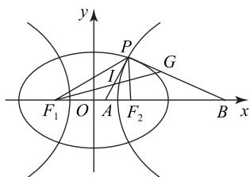
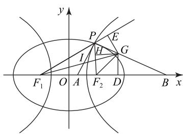
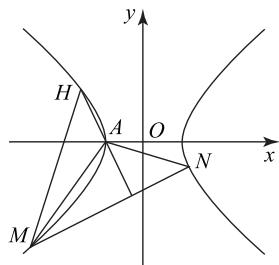

# 以“四心”为载体的圆锥曲线问题分类探究

文立刚

(山东省济南市章丘区第七中学)

三角形的“四心”分别指重心、外心、内心和垂心。以“四心”为载体的圆锥曲线问题，不仅搭建了解析几何与平面几何之间内在联系的桥梁，还提升了题目的综合性。本文分类探究以“四心”为载体的圆锥曲线问题。

# 1 重心

例1 如图1所示， $F_{1}, F_{2}$ 为椭圆 $E: \frac{x^{2}}{4} + \frac{y^{2}}{3} = 1$

的左、右焦点. 点 Q 满足: 延长 $QF_{1}, QF_{2}$ 分别交椭圆 E 于 M, N 两点, 且 $\triangle QMN$ 的重心 P 在椭圆 E 上, 直线 $F_{1}P$ 交 QN 于点 S.

(1) 若 $A_{1}, A_{2}$ 是椭圆长轴的两个顶点, 求直线 $PA_{1}, PA_{2}$ 的斜率之积;  
(2) 设 $\triangle QF_{1}P, \triangle PSN$ 的面积分别为 $S_{1}, S_{2}$ ，求 $\frac{S_{1}}{S_{2}}$ 的最小值.

析 (1) $-\frac{3}{4}$ (求解过程略).   
(2) 因为 $\overrightarrow{QP} = \frac{1}{3} (\overrightarrow{QM} + \overrightarrow{QN})$ ，设 $\overrightarrow{QF_{1}} = x \overrightarrow{QM}$ ， $\overrightarrow{QS}=y\overrightarrow{QN}.$ 因为 $F_{1}, P, S$ 三点共线，则

$$
\overrightarrow {Q P} = \frac {1}{3} (\overrightarrow {Q M} + \overrightarrow {Q N}) =
$$

$$
\lambda \overrightarrow {Q F _ {1}} + (1 - \lambda) \overrightarrow {Q S} = \lambda x \overrightarrow {Q M} + (1 - \lambda) y \overrightarrow {Q N},
$$

所以 $\left\{\begin{aligned}\frac{1}{3}&=x\lambda,\\ \frac{1}{3}&=(1-\lambda)y,\end{aligned}\right.$ 故 $\frac{1}{x}+\frac{1}{y}=3.$ 因为点 P 为

$\triangle QMN$ 的重心，所以 $S_{\triangle QMP} = S_{\triangle QNP}$ . 因为 $\frac{S_1}{S_{\triangle QMP}} = x, \frac{S_2}{S_{\triangle QPN}} = 1 - y$ ，所以 $\frac{S_1}{S_2} = \frac{x}{1 - y} = \frac{x(3x - 1)}{2x - 1}$ . 令 $t = 2x - 1 \in (0,1)$ ，所以

$$
\frac {S _ {1}}{S _ {2}} = \frac {(t + 1) (3 t + 1)}{4 t} = \frac {1}{4} (3 t + \frac {1}{t} + 4) \geqslant 1 + \frac {\sqrt {3}}{2},
$$

当且仅当 $3t = \frac{1}{t}$ ，即 $t = \frac{\sqrt{3}}{3}, x = \frac{1}{2} + \frac{\sqrt{3}}{6}$ 时，等号成立，故 $\frac{S_1}{S_2}$ 的最小值为 $1 + \frac{\sqrt{3}}{2}$ .

点评

解答本题第(2)问的关键是设 $\overrightarrow{QF_{1}}=x\overrightarrow{QM}$ ， $\overrightarrow{QS}=y\overrightarrow{QN}$ ，根据点P为 $\triangle QMN$ 的重心求 $=S_{\triangle QNP}$ ，进而将问题转化为求函数的最值.

# 2 外心

例2 已知坐标原点为 $O$ ，双曲线 $C: \frac{x^2}{a^2} - \frac{y^2}{b^2} = 1$   
$(a>0,b>0)$ 的焦点到其渐近线的距离为 $\sqrt{2}$ ，离心率为 $\sqrt{3}$ .

(1)求双曲线 C 的方程;

(2) 设过双曲线 C 上动点 $P(x_{0}, y_{0})$ 的直线 $x_{0}x - \frac{y_{0}y}{2} = 1$ 分别交双曲线 C 的两条渐近线于 A, B 两点，求 $\triangle AOB$ 的外心 M 的轨迹方程.

析 (1) $x^{2} - \frac{y^{2}}{2} = 1$ （求解过程略）.

(2) 设 $A(x_{1}, y_{1})$ , $B(x_{2}, y_{2})$ ，由已知可得 $x_{0}^{2} - \frac{y_{0}^{2}}{2} = 1$ ，双曲线 C 的渐近线方程为 $y = \pm \sqrt{2}x$ 。联立 $\left\{\begin{aligned}x_{0}x-\frac{y_{0}y}{2}&=1,\\ y=\sqrt{2}x,\end{aligned}\right.$ 解得 $x_{1}=\frac{1}{x_{0}-\frac{\sqrt{2}y_{0}}{2}}$ , $y_{1}=\sqrt{2}x_{1}$ . 联

立 $\left\{\begin{aligned}x_{0}x-\frac{y_{0}y}{2}&=1,\\ y&=-\sqrt{2}x,\end{aligned}\right.$ 解得 $x_{2}=\frac{1}{x_{0}+\frac{\sqrt{2}y_{0}}{2}},y_{2}=$

$-\sqrt{2}x_{2}$ . 设 $\triangle AOB$ 的外心 $M(x,y)$ . 由 $|MA|=|MO|=|MB|$ , 得 $(x-x_{1})^{2}+(y-\sqrt{2}x_{1})^{2}=x^{2}+y^{2}=(x-x_{2})^{2}+(y+\sqrt{2}x_{2})^{2}$ , 则

$$
x x _ {1} + \sqrt {2} y x _ {1} = \frac {3}{2} x _ {1} ^ {2} \Rightarrow x + \sqrt {2} y = \frac {3}{2} x _ {1}, \quad ①
$$

$$
x x _ {2} - \sqrt {2} y x _ {2} = \frac {3}{2} x _ {2} ^ {2} \Rightarrow x - \sqrt {2} y = \frac {3}{2} x _ {2}. \quad ②
$$

由①和②两式相乘得 $x^{2} - 2y^{2} = \frac{9}{4} x_{1}x_{2}$ . 因为

$$
x _ {1} x _ {2} = \frac {1}{x _ {0} - \frac {\sqrt {2} y _ {0}}{2}} \cdot \frac {1}{x _ {0} + \frac {\sqrt {2} y _ {0}}{2}} = \frac {1}{x _ {0} ^ {2} - \frac {y _ {0} ^ {2}}{2}} = 1,
$$

所以 $\triangle AOB$ 的外心 $M$ 的轨迹方程为 $x^{2} - 2y^{2} = \frac{9}{4}$ .

解答本题第(2)问的关键是根据外心到三角形三个顶点的距离相等,得到对应的轨迹方程.此外,三角形任意两边中垂线的交点是三角形的外心,也可借助此结论完成解答.

# 3 内心

例3 如图2所示，椭圆 $\frac{x^2}{a^2} +\frac{y^2}{b^2} = 1(a > b > 0)$ 与

双曲线 $\frac{x^{2}}{m^{2}} - \frac{y^{2}}{n^{2}} = 1$ (m>0,n>0)有公共焦点 $F_{1}(-c,0)$ , $F_{2}(c,0)$ (c>0)，椭圆的离心率为 $e_{1}$ ，双曲线的离心率为 $e_{2}$ ，点P为两曲线的

text_image

y
P
G
I
F₁ O A F₂ B x

图2

一个公共点，且 $\angle F_{1}PF_{2} = 60^{\circ}$ ，则 $\frac{1}{e_1^2} +\frac{3}{e_2^2} =$ \_\_\_\_； $I$ 为 $\triangle F_{1}PF_{2}$ 的内心， $F_{1},I,G$ 三点共线，且 $\overrightarrow{GP}\cdot \overrightarrow{IP} = 0,x$ 轴上的点 $A,B$ 满足 $\overrightarrow{AI} = \lambda \overrightarrow{IP},\overrightarrow{BG} =$ $\mu \overrightarrow{GP}$ ，则 $\lambda^2 +\mu^2$ 的最小值为

由题意可得椭圆与双曲线的焦距均为 $2c$ . 不妨设点 $P$ 在第一象限. 由椭圆的定义得$|PF_{1}|+|PF_{2}|=2a$ ，由双曲线的定义可得 $|PF_{1}|-|PF_{2}|=2m$ ，故 $|PF_{1}|=a+m,|PF_{2}|=a-m$ 。又 $\angle F_{1}PF_{2}=60^{\circ}$ ，所以在 $\triangle PF_{1}F_{2}$ 中，由余弦定理可得 $|PF_{1}|^{2}+|PF_{2}|^{2}-|PF_{1}||PF_{2}|=|F_{1}F_{2}|^{2}$ ，即 $(a+m)^{2}+(a-m)^{2}-(a+m)(a-m)=4c^{2}$ ，整理得 $a^{2}+3m^{2}=4c^{2}$ ，故 $\frac{1}{e_{1}^{2}}+\frac{3}{e_{2}^{2}}=4$ 。

因为 $I$ 为 $\triangle F_{1}PF_{2}$ 的内心，所以 $IF_{1}$ 为 $\angle PF_{1}F_{2}$ 的平分线.结合角平分线定理可得 $\frac{|PF_1|}{|AF_1|} = \frac{|IP|}{|AI|}$ .同理可得 $\frac{|PF_2|}{|AF_2|} = \frac{|IP|}{|AI|}$ ，则 $\frac{|PF_1|}{|AF_1|} = \frac{|PF_2|}{|AF_2|} =$

$\frac{|IP|}{|AI|}$ ，故

$$
\frac {| I P |}{| A I |} = \frac {\left| P F _ {1} \right| + \left| P F _ {2} \right|}{\left| A F _ {1} \right| + \left| A F _ {2} \right|} = \frac {2 a}{2 c} = \frac {1}{e _ {1}},
$$

即 $|AI|=e_{1}|IP|$ .

因为 $\overrightarrow{AI} = \lambda \overrightarrow{IP}$ ，所以 $|\overrightarrow{AI}| = |\lambda| |\overrightarrow{IP}|$ ，故 $|\lambda| = e_{1}$ 。连接 $F_{2}G$ ，过点 G 作 $F_{1}P, F_{1}B, F_{2}P$ 的垂线，垂足分别为 E, D, H（如图3）。因为 I 为 $\triangle F_{1}PF_{2}$ 的内心， $F_{1}, I, G$ 三点共线，即 $F_{1}G$ 为 $\angle PF_{1}B$ 的平分线，故 $|GE| = |GD|$ $\frac{|BG|}{|GP|} = \frac{|BF_1|}{|PF_1|}$ . 由 $\overrightarrow{GP} \cdot \overrightarrow{IP} = 0$ ，可知 $\angle APG = 90^{\circ}$ . 又 $PA$ 平分 $\angle F_{1}PF_{2}, \angle F_{1}PF_{2} = 60^{\circ}$ ，所以 $\angle F_{1}PA = \angle F_{2}PA = 30^{\circ}$ ，故 $\angle F_{2}PB = \angle APG - 30^{\circ} = 90^{\circ} - 30^{\circ} = 60^{\circ}, \angle BPE = 180^{\circ} - F_{1}PF_{2} - \angle F_{2}PB = 180^{\circ} - 60^{\circ} - 60^{\circ} = 60^{\circ}$ ，所以 $\angle F_{2}PB = \angle BPE$ ，则 $BP$ 为 $\angle EPF_{2}$ 的平分线，故 $|GH| = |GE| = |GD|$ ，故 $GF_{2}$ 为 $\angle PF_{2}B$ 的平分线，所以 $\frac{|BG|}{|GP|} = \frac{|BF_2|}{|PF_2|} = \frac{|BF_1|}{|PF_1|}$ .

text_image

y
P
E
I
H
G
F₁ O A F₂ D B x

图3

又 $\left|BF_{2}\right|\neq\left|BF_{1}\right|$ ，所以

$$
\frac {| B G |}{| G P |} = \frac {\left| B F _ {1} \right| - \left| B F _ {2} \right|}{\left| P F _ {1} \right| - \left| P F _ {2} \right|} = \frac {2 c}{2 m} = e _ {2},
$$

即 $|\overrightarrow{BG}| = e_2 |\overrightarrow{GP}|$ . 因为 $\overrightarrow{BG} = \mu \overrightarrow{GP}$ , 所以 $|\overrightarrow{BG}| = |\mu \overrightarrow{GP}|$ , 故 $|\mu| = e_2$ , 则

$$
\lambda^ {2} + \mu^ {2} = e _ {1} ^ {2} + e _ {2} ^ {2} = \frac {1}{4} \left(e _ {1} ^ {2} + e _ {2} ^ {2}\right) \left(\frac {1}{e _ {1} ^ {2}} + \frac {3}{e _ {2} ^ {2}}\right) =
$$

$$
\frac {1}{4} \left(1 + 3 + \frac {3 e _ {1} ^ {2}}{e _ {2} ^ {2}} + \frac {e _ {2} ^ {2}}{e _ {1} ^ {2}}\right) \geqslant
$$

$$
\frac {1}{4} \left(4 + 2 \sqrt {\frac {3 e _ {1} ^ {2}}{e _ {2} ^ {2}} \cdot \frac {e _ {2} ^ {2}}{e _ {1} ^ {2}}}\right) = 1 + \frac {\sqrt {3}}{2},
$$

当且仅当 $\frac{3e_1^2}{e_2^2} = \frac{e_2^2}{e_1^2},\frac{1}{e_1^2} +\frac{3}{e_2^2} = 4$ ，即 $e_1 = \sqrt{\frac{\sqrt{3} + 1}{4}},e_2 =$ $\sqrt{\frac{3 + \sqrt{3}}{4}}$ 时，等号成立，故 $\lambda^2 +\mu^2$ 的最小值为 $1 + \frac{\sqrt{3}}{2}$

# 点评

点评 本题将三角形的内心“回溯”至三个内角的平分线，并根据角平分线的性质以及椭圆、双曲线的定义列出比例式，构建关于参数的目标函数，进而运用基本不等式解题.

# 齐次化法在圆锥曲线多直线斜率问题中的应用

林国红

(广东省佛山市乐从中学)

直线与圆锥曲线的位置关系是解析几何的重要研究对象,特别是过圆锥曲线上某一定点的两条直线斜率相关的定值、定点问题,这类涉及双直线的斜率问题是高考的热门考点,往往需要较强的思维能力与运算能力,也是学生学习的难点.而齐次化法是解决此类双直线斜率问题的常用方法,其运算量较小.此外,齐次化法并不仅限于有公共交点的双直线斜率问题,它还可以推广至有公共交点的多直线情形,即通过构造特定的齐次式,可以解决涉及圆与圆锥曲线相交的多直线斜率问题.本文通过几个例子展示齐次化法在多直线斜率问题中的应用,供大家参考.

# 1 引例及解答

引例 已知双曲线 $\Omega:\frac{x^{2}}{a^{2}}-\frac{y^{2}}{b^{2}}=1(a>0,b>0)$ 的焦点到渐近线的距离为 1，右顶点到点 $P(1,1)$ 的距离为 $\sqrt{2}$ ，动圆 P（点 P 为圆心）与 $\Omega$ 交于四个不同的点 A, B, C, D，且直线 AC, AD 的斜率分别为 $k_{1}, k_{2}$ .

(1) 求 $\Omega$ 的方程；

(2)设直线 $AB: y = kx + m$ ，试问 $kk_{1}k_{2}$ 是否为

# 4 垂心

例4 已知双曲线 $C: \frac{x^2}{a^2} - \frac{y^2}{b^2} = 1 (a > 0, b > 0)$ 过点 $(2\sqrt{2},2)$ ，右焦点F为 $(2\sqrt{2},0)$ ，左顶点为A.

(1)求双曲线 C 的方程;

(2) 动直线 $y = \frac{1}{2}x + t$ 交双曲线 C 于 M, N 两点，求证： $\triangle AMN$ 的垂心在双曲线 C 上.

(1) $\frac{x^{2}}{4}-\frac{y^{2}}{4}=1$ (求解过程略).

(2)联立 $\left\{\begin{aligned}y&=\frac{1}{2}x+t,\\ x^{2}-y^{2}&=4,\end{aligned}\right.$ 得 $3x^{2}-4tx-4(t^{2}+4)=$

0, 则 $\Delta=64(t^{2}+3)>0$ . 如图 4 所示, 设 $M(x_{1},y_{1})$ , $N(x_{2},y_{2})$ , 则 $x_{1}+x_{2}=\frac{4}{3}t$ , $x_{1}x_{2}=-\frac{4(t^{2}+4)}{3}$ .

过点 A 作 MN 的垂线, 设该垂线与双曲线的另一个交点为 H, 则直线 AH 的方程为 $y = -2x - 4.$ 由 $\left\{ \begin{array}{l}x^2 - y^2 = 4,\\ y = -2x - 4, \end{array} \right.$ 可得 $3x^{2} +$

text_image

y
H
A
O
x
N
M

图4

$16x+20=0$ , 解得 x=-2(舍) 或 $-\frac{10}{3}$ , 则 $H(-\frac{10}{3}, \frac{8}{3})$ , 故

$$
\begin{array}{l} k _ {A N} k _ {M H} = \frac {y _ {2} \left(y _ {1} - \frac {8}{3}\right)}{\left(x _ {2} + 2\right) \left(x _ {1} + \frac {1 0}{3}\right)} = \\ \frac {\left(\frac {1}{2} x _ {1} + t\right) \left(\frac {1}{2} x _ {2} + t\right) - \frac {8}{3} \left(\frac {1}{2} x _ {2} + t\right)}{x _ {1} x _ {2} + \frac {1 0}{3} x _ {2} + 2 x _ {1} + \frac {2 0}{3}} = \\ \frac {\frac {3}{4} x _ {1} x _ {2} + \frac {3}{2} t \left(x _ {1} + x _ {2}\right) + 3 t ^ {2} - 4 x _ {2} - 8 t}{3 x _ {1} x _ {2} + 6 \left(x _ {1} + x _ {2}\right) + 4 x _ {2} + 2 0} = \\ \frac {- (t ^ {2} + 4) + 2 t ^ {2} + 3 t ^ {2} - 4 x _ {2} - 8 t}{- 4 (t ^ {2} + 4) + 8 t + 4 x _ {2} + 2 0} = \\ \frac {4 t ^ {2} - 4 x _ {2} - 8 t - 4}{- 4 t ^ {2} + 8 t + 4 x _ {2} + 4} = - 1, \\ \end{array}
$$

故 $MH \perp AN$ ，即 H 为 $\triangle AMN$ 的高线 AH，MH 的交点，即 H 为 $\triangle AMN$ 的垂心，故 $\triangle AMN$ 的垂心在双曲线 C 上.

本题考查双曲线方程的求解以及直线和双曲线位置关系中的证明,综合性强,难点在于证明 $MH \perp AN$ .

(完)