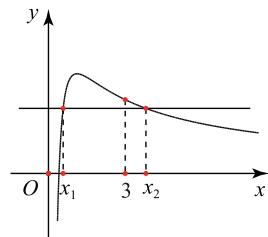
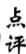
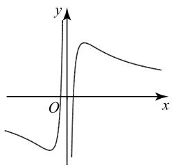
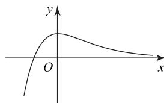

# 以“极值点偏移”为命题背景的导数综合题的解题策略

# 李波

# (四川省南充高级中学)

极值点偏移是指在函数极值点的左右两侧，由于函数值的增减速度不同，导致函数图像不对称，该类问题成为近几年高考中的热点问题。经过一轮复习以后，学生能够处理简单的对称问题，如证明 $x_{1} + x_{2} > a, x_{1}x_{2} > a$ （ $a$ 为常数）等，但针对非对称结构、复杂结构、含参不等式证明等问题时，却无从下手。为此，笔者将该类问题进行归纳总结，与大家一起分享。

# 1 利用函数单调性的定义,构造对称函数

例1 已知函数 $f(x) = x - \ln x - a$ 有两个不同的零点 $x_{1}, x_{2}$ .

(1)求实数 a 的取值范围；  
(2) 求证: $x_{1} + x_{2} > a + 1$ .

# 解析

(1) $a\in(1,+\infty)$ (求解过程略).

解析 (2) 不妨设 $x_{1} < x_{2}$ , 由(1)知, $x_{1} \in (0,1)$ , $x_{2} \in (1, +\infty)$ , 由 $x_{1} - \ln x_{1} - a = 0$ , 得 $a = x_{1} - \ln x_{1}$ .

要证 $x_{1} + x_{2} > a + 1$ ，则证 $x_{1} + x_{2} > x_{1} - \ln x_{1}+$ 1，即证 $x_{2} > 1 - \ln x_{1}$ .由 $x_{1}\in (0,1)$ ，知 $1 - \ln x_1\in$ $(1, + \infty)$ ，又 $f(x)$ 在 $(1, + \infty)$ 上单调递增，所以要证 $f(x_{2}) = f(x_{1}) > f(1 - \ln x_{1})$

令 $F(x)=f(x)-f(1-\ln x)=x-1+\ln(1-$

$\ln x)(x\in(0,1))$ ，则 $F'(x)=\frac{1-\ln x-\frac{1}{x}}{1-\ln x}$ .

令 $p(x) = 1 - \ln x - \frac{1}{x}$ ，则 $p'(x) = \frac{1 - x}{x^2} > 0$ ， $p(x)$ 在 $(0,1)$ 上单调递增， $p(x) < p(1) = 0$ ，易知 $F'(x) < 0$ ，即 $F(x)$ 在 $(0,1)$ 上单调递减， $F(x) > F(1) = 0$ ，所以 $f(x) - f(1 - \ln x) > 0$ ，可得

$$
f \left(x _ {2}\right) = f \left(x _ {1}\right) > f \left(1 - \ln x _ {1}\right),
$$

即 $x_{2} > 1 - \ln x_{1}$ ，所以 $x_{1} + x_{2} > a + 1$

证明不等式 $x_{1} + x_{2} > a + 1$ 的难点主要有以下两点：1)不等式中含有参数 $a$ ，不易想到消参；2) 证明 $x_{2} + \ln x_{1} > 1$ ，不易想到构造函数

$F(x)=f(x)-f(1-\ln x)(x\in(0,1))$ 证明 $x_{2}>1-\ln x_{1}$ . 本题应打破以往证明 $x_{1}+x_{2}>\lambda(\lambda$ 为常数) 的基本套路，这要求学生既要有扎实的基本功、灵活的应变能力，又要在通性通法的基础上适当创新.

# 2 利用同构思想化简,构造复合函数

例 2 （2022 年全国甲卷理 21）已知函数 $f(x)=$

$$
\frac {\mathrm{e} ^ {x}}{x} - \ln x + x - a.
$$

(1) 若 $f(x) \geqslant 0$ ，求 a 的取值范围；  
(2) 证明: 若 $f(x)$ 有两个零点 $x_{1}, x_{2}$ ，则 $x_{1}x_{2}<1$ .

# 解析

(1) $a\in(-\infty,\mathrm{e}+1]$ (求解过程略).   
(2) $f(x) = \frac{\mathrm{e}^x}{x} -\ln x + x - a = \mathrm{e}^{x - \ln x} + x -$

$\ln x-a$ ，令 $u(x)=x-\ln x$ ，易知 $u(x)$ 在 $(0,1)$ 上单调递减，在 $(1,+\infty)$ 上单调递增， $u(x)\geqslant u(1)=1$ 。

令 $F(t) = \mathrm{e}^t + t - a (t \geqslant 1)$ ，则当 $a \geqslant \mathrm{e} + 1$ 时，函数 $F(t)$ 有唯一零点 $t_0$ ，又因为 $f(x)$ 有两个不同的零点 $x_1, x_2$ ，所以 $u(x) = t_0$ 必有两个根 $x_1, x_2$ ，假设 $x_1 \in (0, 1), x_2 \in (1, +\infty)$ ，下面证明 $x_1 x_2 < 1$ .

要证 $x_{1}x_{2} < 1$ ，即证 $x_{2} < \frac{1}{x_{1}}$ ，因为 $x_{2},\frac{1}{x_{1}}\in (1,$ $+\infty),u(x)$ 在 $(1, + \infty)$ 上单调递增，所以只需证

$$
u \left(x _ {1}\right) = u \left(x _ {2}\right) <   u \left(\frac {1}{x _ {1}}\right).
$$

令 $h(x) = u(x) - u\left(\frac{1}{x}\right)(x \in (0,1))$ ，则

$$
h (x) = x - \frac {1}{x} - 2 \ln x,
$$

求导得 $h'(x)=\frac{(x-1)^{2}}{x^{2}}>0$ ，即 $h(x)$ 在 $(0,1)$ 上单调递增，故 $h(x)<h(1)=0$ ，则 $u(x)<u(\frac{1}{x})$ ，即 $u(x_{2})<u(\frac{1}{x_{1}})$ ，所以 $x_{1}x_{2}<1$ 得证.

点评 对于 $f(x) = \frac{\mathrm{e}^x}{x} -\ln x + x - a$ ，研究方案有

两种:1)变形为 $f(x)=\frac{\mathrm{e}^{x}}{x}+\ln\frac{\mathrm{e}^{x}}{x}-a$ ，则内函数为 $u(x)=\frac{\mathrm{e}^{x}}{x}$ ;2)变形为 $f(x)=\mathrm{e}^{x-\ln x}+x-\ln x-a$ ，则内函数为 $u(x)=x-\ln x$ 。结合函数的单调性，将原函数极值点偏移问题转化为内函数极值点偏移问题。

# 3 利用函数的性质与图像,快速解答客观题

例3 设 $a = \frac{3(2 - \ln 3)}{\mathrm{e}^2}, b = \frac{1}{\mathrm{e}}, c = \frac{\ln 3}{3}$ ，则 $a$ b,c 的大小顺序为().

A. a<c<b

B. c < a < b

C. a < b < c

D. b < a < c

$$
a = \frac {3 (2 - \ln 3)}{\mathrm{e} ^ {2}} = \frac {\ln \mathrm{e} ^ {2} - \ln 3}{\frac {\mathrm{e} ^ {2}}{3}} = \frac {\ln \frac {\mathrm{e} ^ {2}}{3}}{\frac {\mathrm{e} ^ {2}}{3}}, b =
$$

$\frac{\ln e}{e}$ ，构造函数 $f(x)=\frac{\ln x}{x}$ ，则 $f'(x)=\frac{1-\ln x}{x^{2}}$ ， $f(x)$ 在 $(0, e)$ 上单调递增，在 $(e, +\infty)$ 上单调递减，所以 $f(e) > f(3)$ , $f(e) > f(\frac{e^{2}}{3})$ ，即 b > c, b > a.

比较 a, c 的大小, 即比较 $f(\frac{\mathrm{e}^{2}}{3})$ , $f(3)$ 的大小. 假设 $f(x_{1}) = f(x_{2})$ , 如图 1 所示, 则 $x_{1}x_{2} > e^{2}$ (具体证明详见后文), 令 $x_{1} = \frac{e^{2}}{3}$ , 则 $x_{2} > 3$ , 结合 $f(x_{1}) = f(x_{2})$ , 有 $f(\frac{\mathrm{e}^{2}}{3}) = f(x_{2}) <$

line

| x    | y     |
| ---- | ----- |
| x₁   | 1.5   |
| x₂   | -1.5  |

图1

下面给出 $x_{1}x_{2} > \mathrm{e}^{2}$ 的证明过程，假设 $f(x_{1}) = f(x_{2})$ ，其中 $0 < x_{1} < \mathrm{e}, x_{2} > \mathrm{e}$ ，则 $\frac{\mathrm{e}^2}{x_2} < \mathrm{e}$ . 又

$$
f \left(x _ {1}\right) - f \left(\frac {\mathrm{e} ^ {2}}{x _ {2}}\right) = f \left(x _ {2}\right) - f \left(\frac {\mathrm{e} ^ {2}}{x _ {2}}\right) =
$$

$$
\frac {\ln x _ {2}}{x _ {2}} - \frac {x _ {2} (2 - \ln x _ {2})}{\mathrm{e} ^ {2}} = \frac {\mathrm{e} ^ {2} \ln x _ {2} - x _ {2} ^ {2} (2 - \ln x _ {2})}{x _ {2} \mathrm{e} ^ {2}},
$$

构造函数 $h(x)=\mathrm{e}^{2}\ln x-x^{2}(2-\ln x)(x>\mathrm{e})$ ，则

$$
h ^ {\prime} (x) = \frac {\mathrm{e} ^ {2} - 3 x ^ {2} + 2 x ^ {2} \ln x}{x}.
$$

令 $p(x)=\mathrm{e}^{2}-3x^{2}+2x^{2}\ln x(x>\mathrm{e})$ ，则

$$
p ^ {\prime} (x) = 4 x (\ln x - 1) > 0,
$$

所以 $p(x)$ 在 $(e, +\infty)$ 上单调递增，即 $p(x) > p(e) =$

0, 易知 $h'(x) > 0$ , $h(x)$ 在 $(e, +\infty)$ 上单调递增, 所以

$$
h (x) > h (\mathrm{e}) = 0,
$$

$$
f (x _ {2}) = f (x _ {1}) > f (\frac {\mathrm{e} ^ {2}}{x _ {2}}).
$$

又 $x_{1}, \frac{\mathrm{e}^{2}}{x_{2}} \in (0, \mathrm{e})$ ，所以 $x_{1} > \frac{\mathrm{e}^{2}}{x_{2}}$ ，即 $x_{1} x_{2} > \mathrm{e}^{2}$ .

令 $x_{2} = 3$ ，则 $f(x_{1}) > f(\frac{\mathrm{e}^{2}}{3})$ ，又 $f(x_{1}) = f(x_{2})$ 所以 $f(3) > f(\frac{\mathrm{e}^2}{3})$ ，则 $c > a$

综上，a<c<b，故选 A.

若客观题考查极值点偏移问题,可利用函数的性质与图像来快速求解.

# 4 利用对数均值不等式,巧证偏移问题

例4 已知函数 $f(x) = a^{x} - \mathrm{e}x^{2} (a > 0, a \neq 1)$ .

(1) 设 $g(x)=\frac{f(x)}{x}+ex$ ，讨论 $g(x)$ 的单调性；  
(2) 若 $a > 1$ , 函数 $f(x)$ 存在 3 个零点 $x_{1}, x_{2}, x_{3}$ .  
(i) 求实数 a 的取值范围；  
(ii) 设 $x_{1}<x_{2}<x_{3}$ ，求证 $x_{1}+3x_{2}+x_{3}>\frac{2e+1}{\sqrt{e}}$ .

析 (1) 当 $0 < a < 1$ 时, 函数 $g(x)$ 在 $(- \infty, \frac{1}{\ln a})$

上单调递增，在 $\left(\frac{1}{\ln a},0\right)$ 和 $(0,+\infty)$ 上单调递减；当a>1时，函数 $g(x)$ 在 $(-∞,0)$ 和 $(0,\frac{1}{\ln a})$ 上单调递减，在 $\left(\frac{1}{\ln a},+\infty\right)$ 上单调递增（求解过程略）.

(2)(i) 由 $f(0) = 1$ ，可知 0 不是 $f(x)$ 的零点。令 $a^x = \mathrm{e}x^2$ ，两边同时取自然对数，可得 $\ln a = \frac{1 + \ln x^2}{x}$ ，令 $h(x) = \frac{1 + \ln x^2}{x}$ ，易知 $h(x)$ 是奇函数。当 $x > 0$ 时， $h'(x) = \frac{1 - 2\ln x}{x^2}$ ，易知 $h(x)$ 在 $(0, \sqrt{\mathrm{e}})$ 上单调递增，在 $(\sqrt{\mathrm{e}}, +\infty)$ 上单调递减，故 $h_{\max}(\sqrt{\mathrm{e}}) = \frac{2}{\sqrt{\mathrm{e}}}$ ，又 $h(x)$ 是奇函数，所以 $h(x)$ 的大致图像如图 2 所示。由函数 $f(x)$ 存在 3 个零点 $x_1, x_2, x_3$ ，可知方程 $\ln a = \frac{1 + \ln x^2}{x}$ 有 3 个根，由图知 $0 < \ln a < \frac{2}{\sqrt{\mathrm{e}}}$ ，解得 $1 < a < \mathrm{e}^{\frac{2}{\sqrt{\mathrm{e}}}}$ 。

text_image

y
O
x

图2

（ii）由（i）可知 $-\frac{1}{\sqrt{\mathrm{e}}} < x_1 < 0, \frac{1}{\sqrt{\mathrm{e}}} < x_2 < \sqrt{\mathrm{e}}$ ， $x_3 > \sqrt{\mathrm{e}}$ ，且 $x_2 \ln a = 1 + 2 \ln x_2, x_3 \ln a = 1 + 2 \ln x_3$ ，两式相减得 $(x_2 - x_3) \ln a = 2 (\ln x_2 - \ln x_3)$ .

由对数均值不等式知

$$
\frac {2}{\ln a} = \frac {x _ {2} - x _ {3}}{\ln x _ {2} - \ln x _ {3}} <   \frac {x _ {2} + x _ {3}}{2},
$$

即 $x_{2} + x_{3} > \frac{4}{\ln a}$ ，所以

$$
x _ {1} + 3 x _ {2} + x _ {3} = (x _ {1} + x _ {2}) + x _ {2} + (x _ {3} + x _ {2}) >
$$

$$
0 + \frac {1}{\sqrt {\mathrm{e}}} + \frac {4}{\ln a}.
$$

又 $1 < a < \mathrm{e}^{\frac{2}{\sqrt{\mathrm{e}}}}$ ，所以

$$
\frac {1}{\sqrt {\mathrm{e}}} + \frac {4}{\ln a} > \frac {1}{\sqrt {\mathrm{e}}} + 2 \sqrt {\mathrm{e}} = \frac {2 \mathrm{e} + 1}{\sqrt {\mathrm{e}}}.
$$

注 下面给出对数均值不等式 $\frac{t_2 - t_3}{\ln t_2 - \ln t_3} < \frac{t_2 + t_3}{2} (t_2 < t_3)$ 的部分证明.

不等式两边同时除以 $t_3$ ，得 $\frac{\frac{t_2}{t_3} - 1}{\ln\frac{t_2}{t_3}} < \frac{\frac{t_2}{t_3} + 1}{2}$

令 $q(x)=2(x-1)-(x+1)\ln x(x\in(0,1))$ ，则

$$
q ^ {\prime} (x) = 1 - \frac {1}{x} - \ln x, q ^ {\prime \prime} (x) = \frac {1 - x}{x ^ {2}} > 0,
$$

易知 $q'(x)$ 在 $(0,1)$ 上单调递增，则 $q'(x) < q'(1) = 0$ ，故 $q(x)$ 在 $(0,1)$ 上单调递减， $q(x) > q(1) = 0$ ，即当 $x \in (0,1)$ 时， $2(x-1) - (x+1)\ln x > 0$ ，所以

$$
\frac {t _ {2} - t _ {3}}{\ln t _ {2} - \ln t _ {3}} <   \frac {t _ {2} + t _ {3}}{2} (t _ {2} <   t _ {3}).
$$

对数均值不等式：设 $x_{1}, x_{2} \in (0, +\infty)$ ，且$x_{1} \neq x_{2}$ , 则 $\sqrt{x_1x_2} < \frac{x_1 - x_2}{\ln x_1 - \ln x_2} <$ $\frac{x_1 + x_2}{2}$ , 其推论为 $\mathrm{e}^{\frac{x_1 + x_2}{2}} < \frac{\mathrm{e}^{x_1} - \mathrm{e}^{x_2}}{x_1 - x_2} < \frac{\mathrm{e}^{x_1} + \mathrm{e}^{x_2}}{2}$ . 解答本题时, 由已知条件构造 $\frac{x_1 - x_2}{\ln x_1 - \ln x_2}$ , 再使用上述不

等式,若是大题,还需对对数均值不等式进行证明.

# 5 反面入手去推证,得出结论有矛盾

例 5 已知函数 $f(x)=\frac{\mathrm{e}^{x-1}}{x}$ .

(1) 讨论 $f(x)$ 的单调性；

(2) 设 $a, b$ 是两个不相等的正数，且 $a + \ln b = b + \ln a$ ，证明： $a + b + \ln (ab) > 2$ .

# 解析

(1) $f(x)$ 在 $(-∞,0)$ ，(0,1)上单调递减，在 $(1,+∞)$ 上单调递增(求解过程略).

(2) 假设 $a + b + \ln (ab) \leqslant 2$ ，则 $a + b + \ln a + \ln b \leqslant 2$ 。由 $a + \ln b = b + \ln a$ ，可知 $b + \ln a \leqslant 1$ ，即 $a \leqslant e^{1 - b}$ ，又 $a - 1 - \ln a = b - 1 - \ln b$ ，所以 $\ln f(a) = \ln f(b)$ ，则 $f(a) = f(b)$ 。不妨假设 $a \in (0,1), b \in (1, +\infty)$ ，则 $a, e^{1 - b} \in (0,1)$ ，由 $a \leqslant e^{1 - b}$ ，可知 $f(a) \geqslant f(e^{1 - b})$ ，则 $f(b) \geqslant f(e^{1 - b})$ ，即 $\frac{e^{b - 1}}{b} \geqslant \frac{e^{e^{1 - b} - 1}}{e^{1 - b}}$ ，整理得 $\frac{e}{b} \geqslant e^{e^{1 - b}}$ ，两边同时取自然对数，得 $1 - \ln b \geqslant e^{1 - b}$ ，即 $e^{b - 1}(1 - \ln b) \geqslant 1$ 。

令 $h(x)=\mathrm{e}^{x-1}(1-\ln x)(x>1)$ ，则 $h'(x)=\mathrm{e}^{x-1}\left[\ln\frac{1}{x}-\left(\frac{1}{x}-1\right)\right]<0$ ， $h(x)$ 在 $(1,+\infty)$ 上单调递减，易知 $h(x)<h(1)=1$ ，这与 $\mathrm{e}^{b-1}(1-\ln b)\geqslant1$ 矛盾，故假设不成立.

# 点评

本题使用正难则反法,选择从反面入手,把假设当成已知条件去分析问题,得出新的结范围方面找到矛盾,即假设不成立.

# 6 变换目标成齐次结构,构造过渡函数

例6 已知函数 $f(x) = x \ln x - a(x^2 - 1) + x$ .

(1) 若 $f(x)$ 单调递减, 求 a 的取值范围;

(2) 若 $f(x)$ 有两个不同的极值点 $x_{1}, x_{2}$ ，且 $x_{2} > 3x_{1}$ ，求证： $e^{10}x_{1}^{2}x_{2}^{3} > 3^{\frac{11}{2}}$ .

# 解析

(1) $a\in\left[\frac{e}{2},+\infty\right)$ (求解过程略).

(2) 因为 $x_{1}, x_{2}$ 是 $f(x)$ 两个不同的极值点，所以 $f'(x) = 2 + \ln x - 2ax = 0$ 有两个根 $x_{1}, x_{2}$ ，即

$$
\left\{ \begin{array}{l} 2 + \ln x _ {1} - 2 a x _ {1} = 0, \\ 2 + \ln x _ {2} - 2 a x _ {2} = 0, \end{array} \right.
$$

解得 $\left\{\begin{aligned}\ln x_{1}&=2ax_{1}-2,\\ \ln x_{2}&=2ax_{2}-2,\end{aligned}\right.$ 则 $a=\frac{\ln x_{1}-\ln x_{2}}{2x_{1}-2x_{2}}.$

要证明 $\mathrm{e}^{10}x_1^2 x_2^3 >3^{\frac{11}{2}}$ ，即证明 $10 + 2\ln x_{1}+$ $3\ln x_{2} > \frac{11}{2}\ln 3.$ 由 $\left\{ \begin{array}{l}\ln x_1 = 2ax_1 - 2,\\ \ln x_2 = 2ax_2 - 2, \end{array} \right.$ 可知 $10 + 2\ln x_{1}+$ $3\ln x_{2} = 4ax_{1} + 6ax_{2}$ ，由 $a = \frac{\ln x_1 - \ln x_2}{2x_1 - 2x_2}$ ，可知

$$
4 a x _ {1} + 6 a x _ {2} = (2 x _ {1} + 3 x _ {2}) \frac {\ln x _ {1} - \ln x _ {2}}{x _ {1} - x _ {2}},
$$

等式右边分子、分母同时除以 $x_{2}$ ，得

$$
1 0 + 2 \ln x _ {1} + 3 \ln x _ {2} = (2 \frac {x _ {1}}{x _ {2}} + 3) \frac {\ln \frac {x _ {1}}{x _ {2}}}{\frac {x _ {1}}{x _ {2}} - 1},
$$

由 $x_{2} > 3x_{1}$ ，可知 $\frac{x_1}{x_2}\in (0,\frac{1}{3})$

构造函数 $F(x) = (2x + 3)\frac{\ln x}{x - 1} (x\in (0,\frac{1}{3}))$ ，则

$$
F ^ {\prime} (x) = \frac {2 x ^ {2} + x - 3 - 5 x \ln x}{x (x - 1) ^ {2}}.
$$

令 $p(x)=2x^{2}+x-3-5x\ln x$ ，则

$$
p ^ {\prime} (x) = 4 x - 4 - 5 \ln x,
$$

$$
p ^ {\prime \prime} (x) = \frac {4 x - 5}{x} <   0,
$$

即 $p'(x)$ 在 $(0, \frac{1}{3})$ 上单调递减， $p'(x) > p'(\frac{1}{3}) = 5\ln 3 - \frac{8}{3} > 0$ ， $p(x)$ 在 $(0, \frac{1}{3})$ 上单调递增， $p(x) < p(\frac{1}{3}) = \frac{5}{3}\ln 3 - \frac{22}{9} < 0$ ，故 $F(x)$ 在 $(0, \frac{1}{3})$ 上单调递减，所以 $F(x) > F(\frac{1}{3}) = \frac{11}{2}\ln 3$ ，即

$$
1 0 + 2 \ln x _ {1} + 3 \ln x _ {2} > \frac {1 1}{2} \ln 3.
$$

综上， $e^{10}x_{1}^{2}x_{2}^{3}>3^{\frac{11}{2}}$

# 点评

证明 $\mathrm{e}^{10}x_1^2 x_2^3 >3^{\frac{11}{2}}$ 的基本思路有以下两种：1) 将 $\mathrm{e}^{10} x_1^2 x_2^3$ 变形为 $\mathrm{e}^{10} (x_1 x_2)^2 x_2$ ，根据极值点偏移结论，分别找到 $x_{1}x_{2}, x_{2}$ 的范围，再利用不等式的基本性质得出 $\mathrm{e}^{10}x_1^2 x_2^3$ 的范围，感兴趣的读者可以尝试证明，但该方法行不通；2)将目标结构等价变形，结合已知条件代换成齐次式，从而构造过渡函数，求函数的值域，即可证明不等式.

例7 已知函数 $f(x) = a\mathrm{e}^{x} - x^{2} - 2x(a\in \mathbf{R})$ .

(1) 若函数 $g(x)$ 为函数 $f(x)$ 的导函数, 讨论函数 $g(x)$ 的单调性;  
(2) 若函数 $f(x)$ 的两个极值点分别为 $x_{1}, x_{2}$ ，且

$x_{1}<x_{2}$ ，不等式 $x_{1}+\lambda x_{2}>0$ 恒成立，求实数 $\lambda$ 的取值范围.

# 解析

(1) 当 $a \leqslant 0$ 时, $g(x)$ 在 $\mathbf{R}$ 上单调递减; 当$a > 0$ 时， $g(x)$ 在 $(-\infty ,\ln \frac{2}{a})$ 上单调递减，在 $(\ln\frac{2}{a},+\infty)$ 上单调递增(求解过程略).

(2) 因为函数 $f(x)$ 的两个极值点分别为 $x_{1}, x_{2}$ ，所以 $x_{1}, x_{2}$ 是 $ae^{x} - 2x - 2 = 0$ 的两个根。令 $h(x) =$

$\frac{x+1}{e^{x}}$ ，则 $h'(x)=\frac{-x}{e^{x}}$ ，易知 $h(x)$ 在 $(-∞,0)$ 上单调递增，在 $(0,+∞)$ 上单调递减， $h(0)=1,h(x)$ 的图像如图 3 所示，且满足 $\frac{x_{1}+1}{e^{x_{1}}}=\frac{x_{2}+1}{e^{x_{2}}}$ ，

text_image

y
O
x

图3

其中 $x_{1}\in(-1,0)$ , $x_{2}\in(0,+\infty)$ .

令 $\frac{x_{1}}{x_{2}}=t$ ，则 $t<0, x_{1}=tx_{2}$ ，所以 $\frac{tx_{2}+1}{e^{tx_{2}}}=\frac{x_{2}+1}{e^{x_{2}}}$ ，整理得 $(tx_{2}+1)e^{x_{2}}=(x_{2}+1)e^{tx_{2}}$ .

构造函数 $F(x)=(tx+1)\mathrm{e}^{x}-(x+1)\mathrm{e}^{tx}(x>0, t<0)$ ，则 $F(x)$ 在 $(0,+\infty)$ 上必存在零点，又 $F(0)=0$ ，所以 $F(x)$ 在 $(0,+\infty)$ 上不单调。而 $F'(x)=(\mathrm{e}^{x}-\mathrm{e}^{tx})(tx+t+1)$ ，由 x>0, t<0，可知 $F(x)$ 在 $(0, -\frac{t+1}{t})$ 上单调递增，在 $(- \frac{t+1}{t}, +\infty)$ 上单调递减。因为 t<0，所以当 $x \to +\infty$ 时， $F(x) \to -\infty$ ，当 $F(x)$ 在 $(0,+\infty)$ 上存在零点时，则必有 $-\frac{t+1}{t}>0$ ，解得 -1<t<0。因为不等式 $x_{1}+\lambda x_{2}>0$ 恒成立，所以 $\frac{x_{1}}{x_{2}} >-\lambda$ 恒成立，即 $-\lambda \leqslant -1$ ，解得 $\lambda \geqslant 1$ 。

以极值点偏移为背景求参数(变量)的取值范围、不等式证明、比较大小等问题,考查函数的性质与图像、指数与对数的运算、函数的零点与极值、导数的四则运算等知识,考查分类讨论、数形结合、转化与化归等思想方法;考查运算求解、逻辑思维、推理论证、抽象概括等能力.试题情境简单大气,解答过程低进高出,解答方法灵活多变,能较好地培养学生创新意识与思辨能力.

(完)