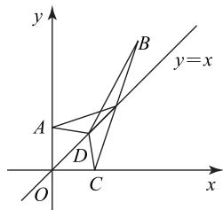
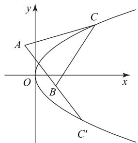
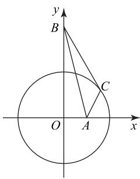
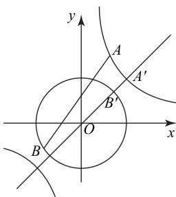
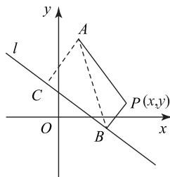
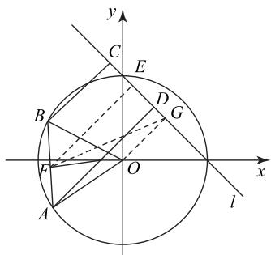
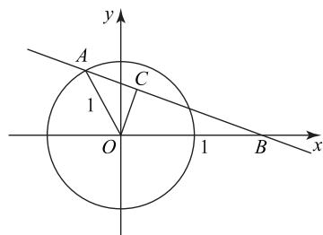
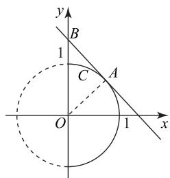
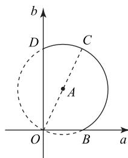
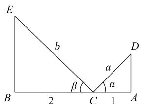

# 以形释数,构图求最值

王远征

(广东省深圳市高级中学南校区)

数与形是数学研究对象的两个方面,高校强基测试题和数学竞赛题十分重视对数形结合思想方法在解题中灵活运用能力的考查.求函数的最值(或值域)问题是强基校考试题和数学竞赛试题中的热点,这类试题设计新颖别致、巧妙灵活,其解题方法丰富多彩、灵活多变,富有挑战性.对解题者的观察能力、联想能力、化归意识、灵活运用数学思想解决问题能力的考查十分到位.本文结合例题介绍数形结合思想在解答求函数最值问题中的应用,以期读者体会数形结合思想在解题中发挥的化难为易、化繁为简、化抽象为具体的作用.

# 1 构造两点间的距离公式求最值

当我们遇到已知条件或待求式出现形如 $\sqrt{(a - c)^2 + (b - d)^2}$ 或 $(a - c)^2 + (b - d)^2$ 时，可以将其转化为平面直角坐标系中两点 $A(a, b)$ 和 $B(c, d)$ 之间的距离，再利用两点之间线段最短或三角形中三边不等关系求解.

例1 求函数 $f(x) = \sqrt{2x^2 - 2x + 1} +$ $\sqrt{2x^{2}-10x+13}$ 的最小值.

如果按常规方法求函数的导数,得出驻点,然后分类讨论,进而根据函数的单调性求最小值,计算量大.若将解析式用配方法恒等变形为两点间距离公式的形式,便可以利用几何图形的直观性和几何性质快速获解.

对目标函数配方得

$$
f (x) = \sqrt {(x - 0) ^ {2} + (x - 1) ^ {2}} + \sqrt {(x - 2) ^ {2} + (x - 3) ^ {2}},
$$

其几何意义是“直线 y=x 上一动点 $D(x,x)$ 到两个定点 $A(0,1)$ , $B(2,3)$ 的距离之和”，即

$$
f (x) = | D A | + | D B |.
$$

如图 1 所示, 作点 A 关于直线 y = x 的对称点 C(1,0), 根据平面几何知识得 $\left|DC\right| = \left|DA\right|$ , 则

text_image

y
B
y=x
A
D
O
C
x

图1

$$
\mid D A \mid + \mid D B \mid = \mid D C \mid + \mid D B \mid \geqslant \mid B C \mid =
$$

$$
\sqrt {(2 - 1) ^ {2} + (3 - 0) ^ {2}} = \sqrt {1 0},
$$

当且仅当 B, D, C 三点共线时，等号成立，此时 $f_{\min}(x)=\sqrt{10}$ .

变式训练 求函数 $f(x)=\sqrt{x^{2}+1}+\sqrt{x^{2}-6x+10}$ 的最小值.

答案 $\sqrt{13}$

例2 求函数 $f(x) = \sqrt{x^4 + 3x^2 - 6x + 10} -$ $\sqrt{x^{4}-3x^{2}+2x+5}$ 的最大值.

解析

按常规方法求该函数的最大值,计算量大,我们采用数形结合思想来求解,通过配方法将函数解析式表示成两点间距离公式的形式,再在平面直角坐标系中借助几何图形的直观性求最大值.

对目标函数恒等变形得

$$
f (x) = \sqrt {(x ^ {2} + 1) ^ {2} + (x - 3) ^ {2}} -
$$

$$
\sqrt {(x ^ {2} - 2) ^ {2} + (x + 1) ^ {2}},
$$

其几何意义是“动点 $C(x^{2},x)$ 到两个定点 A(-1,3)，B(2,-1) 的距离之差”，即 $f(x)=|CA|-|CB|$ ，而动点 C 在抛物线 $y^{2}=x$ 上.

如图2所示， $f(x) = |CA| - |CB|\leqslant |AB| =$ $\sqrt{(-1 - 2)^2 + (3 + 1)^2} = 5$ ，当且仅当点 $C$ 是射线 $AB$ 与抛物线的交点时，等号成立，此时 $f_{\mathrm{max}}(x) = 5.$

text_image

y
A
C
O
x
B
C'

图2

变式训练 已知实数 $x, y$ 满足 $3x^{2} + 4y^{2} = 48$ ，则函数 $f(x, y) = \sqrt{x^{2} + y^{2} - 4x + 4} + \sqrt{x^{2} + y^{2} - 2x + 4y + 5}$ 的最大值是 \_\_\_\_.

答案 $8 + \sqrt{13}$

例3 求函数 $f(\theta) = \sqrt{5 - 4\sin\theta} + \sqrt{\frac{5}{4} - \cos\theta}$

的最小值.

因为 $\sin^{2}\theta+\cos^{2}\theta=1$ ，所以将目标函数恒等变形为

$$
f (\theta) = \sqrt {(\cos \theta - 0) ^ {2} + (\sin \theta - 2) ^ {2}} +
$$

$$
\sqrt {(\cos \theta - \frac {1}{2}) ^ {2} + (\sin \theta - 0) ^ {2}},
$$

则该式的几何意义是“动点 $C(\cos\theta,\sin\theta)$ 到两个定点定点 $A(\frac{1}{2},0),B(0,2)$ 的距离之和”，即 $f(\theta)=|CA|+|CB|$ ，而动点C在单位圆 $x^{2}+y^{2}=1$ 上运动，如图3所示，则

text_image

y
B
C
O
A
x

图3

$$
f (\theta) = | C A | + | C B | \geqslant
$$

$$
\vert A B \vert = \sqrt {2 ^ {2} + (\frac {1}{2}) ^ {2}} = \frac {\sqrt {1 7}}{2},
$$

当且仅当 $A, C, B$ 三点共线时，等号成立，此时

$$
f _ {\min} (\theta) = \frac {\sqrt {1 7}}{2}.
$$

# 点评

以上三道例题都是通过配方法将根式表示成两点间距离公式的形式,其几何意义是两条动线段的和或差,其中一个动点在直线或曲线上运动,另外两点是定点,这时可以利用三角形中三边长关系求最大值或最小值.

例 4 已知实数 a, b, c, d 满足 $ab = c^{2} + d^{2} = 1$ , $-c)^{2} + (b - d)^{2}$ 的最小值是 \_\_\_\_.

若按常规方法将四元式子转化为一元式子，析难以实现转化，故将目标式子 $(a - c)^2 +$ $(b - d)^2$ 看作是两个动点 $A(a, b)$ 与 $B(c, d)$ 间的距离的平方，即 $|AB|^2$ ，再利用数形结合思想求解.

设点 $A(a,b)$ 与点 $B(c,d)$ ，则 $(a-c)^{2}+(b-d)^{2}=|AB|^{2}$ ，而点 A 和 B 分别在双曲线 $y=\frac{1}{x}$ 和单位圆 $x^{2}+y^{2}=1$ 上运动，如图 4 所示.

注意到双曲线和单位圆有公共的对称轴 y=x，当动点 A, B 位于对称轴 y=x，

且分别与双曲线和单位圆相交（即 $A'$ , $B'$ ），此时

text_image

y
A
A'
B'
O
x
B

图4

$A(1,1), B(\frac{\sqrt{2}}{2}, \frac{\sqrt{2}}{2})$ ，则 $|AB|^2$ 的最小值为

$$
\left| A B \right| _ {\min} ^ {2} = (1 - \frac {\sqrt {2}}{2}) ^ {2} + (1 - \frac {\sqrt {2}}{2}) ^ {2} = 3 - 2 \sqrt {2},
$$

则 $(a - c)^2 +(b - d)^2$ 的最小值是 $3 - 2\sqrt{2}$

# 点评

此题由待求式的结构特征联想到两点间的距离公式,将目标函数转化为两个动点上的距离的平方,再结合动点所在的曲线特征,顺利求出目标函数的最小值.

变式训练 已知 $x, y \in \mathbf{R}, x^2 + \frac{81}{x^2} - 2xy - \frac{18\sqrt{2 - y^2}}{x} \geqslant \lambda$ 恒成立，则 $\lambda$ 的取值范围是 \_\_\_\_.

答案 $\lambda \leqslant 6$

# 2 构造点到直线的距离公式求最值

当待求目标式中出现了 $|ax+by+c|$ 的形式时，我们可以构造点 $P(x,y)$ 到直线 $l:ax+by+c=0$ 的距离公式来求最值.

例5 当 $x, y$ 取任意实数时，求函数 $f(x, y) =$ $\sqrt{(x - 1)^2 + (y - 4)^2} + \frac{1}{5} |3x + 4y - 5|$ 的最小值.

# 解析

$$
\sqrt {(x - 1) ^ {2} + (y - 4) ^ {2}}
$$

解析 的几何意义是“动点 $P(x,y)$ 与定点 $A(1,4)$ 的距离 $|PA|$ ”； $\frac{1}{5}|3x+4y-5|$ 的几何意义是“动点 $P(x,y)$ 到定直线 $l:3x+4y-5=0$ 的距离$|PB|$ ”, 则问题转化为求 $|PA| + |PB|$ 的最小值.

text_image

y
l
A
C
O
B
P(x,y)
x

图5

如图 5 所示, 作 $AC \perp l$ 于 C, 由图可知

$$
\mid P A \mid + \mid P B \mid \geqslant \mid A B \mid \geqslant \mid A C \mid =
$$

$$
\frac {| 3 \times 1 + 4 \times 4 - 5 |}{5} = \frac {1 4}{5}.
$$

# 点评

该题中利用了三角形中两边之和大于第三边、直角三角形的斜边长大于直角边长等基本的数学知识,解题中遵循言之有理、持之有据原则.

例6 已知 $x_{1}, x_{2}, y_{1}, y_{2}$ 满足 $x_{1}^{2} + y_{1}^{2} = 1, x_{2}^{2} +$ $y_{2}^{2} = 1, x_{1}x_{2} + y_{1}y_{2} = \frac{1}{2}$ , 则 $\frac{|x_1 + y_1 - 1|}{\sqrt{2}} +$ $\frac{|x_2 + y_2 - 1|}{\sqrt{2}}$ 的最大值是

由 $x_{1}^{2}+y_{1}^{2}=1, x_{2}^{2}+y_{2}^{2}=1$ ，可知动点 $A(x_{1},$ $y_{1}$ 与 $B(x_{2},y_{2})$ 都在单位圆 $x^{2}+y^{2}=1$ 上运动，且 $|\overrightarrow{OA}| = |\overrightarrow{OB}| = 1, \overrightarrow{OA} = (x_1, y_1), \overrightarrow{OB} = (x_2, y_2)$ ，则 $\overrightarrow{OA} \cdot \overrightarrow{OB} = x_1 x_2 + y_1 y_2 = \cos \angle AOB = \frac{1}{2}$ ，求得 $\angle AOB = 60^\circ$ ，则 $\triangle AOB$ 是正三角形.

$\frac{|x_1 + y_1 - 1|}{\sqrt{2}}$ 和 $\frac{|x_2 + y_2 - 1|}{\sqrt{2}}$ 分别表示“动点 $A(x_{1},y_{1})$ 与 $B(x_{2},y_{2})$ 到直线 $l:x + y - 1 = 0$ 的距离 $d_{1}$ 和 $d_{2}$ ”，则问题转化为求 $d_{1} + d_{2}$ 的最大值.

如图 6 所示, 作 $AD \perp l, BC \perp l, OG \perp l$ , 垂足分别是点 D, C, G, 记点 E, F 分别是线段 CD 和 AB 的中点, 则

$$
d _ {1} + d _ {2} = | A D | + | B C | =
$$

$$
2 \mid E F \mid \leqslant \mid F G \mid \leqslant \mid O F \mid + \mid O G \mid .
$$

text_image

y
C
E
B
D
G
F
O
x
A
l

图6

当线段 $AB \parallel l$ ，且 $AB$ 与 $l$ 分别位于圆心两侧时， $d_1 + d_2$ 取得最大值，最大值为

$$
2 (1 \times \sin 6 0 ^ {\circ} + 1 \times \sin 4 5 ^ {\circ}) = 2 \times \frac {\sqrt {3} + \sqrt {2}}{2} = \sqrt {3} + \sqrt {2}.
$$

此题在解答中应用了梯形中位线的性质、三角形中两边之和大于第三边等基本的数学知识来推理论证,确保解题过程的严谨性.

变式训练 已知 $x, y \in \mathbf{R}^*$ ，且满足 $2x + y = 1$ ，求 $x + \sqrt{x^2 + y^2}$ 的最小值.

答案 $\frac{4}{5}$ .

例 7 当 s 和 t 取遍所有实数时， $(s+7-$ $\left|\cos t\right|)^{2}+(s-2\left|\sin t\right|)^{2}$ 的最小值是 \_\_\_\_.

设点 $A(s+7,s)$ ， $B(|\cos t|,2|\sin t|)$ ，则

$$
\left| A B \right| ^ {2} = (s + 7 - | \cos t |) ^ {2} + (s - 2 | \sin t |) ^ {2},
$$

动点 $A(s+7,s)$ 的轨迹方程是直线 l:x-y-7=0.

注意到 $|\cos t| \geqslant 0, |\sin t| \geqslant 0$ ，不妨设 $t \in [0, \frac{\pi}{2}]$ ，则点 $B(\cos t, 2\sin t)$ 到直线 $l: x - y - 7 = 0$ 的

26

数理化

距离是

$$
d (t) = \frac {| \cos t - 2 \sin t - 7 |}{\sqrt {2}} = \frac {7 - \cos t + 2 \sin t}{\sqrt {2}},
$$

求导数得 $d^{\prime}(t) = \frac{2\cos t + \sin t}{\sqrt{2}}$ 当 $t\in [0,\frac{\pi}{2} ]$ 时，

$d'(t)>0$ , 所以函数 $d(t)$ 在 $t\in[0,\frac{\pi}{2}]$ 上单调递增,

则当 t=0 时,有

$$
d _ {\min} (t) = \frac {7 - \cos 0 + 2 \sin 0}{\sqrt {2}} = 3 \sqrt {2},
$$

故 $|AB|_{\min}^{2}=18.$

点评

解答时除了利用几何的直观性外，在求动点到直线的距离的最小值时，恰当地应用了导数的知识,借助函数的单调性来求函数的最值.

变式训练 设函数 $f(x) = ax^{2} + (2b + 1)x - a - 2(a, b \in \mathbf{R}, a \neq 0)$ 在[3,4]至少有一个零点，则 $a^2 + b^2$ 的最小值是 \_\_\_\_.

答案 $\frac{1}{100}$ .

# 3 构造直线的斜率公式求最值

对于形如 $\frac{y_{1}-y_{2}}{x_{1}-x_{2}}$ 的代数形式,我们可以把它看作是直线的斜率,将问题转化为在平面直角坐标系中两点 $A(x_{1},y_{1})$ 与 $B(x_{2},y_{2})$ 连线的斜率,特别适用于一个动点(在一个区域和曲线上运动)与一个定点的最值问题.

例8 设 $x \in \mathbf{R}$ , 则 $y = \frac{\sin x}{2 - \cos x}$ 的最大值是\_\_\_\_。

析 $y = \frac{\sin x}{2 - \cos x} = -\frac{\sin x - 0}{\cos x - 2}$ 记 $k =$ $\frac{\sin x-0}{\cos x-2}$ ，则 k 是动点 $A(\cos x, \sin x)$ 与定点 B(2，0) 连线的斜率(如图 7). 过点 $B(2,0)$ 且斜率是 $k$ 的直线方程为 $y = k(x - 2)$ , 即 $kx - y - 2k = 0$ .

text_image

y
A
C
1
O
1
B
x

图 7

该直线与单位圆 $x^{2} + y^{2} = 1$ 有公共点 $A(\cos x, \sin x)$ ，则圆心到直线的距离不大于半径1，即 $\frac{| - 2k|}{\sqrt{k^2 + 1}} \leqslant 1$ ，解得 $-\frac{\sqrt{3}}{3} \leqslant k \leqslant \frac{\sqrt{3}}{3}$ ，于是 $-\frac{\sqrt{3}}{3} \leqslant -k \leqslant \frac{\sqrt{3}}{3}$ ，即 $-\frac{\sqrt{3}}{3} \leqslant y \leqslant \frac{\sqrt{3}}{3}, y = \frac{\sin x}{2 - \cos x}$ 的最大值是 $\frac{\sqrt{3}}{3}$ .

点评

此题利用了直线与圆相交时, 圆心到直线的距离不大于圆的半径列不等式求最值.

例9 函数 $y = -4x + 3\sqrt{4x^2 + 1}$ 的最小值 \_\_\_\_.

析

设 $2x = \tan \theta (\theta \in (-\frac{\pi}{2},\frac{\pi}{2}))$ ，则

$$
\begin{array}{l} y = - 4 x + 3 \sqrt {4 x ^ {2} + 1} = \\ - 2 \tan \theta + \frac {3}{\cos \theta} = \frac {- 2 (\sin \theta - \frac {3}{2})}{\cos \theta - 0}. \\ \end{array}
$$

设 $k=\frac{\sin\theta-\frac{3}{2}}{\cos\theta-0}$ ，则 k 是动点 $A(\cos\theta,\sin\theta)$ 与定点 $B(0,\frac{3}{2})$ 连线的斜率，则过点 $B(0,\frac{3}{2})$ 且斜率是 k 的直线方程为 $y=kx+\frac{3}{2}$ ，即 $kx-y+\frac{3}{2}=0$ 。

该直线与单位圆 $x^{2}+y^{2}=1$ 的右半圆有公共点 A ( $\cos\theta$ , $\sin\theta$ ), 如图 8 所示. 当圆与直线相切时，k 最大，即 $\frac{\left|\frac{3}{2}\right|}{\sqrt{k^{2}+1}}=1$ ，解得 $k = -\frac{\sqrt{5}}{2}$ (正值舍)，于是 $y_{\min}=-2k_{\max}=\sqrt{5}.$

text_image

y
B
1
C
A
O
1
x

图8

点评

通过换元法将问题转化为动直线的斜率问题,再借助数形结合思想求解,注重对化归与转化能力的考查.但一定要根据 $2x = \tan \theta (\theta \in (-\frac{\pi}{2},\frac{\pi}{2}))$ 的取值范围来正确画图，其对应的动点轨迹是半圆.

# 4 构造直线和圆求最值

将已知条件和待求式适当地恒等变形,根据直线与圆有公共点时,圆心到直线的距离不大于圆的半径来列不等式求最值.

例10 已知函数 $f(x) = x^{2} + ax + \frac{1}{x^2} + \frac{a}{x} + b$ $(x \in \mathbf{R}, x \neq 0)$ ，若存在实数 a, b 使得 $f(x) = 0$ 有实根，求 $a^{2} + b^{2}$ 的最小值.

析

设 $y$ 是 $f(x) = 0$ 的一个实根，则 $y^{2} + ay + \frac{1}{y^{2}} +\frac{a}{y} +b = 0$ ，整理得

$$
a \left(y + \frac {1}{y}\right) + b + \left(y ^ {2} + \frac {1}{y ^ {2}}\right) = 0,
$$

它表示以 a, b 为变量的直线方程，以 a, b 为变量可以构造圆 $a^{2} + b^{2} = r^{2}$ . 当圆与直线有公共点时，由直线与圆的位置关系得

$$
r \geqslant \frac {\left| 0 + 0 + y ^ {2} + \frac {1}{y ^ {2}} \right|}{\sqrt {(y + \frac {1}{y}) ^ {2} + 1}} = \frac {y ^ {2} + \frac {1}{y ^ {2}}}{\sqrt {y ^ {2} + \frac {1}{y ^ {2}} + 3}},
$$

则 $r^2 \geqslant \frac{(y^2 + \frac{1}{y^2})^2}{y^2 + \frac{1}{y^2} + 3}$ , 于是

$$
\frac {1}{r ^ {2}} \leqslant \frac {1}{y ^ {2} + \frac {1}{y ^ {2}}} + \frac {3}{(y ^ {2} + \frac {1}{y ^ {2}}) ^ {2}} \leqslant \frac {1}{2} + \frac {3}{4} = \frac {5}{4},
$$

当且仅当 $y=\pm1$ 时，等号成立，则 $r^{2}\geqslant\frac{4}{5}$ ，即 $a^{2}+b^{2}$ 的最小值是 $\frac{4}{5}$ .

点评

此题在求最值时,恰当地应用了对勾函数的性质,体现了数与形的有机结合.

例 11 若实数 x, y 满足 $x - 4\sqrt{y} = 2\sqrt{x - y}$ ，的取值范围是 \_\_\_\_.

设 $a = \sqrt{y}, b = \sqrt{x - y} (a \geqslant 0, b \geqslant 0)$ ，则 $x = a^2 + b^2, a^2 + b^2 - 4a = 2b$ ，即

$$
(a - 2) ^ {2} + (b - 1) ^ {2} = 5 (a \geqslant 0, b \geqslant 0).
$$

如图 9 所示, 在平面直角坐标系 aOb 中, 动点 $(a, b)$ 的轨迹是以点 A(2,1) 为圆心、 $\sqrt{5}$ 为半径的圆在 $a \geqslant 0, b \geqslant 0$ 区域内的部分, 即点 O 和弧 BCD 的并集, 所以 $\sqrt{a^{2} + b^{2}} \in \{0\} \cup [2, 2\sqrt{5}]$ , 故 x 的取值范围是 $\{0\} \cup [4, 20]$ .

text_image

b
D
C
A
O
B
a

图9

点评

画动点的轨迹时,应该注意动点 $(a,b)$ 的取值范围 $\{(a,b)\mid a\geqslant0,b\geqslant0\}$ ，要客观地反映问题的真实情况.

# 一道双变量不等式问题引发的探究

王欣 谢辉 杨冬梅

(北京工业大学附属中学)

双变量导数问题一直是函数与导数问题的难点，求解此类问题的核心是消元，或通过同构法构造函数，利用函数的单调性求解。学生在问题解决的过程中，往往判断不出两个变量之间的关系，无法决定究竟是利用同构法进行变量分离构造新函数，还是通过消元的方式减少变量的个数，从而将原问题转化为一元函数问题。本文通过分析一道双变量不等式问题解决过程中学生出现的错误，找到学生在知识与方法上的误区，制订有针对性的学习策略。

题目 已知函数 $f(x)=\frac{1}{x}-x+a\ln x$ ，若 $f(x)$ 存在两个极值点 $x_{1}, x_{2}$ ，证明 $\frac{f(x_{1})-f(x_{2})}{x_{1}-x_{2}}<a-2.$

# 1 错解分析

错解 1 若函数 $f(x)$ 存在两个大于 0 的极值点，则 $f'(x)=\frac{-x^{2}+ax-1}{x^{2}}=0$ ，则 $-x^{2}+ax-1=0$ 有两个正实根， $\Delta=a^{2}-4>0$ ，解得 a<-2 或 a>2，依题意可知 $x_{1}+x_{2}=a>0$ ，故 a>2，则 a-2>0。观察 $\frac{f(x_{1})-f(x_{2})}{x_{1}-x_{2}}$ ，联想到斜率，认为本题只需证 $f'(x)<0$ ，则证 $\frac{-x^{2}+ax-1}{x^{2}}<0$ ，即证 $x^{2}-ax+1>0$ 在 $(0,+\infty)$ 恒成立，而此结论显然不成立。

评析 上述解法至少存在三个误区: 第一, 将割

# 5 构造直角三角形求最值

例12 已知 $a$ 和 $b$ 满足 $a > 1, b > 2$ , 求$\frac{(a + b)^2}{\sqrt{a^2 - 1} + \sqrt{b^2 - 4}}$ 的最小值.

解析

如图 10 所示, 点$A, B, C$ 在线段AB 上, AC = 1, BC = 2,$CE = b, CD = a, EB \perp$ $AB$ ， $DA \perp AB$ ，记$\angle ACD = \alpha, \angle BCE =$ $\beta$ ，则

text_image

E
b
a
D
β
α
B 2 C 1 A

图10

$$
a \cos \alpha + b \cos \beta = 3, \tag {①}
$$

$$
\sqrt {a ^ {2} - 1} = a \sin \alpha , \sqrt {b ^ {2} - 4} = b \sin \beta ,
$$

故原函数可以表示为 $\frac{(a + b)^2}{a\sin\alpha + b\sin\beta}$ . 记

$$
a \sin \alpha + b \sin \beta = x, \tag {②}
$$

由① $^{2}$ +② $^{2}$ 得

$$
a ^ {2} + b ^ {2} + 2 a b \cos (\alpha - \beta) = x ^ {2} + 9,
$$

则 $x^{2}+9\leqslant(a+b)^{2}$ ，当且仅当 $\alpha=\beta$ 时，等号成立。
于是

$$
\frac {(a + b) ^ {2}}{a \sin \alpha + b \sin \beta} = \frac {(a + b) ^ {2}}{x} \geqslant \frac {x ^ {2} + 9}{x} \geqslant \frac {6 x}{x} = 6,
$$

当且仅当 x=3 时，等号成立，此时 $a=\sqrt{2}$ ， $b=2\sqrt{2}$ ，故所求最小值是 6.

点评

当已知条件和待求式中有形如 $\sqrt{x^{2}\pm k^{2}}$ （其中x是变量，k是常数）的式子时，可以尝试三角形来解答问题.

变式训练 已知 $x$ 是实数, 求函数 $f(x) = \sqrt{x^2 + 4} + \sqrt{x^2 - 24x + 153}$ 的最小值.

答案 13.

数形结合思想是常用的解题技巧,本文中的例题主要介绍了化“数”为“形”的解题策略和方法,解题时要求解题者善于观察式子的结构特征,进而产生联想、发现和揭示隐含在式子背后的几何意义,再借助几何图形的直观性解题,但解题过程中仍然需要利用代数知识进行严格论证和计算.值得注意的是,在解题中数形结合思想是探究解题思路时使用的,不可以利用图形的直观性代替计算和推理论证,画函数图像时,应该注意函数自变量的取值范围.

(完)