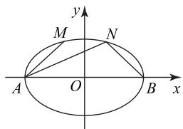
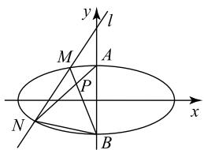

# 例析椭圆第三定义的典型应用

张广焱

(吉林省松原市吉林油田高级中学)

椭圆的第三定义是椭圆定义形式的重要补充,可以帮助学生更好地理解椭圆的几何本质,丰富了椭圆问题的命题视角,以及问题的处理思路.在某些椭圆问题的求解中,灵活应用椭圆的第三定义,可获得高效简捷的解题途径.

# 1 知识储备

椭圆的第三定义: 设 $A(-a,0)$ , $B(a,0)$ (a>0), 若动点 P 满足 $k_{PA}k_{PB}=-\frac{b^{2}}{a^{2}}(a>b>0)$ , 则点 P 的轨迹方程为 $\frac{x^{2}}{a^{2}}+\frac{y^{2}}{b^{2}}=1(x\neq\pm a)$ . 据此, 若 A, B 为椭圆 $\frac{y^{2}}{a^{2}}+\frac{x^{2}}{b^{2}}=1(a>b>0)$ 的两个顶点, P 为椭圆上不重合于 A, B 的一点, 且 PA, PB 的斜率存在且不为 0, 则 $k_{PA}k_{PB}=-\frac{b^{2}}{a^{2}}$ . 进一步可判断 A, B 为椭圆上关于原点对称的两个点, 仍有 $k_{PA}k_{PB}=-\frac{b^{2}}{a^{2}}$ .

# 2 典型应用

例 1 已知椭圆 $E: \frac{x^{2}}{a^{2}} + \frac{y^{2}}{b^{2}} = 1 (a > b > 0)$ 的左顶点为 A，点 M, N 为椭圆 E 上的点，且 M, N 关于 y 轴对称。若直线 AM, AN 的斜率之积为 $\frac{1}{4}$ ，则椭圆 E 的离心率为 \_\_\_\_。

解析 如图 1 所示, 设椭圆 E 的右顶点为 B, 连接 NB. 因为 M, N 关于 y 轴对称, 所以直线 AM 与 BN 的斜率互为相反数, 则 $k_{AN}k_{BN} = -\frac{1}{4}$ , 即 $\frac{b^{2}}{a^{2}} = \frac{1}{4}$ , 所

text_image

y
M N
A O B x

图1

以椭圆 $E$ 的离心率 $e = \sqrt{1 - \frac{1}{4}} = \frac{\sqrt{3}}{2}$ .

点评 易知椭圆的离心率 $e=\sqrt{1-\frac{b^{2}}{a^{2}}}$ ，根据椭圆的第三定义可直接得出 $\frac{b^{2}}{a^{2}}$ ，进而求得椭圆的离心率.  
例 2 已知椭圆 $E: \frac{x^{2}}{a^{2}} + \frac{y^{2}}{b^{2}} = 1 (a > b > 0)$ 的离心率为 $\frac{\sqrt{6}}{3}$ ，A 为椭圆 E 上的一点，且点 A 到椭圆 E 的两个焦点的距离之和为 $2\sqrt{6}$ .

(1)求椭圆 E 的方程；

(2) 若点 A 关于原点 O 的对称点为 B，过点 A 与 AB 垂直的直线与椭圆 E 的另一个交点为 C， $AH \perp x$ 轴于点 H，直线 BC 与 x 轴交于点 M，证明 $\triangle BOM$ 与 $\triangle AOH$ 的面积比为 2:1.

解析 (1) $\frac{x^{2}}{6}+\frac{y^{2}}{2}=1$ (求解过程略).

(2)设点 $A(x_0,y_0)(x_0y_0\neq 0),B(-x_0, - y_0)$ $H(x_0,0)$ ，则直线 $AB$ 的斜率 $k_{AB} = \frac{y_0}{x_0}$ 因为 $AC\bot$ $AB$ ，所以直线 $AC$ 的斜率 $k_{AC} = -\frac{x_0}{y_0}$ .由椭圆的第三定义可知 $k_{AC}k_{CB} = -\frac{b^2}{a^2} = -\frac{1}{3}$ 所以 $k_{CB} = \frac{y_0}{3x_0}$ 故直线 $BC$ 的方程为 $y + y_0 = \frac{y_0}{3x_0}(x + x_0)$ .当 $y = 0$ 时， $x_{M} = 2x_{0}$ ，所以

$$
S _ {\triangle B O M} = \frac {1}{2} | O M | | y _ {0} | = | x _ {0} y _ {0} |,
$$

$$
S _ {\triangle A O H} = \frac {1}{2} | O H | | y _ {0} | = \frac {1}{2} | x _ {0} y _ {0} |,
$$

故 $\triangle BOM$ 与 $\triangle AOH$ 的面积比为2:1.

本题第(2)问若按常规方法求解,需设直线BC的方程,将其与椭圆方程联立,求点C的坐标,思维量大、计算烦琐.由于点A与B关于原点对称,满足椭圆第三定义的条件,进而可以得到直线AC,CB的斜率关系,从而有效地简化了计算.

例3 已知椭圆 $C: \frac{x^2}{a^2} + \frac{y^2}{b^2} = 1 (a > b > 0)$ 过点$(2, \sqrt{2})$ ，椭圆 $C$ 与 $y$ 轴的交点为 $A, B$ （点 $A$ 位于点 $B$ 的上方），且 $|AB| = 4$ 。

(1)求椭圆 C 的方程;

(2) 过点 $(0,4)$ 且斜率存在的直线 l 与椭圆 C 交于不同的两点 M, N. 设直线 AN 与直线 BM 相交于点 P, 证明点 P 在定直线上.

(1) $\frac{x^{2}}{8}+\frac{y^{2}}{4}=1$ (求解过程略).

（2）设直线 l 的方程为 $y = kx + 4$ ，由 $\left\{\begin{aligned}\frac{x^{2}}{8}+\frac{y^{2}}{4}=1,\\ y=kx+4,\end{aligned}\right.$ 得 $(1+2k^{2})x^{2}+16kx+24=0.$ 又

$$
\Delta = (1 6 k) ^ {2} - 4 \times 2 4 (1 + 2 k ^ {2}) > 0,
$$

所以 $k^2 > \frac{3}{2}$ . 设 $M(x_1, y_1), N(x_2, y_2)$ , 由题意得 $x_1 x_2 \neq 0, y_2 \neq \pm 2$ , 则

$$
x _ {1} + x _ {2} = \frac {- 1 6 k}{1 + 2 k ^ {2}}, x _ {1} x _ {2} = \frac {2 4}{1 + 2 k ^ {2}},
$$

$$
y _ {1} + y _ {2} = k \left(x _ {1} + x _ {2}\right) + 8 = \frac {8}{1 + 2 k ^ {2}},
$$

$$
y _ {1} y _ {2} = (k x _ {1} + 4) (k x _ {2} + 4) = \frac {1 6 - 8 k ^ {2}}{1 + 2 k ^ {2}}.
$$

如图 2 所示, A, B 关于原点对称, 由椭圆的第三定

义可知 $k_{AN}k_{BN} = -\frac{b^2}{a^2} =$ $-\frac{1}{2}$ ，所以 $k_{AN} = -\frac{1}{2k_{BN}}.$

text_image

y
l
M
A
P
N
B
x

图2

因为 $k_{BN}=\frac{y_{2}+2}{x_{2}}$ ，所以

$k_{AN}=-\frac{x_{2}}{2y_{2}+4}.$ 又 $k_{BM}=\frac{y_{1}+2}{x_{1}}$ ，所以直线 AN 的方程为 $y=-\frac{x_{2}}{2y_{2}+4}x+2$ ，直线 BM 的方程为 $y=\frac{y_{1}+2}{x_{1}}x-2$ ，联立两方程得

$$
x _ {P} = \frac {4 x _ {1} (2 y _ {2} + 4)}{2 y _ {1} y _ {2} + 4 (y _ {1} + y _ {2}) + x _ {1} x _ {2} + 8},
$$

$$
y _ {P} = \frac {8 (y _ {2} + 2) (y _ {1} + 2)}{2 y _ {1} y _ {2} + 4 (y _ {1} + y _ {2}) + x _ {1} x _ {2} + 8} - 2 =
$$

$$
\frac {8 y _ {1} y _ {2} + 1 6 \left(y _ {1} + y _ {2}\right) + 3 2}{2 y _ {1} y _ {2} + 4 \left(y _ {1} + y _ {2}\right) + x _ {1} x _ {2} + 8} - 2,
$$

将根与系数的关系代入化简可得 $y_{P}=1$ ，所以点 P 在定直线 y=1 上.

点评

若直接表示出 BM, AN 的方程, 求出点 P的坐标,因结构不对称,不能直接将根与系数的关系代入.利用椭圆的第三定义可将不对称的结构转化为对称结构,从而同根与系数的关系建立关联.

例4 已知椭圆 $C: \frac{x^2}{a^2} + \frac{y^2}{b^2} = 1 (a > b > 0)$ 的左、右顶点分别为 $A, B$ ，且 $|AB| = 4$ ，离心率为 $\frac{\sqrt{3}}{2}$ .

(1)求椭圆 C 的方程;

(2) 直线 $BP, BQ$ 与椭圆 $C$ 的交点分别为 $P, Q$ , 且 $k_{BP} k_{BQ} = -\frac{1}{4}$ . 直线 $PQ$ 是否过定点? 若过定点, 求出定点的坐标; 若不过定点, 请说明理由.

解析

(1) $\frac{x^{2}}{4}+y^{2}=1$ (求解过程略).

(2)由 $k_{BP}k_{BQ} = -\frac{1}{4} = -\frac{b^2}{a^2}$ , 可知 $P, Q$ 关于原点对称, 即直线 $PQ$ 过定点 $(0,0)$ . 此时 $PQ$ 的方程为 $y = kx$ , 充分性证明如下. 设 $P(x_1, y_1), Q(x_2, y_2)$ , 易知 $x_1 \neq 2, x_2 \neq 2$ . 联立 $\left\{ \begin{array}{l} y = kx, \\ \frac{x^2}{4} + y^2 = 1, \end{array} \right.$ 化简消元得 $(1 + 4k^2)x^2 - 4 = 0$ . 由根与系数的关系得

$$
x _ {1} + x _ {2} = 0, x _ {1} x _ {2} = \frac {- 4}{1 + 4 k ^ {2}}. \tag {①}
$$

由 $k_{BP} = \frac{y_1}{x_1 - 2}, k_{BQ} = \frac{y_2}{x_2 - 2}$ , 得

$$
k _ {B P} k _ {B Q} = \frac {y _ {1} y _ {2}}{x _ {1} x _ {2} - 2 (x _ {1} + x _ {2}) + 4}.
$$

由 $y_{1} = kx_{1}, y_{2} = kx_{2}$ ，得 $y_{1}y_{1} = k^{2}x_{1}x_{2}$ ，所以

$$
k _ {B P} k _ {B Q} = \frac {k ^ {2} x _ {1} x _ {2}}{x _ {1} x _ {2} - 2 (x _ {1} + x _ {2}) + 4}, \tag {②}
$$

将式①代入式②得

$$
k _ {B P} k _ {B Q} = \frac {\frac {- 4 k ^ {2}}{1 + 4 k ^ {2}}}{\frac {- 4}{1 + 4 k ^ {2}} + 4} = \frac {\frac {- 4 k ^ {2}}{1 + 4 k ^ {2}}}{\frac {1 6 k ^ {2}}{1 + 4 k ^ {2}}} = - \frac {1}{4},
$$

故直线 PQ 过定点 $O(0,0)$ .

点评

若正面求解本题,需要表示出直线 BP 和 BQ 的方程,分别将之与椭圆方程联立,求出点 P, Q 的坐标, 再寻找二者的关系. 利用椭圆的第三定义可直接预判直线 PQ 过定点, 再证明充分性即可.
(完)