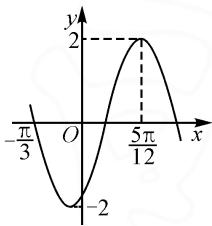
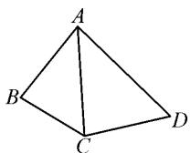
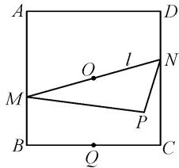

# 例析解三角形与三角函数、几何图形及平面向量结合的三类问题

浙江省嘉善高级中学 李建良

解三角形与三角函数、几何图形及平面向量结合的试题,不仅能综合考查学生对多个数学概念的理解和应用能力,还能促进他们的综合思维、问题解决能力及应用意识的发展,是培养学生数学素养的重要途径之一.

# 1 知识点梳理

(1)两角和与差的正弦、余弦与正切公式

① $\sin(\alpha\pm\beta)=\sin\alpha\cos\beta\pm\cos\alpha\sin\beta;$

② $\cos(\alpha\pm\beta)=\cos\alpha\cos\beta\mp\sin\alpha\sin\beta;$

③ $\tan(\alpha\pm\beta)=\frac{\tan\alpha\pm\tan\beta}{1\mp\tan\alpha\tan\beta}.$

(2)二倍角公式

① $\sin 2\alpha=2\sin\alpha\cos\alpha;$

② $\cos 2\alpha=\cos^{2}\alpha-\sin^{2}\alpha=2\cos^{2}\alpha-1=1-2\sin^{2}\alpha;$

③ $\tan 2\alpha = \frac{2\tan\alpha}{1 - \tan^2\alpha}.$

(3)降幂公式

$$
\sin \alpha \cos \alpha = \frac {1}{2} \sin 2 \alpha ;
$$

$$
\sin^ {2} \alpha = \frac {1 - \cos 2 \alpha}{2};
$$

$$
\cos^ {2} \alpha = \frac {1 + \cos 2 \alpha}{2}.
$$

(4) 辅助角公式

$$
\begin{array}{c} {a \sin \alpha + b \cos \alpha = \sqrt {a ^ {2} + b ^ {2}} \sin (\alpha + \varphi) \Big (  \text {其中}   \sin \varphi =} \\ { \frac {b}{\sqrt {a ^ {2} + b ^ {2}}}, \cos \varphi =  \frac {a}{\sqrt {a ^ {2} + b ^ {2}}}, \tan \varphi =  \frac {b}{a} \Big).} \end{array}
$$

(5)三角形角的关系

① $\triangle ABC$ 中， $A+B+C=\pi,\frac{A}{2}+\frac{B}{2}+\frac{C}{2}=\frac{\pi}{2}$ ；

② $\sin(A+B)=\sin(\pi-C)=\sin C,$

$$
\cos (A + B) = \cos (\pi - C) = - \cos C;
$$

③ $\sin \frac{A + B}{2} = \sin \left(\frac{\pi}{2} -\frac{C}{2}\right) = \cos \frac{C}{2},$

$$
\cos \frac {A + B}{2} = \cos \left(\frac {\pi}{2} - \frac {C}{2}\right) = \sin \frac {C}{2}.
$$

# 2 解三角形与三角函数、几何图形及平面向量结合的三类问题

# 2.1 解三角形与三角函数结合

解题路径分析:仔细阅读题目,确保理解题目所要求的内容.识别问题中涉及的三角形和三角函数的相关概念;根据题目提供的信息,绘制出所涉及的三角形,确保按照题目给出的条件准确绘制,这有助于更清晰地理解问题;利用三角函数的定义和性质,分析所给的条件与需要求解的未知量之间的关系.例如,利用正弦定理、余弦定理,以及正弦、余弦和正切等函数的定义来建立方程或者关系式,将所得到的方程或者关系式化简,以便求解未知量.这可能涉及代数运算、三角函数值的计算等.

$$
\text {   例   } 1 \quad \text {   已知函数   } f (x) = 2 \sin (\omega x + \varphi) \left(\omega > 0, - \frac {\pi}{2} <   \varphi <   \frac {\pi}{2}\right)
$$

的部分图象如图 1 所示.

(1)求函数 $f(x)$ 的解析式；  
(2)在锐角 $\triangle ABC$ 中,角A,B,C所对的边分别为a,b,c,若

$f(A) = \sqrt{3}, b = 2$ ，且 $\triangle ABC$ 的面积为 $\frac{3\sqrt{3}}{2}$ ，求 $a$ .

line

| x | y |
|---|---|
| -π/3 | -2 |
| 0 | 0 |
| π/12 | 2 |

图1

解析:(1)据图象可得 $\frac{3T}{4}=\frac{5\pi}{12}-\left(-\frac{\pi}{3}\right)=\frac{3\pi}{4}$ ，故 $T=\pi$ 。由 $T=\frac{2\pi}{\omega}=\pi$ ，得 $\omega=2$ 。由 $f\left(\frac{5\pi}{12}\right)=2\sin\left(2\times\frac{5\pi}{12}+\varphi\right)=2$ ，得 $\sin\left(\frac{5\pi}{6}+\varphi\right)=1$ 。由 $-\frac{\pi}{2}<\varphi<\frac{\pi}{2}$ ，得 $\frac{\pi}{3}<\frac{5\pi}{6}+\varphi<\frac{4\pi}{3}$ ，则 $\frac{5\pi}{6}+\varphi=\frac{\pi}{2}$ ，解得 $\varphi=-\frac{\pi}{3}$ 。

所以 $f(x)=2\sin\left(2x-\frac{\pi}{3}\right)$ .

(2)由 $f(A) = \sqrt{3}$ ，可得 $\sin \left(2A - \frac{\pi}{3}\right) = \frac{\sqrt{3}}{2}.$

由 $A \in \left(0, \frac{\pi}{2}\right)$ , 得 $2A - \frac{\pi}{3} \in \left(-\frac{\pi}{3}, \frac{2\pi}{3}\right)$ ,

所以 $2A - \frac{\pi}{3} = \frac{\pi}{3}$ ，则 $A = \frac{\pi}{3}$ .由题意得 $\triangle ABC$ 的面积为 $\frac{1}{2}\times 2\times c\times \sin \frac{\pi}{3} = \frac{3\sqrt{3}}{2}$ 解得 $c = 3.$ 由余弦定理得 $a^2 = b^2 +c^2 -2bc\cos A = 2^2 +3^2 -2\times 2\times 3\cos \frac{\pi}{3} =$ 7，所以 $a = \sqrt{7}$

# 2.2 解三角形与几何图形结合

解题路径分析:解答解三角形与几何图形相结合类问题有两个关键.(1)分析几何关系.厘清题目中所涉及的三角形和几何图形的基本关系,包括确定角度、边长、面积等几何属性之间的关系,可以利用相似性、对称性等几何性质来简化问题.(2)运用三角函数.根据题目要求,应用三角函数的定义和性质,建立与角度相关的方程或者关系式.这可能涉及正弦、余弦、正切等函数.

例 2 如图 2, 在平面四边形 ABCD 中, $AB = 3\sqrt{3}$ , $AC = 4\sqrt{3}$ ,

$$
\cos \angle A B C = \frac {\sqrt {1 3}}{1 3}, \angle B A C = \angle C A D,
$$

$\triangle ACD$ 的面积为 $24\sqrt{3}$ . 求 $AD$ .

  
图2

解析: 在 $\triangle ABC$ 中, 由余弦定理可得 $AC^{2}=AB^{2}+BC^{2}-2AB\times BC\cos\angle ABC$ , 即 $48=27+BC^{2}-2\times3\sqrt{3}\times BC\times\frac{\sqrt{13}}{13}$ , 则 $13BC^{2}-6\sqrt{39}BC-7\times39=0$ , 解得 $BC=\sqrt{39}$ , 所以 $\cos\angle BAC=\frac{AB^{2}+AC^{2}-BC^{2}}{2AB\cdot AC}=\frac{27+48-39}{2\times3\sqrt{3}\times4\sqrt{3}}=\frac{1}{2}$ . 又因为 $\angle BAC\in(0,\pi)$ , 所以 $\angle BAC=\frac{\pi}{3}$ , 所以 $\angle CAD=\angle BAC=\frac{\pi}{3}$ . 因为 $S_{\triangle ACD}=\frac{1}{2}\times AD\times AC\sin\angle CAD=\frac{1}{2}\times AD\times 4\sqrt{3}\times\frac{\sqrt{3}}{2}=24\sqrt{3}$ , 解得 $AD=8\sqrt{3}$ .

# 2.3 解三角形与平面向量结合

解三角形与平面向量结合的常见题型共有 7 类，具体见表 1.

表1

<table><tr><td>序号</td><td>类型</td></tr><tr><td>1</td><td>已知平面向量的数量积求解三角形</td></tr><tr><td>2</td><td>平面向量的基本定理与解三角形相结合</td></tr><tr><td>3</td><td>解三角形与平面向量的数量积相结合</td></tr></table>

(续表) 

<table><tr><td>4</td><td>平面向量的坐标运算与解三角形相结合</td></tr><tr><td>5</td><td>通过解三角形求解平面向量的相关问题</td></tr><tr><td>6</td><td>以平面图形为背景考查向量问题</td></tr><tr><td>7</td><td>以平面向量的坐标运算探求三角形的最值问题</td></tr></table>

解题路径分析: 确定向量表示. 首先, 根据题目给出的信息, 确定三角形的顶点或者特殊点的向量表示. 这可能涉及使用向量的起点和终点来表示各边对应的向量或者从顶点到特殊点的向量.

运用向量运算解决几何问题.在确定了向量表示后,通常要利用向量的加法、减法、数量积、向量积等运算来解决具体的几何问题.例如,通过向量的数量积计算角的关系,或者通过数量的数量积计算面积等.

利用向量证明或推导几何关系.在解题过程中,有时候需要利用向量运算来证明或者推导三角形的几何关系,如证明三角形的某些线段平行或者相等,或者推导出三角形的面积计算公式等.

例 3 如图 3, 已知正方形 ABCD 的边长为 2, 过中心 O 的直线 l 与两边 AB, CD 分别交于交于点 M, N.

text_image

A
D
O
l
M
N
P
B
Q
C

图3

(1)求 $\overrightarrow{BD}\cdot\overrightarrow{DC}$ 的值；

(2) 若 Q 是 BC 的中点, 求 $\overrightarrow{QM} \cdot \overrightarrow{QN}$ 的取值范围;

(3) 若 P 是平面上一点, 且满足 $2 \overrightarrow{OP} = \lambda \overrightarrow{OB} + (1 - \lambda) \overrightarrow{OC}$ , 求 $\overrightarrow{PM} \cdot \overrightarrow{PN}$ 的最小值.

解析:(1)由题意,可得

$$
\overrightarrow {B D} \cdot \overrightarrow {D C} = (\overrightarrow {B C} + \overrightarrow {C D}) \cdot \overrightarrow {D C} = - \overrightarrow {C D} ^ {2} = - 4.
$$

(2)由在正方形ABCD中，过中心 $O$ 的直线 $l$ 与两边 $AB, CD$ 分别交于交于点 $M, N$ ，知点 $O$ 为线段 $MN$ 的中点，则 $\overrightarrow{QM}\cdot \overrightarrow{QN} = (\overrightarrow{QO} +\overrightarrow{OM})\cdot (\overrightarrow{QO} +\overrightarrow{ON}) =$ $\overrightarrow{QO^2} -\overrightarrow{OM^2}$ .由正方形ABCD的边长为 $2,Q$ 是 $BC$ 的中点，知 $|\overrightarrow{QO}| = 1,1\leqslant |\overrightarrow{OM} |\leqslant \sqrt{2}$ 则 $-1\leqslant \overrightarrow{QM}$ · $\overrightarrow{QN}\leqslant 0$ 即 $\overrightarrow{QM}\cdot \overrightarrow{QN}$ 的取值范围为[-1,0].

(3) $\overrightarrow{PM} \cdot \overrightarrow{PN} = (\overrightarrow{PO} + \overrightarrow{OM}) \cdot (\overrightarrow{PO} + \overrightarrow{ON}) = \overrightarrow{PO^2} - \overrightarrow{OM^2}$ . 令 $\overrightarrow{OT} = 2\overrightarrow{OP}$ , 由 $\overrightarrow{OT} = 2\overrightarrow{OP} = \lambda\overrightarrow{OB} + (1 - \lambda)\overrightarrow{OC}$ , 可知点 $T$ 在 $BC$ 上, 则 $|\overrightarrow{OT}| \geqslant 1$ . 从而 $|\overrightarrow{OP}| \geqslant \frac{1}{2}$ . 因为 $1 \leqslant |\overrightarrow{OM}| \leqslant \sqrt{2}$ , 所以 $\overrightarrow{PM} \cdot \overrightarrow{PN} = \overrightarrow{PO^2} - \overrightarrow{OM^2} \geqslant \frac{1}{4} - 2 = -\frac{7}{4}$ , 即 $\overrightarrow{PM} \cdot \overrightarrow{PN}$ 的最小值为 $-\frac{7}{4}$ . Z