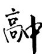

# 例谈“裂项”求和技巧的拓展应用

# 李继芳

(甘肃省白银市平川区平川中恒学校)

一般地,如果一个数列的通项公式是分式形式,那么往往可灵活运用“裂项”求和技巧简捷求解该数列的前 n 项和.常见的“裂项”结论有

$$
\frac {1}{n (n + 1)} = \frac {1}{n} - \frac {1}{n + 1},
$$

$$
\frac {1}{(2 n - 1) (2 n + 1)} = \frac {1}{2} \left(\frac {1}{2 n - 1} - \frac {1}{2 n + 1}\right),
$$

$\frac{1}{\sqrt{n+1}+\sqrt{n}}=\sqrt{n+1}-\sqrt{n},\cdots$ （其中 $n\in N^{*}$ ）.

近年高考数学试题或模拟试题,已经对这些常见的“裂项”结论进行了创新式的升级考查——与指数紧密联系起来,从而产生了比较新颖的数列求和问题——通项是指数型的分式.此类问题能够较好地考查学生对常见的“裂项”结论的迁移运用能力以及深度理解(往往需要将数列的通项写成某个数列的相邻两项之差的形式,便于借助正负相消的原则,达到迅速化简求和的目的).

1 形如 $\frac{a^n}{(a^n - 1)(a^{n + 1} - 1)} (a\in \mathbf{N}^*,a\geqslant 2)$

当 $a \in \mathbf{N}^*$ , $a \geqslant 2$ 时, 易知

$$
\frac {a ^ {n}}{\left(a ^ {n} - 1\right) \left(a ^ {n + 1} - 1\right)} = \frac {1}{a - 1} \left(\frac {1}{a ^ {n} - 1} - \frac {1}{a ^ {n + 1} - 1}\right).
$$

从而，取 a=2，有

$$
\frac {2 ^ {n}}{(2 ^ {n} - 1) (2 ^ {n + 1} - 1)} = \frac {1}{2 ^ {n} - 1} - \frac {1}{2 ^ {n + 1} - 1};
$$

取 $a = 3$ ，有 $\frac{3^n}{(3^n - 1)(3^{n + 1} - 1)} = \frac{1}{2}$ （ $\frac{1}{3^n - 1} - \frac{1}{3^{n + 1} - 1}$ )；等等.

例 1 已知 $\{a_{n}\}$ 是正项等比数列，且满足 $a_{1}=3$ ， $a_{2}+a_{3}=36$ .

(1)求数列 $\{a_{n}\}$ 的通项公式及数列 $\{\log_{3}a_{n}\}$ 的前n项和 $S_{n}$ ;  
(2) 设 $b_n = \frac{3^{n+1}}{(a_{n+1} - 3)(a_{n+1} - 1)}$ ，求数列 $\{b_n\}$ 的前 $n$ 项和 $T_n$ .

解析

(1) $a_{n}=3^{n}$ ， $S_{n}=\frac{n(n+1)}{2}$ （求解过程略）.

(2) 因为 $a_{n} = 3^{n}$ , 所以

$$
b _ {n} = \frac {3 ^ {n + 1}}{\left(a _ {n + 1} - 3\right) \left(a _ {n + 1} - 1\right)} = \frac {3 ^ {n + 1}}{\left(3 ^ {n + 1} - 3\right) \left(3 ^ {n + 1} - 1\right)} =
$$

$$
\frac {3 ^ {n}}{(3 ^ {n} - 1) (3 ^ {n + 1} - 1)} = \frac {1}{2} \left(\frac {1}{3 ^ {n} - 1} - \frac {1}{3 ^ {n + 1} - 1}\right),
$$

故 $T_{n} = \frac{1}{2}\left[(\frac{1}{3^{1} - 1} -\frac{1}{3^{2} - 1}) + (\frac{1}{3^{2} - 1} -\frac{1}{3^{3} - 1}) + \right.$

$$
\left. \left(\frac {1}{3 ^ {3} - 1} - \frac {1}{3 ^ {4} - 1}\right) + \dots + \left(\frac {1}{3 ^ {n} - 1} - \frac {1}{3 ^ {n + 1} - 1}\right) \right] =
$$

$$
\frac {1}{2} \left(\frac {1}{3 ^ {1} - 1} - \frac {1}{3 ^ {n + 1} - 1}\right) = \frac {1}{4} - \frac {1}{2 \left(3 ^ {n + 1} - 1\right)}.
$$

点评

为了便于求解第(2)问,本题需要先准确求解数列 $\{a_{n}\}$ 的通项公式,再将数列 $\{b_{n}\}$ 的通项公式进行化简，并写成两项之差的形式，从而可灵活运用“裂项”求和技巧解题.

2 形如 $\frac{a^{n - 1}(a - 1)}{(a^{n - 1} + b)(a^n + b)} (a\in \mathbf{N}^*,a\geqslant 2,b > 0)$

当 $a \in \mathbf{N}^*$ , $a \geqslant 2$ 时, 易知

$$
\frac {a ^ {n - 1} (a - 1)}{\left(a ^ {n - 1} + b\right) \left(a ^ {n} + b\right)} = \frac {1}{a ^ {n - 1} + b} - \frac {1}{a ^ {n} + b}.
$$

从而，取 a=2, b=1，有

$$
\frac {2 ^ {n - 1}}{(2 ^ {n - 1} + 1) (2 ^ {n} + 1)} = \frac {1}{2 ^ {n - 1} + 1} - \frac {1}{2 ^ {n} + 1};
$$

取 a = 2, b = 3，有 $\frac{2^{n-1}}{(2^{n-1}+3)(2^n+3)} = \frac{1}{2^{n-1}+3} - \frac{1}{2^n+3}$ ; 等等.

例 2 已知 $S_{n}$ 是数列 $\{a_{n}\}$ 的前 n 项和, 且满足$S_{n} = 2a_{n} + 3n - 7.$

(1) 设 $b_{n}=a_{n}-3$ ，求证：数列 $\{b_{n}\}$ 是等比数列；  
(2) 若 $c_{n} = \frac{b_{n}}{a_{n}a_{n + 1}}$ ，求数列 $\{c_{n}\}$ 的前 $n$ 项和 $T_{n}$ .

解析

(1) $b_{n}=2^{n-1}$ （证明过程略）.

解析 (2)由(1)知 $b_{n} = 2^{n - 1}$ ，即 $a_{n} - 3 = 2^{n - 1}$ ，所以 $a_{n} = 2^{n - 1} + 3$ ，可得

$$
c _ {n} = \frac {b _ {n}}{a _ {n} a _ {n + 1}} = \frac {2 ^ {n - 1}}{\left(2 ^ {n - 1} + 3\right) \left(2 ^ {n} + 3\right)} = \frac {1}{2 ^ {n - 1} + 3} - \frac {1}{2 ^ {n} + 3},
$$

故

$$
T _ {n} = \left(\frac {1}{2 ^ {0} + 3} - \frac {1}{2 ^ {1} + 3}\right) + \left(\frac {1}{2 ^ {1} + 3} - \frac {1}{2 ^ {2} + 3}\right) +
$$

$$
\left(\frac {1}{2 ^ {2} + 3} - \frac {1}{2 ^ {3} + 3}\right) + \dots + \left(\frac {1}{2 ^ {n - 1} + 3} - \frac {1}{2 ^ {n} + 3}\right) = \frac {1}{4} - \frac {1}{2 ^ {n} + 3}.
$$

# 点评

本题设计较好,求解第(2)问时,必须先利用第(1)问的结论求解 $b_{n}, a_{n}$ 的表达式, 再对数列 $\{c_{n}\}$ 的指数型通项采用“裂项”求和技巧解题.

# 3 形如 $\frac{a^{2n + 1}(a^2n - n - 1)}{n(n + 1)} (a\in \mathbf{N}^*,a\geqslant 2)$

当 $a \in \mathbf{N}^*$ , $a \geqslant 2$ 时, 易知

$$
\frac {a ^ {2 n + 1} \left(a ^ {2} n - n - 1\right)}{n (n + 1)} = \frac {a ^ {2 n + 3}}{n + 1} - \frac {a ^ {2 n + 1}}{n}.
$$

从而，取 $a = 2$ ，有 $\frac{2^{2n + 1}(3n - 1)}{n(n + 1)} = \frac{2^{2n + 3}}{n + 1} -\frac{2^{2n + 1}}{n}$ 取 $a =$

3,有 $\frac{3^{2n + 1}(8n - 1)}{n(n + 1)} = \frac{3^{2n + 3}}{n + 1} -\frac{3^{2n + 1}}{n}$ 等等.

例3 已知数列 $\{a_{n}\}$ 满足

$$
\frac {1}{a _ {1}} + \frac {1}{2 a _ {2}} + \frac {1}{3 a _ {3}} + \dots + \frac {1}{n a _ {n}} = \frac {n (n + 3)}{4}.
$$

(1)求数列 $\{a_{n}\}$ 的通项公式；

(2) 若 $b_{n}=4^{n}(3n-1)a_{n}$ ，求数列 $\{b_{n}\}$ 的前 n 项和 $T_{n}$ .

析 (1) $a_{n} = \frac{2}{n(n + 1)} (n\in \mathbf{N}^{*})$ （求解过程略）.

(2) 因为 $a_{n} = \frac{2}{n(n + 1)}$ ，所以

$$
b _ {n} = 4 ^ {n} (3 n - 1) a _ {n} = \frac {2 ^ {2 n + 1} (3 n - 1)}{n (n + 1)} = \frac {2 ^ {2 n + 3}}{n + 1} - \frac {2 ^ {2 n + 1}}{n},
$$

故

$$
T _ {n} = \left(\frac {2 ^ {5}}{2} - \frac {2 ^ {3}}{1}\right) + \left(\frac {2 ^ {7}}{3} - \frac {2 ^ {5}}{2}\right) + \left(\frac {2 ^ {9}}{4} - \frac {2 ^ {7}}{3}\right) + \dots +
$$

$$
(\frac {2 ^ {2 n + 3}}{n + 1} - \frac {2 ^ {2 n + 1}}{n}) = \frac {2 ^ {2 n + 3}}{n + 1} - 8.
$$

# 点评

本题的第(2)问需要先写出 $b_{n}$ 的表达式,再进行整理,关键是要写成两项之差的形式,有利于借助“裂项”求和技巧顺利求解目标问题.

# 4 形如 $\frac{(a - 1)n + a}{n(n + 1)a^{n + 1}} (a\in \mathbf{N}^*,a\geqslant 2)$

当 $a \in \mathbf{N}^*$ , $a \geqslant 2$ 时, 易知

$$
\frac {(a - 1) n + a}{n (n + 1) a ^ {n + 1}} = \frac {1}{n a ^ {n}} - \frac {1}{(n + 1) a ^ {n + 1}}.
$$

58

数理化

从而，取 $a = 2$ ，有

$$
\frac {n + 2}{n (n + 1) \times 2 ^ {n + 1}} = \frac {1}{n \times 2 ^ {n}} - \frac {1}{(n + 1) \times 2 ^ {n + 1}};
$$

取 a=3，有 $\frac{2n+3}{n(n+1)\times3^{n+1}}=\frac{1}{n\times3^{n}}-\frac{1}{(n+1)\times3^{n+1}}$ ；
等等.

例4 已知数列 $\{a_{n}\}$ 的前 $n$ 项和为 $S_{n}$ , 且数列$\{\log_3(\frac{2}{3} S_n + 1)\}$ 是首项、公差均为1的等差数列.

(1)求数列 $\{a_{n}\}$ 的通项公式；

(2)设数列 $\left\{\frac{(2\log_{3}a_{n}+3)a_{n}}{a_{2n+1}\times\log_{3}a_{n}\times\log_{3}a_{n+1}}\right\}$ 的前 n 项和为 $T_{n}$ ，求证： $T_{n}<\frac{1}{3}$ .

# 解析

(1) $a_{n}=3^{n}(n\in\mathbf{N}^{*})$ （求解过程略）.

解析 (2) 因为 $a_{n} = 3^{n}$ , 所以 $\log_3 a_n = \log_3 3^n = n$ , $\log_3 a_{n+1} = \log_3 3^{n+1} = n + 1$ . 于是, 可得

$$
\frac {(2 \log_ {3} a _ {n} + 3) a _ {n}}{a _ {2 n + 1} \times \log_ {3} a _ {n} \times \log_ {3} a _ {n + 1}} = \frac {(2 n + 3) \times 3 ^ {n}}{n (n + 1) \times 3 ^ {2 n + 1}} =
$$

$$
\frac {2 n + 3}{n (n + 1) \times 3 ^ {n + 1}} = \frac {1}{n \times 3 ^ {n}} - \frac {1}{(n + 1) \times 3 ^ {n + 1}}.
$$

因此，可得

$$
T _ {n} = \left(\frac {1}{1 \times 3 ^ {1}} - \frac {1}{2 \times 3 ^ {2}}\right) + \left(\frac {1}{2 \times 3 ^ {2}} - \frac {1}{3 \times 3 ^ {3}}\right) +
$$

$$
\left(\frac {1}{3 \times 3 ^ {3}} - \frac {1}{4 \times 3 ^ {4}}\right) + \dots + \left[ \frac {1}{n \times 3 ^ {n}} - \frac {1}{(n + 1) \times 3 ^ {n + 1}} \right] =
$$

$$
\frac {1}{1 \times 3 ^ {1}} - \frac {1}{(n + 1) \times 3 ^ {n + 1}} = \frac {1}{3} - \frac {1}{(n + 1) \times 3 ^ {n + 1}}.
$$

又由 $n \in \mathbf{N}^*$ 知 $\frac{1}{(n+1) \times 3^{n+1}} > 0$ ，从而可得 $T_n = \frac{1}{3} - \frac{1}{(n+1) \times 3^{n+1}} < \frac{1}{3}$ .

# 点评

本题具有一定的综合性,涉及对数运算、等差数列知识以及指数型分式数列通项求和技巧(先“裂项”,再相消求和)在解题中的综合运用,对运算求解能力的要求较高.

本文通过四个方面的拓展应用,旨在帮助同学们理解、掌握数列“裂项”求和技巧的升级应用(即在出现指数的情境下对“裂项”求和技巧的灵活运用),进一步提高解题能力.此外,需要关注“裂项”求和时,通过正负抵消的剩余项具有对称性,而且剩余项往往为第1项和倒数第1项,但有时并非如此(如例3求和化简时,剩余项为第2项和倒数第2项).

(完)