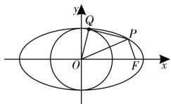
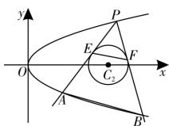

# 例谈应用同构思想突破最值与范围问题中的难点

# ■湖南省郴州市第二中学 颜昀晖

解析几何是用代数方法研究与刻画运动变化的几何问题。距离、角度、面积的最值或范围问题的探究是一个重要课题，它涉及的知识面广，综合性强，方法灵活多变，其中双切线（双割线）定理、同构思想在解题中的重要意义值得深入研究与应用。

# 一、四边形面积的最值问题

例 1 已知椭圆 $C: \frac{x^{2}}{a^{2}} + \frac{y^{2}}{b^{2}} = 1 (a > b > 0)$ 与圆 $O: x^{2} + y^{2} = 1$ 相切于椭圆 C 的上、下顶点，F 为椭圆 C 的右焦点，过 F 且与椭圆 C 的长轴垂直的弦长为 1。

(1)求椭圆 C 的方程;

(2) 如图 1, 若 P 为椭圆 C 上一点, 且 P 位于第一象限, 过点 P 作 PQ 与圆 O 相切于点 Q, 使得点 F, Q 在直线 OP

text_image

y
Q
P
O
F
x

图1

的异侧,求四边形 OFPQ 的面积的最大值。

解析:(1)依题意,椭圆 C 的短轴长等于圆 O 的直径,即 2b=2,故 b=1。因为过 F 且与椭圆 C 的长轴垂直的弦长为 $\frac{2b^{2}}{a}=1$ ,所以 a=2,所以椭圆 C 的方程为 $\frac{x^{2}}{4}+y^{2}=1$ 。

(2) 设 $P(x_{0}, y_{0}) (x_{0} > 0, y_{0} > 0)$ ，则有 $\frac{x_{0}^{2}}{4} + y_{0}^{2} = 1$ ，即 $y_{0}^{2} = 1 - \frac{x_{0}^{2}}{4}$ 。依题意 $OQ \perp PQ$ ，所以 $|PQ| = \sqrt{|OP|^{2} - |OQ|^{2}} = \sqrt{x_{0}^{2} + y_{0}^{2} - 1} = \frac{\sqrt{3}}{2} x_{0}$ ，则 $S_{\triangle OPQ} = \frac{1}{2} |OQ| \cdot |PQ| = \frac{\sqrt{3}}{4} x_{0}$ 。又 $O(0, 0)$ ， $F(\sqrt{3}, 0)$ ，故 $S_{\triangle OPF} = \frac{1}{2} |OF| \cdot y_{0} = \frac{\sqrt{3}}{2} y_{0}$ 。所以四边形 OFPQ 的面积 $S = S_{\triangle OPQ} + S_{\triangle OPF} = \frac{\sqrt{3}}{2} \left( \frac{x_{0}}{2} + y_{0} \right) = \frac{\sqrt{3}}{2} \sqrt{\frac{x_{0}^{2}}{4} + x_{0} y_{0} + y_{0}^{2}} =$

$$
\frac {\sqrt {3}}{2} \sqrt {1 + x _ {0} y _ {0}} 。
$$

因为 $1 = \frac{x_0^2}{4} + y_0^2 \geqslant 2\sqrt{\frac{x_0^2}{4} \cdot y_0^2} = x_0y_0$ 所以 $S = \frac{\sqrt{3}}{2}\sqrt{1 + x_0y_0} \leqslant \frac{\sqrt{6}}{2}$ ，当且仅当 $x_0 = \sqrt{2}, y_0 = \frac{\sqrt{2}}{2}$ 时，等号成立。

故四边形 OFPQ 的面积的最大值为 $\frac{\sqrt{6}}{2}$ 。

小结:首先,以椭圆 C 上动点 P 的坐标 $x_{0}, y_{0}$ 为参数,表示切线段 PQ 的长;其次,用分割法计算四边形 OFPQ 的面积等于两个三角形的面积和;最后,用基本不等式求面积的最大值。本题还可利用三角代换法求 S 的最大值:因为 $\frac{x_{0}^{2}}{4} + y_{0}^{2} = 1 (x_{0} > 0, y_{0} > 0)$ ,所以可设 $x_{0} = 2\cos \theta, y_{0} = \sin \theta \left( 0 < \theta < \frac{\pi}{2} \right)$ ,则四边形 OFPQ 的面积 $S = \frac{\sqrt{3}}{2} \left( \frac{x_{0}}{2} + y_{0} \right) = \frac{\sqrt{3}}{2} (\cos \theta + \sin \theta) = \frac{\sqrt{6}}{2} \sin \left( \theta + \frac{\pi}{4} \right)$ 。因为 $\frac{\pi}{4} < \theta + \frac{\pi}{4} < \frac{3\pi}{4}$ ,所以 $\sin \left( \theta + \frac{\pi}{4} \right) \in \left( \frac{\sqrt{2}}{2}, 1 \right]$ ,则当 $\theta = \frac{\pi}{4}$ ,即 $x_{0} = \sqrt{2}, y_{0} = \frac{\sqrt{2}}{2}$ 时,四边形 OFPQ 的面积 S 取最大值 $\frac{\sqrt{6}}{2}$ 。

# 二、点到直线的距离的最值问题

例 2 已知 P 是抛物线 $C_{1}: x^{2} = 4y$ 上任一点， $A(0, 2)$ ，Q 为线段 PA 的中点，记动点 Q 的轨迹为 $C_{2}$ 。

(1) 求 $C_{2}$ 的方程；  
(2) 过点 P 作曲线 $C_{2}$ 的两条切线, 切点分别为 M, N, 求点 P 到直线 MN 的距离的最小值。

解析:(1)设 $P(x_{0},y_{0})$ , $Q(x,y)$ , 因为 Q 为线段 PA 的中点, 所以 $\left\{\begin{aligned}0+x_{0}&=2x,\\ 2+y_{0}&=2y,\end{aligned}\right.$ 即$\left\{ \begin{array}{l}x_{0} = 2x,\\ y_{0} = 2y - 2. \end{array} \right.$ 又 $P(x_0,y_0)$ 在 $C_1:x^2 = 4y$ 上，则 $x_0^2 = 4y_0$ ，故 $C_2$ 的方程为 $x^{2} = 2(y - 1)$ 。

(2) 设 $M(x_{1}, y_{1})$ , $N(x_{2}, y_{2})$ ，则 $x_{1}^{2} = 2(y_{1} - 1)$ , $x_{2}^{2} = 2(y_{2} - 1)$ 。由抛物线 $C_{2}$ 的方程 $y = \frac{1}{2}x^{2} + 1$ ，求导得 $y' = x$ ，则切线 PM 的方程为 $y - y_{1} = x_{1}(x - x_{1})$ ，即 $x_{1}x - y - y_{1} + 2 = 0$ 。

又因为直线 PM 过点 $P(x_{0}, y_{0})$ ，所以 $x_{1}x_{0}-y_{0}-y_{1}+2=0$ ，同理 $x_{2}x_{0}-y_{0}-y_{2}+2=0$ ，即 $M(x_{1}, y_{1}), N(x_{2}, y_{2})$ 满足方程 $x_{0}x-y-y_{0}+2=0$ ，因此直线 MN 的方程为 $x_{0}x-y-y_{0}+2=0$ 。

所以点 $P(x_{0}, y_{0})$ 到直线 MN 的距离为 $\frac{|x_{0}^{2}-2y_{0}+2|}{\sqrt{x_{0}^{2}+1}}=\frac{\left|\frac{1}{2}x_{0}^{2}+2\right|}{\sqrt{x_{0}^{2}+1}}=\frac{1}{2}\cdot\left(\sqrt{x_{0}^{2}+1}+\frac{3}{\sqrt{x_{0}^{2}+1}}\right)\geqslant\sqrt{3}$ ，当且仅当 $x_{0}=$ $\pm\sqrt{2}$ 时，等号成立，所以点P到直线MN的距离的最小值为 $\sqrt{3}$ 。

小结:(1)用相关动点法求点 Q 的轨迹方程;(2)利用求导法,得出过点 P 的切线 PM 的方程,同理可得切线 PN 的方程,使得 M,N 两点坐标满足的二元一次方程的形式一致,从而得到直线 MN 的方程,这里体现了切线同构思想。

# 三、两点间的距离的最值问题

例 3 已知抛物线 $C_{1}: y^{2} = x$ ，圆 $C_{2}: (x - 4)^{2} + y^{2} = 1$ ，P 是抛物线 $C_{1}$ 上一点（异于原点）。

(1) 若 Q 为圆 $C_{2}$ 上一动点, 求 $|PQ|$ 的最小值;

(2)如图 2, 过点 P 作圆 $C_{2}$ 的两条切线, 分别交抛物线 $C_{1}$ 于 A, B 两点, 切点分别为 E, F, 若四边形 ABFE 为梯形, 求点 P 的坐标。

text_image

y
P
E
F
O
C₂
A
B
x

图2

解析：（1）设 $P(x_0, y_0)$ ，则 $y_0^2 = x_0$ 。 $|PC_2|^2 = (x_0 - 4)^2 + y_0^2 =$

$x_0^2 - 7x_0 + 16 = \left(x_0 - \frac{7}{2}\right)^2 + \frac{15}{4}$ , 所以当 $x_0 = \frac{7}{2}$ 时, $|PC_2|$ 的最小值为 $\frac{\sqrt{15}}{2}$ 。因为 $Q$ 为圆 $C_2$ 上一动点, 所以 $|PQ|$ 的最小值为 $|PC_2| - r = \frac{\sqrt{15}}{2} - 1$ 。

(2) 因为 A, B 在抛物线 $C_{1}: y^{2} = x$ 上，所以可设 $A(y_{1}^{2}, y_{1}), B(y_{2}^{2}, y_{2})$ ，则 $k_{PA} = \frac{y_{1} - y_{0}}{y_{1}^{2} - y_{0}^{2}} = \frac{1}{y_{1} + y_{0}}$ ，直线 PA 的方程为 $y - y_{0} = \frac{1}{y_{1} + y_{0}} (x - y_{0}^{2})$ ，整理得 $x - (y_{0} + y_{1})y + y_{0}y_{1} = 0$ 。

因为直线 PA 与圆 $C_{2}$ 相切，所以圆心 $C_{2}(4,0)$ 到直线 PA 的距离为 $\frac{|4+y_{0}y_{1}|}{\sqrt{1+(y_{0}+y_{1})^{2}}}=1$ ，化简得 $(y_{0}^{2}-1)y_{1}^{2}+6y_{0}y_{1}+15-y_{0}^{2}=0$ 。同理可得 $(y_{0}^{2}-1)y_{2}^{2}+6y_{0}y_{2}+15-y_{0}^{2}=0$ ，所以 $y_{1},y_{2}$ 是方程 $(y_{0}^{2}-1)y^{2}+6y_{0}y+15-y_{0}^{2}=0$ 的两根，故 $y_{1}+y_{2}=\frac{-6y_{0}}{y_{0}^{2}-1},k_{AB}=\frac{y_{2}-y_{1}}{y_{2}^{2}-y_{1}^{2}}=\frac{1}{y_{2}+y_{1}}=\frac{y_{0}^{2}-1}{-6y_{0}}$ 。

因为四边形 ABFE 为梯形, 所以 $PC_{2} \perp AB$ , 则 $k_{AB} \cdot k_{PC_{2}} = -1$ , 即 $\frac{y_{0}^{2} - 1}{-6y_{0}} \times \frac{y_{0}}{y_{0}^{2} - 4} = -1$ , 解得 $y_{0} = \pm \frac{\sqrt{115}}{5}$ , 故点 P 的坐标为 $\left(\frac{23}{5}, \frac{\sqrt{115}}{5}\right)$ 或 $\left(\frac{23}{5}, -\frac{\sqrt{115}}{5}\right)$ 。

小结:(1)先求动点 P 到圆心 $C_{2}$ 的距离的最小值,再减去圆的半径即得 $|PQ|$ 的最小值,这里用到了函数思想、数形结合思想;(2)利用抛物线 $C_{1}$ 上两点 P,A 的坐标表示抛物线割线 PA 的方程,再利用 PA 与圆 $C_{2}$ 相切,可得关于 $y_{1}$ 的一元二次方程,同理可得关于 $y_{2}$ 的一元二次方程,这两个方程的形式一致,得出 $y_{1}+y_{2}$ 及 $k_{AB}$ ,然后利用平面几何知识 $PC_{2}\perp AB$ ,求得 $y_{0}$ 。

总之,利用同构割线(切线)构造一元二次方程或二元一次方程,往往是有效解决圆锥曲线问题的重要手段。

(责任编辑 王福华)

19 圆锥曲线中的“三定”问题 陶珊珊

21 圆锥曲线问题中非对称式的应对策略 唐中建

24 破解离心率的取值范围(或最值)问题的技巧方法

王立强

# 易错题归类剖析

26 双曲线中的易错点分析 沈健

28 椭圆中的易错易漏点探秘与剖析 黄宗勤

31 圆锥曲线中直线与圆的易错点探秘与剖析 李云

# 经典题突破方法

33 聚焦 2024 年高考中圆锥曲线的方程及几何性质的

考题评析 马立军

36 例析圆锥曲线性质的综合应用 程伟涛

38 2024年全国新高考Ⅰ卷解析几何的解法探究与拓展

蔡爱兵 陈思圻

41 追根溯源 变式拓展

——2024年高考数学全国甲卷解析几何试题的评价

范雄庚 姚敬东

# 演练篇

# 核心考点 AB 卷

44 “圆锥曲线”跟踪训练 陈银会

封面刊名题字:华罗庚

顾问单位:中国数学会 中国物理学会 中国化学会

学术顾问:任子朝 韩家勋 李勇

委员:(按拼音排序) 陈进前 冯丽娟 公衍录 郭统福 侯有岐

胡东明 胡银伟 黄颖 蒋天林 李胜荣 李树祥 刘大鸣 刘树领

毛广文 孟卫东 隋俊礼 王国平 王后雄 王怀文 王玮琪 杨天才

余其权 余永安 袁竞成 岳庆先 张北春 张金生 赵剑涛

text_image

中学生数理化®
MATHS PHYSICS & CHEMISTRY/FORMIDDUESCHOOLSTUDENTS(SENIOR-HIGH SCHOOL EDITION)
高中版
绿色印刷
全面配合教材，注重求实、创新、博学
精准对焦高考，指点方法、技巧、思路
本期刊蝉联全国优秀科技期刊
河南省一级期刊
中国基础教育知识仓库来源期刊
中国邮政校园核心报刊
数学高考
2024年
第45期·总第1044期 12月

# 封面人物

颜昀晖,女,2017年毕业于东北师范大学,现任教于湖南省郴州市第二中学,荣获“湖南省教学能手”“郴州市五一劳动奖章”等。其制作的1个微课视频、1个课件分别获得省一、二等奖;3个课堂实录、1个教学案例、2个微课视频获得市一、二等奖;2篇论文获得省一、二等奖;在《中学生数理化》等杂志上发表论文多篇;参与由江西高校出版社出版的《考场错题》的编写,适用于高三学生。

# 版权声明

本刊所有文字和图片作品,未经许可,不得转载、摘编。凡投稿本刊,或允许本刊登载的作品,均视为已授权本刊在刊物、增刊、图书上使用,以及许可本刊授权合作网站(中国知网、万方数据库或维普资讯网等)以数字化方式复制、汇编、发行、信息网络传播本刊全文。本刊支付的稿酬,已包含授权费用。作者投稿给本刊即意味着同意上述约定,如有异议请与本刊签订书面协议。

本社广告部根据《中华人民共和国广告法》等国家有关法律法规审查及刊登广告，若广告主有超过广告内容的后续行为，均与本刊及广告部无关。