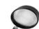
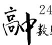

# 例谈正弦平方差公式在高考中的应用

# ——从一道教材习题说起

谢飞平

(湖北省汉川市实验高级中学)

教材中的例题、习题是高考命题的重要来源，每年的高考试卷中有不少试题源自教材。教材中的很多习题不仅方便于巩固和复习知识，还有助于寻找高考试题身影，探求高考命题规律，因此在复习时，要挖掘教材习题内在功能，从而更好地备战高考。

题目 （人教 A 版《普通高中教科书数学必修第二册》54 页第 16 题）在 $\triangle ABC$ 中，求证：

$$
c (a \cos B - b \cos A) = a ^ {2} - b ^ {2}.
$$

解题过程中,不难发现,若将待证结论等式利用正弦定理将边化角可得

$$
\sin C (\sin A \cos B - \sin B \cos A) =
$$

$$
\sin C \sin (A - B) = \sin^ {2} A - \sin^ {2} B.
$$

而在 $\triangle ABC$ 中， $\sin C = \sin (A + B)$ ，则可将该等式变形为 $\sin (A + B) \sin (A - B) = \sin^2 A - \sin^2 B$ .

上述等式因其结构与平方差公式非常相似,被称为正弦平方差公式,其证明如下:

$$
\sin (A + B) \sin (A - B) = (\sin A \cos B +
$$

$$
\cos A \sin B) (\sin A \cos B - \cos A \sin B) =
$$

$$
\sin^ {2} A \cos^ {2} B - \cos^ {2} A \sin^ {2} B =
$$

$$
\sin^ {2} A (1 - \sin^ {2} B) - (1 - \sin^ {2} A) \sin^ {2} B =
$$

$$
\sin^ {2} A - \sin^ {2} A \sin^ {2} B - \sin^ {2} B + \sin^ {2} A \sin^ {2} B =
$$

$$
\sin^ {2} A - \sin^ {2} B.
$$

利用正弦平方差公式求解三角函数问题,可以有效降低运算难度、化繁为简,从而收获事半功倍的效果.现结合历年高考真题和读者一起感受正弦平方差公式在高考中的应用.

# 1 在求值中的应用

例 1 （2021 年全国乙卷文 6） $\cos^{2}\frac{\pi}{12}$

$$
\cos^ {2} \frac {5 \pi}{1 2} = (\quad).
$$

A. $\frac{1}{2}$

B. $\frac{\sqrt{3}}{3}$

C. $\frac{\sqrt{2}}{2}$

D. $\frac{\sqrt{3}}{2}$

解析

由正弦平方差公式化简可得

$$
\cos^ {2} \frac {\pi}{1 2} - \cos^ {2} \frac {5 \pi}{1 2} = (1 - \sin^ {2} \frac {\pi}{1 2}) -
$$

$$
(1 - \sin^ {2} \frac {5 \pi}{1 2}) = \sin^ {2} \frac {5 \pi}{1 2} - \sin^ {2} \frac {\pi}{1 2} =
$$

$$
\sin \left(\frac {5 \pi}{1 2} + \frac {\pi}{1 2}\right) \sin \left(\frac {5 \pi}{1 2} - \frac {\pi}{1 2}\right) = \sin \frac {\pi}{2} \sin \frac {\pi}{3} = \frac {\sqrt {3}}{2},
$$

故选 D.

例 2 （2010 年安徽卷理 16, 节选）设 $\triangle ABC$ 是锐角三角形，a, b, c 分别是内角 A, B, C 所对的边，并且 $\sin^{2}A = \sin\left(\frac{\pi}{3} + B\right)\sin\left(\frac{\pi}{3} - B\right) + \sin^{2}B$ ，求角 A 的值.

解析

利用正弦平方差公式将条件等式化简可得

$$
\sin^ {2} A = \sin (\frac {\pi}{3} + B) \sin (\frac {\pi}{3} - B) + \sin^ {2} B =
$$

$$
\sin^ {2} \frac {\pi}{3} - \sin^ {2} B + \sin^ {2} B = (\frac {\sqrt {3}}{2}) ^ {2} = \frac {3}{4},
$$

注意到 $\triangle ABC$ 为锐角三角形,故 $\sin A=\frac{\sqrt{3}}{2},A=\frac{\pi}{3}.$

点评

以上两题主要考查三角函数两角和差公式的运用及三角函数式的化简,解题时若能熟练运用正弦平方差公式,则可提高解题效率.

变式 已知 $a, b, c$ 是 $\triangle ABC$ 的角 $A, B, C$ 所对的边， $\sin^2 C = 3 (\sin^2 A - \sin^2 B)$ ，且 $\tan B = \frac{1}{2}$ ，则 $A =$ \_\_\_\_.

解析

利用正弦平方差公式化简变形可得

$$
\sin^ {2} C = 3 (\sin^ {2} A - \sin^ {2} B) =
$$

$$
3 \sin (A + B) \sin (A - B),
$$

而 $\sin C = \sin (A + B)$ ，则

$$
\sin C = \sin (A + B) = 3 \sin (A - B),
$$

即

$$
\sin A \cos B + \cos A \sin B =
$$

$$
3 \sin A \cos B - 3 \cos A \sin B,
$$

所以

$$
\sin A \cos B = 2 \cos A \sin B,
$$

$$
\tan A = 2 \tan B = 2 \times \frac {1}{2} = 1,
$$

因为 $0 < A < \pi$ ，所以 $A = \frac{\pi}{4}$ .

# 2 在三角函数求取值范围中的应用

例3（2015年天津卷理15）已知函数 $f(x) =$ $\sin^2 x - \sin^2 (x - \frac{\pi}{6})(x\in \mathbf{R}).$

(1) 求 $f(x)$ 的最小正周期；

(2) 求 $f(x)$ 在区间 $\left[-\frac{\pi}{3}, \frac{\pi}{4}\right]$ 上的最大值和最小值.

(1)由正弦平方差公式可得

$$
f (x) = \sin^ {2} x - \sin^ {2} \left(x - \frac {\pi}{6}\right) =
$$

$$
\sin \left[ x + \left(x - \frac {\pi}{6}\right) \right] \sin \left[ x - \left(x - \frac {\pi}{6}\right) \right] =
$$

$$
\sin (2 x - \frac {\pi}{6}) \sin \frac {\pi}{6} = \frac {1}{2} \sin (2 x - \frac {\pi}{6}),
$$

所以 $T=\frac{2\pi}{2}=\pi.$

(2) 注意到 $x \in \left[-\frac{\pi}{3}, \frac{\pi}{4}\right]$ , 则 $2x - \frac{\pi}{6} \in \left[-\frac{5\pi}{6}, \frac{\pi}{3}\right]$ , 所以

$$
f _ {\min} (x) = \frac {1}{2} \sin \left(- \frac {\pi}{2}\right) = - \frac {1}{2},
$$

$$
f _ {\max} (x) = \frac {1}{2} \sin \frac {\pi}{3} = \frac {\sqrt {3}}{4}.
$$

本题考查三角函数式的化简和三角函数的图像与性质,运用正弦平方差公式可迅速将函数转化为熟悉的形式, 即 $f(x)=A\sin(\omega x+\varphi)$ .

变式 已知 $f(x)=\sin^{2}(2x+\frac{\pi}{12})+\cos^{2}(2x-\frac{\pi}{12})$ ，则 $f(x)$ 的最大值为 \_\_\_\_.

因为

$$
f (x) = \sin^ {2} \left(2 x + \frac {\pi}{1 2}\right) + 1 - \sin^ {2} \left(2 x - \frac {\pi}{1 2}\right) =
$$

$$
\sin^ {2} (2 x + \frac {\pi}{1 2}) - \sin^ {2} (2 x - \frac {\pi}{1 2}) + 1,
$$

所以由正弦平方差公式可得

$$
f (x) = \sin \left[ \left(2 x + \frac {\pi}{1 2}\right) + \left(2 x - \frac {\pi}{1 2}\right) \right] \cdot
$$

$$
\sin \left[ (2 x + \frac {\pi}{1 2}) - (2 x - \frac {\pi}{1 2}) \right] + 1 =
$$

$$
\sin 4 x \sin \frac {\pi}{6} + 1 = \frac {1}{2} \sin 4 x + 1 \leqslant \frac {1}{2} + 1 = \frac {3}{2},
$$

故 $f(x)$ 的最大值为 $\frac{3}{2}$ .

# 3 在解三角形求取值范围中的应用

例4（2011年四川卷理6）在 $\triangle ABC$ 中，$\sin^{2}A\leqslant\sin^{2}B+\sin^{2}C-\sin B\sin C$ ，则 A 的取值范围是().

A. $(0,\frac{\pi}{6}]$

B. $\left[\frac{\pi}{6},\pi\right)$

C. $(0,\frac{\pi}{3}]$

D. $\left[\frac{\pi}{3},\pi\right)$

析

由于 $\sin^2 A\leqslant \sin^2 B + \sin^2 C - \sin B\sin C$ ，故 $\sin^2 A - \sin^2 B\leqslant \sin^2 C - \sin B\sin C.$

由正弦平方差公式可得

$$
\sin (A + B) \sin (A - B) \leqslant \sin^ {2} C - \sin B \sin C,
$$

注意到 $\sin(A+B)=\sin C$ ，则

$$
\sin C \sin (A - B) \leqslant \sin^ {2} C - \sin B \sin C,
$$

$$
\sin (A - B) \leqslant \sin C - \sin B,
$$

所以 $\sin B \leqslant \sin C - \sin (A - B)$ , 即

$$
\sin B \leqslant \sin (A + B) - \sin (A - B) = 2 \cos A \sin B,
$$

故 $\cos A \geqslant \frac{1}{2}$ , 因此 $0 < A \leqslant \frac{\pi}{3}$ , 故选 C.

点评

本题主要考查解三角形,在遇到取值范围问题时,通常可利用三角函数的图像与性质、三角函数有界性进行求解.

变式 1 在 $\triangle ABC$ 中, 角 A, B, C 所对的边分别是 a, b, c, 并且 $c^{2}=a^{2}+b^{2}+ab$ , 则 $\frac{a^{2}-b^{2}}{c^{2}}$ 的范围是 \_\_\_\_.

由余弦定理可知

$$
\cos C = \frac {a ^ {2} + b ^ {2} - c ^ {2}}{2 a b} = \frac {- a b}{2 a b} = - \frac {1}{2}, C = \frac {2 \pi}{3}.
$$

再由正弦定理结合正弦平方差公式有

$$
\frac {a ^ {2} - b ^ {2}}{c ^ {2}} = \frac {\sin^ {2} A - \sin^ {2} B}{\sin^ {2} C} =
$$

$$
\frac {\sin (A + B) \sin (A - B)}{\sin^ {2} C} = \frac {\sin C \sin (A - B)}{\sin^ {2} C} =
$$

$$
\frac {\sin (A - B)}{\sin C} = \frac {2 \sqrt {3}}{3} \sin \left(2 A - \frac {\pi}{3}\right),
$$

注意到 $A \in (0, \frac{\pi}{3}), 2A - \frac{\pi}{3} \in (-\frac{\pi}{3}, \frac{\pi}{3}), \sin(2A - \frac{\pi}{3}) \in (-\frac{\sqrt{3}}{2}, \frac{\sqrt{3}}{2})$ ，所以

$$
\frac {a ^ {2} - b ^ {2}}{c ^ {2}} = \frac {2 \sqrt {3}}{3} \sin (2 A - \frac {\pi}{3}) \in (- 1, 1).
$$

变式 2 在 $\triangle ABC$ 中, $a,b,c$ 是角 $A,B,C$ 所对的边, $\angle ABC=\frac{2\pi}{3},BD$ 平分 $\angle ABC$ ,且 $BD=2$ ,则 $\triangle ABC$ 面积的最小值为\_\_\_\_.

在 $\triangle BCD$ 中,设 $\angle BDC=\theta$ ,由正弦定理有

$$
a = \frac {| B D | \cdot \sin \theta}{\sin (\frac {2 \pi}{3} - \theta)} = \frac {2 \sin \theta}{\sin (\theta + \frac {\pi}{3})},
$$

同理，在 $\triangle ABC$ 中，有 $c = \frac{2\sin\theta}{\sin(\theta - \frac{\pi}{3})}$ ，所以

$$
S _ {\triangle A B C} = \frac {1}{2} a c \sin \angle A B C =
$$

$$
\frac {\sqrt {3} \sin^ {2} \theta}{\sin (\theta + \frac {\pi}{3}) \sin (\theta - \frac {\pi}{3})} = \frac {\sqrt {3} \sin^ {2} \theta}{\sin^ {2} \theta - \frac {3}{4}} =
$$

$$
\frac {\sqrt {3} \left(\sin^ {2} \theta - \frac {3}{4}\right) + \frac {3 \sqrt {3}}{4}}{\sin^ {2} \theta - \frac {3}{4}} = \sqrt {3} + \frac {\frac {3 \sqrt {3}}{4}}{\sin^ {2} \theta - \frac {3}{4}} \geqslant
$$

$$
\sqrt {3} + \frac {\frac {3 \sqrt {3}}{4}}{1 - \frac {3}{4}} = 4 \sqrt {3},
$$

则 $\triangle ABC$ 面积的最小值为 $4\sqrt{3}$ .

# 4 在等式和不等式证明中的应用

例 5 （2012 年江西卷理 17, 节选）在 $\triangle ABC$ 中，角 A, B, C 所对的边分别是 a, b, c. 已知 $A = \frac{\pi}{4}$ , $b\sin(\frac{\pi}{4}+C)-c\sin(\frac{\pi}{4}+B)=a$ ，求证： $B-C=\frac{\pi}{2}$ .

利用正弦定理可将条件等式变形为

$$
\sin B \sin (A + C) - \sin C \sin (A + B) = \sin A,
$$

注意到

$$
\sin (A + C) = \sin B, \sin (A + B) = \sin C,
$$

所以 $\sin^{2}B-\sin^{2}C=\sin A$ ，由正弦平方差公式可得

$$
\sin (B + C) \sin (B - C) = \sin A,
$$

即 $\sin A\sin (B - C) = \sin A,\sin (B - C) = 1$ ，而 $B-$

$C\in (-\pi ,\pi)$ ，故 $B - C = \frac{\pi}{2}$

例 6 （2022 年全国乙卷理 17, 节选）在 $\triangle ABC$ 中，角 A, B, C 所对的边分别为 a, b, c，已知 $\sin C \sin (A - B) = \sin B \sin (C - A)$ ，证明： $2a^{2} = b^{2} + c^{2}$ .

证明 注意到

$$
\sin C = \sin (A + B), \sin B = \sin (C + A),
$$

则 $\sin C\sin (A - B) = \sin B\sin (C - A)$ 可变形为

$$
\sin (A + B) \sin (A - B) = \sin (C + A) \sin (C - A),
$$

由正弦平方差公式可得

$$
\sin^ {2} A - \sin^ {2} B = \sin^ {2} C - \sin^ {2} A,
$$

即 $2\sin^{2}A=\sin^{2}B+\sin^{2}C$ ，所以由正弦定理可得

$$
2 a ^ {2} = b ^ {2} + c ^ {2}.
$$

点评

以上两题属于中档题,在解题过程中,合理运用正弦平方差公式可以帮助我们快速找到解题方向,明确解题思路.

变式 在 $\triangle ABC$ 中, 角 A, B, C 所对的边分别为 a, b, c, 求证:

$$
\frac {\sin A \sin (B - C)}{\cos B + \cos C} + \frac {\sin B \sin (C - A)}{\cos C + \cos A} +
$$

$$
\frac {\sin C \sin (A - B)}{\cos A + \cos B} = 0.
$$

证明 注意到 $\sin A = \sin (B + C), \sin B = \sin (A + C), \sin C = \sin (A + B)$ ，由正弦平方差公式可得

原式左边= $\frac{\sin(B+C)\sin(B-C)}{\cos B+\cos C}+$

$$
\frac {\sin (C + A) \sin (C - A)}{\cos C + \cos A} + \frac {\sin (A + B) \sin (A - B)}{\cos A + \cos B} =
$$

$$
\frac {\sin^ {2} B - \sin^ {2} C}{\cos B + \cos C} + \frac {\sin^ {2} C - \sin^ {2} A}{\cos C + \cos A} +
$$

$$
\frac {\sin^ {2} A - \sin^ {2} B}{\cos A + \cos B} = \frac {\cos^ {2} C - \cos^ {2} B}{\cos B + \cos C} +
$$

$$
\frac {\cos^ {2} A - \cos^ {2} C}{\cos C + \cos A} + \frac {\cos^ {2} B - \cos^ {2} A}{\cos A + \cos B} =
$$

$$
\cos C - \cos B + \cos A - \cos C + \cos B - \cos A = 0,
$$

所以原式得证.

教材是教学的根本,高考作为选拔人才的考试,必然要以教材为依据,所以高考复习备考时要以教材为基础,做透教材中的典型例题和习题,寻找高考试题在教材中的原型,拔高教材,真正利用好教材.

(完)