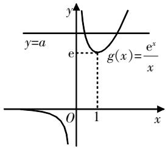

# 关于导数与不等式中的同构探究

李建国 江苏省徐州经济技术开发区工业学校 221121

[摘 要] “同构”在导数与不等式问题中较为常见,利用“同构”可以简化解题过程. 因此,在教学中,教师可以利用“同构”引导学生开展知识探究,归纳总结题型和解题方法,并指导学生探究解题之道.

[关键词] 同构;导数;不等式;思想方法

# 走进典例,探究解读

# 1. 例题探究

问题 若对任意的 $x_{1}, x_{2} \in [-2, 0)$ , $x_{1} < x_{2}$ , $\frac{x_{2}e^{x_{1}} - x_{1}e^{x_{2}}}{x_{1} - x_{2}} < a$ 恒成立, 则 $a$ 的最小值为 \_\_\_\_.

解析 本题为不等式恒成立求参数最值问题,需要探究不等式,整理变形推导参数a的最小值.

已知 $x_{1}<x_{2}$ ，则 $x_{1}-x_{2}<0$ ，将 $\frac{x_{2}\mathrm{e}^{x_{1}}-x_{1}\mathrm{e}^{x_{2}}}{x_{1}-x_{2}}<a$ 转化为 $x_{2}\mathrm{e}^{x_{1}}-x_{1}\mathrm{e}^{x_{2}}>a(x_{1}-x_{2})$ ，进一步整理得 $x_{2}\mathrm{e}^{x_{1}}+ax_{2}>x_{1}\mathrm{e}^{x_{2}}+ax_{1}$ 。因为 $x_{1}x_{2}>0$ ，将上式两边同时除以 $x_{1}x_{2}$ ，则 $\frac{\mathrm{e}^{x_{1}}}{x_{1}}+\frac{a}{x_{1}}>\frac{\mathrm{e}^{x_{2}}}{x_{2}}+\frac{a}{x_{2}}$ 。至此，将 $\frac{x_{2}\mathrm{e}^{x_{1}}-x_{1}\mathrm{e}^{x_{2}}}{x_{1}-x_{2}}<a$ 变形为不等号两侧具有相同结构的同构式。

分析不等式 $\frac{e^{x_{1}}}{x_{1}}+\frac{a}{x_{1}}>\frac{e^{x_{2}}}{x_{2}}+\frac{a}{x_{2}}$ 一侧的结构,发现可以通过构造函数解题.令 $f(x)=\frac{e^{x}}{x}+\frac{a}{x}$ ,根据不等式可知函数

$f(x)$ 在区间 $[-2,0)$ 上单调递减，则 $f^{\prime}(x) = \frac{\mathrm{e}^{x}(x - 1) - a}{x^{2}}\leqslant 0$ 在区间 $[-2,0)$ 上恒成立，即 $\mathrm{e}^x (x - 1)\leqslant a$ 在区间 $[-2,0)$ 上恒成立.令 $g(x) = \mathrm{e}^{x}(x - 1)$ ，则 $g^{\prime}(x) =$ $\mathrm{e}^{x}(x - 1) + \mathrm{e}^{x} = x\mathrm{e}^{x} <   0$ 在区间 $[-2,0)$ 上恒成立，所以 $g(x) = \mathrm{e}^{x}(x - 1)$ 在区间[-2,0)上单调递减， $g(x)\leqslant g(-2) =$ $-\frac{3}{\mathrm{e}^2}$ 因此，只需满足 $a\geqslant -\frac{3}{\mathrm{e}^2}$ 即可，即 $a$ 的最小值为 $-\frac{3}{\mathrm{e}^2}$

# 2. 解后剖析

上述例题为双变量不等式恒成立求参数最值问题,从解析过程来看,采用了函数构造、等价转化、函数性质分析等方法技巧.其中不等式同构是解题的关键所在,即整理不等式,根据不等式结构来构造函数: $\frac{e^{x_{1}}}{x_{1}}+\frac{a}{x_{1}}>\frac{e^{x_{2}}}{x_{2}}+\frac{a}{x_{2}}\rightarrow f(x)=\frac{e^{x}}{x}+\frac{a}{x}.$

在解题教学中,需要引导学生关注不等式两侧的代数式,显然具有结构相同的特点,只是变量不同而已,该种情形即为结构一致性同构.根据其结构可构造函数,后续利用函数性质进行分析.

# 同构探索,知识总结

在不等式与导数综合题中,常见同构情形,因此可以利用同构来简化解题过程.挖掘同构时可以借助整体代换、换元等方法技巧,将其转化为结构一致的代数式.在实际教学中,教师应引导学生深入探索同构,总结归纳常见的同构情形,生成相应的转化策略.下面结合高考常见考查方式,探索两类同构.

# 1. 结构一致性同构

结构一致性同构,同上述例题所示,其特点就为结构一致,常以双变量形式出现,当把其下标相同的双变量移动到一起时,每个变量的结构作用均相同.高考实际考查时常以构造函数比较大小或不等式关系的形式出现,教学中需要引导学生探索下面

三种情形.

情形1 $\left|\frac{x_{1}f(x_{2})-x_{2}f(x_{1})}{x_{1}-x_{2}}\right|>mx_{1}x_{2}.$

策略 变量与函数同乘的形式，将其等价变形为 $\frac{f(x_{1})}{x_{1}}+mx_{1}>\frac{f(x_{2})}{x_{2}}+mx_{2}$ ，则不等号两侧为同构式，根据结构来构造函数，即 $F(x)=\frac{f(x)}{x}+mx$ ，后续分析函数 $F(x)$ 的单调性来求解即可.

情形2 $\left|f(x_{1})-f(x_{2})\right|\leqslant m\left|x_{1}-x_{2}\right|$ .

策略 常规函数形式,解析时需先研究函数 $f(x)$ 的单调性,去掉绝对值转化为 $f(x_{1})+mx_{1}\leqslant f(x_{2})+mx_{2}$ 的形式,再构造函数 $F(x)=f(x)+mx$ 来分析.

情形3 $\frac{f(x_{1})-f(x_{2})}{x_{1}-x_{2}}<\frac{k}{x_{1}x_{2}}.$

策略 变量与函数为比例的形式,解析时需先设定 $x_{1}>x_{2}$ ,再进一步转化为 $f(x_{1})-f(x_{2})<\frac{k(x_{1}-x_{2})}{x_{1}x_{2}}=\frac{k}{x_{2}}-\frac{k}{x_{1}}$ ,
构造函数 $y=f(x)+\frac{k}{x}$ 来分析.

# 2. 指对数同构

在处理混合不等式时,可能遇到指对数同构的情形,使用常规方法进行计算过于烦琐.在这种情况下,关键在于理解其内在结构,并将其转换为 $f[g(x)]>f[h(x)]$ 的形式,其中 $f(x)$ 为外层函数.因此,在教学中,需要引导学生掌握指对数常见的变形技巧.

# 技巧1 直接变形.

(1) $ae^{a}\leqslant b\ln b$ ,属于积型,变形思路有三种:

一是参考不等号左侧,则有 $a\cdot e^{a}\leqslant\ln b\cdot e^{\ln b}$ ,可构造函数 $f(x)=xe^{x}$ ;

二是参考不等号右侧,则有 $e^{a}\cdot\ln e^{a}\leqslant b\cdot\ln b$ ,可构造函数 $f(x)=x\ln x$ ;

三是同时取对数,则有 $a+\ln a\leqslant$ $\ln b+\ln(\ln b)$ ，可构造函数 $f(x)=x+\ln x$ .

上述三种变形思路中,取对数最

为快捷,根据同构构造的函数,可直接明确其单调性.

(2) $\frac{e^{a}}{a}<\frac{b}{\ln b}$ ，属于商型，变形思路同样有三种：

一是参考不等号左侧,则有 $\frac{e^{a}}{a}<\frac{e^{\ln b}}{\ln b}$ ,可构造函数 $f(x)=\frac{e^{x}}{x}$ ;

二是参考不等号右侧,则有 $\frac{e^{a}}{lne^{a}}<\frac{b}{\ln b}$ ,可构造函数 $f(x)=\frac{x}{\ln x}$ ;

三是同时取对数,则 $a-\ln a<\ln b-\ln(\ln b)$ ,可构造函数 $f(x)=x-\ln x$ .

(3) $e^{a}\pm a>b\pm\ln b$ ，属于和差型，变形思路有两种：

一是参考不等号左侧,则有 $e^{a}\pm a>e^{\ln b}\pm\ln b$ ,可构造函数 $f(x)=e^{x}\pm x$ ;

二是参考不等号右侧,则有 $e^{a}\pm\ln e^{a}>b\pm\ln b$ ,可构造函数 $f(x)=x\pm\ln x$ .

# 技巧2 先拼凑,再变形.

对于不等式无法直接变形同构的情形,则需要引导学生掌握“先拼凑,再变形”的方法,即先凑常数、凑参数或凑变量,如两侧同乘x,同加x,等等,再用上述技巧变形.以下面两种情形为例:

(1) 同乘: $\mathrm{e}^{x} > a \ln(ax - a) - a$ , 两侧同乘 $\frac{1}{a}$ , 则 $\frac{1}{a} e^{x} > \ln[a(x - 1)] - 1$ , 再转化为 $\mathrm{e}^{x - \ln a} + x - \ln a > \mathrm{e}^{\ln(x - 1)} + \ln(x - 1)$ , 可构造函数 $f(x) = e^{x} + x$ .  
(2) 同除: $x^{a+1}e^{x} \geqslant -a\ln x$ , 两侧同除以 $x^{a}$ , 则 $xe^{x} \geqslant \frac{-a\ln x}{x^{a}}$ , 再转化为 $xe^{x} \geqslant -a\ln x \cdot e^{-a\ln x}$ , 可构造函数 $f(x) = xe^{x}$ .

# 题型探索,思路引导

总结完同构知识后,引导学生整合导数与不等式同构的常见问题情形,并指导学生充分应用同构知识来构造函数,以解析问题. 教学中引导学生构建分步策略——分两步：

第一步,整理并变形不等式,挖掘其中的同构情形;

第二步,根据同构情形构造函数,
利用函数性质求解问题.

# 1. 导数中结构一致的同构

例1 已知函数 $f(x)=a\ln x+\frac{1}{2}x^{2}$ ，若对任意正数 $x_{1},x_{2}(x_{1}\neq x_{2})$ ，都有 $\frac{f(x_{1})-f(x_{2})}{x_{1}-x_{2}}>2$ 恒成立，则实数a的取值范围为\_\_\_\_.

解题引导 本题为不等式恒成立求实数取值范围的问题,核心条件为不等式 $\frac{f(x_{1})-f(x_{2})}{x_{1}-x_{2}}>2$ ,可将其变形为 $\frac{f(x_{1})-2x_{1}-(f(x_{2})-2x_{2})}{x_{1}-x_{2}}>0$ ,结合左侧分母同构构造函数 $g(x)=f(x)-2x=a\ln x+\frac{1}{2}x^{2}-2x(a>0)$ ,根据题意推断出 $g(x)$ 是一个单调递增函数,因此 $g'(x)=\frac{a}{x}+x-2=\frac{x^{2}-2x+a}{x}\geqslant0(x>0,a>0)$ 恒成立.分离参数可得 $a\geqslant2x-x^{2}$ ,分析可知 $2x-x^{2}$ 在x=1时取得最大值1,因此 $a\geqslant1$ ,即实数a的取值范围为 $[1,+\infty)$ .

探究解读 上述引导通过同构方法,将不等式恒成立问题转化为对函数性质的分析. 教学中需要指导学生深入理解 $\frac{f(x_{1})-2x_{1}-(f(x_{2})-2x_{2})}{x_{1}-x_{2}}>0$ 的含义, 即对于函数 $g(x)=f(x)-2x$ 而言, 总有 $\frac{g(x_{1})-g(x_{2})}{x_{1}-x_{2}}>0$ , 隐含信息为: 函数单调递增.

# 2. 函数零点的同构

例2 已知函数 $f(x)=x^{2}e^{x}-a(x+2\ln x)$ 有两个零点,则a的取值范围是 \_\_\_\_.

解题引导 本题为函数零点求实数取值范围的问题,粗略一看似乎不存在同构现象,此时需要整理并变形函数 $f(x)$ ，再研究函数的性质.

已知 $f(x)=x^{2}\mathrm{e}^{x}-a(x+2\ln x)$ ，则 $f(x)=\mathrm{e}^{x+2\ln x}-a(x+2\ln x)$ 。显然，函数具有同构情形，因此设 $t=x+2\ln x(t\in\mathbf{R})$ ，可以明显看出该函数单调递增。根据题意可知， $e^{t}-at=0$ 有两个根。

当t=0时,则1=0,不符合题意;

当 $t\neq0$ 时,将“ $e^{t}-at=0$ 有两个根”转化为“ $a=\frac{e^{t}}{t}$ 有两个根”,即“y=a与y= $\frac{e^{t}}{t}$ 有两个交点”,随后通过分析交点来解析问题.令 $g(x)=\frac{e^{x}}{x}$ ,则 $g'(x)=\frac{e^{x}(x-1)}{x^{2}}$ .当 $x\in(-\infty,0)$ 和 $x\in(0,1)$ 时, $g'(x)<0$ , $g(x)$ 单调递减;当 $x\in(1,+\infty)$ 时, $g'(x)>0$ , $g(x)$ 单调递增;且当 $x\in(-\infty,0)$ 时, $g(x)<0$ ;另外, $g(1)=e$ .因此, $g(x)=\frac{e^{x}}{x}$ 的图象如图1所示.分析图象后,可得a的取值范围是 $(e,+\infty)$ .

text_image

y
y=a
e
g(x)=\frac{e^x}{x}
O
1
x

图1

探究解读 在解析函数零点问题时,同样需要掌握函数的同构特性,利用整体代换来简化函数结构. 教学中需要指导学生掌握函数零点的转化策略,即将“函数零点”转化为“两函数的交点”,通过分析函数性质和绘制图象来求解问题.

# 3. 多变量关系的同构

例3 已知函数 $f(x)=\frac{\ln x}{x}$ , $g(x)=xe^{-x}$ . 若存在 $x_{1}\in(0,+\infty)$ , $x_{2}\in R$ 使得 $f(x_{1})=g(x_{2})=k(k<0)$ 成立，则 $\left(\frac{x_{2}}{x_{1}}\right)^{2}e^{k}$ 的最大值为 \_\_\_\_.

解题引导 本题是多函数不等式的最值问题,涉及多变量关系,需要掌握变量关系以实现同构.

已知 $f(x)=\frac{\ln x}{x}$ , $g(x)=\frac{x}{\mathrm{e}^{x}}$ ，则 $g(x)=\frac{\ln \mathrm{e}^{x}}{\mathrm{e}^{x}}=f(\mathrm{e}^{x})$ 。由于 $f(x_{1})=\frac{\ln x_{1}}{x_{1}}=k<0$ ，则 $\ln x_{1}<0\Rightarrow0<x_{1}<1$ ，同理可得 $x_{2}<0$ 。因为函数 $y=f(x)$ 的定义域为 $(0,+\infty)$ ，且 $f'(x)=\frac{1-\ln x}{x^{2}}>0$ 对于 $\forall x\in(0,1)$ 恒成立，所以函数 $y=f(x)$ 在区间 $(0,1)$ 上单调递增。同理可知，函数 $y=g(x)$ 在区间 $(-∞,0)$ 上单调递增。所以， $f(x_{1})=g(x_{2})=f(\mathrm{e}^{x_{2}})$ ，则 $x_{1}=e^{x_{2}}$ 。所以， $\frac{x_{2}}{x_{1}}=\frac{x_{2}}{e^{x_{2}}}=g(x_{2})=k$ ，则 $\left(\frac{x_{2}}{x_{1}}\right)^{2}e^{k}=k^{2}e^{k}$ 。构造函数 $h(k)=k^{2}e^{k}$ ，其中k<0。当k<-2时， $h'(k)>0$ ，函数h(k)单调递增；当-2<k<0时， $h'(k)<0$ ，函数h(k)单调递减。因此， $h(k)_{\max}=h(-2)=\frac{4}{e^{2}}$ ，即 $\left(\frac{x_{2}}{x_{1}}\right)^{2}e^{k}$ 的最大值为 $\frac{4}{e^{2}}$ 。

探究解读 上述探究与多函数相关的不等式恒成立最值问题,其中最关键的一步为利用同构方法来构建 $g(x)$ 与 $f(x)$ 的关系.该种情形较为隐蔽,教学中需要指导学生明晰多变量关系的同构思路:第一步,分析两个函数的解析式,从整体视角进行审视;第二步,将其中一个函数设定为“元变量”,并将其整体代入另一函数中,从而实现函数变量关系的同构.

# 解后反思,教学建议

# 1. 解读同构,归纳知识

在高中复习备考阶段,教师要重视解法技巧的总结与指导.“同构”是导数与不等式问题中常见的情形,合理利用同构技巧可以简化函数或导数的结构,便于后续进行转化与构建.教学中需要注意两点:一是结合实例解读同构,使学生明晰同构的内涵;二是归纳总结知识,包括同构情形、同构方法技巧,据此形成相应的解题策略.

# 2. 应用探究,过程引导

对于学生而言，“同构”是较为陌生的知识点，对其方法技巧也不熟悉。因此，在完成对同构的总结和归纳后，需要结合常见的题型进行解题指导，帮助学生深入挖掘同构方法技巧，并巧妙地将其应用于问题转化。在解题引导的过程中，教师需注意思维引导，按照“结构分析→同构提取→同构转化→分析求解”的流程引导学生解读题目条件，并利用“同构”来解决问题。同时，所选问题应尽可能覆盖高考中所有“同构”题型，以多样化的方式展现“同构”现象。

# 3. 渗透思想,提升能力

深入分析上述解析过程发现,在使用“同构”转化处理问题的过程中,隐含了众多数学思想方法,如整体代换、函数构造、转化与化归、数形结合、分类讨论等.这些数学思想方法可综合运用来构建解题思路.因此,在教学中,教师需要合理渗透数学思想方法,引导学生感知这些思想方法的内涵,并掌握运用这些思想方法的策略.鉴于数学思想方法的抽象性,教师可以结合实例进行有针对性的讲解,直观呈现数学思想方法在解题过程中的作用.

# 写在最后

“同构”在导数与不等式问题解决中频繁出现,教师在教学过程中可以设计专门的探究课题,进行同构解读、知识归纳以及应用探究.指导学生明晰常见的题型及其相应的同构策略,并结合实例加深理解.同构过程涉及众多数学思想方法,通过合理地渗透这些数学思想方法,可以提升学生的综合解题能力.