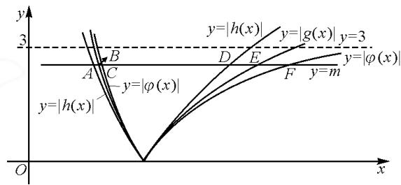

# 切线不等式的巧妙应用

# - 四川省阆中东风中学校 王立坤

摘要:基于函数与导数的综合应用,灵活运用切线不等式,是函数综合应用的深入与提升,也是问题解决过程中的“巧技妙法”.利用切线不等式,可以有效解决函数最值、参数最值、大小比较及综合应用等问题,并合理加以综合与应用,归纳解题技巧与策略,帮助学生提升综合应用能力.

关键词: 函数; 导数; 切线不等式; 参数; 最值

基于函数与导数的综合应用,灵活运用切线不等式,可有效解决函数与方程中的一些综合应用问题.借助切线不等式 $\left(\mathrm{e}^{x}\geqslant x+1\right.$ 或 $\left.\ln x\leqslant x-1\right)$ “以直代曲”,是处理函数与导数问题的妙手.依托切线不等式的巧妙应用,对于问题的快捷切入、解题的思路优化、过程的简化精减等都非常有效果.切线不等式是解决与之相关的函数、方程及不等式等问题时常用的一些基本结论与性质.

# 1 函数最值问题

在解决一些解析式中涉及指数与对数混合的函数最值问题时，通过合理挖掘题设内涵与解析式的结构特征，巧妙借助切线不等式 $\left(\mathrm{e}^{x}\geqslant x+1\right.$ 或 $\ln x\leqslant x-1$ “以直代曲”来合理转化，给函数最值的求解与应用创造条件.

例1（2024年浙江省 $9 + 1$ 高中联盟高三第二学期3月高考模拟数学试卷第14题）函数 $f(x) = \frac{x^3\mathrm{e}^{3x} - 3\ln x - 1}{x} (x > 0)$ 的最小值为

解法 1: 放缩法 1.

由不等式 $\ln x \leqslant x - 1 (x = 1$ 时等号成立），得 $f(x) = \frac{x^3\mathrm{e}^{3x} - 3\ln x - 1}{x} = \frac{x^3\mathrm{e}^{3x} - \ln (x^3\mathrm{e}^{3x}) + 3x - 1}{x} \geqslant \frac{x^3\mathrm{e}^{3x} - (x^3\mathrm{e}^{3x} - 1) + 3x - 1}{x} = 3$ ，当且仅当 $x^3\mathrm{e}^{3x} = 1$ 时等号成立.

由 $x^{3}e^{3x}=1$ ，得 $x^{3}=e^{-3x}$ ，可转化为两曲线 $y_{1}=x^{3}$ 与 $y_{2}=e^{-3x}$ 的图象有唯一交点，可知 $x^{3}=e^{-3x}$ 有唯一实数解.

所以函数 $f(x)$ 的最小值为 3.

解法 2: 放缩法 2.

根据切线不等式 $\mathrm{e}^{x}\geqslant x+1(x=0$ 时等号成立），则有 $f(x)=\frac{x^{3}\mathrm{e}^{3x}-3\ln x-1}{x}=\frac{\mathrm{e}^{3x+3\ln x}-3\ln x-1}{x}\geqslant$

$\frac{(3x+3\ln x+1)-3\ln x-1}{x}=3$ , 当且仅当 $3x+3\ln x=0$ 时等号成立.

由 $3x + 3\ln x = 0$ ，得 $x = -\ln x$ ，可转化为两曲线 $y_{1} = x$ 与 $y_{2} = -\ln x$ 的图象有唯一交点，可知 $x = -\ln x$ 有唯一实数解.

所以函数 $f(x)$ 的最小值为 3.

点评: 当涉及指数、对数混合求最值的问题时, 常利用切线不等式 $\left(\mathrm{e}^{x}\geqslant x+1\right.$ 或 $\ln x\leqslant x-1$ 巧妙“互化”, 从而避免利用导数法处理问题时的繁杂过程与复杂运算, 优化解题过程, 提升解题效益.

# 2 参数最值问题

在解决一些含参并涉及指数式或对数式的不等式恒成立问题时,常利用不等式的恒等变形与转化(同构),以及参变分离等,巧妙借助切线不等式来合理放缩与转化,实现参数最值(或取值范围)的求解与应用.

例 2 （2024 届湖北省武汉华大新高考联盟 3 月教学质量测评）（多选题）若关于自变量 x 的不等式 $e^{x-2} + x \geqslant 2ax^{2} - x \ln x$ 在区间 $(0, +\infty)$ 上恒成立，则实数 a 的值可以是（）.

A. $\frac{1}{\mathrm{e}}$ B. $\frac{1}{2}$ C. $\frac{\sqrt{\mathrm{e}}}{3}$ D.2

解析: 由 $e^{x-2} + x \geqslant 2ax^{2} - x \ln x$ ，可得 $\frac{e^{x-2}}{x} + 1 \geqslant 2ax - \ln x$ ，则 $\frac{e^{x-2}}{e^{\ln x}} + 1 \geqslant 2ax - \ln x$ ，即 $e^{x-2 - \ln x} + 1 + \ln x \geqslant 2ax$ 。

根据切线不等式, 可得 $e^{x-2-\ln x} \geqslant x - 2 - \ln x + 1$ , 从而 $e^{x-2-\ln x} + 1 + \ln x \geqslant x$ .

当 $2a \leqslant 1$ ，即 $a \leqslant \frac{1}{2}$ 时， $\mathrm{e}^{x - 2 - \ln x} + 1 + \ln x \geqslant x \geqslant 2ax$ ，即 $\mathrm{e}^{x - 2 - \ln x} + 1 + \ln x \geqslant 2ax$ ，此时符合题意。

当 $a > \frac{1}{2}$ 时， $2ax > x$ . $\mathrm{e}^{x - 2 - \ln x} + 1 + \ln x = x$ 成立的条件是 $x - 2 - \ln x = 0$ . 易知直线 $y = x - 1$ 与曲线 $y = \ln x$ 相切，所以直线 $y = x - 2$ 与曲线 $y = \ln x$ 有两个交点，即存在 $x$ ，使得 $x - 2 - \ln x = 0$ ，从而 $\mathrm{e}^{x - 2 - \ln x} + 1 + \ln x = x$ 成立，也就是存在 $x$ ，使得 $2ax > \mathrm{e}^{x - 2 - \ln x} + 1 + \ln x$ ，此时不符合题意.

综上分析, 可知实数 a 的取值范围是 $\left(-\infty, \frac{1}{2}\right]$ .

故选择答案: AB.

点评:该问题的实质是确定实数 a 的取值范围,以多选题的形式来巧妙创设与应用.该问题中,利用切线不等式 $e^{x} \geqslant x + 1$ “以直代曲”,恒等变形(同构),使过程与步骤更加简化,事半功倍!

# 3 大小比较问题

在一些涉及指数式或对数式的代数式的大小比较与判断问题时,往往结合两代数式的结构特征与形式加以合理恒等变化,直接利用相应的切线不等式来合理放缩与巧妙转化,实现代数式大小的比较与判断.

例 3 设 $a=\frac{1}{0.99}$ , $b=e^{0.01}$ , $c=\sqrt{1.02}$ , 则().

$$
\mathrm{A}. a > b > c \quad \mathrm{B}. b > c > a \quad \mathrm{C}. b > a > c \quad \mathrm{D}. c > b > a
$$

解析:根据指数切线不等式“ $e^{x}\geqslant x+1$ ，当且仅当x=0时等号成立”，则可得 $b=e^{0.01}>0.01+1=1.01=\sqrt{1.01^{2}}=\sqrt{1.0201}>\sqrt{1.02}=c$ 。将指数切线不等式中的x替换为-x，于是可得 $e^{-x}\geqslant-x+1$ ，即 $\frac{1}{e^{x}}\geqslant1-x$ 。当x<1时，结合不等式的性质有 $e^{x}\leqslant\frac{1}{1-x}$ ，则 $b=e^{0.01}<\frac{1}{1-0.01}=\frac{1}{0.99}=a$ 。

综上分析,可得 a > b > c.

故选择答案:A.

点评:根据题目条件,合理联想,借助切线不等式“ $e^{x}\geqslant x+1$ ,当且仅当x=0时等号成立”,通过结论或变式等不同形式来转化与应用,从而确定对应的大小关系.

# 4 从切线不等式到曲线不等式

从前面的切线不等式来看,当涉及放缩精度较高的问题时,通常需要进一步利用曲线不等式来解决.

例 4 （四川省南充市高 2024 届一诊考试）已知函数 $f(x)=\left|\ln x-\frac{2}{x}+2\right|-m(0<m<3)$ 有两个不同的零点 $x_{1}, x_{2}(x_{1}<x_{2})$ ，下列关于 $x_{1}, x_{2}$ 的说法，正确的有( )个.

① $\frac{x_{2}}{x_{1}}<e^{2m}$ ; ② $x_{1}>\frac{2}{m+2}$ ;

③ $e^{\frac{m}{3}}<x_{2}<\frac{3}{3-m};$ ④ $x_{1}x_{2}>1.$

A.1 B.2 C.3 D.4

解析:借助不等式 $1-\frac{1}{x}\leqslant\ln x$ ，可得 $3-\frac{3}{x}\leqslant\ln x-\frac{2}{x}+2\leqslant3\ln x$ ，记 $\varphi(x)=3-\frac{3}{x}, g(x)=\ln x-\frac{2}{x}+2, h(x)=3\ln x$ ，然后作出三者的图象即可求解。如图1所示。

text_image

y
3
y=|h(x)|
y=|g(x)|
y=3
A
B
C
D
E
F
y=m
y=|φ(x)|
y=|h(x)|
O
x

图1

（说明： $|\varphi(x)|$ 以 y=3 为渐近线，故此题中限制了 0<m<3.）

作直线 $y = m (0 < m < 3)$ 分别与上图三个函数图象从左至右交于 $A, B, C, D, E, F$ 六点，易得：点 $A\left(\mathrm{e}^{-\frac{m}{3}}, m\right), B(x_1, m), C\left(\frac{3}{m + 3}, m\right), D\left(\mathrm{e}^{\frac{m}{3}}, m\right), E(x_2, m), F\left(\frac{3}{3 - m}, m\right).$

此题就很容易求解了.

点评:以学生较熟悉的切线不等式放缩和切线夹逼为基础,从 $y=|\ln x|$ 及不等式 $\ln x\geqslant1-\frac{1}{x}$ 入手,利用放缩、夹逼融合而成.“曲线放缩,曲线夹逼”可实现超越不可解到超越可解或有理可解的转化.其实,指数切线不等式 $e^{x}\geqslant x+1$ (当且仅当 x=0 时等号成立)或对数切线不等式 $\ln x\leqslant x-1$ (当且仅当 x=1 时等号成立)及 $\ln x\geqslant1-\frac{1}{x}$ (当且仅当 x=1 时等号成立)等相应的“二级结论”的巧妙应用,是基于函数与导数综合应用的产物,也是对知识应用的提升与升华,进而在学习与解题过程中不断加以总结与巧妙应用的一些基本知识点.熟练运用切线不等式、曲线不等式,能拨开“以直代曲、以曲代曲”的本质,有助于更好地理解合理放缩之妙手,少算多思,提升数学品质与数学核心素养.Z