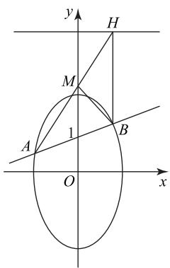
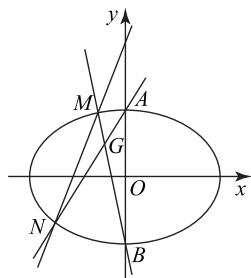
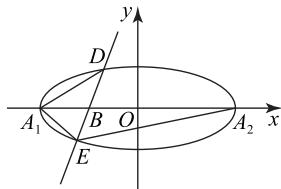

# 利用“化积为和”技巧处理圆锥曲线综合问题

周素琴

(浙江省苍南中学)

通常求解直线与圆锥曲线综合问题时,我们会运用“设而不求法”,根据根与系数的关系解决问题,但有时在解题中会遇到下面的情况:表达式不能利用 $x_{1}+x_{2}$ 和 $x_{1}x_{2}$ 表示(即非对称根与系数的关系问题),显然此时直接利用根与系数的关系往往不能顺利解决问题,然而若能“化积为和”(即将含有 $x_{1}x_{2}$ 的局部表达式利用 $x_{1}+x_{2}$ 表示),则往往有利于目标问题的巧妙获解.请结合以下举例剖析,认真领会、学习这种“化积为和”技巧的应用.

# 1 处理有关定点问题

例 1 已知椭圆 E 的中心在原点,且椭圆 E 与抛物线 $x^{2}=4y$ 有相同的焦点 F，椭圆 E 上的点到点 F 距离的最小值为 1.

(1)求椭圆 E 的方程;

(2) 过点 $(0,1)$ 的直线 l 交椭圆 E 于 A, B 两点，过点 B 的直线 BH 与直线 y=4 垂直，垂足为 H，直线 AH 与 y 轴交于点 M，求证 M 是定点，并求 $\triangle MAB$ 面积的最大值.

析 (1) $\frac{y^2}{4} +\frac{x^2}{3} = 1$ （求解过程略）.

(2)如图1所示,可设直线l的方程为 $y=kx+1$ ,将其代入 $\frac{y^{2}}{4}+\frac{x^{2}}{3}=1$ ,并整理得

$$
(4 + 3 k ^ {2}) x ^ {2} + 6 k x - 9 = 0. \tag {①}
$$

设点 $A(x_{1}, y_{1})$ , $B(x_{2}, y_{2})$ .
因为

$$
x _ {1} + x _ {2} = - \frac {6 k}{4 + 3 k ^ {2}},
$$

$$
x _ {1} x _ {2} = - \frac {9}{4 + 3 k ^ {2}},
$$

所以 $kx_{1}x_{2}=\frac{3}{2}(x_{1}+x_{2})$ .

因为过点 B 的直线 BH 与直线 y=4 垂直, 所以点 $H(x_{2},4)$ . 设点 $M(0,t)$ , 则 $k_{AM} = k_{MH}$ , 即 $\frac{y_1 - t}{x_1} = \frac{4 - t}{x_2}$ , 解得

$$
t = \frac {x _ {2} y _ {1} - 4 x _ {1}}{x _ {2} - x _ {1}} = \frac {x _ {2} (k x _ {1} + 1) - 4 x _ {1}}{x _ {2} - x _ {1}} =
$$

$$
\frac {k x _ {1} x _ {2} + x _ {2} - 4 x _ {1}}{x _ {2} - x _ {1}} = \frac {\frac {3}{2} \left(x _ {1} + x _ {2}\right) + x _ {2} - 4 x _ {1}}{x _ {2} - x _ {1}} =
$$

$$
\frac {\frac {5}{2} \left(x _ {2} - x _ {1}\right)}{x _ {2} - x _ {1}} = \frac {5}{2},
$$

所以点 $M(0, \frac{5}{2})$ ，故 M 是定点.

因为点 $M$ 到直线 $l$ 的距离 $d = \frac{3}{2\sqrt{1 + k^2}}$ ，且

$$
\vert A B \vert = \sqrt {1 + k ^ {2}} \cdot \vert x _ {2} - x _ {1} \vert =
$$

$$
\sqrt {1 + k ^ {2}} \cdot \sqrt {(x _ {1} + x _ {2}) ^ {2} - 4 x _ {1} x _ {2}} =
$$

$$
\sqrt {1 + k ^ {2}} \cdot \sqrt {\left(- \frac {6 k}{4 + 3 k ^ {2}}\right) ^ {2} - 4 \times \left(- \frac {9}{4 + 3 k ^ {2}}\right)} =
$$

$$
\frac {1 2 (1 + k ^ {2})}{4 + 3 k ^ {2}},
$$

所以 $S_{\triangle MAB} = \frac{1}{2}|AB|d = \frac{1}{2}\cdot \frac{12(1 + k^2)}{4 + 3k^2}\cdot \frac{3}{2\sqrt{1 + k^2}} =$ $\frac{9\sqrt{1 + k^2}}{4 + 3k^2}.$ 设 $\sqrt{1 + k^2} = m$ ，由式①可得 $\Delta >0$ ，则 $k\in$

R, 所以 $m \geqslant 1$ . 又 $S_{\triangle MAB} = \frac{9m}{1 + 3m^2} = \frac{9}{3m + \frac{1}{m}}$ , 所以只

需求 $\frac{9}{3m+\frac{1}{m}}(m\geqslant1)$ 的最大值.由函数 $y=3x+\frac{1}{x}$ 在

$[1, +\infty)$ 上单调递增，可得 $\frac{9}{3m + \frac{1}{m}} (m \geqslant 1)$ 的最大值

为 $\frac{9}{4}$ ，则 $\triangle MAB$ 面积的最大值为 $\frac{9}{4}$ .

text_image

y
H
M
1
A
B
O
x

图1

# 2 处理有关定直线问题

例2 已知椭圆 $C: \frac{x^2}{a^2} + \frac{y^2}{b^2} = 1 (a > b > 0)$ 过点$(2,\sqrt{2})$ ，短轴长为4.

(1)求椭圆 C 的方程.  
(2) 若椭圆 C 与 y 轴的交点为 A, B (点 A 位于点 B 的上方), 直线 $l: y = kx + 4$ 与椭圆 C 交于不同的两点 M, N, 直线 AN 与直线 BM 相交于点 G, 试问点 G 是否在某定直线上? 若是, 求出该直线的方程; 若不是, 说明理由.

析 (1) $\frac{x^2}{8} +\frac{y^2}{4} = 1$ （求解过程略）.

(2)如图 2 所示, 将 y = kx + 4 代入 $\frac{x^{2}}{8} + \frac{y^{2}}{4} = 1$ , 整理得 $(1 + 2k^{2})x^{2} + 16kx + 24 = 0$ .

设点 $M(x_{1},y_{1})$ ， $N(x_{2},y_{2})$ ，则 $x_{1} + x_{2} = -\frac{16k}{1 + 2k^{2}},x_{1}x_{2} = \frac{24}{1 + 2k^{2}}$ ，所

text_image

y
M
A
G
O
x
N
B

图2

以 $2kx_{1}x_{2}=-3(x_{1}+x_{2})$ . 易知直线 AN 的方程为 $y-2=\frac{y_{2}-2}{x_{2}}x$ ，直线 BM 的方程为 $y+2=\frac{y_{1}+2}{x_{1}}x$ ，两式作商得

$$
\begin{array}{l} \frac {y - 2}{y + 2} = \frac {\left(y _ {2} - 2\right) x _ {1}}{\left(y _ {1} + 2\right) x _ {2}} = \frac {k x _ {1} x _ {2} + 2 x _ {1}}{k x _ {1} x _ {2} + 6 x _ {2}} = \\ \frac {- \frac {3}{2} \left(x _ {1} + x _ {2}\right) + 2 x _ {1}}{- \frac {3}{2} \left(x _ {1} + x _ {2}\right) + 6 x _ {2}} = - \frac {1}{3}, \\ \end{array}
$$

解得 y=1，故点 G 在定直线 y=1 上.

# 3 处理有关定值问题

例3 在平面直角坐标系 $xOy$ 中， $A_{1}, A_{2}$ 分别是椭圆 $C: \frac{x^{2}}{a^{2}} + \frac{y^{2}}{b^{2}} = 1 (a > b > 0)$ 的左、右顶点，且椭圆 C 的短轴长为 2，离心率为 $\frac{\sqrt{6}}{3}$ ，过 $OA_{1}$ 的中点 B 的直线 l（不与 x 轴重合）与椭圆 C 交于 D，E 两点.

(1)求椭圆 C 的方程.  
(2)证明: $A_{1}D\perp A_{1}E.$   
(3) 直线 $A_{1}D$ 与 $A_{2}E$ 的斜率的比值是否为定

38

数理化

值？若是，求出该定值；若不是，说明理由.

析 (1) $\frac{x^2}{3} + y^2 = 1$ （求解过程略）.

(2)如图3所示,因为点 $A_{1}(-\sqrt{3},0)$ ,所以 $OA_{1}$ 的中点B的坐标为 $(- \frac{\sqrt{3}}{2},0)$ .设直线l的方程为 $x=my-\frac{\sqrt{3}}{2}$ ,将其代

text_image

y
D
A₁ B O A₂ x
E

图3

入 $\frac{x^2}{3} + y^2 = 1$ ，整理得 $(12 + 4m^2)y^2 - 4\sqrt{3}my - 9 = 0.$

设点 $D(x_{1},y_{1}),E(x_{2},y_{2})$ ，则 $y_{1} + y_{2} = \frac{\sqrt{3}m}{3 + m^{2}},$ $y_{1}y_{2} = -\frac{9}{12 + 4m^{2}}$ ，故

$$
\begin{array}{l} k _ {A _ {1} D} k _ {A _ {1} E} = \frac {y _ {1}}{x _ {1} + \sqrt {3}} \cdot \frac {y _ {2}}{x _ {2} + \sqrt {3}} = \\ \frac {y _ {1} y _ {2}}{\left(m y _ {1} + \frac {\sqrt {3}}{2}\right) \left(m y _ {2} + \frac {\sqrt {3}}{2}\right)} = \\ \end{array}
$$

$$
\frac {y _ {1} y _ {2}}{m ^ {2} y _ {1} y _ {2} + \frac {\sqrt {3}}{2} m \left(y _ {1} + y _ {2}\right) + \frac {3}{4}} =
$$

$$
- \frac {9}{1 2 + 4 m ^ {2}} \div (- \frac {9 m ^ {2}}{1 2 + 4 m ^ {2}} + \frac {\sqrt {3} m}{2} \cdot \frac {\sqrt {3} m}{3 + m ^ {2}} + \frac {3}{4}) = - 1,
$$

所以 $A_{1}D \perp A_{1}E$ .

(3)由(2)可知 $my_{1}y_{2} = -\frac{3\sqrt{3}}{4} (y_{1} + y_{2})$ ，所以

$$
\frac {k _ {A _ {1} D}}{k _ {A _ {2} E}} = \frac {y _ {1} \left(m y _ {2} - \frac {3 \sqrt {3}}{2}\right)}{\left(m y _ {1} + \frac {\sqrt {3}}{2}\right) y _ {2}} = \frac {m y _ {1} y _ {2} - \frac {3 \sqrt {3}}{2} y _ {1}}{m y _ {1} y _ {2} + \frac {\sqrt {3}}{2} y _ {2}} =
$$

$$
\frac {- \frac {3 \sqrt {3}}{4} \left(y _ {1} + y _ {2}\right) - \frac {3 \sqrt {3}}{2} y _ {1}}{- \frac {3 \sqrt {3}}{4} \left(y _ {1} + y _ {2}\right) + \frac {\sqrt {3}}{2} y _ {2}} = \frac {- \frac {3 \sqrt {3}}{4} \left(3 y _ {1} + y _ {2}\right)}{- \frac {3 \sqrt {3}}{4} \left(y _ {1} + \frac {1}{3} y _ {2}\right)} = 3,
$$

故直线 $A_{1}D$ 与 $A_{2}E$ 的斜率的比值为定值 3.

总之,处理直线与圆锥曲线的综合问题时,如果运用“设而不求法”遇到非对称根与系数的关系问题,那么可考虑运用“化积为和”技巧求解.一言以蔽之,“化积为和”技巧其本质就是一种转化策略,需要在解题中不断体验、感悟、提升.

(完)