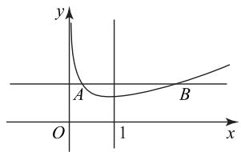
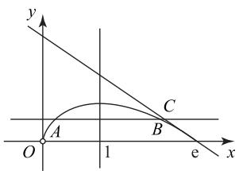

# 利用函数凹凸性求解高考压轴题

李振涛 王淑玲

(北京市顺义牛栏山第一中学)

本文从教材习题出发,给出函数凹凸性的定义,并从代数运算与几何直观的角度对函数凹凸性进行解释,利用函数凹凸性解释高考导数问题的背景,最后在近3年的高考试题中进行验证,总结出一类导数问题的解决思路与方法.

# 1 试题呈现

题目 （人教 A 版普通高中教科书数学必修第一册 101 页第 8 题）证明：

(1) 若 $f(x)=ax+b$ ，则

$$
f \left(\frac {x _ {1} + x _ {2}}{2}\right) = \frac {f \left(x _ {1}\right) + f \left(x _ {2}\right)}{2};
$$

(2) 若 $g(x) = x^2 + ax + b$ ，则

$$
g (\frac {x _ {1} + x _ {2}}{2}) \leqslant \frac {g (x _ {1}) + g (x _ {2})}{2}.
$$

分析 设置这个题目的目的是对函数的凹凸性进行简单说明,是知识拓展的基础.

1) 说明直线不具备凹凸性, 可以有效地说明直线的平直状态.  
2)说明 $f(x)=ax^{2}+bx+c(a\neq0)$ 的凹凸性，当 a>0 时， $f(x)=ax^{2}+bx+c$ 上任意两点的连线总在

A. $\left[0,\frac{3\pi}{8}\right]$   
B. $\left[\frac{15\pi}{8},2\pi\right]$   
C. $\left[\frac{3\pi}{8},\frac{15\pi}{8}\right]$   
D. $\left[0,\pi\right]$

答案 C.

练习3（多选题）已知函数 $f(x) = \sin (\omega x + \frac{\pi}{4})(\omega > 0)$ 在 $[0, \pi]$ 上有且仅有4条对称轴，则下面给出的结论中，正确的是（ ）.

A. $\omega$ 的取值范围是 $\left[\frac{13}{4}, \frac{17}{4}\right)$   
B. $f(x)$ 的最小正周期可能是 2  
C. $f(x)$ 在 $(0,\pi)$ 上可能恰有 4 个零点

所截得弧线的上方， $f(x)$ 是凸函数；当 a<0 时， $f(x)=ax^{2}+bx+c$ 上任意两点的连线总在所截得弧线的下方， $f(x)$ 是凹函数。这是对特定函数的简单解释，下面我们把此题进行拓展。

# 2 拓展研究

1) 凸函数: 设函数 $f(x)$ 在区间 I 上有定义, 如果对于任意 $x_{1}, x_{2} \in I$ 和 $t \in (0,1)$ 都有 $f[tx_{1} + (1 - t) \cdot x_{2}] \leqslant tf(x_{1}) + (1 - t)f(x_{2})$ , 称函数 $f(x)$ 为 I 上的凸函数.

为了便于理解,取 $t=\frac{1}{2}$ , 所以有 $f(\frac{x_{1}+x_{2}}{2})\leqslant\frac{f(x_{1})+f(x_{2})}{2}$ , 从几何角度可以解释为凸函数的图像上任意两点形成的弧线 AB 位于线段 AB 的下方.

2) 凹函数: 设函数 $f(x)$ 在区间 I 上有定义, 如果对于任意 $x_{1}, x_{2} \in I$ 和 $t \in (0,1)$ 都有 $f[tx_{1} + (1 - t) \cdot x_{2}] \geqslant tf(x_{1}) + (1 - t)f(x_{2})$ , 称函数 $f(x)$ 为 I 上的凹函数.

为了便于理解,取 $t=\frac{1}{2}$ , 所以有 $f(\frac{x_{1}+x_{2}}{2})\geqslant$

D. $f(x)$ 在 $(0, \frac{\pi}{12})$ 上可能单调递增

答案 AC.

本文系天津市教育学会“十四五”(2021)教育科研规划重点课题“基于深度学习的高中数学问题研究式教学的实践研究”（课题编号：KT-[十四五]-101-ZD-2102）、天津市教育学会“十四五”(2022)教育科研规划课题“高中数学‘章小结’课教学实践研究”（课题编号：KT-[十四五]-101-2022-GH-0001)阶段性研究成果.

(完)

$\frac{f(x_{1})+f(x_{2})}{2}$ ，从几何角度可以解释为凹函数的图像上任意两点形成的弧线AB位于线段AB的上方.

3) 主要性质：

a) 若函数 $f(x)$ 为 $I$ 上的凸函数，则当 $x_0 \in I$ 时，有 $f(x) \geqslant f'(x_0)(x - x_0) + f(x_0)$ ;  
b) 若函数 $f(x)$ 在 I 上为凹函数，则当 $x_{0} \in I$ 时，有 $f(x) \leqslant f'(x_{0})(x - x_{0}) + f(x_{0})$ ;  
c) 若函数 $f(x)$ 在 a 处存在 n 阶导数，且 $f'(a) = f''(a) = \cdots = f^{(n-1)}(a) = 0, f^{(n)}(a) \neq 0, n$ 是奇数，则 a 不是函数 $f(x)$ 的极值点；n 是偶数，则 a 是函数 $f(x)$ 的极值点。当 $f^{(n)}(a) > 0$ 时，a 是函数 $f(x)$ 的极小值点， $f(a)$ 是极小值；当 $f^{(n)}(a) < 0$ 时，a 是函数 $f(x)$ 的极大值点， $f(a)$ 是极大值。

推论 若函数 $f(x)$ 在 a 处存在 2 阶导数，且 $f'(a)=0, f''(a)\neq0$ ，当 $f''(a)>0$ 时，a 是函数 $f(x)$ 的极小值点， $f(a)$ 是极小值；当 $f''(a)<0$ 时，a 是函数 $f(x)$ 的极大值点， $f(a)$ 是极大值.

# 3 典型应用

例 1 （2023 年新高考Ⅱ卷 22，节选）已知函数$f(x)=\cos ax-\ln(1-x^{2})$ ，若 x=0 是函数 $f(x)$ 的极大值点，求 a 的取值范围.

由题意可知 $f'(x) = -a \sin ax + \frac{2x}{1 - x^{2}}$ ,$f''(x)=-a^{2}\cos ax+\frac{2+2x^{2}}{(1-x^{2})^{2}}$ ，则 $f'(0)=0$ ， $f''(0)<0$ ，所以 $-a^{2}+2<0$ ，则 $a>\sqrt{2}$ 或 $a<-\sqrt{2}$ ，故a的取值范围是 $(-∞,-√2)∪(\sqrt{2},+∞)$ .

例 2 （2023 年新高考 I 卷 19, 节选）已知函数$f(x)=a\left(\mathrm{e}^{x}+a\right)-x.$ 证明：当 a>0 时， $f(x)>2\ln a+\frac{3}{2}.$

当 $a > 0$ 时， $f'(x) = a\mathrm{e}^x - 1, f''(x) = a\mathrm{e}^x>$ 0, 所以函数 $f(x)$ 是凸函数, 其几何含义就是 $f(x)$ 的图像始终在其任意一点的切线上方，所以找到一条合适的切线进行放缩即可.因为 $\mathrm{e}^x\geqslant x + 1$ 及 $h(x) = \mathrm{e}^x$ 是一个凸函数，所以

$$
f (x) = a \left(\mathrm{e} ^ {x} + a\right) - x = a \mathrm{e} ^ {x} + a ^ {2} - x =
$$

$e^{x+\ln a}+a^{2}-x\geqslant x+\ln a+1+a^{2}-x=\ln a+1+a^{2}$ 当且仅当 $x + \ln a = 0$ ，即 $x = -\ln a$ 时，等号成立。要

证 $f(x) > 2\ln a + \frac{3}{2}$ , 即证 $\ln a + 1 + a^2 > 2\ln a + \frac{3}{2}$ , 即证 $a^2 - \frac{1}{2} - \ln a > 0$ .

令 $g(a)=a^{2}-\frac{1}{2}-\ln a(a>0)$ ，则 $g'(a)=\frac{2a^{2}-1}{a}$ 。令 $g'(a)<0$ ，则 $0<a<\frac{\sqrt{2}}{2}$ ；令 $g'(a)>0$ ，则 $a>\frac{\sqrt{2}}{2}$ ，所以 $g(a)$ 在 $(0,\frac{\sqrt{2}}{2})$ 上单调递减，在 $(\frac{\sqrt{2}}{2},+\infty)$ 上单调递增，所以

$$
g _ {\min} (a) = g \left(\frac {\sqrt {2}}{2}\right) = \left(\frac {\sqrt {2}}{2}\right) ^ {2} - \frac {1}{2} - \ln \frac {\sqrt {2}}{2} = \ln \sqrt {2} > 0,
$$

即 $g(a)>0$ 恒成立, 所以当 a>0 时, $f(x)>2\ln a+\frac{3}{2}$ 恒成立.

例 3 （2022 年全国甲卷理 21）已知函数 $f(x)=$

$$
\frac {\mathrm{e} ^ {x}}{x} - \ln x + x - a.
$$

(1) 若 $f(x) \geqslant 0$ ，求 a 的取值范围；  
(2)证明:若 $f(x)$ 有两个零点 $x_{1}, x_{2}$ ，则

$$
x _ {1} x _ {2} <   1.
$$

# 解析

(1)由已知可得 $f(x)$ 的定义域为 $(0, +\infty)$ ,
且 $f'(x)=\frac{x-1}{x}(\frac{\mathrm{e}^{x}}{x}+1)$ .

令 $f'(x)=0$ ，得 x=1，当 $x\in(0,1)$ 时， $f'(x)<0$ ， $f(x)$ 单调递减；当 $x\in(1,+\infty)$ 时， $f'(x)>0$ ， $f(x)$ 单调递增，则 $f(x)\geqslant f(1)=\mathrm{e}+1-a$ 。若 $f(x)\geqslant0$ ，则 $e+1-a\geqslant0$ ，即 $a\leqslant e+1$ ，所以 a 的取值范围为 $(-∞,e+1]$ 。

(2) 因为 $f_{\min}(x)=f(1)$ ，所以 $f(x)$ 的 1 个零点小于 1, 1 个零点大于 1，不妨设 $0<x_{1}<1<x_{2}$ 。由于

$$
f (x) = \frac {\mathrm{e} ^ {x}}{x} - \ln x + x - a = \mathrm{e} ^ {x - \ln x} + (x - \ln x) - a,
$$

设 $t(x)=x-\ln x$ ，则 $f(x)=h(t)=\mathrm{e}^{t}+t-a$ 。因为 $h'(t)=\mathrm{e}^{t}+1>0$ ，所以 $h(t)$ 是增函数，则 $x_{1}-\ln x_{1}=x_{2}-\ln x_{2}$ 。又 $t'(x)=1-\frac{1}{x}$ ，所以 $t(x)$ 在 $(0,1)$ 上单调递减，在 $(1,+\infty)$ 上单调递增，则 $t_{\min}(x)=t(1)$ ，而 $t''(x)=\frac{1}{x^{2}}>0$ ，所以 $t(x)$ 是凸函数，故

$$
\frac {1}{2} \left[ t \left(x _ {1}\right) + t \left(x _ {2}\right) \right] \geqslant
$$

$$
t (\frac {x _ {1} + x _ {2}}{2}) \geqslant t (\sqrt {x _ {1} x _ {2}}) \geqslant t (1),
$$

当且仅当 $x_{1} = x_{2} = 1$ 时，等号成立. 又 $\lim_{x\to +\infty}t(x) = +\infty, \lim_{x\to 0^{+}}t(x) = +\infty$ ，作出 $t(x)$ 的图像，如图1所示，由 $t(x)$ 的单调性知 $\sqrt{x_1x_2} > 1$ 或 $\sqrt{x_1x_2} < 1$ ，即 $x_{1}x_{2} > 1$ 或 $x_{1}x_{2} < 1.$ 假设 $x_{1}x_{2} > 1$ 成立，则 $x_{2}>\frac{1}{x_{1}} >1$ ，所以 $t(x_{2}) > t(\frac{1}{x_{1}})$ ，即 $t(x_{1}) > t(\frac{1}{x_{1}})$ ，故 $x_{1}-\ln x_{1} - (\frac{1}{x_{1}} -\ln \frac{1}{x_{1}}) > 0$ ，整理得到 $x_{1} - \frac{1}{x_{1}} -2\ln x_{1} > 0.$

text_image

y
A
B
O
1
x

图1

令 $g(x)=x-\frac{1}{x}-2\ln x$ (0<x<1)，则 $g'(x)=(1-\frac{1}{x})^{2}>0$ ，故 $g(x)$ 单调递增，所以 $g(x)<g(1)=0$ ，矛盾，所以假设不成立，因此 $x_{1}x_{2}<1$ 。

例 4 （2021 年新高考 I 卷 22）已知函数

$$
f (x) = x (1 - \ln x).
$$

(1) 讨论 $f(x)$ 的单调性；

(2) 设 $a, b$ 为两个不相等的正数，且 $b \ln a - a \ln b = a - b$ ，证明： $2 < \frac{1}{a} + \frac{1}{b} < e$ .

(1) 函数 $f(x)$ 的定义域为 $(0, +\infty)$ ，又$f'(x)=-\ln x$ ，当 $x\in(0,1)$ 时， $f'(x)>0$ ，当 $x \in (1, +\infty)$ 时， $f'(x) < 0$ ，故 $f(x)$ 的单调递增区间为 $(0, 1)$ ，单调递减区间为 $(1, +\infty)$ .

(2) 当 $x \to 0^{+}$ 时, 令 $x = \frac{1}{t}$ , 则 $t \to +\infty$ , 且 $\lim_{x \to 0^{+}} f(x) = \lim_{t \to +\infty} f(\frac{1}{t}) = \lim_{t \to +\infty} \frac{1 + \ln t}{t} = 0$ . 当 $x \to +\infty$ 时, $f(x) \to -\infty$ . 由 $f'(x) = -\ln x$ , $f''(x) = -\frac{1}{x} < 0$ , 可得 $f(x)$ 是凹函数. 因为 $b \ln a - a \ln b = a - b$ , 所以 $b(1 + \ln a) = a (1 + \ln b)$ , 即 $\frac{1 + \ln a}{a} = \frac{1 + \ln b}{b}$ , 故 $f(\frac{1}{a}) = f(\frac{1}{b})$ . 设 $\frac{1}{a} = x_1, \frac{1}{b} = x_2$ , 由 (1) 可知不妨设 $0 < x_1 < 1 < x_2 < e$ , 则原命题等价于已知 $f(x_1) =$

$f(x_{2})$ ，证明 $2 < x_{1} + x_{2} < e$ ，作出 $f(x)$ 的图像，如图 2 所示.

先证明 $x_{1} + x_{2} > 2$ 。由于 $f(x)$ 是凹函数，故 $\frac{1}{2}[f(x_1) + f(x_2)] \leqslant f\left(\frac{x_1 + x_2}{2}\right) \leqslant f(1)$ ，所以 $\frac{x_1 + x_2}{2} > 1$ 或 $\frac{x_1 + x_2}{2} < 1$ 。假设 $\frac{x_1 + x_2}{2} < 1$ 成立，则 $x_{2} < 2 - x_{1}$ ，而 $0 < x_{1} < 1 < x_{2}$ ，故 $f(x_{2}) > f(2 - x_{1})$ ，即 $x_{2}(1 - \ln x_{2}) - (2 - x_{1})[1 - \ln (2 - x_{1})] > 0$ ，则 $x_{1}(1 - \ln x_{1}) - (2 - x_{1})[1 - \ln (2 - x_{1})] > 0$ 。令 $g(x) = x(1 - \ln x) - (2 - x)[1 - \ln (2 - x)] (0 < x < 1)$ ，因为 $\ln x \leqslant x - 1$ ，所以 $-\ln x \geqslant 1 - x$ ，同理可知 $\ln (2 - x) \leqslant 2 - x - 1 = 1 - x$ ，所以 $-\ln (2 - x) \geqslant x - 1$ ，则 $g'(x) = -\ln x - \ln (2 - x) \geqslant 1 - x + x - 1 = 0$ ，所以当 $0 < x < 1$ 时， $g(x)$ 单调递增，所以 $g(x) < g(1) = 0$ ，矛盾，故假设不成立，则 $x_{1} + x_{2} > 2$ 。

再证明 $x_{1} + x_{2} < \mathrm{e}$ . 由于 $f(x_{1}) = f(x_{2})$ ，结合 $f(x)$ 的图像知 $x_{1}, x_{2}$ 为方程 $f(x) - m = 0$ （其中 $m \in (0,1)$ ）的两根. 由 $f(\mathrm{e}) = 0$ ，可得 $f(x)$ 在 $(\mathrm{e},0)$ 处切线为 $y = -x + \mathrm{e}$ . 由于 $f(x)$ 是凹函数，所以 $f(x) \leqslant -x + \mathrm{e}$ . 假设 $f(x)$ 与 $y = m$ 交于 $A, B$ 两点，其横坐标为 $x_{1}, x_{2}$ 且 $0 < x_{1} < x_{2}$ ， $y = m$ 与切线 $y = -x + \mathrm{e}$ 交于点 $C$ ，其横坐标 $x_{3}$ . 由图可知 $\left\{ \begin{array}{l} y = -x + \mathrm{e}, \\ y = m, \end{array} \right.$ 显然 $0 < x_{1} < m, 0 < x_{2} < x_{3} = \mathrm{e} - m$ ，故 $x_{1} + x_{2} < \mathrm{e}$ .

text_image

y
A
O
1
e
x
B
C

图 2

# 4 小结

本文对教材中的习题进行推广,从函数的凹凸性的角度研究基本初等函数的性质,虽然这些性质经常出现在教材习题中,但没有明确地给出结论,这正好是教师进行深度发掘的教学材料.通过分析典型的高考试题,可以发现一些导数题的命题背景是函数的凹凸性,这也为解决导数问题提供了新的视角.

(完)