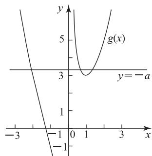

# 剖析分离参数法在高考导数压轴题中的应用

# 郭蒙 $^{1}$ 薛小强 $^{2}$

(1.陕西省榆林市吴堡中学 2.陕西省榆林市吴堡县教研室)

《普通高中数学课程标准(2017年版2020年修订)》对高中毕业的数学学业水平考试、数学高考的命题提出以下建议.考查内容应围绕数学内容主线,聚焦学生对重要数学概念、定理、方法、思想的理解和应用,强调基础性、综合性;注重数学本质、通性通法,淡化解题技巧.在导数压轴题中,不等式恒成立求参数范围问题,是高考中的热点问题,备受命题者的青睐,分离参数法是解决此类问题的一把利器,是一种通法,本文以九道导数试题为例,探讨其在不等式(等式)恒成立求参数范围问题中的应用,以期抛砖引玉.

# 1 全分离参数

例 1 （2023 年全国Ⅱ卷 6）已知函数 $f(x)=a\mathrm{e}^{x}-$ $\ln x$ 在(1,2)上单调递增,则 a 的最小值为().

A. $e^{2}$

B. e

C. $e^{-1}$

D. $e^{-2}$

由题意可得 $f'(x)=a\mathrm{e}^{x}-\frac{1}{x}\geqslant0$ 在(1,2)上

恒成立，显然 $a > 0$ ，所以 $x\mathrm{e}^{x}\geqslant \frac{1}{a}$ 设 $g(x) = x\mathrm{e}^{x}(x\in$ (1,2))，因为 $g^{\prime}(x) = (x + 1)\mathrm{e}^{x} > 0$ ，所以 $g(x)$ 在(1，2)上单调递增， $g(x) > g(1) = \mathrm{e}$ ，故 $\mathrm{e}\geqslant \frac{1}{a}$ ，则 $a\geqslant \frac{1}{\mathrm{e}} =$ $\mathrm{e}^{-1}$ ，即 $a$ 的最小值为 $\mathrm{e}^{-1}$ ，故选C.

该题以函数的单调性为背景,考查导数与不等式的综合运用,考查学生数学运算、转化与化归等能力,通过分离参数,使得问题变得简单,易于解答.

例 2 （2023 年全国乙卷文 20，节选）已知函数$f(x) = (\frac{1}{x} + a)\ln (1 + x)$ , 若函数 $f(x)$ 在 $(0, +\infty)$ 上单调递增, 求 $a$ 的取值范围.

由题意得 $f'(x) = \frac{1}{x^2} \left[ \frac{x(ax + 1)}{x + 1} - \ln (x + \right.$ 1)]≥0 在 $(0,+\infty)$ 上恒成立，即 $\frac{1}{x^{2}}[(x+1)\ln(x+1)-x]\leqslant a$ 在 $(0,+\infty)$ 上恒成立.令

62

数理化

$$
g (x) = \frac {1}{x ^ {2}} [ (x + 1) \ln (x + 1) - x ] (x > 0),
$$

则 $g^{\prime}(x) = \frac{x + 2}{x^{3}}\big[\frac{2x}{x + 2} -\ln (x + 1)\big].$

令 $h(x) = \frac{2x}{x + 2} -\ln (x + 1)(x > 0)$ ，因为

$$
h ^ {\prime} (x) = \frac {- x ^ {2}}{(x + 1) (x + 2) ^ {2}} <   0,
$$

所以 $h(x)$ 在 $(0,+\infty)$ 上单调递减， $h(x)<h(0)=0$ ，故 $g'(x)<0, g(x)$ 在 $(0,+\infty)$ 上单调递减，则

$$
a \geqslant \lim _ {x \rightarrow 0} g (x) = \lim _ {x \rightarrow 0} \frac {(x + 1) \ln (x + 1) - x}{x ^ {2}} =
$$

$$
\lim _ {x \rightarrow 0} \frac {\ln (x + 1)}{2 x} = \lim _ {x \rightarrow 0} \frac {1}{2 (x + 1)} = \frac {1}{2}.
$$

综上，a 的取值范围为 $\left[\frac{1}{2},+\infty\right)$ .

点评

将函数在区间上单调递增转化为导数不等式恒成立,再利用分离参数法及洛必达法则系数 a 的取值范围.

例 3 （2023 年全国乙卷理 21, 节选）已知函数$f(x)=(\frac{1}{x}+a)\ln(1+x)$ ，若 $f(x)$ 在 $(0,+\infty)$ 上存在极值，求 a 的取值范围.

析 由题意可得 $f'(x) = -\frac{1}{x^2} [\ln (x + 1) -$ $\frac{x(ax+1)}{x+1}$ ，因为 $f(x)$ 在 $(0,+\infty)$ 上存在极值，所以 $f'(x)$ 在 $(0,+\infty)$ 上有变号的零点。令 $f'(x)=0$ ，则

$$
\frac {(x + 1) \ln (x + 1) - x}{x ^ {2}} = a,
$$

令 $g(x) = \frac{(x + 1)\ln(x + 1) - x}{x^2} (x > 0)$ ，则

$$
g ^ {\prime} (x) = \frac {x + 2}{x ^ {3}} \left[ \frac {2 x}{x + 2} - \ln (x + 1) \right],
$$

令 $h(x) = \frac{2x}{x + 2} -\ln (x + 1)(x > 0)$ ，则

$$
h ^ {\prime} (x) = \frac {- x ^ {2}}{(x + 1) (x + 2) ^ {2}} <   0,
$$

$h(x)$ 在 $(0, +\infty)$ 上单调递减， $h(x) < h(0) = 0$ ，故 $g'(x) < 0, g(x)$ 在 $(0, +\infty)$ 上单调递减，由例2知 $\lim_{x \to 0} g(x) = \frac{1}{2}$ ，同理可得 $\lim_{x \to +\infty} g(x) = 0$ .

综上，a 的取值范围为 $(0, \frac{1}{2})$ .

将问题转化为导函有数变号零点的问题,再利用转化思想,将方程转化为两个函数交点的问题,进而利用洛必达法则求极限,有助于提升学生的直观想象、逻辑推理等核心素养.

# 2 半分离参数

例 4 （2023 年全国乙卷理 16）设 $a \in (0,1)$ ，若 $f(x) = a^{x} + (1 + a)^{x}$ 在 $(0, +\infty)$ 上单调递增，的取值范围是 \_\_\_\_.

由题意得 $f'(x)=a^{x}\ln a+(1+a)^{x}\ln(1+a)\geqslant0$ 在 $(0,+\infty)$ 上恒成立，即 $(1+\frac{1}{a})^{x}\geqslant$ $-\frac{\ln a}{\ln(1+a)}$ 在 $(0,+\infty)$ 上恒成立. 因为 $a\in(0,1)$ ，所以 $y=(1+\frac{1}{a})^{x}$ 在 $(0,+\infty)$ 上单调递增，因为 $(\frac{1+a}{a})^{0}=1$ ，所以 $1\geqslant-\frac{\ln a}{\ln(1+a)}$ . 又因为 $a+1\in(1,2)$ ，所以 $\ln(a+1)>0,\ln a+\ln(1+a)\geqslant0$ ，解得 $\frac{\sqrt{5}-1}{2}\leqslant a<1$ ，故 a 的取值范围为 $\left[\frac{\sqrt{5}-1}{2},1\right)$ .

此题考查利用导数研究函数的单调性,考查不等式的求解方法,考查考生的运算求解能力以及灵活应用导数分析、解决问题的能力.对于不等式恒成立问题,有时可以将部分变量分离出来,这种方法称为半分离参数法.

例 5 （2023 年全国甲卷文 20, 节选）已知函数$f(x) = ax - \frac{\sin x}{\cos^2 x} (x \in (0, \frac{\pi}{2}))$ ，若 $f(x) + \sin x < 0$ ，求 $a$ 的取值范围.

方法 1 （全分离）由题意得 $a < \frac{1}{x} \left( \frac{\sin x}{\cos^{2} x} - \right.$ $\sin x)=\frac{\sin^{3}x}{x\cos^{2}x}$ 在 $(0,\frac{\pi}{2})$ 上恒成立.令 $h(x)=\frac{\sin^{3}x}{x\cos^{2}x}$ $(x\in(0,\frac{\pi}{2}))$ ，因为 $\sin x<x(x\in(0,\frac{\pi}{2}))$ ，所以

$$
h ^ {\prime} (x) = \frac {3 x \sin^ {2} x \cos^ {3} x - \sin^ {3} x \cos^ {2} x + 2 x \sin^ {4} x \cos x}{x ^ {2} \cos^ {4} x} =
$$

$$
\frac {\sin^ {2} x}{x ^ {2} \cos^ {3} x} (3 x - x \sin^ {2} x - \sin x \cos x) >
$$

$$
\frac {\sin^ {2} x}{x ^ {2} \cos^ {3} x} (3 x - x - \sin x) >
$$

$$
\frac {\sin^ {2} x}{x ^ {2} \cos^ {3} x} (2 x - x) > 0 (x \in (0, \frac {\pi}{2})),
$$

故 $h(x)$ 在 $(0, \frac{\pi}{2})$ 上单调递增，则

$$
h (x) > \lim _ {x \rightarrow 0} h (x) = \lim _ {x \rightarrow 0} \frac {\sin^ {3} x}{x \cos^ {2} x} = \lim _ {x \rightarrow 0} \frac {\sin^ {3} x - \sin^ {3} 0}{x - 0} =
$$

$$
\left. \left(\sin^ {3} x\right) ^ {\prime} \right| _ {x = 0} = \left(3 \sin^ {2} x \cos x\right) | _ {x = 0} = 0,
$$

所以 $a \leqslant 0$ ，即 a 的取值范围为 $(-∞, 0]$ .

# 点评

本题参数 a 容易分离出来, 利用放缩法得到导函数 $h'(x)$ 恒正, 再利用导数的定义求出的取值范围.

方法 2 （半分离）由题意得 $\frac{\sin x}{\cos^{2}x}-\sin x>ax$ 在 $(0,\frac{\pi}{2})$ 上恒成立.设

$$
g (x) = \frac {\sin x}{\cos^ {2} x} - \sin x = \frac {\sin^ {3} x}{\cos^ {2} x} (x \in (0, \frac {\pi}{2})),
$$

则 $g'(x)=\frac{3\sin^{2}x-\sin^{4}x}{\cos^{3}x}=\frac{\sin^{2}x(3-\sin^{2}x)}{\cos^{3}x}>0$ ，所以 $g(x)$ 在 $(0,\frac{\pi}{2})$ 上单调递增。又因为

$$
g ^ {\prime \prime} (x) = \frac {\sin x \left(\sin^ {4} x - \sin^ {2} x + 6\right)}{\cos^ {4} x} >
$$

$$
\frac {\sin x \left(\sin^ {4} x - 1 + 6\right)}{\cos^ {4} x} > 0,
$$

则 $g(x)$ 为 $(0, \frac{\pi}{2})$ 上的凸函数，而 $g'(0) = 0, g(0) = 0$ ，所以 $g(x)$ 在点 $(0, 0)$ 处切线方程为 y = 0，此时对应 a = 0，由 $g(x)$ 的凹凸性可得 $a \leqslant g'(0) = 0$ .

综上，a 的取值范围为 $(-∞,0]$ .

# 点评

借助函数凹凸性以及切线斜率的几何意义，极大地简化了问题，使得问题迎刃而解，有助于提升学生的直观想象、逻辑推理等核心素养.

例 6 （2023 年全国甲卷理 21,节选）已知函数$f(x)=ax-\frac{\sin x}{\cos^{3}x}(x\in(0,\frac{\pi}{2}))$ . 若 $f(x)<\sin 2x$ 恒成立，求 a 的取值范围.

# 析

方法 1 （全分离）因为 $f(x) < \sin 2x$ 恒成立，所以 $\frac{1}{x} (\sin 2x + \frac{\sin x}{\cos^{3} x}) > a$ 在 $(0, \frac{\pi}{2})$ 上

恒成立.设

$$
g (x) = \frac {1}{x} [ \sin 2 x + \frac {\sin x (\sin^ {2} x + \cos^ {2} x)}{\cos^ {3} x} ] =
$$

$$
\frac {1}{x} \left(\tan^ {3} x + \tan x + \sin 2 x\right) \left(x \in \left(0, \frac {\pi}{2}\right)\right),
$$

则

$$
g ^ {\prime} (x) = \frac {1}{x ^ {2}} \left(3 x \tan^ {4} x + 4 x \tan^ {2} x + x + 2 x \cos 2 x - \right.
$$

$$
\tan x - \tan^ {3} x - \sin 2 x).
$$

设

$$
h (x) = 3 x \tan^ {4} x + 4 x \tan^ {2} x + x + 2 x \cos 2 x -
$$

$$
\tan x - \tan^ {3} x - \sin 2 x (x \in (0, \frac {\pi}{2})),
$$

则

$$
h ^ {\prime} (x) = 1 2 x \tan^ {5} x + 2 0 x \tan^ {3} x + \frac {8 x \sin^ {3} x}{\cos x} > 0,
$$

因此， $h(x)$ 在 $(0,\frac{\pi}{2})$ 上单调递增， $h(x) > h(0) = 0$ ，即 $g^{\prime}(x) > 0,g(x)$ 在 $(0,\frac{\pi}{2})$ 上单调递增，故

$$
a \leqslant \lim _ {x \rightarrow 0 ^ {+}} g (x) = \lim _ {x \rightarrow 0 ^ {+}} \frac {1}{x} (2 \sin x \cos x + \frac {\sin x}{\cos^ {3} x}) =
$$

$3 \lim_{x \to 0^{+}} \frac{\sin x}{x} = 3 \lim_{x \to 0^{+}} \frac{\sin x - \sin 0}{x - 0} = 3 (\sin x)'|_{x=0} = 3,$ 所以 a 的取值范围为 $(-∞, 3]$ .

全分离参数后将问题转化为不含参数函数与常函数的关系,利用导数研究函数 $g(x)$ ,最后利用导数的定义求得极限的值,解题过程中用到了 $(\tan x)'=\frac{1}{\cos^{2}x}=1+\tan^{2}x.$

方法 2 （半分离）由题意得 $\sin 2x + \frac{\sin x}{\cos^{3}x} > ax$ 在 $(0, \frac{\pi}{2})$ 上恒成立. 设 $h(x) = \sin 2x + \frac{\sin x}{\cos^{3}x} (x \in (0, \frac{\pi}{2}))$ ，则

$$
h ^ {\prime} (x) = 4 \cos^ {2} x - 2 + \frac {3 - 2 \cos^ {2} x}{\cos^ {4} x},
$$

$$
h ^ {\prime \prime} (x) = \frac {\sin x}{\cos^ {5} x} \left(1 2 - 8 \cos^ {6} x - 4 \cos^ {2} x\right) >
$$

$$
\frac {\sin x}{\cos^ {5} x} (1 2 - 8 - 4) = 0,
$$

故 $h(x)$ 为 $(0, \frac{\pi}{2})$ 上的凸函数， $h'(x)$ 在 $(0, \frac{\pi}{2})$ 上单调递增， $h'(x) > h'(0) = 3 > 0, h(x)$ 在 $(0, \frac{\pi}{2})$ 上单调递

增, $h'(0)=3,h(0)=0,h(x)$ 在点 $(0,0)$ 处的切线方程为y=3x，对应a=3，由 $h(x)$ 的凹凸性可得 $a\leqslant h'(0)=3$ .

综上，a 的取值范围为 $(-∞,3]$ .

点评

借助函数的凹凸性及切线斜率的几何意义，极大地简化了问题，使得问题迎刃而解.

例 7 （2023 年全国乙卷文 8）函数 $f(x)=x^{3}+$ 2 存在 3 个零点，则 a 的取值范围是（）.

A. $(-∞,-2)$

B. $(-∞,-3)$

C. $(-4,-1)$

D. $(-3,0)$

析

方法 1 （全分离）由题意可知 $f(x)=0(x \in \mathbf{R})$ 有 3 个不同的实数根，且显然 x=0 不是$f(x)=0$ 的解.由 $f(x)=0$ , 得 $x^{2}+\frac{2}{x}=-a$ . 设 $g(x)=x^{2}+\frac{2}{x}$ , 则函数 $g(x)$ 的图像与直线 y=-a 有 3 个交点. 易知 $g'(x)=\frac{2(x^{3}-1)}{x^{2}}$ .

当 $x \in (-\infty, 0)$ 时， $g'(x) < 0, g(x)$ 单调递减，且当 $x \to -\infty$ 时， $g(x) \to +\infty$ .

当 $x \to 0^{-}$ 时， $g(x) \to -\infty$ ；当 $x \in (0,1)$ 时， $g'(x) < 0, g(x)$ 单调递减，且当 $x \to 0^{+}$ 时， $g(x) \to +\infty$ .

当 $x \in (1, +\infty)$ 时， $g'(x) > 0$ ， $g(x)$ 单调递增，当 $x \to +\infty$ 时， $g(x) \to +\infty$ ，因此，当 $x = 1$ 时， $g(x)$ 取得极小值3.如图1所示，由函数 $g(x)$ 与直线 $y = -a$ 的图像可知 $-a > 3$ ，即 $a < -3$ ，故选B.

line

| x    | y     |
| ---- | ----- |
| -3   | 5     |
| -1   | 3     |
| 0    | 3     |
| 1    | 3     |
| 3    | 5     |

图1

点评

此题依托三次函数考查函数的零点,利用导数得到原函数的单调性,画出函数的大致图像很容易得到答案.试题考查考生的运算求解、逻辑推理、直观想象能力以及数形结合、化归与转化等思想，有一定的区分度，体现了高考试题的选拔功能.

方法 2 （半分离）由 $f(x)=0$ ，得 $ax+2=-x^{3}$ ，由题意可得函数 $y=-x^{3}$ 与直线 $y=ax+2$ 有 3 个交点.设函数 $y = -x^{3}$ 与直线 $y = ax + 2$ 相切于点 $P(x_0, y_0)$ ，则 $ax_0 + 2 = -x_0^3$ ， $a = -3x_0^2$ ，解得 $x_0 = 1$ ， $a = -3$ ，所以切点坐标为 $P(1, -1)$ ，由函数 $y = -x^3$ 与直线 $y = ax + 2$ 图像可得 $a < -3$ ，故选 B.

利用半分离参数法将问题转化为两个函数图像有3个交点,要求学生具有较强的数学运算、逻辑推理、直观想象能力.

# 3 虚设零点整体代入

例8 已知函数 $f(x) = x(1 + \ln x)$ .

(1)求函数 $f(x)$ 的图像在点 $(1,1)$ 处的切线方程；  
(2) 若 $k \in Z$ ，且 $k(x-1) < f(x)$ 对任意 x > 1 恒成立，求 k 的最大值.

(1) 因为 $f'(x)=\ln x+2$ ，所以 $f'(1)=2$ ，函数 $f(x)$ 的图像在点(1,1)处的切线方程为

$$
y = 2 x - 1.
$$

(2) 因为 $k(x-1) < f(x)$ 对任意 x > 1 恒成立，所以 $\frac{x + x \ln x}{x - 1} > k$ 对任意 x > 1 恒成立.

令 $g(x) = \frac{x + x\ln x}{x - 1} (x > 1)$ ，则

$$
g ^ {\prime} (x) = \frac {x - \ln x - 2}{(x - 1) ^ {2}}.
$$

令

$$
h (x) = x - \ln x - 2 (x > 1),
$$

则 $h'(x)=\frac{x-1}{x}>0$ ，因此， $h(x)$ 在 $(1,+\infty)$ 上单调递增。因为

$$
h (3) = 1 - \ln 3 <   0,
$$

$$
h (4) = 2 - 2 \ln 2 > 0,
$$

故存在唯一的 $x_{0} \in (3,4)$ ，使得 $h(x_{0}) = 0$ ，即 $x_{0} - \ln x_{0} - 2 = 0$ 。当 $1 < x < x_{0}$ 时， $h(x) < 0$ ，即 $g'(x) < 0$ ；当 $x > x_{0}$ 时， $h(x) > 0$ ，即 $g'(x) > 0$ ，所以函数 $g(x)$ 在 $(1, x_{0})$ 上单调递减，在 $(x_{0}, +\infty)$ 上单调递增，则

$$
g _ {\min} (x) = g \left(x _ {0}\right) =
$$

$$
\frac {x _ {0} (1 + \ln x _ {0})}{x _ {0} - 1} = \frac {x _ {0} (1 + x _ {0} - 2)}{x _ {0} - 1} = x _ {0} \in (3, 4),
$$

所以 $k < g_{\min}(x) = x_{0} \in (3,4)$ ，故 k 的最大值为 3.

分离参数后,由于导函数的零点不易求出,
故利用零点存在定理虚设零点和整体代换,进而使得问题得以解决.

# 4 参变量讨论分离

例 9 （2020 年全国Ⅰ卷理 21, 节选）已知函数$f(x) = \mathrm{e}^{x} + ax^{2} - x.$ 当 $x\geqslant 0$ 时， $f(x)\geqslant \frac{1}{2} x^3 +1$ ，求 $a$ 的取值范围.

解析

当 $x = 0$ 时，满足题意，此时 $a \in \mathbf{R}$ .

当 $x > 0$ 时，由题意可得

$$
\frac {1}{x ^ {2}} \left(\frac {1}{2} x ^ {3} + x + 1 - \mathrm{e} ^ {x}\right) \leqslant a (x > 0).
$$

令 $h(x) = \frac{1}{x^2} (\frac{1}{2} x^3 + x + 1 - \mathrm{e}^x)(x > 0)$ ，则

$$
h ^ {\prime} (x) = \frac {1}{x ^ {3}} (2 - x) \left(\mathrm{e} ^ {x} - \frac {1}{2} x ^ {2} - x - 1\right) =
$$

$$
\frac {\mathrm{e} ^ {x}}{x ^ {3}} (2 - x) \left[ 1 - \frac {1}{\mathrm{e} ^ {x}} \left(\frac {1}{2} x ^ {2} + x + 1\right) \right].
$$

令 $m(x)=\frac{1}{\mathrm{e}^{x}}\left(\frac{1}{2}x^{2}+x+1\right)(x>0)$ ，则 $m'(x)=-\frac{x^{2}}{2\mathrm{e}^{x}}<0$ ，因此， $m(x)$ 在 $(0,+\infty)$ 上单调递减， $m(x)<m(0)=1$ ，即 $1-\frac{1}{\mathrm{e}^{x}}\left(\frac{1}{2}x^{2}+x+1\right)>0.$

当 0 < x < 2 时， $h'(x) > 0$ ， $h(x)$ 单调递增，当 x > 2 时， $h'(x) < 0$ ， $h(x)$ 单调递减，则 $h_{\max}(x) = h(2) = \frac{7 - e^{2}}{4}$ ，故 a 的取值范围为 $\left[\frac{7 - e^{2}}{4}, +\infty\right)$ .

点评

分离参数时要对 x 进行分类讨论, 由于 $e^{x}=1+x+\frac{1}{2}x^{2}+\frac{1}{3!}x^{3}+\frac{1}{4!}x^{4}+\cdots+o(x^{n})$ , 则

当 $x > 0$ 时， $\mathrm{e}^x -\frac{1}{2} x^2 -x - 1 > 0$ ，进而求得 $a$ 的值.

分离参数法是解决导数恒成立压轴题的一把利器,是一种通法,在复习过程中,学生应注重基础,建构知识网络,重视通性通法,优化解题方法,夯实基本技能和基本方法.由于历年高考试题具有较强的指导意义,故学生应加强对真题的研究,挖掘高考题的作用,强调通性通法、举一反三、融会贯通,发展数学核心素养.希望本文对读者的学习有一定的启发作用.

本文系榆林市课题《GeoGebra 在新人教 A 版高中函数教学中的应用研究》(课题编号：YWX242992)的阶段性研究成果.

(完)