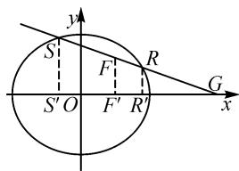

# 动中有静,以静制动:对圆锥曲线压轴题的深度探究

山东省广饶县第一中学 鞠 涛 杜倩倩

# 1 试题呈现与解析

例题 已知圆的方程为 $C: x^{2} + y^{2} = 4, P$ 为圆上动点，点 F 的坐标为 $(1, 0)$ ，连接 OP, FP，过 P 作 FP 的垂线 l，线段 FP 的中垂线交 OP 于点 M，直线 FM 交 l 于点 A。（1）求点 A 的轨迹方程。（2）记点 A 的轨迹为曲线 C，过点 $G(4, 0)$ 作斜率不为 0 的直线 n 交曲线 C 于不同两点 S, R，直线 x = 1 与直线 n 交于点 H，记 $\lambda = \frac{S_{\triangle HFR}}{S_{\triangle HFS}}, \mu = \frac{S_{\triangle GFS}}{S_{\triangle GFR}}$ ，问： $\lambda \cdot \mu$ 是否为定值？若是，求出该定值；若不是，请说明理由。

解:(1)点 A 的轨迹方程为 $\frac{x^{2}}{4}+\frac{y^{2}}{3}=1$ (过程略).

(2) 设 $S(x_{1}, y_{1}), R(x_{2}, y_{2})$ ，直线 $n: x = my + 4 (m \neq 0)$ ，则

$$
\lambda = \frac {S _ {\triangle H F R}}{S _ {\triangle H F S}} = \frac {\frac {1}{2} | H F | \cdot | x _ {2} - 1 |}{\frac {1}{2} | H F | \cdot | 1 - x _ {1} |},
$$

$$
\mu = \frac {S _ {\triangle G F S}}{S _ {\triangle G F R}} = \frac {\frac {1}{2} | G F | \cdot | y _ {1} |}{\frac {1}{2} | G F | \cdot | y _ {2} |}.
$$

所以 $\lambda\mu=\frac{|x_{2}-1|\cdot|y_{1}|}{|x_{1}-1|\cdot|y_{2}|}=\frac{|my_{2}+3|\cdot|y_{1}|}{|my_{1}+3|\cdot|y_{2}|}=$

$$
\frac {\left| m y _ {2} y _ {1} + 3 y _ {1} \right|}{\left| m y _ {1} y _ {2} + 3 y _ {2} \right|}.
$$

联立直线 $n: x = my + 4 (m \neq 0)$ 与曲线 $C: \frac{x^2}{4} + \frac{y^2}{3} = 1$ ，整理得 $(3m^2 + 4)y^2 + 24my + 36 = 0$ ，由 $\Delta = 24^2m^2 - 144(3m^2 + 4) > 0$ ，得 $m < -2$ 或 $m > 2$ . 又 $\frac{y_2 + y_1}{y_1y_2} = \frac{-24m}{36} = \frac{-2m}{3}$ ，则 $my_1y_2 = -\frac{3}{2}(y_2 + y_1)$ ，所以 $\lambda \mu = \frac{\left| -\frac{3}{2}(y_2 + y_1) + 3y_1 \right|}{\left| -\frac{3}{2}(y_2 + y_1) + 3y_2 \right|} = \frac{\left| \frac{3}{2}y_1 - \frac{3}{2}y_2 \right|}{\left| \frac{3}{2}y_2 - \frac{3}{2}y_1 \right|} = 1$ ，即$\lambda\cdot\mu$ 为定值 1.

评注:本题第二问先对要证的目标关系式进行转化,再联立曲线与直线方程后得到一元二次方程

$Ay^{2} + By + C(C \neq 0) = 0$ ，这里计算 $\frac{y_1 + y_2}{y_1y_2}$ 可以直接得到 $-\frac{B}{C}$ ，即 $y^2$ 的系数 $A$ 没有参与运算约掉了，因此先对题目所给信息整理后再联立可以节省很多不必要的步骤，最后再根据化简所得结果得出结论.

# 2 试题的背景溯源及命题探究

# 2.1 探究方向 1: 线动点不动, 点 F, G 均在 x 轴上

通过例 1 的求解过程, 可以发现在化简 $\lambda \cdot \mu$ 时出现了关系式 $\frac{|x_{2}-1| \cdot |y_{1}|}{|x_{1}-1| \cdot |y_{2}|}$ , 实际上是证明 $\left|\frac{y_{1}}{x_{1}-1}\right| \cdot \left|\frac{x_{2}-1}{y_{2}}\right| = \left|\frac{k_{SF}}{k_{RF}}\right| = 1$ , 显然 $k_{SF} \cdot k_{RF} < 0$ , 于是有 $k_{SF} + k_{RF} = 0$ . 利用这个斜率关系, 我们得到例 1 的以下三个变式:

变式 1 过点 $G(4,0)$ 作斜率不为 0 的直线 l 交椭圆 $C: \frac{x^{2}}{4} + \frac{y^{2}}{3} = 1$ 于不同两点 S, R，则 x 轴上是否存在一点 F，使 $\angle RFG = SFO$ ？请说明理由.

解: 假设存在 $F(t,0)$ ，使 $\angle RFG = SFO$ ，则 $k_{SF} + k_{RF} = 0$ 。设 $S(x_{1}, y_{1})$ ， $R(x_{2}, y_{2})$ ，直线 l 的方程为 $x = my + 4 (m \neq 0)$ ，则 $\frac{y_{1}}{x_{1} - t} + \frac{y_{2}}{x_{2} - t} = 0$ ，整理可得 $(my_{2} + 4 - t)y_{1} + (my_{1} + 4 - t)y_{2} = 0$ ，即 $2my_{1}y_{2} = (t - 4)(y_{1} + y_{2})$ ，所以 $\frac{y_{1} + y_{2}}{y_{1}y_{2}} = \frac{2m}{t - 4}$ 。同上述例题联立方程，有 $\frac{y_{2} + y_{1}}{y_{1}y_{2}} = \frac{2m}{-3}$ ，显然 t = 1。故存在点 $F(1,0)$ ，使 $\angle RFG = SFO$ 。

评注: 变式 1 源于 2018 年新课标 I 卷理科第 19 题. 变式 1 将直线经过的定点改为在椭圆外, 并改为探索性问题, 增强了对学生计算能力的考查.

变式 2 已知点 S, R 是椭圆 $C: \frac{x^{2}}{4} + \frac{y^{2}}{3} = 1$ 上位于 x 轴同侧的不同两点，点 $F(1,0)$ ，若 $k_{SF} + k_{RF} = 0$ ，证明：直线 SR 过定点.

证明: 设 $S(x_{1}, y_{1})$ , $R(x_{2}, y_{2})$ , SR: $x = my + n$ ( $mn \neq 0$ ), 由 $k_{RF} + k_{SF} = 0 \Leftrightarrow \frac{y_{1}}{x_{1} - 1} + \frac{y_{2}}{x_{2} - 1} = 0 \Leftrightarrow$

$(my_{2}+n-1)y_{1}+(my_{1}+n-1)y_{2}=0\Leftrightarrow\frac{y_{1}+y_{2}}{y_{1}y_{2}}=\frac{2m}{1-n}.$ 联立 $x=my+n(mn\neq0)$ 与 $\frac{x^{2}}{4}+\frac{y^{2}}{3}=1$ ，整理可得 $(3m^{2}+4)y^{2}+6mny+3(n^{2}-4)=0$ ，由 $\Delta=36m^{2}n^{2}-12(3m^{2}+4)(n^{2}-4)>0$ ，得 $n^{2}<3m^{2}+4$ ，故 $\frac{y_{2}+y_{1}}{y_{1}y_{2}}=\frac{-6mn}{3(n^{2}-4)}=\frac{2m}{\frac{4}{n}-n}.$ 显然 $\frac{4}{n}=1$ ，即 n=4，故直线 SR: x=my+4 过定点 $(4,0)$ .

评注:变式 2 是变式 1 的逆命题,考查了学生的数学运算素养.

变式 3 过点 $G(4,0)$ 作斜率不为 0 的直线 l 交椭圆 $C: \frac{x^{2}}{4} + \frac{y^{2}}{3} = 1$ 于不同两点 S, R，点 S 关于 x 轴的对称点为 $S'$ ，证明：直线 $S'R$ 过定点.

证明: 设点 $F(1,0)$ ，同例 1 易证 $k_{SF} + k_{RF} = 0$ ，又 $k_{S'F} = -k_{SF}$ ，则 $k_{S'F} = k_{RF}$ ，即 $S', F, R$ 三点共线，故直线 $S'R$ 过定点 $(1,0)$ .

评注: 变式 3 是对变式 1 的进一步深入, 通过 $k_{SF} + k_{RF} = 0$ 的斜率关系及对称性可以快速解决问题. 如果知识储备不够, 使用常规解法解答本题, 运算量将会非常大! 因此, 在解析几何试题中我们应重视二级结论的积累与应用, 这样才能快速锁定问题.

# 2.2 探究方向 2: 线动时点动, 点 F 变动, 点 G 不动

通过探究 1, 我们发现 $k_{SF} + k_{RF} = 0 = k_{GF}$ , 那么当点 $F$ 不在 $x$ 轴上时, 是否仍存在 $k_{SF} + k_{RF} = k_{GF}$ ? 容易发现, 当 $G, S, R, F$ 四点共线时, $k_{SF} = k_{RF} = k_{GF}$ , 于是有 $k_{SF} + k_{RF} = 2k_{GF}$ . 利用这个斜率关系式, 可以得到以下两个变式:

变式 4 过点 $G(4,0)$ 作斜率不为 0 的直线 l 交椭圆 $C: \frac{x^{2}}{4} + \frac{y^{2}}{3} = 1$ 于不同两点 S, R，而 F 是直线 x = 1 上的动点，是否存在实数 $\lambda$ ，使 $k_{SF} + k_{RF} + \lambda k_{GF} = 0$ ? 请说明理由.

解: 存在 $\lambda = -2$ , 使得 $k_{SF} + k_{RF} = 2k_{GF}$ .

理由如下: 设 $S(x_{1}, y_{1})$ , $R(x_{2}, y_{2})$ , $F(1, t)$ , l: $x = my + 4 (m \neq 0)$ .

(1) 当 t=0，即 $F(1,0)$ 时，

$$
k _ {S F} + k _ {R F} = 2 k _ {G F} \Leftrightarrow \frac {y _ {1}}{x _ {1} - 1} + \frac {y _ {2}}{x _ {2} - 1} = 0, \tag {①}
$$

同变式 1 证明过程可证明①式.

(2) 当 $t \neq 0$ 时, $k_{SF} + k_{RF} = 2k_{GF} \Leftrightarrow \frac{y_1 - t}{x_1 - 1} + \frac{y_2 - t}{x_2 - 1} = \frac{2t}{-3}$ , 代入①式, 即证明 $\frac{-t}{x_1 - 1} + \frac{-t}{x_2 - 1} = \frac{2t}{-3}$ , 整理得 $5(x_2 + x_1) = 2x_2x_1 + 8$ , 结合点 $S, R$ 在直线 $l$ 上, 整理得 $\frac{y_2 + y_1}{y_2y_1} = \frac{-2m}{3}$ , 由例题联立方程的过程, 此式显

然成立.

综上，存在 $\lambda = -2$ ，使原命题成立。

评注:本题证明过程用到了以静制动的思想方法,从动点 F 落在 x 轴的静止状态入手,得到 $\frac{y_{1}}{x_{1}-1}+\frac{y_{2}}{x_{2}-1}=0$ , 这个式子对于后续的简化运算具有关键作用,如果没有这个式子,运算量将是极其巨大的!

变式 5 F 是直线 x=1 上的动点，过点 F 的直线 $l_{1}$ 与 x 轴交于点 $G(n,0)$ ，过点 G 且斜率不为 0 的直线 $l_{2}$ 交椭圆 $C:\frac{x^{2}}{4}+\frac{y^{2}}{3}=1$ 于不同两点 S,R，是否存在实数 n，使直线 SF,GF 和 RF 的斜率成等差数列？请说明理由.

解: 假设存在实数 n, 使得 $k_{SF} + k_{RF} = 2k_{GF}$ . 设 $S(x_{1}, y_{1}), R(x_{2}, y_{2}), F(1, t), l_{2}: x = my + n (m \neq 0)$ .

(1) 当 t=0，即 $F(1,0)$ 时，

$$
k _ {S F} + k _ {R F} = 2 k _ {G F} \Leftrightarrow \frac {y _ {1}}{x _ {1} - 1} + \frac {y _ {2}}{x _ {2} - 1} = 0, \tag {①}
$$

同变式 2 证明过程可得当 n=4 时①式成立.

(2) 当 $t \neq 0$ 时, $k_{SF} + k_{RF} = 2k_{GF} \Leftrightarrow \frac{y_1 - t}{x_1 - 1} + \frac{y_2 - t}{x_2 - 1} = \frac{2t}{-3}$ , 代入①式化简得 $5(x_1 + x_2) = 2x_2x_1 + 8$ , 由 (1) 知, $n$ 只能为 4, 故 $l_2: x = my + 4 (m \neq 0)$ . 后续过程同变式 4, 易得 $n = 4$ 时, $k_{SF} + k_{RF} = 2k_{GF}$ .

评注:本题求解过程仍然采取从特殊到一般的思想方法,先通过点 F 落在 x 轴上求出 n=4,化简得 $l_{2}:x=my+4(m\neq0)$ ,再去求解当点 F 运动的其他情形,以静制动,事半功倍!

# 2.3 探究方向 3: 点在动线上, G, S, R, F 四点共线

在例 1 中，当直线 l 与 x 轴重合时，不妨设 $R(-2,0)$ ， $S(2,0)$ ，由 $G(4,0)$ 及 $F(1,0)$ ，有 $|GR|=6$ ， $|GS|=2$ ， $|GF|=3$ ， $|FR|=3$ ， $|FS|=1$ ，于是 $\frac{1}{|GS|}+\frac{1}{|GR|}=\frac{2}{3}=\frac{2}{|GF|}$ ，且 $\frac{|GR|}{|GS|}=\frac{|FR|}{|FS|}$ 。那么，当点 F 或点 G 变动时，等式是否仍然成立？于是有了下列变式：

变式6 在下列条件①和②中选出一个，解答以下问题：过点 $G(4,0)$ 作斜率不为0的直线 $l$ 交椭圆 $C:\frac{x^2}{4} +\frac{y^2}{3} = 1$ 于不同两点 $S,R$ ，则 $l$ 上是否存在一点 $F$ ，使得\_\_\_\_？若存在，请求出点 $F$ 的轨迹方程；若不存在，请说明理由.

$$
① \frac {1}{| G S |} + \frac {1}{| G R |} = \frac {2}{| G F |}; ② \frac {| G R |}{| G S |} = \frac {| F R |}{| F S |}.
$$

解:如图1,分别过S,F,R作 $SS',FF',RR'$ 垂直于x轴, $S',F',R'$ 为垂足,不妨设 $S(x_{1},y_{1}),R(x_{2},y_{2}),F(x_{0},y_{0}),l:x=my+4(m\neq0)$ .记 $\angle SGO=\alpha$ .

若选①, 则 $\frac{|SS'|}{|SG|} = \sin \alpha$ , 即 $\frac{1}{|SG|} = \frac{\sin \alpha}{|SS'|}$ . 同理

$\frac{1}{|FG|}=\frac{\sin\alpha}{|FF'|},\frac{1}{|RG|}=$ $\frac{\sin\alpha}{|RR'|}$ . 假设①成立，则

text_image

S'
F
R
S'O
F'
R'
G
x
y

图1

$\frac{1}{|GS|} + \frac{1}{|GR|} = \frac{2}{|GF|} \Leftrightarrow$ $\frac{1}{|SS'|} + \frac{1}{|RR'|} = \frac{2}{|FF'|} \Leftrightarrow$ $\frac{1}{|y_{1}|}+\frac{1}{|y_{2}|}=\frac{2}{|y_{0}|}\Leftrightarrow\frac{2}{|y_{0}|}=\frac{|y_{1}|+|y_{2}|}{|y_{1}|\cdot|y_{2}|}=\frac{|y_{1}+y_{2}|}{|y_{1}y_{2}|}$ (其中 $y_{1}y_{2}>0$ )，

同例1联立方程的过程，有 $\frac{y_2 + y_1}{y_1y_2} = \frac{2m}{-3}$ 故 $|y_0| = \left|\frac{3}{m}\right|$ . 又点 $F$ 在 $l$ 上，当 $m > 0$ 时， $y_0 < 0$ ，则 $x_0 = m \times \left(\frac{-3}{m}\right) + 4 = 1$ ；当 $m < 0$ 时， $y_0 > 0$ ，则 $x_0 = m \times \left(\frac{-3}{m}\right) + 4 = 1$ . 由 $\Delta > 0$ ，得 $m < -2$ 或 $m > 2$ ，则 $0 < y_0 < \frac{3}{2}$ 或 $-\frac{3}{2} < y_0 < 0$ ，故 $F$ 的轨迹方程为直线 $x = 1$ ，其中 $y \in \left(-\frac{3}{2}, 0\right) \cup \left(0, \frac{3}{2}\right)$ .

若选②,则 $\frac{|GR|}{|GS|} = \frac{|GR'|}{|GS'|} = \frac{|4 - x_2|}{|4 - x_1|},\frac{|FR|}{|FS|} =$

$\frac{|x_{2}-x_{0}|}{|x_{0}-x_{1}|}$ . 假设②成立，则 $\frac{|GR|}{|GS|}=\frac{|FR|}{|FS|}\Leftrightarrow(4-x_{2})\cdot(x_{0}-x_{1})=(x_{2}-x_{0})(4-x_{1})$ ，得 $x_{0}(x_{2}+x_{1}-8)+4(x_{2}+x_{1})=2x_{2}x_{1}$ ，结合 S, R 在直线 l 上整理得 $x_{0}=\frac{2my_{2}y_{1}}{y_{2}+y_{1}}+4$ ，同例 1 联立方程的过程，有 $\frac{y_{2}+y_{1}}{y_{1}y_{2}}=\frac{2m}{-3}$ ，所以 $x_{0}=2m\cdot\left(\frac{-3}{2m}\right)+4=1$ ，则 $1=my_{0}+4$ ，即 $y_{0}=\frac{-3}{m}$ ，后同选①的解答过程，易得上 F 的轨迹方程为直线 x=1，其中 $y\in\left(-\frac{3}{2},0\right)\cup\left(0,\frac{3}{2}\right)$ .

评注:本题与例1类似,考查了学生数形结合的能力,以及逻辑推理素养和数学运算素养.

“以静制动”“以不变应万变”是我们解决问题时经常采取的策略。在解决圆锥曲线中与动点、定点有关的问题时，也可以采取这个策略，先研究点或者直线在运动过程中的特殊位置（比如动点落在坐标轴上，直线与坐标轴重合或垂直等），由特殊到一般，从变化中的不变量入手，再结合具体问题具体分析，往往可以事半功倍！因此，在遇到一道经典题目时，教师应该充分挖掘其内涵，如试题能否一题多解？试题的结论能否推广？唯此才能让数学核心素养在学生心中生根发芽！Z

# (上接第117页)

模型构建: 设每周增加里程为公差 d, 训练周数 n=8, 初始值 $a_{1}=15$ , 目标值 $a_{8}=35$ .

通项公式: $a_{n}=a_{1}+(n-1)d\Rightarrow35=15+7d\Rightarrow d=\frac{20}{7}\approx2.86(\text{km})$ .

为便于执行,将公差取整为 $d=3\ km$ , 并验证最终里程 $a_{8}=15+7\times3=36(\mathrm{km})$ (略超目标, 但可以接受).

调整后计划见表 3:

表 3

<table><tr><td>周次</td><td>1</td><td>2</td><td>3</td><td>4</td><td>5</td><td>6</td><td>7</td><td>8</td></tr><tr><td>里程/km</td><td>15</td><td>18</td><td>21</td><td>24</td><td>27</td><td>30</td><td>33</td><td>36</td></tr></table>

教学意义:学生通过真实数据理解等差数列的预测功能,同时学会在“理想模型”与“实际执行”间权衡取舍,培养科学决策能力.

# 案例 5 细胞分裂的等比数列预测

某细胞按如下规律分裂: 每经过 1 小时, 有约占总数 $\frac{1}{2}$ 的细胞分裂一次, 分裂细胞由 1 个细胞分裂成 2 个细胞, 现有 100 个细胞按上述规律分裂, 要使细胞总数超过 $10^{10}$ 个, 至少需经过多少小时?

模型构建:每小时存活细胞数呈等比数列增长,公比为 $q=\frac{3}{2}$ .

细胞总数: $y=100\times\left(\frac{3}{2}\right)^{x}, x\in\mathbf{N}^{*}$ ，求解不等式 $100\times\left(\frac{3}{2}\right)^{x}>10^{10}$ ，则 $x>\frac{8}{\lg\frac{3}{2}}\approx45.43$ 。故至少需 46 小时。

实际意义:学生通过该案例理解指数增长的爆炸性,并掌握用对数工具解决复杂不等式的思维路径.

从长跑训练的阶梯规划到细胞分裂的指数预测，数列教学始终以真实问题为起点，以数学建模为工具，以实践优化为终点。学生在分析问题、构建模型、验证方案的过程中，不仅掌握了等差数列与等比数列的核心逻辑，更深刻体会到数学的“双向价值”——既从生活经验中抽象规律，又以规律反哺实践。

# 4 结束语

从家庭理财的理性决策,到自然规律的感性发现,再到实际问题的量化解决,数列教学始终以生活为起点,以课堂为桥梁,以实践为终点.这种“问题—建模—应用”的教学路径,不仅让抽象的数学知识回归其现实本源,更让学生在主动探究中构建起“用数学理解世界,用世界验证数学”的思维框架,从而实现数学与生活的双向赋能.Z