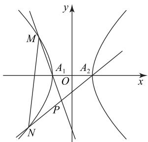

# 双曲线中三类核心题型的求解策略探究

赵一娟

(山东省聊城市水城中学)

与双曲线相关的问题是考查解析几何知识及其运用的典型题目,也是区分度较强的重点考题,有许多同学会在解答问题中出现丢分现象.为此,本文列举了三类考查频率较高的综合题型,以期通过对问题的分析与点评,揭示问题本质、阐述解题要点.

# 1 定点问题消参数是关键

例1 已知 $A, B$ 分别是双曲线 $C: \frac{x^2}{4} - y^2 = 1$ 的左、右顶点， $G$ （异于 $A,B)$ 在该双曲线上.

（1）设直线 GA, GB 的斜率分别是 $k_{1}, k_{2}$ ，求证： $k_{1}k_{2}$ 为定值；  
(2) 过点 $P(4,0)$ 作直线 l 与椭圆 $\frac{x^{2}}{4} + y^{2} = 1$ 相交于 D, E, 直线 AD, AE 与 C 的另一个交点分别是 M, N. 试问直线 MN 是否经过定点, 若是, 求出该定点; 若不是, 说明理由.

(1) 由双曲线 C 的方程可得 A(-2,0),

$B(2,0)$ . 设点 $G(x_0, y_0)$ , 则 $\frac{x_0^2}{4} - y_0^2 = 1$ , 于是

$$
k _ {1} k _ {2} = \frac {y _ {0}}{x _ {0} + 2} \cdot \frac {y _ {0}}{x _ {0} - 2} = \frac {y _ {0} ^ {2}}{x _ {0} ^ {2} - 4} = \frac {\frac {x _ {0} ^ {2}}{4} - 1}{x _ {0} ^ {2} - 4} = \frac {1}{4}.
$$

(2) 直线 MN 过定点.

由已知易知过点 $P$ 的直线斜率存在且不为0，直线 $AD, AE$ 的斜率存在且不为0，设 $AD, AE$ 的方程分别为 $x = t_1y - 2$ 和 $x = t_2y - 2$ ，将直线 $x = t_1y - 2$ 与椭圆 $\frac{x^2}{4} + y^2 = 1$ 联立，消去 $x$ 得 $(t_1^2 + 4)y^2 - 4t_1y = 0$ ，解得 $y_D = \frac{4t_1}{t_1^2 + 4}$ ，则 $x_D = \frac{2t_1^2 - 8}{t_1^2 + 4}$ ，即 $D\left(\frac{2t_1^2 - 8}{t_1^2 + 4},\frac{4t_1}{t_1^2 + 4}\right)$ .同理，可得 $E\left(\frac{2t_2^2 - 8}{t_2^2 + 4},\frac{4t_2}{t_2^2 + 4}\right)$ ，所以

$$
\begin{array}{l} \overrightarrow {P D} = \left(\frac {- 2 t _ {1} ^ {2} - 2 4}{t _ {1} ^ {2} + 4}, \frac {4 t _ {1}}{t _ {1} ^ {2} + 4}\right), \\ \overrightarrow {P E} = \left(\frac {- 2 t _ {2} ^ {2} - 2 4}{t _ {2} ^ {2} + 4}, \frac {4 t _ {2}}{t _ {2} ^ {2} + 4}\right). \\ \end{array}
$$

又 P, D, E 三点共线，于是 $\overrightarrow{PD}, \overrightarrow{PE}$ 共线，则

$$
\frac {- 2 t _ {2} ^ {2} - 2 4}{t _ {2} ^ {2} + 4} \times \frac {4 t _ {1}}{t _ {1} ^ {2} + 4} - \frac {- 2 t _ {1} ^ {2} - 2 4}{t _ {1} ^ {2} + 4} \times \frac {4 t _ {2}}{t _ {2} ^ {2} + 4} = 0,
$$

故 $t_{1}t_{2}=12.$

设 $M(x_{1},y_{1}), N(x_{2},y_{2})$ ，且直线 MN 的斜率存在，设直线 MN 的方程为 $y=kx+m$ ，于是 $t_{1}t_{2}=\frac{x_{1}+2}{y_{1}}\cdot\frac{x_{2}+2}{y_{2}}=12$ ，所以

$$
\begin{array}{l} (x _ {1} + 2) (x _ {2} + 2) = 1 2 y _ {1} y _ {2} = \\ 1 2 (k x _ {1} + m) (k x _ {2} + m), \tag {①} \\ \end{array}
$$

将直线 $y=kx+m$ 与双曲线 $\frac{x^{2}}{4}-y^{2}=1$ 联立，消去 y 得 $(1-4k^{2})x^{2}-8kmx-4m^{2}-4=0$ ，由题意可知 $1-4k^{2}\neq0,\Delta>0$ ，则

$$
x _ {1} + x _ {2} = \frac {8 m k}{1 - 4 k ^ {2}}, x _ {1} x _ {2} = \frac {- 4 m ^ {2} - 4}{1 - 4 k ^ {2}},
$$

代入式①化简得 $(m+k)(m-2k)=0$ . 当 m=-k 时，直线 MN 的方程为 $y=kx+m=k(x-1)$ ，经定点 $(1,0)$ ，符合题意；当 m=2k 时， $y=kx+m=k(x+2)$ ，过定点 $(-2,0)$ ，经画图检验不符合题意，所以直线 MN 过定点 $(1,0)$ .

过定点问题的一般处理方法如下:首先用参数将动直线(曲线)的方程表示出来,然后根

据其他条件设法消去其他参数,在式子只含有一个参数的情况下,根据特定情形判断直线是否过定点.本题抓住了三点共线的特点,经过推理运算,建立参数 m,k 的关系进行求解.

# 2 定直线问题需抓住有关方程的整体变换

例 2 （2023 年新高考Ⅱ卷 21）已知双曲线 C 的中心为坐标原点,左焦点为 $(-2\sqrt{5},0)$ ,离心率为 $\sqrt{5}$ .

(1) 求 C 的方程;

(2) 记 C 的左、右顶点分别为 $A_{1}, A_{2}$ ，过点 $(-4, 0)$ 的直线与 C 的左支交于 M, N 两点，M 在第二象限，直线 $MA_{1}$ 与 $NA_{2}$ 交于点 P。证明：点 P 在定直

线上.

(1) $\frac{x^2}{4} - \frac{y^2}{16} = 1$ (求解过程略).

（2）如图1所示，由（1）可得 $A_{1}(-2,0), A_{2}(2,0)$ ，设 $M(x_{1},y_{1}), N(x_{2},y_{2})$ ，显然直线 $MN$ 的斜率不为0，设直线 $MN$ 的方程为 $x = my - 4$ ，与方程 $\frac{x^2}{4} - \frac{y^2}{16} = 1$ 联立，消去 $x$ 可得

$$
(4 m ^ {2} - 1) y ^ {2} - 3 2 m y + 4 8 = 0,
$$

易知 $4m^{2} - 1 \neq 0, \Delta > 0$ ，于是有 $y_{1} + y_{2} = \frac{32m}{4m^{2} - 1}$ ， $y_{1}y_{2} = \frac{48}{4m^{2} - 1}$ ，又直线 $MA_{1}$ 的方程为 $y = \frac{y_{1}}{x_{1} + 2}(x + 2)$ ，直线 $NA_{2}$ 的方程为 $y = \frac{y_{2}}{x_{2} - 2}(x - 2)$ ，将直线 $MA_{1}$ 的方程与直线 $NA_{2}$ 的方程联立可得

$$
\frac {x + 2}{x - 2} = \frac {y _ {2} (x _ {1} + 2)}{y _ {1} (x _ {2} - 2)} = \frac {y _ {2} (m y _ {1} - 2)}{y _ {1} (m y _ {2} - 6)} =
$$

$$
\frac {m y _ {1} y _ {2} - 2 \left(y _ {1} + y _ {2}\right) + 2 y _ {1}}{m y _ {1} y _ {2} - 6 y _ {1}} =
$$

$$
\frac {m \cdot \frac {4 8}{4 m ^ {2} - 1} - 2 \cdot \frac {3 2 m}{4 m ^ {2} - 1} + 2 y _ {1}}{m \cdot \frac {4 8}{4 m ^ {2} - 1} - 6 y _ {1}} = - \frac {1}{3},
$$

则 $x = -1$ ，即 $x_{P} = -1$ ，据此可得点 $P$ 在定直线 $x = -1$ 上运动.

text_image

y
M
A₁ A₂
O
x
P
N

图1

# 点评

求解关于双曲线中的定直线问题时,在利用参数将满足题设条件的直线方程设出后,再求出两条直线的交点所满足的关系式,然后根据参数之间的关系确定此点能否在定直线上,其中根与系数的关系是简化运算、优化解题的关键.

# 3 定值问题应该利用好特定条件

例 3 已知双曲线 C 的中心为坐标原点,焦点在坐标轴上，且点 $A(-\sqrt{3},0),B(0, - 2\sqrt{3}),D(2,1)$ 三

个点中有且仅有两点在双曲线 C 上.

(1) 求 C 的标准方程;

(2) 直线 l 交 C 于 y 轴右侧两个不同的点 E (E 在第一象限), F, 连接 DE, DF 分别交直线 AB 于点 G, H. 若直线 DE 与直线 DF 的斜率互为相反数, 证明: $\left|\frac{GH}{EF}-\frac{FH}{DF}\right|$ 为定值.

# 解析

(1) $\frac{x^2}{3} - \frac{y^2}{3} = 1$ (求解过程略).

(2) 不妨设 $E(x_{1}, y_{1}), F(x_{2}, y_{2})$ ，则 $x_{1} \neq 2, x_{2} \neq 2$ ，且容易判断直线 $EF$ 的斜率存在，所以可设直线 $EF$ 的方程为 $y = kx + m$ ，与双曲线方程 $\frac{x^2}{3} - \frac{y^2}{3} = 1$ 联立，消去 $y$ 并化简得 $(1 - k^2)x^2 - 2kmx - m^2 - 3 = 0$ ，由题意可知 $1 - k^2 \neq 0, \Delta > 0$ ，于是有 $x_{1} + x_{2} = \frac{2km}{1 - k^2}, x_{1}x_{2} = \frac{-m^2 - 3}{1 - k^2}$ . 因为直线 $DE$ 与直线 $DF$ 的斜率互为相反数，所以 $k_{DE} + k_{DF} = 0$ ，则 $\frac{y_1 - 1}{x_1 - 2} + \frac{y_2 - 1}{x_2 - 2} = 0$ ，即

$$
\frac {k x _ {1} + m - 1}{x _ {1} - 2} + \frac {k x _ {2} + m - 1}{x _ {2} - 2} = 0,
$$

故

$$
2 k x _ {1} x _ {2} + (- 2 k + m - 1) \left(x _ {1} + x _ {2}\right) - 4 (m - 1) = 0,
$$

即

$$
2 k ^ {2} + (m + 3) k + 2 (m - 1) = 0,
$$

即 $(k+2)(2k+m-1)=0$ . 当 $2k+m-1=0$ 时, m=1-2k, 直线 EF 的方程为 $y=k(x-2)+1$ , 过 D(2,1), 不符合题意, 舍去, 故 k=-2. 此时 $l \parallel AB$ , 即 $EF \parallel GH$ , 则 $\triangle DEF \sim \triangle DGH$ , 所以 $\frac{GH}{EF} = \frac{DH}{DF}$ , 故

$$
\left| \frac {G H}{E F} - \frac {F H}{D F} \right| = \left| \frac {G H}{E F} - \frac {D H - D F}{D F} \right| =
$$

$$
\left| \frac {G H}{E F} - \frac {D H}{D F} - 1 \right| = 1
$$

为定值.

# 点评

定值问题的求解有两种思路:其一是将所求式子用参数表示出来,然后利用条件化简转化式子,使之为一个定值;其二是通过确定特定条件下的参数值,然后利用它判断待确定的式子是否为定值.本题属于第二种情况.

(完)