# 变式探究:空间几何体的表面积与体积

# 福建省宁化第一中学 王宁华

空间几何体的表面积与体积,是立体几何中经常考查的一类重要题型,考查学生的空间想象能力和数学运算能力.以一道母题为例,从三个方面进行变式探究,以帮助学生形成思路方法,促进学生思维进阶.

# 1 母题再现

某组合体的三视图如图 1 所示, 已知图中圆的半径是 1, 且三角形是等腰三角形, 它的腰长是 $\sqrt{5}$ , 试问这一组合体的表面积和体积分别是多少?

解析:根据题目给出的组合体的三视图,不难判断该组合体的结构. 它是由上、下两个部分组成的, 上部是一个高为 2, 底面直径是 2 的圆锥体, 下部是一个直径为 2 半球体.

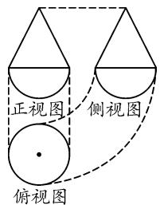

text_image

正视图
侧视图
俯视图

图 1

于是，该组合体的表面积 $S = S_{圆锥侧} + S_{半球} = \pi \times 1 \times \sqrt{5} + \frac{1}{2} \times (4\pi \times 1^{2}) = (2 + \sqrt{5})\pi;$

该组合体的体积 $V = V_{圆锥} + V_{半球} = \frac{1}{3}\pi \times 1^{2} \times 2 + \frac{1}{2} \times \left( \frac{4}{3}\pi \times 1^{3} \right) = \frac{4\pi}{3}$ .

评注: 利用数形结合的方法分析、解决此类表面积和体积的计算问题, 关键是要认真观察题目所给的三视图, 判断对应几何体具体的形状以及相关长度.

# 2 变式探究

# 2.1 类型一:考查与球有关的几何体的表面积与体积

变式 1 某几何体的三视图如图 2 所示, 则其表面积为 \_\_\_\_, 体积为 \_\_\_\_.

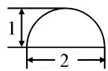  
正视图

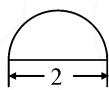  
侧视图

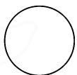  
俯视图  
图 2

解析: 结合三视图可知, 该几何体是一个半球体, 且对应球体的半径为 1. 故表面积 $S=\frac{1}{2}\times(4\pi\times1^{2})+\pi\times1^{2}=3\pi$ , 体积 $V=\frac{1}{2}\times\frac{4}{3}\pi\times1^{3}=\frac{2}{3}\pi$ .

评注:求解本题的关键是根据三视图,准确获得该几何体是一个半球体及其半径.

变式 2 如图 3 所示, 给出了一个无盖金属器皿的三视图, 已知图中的三个正方形的边长均为 2, 且图中的两条虚线均是半圆, 试计算这个金属器皿的表面积和体积.

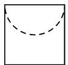  
正视图

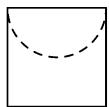  
侧视图

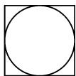  
俯视图  
图3

解析: 结合三视图可知, 该无盖金属器皿是由棱长为 2 的正方体被挖去一个半球体而形成的几何体, 其中半球体的底面圆是正方体的上底面正方形的内切圆.

又观察到这个金属器皿的表面积由两部分组成：一部分是正方体的表面积，且除去一个正方形的内切圆的面积；另一部分是半球的表面积。

因此，可得这个金属器皿的表面积

$$
S = (6 \times 2 \times 2 - \pi \times 1 ^ {2}) + \frac {1}{2} \times 4 \pi \times 1 ^ {2} = 2 4 + \pi ;
$$

这个金属器皿的体积为

$$
V = V _ {\text {正方体}} - V _ {\text {半球}} = 2 ^ {3} - \frac {1}{2} \times \left(\frac {4}{3} \pi \times 1 ^ {3}\right) = 8 - \frac {2 \pi}{3}.
$$

评注:本题的关键是判断这个金属器皿是一个“挖体”,即正方体被挖去了一个半球,得出正方体的棱长和半球的半径.

变式 3 已知正三棱柱 $ABC-A^{\prime}B^{\prime}C^{\prime}$ 的正(主)视图和侧(左)视图如图 4 所示, 求此正三棱柱的外接球的表面积和体积.

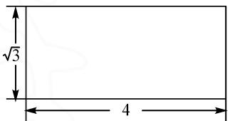

text_image

√3
4

正（主）视图

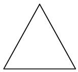  
侧（左）视图  
图4

解析:根据三视图可知,该三棱柱倒放,高为4,底面三角形边长为2.易求得其外接球的半径为 $\frac{4\sqrt{3}}{3}$ .故

所求外接球的表面积 $S=4\pi r^{2}=4\pi\times\left(\frac{4\sqrt{3}}{3}\right)^{2}=\frac{64}{3}\pi,$ 体积 $V=\frac{4}{3}\pi r^{3}=\frac{4}{3}\pi\times\left(\frac{4\sqrt{3}}{3}\right)^{3}=\frac{256\sqrt{3}}{27}\pi.$

评注:本题需要先准确判断对应几何体是一个“倒放”的三棱柱以及相关数据;其次需要巧作辅助线,灵活求解其外接球半径.

# 2.2 类型二: 考查与圆锥有关的几何体的表面积与体积

变式 4 如图 5 所示, 给出的是一个几何体的三视图, 那么这个几何体的表面积 = \_\_\_\_, 体积 = \_\_\_\_.

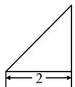  
正视图

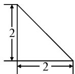  
侧视图

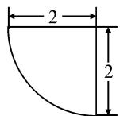  
俯视图  
图5

解析:如图6所示,根据题设三视图易知,这个几何体是一个圆锥的四分之一,且圆锥底面圆半径为2,高为2,母线长为 $2\sqrt{2}$ .因此,可得这个几何体的表面积为 $S=2\left(\frac{1}{2}\times2\times2\right)+\frac{1}{4}(\pi\times2^{2})+\frac{1}{4}(\pi\times2\times2\sqrt{2})=$

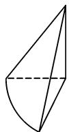  
图6

$4+\pi+\sqrt{2}\pi$ ，这个几何体的体积 $V=\frac{1}{4}V_{圆锥}=\frac{1}{4}\times\left(\frac{1}{3}\pi\times2^{2}\times2\right)=\frac{2}{3}\pi.$

评注:求解本题的关键是能够由给出的三视图判断出对应几何体是一个圆锥的四分之一以及相关数据.

变式 5 已知有一个直角边长是 2 的等腰直角三角形, 现将它绕着它的斜边所在的直线作旋转运动, 旋转一周后可形成一个曲面围成的几何体, 试求这个几何体的表面积与体积.

解析:由题意知,该等腰直角三角形的斜边长为 $2\sqrt{2}$ , 斜边上的高为 $\sqrt{2}$ , 所得几何体为同底等高的两个圆锥的组合体, 如图7所示. 因为每个圆锥的母线长为 2, 高和底面圆半径均为 $\sqrt{2}$ , 所以该几何体的表面积 $S = 2S_{圆锥侧} = 2 \times (\pi \times \sqrt{2} \times 2) = 4\sqrt{2}\pi$ , 体积

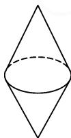  
图 7

$$
V = 2 V _ {\text {圆锥}} = 2 \times \frac {1}{3} \pi \times (\sqrt {2}) ^ {2} \times \sqrt {2} = \frac {4 \sqrt {2} \pi}{3}.
$$

评注:本题求解的关键是结合题意准确画出该几何体,明确其是同底等高的两个圆锥的组合体,由此求解该几何体的表面积和体积.

# 2.3 类型三: 考查与棱柱或棱锥有关的几何体的表面积与体积

变式 6 已知圆柱甲的底面积为 $S_{1}$ ，体积为 $V_{1}$ ；圆柱乙的底面积为 $S_{2}$ ，体积为 $V_{2}$ 。如果这两个圆柱的侧面积相等，且 $\frac{S_{1}}{S_{2}} = \frac{9}{4}$ ，那么 $\frac{V_{1}}{V_{2}}$ 的值为 \_\_\_\_.

评注:本题比较简单,解题关键是灵活运用圆柱的侧面积公式、底面积公式以及题设条件,准确计算甲、乙两个圆柱的高的比值.

变式 7 已知图 8 是某几何体的三视图(单位: cm), 求这个几何体的表面积和体积.

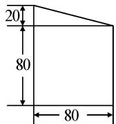  
正视图

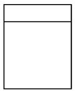  
侧视图  
图 8

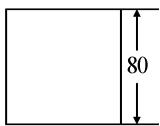  
俯视图

评注:解答本题的难点在于,准确分析得到该组合体的上面是一个“倒放的直三棱柱”.

变式 8 如图 9 所示, 图(1)是边长为 2 的正方形薄铁片, 先把图中的阴影部分裁下来, 再把余下的四个全等的等腰三角形薄铁片焊接成图(2)所示的正四棱锥形容器.

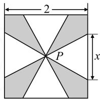

text_image

2
P
x

(1)

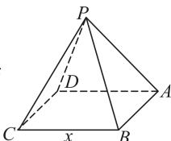

text_image

P
D
A
C
x
B

(2)

  
扫码看变式 6\~8 解析  
图9

(1)设 x 为等腰三角形的底边长,求这个正四棱锥容器的侧面积 $f(x)$ 的函数解析式;  
(2) 当 x=1 时, 求这个正四棱锥容器的体积 V.

评注:本题既考查了学生的空间想象思维能力,又考查了学生对正四棱锥的“斜高”和“高”的准确理解与认识(此为易错点),同时也考查了学生的数学运算求解能力.

一般地,求解简单组合体、截体以及挖体的表面积时,需要先认真观察涉及到的表面具体有哪些部分(注意重复与遗漏),然后再加以计算求解;而求解简单组合体、截体以及挖体的体积时,需要灵活运用“分割与组合思想”.这种通过对母题及变式的探究解决一类问题的教学方式,有利于较好地培养学生直观想象与数学运算核心素养,不断提升思维品质.Z