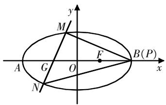
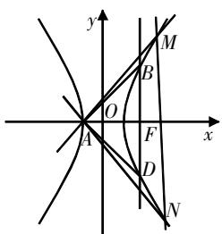

# 圆锥曲线中

# “斜率和积+韦达定理”的综合探究

崔绪军 江苏省淮州中学 223300

[摘 要] “斜率和积+韦达定理”在圆锥曲线综合性问题中的应用极为广泛,其有利于学生构建解题思路. 在实际教学中,教师应开展解题指导,帮助学生在分析实例的基础上,掌握应用技巧,以解决具体问题.

[关键词] 圆锥曲线;斜率和积;韦达定理;整体代换

# 探究综述

圆锥曲线问题是高中数学复习备考探究的重点,涉及直线与圆锥曲线的交叉综合,其基本求解步骤为:联立直线与圆锥曲线的方程,进而整合并构建参数方程. 在问题转化构建中,斜率公式和韦达定理的应用十分广泛,也常用于条件的整合,便于后续的整体代入. 灵活运用这个求解思路,可以降低解题难度,提高解题效率.

对于一些复杂的圆锥曲线问题，可以通过综合斜率公式和韦达定理来构建代数式条件。这种综合方法的常用形式为“斜率和积+韦达定理”，它在处理与斜率相关的问题时尤为有用，例如直线斜率和的定值问题、直线斜率积的定值问题，以及与斜率相关的其他运算等。在复习教学中,教师可以将“斜率和积+韦达定理”这一方法整合成模型公式,并通过具体问题的解决来帮助学生加深理解和应用.

# 教学推导

在讲授“斜率和积+韦达定理”的应用时,教师需要结合圆锥曲线的常见问题,抓住其核心特征,从一般条件出发,构建解题思路.与斜率相关的圆锥曲线问题中,最常见的是斜率和或积的构造,其主要特征是“一定点+两动点”.另外,定点可能在坐标轴上或在一般位置上.下面以定点在坐标轴上这种情形来推导并整合“斜率和积+韦达定理”这个方法.

设定点的坐标为 $P(0,t)$ ，在椭圆上的动点为 $A(x_{1},y_{1}),B(x_{2},y_{2})$ ，直线AB的斜率存在，设定为 $y=kx+m$ 或x=my+n.

对于直线 $PA$ 和 $PB$ 的斜率之积 $k_{PA}\cdot k_{PB} = \frac{y_1 - t}{x_1}\cdot \frac{y_2 - t}{x_2} = \frac{y_1y_2 - t(y_1 + y_2) + t^2}{x_1x_2},$

由于该式中存在韦达定理的结构,因此无需解点,可以直接结合韦达定理进行整体代换.

$$
\begin{array}{r l} & \text {对于直线PA和PB的斜率之和} k _ {P A} + \\ & k _ {P B} = \frac {y _ {1} - t}{x _ {1}} + \frac {y _ {2} - t}{x _ {2}} = \frac {x _ {1} y _ {2} + x _ {2} y _ {1} - t (x _ {1} + x _ {2})}{x _ {1} x _ {2}}, \end{array}
$$

观察其结构,需要处理 $x_{1}y_{2}+x_{2}y_{1}$ ,因此代入直线AB的方程,得 $x_{1}y_{2}+x_{2}y_{1}=2kx_{1}x_{2}+m(x_{1}+x_{2})$ ,进一步可得 $k_{PA}+k_{PB}=\frac{x_{1}y_{2}+x_{2}y_{1}-t(x_{1}+x_{2})}{x_{1}x_{2}}=2k+\frac{(m-t)(x_{1}+x_{2})}{x_{1}x_{2}}$ ,

后续直接结合韦达定理进行整体代换.

而对于与斜率相关的其他运算，
则需要进行适当的变形处理,再结合韦达定理进行整体代换. 以 $\frac{1}{k_{PA}} + \frac{1}{k_{PB}}$ 为例, 通过变形和整合得 $\frac{1}{k_{PA}} + \frac{1}{k_{PB}} = \frac{x_1}{y_1 - t} + \frac{x_2}{y_2 - t} = \frac{x_1y_2 + x_2y_1 - t(x_1 + x_2)}{(y_1 - t)(y_2 - t)}$ , 观察其结构, 需要处理 $x_1y_2 + x_2y_1$ , 因此代入直线 $AB$ 的方程, 得 $x_1y_2 + x_2y_1 = (my_1 + n)y_2 + (my_2 + n)y_1 = 2my_1y_2 + n(y_1 + y_2)$ .

上文对三类斜率问题进行了综合探究,构建了“斜率和积+韦达定理”的转化方法. 在教学实践中,笔者建议更多关注整合推导过程,指导学生自行转化,从而提升他们的运算能力.

# 应用指导

完成整合推导后,教师围绕“斜率和积+韦达定理”的三种情形精心设计问题,并引导学生应用推导出来的方法求解.

# 1. 斜率之和的探究

例1 已知椭圆 $C:\frac{x^{2}}{a^{2}}+\frac{y^{2}}{b^{2}}=1(a>b>0)$ 的右焦点F在直线 $x+2y-1=0$ 上，A和B分别为C的左、右顶点，且 $|AF|=3|BF|$ .

(1)求C的标准方程;

(2)已知 $P(2,0)$ ，是否存在过点 $G(-1,0)$ 的直线l交C于M,N两点，使得直线PM,PN的斜率之和等于-1?若存在，求出l的方程；若不存在，请说明理由.

思路引导 本例题的第(2)问探究是否存在直线l使得两直线的斜率之和为定值,显然需要构建“斜率之和+韦达定理”的转换方法.

在具体求解过程中,首先绘制图形,讨论直线的两种情形(斜率为0和斜率存在且不为0),然后联立方程,运用韦达定理提取代数式条件,接着结合直线方程构建斜率之和,并将韦达定理条件整体代入.

过程指导 第(1)问为基本问题, 简答, 求得椭圆C的标准方程为 $\frac{x^{2}}{4}+\frac{y^{2}}{3}=1$ .

第(2)问为涉及斜率之和的综合问题,按照上述思路进行解析. 整合题设条件,绘制如图1所示的图形,其整体结构由三条直线与一个椭圆相交构成.

text_image

y
M
F
A G O B(P)
x
N

图1

当直线l的斜率为0时,不满足 $k_{PM}+k_{PN}=-1$ 的条件,舍去.当直线l的斜率存在且不为0时,设直线l的方程为x=my-1,与椭圆的两个交点为 $M(x_{1},y_{1})$ 和 $N(x_{2},y_{2})$ .联立直线l与椭圆的方程,并整理得 $(3m^{2}+4)y^{2}-6my-9=0$ .由于它们有两个交点,因此 $\Delta=36m^{2}-4\cdot(3m^{2}+4)\cdot(-9)=144m^{2}+144>0$ .由韦达定理可以得到 $y_{1}+y_{2}=\frac{6m}{3m^{2}+4},y_{1}y_{2}=-\frac{9}{3m^{2}+4}$ .由斜率公式可得 $k_{PM}+k_{PN}=$ $\frac{y_{1}}{x_{1}-2}+\frac{y_{2}}{x_{2}-2}=\frac{2my_{1}y_{2}-3(y_{1}+y_{2})}{(my_{1}-3)(my_{2}-3)}$ ,结合韦达定理可得 $\frac{2my_{1}y_{2}-3(y_{1}+y_{2})}{m^{2}y_{1}y_{2}-3m(y_{1}+y_{2})+9}=$ $\frac{2m\cdot\frac{-9}{3m^{2}+4}-3\cdot\frac{6m}{3m^{2}+4}}{m^{2}\cdot\frac{-9}{3m^{2}+4}-3m\cdot\frac{6m}{3m^{2}+4}+9}$ ,化简得 $k_{PM}+k_{PN}=-m$ .若 $k_{PM}+k_{PN}=-1$ ,解得m=1.因此,存在满足条件的直线l,其方程为 $x-y+1=0$ .

解后反思 上述问题是关于斜率之和的探究题,其解析的关键在于“斜率之和”与“韦达定理”的整合. 在解题时,需要注意两个要点:一是斜率公式的应用;二是结合韦达定理进行整体代换. 在求解过程中,学生必须化简复杂的代数式,并从整体视角审视问题,以提取其中的共性代数式.

# 2. 斜率之积的探究

例2 双曲线 $C:\frac{x^{2}}{a^{2}}-\frac{y^{2}}{b^{2}}=1(a>0,b>0)$ 的左顶点为A,焦距为4,过右焦点F作垂直于x轴的直线交双曲线C于B,D两点,且 $\triangle ABD$ 是直角三角形.

(1)求双曲线C的标准方程;

(2) M, N 是 C 右支上的两动点, 设直线 AM, AN 的斜率为 $k_{1}, k_{2}$ , 若 $k_{1} \cdot k_{2} = -2$ , 试问: 直线 MN 是否经过定点? 证明你的结论.

思路引导 本例题的第(2)问探究直线是否经过定点,破解难度较高,需要通过分析斜率之积的条件来确定直线方程,再讨论其是否经过定点.在处理转化的过程中,需要重视“斜率之积”与“韦达定理”的整合应用.

在具体求解时,学生需要仔细解读题目条件,关注直线与双曲线的相交关系,留意直角三角形的特征,绘制出直观图形,然后联立方程,构建解题思路.

过程指导 第(1)问为基本问题，简答,可得双曲线C的标准方程为 $x^{2}-\frac{y^{2}}{3}=1$ .

第(2)问探究直线是否经过定点,需要联立方程,利用韦达定理整合转化斜率之积的条件. 结合题目条件,绘制出如图2所示的图形,特别要注意构建Rt△ABD.

解析题目条件, 可知直线MN的斜率不为0, 故设直线MN的方程为 $x=my+n, M(x_{1},y_{1}), N(x_{2},y_{2})$ .

text_image

y
M
B
O
A
F
D
x
N

图2

联立直线MN与双曲线的方程，并整理得 $(3m^{2}-1)y^{2}+6mny+3(n^{2}-1)=0$ 。由于它们有两个交点，因此 $\Delta=36m^{2}n^{2}-12(3m^{2}-1)(n^{2}-1)>0$ ，即 $3m^{2}+n^{2}-1>0$ 。由韦达定理可得 $y_{1}+y_{2}=-\frac{6mn}{3m^{2}-1},y_{1}y_{2}=\frac{3(n^{2}-1)}{3m^{2}-1}$ 。

已知点 $A(-1,0)$ , 可得直线 $AM$ , $AN$ 的斜率分别为 $k_{1} = \frac{y_{1}}{x_{1} + 1}, k_{2} = \frac{y_{2}}{x_{2} + 1}$ . 因为 $k_{1} \cdot k_{2} = -2$ , 所以 $\frac{y_{1}}{x_{1} + 1} \cdot \frac{y_{2}}{x_{2} + 1} = -2$ , 即 $(2m^{2} + 1)y_{1}y_{2} + 2m(n + 1)(y_{1} + y_{2}) + 2(n + 1)^{2} = 0$ . 结合韦达定理所得的结论, 可得 $(2m^{2} + 1) \cdot \frac{3(n^{2} - 1)}{3m^{2} - 1} - 2m(n + 1) \cdot \frac{6mn}{3m^{2} - 1} + 2(n + 1)^{2} = 0$ , 化简得 $n^{2} - 4n - 5 = 0$ , 解得 $n = 5$ 或 $n = -1$ .

因为M和N是双曲线C右支上的两动点,所以n>0,所以n=5. 因此,直线MN的方程为 $x=my+5$ ,可得直线MN恒过定点(5,0).

解后反思 上述问题是关于斜率之积与直线过定点的探究题,破解难度较高,其解析的关键在于“斜率之积”与“韦达定理”的整合. 求解此题,需要合理设定直线方程,接着分析直线的斜率,然后进行整体代换,最后讨论所得的解是否合理. 对于直线过定点的问题,其基本求解思路为整理变形,论证直线所经过的定点与直线方程中的参数无关.

# 3. 与斜率运算的探究

例3 已知椭圆 $E:\frac{x^{2}}{a^{2}}+\frac{y^{2}}{b^{2}}=1(a>b>$ 0) 经过点 $A\left(1, \frac{3}{2}\right)$ , 离心率为 $\frac{1}{2}$ . 过点 $B(0,2)$ 的直线 $l$ 与椭圆 $E$ 相交于不同的两点 $M, N$ .

(1)求椭圆E的方程;  
(2)设直线AM和直线AN的斜率分别为 $k_{AM}$ 和 $k_{AN}$ ，求 $\frac{1}{k_{AM}}+\frac{1}{k_{AN}}$ 的值.

思路引导 本例题的第(2)问求解的是与斜率相关的代数值,其特殊之处在于构建斜率公式时需要进行适当的变形处理,然后结合韦达定理进行整体代换,这属于“斜率运算式+韦达定理”类型的题目.

过程指导 第(1)问求解的是椭圆E的方程,简答,可得椭圆 $E:\frac{x^{2}}{4}+\frac{y^{2}}{3}=1$ .

第(2)问求解的是与斜率相关的代数值,参照上述解题思路来构建“斜率运算式”与“韦达定理”的整合过程.

情形1: 若直线l的斜率存在, 设l的方程为 $y=kx+2$ , 设 $M(x_{1},y_{1}), N(x_{2},y_{2})$ . 联立直线l与椭圆E的方程, 消去y整理得 $(4k^{2}+3)x^{2}+16kx+4=0$ ; 消去x整理得 $(4k^{2}+3)y^{2}-12y+12-12k^{2}=0$ . 根据韦达定理可得 $x_{1}+x_{2}=\frac{-16k}{4k^{2}+3}$ , $x_{1}x_{2}=\frac{4}{4k^{2}+3}$ , $y_{1}+y_{2}=\frac{12}{4k^{2}+3}$ , $y_{1}y_{2}=\frac{12-12k^{2}}{4k^{2}+3}$ .

根据直线的斜率公式构建运算式, 可得 $\frac{1}{k_{AM}} + \frac{1}{k_{AN}} = \frac{x_{1} - 1}{y_{1} - \frac{3}{2}} + \frac{x_{2} - 1}{y_{2} - \frac{3}{2}} = \frac{x_{1} y_{2} + x_{2} y_{1} - \frac{3}{2} (x_{1} + x_{2}) - (y_{1} + y_{2}) + 3}{(y_{1} - \frac{3}{2})(y_{2} - \frac{3}{2})}$ . 结

合韦达定理所得的结论,可得 $\frac{1}{k_{AM}}+$ $\frac{1}{k_{AN}}=\frac{12k^{2}-3}{\frac{3}{4}-3k^{2}}=-4.$

情形2:若直线l的斜率不存在,则 $M(0,\sqrt{3})$ , $N(0,-\sqrt{3})$ ,此时 $\frac{1}{k_{AM}}+\frac{1}{k_{AN}}=-4.$

综上可知, $\frac{1}{k_{AM}}+\frac{1}{k_{AN}}=-4.$

解后反思 在解决与斜率相关的运算式求值问题时,同样运用了韦达定理和整体代换的方法.这类问题对学生的计算能力提出了较高的要求,学生需要全面把握代数式的结构特征,并恰当地运用整体代换的技巧.

# 写在最后

“斜率和积+韦达定理”在圆锥曲线综合性问题中的应用极为广泛.对“斜率和积”进行整合与变形,结合韦达定理,采用整体代换的方法,可以显著提升数学问题的解决效率.在教学中,笔者建议遵循以下思路指导流程:梳理问题→提取条件→绘制图形→整合变形→整体代换→推导破解.即先从问题条件入手,构建直观图形,再根据“斜率和积”与“韦达定理”的整合来构建解题思路.

该类问题的解析特点极为鲜明，教师可以指导学生构建解题模版，并按照合理的思路流程进行分析和推理。教师可将解题过程分为四步：①解析问题，绘制图形；②设定条件，联立并整合方程；③“斜率和积+韦达定理”的整合转化；④简化算式，论证推理。

此外,鉴于圆锥曲线对学生的运算能力的要求较高,教师需注意简算技巧的讲解,例如常用的设而不求、整体代换、对称转化等.引导学生从整体视角审视问题,注重解析过程中的细节,采用“先分析,后决策”的思路进行求解,从而提升学生的运算能力和解决问题的效率.