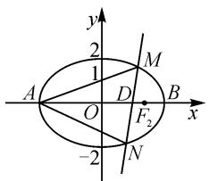
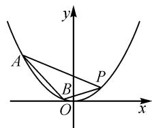

# 圆锥曲线中斜率和(积)的定值与定点问题

# 甘肃省临泽县第一中学 曹吉龙

摘要: 涉及圆锥曲线上的三角形应用问题, 是圆锥曲线综合应用问题中的一个重要情境. 结合三角形中对应两边的斜率之和(或积)为定值以及第三边的位置特征或斜率值, 借助典型实例进行剖析与应用, 归纳总结此类应用问题的基本类型与解题技巧, 助力数学教学与复习备考.

关键词: 圆锥曲线; 三角形; 直线; 斜率; 定值; 定点

直线与圆锥曲线的位置关系的综合应用问题中，经常涉及圆锥曲线上的三角形应用问题，是高考命题中的一个基本应用场景。特别是针对圆锥曲线上的三角形问题，结合三角形中相关边的斜率之和（或积），以及第三边的位置特征或斜率值，是其中比较特殊的圆锥曲线的定值或定点问题的一类典型应用，备受各方关注。本文中结合圆锥曲线上的三角形中各边的斜率之和（或积）以及相关的位置特征或斜率值的情况，就几类比较常见的设问方式与应用类型加以实例剖析，抛砖引玉。

# 1 一边过定点中的 $k_{1} + k_{2}$ 或 $k_{1} \cdot k_{2}$ 为定值

例 1 （2024 年湖南省娄底市高考数学四模试卷）已知椭圆 $C: \frac{x^{2}}{a^{2}} + \frac{y^{2}}{b^{2}} = 1 (a > b > 0)$ 的左、右顶点分别为 $A(-2\sqrt{2}, 0)$ , $B(2\sqrt{2}, 0)$ ，右焦点为 $F_{2}$ , O 为坐标原点，OB 的中点为 D (D 在 $F_{2}$ 的左方)， $|DF_{2}| = 2 - \sqrt{2}$ .

(1)求椭圆 C 的标准方程.

(2)设过点 $D$ 且斜率不为0的直线与椭圆 $C$ 交于 $M,N$ 两点，设直线 $AM,AN$ 的斜率分别是 $k_{1},k_{2}$ ，试问： $k_{1}\cdot k_{2}$ 是否为定值？若是，求出定值；若不是，请说明理由.

解析:(1) 易得 $a=2\sqrt{2}$ , $D(\sqrt{2},0)$ , $c-\sqrt{2}=2-\sqrt{2}$ , 解得 c=2.

所以 $b^{2}=a^{2}-c^{2}=8-4=4$ ，故椭圆 C 的标准方程为 $\frac{x^{2}}{8}+\frac{y^{2}}{4}=1$ .

(2)如图1,设过点D且斜率不为0的直线方程为 $x=ty+\sqrt{2}$ .

联立 $x=ty+\sqrt{2}$ 和 $\frac{x^{2}}{8}+\frac{y^{2}}{4}=1$ ,
消去参数 x 并整理得 $(t^{2}+2)y^{2}+$

text_image

y
2
M
1
A
O
D
B
x
F₂
-2
N

图 1

$$
2 \sqrt {2} t y - 6 = 0, \text {则} \Delta = 8 t ^ {2} + 2 4 (t ^ {2} + 2) = 3 2 t ^ {2} + 4 8 > 0.
$$

设点 $M(x_{1},y_{1}), N(x_{2},y_{2})$ ，则

$$
y _ {1} + y _ {2} = - \frac {2 \sqrt {2} t}{t ^ {2} + 2}, y _ {1} y _ {2} = - \frac {6}{t ^ {2} + 2}.
$$

所以，可得 $k_{1} \cdot k_{2} = \frac{y_{1}}{x_{1} + 2\sqrt{2}} \cdot \frac{y_{2}}{x_{2} + 2\sqrt{2}} =$

$$
\frac {y _ {1} y _ {2}}{(t y _ {1} + 3 \sqrt {2}) (t y _ {2} + 3 \sqrt {2})} = \frac {y _ {1} y _ {2}}{t ^ {2} y _ {1} y _ {2} + 3 \sqrt {2} t (y _ {1} + y _ {2}) + 1 8} =
$$

$$
\frac {- \frac {6}{t ^ {2} + 2}}{t ^ {2} \times \left(- \frac {6}{t ^ {2} + 2}\right) + 3 \sqrt {2} t \times \left(- \frac {2 \sqrt {2} t}{t ^ {2} + 2}\right) + 1 8} = - \frac {1}{6}.
$$

故 $k_{1} \cdot k_{2}$ 为定值 $-\frac{1}{6}$ .

点评:解决此类问题时,联立直线与圆锥曲线的方程,通过函数与方程的转化与应用,确定对应两交点的坐标参数的关系式,利用直线的斜率公式,借助三角形另两边斜率之和(或积)的代数式的构建与转化,为相应的定值判断或证明创造条件.

# 2 $k_{1} + k_{2}$ 或 $k_{1}\cdot k_{2}$ 为定值条件下的一边过定点

例 2 （2024 年山东省威海市高考数学一模试卷）
已知椭圆 $C: \frac{x^{2}}{4} + y^{2} = 1$ 的左、右顶点分别为 A, B, P 为 C 上任意一点（异于点 A, B），直线 AP, BP 分别交直线 $x = \frac{10}{3}$ 于 M, N 两点.

(1) 求证: $BM \perp BN$ .

(2)设直线 BM 交椭圆 C 于另一点 Q, 求证: 直线 PQ 恒过定点.

解析:(1)由题意知点 $A(-2,0)$ ，点 $B(2,0)$ 。设点 $P(x_{0},y_{0})$ ，则 $\frac{x_{0}^{2}}{4} + y_{0}^{2} = 1$ ，即 $y_{0}^{2} = 1 - \frac{x_{0}^{2}}{4}$ ，且 $k_{AM} =$

$$
\frac {y _ {0}}{x _ {0} + 2}, k _ {B P} = \frac {y _ {0}}{x _ {0} - 2}.
$$

于是可得直线 $AP$ 的方程为 $y = \frac{y_0}{x_0 + 2} (x + 2)$ 直线 $BP$ 的方程为 $y = \frac{y_0}{x_0 - 2} (x - 2)$ .

令 $x = \frac{10}{3}$ , 得 $y_{M} = \frac{16y_{0}}{3x_{0} + 6}, y_{N} = \frac{4y_{0}}{3x_{0} - 6}$ , 即点 $M\left(\frac{10}{3}, \frac{16y_{0}}{3x_{0} + 6}\right), N\left(\frac{10}{3}, \frac{4y_{0}}{3x_{0} - 6}\right)$ .

所以 $k_{BM} \cdot k_{BN} = \frac{\frac{16y_0}{3x_0 + 6}}{\frac{10}{3} - 2} \times \frac{\frac{4y_0}{3x_0 - 6}}{\frac{10}{3} - 2} = \frac{4y_0^2}{x_0^2 - 4} = \frac{4 - x_0^2}{x_0^2 - 4} = -1$ ，故 $BM \perp BN$ .

(2) 当直线 PQ 的斜率存在时, 设直线 PQ 的方程为 $y = kx + b$ , 点 $Q(x_{1}, y_{1})$ .

联立 $y = kx + b$ 和 $\frac{x^2}{4} + y^2 = 1$ ，消去参数 $y$ ，整理得 $(1 + 4k^2)x^2 + 8kbx + 4b^2 - 4 = 0$ ，则有 $x_1 + x_0 = -\frac{8kb}{1 + 4k^2}, x_1x_0 = \frac{4b^2 - 4}{1 + 4k^2}$ ，于是

$$
\begin{array}{c} y _ {1} y _ {0} = (k x _ {1} + b) (k x _ {0} + b) = k ^ {2} x _ {1} x _ {0} + k b (x _ {1} + x _ {0}) + \\ b ^ {2} = k ^ {2} \cdot \frac {4 b ^ {2} - 4}{1 + 4 k ^ {2}} - \frac {8 k ^ {2} b ^ {2}}{1 + 4 k ^ {2}} + b ^ {2} = \frac {b ^ {2} - 4 k ^ {2}}{1 + 4 k ^ {2}}. \end{array}
$$

所以 $k_{AM} \cdot k_{AN} = \frac{\frac{16y_0}{3x_0 + 6}}{\frac{10}{3} + 2} \times \frac{\frac{4y_0}{3x_0 - 6}}{\frac{10}{3} + 2} = \frac{y_0^2}{4(x_0^2 - 4)} = \frac{\frac{4 - x_0^2}{4}}{4(x_0^2 - 4)} = -\frac{1}{16}$ .

易知 A, Q, N 三点共线，则 $\frac{y_{0}}{x_{0}+2} \cdot \frac{y_{1}}{x_{1}+2} = -\frac{1}{16}$ ，即 $-16y_{1}y_{0} = x_{1}x_{0} + 2(x_{1} + x_{0}) + 4$ ，代入化简得 $(6k + 5b)(2k - b) = 0$ ，则 $b = -\frac{6}{5}k$ 或 b = 2k，则直线 PQ 的方程为 $y = kx - \frac{6}{5}k$ 或 $y = kx + 2k$ 。

$y=kx+2k$ 即为 $y=k(x+2)$ ，恒过点 A(-2,0)，不合题意，舍去； $y=kx-\frac{6}{5}k$ 即为 $y=k\left(x-\frac{6}{5}\right)$ ，恒过点 $\left(\frac{6}{5},0\right)$ .

当直线 PQ 的斜率不存在时, 由对称性得点 $M\left(\frac{10}{3}, \frac{4}{3}\right)$ , 由 A, P, M 三点共线得 $\frac{y_{0}}{x_{0}+2} = \frac{1}{4}$ . 又$x_{0}^{2}+4y_{0}^{2}=4$ ，则 $x_{0}=\frac{6}{5}(x_{0}=-2$ 舍去），此时直线 PQ 过点 $\left(\frac{6}{5},0\right)$ .

综上, 直线 PQ 恒过定点 $\left(\frac{6}{5}, 0\right)$ .

点评:解决此类问题时,联立直线与圆锥曲线的方程,同样通过函数与方程的转化与应用,确定对应两交点的坐标参数的关系式,结合直线的斜率公式,利用三角形的另两边斜率之和(或积)为定值来合理构建关系式,回归所设的直线方程,得以确定直线过定点及其相关的应用.

# $3 k_{1} + k_{2}$ 或 $k_{1} \cdot k_{2}$ 为定值条件下k为定值

例 3 [2023—2024 学年北京二中高二(下)期末数学练习试卷]如图 2 所示, 抛物线关于 y 轴对称, 它的顶点在坐标原点, 点 $P(2,1)$ , $A(x_{1},y_{1})$ , $B(x_{2},y_{2})$ 均在抛物线上.

text_image

y
A
B
P
O
x

图2

(1)求抛物线的方程;

(2) 若 $\angle APB$ 的平分线垂直于 y 轴, 求证: 直线 AB 的斜率为定值.

解析:(1)易得抛物线的方程为 $x^{2}=4y$ .

(2)由题意可知,直线 AP,BP 的倾斜角互补.

若 $AP \perp x$ 轴，此时直线 AP 与抛物线 $x^{2} = 4y$ 只有一个交点，不合题意，所以直线 AP 的斜率存在.

若直线 $AP \perp y$ 轴，则点 A, B 重合，不合题意.

所以直线 AP 的斜率存在且不为 0, 于是可得 $k_{AP}=$

$$
\frac {y _ {1} - 1}{x _ {1} - 2} = \frac {\frac {x _ {1} ^ {2}}{4} - 1}{x _ {1} - 2} = \frac {x _ {1} + 2}{4}.
$$

同理 $k_{BP}=\frac{x_{2}+2}{4}$ .

所以 $k_{AP} + k_{BP} = \frac{x_{1} + x_{2} + 4}{4} = 0$ ，则 $x_{1} + x_{2} = -4$ 。

因此， $k_{AB}=\frac{y_{1}-y_{2}}{x_{1}-x_{2}}=\frac{\frac{x_{1}^{2}}{4}-\frac{x_{2}^{2}}{4}}{x_{1}-x_{2}}=\frac{x_{1}+x_{2}}{4}=-1$ ，故直线AB的斜率为定值-1.

点评:解决此类时,一种思维方式就是借助直线的设置,通过函数与方程的转化,利用三角形的另两边斜率之和(或积)为定值来确定第三边的斜率;另一种思维方式是结合问题的特殊性,通过相关边的位置关系,借助分类讨论思想来分析与处理. Z