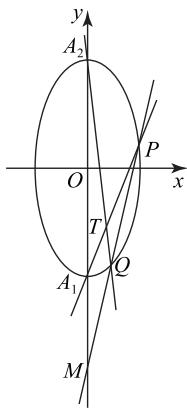
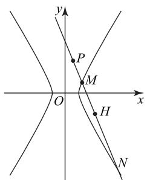

# 圆锥曲线中的动点在定直线上的问题求解方法

王书霞

(山东省聊城市临清市第三高级中学)

求证动点在某条定直线上是常考的一类题型.这类问题主要考查数学运算和逻辑推理素养,无论从思维角度还是运算角度看,都具有一定难度.那么这类问题该如何解呢?本文举例说明.

# 1 挖掘图形的对称性,求出动点的坐标

例1 已知椭圆 $C: \frac{y^2}{a^2} + \frac{x^2}{b^2} = 1$ $(a > b > 0)$ 上的一个动点 $N$ 到椭圆焦点 $F(0, c)$ 的距离的最小值是 $2 - \sqrt{3}$ ，且以长轴的两个端点 $A_1, A_2$ 和短轴的一个端点 $B$ 为顶点的 $\triangle A_1A_2B$ 的面积为 2.

(1)求椭圆 C 的标准方程；  
(2) 如图 1 所示, 过点 $M(0, -4)$ 且斜率为 $k$ 的直线 $l$ 与椭圆 $C$ 交于 $P, Q$ 两点. 证明: 直线 $A_{1}P$ 与直线 $A_{2}Q$ 的交点 $T$ 在定直线上.

解析 (1) $\frac{y^{2}}{4}+x^{2}=1$ (求解过程略).

text_image

y
A₂
O
x
P
T
Q
A₁
M

图1

(2)设直线 l 的方程为 $y=kx-4, P(x_{1},y_{1})$ , $Q(x_{2},y_{2}),A_{1}(0,-2),A_{2}(0,2)$ . 由 $\left\{\begin{aligned}\frac{y^{2}}{4}+x^{2}=1,\\ y=kx-4,\end{aligned}\right.$ 得 $(k^{2}+4)x^{2}-8kx+12=0$ ，则 $x_{1}+x_{2}=\frac{8k}{k^{2}+4},x_{1}x_{2}=\frac{12}{k^{2}+4}$ . 又 $l_{PA_{1}}:y+2=\frac{y_{1}+2}{x_{1}}x, l_{QA_{2}}:y-2=\frac{y_{2}-2}{x_{2}}x$ 所以

$$
\frac {y + 2}{y - 2} = \frac {(y _ {1} + 2) x _ {2}}{(y _ {2} - 2) x _ {1}} = \frac {(k x _ {1} - 2) x _ {2}}{(k x _ {2} - 6) x _ {1}} = \frac {k x _ {1} x _ {2} - 2 x _ {2}}{k x _ {1} x _ {2} - 6 x _ {1}}.
$$

因为 $kx_{1}x_{2}=\frac{12k}{k^{2}+4}=\frac{3}{2}(x_{1}+x_{2})$ ，所以

$$
\frac {y + 2}{y - 2} = \frac {\frac {3}{2} \left(x _ {1} + x _ {2}\right) - 2 x _ {2}}{\frac {3}{2} \left(x _ {1} + x _ {2}\right) - 6 x _ {1}} = \frac {3 x _ {1} - x _ {2}}{- 9 x _ {1} + 3 x _ {2}} = - \frac {1}{3},
$$

解得 y = -1，则直线 $A_{1}P$ 与直线 $A_{2}Q$ 的交点 T 在定直线 y = -1 上.

点评

求解第(2)问首先设直线 l 的方程为 $y = kx - 4, P(x_{1}, y_{1}), Q(x_{2}, y_{2})$ ，将 l 的方程与椭圆方程联立，由根与系数的关系得到 $x_{1} + x_{2} = \frac{8k}{k^{2} + 4}, x_{1}x_{2} = \frac{12}{k^{2} + 4}$ ，则可得直线 $PA_{1}$ 与 $QA_{2}$ 的方程。再根据 $\frac{y + 2}{y - 2} = -\frac{1}{3}$ ，即可得到 $y = -1$ ，从而得出直线 $A_{1}P$ 与直线 $A_{2}Q$ 的交点 $T$ 在定直线 $y = -1$ 上。

# 2 将动点的坐标用参数线性表示

例2 已知点(2,3)在双曲线 $C: \frac{x^2}{a^2} - \frac{y^2}{a^2 + 2} = 1$ 上. 过点 $P(\frac{1}{2},1)$ 作动直线 l 与双曲线的右支交于不同的 M, N 两点，在线段 MN 上取异于点 M, N 的点 H，满足 $\frac{|PM|}{|PN|} = \frac{|MH|}{|HN|}$ ，证明：点 H 恒在一条定直线上.

证明 将(2,3)代入双曲线可得 $\frac{4}{a^{2}}-\frac{9}{a^{2}+2}=1$ ，解得 $a^{2}=1$ ，故双曲线方程为 $x^{2}-\frac{y^{2}}{3}=1$ 。若直线l的斜率不存在，此时直线l与双曲线右支无交点，不符合题意，故直线l的斜率存在。设直线l的方程为 $y-1=k(x-\frac{1}{2})$ ，将之与 $x^{2}-\frac{y^{2}}{3}=1$ ，联立得

$$
(3 - k ^ {2}) x ^ {2} + (k ^ {2} - 2 k) x - (\frac {1}{4} k ^ {2} - k + 4) = 0,
$$

则 $\left\{\begin{aligned}\Delta&>0,\\3-k^{2}&\neq0,\\ \frac{k^{2}-2k}{k^{2}-3}&>0,\\ \frac{1}{4}k^{2}-k+4&=\\\frac{1}{4}k^{2}-k+4&=\\\frac{k^{2}-3}{k^{2}-3}&>0.\end{aligned}\right.$ 因为 $\frac{1}{4}k^{2}-k+4=\frac{1}{4}(k-2)^{2}+$

3>0 恒成立,所以 $k^{2}-3>0$ , 故 $k^{2}-2k>0$ , 结合 $\Delta>$

0, 解得 $\frac{-2-2\sqrt{13}}{3}<k<-\sqrt{3}$ . 设 $M(x_{1},y_{1}), N(x_{2},y_{2})$ , 则 $x_{1}+x_{2}=\frac{k^{2}-2k}{k^{2}-3}, x_{1}x_{2}=\frac{\frac{1}{4}k^{2}-k+4}{k^{2}-3}$ .

如图 2 所示, 设点 H 的坐标为 $(x_{H}, y_{H})$ , 由 $\frac{|PM|}{|PN|} = \frac{|MH|}{|HN|}$ , 得

$$
\frac {x _ {1} - \frac {1}{2}}{x _ {2} - \frac {1}{2}} = \frac {x _ {H} - x _ {1}}{x _ {2} - x _ {H}},
$$

text_image

y
P
M
O
x
H
N

图2

变形得 $2x_{1}x_{2} - (x_{H} + \frac{1}{2})(x_{1} + x_{2}) + x_{H} = 0$ ，将 $x_{1}+$ $x_{2} = \frac{k^{2} - 2k}{k^{2} - 3},x_{1}x_{2} = \frac{\frac{1}{4}k^{2} - k + 4}{k^{2} - 3}$ 代入可得 $x_{H} =$ $\frac{8 - k}{3 - 2k}$ ，将 $x_{H} = \frac{8 - k}{3 - 2k}$ 代入 $y - 1 = k(x - \frac{1}{2})$ 中，解得 $y_{H} = \frac{9k + 6}{2(3 - 2k)}$ ，则

$$
3 x _ {H} - 2 y _ {H} = \frac {2 4 - 3 k}{3 - 2 k} - \frac {1 8 k + 1 2}{2 (3 - 2 k)} = 6,
$$

故点 H 恒在一条定直线 3x-2y-6=0 上.

这种消参法类似于求轨迹问题中的消参法.
由于计算量较大,一般对关键点的坐标采用设而不求的方法.通过联立方程组得出根与系数的关系,将其整体代入消参,从而得到定直线方程.

# 3 通过取特殊点猜想定直线方程

例 3 在平面直角坐标系 xOy 中, 已知椭圆$C:\frac{x^{2}}{a^{2}}+\frac{y^{2}}{b^{2}}=1(a>b>0)$ 的离心率 $e=\frac{1}{2}$ ，直线 $l:x-my-1=0(m\in\mathbf{R})$ 过椭圆C的右焦点F，且交椭圆C于A，B两点.

(1)求椭圆 C 的标准方程；  
(2)已知点 $D(\frac{5}{2},0)$ ，连接 $BD$ ，过点 $A$ 作垂直于 $y$ 轴的直线 $l_{1}$ ，设直线 $l_{1}$ 与直线 $BD$ 交于点 $P$ ，试探索当 $m$ 变化时，是否存在一条定直线 $l_{2}$ ，使得点 $P$ 恒在直线 $l_{2}$ 上？若存在，请求出直线 $l_{2}$ 的方程；若不存在，请说明理由.

# 解析

(1) $\frac{x^{2}}{4}+\frac{y^{2}}{3}=1$ (求解过程略).

(2)令 $m = 0$ ，则 $A(1,\frac{3}{2}),B(1, - \frac{3}{2})$ 或 $A(1,$ $-\frac{3}{2}),B(1,\frac{3}{2}).$

当 $A(1, \frac{3}{2}), B(1, -\frac{3}{2})$ 时， $P(4, \frac{3}{2})$ .

当 $A(1, -\frac{3}{2}), B(1, \frac{3}{2})$ 时， $P(4, -\frac{3}{2})$ .

因此,若满足题意的直线存在,则定直线 $l_{2}$ 只能是 x=4. 下面证明点 P 恒在直线 x=4 上.

设 $A(x_{1},y_{1}), B(x_{2},y_{2})$ ，由于 PA 垂直于 y 轴，所以点 P 的纵坐标为 $y_{1}$ ，从而只需证明 $P(4,y_{1})$ 在

直线 BD 上. 由 $\left\{\begin{aligned}x-my-1=0,\\ \frac{x^{2}}{4}+\frac{y^{2}}{3}=1,\end{aligned}\right.$ 可得 $(4+3m^{2})y^{2}+$

$6my - 9 = 0.$ 因为 $\Delta = 144(1 + m^2) > 0$ ，所以

$$
y _ {1} + y _ {2} = \frac {- 6 m}{4 + 3 m ^ {2}}, y _ {1} y _ {2} = \frac {- 9}{4 + 3 m ^ {2}}. \tag {①}
$$

因为

$$
k _ {D B} - k _ {D P} = \frac {y _ {2} - 0}{x _ {2} - \frac {5}{2}} - \frac {y _ {1} - 0}{4 - \frac {5}{2}} = \frac {y _ {2}}{m y _ {2} + 1 - \frac {5}{2}} - \frac {y _ {1}}{\frac {3}{2}} =
$$

$$
\frac {\frac {3}{2} y _ {2} - y _ {1} \left(m y _ {2} - \frac {3}{2}\right)}{\frac {3}{2} \left(m y _ {2} - \frac {3}{2}\right)} = \frac {y _ {2} + y _ {1} - \frac {2}{3} m y _ {1} y _ {2}}{m y _ {2} - \frac {3}{2}},
$$

将式①代入上式得

$$
\frac {\frac {- 6 m}{4 + 3 m ^ {2}} - \frac {2}{3} m \cdot \frac {- 9}{4 + 3 m ^ {2}}}{m y _ {2} - \frac {3}{2}} = 0,
$$

即 $k_{DB}-k_{DP}=0$ ，所以 $k_{DB}=k_{DP}$ ，所以点 $P(4,y_{1})$ 恒在直线 BD 上，从而直线 $l_{1}$ 、直线 BD 与直线 $l_{2}:x=4$ 恒过同一点 P，所以存在一条定直线 $l_{2}:x=4$ 使得点 P 恒在直线 $l_{2}$ 上.

# 点评

第(2)问属于探索存在性问题,第一步假设定直线存在,直接求出定直线的方程或利用特殊位置猜想定直线的方程,第二步证明该直线满足题干条件.

由此可见求解动点在定直线上的论证问题,可用求轨迹方程的通用方法,也可以根据题目本身的特点,采用一些特殊方法,如先猜想再论证.

(完)