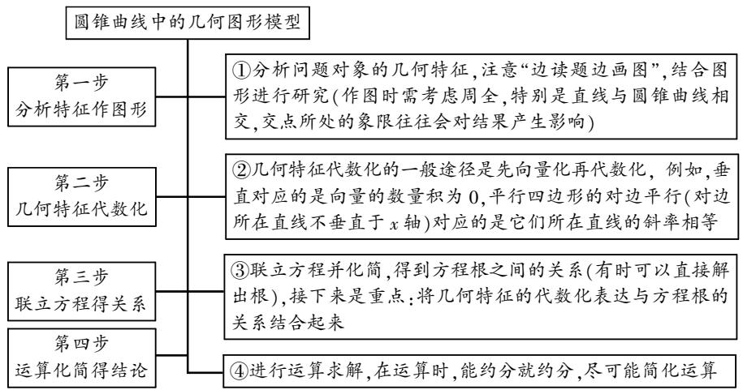
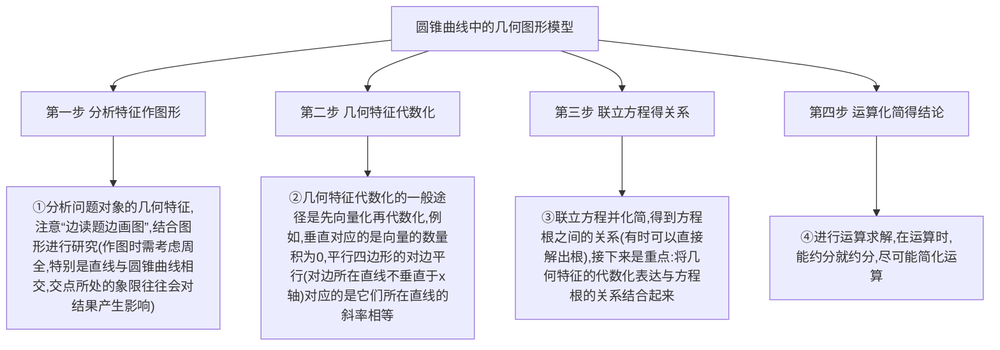
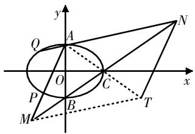
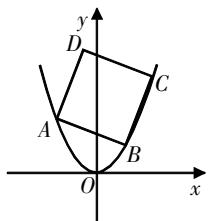

# 圆锥曲线几何图形问题的解题模型探究

刘瑶 江苏省苏州市吴江中学 215000

[摘 要] 文章深入探讨了圆锥曲线几何图形问题的解题模型构建,并通过具体实例展示了分步策略.同时,文章提出了相应的教学建议,旨在为教师的教学和学生的备考提供帮助.

[关键词] 圆锥曲线;几何图形;解题模型

圆锥曲线几何图形问题屡见不鲜,这类问题通常巧妙地将曲线与几何图形相结合,解题时需充分利用三角形、特殊四边形等几何图形的特征和性质,深入分析数量关系,从而探索出解题思路. 在实际教学中,需要教师引导学生总结解题模型,结合实例强化训练. 接下来,对此进行综合探究.

# 解题模型探究

尽管圆锥曲线几何图形问题类型多样，但破解这些问题的核心思路是一致的，即根据几何图形的特征与性质构建数量关系，即实现几何特征的“代数化”。在教学过程中，建议教师构建解题模型，形成分步策略。

解题模型的构建涉及图形性质分析、条件转化、代换整合以及化简推导等多个环节。建议教师采用四步分步策略,具体流程如下:

第一步,分析特征作图形. 该步的关键在于深入剖析问题对象的几

flowchart

图1

何特征,要求细致读题并审慎审题,全面把握问题条件,推荐采取“同步读题绘图”的策略.重点关注直线与圆锥曲线的交点、位置关系、所处象限等.在绘图过程中,需考虑周全,例如直线与圆锥曲线相交,交点所处的象限往往会对结果产生影响.

第二步,几何特征代数化. 该步的核心是转化几何特征,实现“代数化”,通常的做法是“先向量化处理,再实现代数化转换”,充分发挥向量在“数”与“形”结合中的桥梁作用.

例如,垂直对应的是向量的数量积为0,平行四边形的对边平行(对边所在直线不垂直于x轴)对应的是它们所在直线的斜率相等.

第三步,联立方程得关系. 该步的主要任务是联立方程,化简推得方程根的关系. 在整个过程中,需巧妙运用整体代入的思想构建方程,并紧密结合几何特征的代数化表达与方程根的关系. 有时也可以直接解出方程的根,这将为后续的分析提供便利.

第四步,运算化简得结论. 该步需要根据题设问题,化简求解,运算时尽可能进行约分等操作,以简化运算过程,得到最终结论.

# 解题应用探究

上述总结了圆锥曲线中几何图形问题的解题模型,整个解题过程分为四步,通过分析几何特征,实现代数化,再联立构建方程,完成化简求解.学生很容易理解解题模型的内容,实际探究时还需引导学生结合实例来强化应用.解题引导建议参考上述四步模型,采用分步构建的方式.

# 1. 构图形,证等线

例1 已知椭圆 $E:\frac{x^{2}}{9}+\frac{y^{2}}{4}=1$ 的上、下顶点分别为A,B,右顶点为C,过点A的直线l与椭圆E的另一个交点为P,点Q与点P关于x轴对称,直线AP交直线BC于M,直线AQ交直线BC于N,点 $T(6,-2)$ ,求证: $|AM|=|TN|$ .

问题分析 本题以椭圆与直线相交为背景,涉及了点对称知识点,需要证明线段相等. 整个过程分析的重点是线段关系,建议将线段转移到几何图形中,利用几何图形的特征来求解. 在教学中,建议教师积极引导学生,依据上述精炼总结的四步解题模型进行知识框架的构建.

解题指导 求证等线段关系,构建如下四步策略.

第一步,分析特征作图形.

引导学生理解题意,作出基础图形(如图2所示),再连接MT和AT.

text_image

y
Q
A
N
O
C
x
P
B
M
T

图2

因为要证明 $\left|AM\right|=\left|TN\right|$ ，故需将其放置在几何图形中。对于等线段的证明，常见的作图思路一般有两种：一是放置在等腰三角形中，作为等腰三角形的两腰；二是放置在平行四边形中，作为平行四边形的对边。对于本题，粗略作图后发现里面的四边形与平行四边形相似，因此通过补图构建成平行四边形。

第二步,几何特征代数化.

要证明 $\left|AM\right|=\left|TN\right|$ ，将其置于四边形AMTN中，则两线段为四边形的一组对边，重点任务就是证明四边形AMTN为平行四边形，可结合平行四边形的判定定理，如对角线互相平分，即点C既是AT的中点，也是MN的中点.

第三步,联立方程得关系.

设点 $P(x_{0},y_{0})$ ，则点 $Q(x_{0},-y_{0})$ ， $x_{0}\neq0$ ，易知点 $A(0,2)$ ， $B(0,-2)$ ， $C(3,0)$ ，所以直线BC的方程为 $\frac{x}{3}-\frac{y}{2}=1$ ，即2x-3y=6，直线AP的方程为 $y=\frac{y_{0}-2}{x_{0}}x+2$ ，联立直线BC与直线AP的方程，可得点 $M\left(\frac{12x_{0}}{2x_{0}-3y_{0}+6},\frac{4x_{0}+6y_{0}-12}{2x_{0}-3y_{0}+6}\right)$ 。直线AQ的方程为 $y=-\frac{y_{0}+2}{x_{0}}x+2$ ，同理可得点 $N\left(\frac{12x_{0}}{2x_{0}+3y_{0}+6},\frac{4x_{0}-6y_{0}-12}{2x_{0}+3y_{0}+6}\right)$ 。

第四步,运算化简得结论.

此处可以逆向利用中点坐标公式,通过坐标运算来深入分析各点之间的位置关系.

$x_{M} + x_{N} = \frac{12x_{0}}{2x_{0} + 6 - 3y_{0}} +\frac{12x_{0}}{2x_{0} + 6 + 3y_{0}} =$ $6 = 2x_{C}$ ，且 $y_{M} + y_{N} = \frac{2x_{M}}{3} -2 + \frac{2x_{N}}{3} -2 = 0 =$ $2y_{C}$ ，所以线段MN的中点为点C.又知点A(0,2)，T(6,-2)，则线段AT的中点也为点C,从而证明四边形AMTN为平行四边形,所以 $|AM|=|TN|$ .

解后反思总结 上述利用解题模型四步策略来证明线段相等,整体上采用“补图,证平行”的方法思路,即将相关线段放置在四边形中,通过证明该四边形为平行四边形来完成.教学的关键是探索平行四边形判定的条件,上述采用的是“对角线互相平分”的思路,将其转化为对应中点重合.

从判定定理视角来看,也可以通过证明 $\overrightarrow{AM}=\overrightarrow{NT}$ 来判定四边形AMTN为平行四边形,教学中需要引导学生关注该方法的难点,推导出向量后,向量关系的化简推导会过于繁复,运算量太大,不利于证明.

# 2. 化边长, 求最值

例2 在平面直角坐标系 $xOy$ 中，动圆 $P$ 过定点 $F\left(0, \frac{1}{4}\right)$ ，且与定直线 $l: y = -\frac{1}{4}$ 相切，记动点 $P$ 的轨迹为 $W$ .

(1)求W的方程.

(2)已知正方形ABCD有三个顶点在W上,求正方形ABCD面积的最小值.

问题分析 本题通过设定动圆与直线相切的条件,构建动点轨迹W.本题的第一问聚焦于轨迹方程的推导;第二问则基于动点轨迹上的点,构建了正方形面积最值问题.解题思路明确,即先确定正方形的边长,再构建面积模型,最后通过代数方法求解最值.

解题指导（1）（简答）设 $P(x,y)$ ，由题意得 $\left|y+\frac{1}{4}\right|=\sqrt{x^{2}+\left(y-\frac{1}{4}\right)^{2}}$ ，整理得 $y=x^{2}$ ，即W的方程为 $y=x^{2}$ .

(2) W 的方程为 $y = x^{2}$ ，则为抛物线，后续求解正方形的最值，构建如

下四步策略.

第一步,分析特征作图形.

题设正方形的三个顶点在轨迹W上,不妨设A,B,C在W上,B,C在y轴右侧(包括在y轴上),A,B,C三点的坐标分别为 $(x_{1},y_{1}),(x_{2},y_{2}),(x_{3},y_{3})$ ,则 $x_{1}<0,x_{3}>x_{2}\geqslant0$ ,如图3所示.

text_image

y
D
C
A
B
O
x

图3

第二步,几何特征代数化.

引导学生提取正方形的特征,将其代数化.

已知四边形ABCD是正方形, 可得 $|AB|=|BC|$ , 即 $\sqrt{(x_{1}-x_{2})^{2}+(y_{1}-y_{2})^{2}}=\sqrt{(x_{3}-x_{2})^{2}+(y_{3}-y_{2})^{2}}$ .

设直线BC的斜率为 $k(k>0)$ ，可得 $\sqrt{1+\frac{1}{k^{2}}}(x_{2}-x_{1})=\sqrt{1+k^{2}}(x_{3}-x_{2})$ ，化
简得 $x_{2}-x_{1}=k(x_{3}-x_{2})①$ .

第三步,联立方程得关系.

该步需要引导学生联立抛物线方程,通过代数运算得关系.

因为A,B,C三点在抛物线W上，所以 $y_{1}=x_{1}^{2},y_{2}=x_{2}^{2},y_{3}=x_{3}^{2}$ .而A,B,C三点也满足 $y_{3}-y_{2}=k(x_{3}-x_{2}),y_{1}-y_{2}=-\frac{1}{k}(x_{1}-x_{2})$ ，化简得 $x_{3}=k-x_{2}②,x_{1}=-\frac{1}{k}-x_{2}③$ .

第四步,运算化简得结论.

该步需要引导学生整合上述等式,推导出正方形的边长,构建面积模型,再分析求解最值.

联立方程①②③, 可得 $\frac{1}{k} + 2x_{2} = k(k - 2x_{2})$ , 所以 $x_{2} = \frac{k^{3} - 1}{k(2k + 2)} \geqslant 0$ , 所以 $k^{3} \geqslant 1, k \geqslant 1$ .

综上可知，正方形ABCD的边长为 $\sqrt{1+k^{2}}\left(x_{3}-x_{2}\right)=\sqrt{1+k^{2}}\left(k-2x_{2}\right)=\sqrt{1+k^{2}}\left[k-\frac{k^{3}-1}{k(k+1)}\right]=\frac{k^{2}+1}{k}\cdot\frac{\sqrt{1+k^{2}}}{k+1}\geqslant\frac{2k}{k}\cdot\frac{\sqrt{\frac{1}{2}(1+k)^{2}}}{k+1}=\sqrt{2}$ . 当且仅当k=1,即点B的坐标为(0,0)时,等号成立.所以，正方形ABCD面积的最小值为2.

解后反思总结 利用解题模型四步策略求解正方形面积的最值,其难点在于四边形边长的推导. 通过联立曲线与直线方程,并运用综合代换方法,结合不等式的性质来确定最值. 在整个求解过程中,充分体现了几何问题代数化的显著特征.

在教学反思环节,可以鼓励学生进一步探索最值分析的其他途径.例如,利用函数的单调性、极值等性质进行深入分析.对于该问题,正方形ABCD的面积 $S=\frac{(k^{2}+1)^{3}}{k^{2}(k+1)^{2}}$ ,通过整合变形可得 $S=\frac{\left(k+\frac{1}{k}\right)^{3}}{k+\frac{1}{k}+2}$ ，再换元简

化, 令 $t=k+\frac{1}{k}$ , 则 $t\geqslant2$ . 分析可知, S随着t的增大而增大, 所以S的最小值为 $\frac{2^{3}}{2+2}=2$ .

# 解题模型教学建议

建议一:立足问题特征,整合破解思路.

圆锥曲线的综合性问题种类繁多,因此,在开展解题模型的探究时,应当引导学生梳理问题的特征,并针对性地构建解题模型.以探索解题模型为例,其关键特征在于将几何图形融合其中,涉及曲线与几何图形的位置关系以及几何特征的探究. 在教学过程中, 应特别强调引导学生关注几何图形的构建, 例如关键点、线、面的运用.

建议二:梳理解题流程,构建分步策略.

在构建解题模型的过程中,建议引导学生从全局出发,分析问题并转化思路,再明确具体构建步骤. 解决圆锥曲线几何图形问题,关键在于将几何特征代数化. 这要求我们构建或挖掘几何图形,将其特征转化为代数条件,然后化简求解. 因此,教学中建议引导学生构建上述四步策略,并指导学生明确每一步的具体任务和解析核心.

建议三:实例引导探究,深度反思过程.

在教学中,建议通过实例引导学生进行探究学习,结合具体问题帮助他们深化对解题模型的理解.本文选取了两个具有代表性的几何问题——线段证明和几何面积求解——作为案例.在引导学生探究的过程中,建议他们严格遵循解题模型,分析问题、转化条件、构建解题思路,从而深刻体验每一步的构建过程.在完成解题探究后,还应进一步开展解后反思,思考解法的优劣,以及多解探究,总结解题经验.

# 写在最后

在探讨圆锥曲线几何图形类问题的解题模型时,建议引导学生梳理解题流程,构建分步策略.通过结合具体实例来加强引导,整个教学过程应关注学生思维的转变.设置具有启发性的问题,以引导学生深入思考,并适时地融入数学思想,让学生深刻理解思想方法的精髓,从而提高学生的综合解题能力.