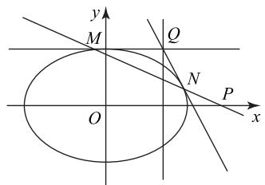

# 圆锥曲线定点、定值问题中非对称结构的求解路径

段旭鹏 $^{1}$ 王天云 $^{2}$

(1.北京市第八十中学 2.首都师范大学附属中学)

在求解直线与圆锥曲线相交问题时,学生习惯将直线方程与曲线方程联立,运用根与系数的关系整体代换,此解法适用于表达式为对称结构的问题.但在遇到表达式为非对称结构问题时,由于目标式子不对称(如 $y=\frac{k(x_{1}-x_{2})}{1-x_{2}}x+\frac{k(3x_{2}-x_{1}x_{2}-2)}{1-x_{2}}$ )就无法直接运用根与系数的关系整体代换,很多学生对此无从下手.基于此,笔者以一道圆锥曲线解答题为例,展示这类问题的求解路径.

# 1 定点问题中非对称结构呈现

例1 已知椭圆 $E: \frac{x^2}{a^2} + \frac{y^2}{b^2} = 1 (a > b > 0)$ ，以 $E$ 的两个焦点与短轴的一个端点为顶点的三角形是等腰直角三角形,且面积为1.

(1)求椭圆 E 的方程;

(2) 过点 $P(2,0)$ 的直线与椭圆 E 交于不同的两点 M, N. 过 M 作直线 x=1 的垂线，垂足为 Q. 证明：直线 NQ 过定点.

分析 (1) $\frac{x^{2}}{2}+y^{2}=1$ (求解过程略).

(2)由题意知直线 MN 的斜率存在.设直线 MN 的方程为 $y=k(x-2)$ ，点 $M(x_{1},y_{1})$ ， $N(x_{2},y_{2})$ $(x_{1}\neq x_{2}$ ，且 $x_{1}\neq1, x_{2}\neq1$ ，当 $x_{1}$ 和 $x_{2}$ 中有一个等于 1 时，M,N 两点重合，不符合题意)，则点 $Q(1,y_{1})$ .

由 $\left\{ \begin{array}{l} \frac{x^2}{2} + y^2 = 1, \\ y = k(x - 2), \end{array} \right.$ 得 $(1 + 2k^2)x^2 - 8k^2x + 8k^2 - 2 = 0.$ 因为 $\Delta = 64k^4 - 4(1 + 2k^2)(8k^2 - 2) = -4(4k^2 - 2) > 0$ ，所以 $k^2 < \frac{1}{2}$ ，且 $x_1 + x_2 = \frac{8k^2}{1 + 2k^2}, x_1x_2 = \frac{8k^2 - 2}{1 + 2k^2}$ . 直线 $NQ$ 的方程为 $y - y_1 = \frac{y_1 - y_2}{1 - x_2}(x - 1)$ ，即

$$
y = \frac {y _ {1} - y _ {2}}{1 - x _ {2}} x + \frac {y _ {2} - y _ {1} x _ {2}}{1 - x _ {2}} =
$$

$$
\frac {k (x _ {1} - x _ {2})}{1 - x _ {2}} x + \frac {k (3 x _ {2} - x _ {1} x _ {2} - 2)}{1 - x _ {2}}. \tag {①}
$$

至此可发现式①是非对称结构,无法直接运用根与系数的关系整体代入解决,考试时很多学生止步于此.笔者通过探究,总结出此类非对称结构圆锥曲线问题的解题路径,供读者参考.

# 2 定点问题中非对称结构的探索思路

探索 1 利用几何直观,简化计算.

如图 1 所示, 注意到直线 NQ 在动态变化时关于 x 轴对称, 猜到定点在 x 轴上, 令 y=0, 突破难点.

text_image

y
M
Q
N
O
P
x

图1

因为直线 $NQ$ 的方程为

$$
y = \frac {k \left(x _ {1} - x _ {2}\right)}{1 - x _ {2}} x + \frac {k \left(3 x _ {2} - x _ {1} x _ {2} - 2\right)}{1 - x _ {2}},
$$

令 y=0, 得

$$
0 = \frac {k (x _ {1} - x _ {2})}{1 - x _ {2}} x + \frac {k (3 x _ {2} - x _ {1} x _ {2} - 2)}{1 - x _ {2}}.
$$

当 $k \neq 0$ 时，有

$$
x = \frac {x _ {1} x _ {2} - 3 x _ {2} + 2}{x _ {1} - x _ {2}}. \tag {②}
$$

当 k=0 时, 直线 NQ 为 x 轴.

至此发现式②也是非对称结构,无法直接运用根与系数的关系整体代入解决,部分同学基于上式,给出如下处理方式.

当 $k \neq 0$ 时，有

$$
x = \frac {x _ {1} x _ {2} - 3 x _ {2} + 2}{x _ {1} - x _ {2}} = \frac {x _ {1} x _ {2} - 3 (x _ {1} + x _ {2}) + 3 x _ {1} + 2}{2 x _ {1} - (x _ {1} + x _ {2})} =
$$

$$
\frac {\frac {- 1 2 k ^ {2}}{1 + 2 k ^ {2}} + 3 x _ {1}}{\frac {- 8 k ^ {2}}{1 + 2 k ^ {2}} + 2 x _ {1}} = \frac {3}{2}.
$$

但此法对代数式的观察要求很高,不适合进行一般推广.为此,笔者进一步思索能否通过继续猜测避免非对称结构的出现呢?

探索 2 利用特殊位置,计算出定点,先猜后证.

注意到当 M 为上顶点时， $M(0,1)$ ，直线 PM 的方程为 $y=-\frac{1}{2}(x-2)$ 。将 $k=-\frac{1}{2}$ ， $x_{1}=0$ 代入 $x_{1}+x_{2}=\frac{8k^{2}}{1+2k^{2}}$ ，得 $x_{2}=\frac{4}{3}$ ，再将 $x_{2}=\frac{4}{3}$ 代入 $y=-\frac{1}{2}(x-2)$ ，得 $y_{2}=\frac{1}{3}$ ，故点 N 的坐标为 $(\frac{4}{3},\frac{1}{3})$ ，点 Q 的坐标为 $(1,1)$ 。易知直线 NQ 的方程为 $y=-2x+3$ ，故直线 NQ 过定点 $(\frac{3}{2},0)$ 。

猜到定点以后,可以做如下处理.

易知直线 NQ 的方程为 $y=\frac{k(x_{1}-x_{2})}{1-x_{2}}x+\frac{k(3x_{2}-x_{1}x_{2}-2)}{1-x_{2}}$ . 令 $x=\frac{3}{2}$ , 得

$$
y = \frac {k (x _ {1} - x _ {2})}{1 - x _ {2}} \cdot \frac {3}{2} + \frac {k (3 x _ {2} - x _ {1} x _ {2} - 2)}{1 - x _ {2}} =
$$

$$
\frac {3 k \left(x _ {1} + x _ {2}\right) - 2 k x _ {1} x _ {2} - 4 k}{2 \left(1 - x _ {2}\right)} =
$$

$$
\frac {3 k \cdot \frac {8 k ^ {2}}{1 + 2 k ^ {2}} - 2 k \cdot \frac {8 k ^ {2} - 2}{1 + 2 k ^ {2}} - 4 k}{2 (1 - x _ {2})} = 0. \tag {③}
$$

因此, 直线 NQ 过定点 $\left(\frac{3}{2},0\right)$ .

探索至此,可以发现式③变成了对称结构,可以直接运用根与系数的关系整体代入解决.

上述探索 2 通过对点 M 取特殊位置, 得出直线 NQ 过定点 $\left(\frac{3}{2},0\right)$ , 再通过推理证明得出一般情况下直线 NQ 亦过定点 $\left(\frac{3}{2},0\right)$ . 这是一种先猜后证的数学思想方法, 常用于证明圆锥曲线中的定点、定值问题, 其本质是通过观察特例提出合理猜想, 再通过逻辑推理严格验证, 一般遵循“观察特例—提出猜想—严格证明”的推理路径. 下面迁移运用该方法求解两道高考题.

# 3 链接高考

例 2 （2022 年全国乙卷理 20）已知椭圆 E 的中心为坐标原点,对称轴为 x 轴、y 轴,且过 $A(0,-2)$ , $B(\frac{3}{2},-1)$ 两点.

(1) 求 $E$ 的方程；

(2)设过点 $P(1,-2)$ 的直线交 E 于 M, N 两点，过 M 且平行于 x 轴的直线与线段 AB 交于点 T，点 H 满足 $\overrightarrow{MT} = \overrightarrow{TH}$ . 证明：直线 HN 过定点.

析

(1) $\frac{x^{2}}{3}+\frac{y^{2}}{4}=1$ (求解过程略).

(2)若过点 $P(1, - 2)$ 的直线斜率不存在，则直线为 $x = 1$ ，此时 $M,N$ 两点的坐标分别为 $(1, - \frac{2\sqrt{6}}{3})$ $(1,\frac{2\sqrt{6}}{3})$ ，点 $T$ 的坐标为 $(3 - \sqrt{6}, - \frac{2\sqrt{6}}{3})$ .因为 $\overrightarrow{MT} =$ $\overrightarrow{TH}$ ，故点 $T$ 为线段 $MH$ 的中点，所以点 $H$ 的坐标为 $(5 - 2\sqrt{6}, - \frac{2\sqrt{6}}{3})$ ，此时直线 $HN$ 的方程为

$$
y = \frac {- \frac {2 \sqrt {6}}{3} - \frac {2 \sqrt {6}}{3}}{5 - 2 \sqrt {6} - 1} (x - 1) + \frac {2 \sqrt {6}}{3},
$$

即 $y=(\frac{2\sqrt{6}}{3}+2)x-2$ , 故直线 HN 过定点 $(0,-2)$ .

若过点 $P(1,-2)$ 的直线斜率存在, 设直线 MN 的方程为 $y=k(x-1)-2$ .

联立 $\left\{\begin{aligned}y&=k(x-1)-2,\\ \frac{x^{2}}{3}&+\frac{y^{2}}{4}=1,\end{aligned}\right.$ 可得

$$
(3 k ^ {2} + 4) x ^ {2} - 6 k (2 + k) x + 3 k (k + 4) = 0.
$$

设 $M(x_{1},y_{1}),N(x_{2},y_{2})$ ，则

$$
x _ {1} + x _ {2} = \frac {6 k (2 + k)}{3 k ^ {2} + 4}, x _ {1} x _ {2} = \frac {3 k (4 + k)}{3 k ^ {2} + 4}, \quad ①
$$

故

$$
y _ {1} + y _ {2} = \frac {- 8 (2 + k)}{3 k ^ {2} + 4}, y _ {1} y _ {2} = \frac {4 (4 + 4 k - 2 k ^ {2})}{3 k ^ {2} + 4}, \tag {②}
$$

联立 $\left\{\begin{aligned}y&=y_{1},\\ y&=\frac{2}{3}x-2,\end{aligned}\right.$ 可得 $T(\frac{3y_{1}}{2}+3,y_{1})$ .由 $\overrightarrow{MT}=\overrightarrow{TH}$ ,

可得 $H(3y_{1}+6-x_{1},y_{1})$ ，此时直线 HN 的方程为

$$
y - y _ {2} = \frac {y _ {1} - y _ {2}}{3 y _ {1} + 6 - x _ {1} - x _ {2}} (x - x _ {2}).
$$

画出直线与椭圆的示意图,注意到直线 HN 在动态变化时关于 y 轴对称,猜到定点在 y 轴上.令 x=0,可得

$$
\begin{array}{l} y = \frac {y _ {1} - y _ {2}}{3 y _ {1} + 6 - x _ {1} - x _ {2}} \cdot (- x _ {2}) + y _ {2} = \\ \frac {- x _ {2} \left(y _ {1} - y _ {2}\right) + y _ {2} \left(3 y _ {1} + 6 - x _ {1} - x _ {2}\right)}{3 y _ {1} + 6 - x _ {1} - x _ {2}}. \\ \end{array}
$$

选取直线 MN 的特殊位置进行分析. 若直线 MN平行于 y 轴, 不难得出直线 HN 过定点 $(0, -2)$ , 从而

$$
\begin{array}{l} y + 2 = \frac {- x _ {2} (y _ {1} - y _ {2}) + y _ {2} (3 y _ {1} + 6 - x _ {1} - x _ {2})}{3 y _ {1} + 6 - x _ {1} - x _ {2}} + 2 = \\ \frac {- x _ {2} \left(y _ {1} - y _ {2}\right) + y _ {2} \left(3 y _ {1} + 6 - x _ {1} + x _ {2}\right)}{3 y _ {1} + 6 - x _ {1} - x _ {2}} + \\ \frac {2 \left(3 y _ {1} + 6 - x _ {1} - x _ {2}\right)}{3 y _ {1} + 6 - x _ {1} - x _ {2}}, \\ \end{array}
$$

又因为

$$
\begin{array}{l} - x _ {2} \left(y _ {1} - y _ {2}\right) + 3 y _ {1} y _ {2} + 6 \left(y _ {1} + y _ {2}\right) + \\ 1 2 - \left(y _ {2} + 2\right) \left(x _ {1} + x _ {2}\right) = \\ \end{array}
$$

$$
- 2 k x _ {1} x _ {2} + k \left(x _ {1} + x _ {2}\right) + 3 y _ {1} y _ {2} + 6 \left(y _ {1} + y _ {2}\right) + 1 2,
$$

将式①和式②代入可得 $y+2=0$ ，故直线 HN 过定点 $(0,-2)$ .

例 3 （2020 年北京卷 20）已知椭圆 $C: \frac{x^{2}}{a^{2}} +$ $\frac{y^{2}}{b^{2}}=1$ 过点 A(-2,-1)，且 a=2b.

(1)求椭圆 C 的方程;

(2) 过点 $B(-4,0)$ 的直线 $l$ 交椭圆 $C$ 于点 $M$ , $N$ , 直线 $MA, NA$ 分别交直线 $x = -4$ 于点 $P, Q$ . 求 $\frac{|PB|}{|BQ|}$ 的值.

(1) $\frac{x^2}{8} + \frac{y^2}{2} = 1$ (求解过程略).

(2)由题意可知直线 l 的斜率存在, 设 $M(x_{1}, y_{1}), N(x_{2}, y_{2})$ , 直线 l 的方程为 $y = k(x + 4)$ . 联立 $\left\{\begin{aligned}y &= k(x + 4), \\ \frac{x^{2}}{8} &= \frac{y^{2}}{2} = 1,\end{aligned}\right.$ 可得

$$
(4 k ^ {2} + 1) x ^ {2} + 3 2 k ^ {2} x + 6 4 k ^ {2} - 8 = 0.
$$

由 $\Delta = 32(1 - 4k^2) > 0$ ，得 $-\frac{1}{2} < k < \frac{1}{2}$ . 又

$$
x _ {1} + x _ {2} = \frac {- 3 2 k ^ {2}}{4 k ^ {2} + 1}, x _ {1} x _ {2} = \frac {6 4 k ^ {2} - 8}{4 k ^ {2} + 1}. \tag {①}
$$

易知直线 $MA$ 的方程为 $y + 1 = \frac{y_1 + 1}{x_1 + 2} (x + 2)$ .

令 $x = -4$ ，可得 $y_{P} = \frac{-(2k + 1)(x_{1} + 4)}{x_{1} + 2}$ .同理可得 $y_{Q} = \frac{-(2k + 1)(x_{2} + 4)}{x_{2} + 2}$

若直接计算,则

$$
\frac {| P B |}{| P Q |} = \left| \frac {y _ {P}}{y _ {Q}} \right| = \left| \begin{array}{c} \frac {- (2 k + 1) (x _ {1} + 4)}{x _ {1} + 2} \\ \frac {- (2 k + 1) (x _ {2} + 4)}{x _ {2} + 2} \end{array} \right| =
$$

$$
\left| \frac {x _ {1} + 4}{x _ {1} + 2} \cdot \frac {x _ {2} + 2}{x _ {2} + 4} \right| = \left| \frac {x _ {1} x _ {2} + 2 x _ {1} + 4 x _ {2} + 8}{x _ {1} x _ {2} + 4 x _ {1} + 2 x _ {2} + 8} \right|. \tag {②}
$$

此时式②中含非对称结构,无法直接将式①代入处理.
因此考虑先猜后证的解题路径.

若直线 MN 与 x 轴重合，则不难得到 $y_{P} + y_{Q} = 0$ ，从而直接计算 $y_{P} + y_{Q}$ ，即

$$
\begin{array}{l} y _ {P} + y _ {Q} = \frac {- (2 k + 1) \left(x _ {1} + 4\right)}{x _ {1} + 2} + \frac {- (2 k + 1) \left(x _ {2} + 4\right)}{x _ {2} + 2} = \\ \frac {- (2 k + 1) \left[ \left(x _ {1} + 4\right) \left(x _ {2} + 2\right) + \left(x _ {2} + 4\right) \left(x _ {1} + 2\right) \right]}{\left(x _ {1} + 2\right) \left(x _ {2} + 2\right)} = \\ \frac {- (2 k + 1) \left[ 2 x _ {1} x _ {2} + 6 (x _ {1} + x _ {2}) + 1 6 \right]}{(x _ {1} + 2) (x _ {2} + 2)}. \tag {③} \\ \end{array}
$$

将式①代入式③可得 $y_{P} + y_{Q} = 0$ ，故 $\frac{|PB|}{|BQ|} = 1$ .

# 4 变式练习

练习 1 已知双曲线 C 的中心为坐标原点, 左焦点为 $(-2\sqrt{5}, 0)$ , 离心率为 $\sqrt{5}$ .

(1) 求 C 的方程;

(2) 记 C 的左、右顶点分别为 $A_{1}, A_{2}$ ，过点 $(-4, 0)$ 的直线与 C 的左支交于 M, N 两点，M 在第二象限，直线 $MA_{1}$ 与 $NA_{2}$ 交于点 P。证明：点 P 在定直线上。

练习 2 已知椭圆 $E: \frac{x^{2}}{a^{2}} + \frac{y^{2}}{b^{2}} = 1 (a > b > 0)$ 经过点 $A_{1}(-2,0)$ , $A_{2}(2,0)$ ，点 B 为椭圆 E 的上顶点，且直线 $A_{1}B$ 与直线 $l: 2x + \sqrt{3}y = 0$ 相互垂直.

(1) 求 E 的方程;

(2)若不垂直于 x 轴的直线 l 过椭圆 E 的右焦点 $F_{2}$ ，交椭圆于 C，D 两点（C 在 x 轴上方），直线 $A_{1}C$ ， $A_{2}D$ 分别与 y 轴交于 S，T 两点，O 为坐标原点，证明： $\frac{|OS|}{|OT|} = \frac{1}{3}$ .

纵观以上探索思路,可以看到先猜后证这一重要数学思想方法在求解圆锥曲线中定点、定值问题中富有成效.在解决圆锥曲线相关问题时,若遇到一些形式复杂、难以直接处理的代数表达式,不妨从题设条件中选取某些特殊情形分析,挖掘出问题背后隐藏的一般性规律,进而通过严谨的逻辑推理严格验证该规律在一般情形下同样成立.这种由特殊到一般、先合理猜想后严格证明的思维路径,不仅体现了数学思维的创造性,也保证了结论的严谨性.

(完)