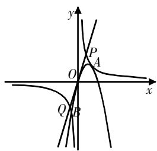
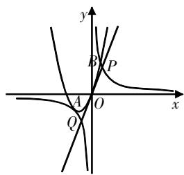
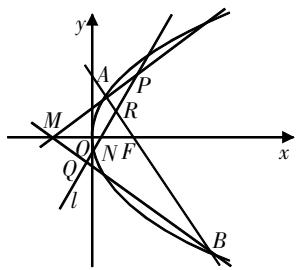

# 基于同构思维

# 优化解题思路 发展运算素养

舒华瑛 浙江省杭州市余杭高级中学 311199

张宏江 浙江省杭州市临平实验中学 311199

[摘 要] 同构法是优化解题思路的一种有效方法. 研究者从代数结构同构、几何特征同构、算法算理同构以及几何特征同构与代数结构同构相互转化的视角, 浅析如何优化算法, 以提高学生的数学思维能力与数学运算素养.

[关键词] 同构思维;解题思路;优化;运算素养

# 问题提出

“三新”背景下的高考试题,对学生的计算能力和思维能力提出了较高的要求.《普通高中数学课程标准(2017年版2020年修订)》提出:通过高中数学课程的学习,学生能进一步发展数学运算能力;通过运算促进数学思维发展,形成规范化思考问题的品质,养成一丝不苟、严谨求实的科学精神[1]7. 数学运算是指在明晰运算对象的基础上,依据运算法则解决数学问题的素养.主要包括:理解运算对象,掌握运算法则,探究运算思路,选择运算方法,设计运算程序,求得运算结果等[1]7.

解题是发展数学运算素养的重要途径.著名数学教育家波利亚指出：“掌握数学就是意味着善于解题.”他在《怎样解题》中提出了解题的四个阶段:弄清问题—拟定计划—实现计划—回顾反思,为数学解题提供了清晰的路径 $^{[2]}$ .

当学生遇到一些综合性较强的数学问题时,常常由于题目计算量大、解题过程烦琐而不能求得结果.在这种情况下,需要从不同的视角重新审视问题,探寻新的解题路径,以确保问题能够顺利解决.同构思维正是化烦琐为简便的一种数学思维方式.

# 解法探究

# 1. 代数结构视角下的同构问题

(1)整体同构

例1 (2022年新高考Ⅰ卷第22题)已知函数 $f(x)=\mathrm{e}^{x}-ax$ 和 $g(x)=ax-\ln x$ 有相同最小值.

(1)求a;   
(2)证明:存在直线y=b,其与两

条曲线 $y=f(x)$ 和 $y=g(x)$ 共有三个不同的交点,并且从左到右的三个交点的横坐标成等差数列.

解析 (1) $a = 1$ .

(2) $f(x)=\mathrm{e}^{x}-x$ , $g(x)=x-\ln x$ , 则 $g(x)=\mathrm{e}^{\ln x}-\ln x$ , 即 $g(x)=f(\ln x)$ .

$f'(x)=\mathrm{e}^{x}-1$ , 令 $f'(x)>0$ , 则 x>0; 令 $f'(x)<0$ , 则 x<0. 所以, $f(x)$ 在 $(0,+\infty)$ 上单调递增, 在 $(-∞,0)$ 上单调递减. $f(0)=1$ , 当 $x\to-\infty$ 时, $f(x)\to+\infty$ ; 当 $x\to+\infty$ 时, $f(x)\to+\infty$ .

$g'(x)=\frac{x-1}{x}$ ，令 $g'(x)>0$ ，则x>1；
令 $g'(x)<0$ ，则0<x<1。所以， $g(x)$ 在 $(1,+\infty)$ 上单调递增，在 $(0,1)$ 上单调递减。 $g(1)=1$ ，当 $x\to0$ 时， $g(x)\to+\infty$ ；当 $x\to+\infty$ 时， $g(x)\to+\infty$ 。

当 $x > \ln x > 0$ ，即 $x > 1$ 时， $f(x) > f(\ln x)$ . 又 $g\left(\frac{1}{\mathrm{e}^2}\right) > f\left(\frac{1}{\mathrm{e}^2}\right)$ ，所以两条曲线 $y = f(x)$

和 $y=g(x)$ 有且只有一个交点.

设 $f(x_{0})=g(x_{0})$ ，则存在 $b=f(x_{0})=g(x_{0})$ ，使得直线y=b与两条曲线 $y=f(x)$ 和 $y=g(x)$ 共有三个不同的交点。设三个交点的横坐标分别为 $x_{1},x_{0},x_{2}$ ，则

$$
\left\{ \begin{array}{l l} x _ {1} = \ln x _ {0}, \\ x _ {0} = \ln x _ {2}, \\ \mathrm{e} ^ {x _ {0}} - x _ {0} = x _ {0} - \ln x _ {0}, \end{array} \text {即} \left\{ \begin{array}{l l} x _ {1} = \ln x _ {0}, \\ x _ {2} = \mathrm{e} ^ {x _ {0}}, \\ \mathrm{e} ^ {x _ {0}} + \ln x _ {0} = 2 x _ {0}, \end{array} \right. \right. \text {所以}
$$

$x_{1}+x_{2}=2x_{0}$ ，即从左到右三个交点的横坐标成等差数列.

例1主要考查用导数来研究函数的单调性、极值点、零点等性质，并绘制函数的大致图象.解决这类问题的方法有很多,但大多数过程较为繁杂.通过观察函数 $f(x)$ 与 $g(x)$ 的结构特征,可以将 $g(x)$ “同构”为 $f(\ln x)$ ,再利用 $f(x)$ 的单调性以及方程 $f(x)=f(\ln x)$ ,将函数值的关系转化为自变量的关系,从而优化解题路径.

# (2)局部同构

例2（2022年高考全国甲卷〈理〉第21题）已知函数 $f(x)=\frac{\mathrm{e}^{x}}{x}-\ln x+x-a.$

(1)若 $f(x)\geqslant0$ ,求a的取值范围;   
(2)证明:若 $f(x)$ 有两个零点 $x_{1}$ , $x_{2}$ ，则 $x_{1}x_{2}<1$ .

解析 (1) $a \in (-\infty, e+1]$ .

(2) $f(x)=\frac{\mathrm{e}^{x}}{x}-\ln x+x-a$ ，即 $f(x)=\mathrm{e}^{x-\ln x}-\ln x+x-a$ 。令 $x-\ln x=t, g(t)=\mathrm{e}^{t}+t-a$ ，则 $t\geqslant1, g(t)$ 在 $[1,+\infty)$ 上单调递增。因为 $f(x)$ 有两个零点 $x_{1},x_{2}$ ，所以 $g(t)$ 有一个零点 $t=t_{0}(t_{0}>1)$ ，且 $x-\ln x=t_{0}$ 的两根为 $x_{1},x_{2}$ 。设 $0<x_{1}<1<x_{2},h(x)=x-\ln x,h'(x)=\frac{x-1}{x}$ 。当 $x\in(0,1)$ 时， $h'(x)<0,h(x)$ 单调递减；当 $x\in(1,+\infty)$ 时， $h'(x)>0,h(x)$ 单调递增。要证 $x_{1}x_{2}<1$ 只需证 $x_{1}<\frac{1}{x_{2}}$ 。因为 $0<x_{1}<1,0<\frac{1}{x_{2}}<1$

所以只需证 $h(x_{1})>h\left(\frac{1}{x_{2}}\right)$ ，即证 $h(x_{2})>h\left(\frac{1}{x_{2}}\right)$ 。令 $H(x)=h(x)-h\left(\frac{1}{x}\right),x\in(1,+\infty)$ ，因此只需证 $H(x)>0$ 即可。因为 $H'(x)=\frac{(x-1)^{2}}{x^{2}}$ ，所以 $H(x)$ 在 $(1,+\infty)$ 上单调递增。又 $H(1)=0$ ，所以 $H(x)>0$ 。综上所述， $x_{1}x_{2}<1$ 。

本题是一个极值点偏移问题, 常见的求解方法有: 构造对称差函数证明不等式恒成立; 引入第三个变量, 例如令 $t = \frac{x_1}{x_2}$ 或 $t = x_1 - x_2$ 等, 将函数 $f(x)$ 转化为关于 $t$ 的单变量函数, 进而将原问题转化为函数值域问题; 借助对数均值不等式证明不等式恒成立, 等等. 然而, 由于原函数结构较为复杂, 无论采用哪种方法, 解题过程都较为烦琐. 观察到函数 $f(x) = \frac{\mathrm{e}^x}{x} - \ln x + x - a = \mathrm{e}^{x - \ln x} - \ln x + x - a$ 中出现了结构相同的代数式“ $x - \ln x$ ”, 于是可以将函数 $f(x) = \frac{\mathrm{e}^x}{x} - \ln x + x - a$ 拆解为两个简单的函数 $h(x) = x - \ln x$ 与 $g(x) = \mathrm{e}^x + x - a$ , 从而将原问题转化为以 $h(x) = x - \ln x$ 为背景函数的极值点偏移问题. 这不仅简化了运算过程, 还促进了学生数学运算素养的发展.

# 2. 几何特征视角下的同构问题

例3（2012年高考山东卷〈理〉第12题）设函数 $f(x)=\frac{1}{x}$ ， $g(x)=ax^{2}+bx$ $(a,b\in\mathbf{R},a\neq0)$ ，若 $y=f(x)$ 的图象与 $y=g(x)$ 的图象有且仅有两个不同的公共点 $A(x_{1},y_{1})$ ， $B(x_{2},y_{2})$ ，则下列判断正确的是()

A. 当 $a < 0$ 时, $x_{1} + x_{2} < 0, y_{1} + y_{2} > 0$   
B. 当 $a < 0$ 时, $x_{1} + x_{2} > 0, y_{1} + y_{2} < 0$   
C. 当 $a > 0$ 时, $x_{1} + x_{2} < 0, y_{1} + y_{2} < 0$   
D. 当 $a > 0$ 时, $x_{1} + x_{2} > 0, y_{1} + y_{2} > 0$

解析 作 $y=g(x)$ 在原点处的切线l，设l与 $y=f(x)$ 的图象相交于点 $P(x_{0},y_{0}),Q(-x_{0},-y_{0})$ 。当a<0时，如图1所示， $x_{0}<x_{1},-x_{0}<x_{2},y_{0}>y_{1},-y_{0}>y_{2}$ ，所以 $x_{1}+x_{2}>0,y_{1}+y_{2}<0$ 。当a>0时，如图2所示， $x_{0}>x_{2},-x_{0}>x_{1},y_{0}<y_{2},-y_{0}<y_{1}$ ，所以 $x_{1}+x_{2}<0,y_{1}+y_{2}>0$ 。所以答案选B。

text_image

y
P
A
O
x
Q
B

图1

text_image

y
B P
A O x
Q

图2

观察这四个选项,可以发现该题考查的是点 $A(x_{1},y_{1})$ 关于原点的对称点与点 $B(x_{2},y_{2})$ 的位置关系.作 $y=g(x)$ 在原点处的切线l,由于函数 $y=f(x)$ 的图象以及切线l关于原点对称,因此l与 $y=f(x)$ 的图象的交点P,Q关于原点对称,从而设点 $P(x_{0},y_{0}),Q(-x_{0},-y_{0})$ .问题由此迎刃而解.通过进一步观察和理解运算对象,找到“几何特征”的同构点,可以有效简化问题,从而实现运算素养的落地.

# 3. 算法算理视角下的同构问题

例3（2021年高考浙江卷第21题）如图3所示，已知F为抛物线 $y^{2}=2px(p>0)$ 的焦点，M是抛物线的准线与x轴的交点，且 $|MF|=2$ .

(1)求抛物线的方程;  
(2)设过点F的直线交抛物线于A，B两点，若斜率为2的直线l与直线MA，MB,AB,x轴依次交于P,Q,R,N，且满

足 $|RN|^{2}=|PN|\cdot|QN|$ ，求直线l在x轴上截距的取值范围.

text_image

y
A
P
M
R
O
N F
x
Q
l
B

图3

解析 (1) $y^{2}=4x.$

(2)设直线 $l: x = \frac{1}{2} y + n$ ，点 $A(a^2, 2a)$ ， $B(b^2, 2b), M(m, 0)$ ，则 $F(-m, 0)$ ，且直线 $AM$ 的方程为 $x = \frac{a^2 - m}{2a} y + m$ 。联立直线 $l$ 与直线 $AM$ 的方程，得 $y_P = \frac{2a(n - m)}{a^2 - a - m}$ 。把 $m$ 换成 $-m$ ，得 $y_R = \frac{2a(n + m)}{a^2 - a + m}$ 。把 $a$ 换成 $b$ ，得 $y_Q = \frac{2b(n - m)}{b^2 - b - m}$ 。由 $|RN|^2 = |PN| \cdot |QN|$ ，得 $y_R^2 = -y_P \cdot y_Q$ ，即 $\frac{[2a(n + m)]^2}{(a^2 - a + m)^2} = -\frac{2a(n - m)}{a^2 - a - m} \cdot \frac{2b(n - m)}{b^2 - b - m}$ 。由 $A(a^2, 2a)$ ， $B(b^2, 2b), F(1, 0)$ 三点共线，得 $\overrightarrow{FA} // \overrightarrow{FB}$ ，即 $ab = -1$ 。将其与 $m^2 = -1$ 代入上式得 $\frac{(n - 1)^2}{(a^2 - a - 1)^2} = \frac{n + 1}{a^2 - a + 1} \cdot \frac{n + 1}{a^2 + a + 1}$ 。因为 $n \neq 1$ ，所以 $\frac{(n + 1)^2}{(n - 1)^2} = \frac{(a^2 - a + 1) \cdot (a^2 + a + 1)}{(a^2 - a - 1)^2} = \frac{(a - 1 + \frac{1}{a}) \cdot (a + 1 + \frac{1}{a})}{(a - 1 - \frac{1}{a})^2}$ 。令 $a - \frac{1}{a} = t$ ，则

$\left(a+\frac{1}{a}\right)^{2}=t^{2}+4.$ 令 $u=\frac{t^{2}+3}{(t-1)^{2}}$ ，则 $u>\frac{3}{4}$ ，
即 $\frac{(n+1)^{2}}{(n-1)^{2}}>\frac{3}{4}$ ，求得 $n>-7+4\sqrt{3}$ 或 $n<-7-4\sqrt{3}$ ，且 $n\neq1$ .

例3是一道难题,其难点在于学生必须在有限的时间内准确完成计算.本题需要利用P,Q,R三点的纵坐标来建立方程.在联立直线l与直线MA的方程求出点P的纵坐标后,观察到直线MA与直线MB的关系,于是把“a”换成“b”;观察到直线MA与直线FA的关系,于是把“m”换成“-m”.通过“算法算理”的同构,轻松获得Q,R两点的纵坐标.圆锥曲线是高考数学的必考知识点,对学生的数学运算能力有较高的要求.“算法算理”的同构应用,是优化解题步骤的有效方法.

# 4. 几何特征与代数结构相互转化视角下的同构问题

例4（2022年高考全国甲卷〈理〉第20题改编）设抛物线 $C:y^{2}=4x$ 的焦点为F，点 $D(2,0)$ ，过F的直线交C于M,N两点。设直线MD,ND与C的另一个交点分别为A,B，求证直线AB恒过定点。

证明 $F(1,0)$ , $D(2,0)$ ，设直线 l: x=ty+m 与抛物线相交于 A, B 两点，联立直线 l 与抛物线的方程，得 $y^{2}-4ty-4m=0$ ，则 $y_{A} \cdot y_{B}=-4m$ 。因为直线 MN 过点 F，直线 MA 过点 D，直线 NB 过点 D，所以 $y_{M} \cdot y_{N}=-4$ , $y_{N} \cdot y_{B}=-8$ , $y_{M} \cdot y_{A}=-8$ 。进一步可得 $y_{A} \cdot y_{B}=-16$ ，所以 m=4，即直线 AB 与 x 轴相交于定点 T(4,0)。

从几何特征来看, 直线MN, MA, NB均为过抛物线C的对称轴上一定点的直线, 所以设三条直线的统一形式为 $l: x=ty+m$ . 把几何特征的“同构”翻译成代数结构的“同构”再进行运算, 是优化例4的解析步骤的关键. 这一过程不仅能够促进学生思维的发展, 还能培养他们的数学运算素养.

# 教法反思

《普通高中数学课程标准(2017年版2020年修订)》提出:数学高考命题应依据人才选拔要求,发挥数学高考的选拔功能 $^{[1]}$ 89. 作为一项选拔性的考试,高考具有一定的区分度. 其中,运算能力是一个关键因素. 学生是否能在限定时间内得出正确答案,在很大程度上取决于他们是否能够优化算法. 培养学生的运算能力, 可以从以下三个角度入手.

# 1. 教师引导

学生从不同的角度优化解题思路的意识需要教师在日常教学中进行培养. 在数学教学中, 教师不仅要教授学生解决问题的通性通法, 还要引导学生在应用通性通法时, 若发现过程过于烦琐, 应从不同角度重新审视运算对象, 探究运算思路, 选择运算方法, 设计运算程序, 求得运算结果. 通过长期的思维训练, 学生将在 “润物细无声” 中形成有序的思维习惯, 从而提升数学运算素养.

# 2. 学生探究

学生通过独立思考、自主学习以及与同学间的合作探究和交流所获得的方法,才是学生真正需要掌握的方法. 传统的灌输式教学“硬塞”给学生的方法,学生往往难以理解,更不用说融会贯通. 因此,教师在课堂上应设计能够激发学生探究“优化解法”的题目,为学生提供探索“优化解法”的机会,鼓励学生思考、讨论、表达,从而提升他们的数学思维能力.

# 3. 解题反思

反思与总结是自我提升的重要途径. 在求得运算结果之后,需要对运算思路、运算方法、运算程序进行彻底的回顾,反思能否设计不同的运算程序以改进运算过程,从而找到更为简捷高效的运算方法. 将反思与总结培养成一种习惯,有助于提高学生的数学素养.

# 参考文献：

[1] 中华人民共和国教育部. 普通高中数学课程标准(2017年版2020年修订)[M]. 北京: 人民教育出版社, 2020.  
[2] 波利亚. 怎样解题[M]. 上海: 上海科技教育出版社, 2007.