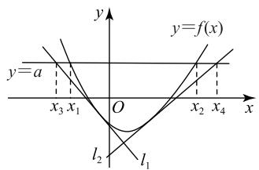
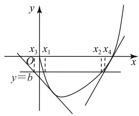
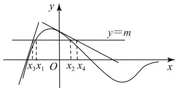
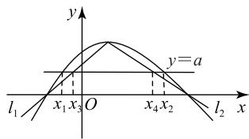
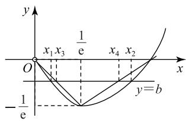
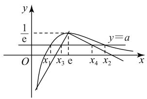
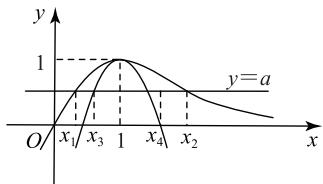

# 处理函数零点差问题的四种逼近策略

王伯龙(特级教师)

(宁夏彭阳县第三中学)

所谓函数零点差问题,是指形如“函数 $g(x)=f(x)-a$ 有两个不同的零点 $x_{1}, x_{2} (x_{1}<x_{2})$ , 则 $x_{2}-x_{1}<m$ 或 $x_{2}-x_{1}>m$ ”这一类问题. 此类问题考查函数的零点、函数的性质、导数运算等内容, 涉及的考点较多, 能有效考查学生的数学运算、逻辑推理等核心素养, 是一类综合性强、难度较大的问题. 常见的处理策略是放缩逼近, 下面通过典型的示例展示.

# 1 切线逼近

类似于不等式 $x_{2} - x_{1} < m(x_{1} < x_{2})$ 的证明问题，如图1所示，可转化为证明不等式 $x_{2} - x_{1} < x_{4} - x_{3} \leqslant m(x_{1} < x_{2}, x_{3} < x_{4})$ 成立，其中 $x_{3}, x_{4}$ 分别是函数 $y = f(x)$ 的两条切线分别与直线 $y = a$ 交点的横坐标.这种转化策略称为切线逼近策略.

text_image

y
y=a
x₃ x₁ O x₂ x₄ x
l₂ l₁
y=f(x)

图1

例1 已知函数 $f(x) = x \ln x$ .

(1)求函数 $f(x)$ 的单调区间；  
(2) 若 $a \leqslant -2$ , 证明: $f(x) \geqslant ax - e^{-3}$ 在 $(0, +\infty)$ 上恒成立;  
(3)若方程 $f(x) = b$ 有两个不相等的实数根 $x_{1}$ ， $x_{2}$ ，且 $x_{1} < x_{2}$ ，证明： $x_{2} - x_{1} < \frac{\mathrm{e}^{-3} + 3b + 2}{2}$ .

(1) $f(x)$ 的单调递减区间为 $(0,\frac{1}{\mathrm{e}})$ ，单调递增区间为 $(\frac{1}{\mathrm{e}}, + \infty)$ （求解过程略）.

(2)令 $g(x) = f(x) - ax + \mathrm{e}^{-3} = x\ln x - ax +$ $\mathrm{e}^{-3}$ ，则 $g^{\prime}(x) = \ln x + 1 - a.$ 由 $g^{\prime}(x) = 0$ ，可得 $x=$ $\mathrm{e}^{a - 1}$ .当 $x\in (0,\mathrm{e}^{a - 1})$ 时， $g^{\prime}(x) <   0$ ，函数 $g(x)$ 单调递减；当 $x\in (\mathrm{e}^{a - 1}, + \infty)$ 时， $g^{\prime}(x) > 0$ ，函数 $g(x)$ 单调

递增，所以 $g_{\min}(x) = g(\mathrm{e}^{a - 1}) = \mathrm{e}^{-3} - \mathrm{e}^{a - 1}$ . 由 $a \leqslant -2$ 得 $a - 1 \leqslant -3$ ，则 $\mathrm{e}^{-3} \geqslant \mathrm{e}^{a - 1}$ ，所以 $g_{\min}(x) \geqslant 0$ 故当 $a \leqslant -2$ 时， $f(x) \geqslant ax - \mathrm{e}^{-3}$ 在 $(0, +\infty)$ 上恒成立.

(3)由(2)易知直线 $y = -2x - e^{-3}$ 为曲线 $f(x) = x \ln x$ 在点 $(\mathrm{e}^{-3}, -3\mathrm{e}^{-3})$ 处的切线，且 $f(x) \geqslant -2x - e^{-3}$ 在 $(1, +\infty)$ 上成立，易知曲线 $f(x)$ 在点 $(1, 0)$ 处的切线方程为 y = x - 1.

下证 $f(x) \geqslant x - 1$ .

令 $\varphi(x)=x\ln x-x+1$ ，则 $\varphi'(x)=\ln x$ 。当 $x\in(0,1)$ 时， $\varphi'(x)<0$ ，函数 $\varphi(x)$ 单调递减；当 $x\in(1,$ $+\infty)$ 时， $\varphi'(x)>0$ ，函数 $\varphi(x)$ 单调递增，所以 $\varphi(x)\geqslant\varphi_{\min}(x)=\varphi(1)=0$ ，所以 $f(x)\geqslant x-1$ 。如图2所示，直线 $y=-2x-e^{-3}$ 与y=b的交点横坐标为 $x_{3}=-\frac{b}{2}-\frac{1}{2}e^{-3}$ ，

text_image

y
x₃ x₁ x₂ x₄
O
y=b

图2

且 $x_{3} < x_{1}$ . 直线 $y = x - 1$ 与 $y = b$ 的交点横坐标为 $x_{4} = b + 1$ , 且 $x_{2} < x_{4}$ , 所以 $x_{2} - x_{1} < x_{4} - x_{3} = b + 1 - \left(-\frac{b}{2} - \frac{1}{2} \mathrm{e}^{-3}\right) = \frac{\mathrm{e}^{-3} + 3b + 2}{2}$ .

例2 已知函数 $f(x) = \frac{1 - x^2}{\mathrm{e}^x}$ .

(1) 求 $f(x)$ 的零点 $x_{0}$ 及曲线 $y=f(x)$ 在 $x=x_{0}$ 处的切线方程；  
（2）设方程 $f(x)=m(m>0)$ 有两个不相等的实数根 $x_{1}, x_{2}$ ，求证： $\left|x_{1}-x_{2}\right|<2-m\left(1+\frac{1}{2e}\right)$ .

(1) $x_0 = \pm 1$ . 当 $x_0 = 1$ 时, 切线方程为 $y =$ $-\frac{2}{e}(x-1)$ ; 当 $x_{0}=-1$ 时, 切线方程为 y=$2\mathrm{e}(x+1)$ (求解过程略).

(2)如图3所示，由(1)知曲线 $y = f(x)$ 在点 $(-1,0)$ 处的切线方程为 $y = 2\mathrm{e}(x + 1)$ .下证当 $x\in$ $(-1,1)$ 时， $2\mathrm{e}(x + 1) > f(x)$ ，即证 $\frac{1 - x}{\mathrm{e}^x} -2\mathrm{e} <   0.$ 令

$g(x)=\frac{1-x}{\mathrm{e}^{x}}-2\mathrm{e}$ ，则 $g'(x)=\frac{x-2}{\mathrm{e}^{x}}<0$ ，所以函数

$g(x)$ 在 $(-1,1)$ 上单调递减，则 $g(x) < g(-1) = 0$ ，
所以 $2\mathrm{e}(x+1)>f(x)$ .

text_image

y
y=m
x₃x₁ O x₂x₄
x

图3

易知曲线 $y = f(x)$ 在点(0,1)处的切线方程为 $y = -x + 1$ . 下证当 $x \in (-1,1)$ 时， $-x + 1 \geqslant f(x)$ ，即证 $e^x - x - 1 \geqslant 0$ . 令 $\varphi(x) = e^x - x - 1$ ，则 $\varphi'(x) = e^x - 1$ . 当 $x \in (-1,0)$ 时， $\varphi'(x) < 0$ ，函数 $\varphi(x)$ 单调递减；当 $x \in (0,1)$ 时， $\varphi'(x) > 0$ ，函数 $\varphi(x)$ 单调递增，所以 $\varphi(x) \geqslant \varphi(0) = 0$ ，所以 $-x + 1 \geqslant f(x)$ .

直线 $y = 2\mathrm{e}(x + 1)$ 与 $y = m$ 的交点的横坐标 $x_{3} = \frac{m}{2\mathrm{e}} -1$ ，且 $x_{3} <   x_{1}$ .直线 $y = -x + 1$ 与 $y = m$ 的交点的横坐标 $x_{4} = 1 - m$ ，且 $x_{2} <   x_{4}$ ，所以

$$
\left| x _ {1} - x _ {2} \right| <   x _ {4} - x _ {3} = 2 - m \left(1 + \frac {1}{2 \mathrm{e}}\right).
$$

# 点评

例1、例2所证的不等式类似于 $x_{2} - x_{1} < m$ $(x_{1} < x_{2})$ ，可采用切线逼近策略.解答的关键是如何找到合适的切线，即切点的坐标.找切点的坐标可用待定系数法，以例1为例来说明.设一条切线的切点为 $(t,t\ln t)$ ，则切线方程为 $y - t\ln t = (\ln t + 1)(x - t)$ ，它与直线 $y = b$ 的交点的横坐标 $x_{3} = \frac{b + t}{\ln t + 1}$ .设另一条切线的切点为 $(h,h\ln h)$ ，则切线方程为 $y - h\ln h = (\ln h + 1)(x - h)$ ，它与直线 $y = b$ 的交点的横坐标 $x_{4} = \frac{b + h}{\ln h + 1}$ ，则

$$
x _ {4} - x _ {3} = \frac {b + h}{\ln h + 1} - \frac {b + t}{\ln t + 1} =
$$

$$
(\frac {1}{\ln h + 1} - \frac {1}{\ln t + 1}) b + (\frac {h}{\ln h + 1} - \frac {t}{\ln t + 1}).
$$

令 $x_{4} - x_{3} = \frac{\mathrm{e}^{-3} + 3b + 2}{2} = \frac{3}{2} b + 1 + \frac{\mathrm{e}^{-3}}{2}$ ，比较可得

$$
\frac {1}{\ln h + 1} - \frac {1}{\ln t + 1} = \frac {3}{2} = 1 - (- \frac {1}{2}), \quad ①
$$

$$
\frac {h}{\ln h + 1} - \frac {t}{\ln t + 1} = 1 + \frac {\mathrm{e} ^ {- 3}}{2} = 1 - (- \frac {\mathrm{e} ^ {- 3}}{2}), \quad ②
$$

于是比较结构得 $\left\{\begin{aligned}\frac{1}{\ln h+1}&=1,\\ \frac{1}{\ln t+1}&=-\frac{1}{2},\end{aligned}\right.$ 解得 $h=1,t=e^{-3}$ ,

即两个切点为 $(1,0)$ ， $(e^{-3},-3e^{-3})$ 。对于例2，用类似的方法可找到切点。

# 2 割线逼近

类似于不等式 $x_{2} - x_{1} > m(x_{1} < x_{2})$ 的证明问题，如图4所示，可转化为证明不等式 $x_{2} - x_{1} > x_{4} - x_{3} \geqslant m(x_{1} < x_{2}, x_{3} < x_{4})$ 成立，其中 $x_{3}, x_{4}$ 分别是函数 $y = f(x)$ 的两条割线 $l_{1}, l_{2}$ 与直线 $y = a$ 交点的横坐标. 这种转化策略称为割线逼近策略.

text_image

y
y=a
l₁ x₁x₃ O x₄x₂ l₂ x

图4

例3 已知函数 $f(x) = a \ln x - x + \frac{1}{x} (a > 0)$ .

（1）当 $x \geqslant 1$ 时， $f(x) \leqslant 0$ 恒成立，求实数 a 的取值范围；  
(2) 当 $a = 1$ 时, $g(x) = xf(x) + x^2 - 1$ , 方程 $g(x) = b$ 的根为 $x_1, x_2$ , 且 $x_1 < x_2$ , 求证: $x_2 - x_1 > 1 + eb$ .

(1) $(0,2]$ (求解过程略).

解析 (2) 当 $a = 1$ 时, $g(x) = x \ln x$ . 作函数 $y = g(x)$ 及 $y = b$ 的图像, 如图5所示. 易知 $y = g(x)$ 的极值点为 $(\frac{1}{e}, -\frac{1}{e})$ , 与 $x$ 轴的交点为 $(1,0)$ .

text_image

y
x₁x₃ 1/e x₄ x₂
O
-1/e
y=b

图5

过点 $(\frac{1}{\mathrm{e}}, -\frac{1}{\mathrm{e}})$ 和 $(0,0)$ 的割线 $l_{1}:y = -x$ ，它与 $y = b$ 的交点的横坐标 $x_{3} = -b.$ 令 $h(x) = x\ln x + x$ 当 $x\in (0,\frac{1}{\mathrm{e}})$ 时， $\ln x + 1 <   0$ ，所以当 $x\in (0\frac{1}{\mathrm{e}})$ 时， $h(x) = x\ln x + x <   0$ ，即 $x\ln x <   - x$ ，故 $x_{1} <   x_{3}$

过点 $(\frac{1}{\mathrm{e}}, -\frac{1}{\mathrm{e}})$ 和(1,0)的割线 $l_{2}:y = \frac{1}{\mathrm{e} - 1}(x - 1)$ ，它与 $y = b$ 的交点的横坐标 $x_{4} = (\mathrm{e} - 1)b + 1.$ 令 $\varphi (x) = \ln x - \frac{1}{\mathrm{e} - 1}(1 - \frac{1}{x})$ ，则 $\varphi '(x) = \frac{(\mathrm{e} - 1)x - 1}{(\mathrm{e} - 1)x^2}$ .

当 $x \in (\frac{1}{\mathrm{e} - 1}, 1)$ 时， $\varphi'(x) > 0$ ，函数 $\varphi(x)$ 在 $(\frac{1}{\mathrm{e} - 1}, 1)$ 上单调递增，所以 $\varphi(x) < \varphi(1) = 0$ ；当 $x \in (\frac{1}{\mathrm{e}}, \frac{1}{\mathrm{e} - 1})$ 时， $\varphi'(x) < 0$ ，函数 $\varphi(x)$ 在 $(\frac{1}{\mathrm{e}}, \frac{1}{\mathrm{e} - 1})$ 上单调递减，所以 $\varphi(x) < \varphi(\frac{1}{\mathrm{e}}) = 0$ ，则当 $x \in (\frac{1}{\mathrm{e}}, 1)$ 时， $\varphi(x) < 0$ ，所以 $\ln x < \frac{1}{\mathrm{e} - 1}(1 - \frac{1}{x})$ ，即 $x \ln x < \frac{1}{\mathrm{e} - 1}(x - 1)$ ，故 $x_4 < x_2$ ，于是 $x_2 - x_1 > x_4 - x_3 = (\mathrm{e} - 1)b + 1 + b = 1 + eb$ .

例4 已知函数 $f(x) = \frac{\ln x}{x}$ 与 $y = a$ 的图像有两个交点 $x_{1}, x_{2}$ , 且 $x_{1} < x_{2}$ .

(1) 求 a 的取值范围；  
(2) 证明: $x_{2} - x_{1} > (\mathrm{e}^{2} - 2)(1 - a\mathrm{e})$ .

# 解析

(1)作出函数 $f(x)$ 的图像, 如图 6 所示, 易得 a 的取值范围为 $(0, \frac{1}{\mathrm{e}})$ (求解过程略).

text_image

y
1/e
y=a
O
x₁ x₃ e x₄ x₂
x

图6

(2)由(1)知函数 $f(x)$ 的极值点为 $(\mathrm{e},\frac{1}{\mathrm{e}})$ . 过点 $(\mathrm{e},\frac{1}{\mathrm{e}})$ 和点 $(2,0)$ 的割线为 $y=\frac{1}{\mathrm{e}^{2}-2\mathrm{e}}(x-2)$ ，它与 y=a 的交点横坐标为 $x_{3}=(\mathrm{e}^{2}-2\mathrm{e})a+2$ . 过点 $(\mathrm{e},\frac{1}{\mathrm{e}})$ 和点 $(\mathrm{e}^{2},0)$ 的割线为 $y=\frac{1}{\mathrm{e}^{2}-\mathrm{e}^{3}}(x-\mathrm{e}^{2})$ ，它与 y=a 的交点的横坐标为 $x_{4}=(\mathrm{e}^{2}-\mathrm{e}^{3})a+\mathrm{e}^{2}$ .

令 $g(x) = \ln x - \frac{1}{\mathrm{e}^2 - 2\mathrm{e}} (x^2 - 2x)$ ，则

$$
g ^ {\prime} (x) = - \frac {2 x ^ {2} - 2 x + 2 \mathrm{e} - \mathrm{e} ^ {2}}{(\mathrm{e} ^ {2} - 2 \mathrm{e}) x}.
$$

令 $\varphi(x)=2x^{2}-2x+2e-e^{2}$ ，则当 $x\in(1,e)$ 时， $\varphi(x)$ 单调递增，且 $\varphi(1)\varphi(e)<0$ ，所以 $\varphi(x)$ 存在唯一的零点 $x_{0}\in(1,e)$ 。当 $x\in(1,x_{0})$ 时， $\varphi(x)<0$ ，即 $g'(x)>0$ ；当 $x\in(x_{0},e)$ 时， $\varphi(x)>0$ ，即 $g'(x)<0$ ，故 $x_{0}$ 是 $g(x)$ 的最大值点。当 $x\in(1,e)$ 时， $g(x)>\min\{g(1),g(e)\}=g(e)=0$ ，所以

$$
\ln x > \frac {1}{\mathrm{e} ^ {2} - 2 \mathrm{e}} (x ^ {2} - 2 x),
$$

故 $\frac{\ln x}{x}>\frac{1}{e^{2}-2e}(x-2)$ ，因而 $x_{1}<x_{3}$ .

令 $h(x) = \ln x - \frac{1}{\mathrm{e}^2 - \mathrm{e}^3} (x^2 -\mathrm{e}^2 x)$ ，则

$$
h ^ {\prime} (x) = - \frac {2 x ^ {2} - \mathrm{e} ^ {2} x + \mathrm{e} ^ {3} - \mathrm{e} ^ {2}}{(\mathrm{e} ^ {2} - \mathrm{e} ^ {3}) x}.
$$

当 $x \in (\mathrm{e}, +\infty)$ 时，有

$$
2 x ^ {2} - \mathrm{e} ^ {2} x + \mathrm{e} ^ {3} - \mathrm{e} ^ {2} > 2 \mathrm{e} ^ {2} - \mathrm{e} ^ {3} + \mathrm{e} ^ {3} - \mathrm{e} ^ {2} = \mathrm{e} ^ {2} > 0,
$$

所以 $h'(x) > 0, h(x)$ 在 $(e, +\infty)$ 上单调递增，故 $h(x) > h(e) = 0.$ 因而 $\ln x > \frac{1}{e^{2} - e^{3}} (x^{2} - e^{2}x)$ ，即 $\frac{\ln x}{x} > \frac{1}{e^{2} - e^{3}} (x - e^{2})$ ，所以 $x_{4} < x_{2}$ ，故

$$
\begin{array}{l} x _ {2} - x _ {1} > x _ {4} - x _ {3} = \left(\mathrm{e} ^ {2} - \mathrm{e} ^ {3}\right) a + \mathrm{e} ^ {2} - \\ (\mathrm{e} ^ {2} - 2 \mathrm{e}) a - 2 = (\mathrm{e} ^ {2} - 2) (1 - a \mathrm{e}). \\ \end{array}
$$

例3、例4是证明类似于 $x_{2} - x_{1} > m(x_{1} < x_{2})$ 的不等式，可采用割线放缩逼近策略.解答的关键是构造两条割线.构造割线的方法是取极值点为两条割线的一个公共点,而另一个点为割线与横轴的交点.以例4为例说明用待定系数法求割线与横轴交点的方法.过点 $\left(\mathrm{e},\frac{1}{\mathrm{e}}\right)$ 和 $(m,0)$ 的一条割线方程为 $y=\frac{1}{\mathrm{e}^{2}-me}(x-m)$ ,它与直线y=a的交点的横坐标为 $x_{3}=e^{2}a+(1-ea)m$ ;另一条过点 $\left(\mathrm{e},\frac{1}{\mathrm{e}}\right)$ 和 $(n,0)$ 的割线为 $y=\frac{1}{\mathrm{e}^{2}-en}(x-n)$ ,它与直线y=a的交点的横坐标为 $x_{4}=e^{2}a+(1-ea)n$ .令 $x_{4}-x_{3}=(e^{2}-2)(1-ae)$ ,则

$$
\mathrm{e} ^ {2} a + (1 - \mathrm{e} a) n - \mathrm{e} ^ {2} a - (1 - \mathrm{e} a) m = (\mathrm{e} ^ {2} - 2) (1 - a \mathrm{e}),
$$

所以 $n-m=e^{2}-2$ . 结合图像取 $m=2, n=e^{2}$ ，所以两条割线与横轴的交点分别为 $(2,0)$ ， $(e^{2},0)$ .

# 3 二次函数拟合逼近

类似于不等式 $x_{2}-x_{1}>\frac{\sqrt{\Delta}}{|a|}(x_{1}<x_{2})$ (其中 $\Delta$ 为一元二次方程根的判别式) 的证明问题, 可构造二次函数拟合逼近.

例5 已知函数 $f(x) = \frac{x}{\mathrm{e}^{x - 1}} - a$ 的两个零点为

$$
x _ {1}, x _ {2}.
$$

(1) 求 $a$ 的取值范围；

(2) 证明： $\left|x_{1}-x_{2}\right|>2\sqrt{1-a}$ .

(1)作出函数 $g(x)=\frac{x}{\mathrm{e}^{x-1}}$ 的图像,如图 7 所示, 易知 a 的取值范围为 $(0,1)$ (求解过程略).

line

| x    | y (实线) | y (虚线) |
| ---- | -------- | -------- |
| x₁   | 0        | 0        |
| x₃   | 1        | 1        |
| 1    | 1        | 1        |
| x₄   | 0        | 0        |
| x₂   | 0        | 0        |

图 7

(2)由(1)知函数 $g(x)$ 的极值点为 $(1,1)$ ，构造二次函数 $h(x) = -(x - 1)^2 + 1$ ，则它与 $y = a$ 的交点横坐标为 $x_3, x_4$ 满足 $|x_3 - x_4| = 2\sqrt{1 - a}$ . 下证当 $x \in (0, +\infty)$ 时， $g(x) \geqslant h(x)$ ，即证 $\frac{x}{\mathrm{e}^{x - 1}} \geqslant -x^2 + 2x$ ，只需证 $(2 - x)\mathrm{e}^{x - 1} - 1 \leqslant 0$ .

令 $\varphi(x) = (2 - x)\mathrm{e}^{x - 1} - 1$ ，则 $\varphi^{\prime}(x) = (1 - x)\cdot$ $\mathrm{e}^{x - 1}$ .当 $x\in (0,1)$ 时， $\varphi^{\prime}(x) > 0$ ；当 $x\in (1, + \infty)$ 时， $\varphi^{\prime}(x) <   0.$ 因而当 $x\in (0, + \infty)$ 时， $\varphi (x)\leqslant \varphi (1) = 0,$ 即 $(2 - x)\mathrm{e}^{x - 1} - 1\leqslant 0$ ，所以 $x_{1} <   x_{3},x_{4} <   x_{2}$ ，故

$$
\left| x _ {1} - x _ {2} \right| > \left| x _ {3} - x _ {4} \right| = 2 \sqrt {1 - a}.
$$

# 点评

本题的证明思路是构造二次函数拟合逼近，解题的关键是构造以函数 $g(x)$ 的极值点为顶点的二次函数,如何确定二次项系数呢?常用的方法是待定系数法.在本例中,设二次函数为 $h(x)=m(x-1)^{2}+1$ , 它与 y=a 的交点横坐标为 $x_{3}, x_{4}$ . 由距离公式得 $\left|x_{3}-x_{4}\right|=2\sqrt{\frac{a-1}{m}}$ . 令 $\left|x_{3}-x_{4}\right|=2\sqrt{1-a}$ , 得 $2\sqrt{\frac{a-1}{m}}=2\sqrt{1-a}$ , 解得 m=-1, 于是构造函数 $h(x)=-\left(x-1\right)^{2}+1$ 证明不等式.

# 4 寻点逼近

类似于不等式 $x_{2} - x_{1} < b - a (b > a)$ 的证明问题，可利用零点存在定理寻找 $c$ ，使得 $a < x_{1} < c < x_{2} < b$ 成立，从而 $x_{2} - x_{1} < b - a$ 成立.

例6 已知函数 $f(x) = \frac{\mathrm{e}^x}{x} - \ln x + x - 2a (a \in \mathbf{R})$ .

(1) 求 $f(x)$ 的单调区间.

(2)若函数 $f(x)$ 有两个不同的零点.

(i) 求实数 a 的取值范围；

(ii) 证明: $|x_{2} - x_{1}| < \frac{4a^{2} - 2a - 1}{2a - 1}$ .

(1) 函数 $f(x)$ 的单调递减区间为 $(0,1)$ ，单调递增区间为 $(1,+\infty)$ （求解过程略）.

(2)(i)由(1)知 x=1 是函数 $f(x)$ 的极小值点，所以 $f(1)=\mathrm{e}+1-2a<0$ ，即 $a>\frac{\mathrm{e}+1}{2}$ 时， $f(x)$ 有两个不同的零点.

(ii) 由 (i) 知 $2a - 1 > \mathrm{e}$ , 所以 $0 < \frac{1}{2a - 1} < \frac{1}{\mathrm{e}}$ . 当 $x \in (0, +\infty)$ 时, 由熟知的不等式 $\ln x \leqslant x - 1$ , 得 $f(x) \geqslant \frac{\mathrm{e}^x}{x} + 1 - 2a$ , 所以

$$
f \left(\frac {1}{2 a - 1}\right) \geqslant (2 a - 1) \mathrm{e} ^ {\frac {1}{2 a - 1}} + 1 - 2 a =
$$

$$
(2 a - 1) \left(\mathrm{e} ^ {\frac {1}{2 a - 1}} - 1\right) > 0.
$$

由零点存在定理可知 $\frac{1}{2a - 1} < x_{1} < 1.$ 又 $f(2a) = \frac{\mathrm{e}^{2a}}{2a} -\ln 2a$ ，令 $2a = t$ ，则

$$
f (t) = \frac {\mathrm{e} ^ {t}}{t} - \ln t (t \in (\mathrm{e} + 1, + \infty)),
$$

所以 $f'(t)=\frac{(t-1)\mathrm{e}^{t}-t}{t^{2}}$ .

设 $g(t)=(t-1)\mathrm{e}^{t}-t$ ，则 $g'(t)=te^{t}-1>\mathrm{e}\cdot\mathrm{e}^{\mathrm{e}}-1>0$ ，所以 $f'(t)>0$ ，于是 $f(t)$ 在 $(\mathrm{e},+\infty)$ 上单调递增。又 $2a>\mathrm{e}+1>\mathrm{e}$ ，所以

$$
f (2 a) > f (\mathrm{e}) = \mathrm{e} ^ {\mathrm{e} - 1} - 1 > 0.
$$

由零点存在定理知 $1 < x_{2} < 2a$

综上， $\frac{1}{2a-1}<x_{1}<1<x_{2}<2a$ ，所以 $|x_{2}-x_{1}|<2a-\frac{1}{2a-1}=\frac{4a^{2}-2a-1}{2a-1}$ .

点评 本例的证明，先将 $|x_{2} - x_{1}| < \frac{4a^{2} - 2a - 1}{2a - 1}$ 转化为 $|x_{2} - x_{1}| < 2a - \frac{1}{2a - 1}$ , 再找出函数 $f(x)$ 的零点 $x = 1$ , 然后通过零点存在定理证得 $\frac{1}{2a - 1} < x_{1} < 1 < x_{2} < 2a$ 成立.

函数零点差问题解法灵活多样,要因题而异,选择合适的方法,才能顺利解题.因此,在平时的教学中教师要多渗透放缩逼近的思想,让学生在思考中体验获取成功的喜悦.

(完)