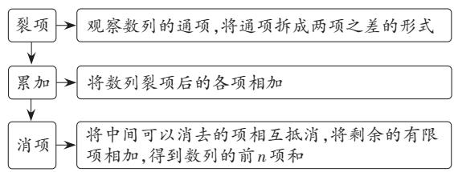
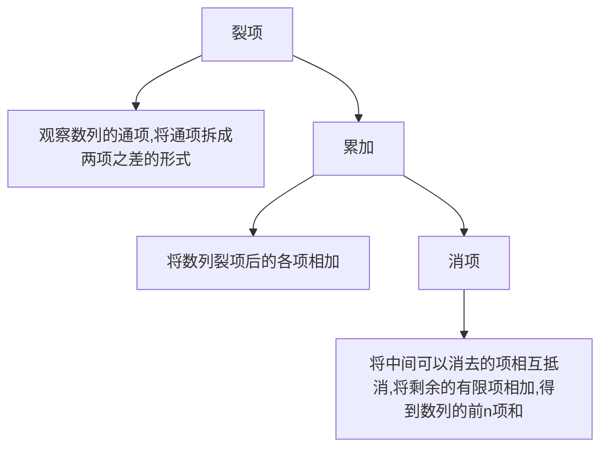

# 学会裂项 求和无忧

——从一道数列求和高考题谈起

喀什大学附属中学(844000) 张红曼

[摘 要]文章以2022年一道数列求和高考题为引,结合几道典型例题,分析探讨裂项相消法的主要类型及应用,以拓宽学生的思维路径。

[关键词]数列求和;高考题;裂项相消法

[中图分类号] G633.6

[文献标识码] A

数列求和历来是高考的必考题型,尤其是对裂项相消法的考查更为频繁。下面以2022年新高考Ⅰ卷第17题为引,结合几道典型例题,探究裂项相消法的主要类型及应用,以拓宽学生的思维路径。

# 一、高考试题

(2022年新高考Ⅰ卷第17题)记 $S_{n}$ 为数列 $\left\{a_{n}\right\}$ 的前n项和,已知 $a_{1}=1,\left\{\frac{S_{n}}{a_{n}}\right\}$ 是公差为 $\frac{1}{3}$ 的等差数列。(1)求 $\left\{a_{n}\right\}$ 的通项公式;(2)证明: $\frac{1}{a_{1}}+\frac{1}{a_{2}}+\cdots+\frac{1}{a_{n}}<2$ 。

分析:本题是数列内容典型的考法,第(1)小题考查求数列的通项公式,可以先利用等差数列的通项公式求得 $\frac{S_{n}}{a_{n}}=1+\frac{1}{3}(n-1)=\frac{n+2}{3}$ ,得到 $S_{n}=\frac{(n+2)a_{n}}{3}$ ,再利用数列的和与项的关系得到当 $n\geqslant2$ 时, $a_{n}=S_{n}-S_{n-1}=\frac{(n+2)a_{n}}{3}-\frac{(n+1)a_{n-1}}{3}$ ,将其变形为 $\frac{a_{n}}{a_{n-1}}=\frac{n+1}{n-1}(n\geqslant2)$ ,最后利用累积法求得 $a_{n}=\frac{n(n+1)}{2}$ ,并检验对于n=1也成立,于是得到 $\left\{a_{n}\right\}$ 的通项公式 $a_{n}=\frac{n(n+1)}{2}$ ;第(2)小题可以采用裂项相消法求证,将 $\frac{1}{a_{n}}$ 写成 $2\left(\frac{1}{n}-\frac{1}{n+1}\right)$ ,于是得到 $\left.\frac{1}{a_{1}}+\frac{1}{a_{2}}+\cdots+\frac{1}{a_{n}}=2\left(1-\frac{1}{2}+\frac{1}{2}-\frac{1}{3}+\cdots+\frac{1}{n}-\frac{1}{n+1}\right)=2\left(1-\frac{1}{n+1}\right)<2\circ$

[文章编号] 1674-6058(2024)32-0021-03

本题作为数列问题典型考题,聚焦了两大考查重点:数列通项和数列求和。本文暂不讨论数列通项,仅探究如何运用裂项相消法进行数列求和。

# 二、裂项相消法的原理

裂项相消法的作用在于通过把一个数列的每一项分解,然后重新组合,使之能消去一些项,最终化简求和。

裂项相消法的基本步骤见图1。

flowchart

图 1 裂项相消法的基本步骤

裂项原则:一般是前边裂几项,后边就裂几项,直到发现被消去项的规律为止。

消项规律: 消项后前边剩几项, 后边就剩几项; 前边剩第几项, 后边就剩倒数第几项。

在应用裂项相消法时需注意,抵消后不一定只剩第一项和最后一项,也可能前面剩两项,后面剩两项,还需注意有时要调整前面的系数,使裂项前后等式两边保持相等。

# 三、裂项相消法的运用类型

# (一)等差型

所谓等差型,用数学语言描述为:若等差数列 $\left\{a_{n}\right\}$ 的各项不为零,且公差为d,则 $\frac{1}{a_{n}a_{n+1}}=\frac{1}{d}\left(\frac{1}{a_{n}}-\frac{1}{a_{n+1}}\right)$ ,于是 $\sum_{i=1}^{n}\frac{1}{a_{i}a_{i+1}}=\frac{1}{d}\left(\frac{1}{a_{1}}-\frac{1}{a_{n+1}}\right)$ 。这种类型一般

出现在中档题中,如上文提到的高考题就是属于这种类型。那么等差型裂项求和应如何求解呢?以下结合例题进行分析。

[例1]记 $S_{n}$ 是公差不为零的等差数列 $\{a_{n}\}$ 的前 $n$ 项和，若 $S_{3} = 6, a_{3}$ 是 $a_{1}$ 和 $a_{9}$ 的等比中项。(1)求数列 $\{a_{n}\}$ 的通项公式；(2)记 $b_{n} = \frac{1}{a_{n} \cdot a_{n+1} \cdot a_{n+2}}$ ，求数列 $\{b_{n}\}$ 的前20项和。

解析：(1)由题意可得 $a_{n} = a_{1} + (n - 1)d = n$ ， $n\in \mathbf{N}^*$ ，过程略；(2)由(1)可知数列 $\{a_n\}$ 是以1为首项、公差为1的等差数列，所以数列 $\{b_n\}$ 的通项公式为 $b_{n} = \frac{1}{n(n + 1)(n + 2)}$ ，可对它进行裂项求和：设数列 $\{b_n\}$ 的前 $n$ 和为 $T_{n}$ ，因为 $b_{n} = \frac{1}{n(n + 1)(n + 2)} = \frac{1}{2}\left(\frac{1}{n(n + 1)} -\frac{1}{(n + 1)(n + 2)}\right)$ ，则 $T_{n} = \frac{1}{2}\left(\frac{1}{1\times 2} -\frac{1}{2\times 3} +\frac{1}{2\times 3} -\frac{1}{3\times 4} +\dots +\frac{1}{n(n + 1)} -\frac{1}{(n + 1)(n + 2)}\right) =$ $\frac{1}{2}\left(\frac{1}{2} -\frac{1}{(n + 1)(n + 2)}\right)$ 所以 $T_{20} = \frac{1}{2}\times \left(\frac{1}{2} -\frac{1}{21\times 22}\right) =$ $\frac{115}{462}$ 所以数列 $\{b_n\}$ 的前20项和为 $\frac{115}{462}$ 。

[例2]等比数列 $\{a_{n}\}$ 中，首项 $a_1 = 1$ ，前 $n$ 项和为 $S_{n}$ ，且满足 $4(a_{1} + a_{3}) = S_{4}\circ (1)$ 求数列 $\{a_{n}\}$ 的通项公式；(2)若 $b_{n} = (n + 1)\cdot \log_{3}a_{n + 1}$ ，求数列 $\left\{\frac{4n + 2}{b_n^2}\right\}$ 的前 $n$ 项和 $T_{n}\circ$

解析:(1)利用基本量法,不难得到 $a_{n}=3^{n-1}$ ,过程略。(2)由题意可得 $b_{n}=(n+1)\log_{3}3^{n}=n(n+1)$ ,所以 $\frac{4n+2}{b_{n}^{2}}=\frac{4n+2}{n^{2}(n+1)^{2}}$ ,因为分母是一个等差数列的连续两项的平方的积,所以可以考虑用裂项相消法求和,不难发现 $\frac{4n+2}{n^{2}(n+1)^{2}}=2\left(\frac{1}{n^{2}}-\frac{1}{(n+1)^{2}}\right)$ ,于是 $T_{n}=2\left(1-\frac{1}{2^{2}}\right)+2\left(\frac{1}{2^{2}}-\frac{1}{3^{2}}\right)+\cdots+2\left(\frac{1}{n^{2}}-\frac{1}{(n+1)^{2}}\right)=2\left(1-\frac{1}{2^{2}}+\frac{1}{2^{2}}-\frac{1}{3^{2}}+\cdots+\frac{1}{n^{2}}-\frac{1}{(n+1)^{2}}\right)=2-\frac{2}{(n+1)^{2}}$ 。

评注:从以上两道例题可以观察到,等差型裂项求和的解题方法有一定的规律可循,但教学中仍须提醒学生:具体问题具体分析,合理配凑,才会有所收获。

# (二)根式型

所谓根式型,用数学语言描述为:若等差数列 $\left\{a_{n}\right\}(a_{n}\geqslant0)$ 的公差为d,则 $\frac{1}{\sqrt{a_{n}}+\sqrt{a_{n+1}}}=\frac{1}{d}(\sqrt{a_{n+1}}-\sqrt{a_{n}})$ ,于是 $\sum_{i=1}^{n}\frac{1}{\sqrt{a_{i}}+\sqrt{a_{i+1}}}=\frac{1}{d}(\sqrt{a_{n+1}}-\sqrt{a_{1}})$ 。

[例3](../../初中/课本/【2024版】【北师大版】/【2024版】【北师大版】七年级上册数学/生活中的截面.md)数列 $\left\{a_{n}\right\}$ 的通项公式为 $a_{n}=\frac{1}{\sqrt{n+1}+\sqrt{n}}$ ，若该数列的前k项和等于5，则k=\_\_\_\_。(2)正项数列 $\left\{a_{n}\right\}$ 满足 $a_{n}^{2}+\sqrt{n}\cdot a_{n}-2n=0$ ，记[x]表示不超过x的最大整数，则 $\left[\sum_{i=1}^{100}\frac{1}{a_{i}}\right]=$ \_\_\_\_。

解析:(1)设数列 $\left\{a_{n}\right\}$ 的前n项和为 $S_{n}$ ，因为 $a_{n}=\frac{1}{\sqrt{n+1}+\sqrt{n}}=\sqrt{n+1}-\sqrt{n}$ ，所以 $S_{k}=\sqrt{2}-1+\sqrt{3}-\sqrt{2}+\cdots+\sqrt{k+1}-\sqrt{k}=\sqrt{k+1}-1=5$ ，解得k=35。

(2) 因为 $a_{n}^{2} + \sqrt{n} \cdot a_{n} - 2n = 0$ ，即 $(a_{n} - \sqrt{n})(a_{n} + 2\sqrt{n}) = 0$ ，解得 $a_{n} = \sqrt{n}$ 。又 $\sum_{i=1}^{100} \frac{1}{a_{i}} = \frac{1}{\sqrt{1}} + \frac{1}{\sqrt{2}} + \frac{1}{\sqrt{3}} + \cdots + \frac{1}{\sqrt{100}}$ ，当 $n \geqslant 2$ 时， $\frac{1}{\sqrt{n}} = \frac{2}{2\sqrt{n}} < \frac{2}{\sqrt{n} + \sqrt{n-1}} = 2(\sqrt{n} - \sqrt{n-1})$ ，故 $\sum_{i=1}^{100} \frac{1}{a_{i}} < 1 + 2(\sqrt{2} - 1) + 2(\sqrt{3} - \sqrt{2}) + \cdots + 2(\sqrt{100} - \sqrt{99}) = 2(\sqrt{100} - 1) + 1 = 19$ 。又对于 $n \in N^{+}$ 都有 $\frac{1}{\sqrt{n}} = \frac{2}{2\sqrt{n}} > \frac{2}{\sqrt{n} + \sqrt{n+1}} = 2(\sqrt{n+1} - \sqrt{n})$ ，故 $\sum_{i=1}^{100} \frac{1}{a_{i}} > 2(\sqrt{2} - 1) + 2(\sqrt{3} - \sqrt{2}) + \cdots + 2(\sqrt{101} - \sqrt{100}) = 2(\sqrt{101} - 1) > 18$ ，所以 $18 < \sum_{i=1}^{100} \frac{1}{a_{i}} < 19$ ，故 $\left[\sum_{i=1}^{100} \frac{1}{a_{i}}\right] = 18$ 。

评注: 根式型裂项求和题在高考中属于基础题, 其解答难度在于“裂项”。教学中教师应引导学生总结归纳, 积累方法, 以灵活运用“裂项”技巧。

# (三)指数型

若问题中将数列裂项求和与指数运算相结合，

则会使“裂项”难度陡增。

[例4]已知正项数列 $\{a_{n}\}$ 中， $a_1 = 1, S_n$ 是其前 $n$ 项和，且满足 $S_{n+1} = (\sqrt{S_n} + S_1)^2$ 。（1）求数列 $\{a_n\}$ 的通项公式；(2)已知数列 $\{b_n\}$ 满足 $b_n = (-1)^{n+1} \frac{a_n + 1}{a_na_{n+1}}$ 设数列 $\{b_n\}$ 的前 $n$ 项和为 $T_n$ ，求 $T_n$ 的最小值。

解析：(1) $a_{n}=2n-1(n\in\mathbf{N}^{*})$ ，过程略。(2)因为 $b_{n}=(-1)^{n+1}\frac{a_{n}+1}{a_{n}a_{n+1}}=(-1)^{n+1}\frac{2n}{(2n-1)(2n+1)}=\frac{(-1)^{n+1}}{2}\left(\frac{1}{2n-1}+\frac{1}{2n+1}\right)$ ，所以 $T_{n}=\frac{1}{2}\left[\left(1+\frac{1}{3}\right)-\left(\frac{1}{3}+\frac{1}{5}\right)+\cdots+(-1)^{n+1}\left(\frac{1}{2n-1}+\frac{1}{2n+1}\right)\right]=\frac{1}{2}\left[1+(-1)^{n+1}\frac{1}{2n+1}\right]$ ，所以当n为奇数时， $T_{n}=\frac{1}{2}\left(1+\frac{1}{2n+1}\right)>\frac{1}{2}$ ；当n为偶数时， $T_{n}=\frac{1}{2}\left(1-\frac{1}{2n+1}\right)$ ，由 $\left\{T_{n}\right\}$ 递增，得 $T_{n}\geqslant T_{2}=\frac{2}{5}$ ，所以 $T_{n}$ 的最小值为 $\frac{2}{5}$ 。

[例5]已知等比数列 $\{a_{n}\}$ 公比为正数，其前 $n$ 项和为 $S_{n}$ ，且 $a_{4} = 4a_{2}, S_{4} = 30$ 。数列 $\{b_{n}\}$ 满足： $b_{1} = \frac{5}{2}, a_{n+1}b_{n+1} = a_{n}b_{n} + 2n + 3, n \in \mathbb{N}^{*}$ 。(1)求数列 $\{a_{n}\}$ ， $\{b_{n}\}$ 的通项公式；(2)求证： $\frac{b_{1}}{1 \times 2} + \frac{b_{2}}{2 \times 3} + \frac{b_{3}}{3 \times 4} + \cdots + \frac{b_{n-1}}{(n-1) \times n} + \frac{b_{n}}{n \times (n+1)} < 2$ 。

$$
\begin{array}{l} \frac {n ^ {2} + n + n + 2}{n \times (n + 1) \times 2 ^ {n + 1}} = 2 \times \left(\frac {1}{2 ^ {n + 1}} + \frac {1}{n \times 2 ^ {n}} - \right. \\ \left. \frac {1}{(n + 1) \times 2 ^ {n + 1}}\right), \text {所以} \frac {b _ {1}}{1 \times 2} + \frac {b _ {2}}{2 \times 3} + \frac {b _ {3}}{3 \times 4} + \dots + \\ \frac {b _ {n - 1}}{(n - 1) \times n} + \frac {b _ {n}}{n \times (n + 1)} = 2 \times \left(\frac {1}{2 ^ {2}} + \frac {1}{1 \times 2 ^ {1}} - \right. \\ \frac {1}{2 \times 2 ^ {2}} + \frac {1}{2 ^ {3}} + \frac {1}{2 \times 2 ^ {2}} - \frac {1}{3 \times 2 ^ {3}} + \dots + \frac {1}{2 ^ {n + 1}} + \frac {1}{n \times 2 ^ {n}} - \\ \left. \frac {1}{(n + 1) \times 2 ^ {n + 1}}\right) = 2 \times \left(\frac {\frac {1}{2 ^ {2}} \left(1 - \frac {1 ^ {n}}{2}\right)}{1 - \frac {1}{2}} + \frac {1}{1 \times 2 ^ {1}} - \right. \\ \end{array}
$$

解析：(1) $a_{n}=2^{n},b_{n}=\frac{n^{2}+2n+2}{2^{n}}$ ，过程略。

(2) 解法一: $\frac{b_n}{n \times (n + 1)} = \frac{n^2 + 2n + 2}{n \times (n + 1) \times 2^n} = 2 \times$

$$
\left. \frac {1}{(n + 1) \times 2 ^ {n + 1}}\right) = 2 \left(1 - \frac {1 ^ {n + 1}}{2} - \frac {1}{(n + 1) \times 2 ^ {n + 1}}\right) <   2 。
$$

$$
\begin{array}{l} \frac {b _ {n - 1}}{(n - 1) \times n} + \frac {b _ {n}}{n \times (n + 1)} = 2 \times \left(\frac {2}{1 \times 2} - \frac {3}{2 \times 2 ^ {2}} + \right. \\ \left. \frac {3}{2 \times 2 ^ {2}} - \frac {4}{3 \times 2 ^ {3}} + \dots + \frac {n + 1}{n \times 2 ^ {n}} - \frac {n + 2}{(n + 1) \times 2 ^ {n + 1}}\right) = 2 \times \\ \left(1 - \frac {n + 2}{(n + 1) \times 2 ^ {n + 1}}\right) <   2 _ {\circ} \\ \end{array}
$$

解法二： $\frac{b_{n}}{n\times(n+1)}=\frac{n^{2}+2n+2}{n\times(n+1)\times2^{n+1}}=2\times\left(\frac{n+1}{n\times2^{n}}-\right.$

$\left.\frac{n+2}{(n+1)\times2^{n+1}}\right)$ ，所以 $\frac{b_{1}}{1\times2}+\frac{b_{2}}{2\times3}+\frac{b_{3}}{3\times4}+\cdots+$

评注:从以上两道例题可以看出,“裂项”中加入指数运算,题目难度直线上升,当通项中出现 $(-1)^{n+1}$ 时,往往将通项分裂成 $(-1)^{n+1}$ 乘以两项之和,然后借助 $(-1)^{n+1}$ 得到一正一负的项,相互抵消;当通项中出现 $a^{n}$ ,应将通项分裂成含有指数的两项之差,而这两项刚好是某数列的连续两项。

裂项相消求和类型多样,除了以上三种,还包括对数型,如 $\log_{a}\frac{a_{n+1}}{a_{n}}=\log_{a}a_{n+1}-\log_{a}a_{n}$ ; 三角函数型,如 $a_{n}=\tan n\cdot\tan(n-1),\tan1=\tan\left[n-(n-1)\right]=\frac{\tan n-\tan(n-1)}{1+\tan n\cdot\tan(n-1)}$ , 则 $\tan n\cdot\tan(n-1)=\frac{\tan n-\tan(n-1)}{\tan1}-1,a_{n}=\frac{\tan n-\tan(n-1)}{\tan1}-1;$ 阶乘型, 如 $\frac{n}{(n+1)!} = \frac{1}{n!} - \frac{1}{(n+1)!}$ 。

总之,数列问题中裂项相消法的考查方式灵活多样,教学中应引导学生深入理解其基本原理和应用技巧。教师应通过分析不同题型的特点,帮助学生掌握裂项相消法的关键点——裂项,让学生通过多练习,感悟方法,并积累裂项相消法的经验,以使学生获得更深层次的理解和提升。

(责任编辑 梁桂广)