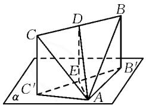

# 对勾函数在解题中的应用

# 河南省获嘉县第一中学 王清香

摘要: 对勾函数是高中数学中非常重要的一类函数, 在解题中应用广泛. 本文中结合例题展示对勾函数在三角函数、立体几何、平面向量问题情境中的应用, 供参考.

关键词: 对勾函数; 高中数学; 解题; 应用

高中阶段, 函数 $f(x)=ax+\frac{b}{x}(a,b$ 同号) 因图象形状似双勾, 故被称为对勾函数. 当 a>0, b>0 时, 函数图象在第一、三象限, 顶点坐标分别为 $\left(\sqrt{\frac{b}{a}},2\sqrt{ab}\right)$ , $\left(-\sqrt{\frac{b}{a}},-2\sqrt{ab}\right)$ ; 当 a<0, b<0 时, 函数图象在第二、四象限, 顶点坐标分别为 $\left(-\sqrt{\frac{b}{a}},2\sqrt{ab}\right)$ , $\left(\sqrt{\frac{b}{a}},-2\sqrt{ab}\right)$ . 这些性质常用于高中数学求最值、求取值范围问题中.

# 1 三角函数问题

三角函数在高中数学中占有重要地位,部分习题设问巧妙,综合考查三角恒等变换、三角函数的性质、对勾函数的性质等知识.其中运用对勾函数解三角函数习题,既要通过换元转化成对勾函数的形式,又要明确a,b的符号,结合自变量的范围进行求解.

例 1 在 $\triangle ABC$ 中, 若 $\sin A = 2\cos B\cos C$ , 则 $\cos^{2}B + \cos^{2}C$ 的取值范围为 \_\_\_\_.

A. $\left[1,\frac{8}{5}\right)$

B. $\left[1,\frac{1+\sqrt{2}}{2}\right]$

C. $\left(\frac{8}{5},2\right)$

D. $\left[\frac{1+\sqrt{2}}{2},2\right)$

解析:由 A, B, C 均为三角形的内角, 且 $\sin A = 2\cos B\cos C$ , 得 $\cos B\cos C > 0$ , 则 B, C 均为锐角. $2\cos B\cos C = \sin A = \sin\left[\pi - (B + C)\right] = \sin(B + C) = \sin B\cos C + \cos B\sin C$ , 则 $\tan B + \tan C = 2$ .

$$
\cos^ {2} B + \cos^ {2} C = \frac {\cos^ {2} B}{\sin^ {2} B + \cos^ {2} B} + \frac {\cos^ {2} C}{\sin^ {2} C + \cos^ {2} C} =
$$

$$
\frac {1}{\tan^ {2} B + 1} + \frac {1}{\tan^ {2} C + 1} = \frac {\tan^ {2} B + \tan^ {2} C + 2}{\tan^ {2} B \tan^ {2} C + \tan^ {2} B + \tan^ {2} C + 1}.
$$

$$
\begin{array}{c} \tan^ {2} B + \tan^ {2} C = (\tan B + \tan C) ^ {2} - 2 \tan B \tan C = \\ 4 - 2 \tan B \tan C. \end{array}
$$

$$
\cos^ {2} B + \cos^ {2} C = \frac {6 - 2 \tan B \tan C}{\tan^ {2} B \tan^ {2} C - 2 \tan B \tan C + 5}.
$$

设 $3 - \tan B\tan C = m.$ 由 $\tan B\tan C\leqslant$ $\left(\frac{\tan B + \tan C}{2}\right)^2 = 1$ ，当且仅当 $B = C = \frac{\pi}{4}$ 取等号，得 $m\in [2,3)$ ，则 $\cos^2 B + \cos^2 C = \frac{2m}{m^2 - 4m + 8} = \frac{2}{m + \frac{8}{m} - 4}.$

由对勾函数的性质可得，当 $m \in [2, 2\sqrt{2})$ 时， $y = m + \frac{8}{m}$ 单调递减，当 $m \in [2\sqrt{2}, 3)$ 时， $y = m + \frac{8}{m}$ 单调递增，于是可得 $y \in [4\sqrt{2}, 6]$ ，因此 $\cos^2 B + \cos^2 C \in \left[1, \frac{1 + \sqrt{2}}{2}\right]$ . 故选：B.

点评:该题考查的知识点较多,难度不小.解答该题时,应注重突破以下三个关键点.其一,结合三角形内角和、两角和的三角函数、完全平方式等,运用相关角度的正切函数表示出 $\cos^{2}B + \cos^{2}C$ ; 其二,通过观察,巧妙换元,转化成对勾函数的形式,并运用基本不等式、角度之间的关系确定 m 的取值范围; 其三,联系对勾函数的性质,确定 m 的取值范围,求出 $\cos^{2}B + \cos^{2}C$ 的取值范围.

# 2 立体几何问题

立体几何是高中数学的重要内容,是高考的必考知识 $^{[1]}$ .立体几何问题情境灵活多变,解题时应注重立体图形向平面图形的转化,灵活运用几何图形的性质、三角函数、正弦定理与余弦定理理顺角度、线段之间的关系,尤其是针对取值范围问题,应注重构建相关的函数关系,从对勾函数的视角进行解答.

例 2 已知正三角形 ABC 的顶点 A 在平面 $\alpha$ 内，点 B, C 在平面 $\alpha$ 外的同一侧，在平面 $\alpha$ 上的射影分别为点 $B', C'$ ，其中 $\angle B'AC' = 90^{\circ}$ ，D 为 BC 的中点，则直线 AD 和平面 $\alpha$ 所成角的正弦值的取值范围为 \_\_\_\_.

解析:设点 E 为 $B^{\prime}C^{\prime}$ 的中点, 连接 DE, AD, AE,

如图1.

由题意可知 $CC'$ , $BB'$ 均与平面 $\alpha$ 垂直, 而点 D, E 分别为 BC, $B'C'$ 的中点, 则 $DE \parallel CC' \parallel BB'$ , $DE \perp$ 平面 $\alpha$ , $\angle DAE$ 为直线 AD 和平面 $\alpha$ 所成的角.

text_image

C
D
B
E
B'
C'
A
α

图1

设 $\triangle ABC$ 的边长为2,则 $AD=\sqrt{3}$ .设 $BB'$ , $CC'$ 的长度分别为a,b,则由三角形的三边关系,可得0<a<2,0<b<2, $DE=\frac{1}{2}(CC'+BB')=\frac{a+b}{2}$ .

在直角三角形 $ACC^{\prime}$ 与 $ABB^{\prime}$ 中，由勾股定理可得 $AB^{\prime 2} = AB^{2} - BB^{\prime 2} = 4 - a^{2},AC^{\prime 2} = AC^{2} - CC^{\prime 2} = 4-$ $b^{2}$ .在直角三角形 $AB^{\prime}C^{\prime}$ 中， $B^{\prime}C^{\prime 2} = AC^{\prime 2} + AB^{\prime 2} =$ $8 - a^{2} - b^{2}$ .又点 $E$ 为 $B^{\prime}C^{\prime}$ 的中点，则 $AE = \frac{1}{2} B^{\prime}C^{\prime} =$ $\frac{1}{2}\sqrt{8 - a^2 - b^2}$

在 Rt $\triangle AED$ 中，可得 $AE = \sqrt{AD^{2} - DE^{2}} = \sqrt{3 - \left(\frac{a + b}{2}\right)^{2}}$ ，则 $\frac{1}{2} \sqrt{8 - a^{2} - b^{2}} = \sqrt{3 - \left(\frac{a + b}{2}\right)^{2}}$ ，整理得 $b = \frac{2}{a}$ .

进一步,可得 1<a<2.

又因为 $\sin \angle DAE = \frac{DE}{AD} = \frac{a + \frac{2}{a}}{2\sqrt{3}} = \frac{\sqrt{3}}{6}\left(a + \frac{2}{a}\right)$ 令 $f(a) = a + \frac{2}{a} (1 < a < 2)$ . 由对勾函数的性质，可知： $1 < a < \sqrt{2}$ 时， $f(a)$ 单调递减； $\sqrt{2} < a < 2$ 时， $f(a)$ 单调递增。 $f(1) = 3, f(\sqrt{2}) = 2\sqrt{2}, f(2) = 3$ ，则 $2\sqrt{2} \leqslant f(a) < 3$ ，所以 $\frac{\sqrt{6}}{3} \leqslant \sin \angle DAE < \frac{\sqrt{3}}{2}$ ，即直线 $AD$ 和平面 $\alpha$ 所成角的正弦值的取值范围为 $\left[\frac{\sqrt{6}}{3}, \frac{\sqrt{3}}{2}\right)$ .

点评:该题综合考查三角形的三边关系、直角三角形的性质、勾股定理、三角函数等,具有一定难度.解题时,一方面,结合题意充分挖掘隐含条件,通过设出 $BB'$ , $CC'$ 的长度,运用三角形的三边关系确定a,b的取值范围,同时,通过勾股定理、三角形中位线的性质确定a、b的等量关系,通过等量代换减少参数个数,表示出 $\sin\angle DAE$ ;另一方面,通过整理,将问题转化为求对勾函数的取值范围问题.需要注意的是,a的取值范围影响最终结果,应通过挖掘三角形的三边关系,结合不等式形式,正确求出a的取值范围.

# 3 平面向量问题

平面向量是一种较为特殊的量,有着自身的性质及运算法则 $^{[2]}$ .高中阶段,解答平面向量问题,一般有三种思路:借助平面向量与线段之间的关系,将平面向量问题转化为几何问题,通过数形结合解答;借助平面向量的加减运算、坐标运算,通过代数知识求解;根据题意,将要求的问题转化为函数问题,运用函数的性质解答.其中针对最值问题,有时需要根据实际情况,通过换元等转化,运用对勾函数的性质解答.

例 3 已知平面向量 a, b, c 满足条件 $\left|a - b\right| = \left|2a - c\right| \neq 0$ ，则 a - b 和 c - 2b 所成角的最大值为 \_\_\_\_.

解析: 设 $\left|a-b\right|=\left|2a-c\right|=x$ ，向量 a-b 和向量 2a-c 的夹角为 $\theta$ ，向量 a-b 和 c-2b 的夹角为 $\alpha$ .

$c-2b=2(a-b)-(2a-c)$ ，则 $(a-b)\cdot(c-2b)=(a-b)\cdot[2(a-b)-(2a-c)]=2|a-b|^{2}-|a-b||2a-c|\cos\theta.$

易知 $(a-b)\cdot(c-2b)=|a-b||c-2b|\cos\alpha.$

于是 $|c - 2b|\cos \alpha = 2|a - b| - |2a - c|\cos \theta = x(2 - \cos \theta)$ ，易得 $\cos \alpha > 0$ 。

所以 $|c - 2b|^2\cos^2\alpha = 4x^2 -4x^2\cos \theta +x^2\cos^2\theta .$ 又 $|c - 2b|^2 = |2(a - b) - (2a - c)|^2 = 5x^2 -4x^2\cdot$ $\cos \theta$ ，则 $\cos^2\alpha = \frac{4 - 4\cos\theta + \cos^2\theta}{5 - 4\cos\theta} = \frac{3}{8} +\frac{9}{16(5 - 4\cos\theta)} +$ $\frac{5 - 4\cos\theta}{16}$ .令 $m = 5 - 4\cos \theta \in [1,9]$ ，则 $\cos^2\alpha = \frac{3}{8}+$ $\frac{9}{16m} +\frac{m}{16}$ .令 $f(m) = \frac{9}{16m} +\frac{m}{16}(1\leqslant m\leqslant 9)$ .由对勾函数的性质可知， $1\leqslant m\leqslant 3$ 时，函数 $f(m)$ 单调递减， $3\leqslant m\leqslant 9$ 时，函数 $f(m)$ 单调递增. $f(1) = \frac{5}{8},f(3) =$ $\frac{3}{8},f(6) = \frac{15}{32}$ ，则 $\cos^2\alpha \in \left[\frac{3}{4},1\right]$ .又 $\cos \alpha >0$ ，则 $\cos \alpha \in \left[\frac{\sqrt{3}}{2},1\right].$ 当 $\alpha$ 最大时， $\cos \alpha = \frac{\sqrt{3}}{2}$ 易得 $\alpha = \frac{\pi}{6}$ 即 $a - b$ 和 $c - 2b$ 所成角的最大值为 $\frac{\pi}{6}$

点评:该题难度不小,考查的知识点包括向量的线性运算、向量的数量积、对勾函数的性质等.解题时需设出三个参数,通过向量的线性运算、数量积运算构建等量关系表示出 $\cos^{2}\alpha$ .在此基础上,通过运用对勾函数的性质、三角函数的性质,求出a-b和c-2b所成角的最大值.

# 参考文献：

[1] 崔鹏. 浅析“对勾函数”的顶点 [J]. 中学数学杂志, 2024 (1): 46-48.  
[2] 李昌官. 用一般观念引领数学教学——以“对勾函数的图象与性质”教学为例 [J]. 中国数学教育, 2022(10): 24-28.

