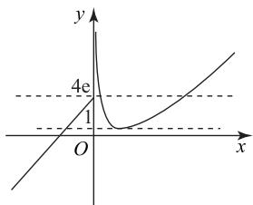

# 导数中双变量问题的处理策略

程春民

(江西省永丰中学)

导数中的双变量问题是高考的热点,这类问题综合性比较强,常常出现在试卷的压轴位置.掌握这类问题的基本思想和基本策略是解决双变量问题的关键.其实处理双变量问题的基本思想就是把双变量问题转化为单变量问题,本文以例题来说明处理双变量问题的各种常见策略.

# 1 利用根与系数的关系消元

如果两个变量是一个一元二次方程的根,则可以通过根与系数的关系来消元.

例1 已知函数 $f(x) = 2\ln x + \frac{ax}{x + 1}$ ，若 $f(x)$ 在定义域上有两个极值点 $x_{1}, x_{2} (x_{1} \neq x_{2})$ ，求证：

$$
\frac {f (x _ {1}) + f (x _ {2})}{x + 1} \geqslant \frac {f (x) + 2}{x} - 2.
$$

分析 $f^{\prime}(x) = \frac{2x^{2} + (a + 4)x + 2}{x(x + 1)^{2}}$ ，因为 $f(x)$ 在定义域上有两个极值点 $x_{1}, x_{2} (x_{1} \neq x_{2})$ ，所以 $2x^{2} + (a + 4)x + 2 = 0$ 的两根为 $x_{1}, x_{2}$ ，由根与系数的关系可知 $x_{1} + x_{2} = -\frac{a + 4}{4}, x_{1}x_{2} = 1.$ 而

$$
f \left(x _ {1}\right) + f \left(x _ {2}\right) = 2 \ln x _ {1} + \frac {a x _ {1}}{x _ {1} + 1} + 2 \ln x _ {2} + \frac {a x _ {2}}{x _ {2} + 1} =
$$

$$
2 \ln x _ {1} x _ {2} + a \left(\frac {2 x _ {1} x _ {2} + x _ {1} + x _ {2}}{x _ {1} x _ {2} + x _ {1} + x _ {2} + 1}\right),
$$

故可得 $f(x_{1}) + f(x_{2}) = a$ ，所以

$$
\frac {f (x _ {1}) + f (x _ {2})}{x + 1} \geqslant \frac {f (x) + 2}{x} - 2 \Leftrightarrow \ln x - x + 1 \leqslant 0.
$$

至此,我们就把双变量问题转化成了单变量问题,以下略.

# 2 利用比值换元

当两个变量所组成的是齐次式时,往往可以用比值来换元.

例2 若存在两个正实数 $x, y$ ，使得等式 $2x+$ $a(y - 2ex)(\ln y - \ln x) = 0$ 成立，则实数 $a$ 的取值范

围为( ).

A. $\left[-\frac{1}{2},\frac{1}{e}\right]$

B. $(0,\frac{2}{e}]$

C. $(- \infty, 0) \cup \left[\frac{2}{\mathrm{e}}, + \infty\right)$

D. $(- \infty, -\frac{1}{2}) \cup [\frac{1}{e}, + \infty)$

分析 根据函数与方程的关系将方程进行转化，利用换元法转化为方程有解问题.由

$$
2 x + a (y - 2 \mathrm{e} x) (\ln y - \ln x) = 0,
$$

得 $2 + a(\frac{y}{x} - 2\mathrm{e})\ln \frac{y}{x} = 0.$

设 $t = \frac{y}{x}$ ，则 t > 0，题设条件等价为 $2 + a(t - 2e) \cdot \ln t = 0$ 有解，即 $(t - 2e)\ln t = -\frac{2}{a}$ 有解，以下略。答案选 C.

例3 已知函数 $f(x) = x \ln x - \frac{a}{2} x^2 - x + a$ $(a \in \mathbf{R})$ 在定义域上有两个不同的极值点 $x_{1}, x_{2}$ . 证明: $x_{1}x_{2} > e^{2}$ .

分析 由题意可知 $x_{1}, x_{2}$ 是方程 $f'(x) = \ln x - ax = 0$ 的两个根，即 $\left\{ \begin{array}{l} \ln x_{1} - ax_{1} = 0, \\ \ln x_{2} - ax_{2} = 0. \end{array} \right.$

不妨假设 $0 < x_{1} < x_{2}$ ，两式相减得 $\ln \frac{x_{2}}{x_{1}} =$

$a(x_{2} - x_{1})$ ，即 $a = \frac{\ln\frac{x_2}{x_1}}{(x_2 - x_1)}$ ；两式相加得 $\ln x_{1}+$ $\ln x_{2} = a(x_{1} + x_{2})$ .待证不等式 $x_{1}x_{2} > \mathrm{e}^{2}\Leftrightarrow \ln x_{1}+$ $\ln x_{2}>2\Leftrightarrow a(x_{1}+x_{2})>2$ ,再把 $a=\frac{\ln\frac{x_{2}}{x_{1}}}{(x_{2}-x_{1})}$ 代入上

式整理得 $\ln \frac{x_2}{x_1} >\frac{2(x_2 - x_1)}{x_2 + x_1}$ 即 $\ln \frac{x_2}{x_1} >\frac{2(\frac{x_2}{x_1} - 1)}{\frac{x_2}{x_1} + 1}$ ，令

$\frac{x_{2}}{x_{1}}=t(t>1)$ ，待证不等式 $x_{1}x_{2}>e^{2}$ 转化为证 $\ln t-\frac{2(t-1)}{t+1}>0(t>1)$ .以下略.

# 3 利用差值换元

例4 已知函数 $f(x) = \mathrm{e}^{x} - x^{2} - ax$ 有两个极值点 $x_{1}, x_{2} (x_{1} < x_{2})$ ，求证： $\mathrm{e}^{x_{1}} + \mathrm{e}^{x_{2}} > 4$ 。

分析 由题意可知 $x_{1}, x_{2}$ 是方程 $f'(x) = \mathrm{e}^{x} - 2x - a = 0$ 的两个根，即 $\left\{ \begin{array}{l} \mathrm{e}^{x_1} = 2x_1 + a, \\ \mathrm{e}^{x_2} = 2x_2 + a. \end{array} \right.$

因为 $0 < x_{1} < x_{2}$ ，且两式相减得 $\mathrm{e}^{x_2} - \mathrm{e}^{x_1} = 2(x_2 - x_1)$ ，所以待证不等式转化为

$$
\mathrm{e} ^ {x _ {1}} + \mathrm{e} ^ {x _ {2}} > 4 \Leftrightarrow \frac {\mathrm{e} ^ {x _ {1}} + \mathrm{e} ^ {x _ {2}}}{\mathrm{e} ^ {x _ {2}} - \mathrm{e} ^ {x _ {1}}} > \frac {2}{x _ {2} - x _ {1}} \Leftrightarrow
$$

$$
\frac {1 + \mathrm{e} ^ {x _ {2} - x _ {1}}}{\mathrm{e} ^ {x _ {2} - x _ {1}} - 1} > \frac {2}{x _ {2} - x _ {1}}.
$$

令 $t = x_{2} - x_{1} (t > 0)$ ，则待证不等式为 $\frac{1 + e^{t}}{e^{t} - 1} > \frac{2}{t}$ ，变形整理得 $\frac{2 - t}{t + 2} e^{t} - 1 < 0$ ，以下略.

# 4 利用构造和或差函数进行消元

例5 已知函数 $f(x) = (x - 2)\mathrm{e}^x + a(x - 1)^2$ $(a>0)$ 有两个零点 $x_{1},x_{2}$ ，证明： $x_{1}+x_{2}<2$ .

分析 $f^{\prime}(x) = (x - 1)(\mathrm{e}^{x} + 2a)$ ，因为 $a > 0$ ，所以易知 $f(x)$ 在 $(- \infty, 1)$ 上单调递减，在 $(1, +\infty)$ 上单调递增。不妨设 $x_{1} < 1 < x_{2}$ ，则 $2 - x_{1} > 1$ ，要证明 $x_{1} + x_{2} < 2$ ，即证明 $x_{2} < 2 - x_{1}$ ，又因为 $x_{2}, 2 - x_{1}$ 均在 $f(x)$ 的单调递增区间 $(1, +\infty)$ 上，所以 $x_{2} < 2 - x_{1} \Leftrightarrow f(x_{2}) < f(2 - x_{1})$ ，又因为 $f(x_{1}) = f(x_{2})$ ，则 $f(x_{1}) < f(2 - x_{1})$ ，从而待证不等式 $x_{1} + x_{2} < 2$ 转化为证明 $F(x) = f(x) - f(2 - x) < 0 (x < 1)$ 恒成立，以下略。

例6 已知函数 $f(x) = 2\ln x + x^2 + x$ ，若正实数 $x_{1}, x_{2}$ 满足 $f(x_{1}) + f(x_{2}) = 4$ ，证明： $x_{1} + x_{2} \geqslant 2$ .

分析 显然 $f(x)$ 在 $(0, +\infty)$ 上单调递增，且 $f(1) = 2$ ，因为正实数 $x_{1}, x_{2}$ 满足 $f(x_{1}) + f(x_{2}) = 4$ ，所以 $x_{1}, x_{2}$ 中至少有一个要小于或等于1，不妨设 $x_{1} \leqslant 1$ ，则 $2 - x_{1} \geqslant 1$ ，要证 $x_{1} + x_{2} \geqslant 2$ ，即证 $x_{2} \geqslant 2 - x_{1}$ ，又因为 $f(x)$ 在 $(0, +\infty)$ 上单调递增，且 $2 - x_{1} > 0$ ，所以只需证明 $f(x_{2}) \geqslant f(2 - x_{1})$ ，又因为 $f(x_{1}) +$

$f(x_{2})=4$ ，消去 $f(x_{2})$ 得 $4-f(x_{1})\geqslant f(2-x_{1})$ ，从而转化为证明 $F(x)=4-f(x)-f(2-x)\geqslant0(0<x\leqslant1)$ 恒成立，以下略.

# 5 利用整体换元

例7 若 $\mathrm{e}^{x_1} = \ln x_2$ ，令 $t = x_{2} - x_{1}$ ，则 $t$ 的最小值属于( ).

A. $(1,\frac{3}{2})$

B. $\left(\frac{3}{2},2\right)$

C. $(2,\frac{5}{2})$

D. $\left(\frac{5}{2},3\right)$

分析 设 $a = e^{x_{1}} = \ln x_{2}$ ，则 $x_{1} = \ln a, x_{2} = e^{a}, t = x_{2} - x_{1} = e^{a} - \ln a$ ，令 $h(x) = e^{x} - \ln x$ ，从而转化为函数 $h(x)$ 的最小值所属区间问题，以下略。答案选 C.

例8 已知函数 $f(x) = \begin{cases} x - \ln x, & x > 0, \\ x + 4\mathrm{e}, & x \leqslant 0, \end{cases}$ 若存在 $x_{1} \leqslant 0, x_{2} > 0$ ，使得 $f(x_{1}) = f(x_{2})$ ，则 $x_{1} f(x_{2})$ 的最小值为 \_\_\_\_.

分析 由分段函数的解析式不难得到函数 $f(x)$ 的图像，如图1所示.设 $f(x_{1}) = f(x_{2}) = t$ ，由题可知 $1 \leqslant t \leqslant 4\mathrm{e}$ ，由 $f(x_{1}) = t$ ，得 $x_{1} + 4\mathrm{e} = t$ ，即 $x_{1} = t - 4\mathrm{e}$ ，则 $x_{1}f(x_{2}) = t(t - 4\mathrm{e}) = (t - 2\mathrm{e})^{2} - 4\mathrm{e}^{2}$ ，因为 $1 \leqslant t \leqslant 4\mathrm{e}$ ，所以当 $t = 2\mathrm{e}$ 时， $x_{1}f(x_{2})$ 取得最小值 $-4\mathrm{e}^{2}$ .

text_image

y
4e
1
O
x

图1

# 6 利用同构转化

例9 若对于任意的 $0 < x_{1} < x_{2} < a$ ，都有$\frac{x_2 \ln x_1 - x_1 \ln x_2}{x_1 - x_2} > 2$ ，则 $a$ 的最大值为（ ）.

A. 1

B. e

C. $\frac{1}{e}$

D. $\frac{1}{2}$

分析 $\frac{x_2\ln x_1 - x_1\ln x_2}{x_1 - x_2} > 2$ 变形得 $\frac{\ln x_1 + 2}{x_1} < \frac{\ln x_2 + 2}{x_2}$ , 构造函数 $f(x) = \frac{\ln x + 2}{x}$ , 则 $f(x_1) < f(x_2)$ , 即 $f(x)$ 在定义域 $(0, a)$ 上单调递增, 即转化为 $f'(x)=\frac{-\ln x-1}{x^{2}}\geqslant0$ 在 $(0,a)$ 上恒成立，以下略.
答案选 C.

例10 若正实数 $x, y$ 满足 $4\ln x + 2\ln (2y) \geqslant$ $x^{2}+8y-4$ , 则().

A. $xy=\frac{\sqrt{2}}{4}$

B. $x + y = \sqrt{2}$

C. $x + 2y = 1 + \sqrt{2}$

D. $x^{2}y = 1$

分析 对 $4\ln x + 2\ln(2y) \geqslant x^{2} + 8y - 4$ 变形得

$$
\ln \left(\frac {1}{2} x ^ {2}\right) - \frac {1}{2} x ^ {2} + 1 + \ln (4 y) - 4 y + 1 \geqslant 0.
$$

构造 $f(x)=\ln x-x+1$ ，上式等价于 $f(\frac{1}{2}x^{2})+f(4y)\geqslant0$ 。由 $f'(x)=\frac{1-x}{x}$ ，得 $f(x)$ 在 $(0,1)$ 上单调递增，在 $(1,+\infty)$ 上单调递减，所以 $f(x)\leqslant f(1)=0$ ，即 $f(x)\leqslant0$ 。要使 $f(\frac{1}{2}x^{2})+f(4y)\geqslant0$ 成立，当且仅当 $\frac{1}{2}x^{2}=4y=1$ 时才满足，即 $x=\sqrt{2}, y=\frac{1}{4}$ ，所以 $xy=\frac{\sqrt{2}}{4}$ 。故选 A.

例11 已知函数 $f(x) = x(1 - \ln x)$ ，设 $a, b$ 为两个不相等的正实数，且 $b\ln a - a\ln b = a - b$ ，证明： $\frac{1}{a} + \frac{1}{b} > 2.$

分析 因为 $b \ln a - a \ln b = a - b$ ，变形得

$$
\frac {1}{a} (1 - \ln \frac {1}{a}) = \frac {1}{b} (1 - \ln \frac {1}{b}),
$$

即 $f(\frac{1}{a})=f(\frac{1}{b})$ ，设 $\frac{1}{a}=x_{1},\frac{1}{b}=x_{2}$ ，则有 $f(x_{1})=f(x_{2})$ 。由 $f'(x)=-\ln x$ ，可知 $f(x)$ 在 $(0,1)$ 上单调递增，在 $(1,+\infty)$ 上单调递减，不妨设 $0<x_{1}<1<x_{2}$ 。下面只需证明 $x_{1}+x_{2}>2$ 。

由于 $f(x_{1}) = f(x_{2})$ ，即 $x_{1} - x_{1}\ln x_{1} = x_{2}-$ $x_{2}\ln x_{2}$ ，则 $x_{2} - x_{1} = x_{2}\ln x_{2} - x_{1}\ln x_{1}$ ，于是待证不等式转化为

$$
x _ {1} + x _ {2} > 2 \Leftrightarrow x _ {2} ^ {2} - x _ {1} ^ {2} > 2 (x _ {2} - x _ {1}) \Leftrightarrow
$$

$$
x _ {2} ^ {2} - x _ {1} ^ {2} > 2 \left(x _ {2} \ln x _ {2} - x _ {1} \ln x _ {1}\right) \Leftrightarrow
$$

$$
x _ {2} ^ {2} - 2 x _ {2} \ln x _ {2} > x _ {1} ^ {2} - 2 x _ {1} \ln x _ {1}.
$$

构造函数 $h(x)=x^{2}-2x\ln x$ ，则 $h(x_{2})>h(x_{1})$ 。易证 $h'(x)=2x-2(\ln x+1)\geqslant0$ ，所以 $h(x)$ 单调递增，又因为 $x_{2}>x_{1}$ ，所以 $h(x_{2})>h(x_{1})$ ，则上式显然成

立，于是 $x_{1} + x_{2} > 2$ 得证.

例12 已知函数 $f(x) = \ln x - ax$ ，若存在 $x_{1} <$ $x_{2}$ ，使得 $f(x_{1}) = f(x_{2}) = 0$ ，求证： $x_{1} + x_{2} > \frac{3}{a} -\mathrm{e}.$

分析 由 $f(x_{1}) = f(x_{2})$ ，可知 $\ln x_{1} - ax_{1} = \ln x_{2} - ax_{2} = 0$ ，即 $a = \frac{\ln x_{1} - \ln x_{2}}{x_{1} - x_{2}}$ 且

$$
x _ {2} \ln x _ {1} = x _ {1} \ln x _ {2}.
$$

待证不等式为

$$
x _ {1} + x _ {2} > \frac {3}{a} - \mathrm{e} \Leftrightarrow a (x _ {2} ^ {2} - x _ {1} ^ {2}) > (3 - a \mathrm{e}) (x _ {2} - x _ {1}),
$$

把 $a = \frac{\ln x_1 - \ln x_2}{x_1 - x_2}$ 代入整理得 $x_{2}\ln x_{2} + \mathrm{e}\ln x_{2} - 3x_{2} > x_{1}\ln x_{1} + \mathrm{e}\ln x_{1} - 3x_{1}$ ，构造 $g(x) = x\ln x + \mathrm{e}\ln x - 3x$ ，则 $g(x_{2}) > g(x_{1})$ ，求导易证 $g'(x) \geqslant 0$ ，即 $g(x)$ 单调递增，从而 $x_{1} + x_{2} > \frac{3}{a} - e$ 得证.

# 7 多种策略组合的综合问题

例13 已知函数 $f(x) = \frac{\mathrm{e}^x}{x} - \ln x + x$ 有两个零点 $x_{1}, x_{2} (x_{1} < x_{2})$ ，证明： $x_{1}x_{2} < 1$ .

分析 $f(x) = \frac{\mathrm{e}^x}{x} -\ln x + x = \frac{\mathrm{e}^x}{x} +\ln \frac{\mathrm{e}^x}{x}$ ，令 $t =$ $\frac{\mathrm{e}^x}{x}$ 易得 $t\geqslant \mathrm{e}.$ 因为 $y = t + \ln t$ 在 $[\mathrm{e}, + \infty)$ 上是单调函数，所以 $f(x)$ 有两个零点 $x_{1},x_{2}$ 等价于 $y = t+$ $\ln t$ 在 $t\geqslant \mathrm{e}$ 上有一个零点 $t_0$ ，即 $\frac{\mathrm{e}^{x_1}}{x_1} = \frac{\mathrm{e}^{x_2}}{x_2} = t_0$ ，变形得 $\mathrm{e}^{x_2 - x_1} = \frac{x_2}{x_1}$ ，两边取对数得 $x_{2} - x_{1} = \ln x_{2} - \ln x_{1}$ ，即 $\frac{x_2 - x_1}{\ln x_2 - \ln x_1} = 1.$ 于是待证不等式

$$
x _ {1} x _ {2} <   1 \Leftrightarrow \sqrt {x _ {1} x _ {2}} <   \frac {x _ {2} - x _ {1}}{\ln x _ {2} - \ln x _ {1}}.
$$

变形得 $\ln \frac{x_2}{x_1} < \sqrt{\frac{x_2}{x_1}} - \sqrt{\frac{x_1}{x_2}}$ ，令 $m = \sqrt{\frac{x_2}{x_1}} (m > 1)$ ，只需证明 $2\ln m < m - \frac{1}{m} (m > 1)$ ，以下略.

处理双变量问题的关键是将其转化为单变量问题,我们应该掌握常见的基本策略:根与系数的关系消元、比值换元、差值换元、构造和或差函数、同构转化等.

(完)