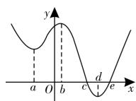
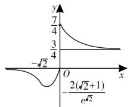

# 导数及应用求解中的常见易错点归类剖析

■陕西省汉中市四〇五学校

导数是研究函数的重要工具，在历年高考中都占据着重要的地位，而且这部分知识既有难度较大的填空题，也有计算烦琐的解答题。由于同学们对一些概念理解不透、审题不严、考虑不周或忽视结论成立的条件等产生思维混乱，导致求解失误。本文对导数及应用求解中的常见易错点进行归类剖析，希望能引起同学们的高度重视。

# 一、复合函数的求导不彻底致错

例 1 设函数 $f(x)=\cos(\sqrt{3}x+\varphi)$ ，其中常数 $\varphi$ 满足 $-\pi<\varphi<0$ ，若函数 $g(x)=f(x)+f'(x)$ （其中 $f'(x)$ 是函数 $f(x)$ 的导函数）是偶函数，则 $\varphi$ 等于（）。

A. $-\frac{\pi}{3}$

B. $-\frac{5\pi}{6}$

C. $-\frac{\pi}{4}$

D. $-\frac{2\pi}{3}$

易错点剖析:复合函数求导时,选择中间变量是关键,必须正确分析复合函数的复合层次,然后从外向里逐层求导,直至求导到自变量x,并且求导后,要把中间变量转换成自变量的函数。该题解答过程中容易出错的地方往往是 $f(x)$ 的导函数求解,事实上, $f'(x)=-\sqrt{3}\sin(\sqrt{3}x+\varphi)$ 。

解析:由题意可得, $g(x)=f(x)+f'(x)=\cos(\sqrt{3}x+\varphi)-\sqrt{3}\sin(\sqrt{3}x+\varphi)=2\cos\left(\sqrt{3}x+\varphi+\frac{\pi}{3}\right)$ 。

因为函数 $g(x)$ 为偶函数, 所以 $\varphi + \frac{\pi}{3} = k\pi (k \in \mathbf{Z})$ , 解得 $\varphi = k\pi - \frac{\pi}{3} (k \in \mathbf{Z})$ , 又 $-\pi < \varphi < 0$ , 所以 $\varphi = -\frac{\pi}{3}$ 。故选 A。

# 二、误认为“函数的极值点”就是“导数的零点”致错

例 2 （2024 年陕西学林联考）已知函数 $f(x)=x^{3}+3ax^{2}+bx+a^{2}$ 在 x=-1 处取得极值 0，则 $f'(1)=(\quad)$ 。

A. 6

B. 12

C. 24

D. 12 或 24

侯有岐(特级教师、正高级教师)

易错点剖析: 导数的零点不一定是函数的极值点, 例如, 函数 $f(x)=x^{3}, f'(0)=0$ , 但是 0 不是函数 $f(x)=x^{3}$ 的极值点。对于可导函数来说, $f'(x_{0})=0$ 是 $x_{0}$ 为函数 $f(x)$ 的极值点的必要不充分条件, 因此要进行检验。

解析:由 $f(x)=x^{3}+3ax^{2}+bx+a^{2}$ ，得 $f'(x)=3x^{2}+6ax+b$ 。

因为 $f(x)=x^{3}+3ax^{2}+bx+a^{2}$ 在 x=-1 处取得极值 0，所以 $\left\{\begin{aligned}f'(-1)=0,\\ f(-1)=0,\end{aligned}\right.$ 即 $\left\{\begin{aligned}3-6a+b=0,\\ -1+3a-b+a^{2}=0,\end{aligned}\right.$ 解得 $\left\{\begin{aligned}a=1,\\ b=3,\end{aligned}\right.$ 或 $\left\{\begin{aligned}a=2,\\ b=9.\end{aligned}\right.$

当 $\left\{\begin{aligned}a=1,\\ b=3\end{aligned}\right.$ 时， $f'(x)=3x^{2}+6x+3=$ $3(x+1)^{2}\geqslant0$ ，则 $f(x)$ 在 R 上单调递增，函数无极值，舍去。

当 $\left\{\begin{aligned}a=2,\\ b=9\end{aligned}\right.$ 时， $f'(x)=3x^{2}+12x+9=$ $3(x+3)(x+1)$ ，令 $f'(x)>0$ ，得 x<-3 或 x>-1；令 $f'(x)<0$ ，得 -3<x<-1。所以 $f(x)$ 在 $(-∞,-3)$ ， $(-1,+∞)$ 上单调递增，在 $(-3,-1)$ 上单调递减，符合题意。

所以 $f'(1)=3+6a+b=24$ 。故选 C。

# 三、混淆“导数值的正负”与“函数增减性”的逻辑关系致错

例 3 若函数 $f(x)=x-\frac{4}{x}-a\ln x$ 单调递增,则实数 a 的取值范围为()。

A. $(-∞,0]$

B. $(-∞,-4]$

C. $\left[-4,4\right]$

D. $(-∞,4]$

易错点剖析:若含参函数 $f(x)$ 在区间 D 上单调递增(减)，则 $f'(x) \geqslant 0 (f'(x) \leqslant 0)$ 在区间 D 上恒成立。当然，也可以先求出函数的单调递增(减)区间 I，利用 $D \subseteq I$ 求解，注意不是 D = I。实际上， $f'(x) > 0 (f'(x) < 0) (x \in (a, b))$ 是 $f(x)$ 在 $(a, b)$ 上单调递增(减)的充分不必要条件，常用来求函数的单调区间；可导函数 $f(x)$ 在 $(a, b)$ 上为单调递增（减）函数的充要条件为“对于任意 $x \in (a, b)$ ，有 $f'(x) \geqslant 0 (f'(x) \leqslant 0)$ ，且 $f'(x)$ 在 $(a, b)$ 的任意子区间上都不恒为 0”。

解析: 因为 $f(x)=x-\frac{4}{x}-a\ln x$ 单调递增, 所以 $f'(x)=1+\frac{4}{x^{2}}-\frac{a}{x}=\frac{x^{2}-ax+4}{x^{2}}\geqslant0$ , 即 $x^{2}-ax+4\geqslant0$ , 即 $a\leqslant\frac{4}{x}+x$ 对任意 x>0 恒成立。因为 $\frac{4}{x}+x\geqslant2\sqrt{x\cdot\frac{4}{x}}=4$ (当且仅当 x=2 时取“=”), 所以 $a\leqslant4$ 。故选 D。

# 四、混淆函数的“单调区间是”与函数“在区间上单调”致错

例 4 （2024 年陕西学林联考）已知函数 $f(x)=\sqrt{3-(a+1)x-a^{2}x^{2}}$ 的单调递减区间为 $[-1,1]$ ，则 a 的值为（）。

A. 1

B.-1

C. 1 或 -1

D. $-\frac{1}{2}$

易错点剖析:在解决与函数的单调性有关的问题时要注意下列几个概念的区别:“在区间上单调”指该区间是函数相应单调区间的子区间;“单调区间是”指该区间就是函数的最大单调区间;“存在单调区间”指该区间内有相应单调性,也可能有别的单调性,即该区间内可能既有增区间,也有减区间。本题中函数 $f(x)$ 的单调递减区间为 $[-1,1]$ ,说明1和-1就是整个单调递减区间的两个端点值。

解析: 令 $t(x)=3-(a+1)x-a^{2}x^{2}$ ，易知 $y=\sqrt{x}$ 是定义在 $(0,+\infty)$ 上的单调递增函数，因此由题意可得 $t(x)$ 的单调递减区间为 $[-1,1]$ ，且 $t(x)\geqslant0$ 在 $[-1,1]$ 上恒成立，易知 $a\neq0$ ，因此 $t(x)$ 图像的对称轴只能为直线 x=1，且 1 为方程 $t(x)=0$ 的一个根，所以 $\left\{\begin{aligned}-\frac{a+1}{2a^{2}}=-1,\\3-(a+1)-a^{2}=0,\end{aligned}\right.$ 解得 a=1。故选 A。

# 五、使用函数零点存在定理时不会赋值致错

例5 函数 $f(x) = x^{2} + \mathrm{e}^{x} - 3$ 的零点个数为\_\_\_\_。

易错点剖析:求解有关函数零点问题的关键是借助函数零点存在定理证明零点存在,一般需由导数确定函数的单调性,在单调区间内通过赋值找到两个符号相反的函数值,得出此区间内存在一个零点。此处的赋值一般直接猜数赋值,若行不通,则可通过局部确定范围或消项,借助放缩法、分析法等,探究合适的赋值。本题在寻找零点赋值时,采用了消项法,因为 $e^{x}>0$ 恒成立,所以令 $x^{2}-3=0$ ,故取 $x=\pm\sqrt{3}$ 。当然本题也可用数形结合法去做,同学们不妨自己试试。

解析: 因为 $f(x)=x^{2}+\mathrm{e}^{x}-3$ ，所以 $f'(x)=2x+\mathrm{e}^{x}$ 。因为 $f'(x)$ 在 R 上单调递增， $f'(0)=1>0, f'(-1)=-2+\mathrm{e}^{-1}<0$ ，所以存在 $x_{0}\in(-1,0)$ ，使得 $f'(x_{0})=2x_{0}+\mathrm{e}^{x_{0}}=0$ 。当 $x<x_{0}$ 时， $f'(x)<0$ ；当 $x>x_{0}$ 时， $f'(x)>0$ 。所以 $f(x)$ 在 $(-∞,x_{0})$ 上单调递减，在 $(x_{0},+∞)$ 上单调递增。因为 $x_{0}\in(-1,0),2x_{0}+\mathrm{e}^{x_{0}}=0$ ，所以 $f(x_{0})=x_{0}^{2}+\mathrm{e}^{x_{0}}-3=x_{0}^{2}-2x_{0}-3<0$ 。因为 $f(\sqrt{3})=(\sqrt{3})^{2}+\mathrm{e}^{\sqrt{3}}-3>0, f(-\sqrt{3})=(-\sqrt{3})^{2}+\mathrm{e}^{-\sqrt{3}}-3>0$ ，所以 $f(x)$ 存在 2 个零点，设为 $x_{1}, x_{2}(x_{1}<x_{2})$ ，其中 $x_{1}\in(-\sqrt{3},x_{0}), x_{2}\in(x_{0},\sqrt{3})$ 。故填 2。

# 六、混淆函数的极值与最值关系致错

例6 已知定义在 $\mathbf{R}$ 上的函数 $f(x)$ ，

其导函数 $f'(x)$ 的大致图像如图 1 所示, 则下列叙述正确的是()。

  
图1

A. $f(b) > f(a) > f(c)$   
B. 函数 $f(x)$ 在 $x = c$ 处  
取得最大值, 在 x=e 处取得最小值  
C. 函数 $f(x)$ 在 x=c 处取得极大值，在 x=e 处取得极小值  
D. 函数 $f(x)$ 的最小值为 $f(d)$

易错点剖析: 极值是函数在某一区间内的最值, 但在整个定义域内不一定是最值。极值是否为最值, 还需进一步判断。

解析:由图1可知,当 $x\leqslant c$ 时, $f'(x)\geqslant0$ ,所以函数 $f(x)$ 在 $(-∞, c]$ 上单调递增。又 a < b < c，所以 $f(a) < f(b) < f(c)$ ，故 A 错误。因为 $f'(c) = 0, f'(e) = 0$ ，且当 x < c 时， $f'(x) > 0$ ；当 c < x < e 时， $f'(x) < 0$ ；当 x > e 时， $f'(x) > 0$ ，所以函数 $f(x)$ 在 x = c 处取得极大值，在 x = e 处取得极小值，故 B 错误，C 正确。由图 1 可知，当 $d \leqslant x \leqslant e$ 时， $f'(x) \leqslant 0$ ，所以函数 $f(x)$ 在 [d, e] 上单调递减，从而 $f(d) > f(e)$ ，所以 D 错误。故选 C。

# 七、解决 $f(x)$ 与 $f'(x)$ 共存的函数不等式问题时因构造函数不当致错

例 7 （2024 年陕西学林联考）已知函数 $y = f(x - 2)$ 的图像关于点 $(2, 0)$ 对称， $f'(x)$ 是 $f(x)$ 的导函数，当 x > 0 时， $xf'(x) + 3f(x) > 0$ 恒成立，且 $f(1) = 3$ ，则不等式 $x^{3}f(x) - 3 > 0$ 的解集为 \_\_\_\_。

易错点剖析: 函数中的构造问题是高考考查的一个热点内容, 在解决 $f(x)$ 与 $f'(x)$ 共存的函数不等式问题时, 关键是通过观察题目所给等式或不等式的结构特征, 根据复合函数的求导法则, 构造合适的函数 $g(x)$ 。一般情况下, 构造的函数 $g(x)$ 是由“主函数” $f(x)$ 和“辅函数”构成, 常见的“辅函数”有 $x^{n}, e^{kx}, \sin x, \cos x$ 等, 常见的构成方法有“和、差、积、商”等。本题给出的原函数与导函数的关系式中包含 $xf'(x) + 3f(x)$ , 是典型的“ $xf'(x) + nf(x)$ ”结构, 便可构造函数 $g(x) = x^{3}f(x)$ 。因此, 我们必须掌握常见的构造函数的技巧。

解析: 令 $g(x)=x^{3}f(x)$ ，则 $g'(x)=3x^{2}f(x)+x^{3}f'(x)=x^{2}[xf'(x)+3f(x)]$ ，由题意知，当 x>0 时， $g'(x)>0$ ，故 $g(x)$ 在 $(0,+\infty)$ 上单调递增。由函数 $y=f(x-2)$ 的图像关于点 $(2,0)$ 对称知，函数 $f(x)$ 是奇函数，故 $g(x)$ 为偶函数。又因为 $f(1)=3$ ，所以 $g(1)=3$ ，即所求不等式变为 $g(x)>g(1)$ ，所以 $g(|x|)>g(1)$ ，所以 $|x|>1$ ，解得 $x\in(-\infty,-1)\cup(1,+\infty)$ 。

# 八、在使用数形结合思想时因图像失真致错

例 8 （2024 年汉中四〇五学校模考）

已知函数 $f(x)=\left\{\left(\frac{1}{2}\right)^{x}+\frac{3}{4},x>0,\right.$ 若函数 $t(x)=f(x)+2k$ 有两个不同的零点，则实数 k 的取值范围为 \_\_\_\_。

易错点剖析:合理运用数形结合思想,不仅能优化解题思路,还能提高解题效率,但前提是必须准确作出函数的图像。本题在使用数形结合思想时,有些同学想当然地认为,在 $g(x)=(2x-x^{2})\mathrm{e}^{x}$ 中,当 $x\to-\infty$ 时, $y\to+\infty$ ,而没有去充分地验证,犯了思维定式的错误。

解析: 设 $g(x)=(2x-x^{2})\mathrm{e}^{x}$ ，则 $g'(x)=(2-x^{2})\mathrm{e}^{x}$ 。令 $g'(x)=0$ ，解得 $x=-\sqrt{2}$ 或 $x=\sqrt{2}$ （舍）。当 $x\in(-\infty,-\sqrt{2})$ 时， $g'(x)<0$ ，函数 $g(x)$ 为减函数；当 $x\in(-\sqrt{2},0)$ 时， $g'(x)>0$ ，函数 $g(x)$ 为增函数。所以 $g(x)$ 在 $x=-\sqrt{2}$ 处，取得极小值 $g(-\sqrt{2})=-\frac{2(\sqrt{2}+1)}{\mathrm{e}^{\sqrt{2}}}$ 。当 $x\to-\infty$ 时， $y\to0$ ，且当 x<0 时， $y=g(x)=(2x-x^{2})\mathrm{e}^{x}<0$ 。设 $h(x)=\left(\frac{1}{2}\right)^{x}+\frac{3}{4}$ ，根据指数函数的单调性易知， $h(x)$ 在 $(0,+\infty)$ 上为减函数，当 $x\to0$ 时， $y\to\frac{7}{4}$ ；当 $x\to+\infty$ 时， $y\to\frac{3}{4}$ ，如图 2

所示。若函数 $t(x)=f(x)$ +2k 有两个不同的零点，则 $-\frac{2(\sqrt{2} + 1)}{\mathrm{e}^{\sqrt{2}}} < -2k < 0$

解得 $0 < k < \frac{\sqrt{2} + 1}{\mathrm{e}^{\sqrt{2}}}$ 。故填

$$
\left(0, \frac {\sqrt {2} + 1}{\mathrm{e} ^ {\sqrt {2}}}\right) 。
$$

line

| x | y |
|---|---|
| -√2 | 7/4 |
| 0 | 3/4 |
| ∞ | -√2 |
| ∞ | -2(√2+1)/e√2 |

图2

除了上述几类典型的易错问题,常见的易错点还有把 $f'(x_{0})$ 当成关于 x 的变量函数、忽视切点在曲线上的隐含条件等,由于篇幅所限,在此不作赘述。总之,同学们在学习中要认真总结,多加思考,明确易混易错问题的类型,弄清致错根源,防患于未然。

(责任编辑 王福华)