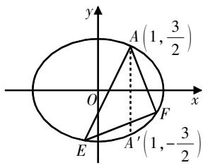

# 导数在圆锥曲线问题中的应用探究指导

周佳琳 江苏省常熟市海虞高级中学 215500

[摘 要] 开展导数在圆锥曲线问题中的应用教学至关重要,教师应注重针对不同问题类型进行思路分析,并构建相应的解题策略,同时结合具体实例进行深入强化.研究者围绕圆锥曲线的三大问题,开展导数应用教学,并提出相应的教学建议.

[关键词] 导数;圆锥曲线;应用;最值;切线

导数是高中数学的核心知识点, 常作为数学工具用于探究解析函数的极值、最值等问题, 以及圆锥曲线问题.

# 应用探究

探究导数在圆锥曲线中的应用,具体步骤是:先构建函数模型,再利用导数来研究函数的性质,最后完成求解.

# 1. 最值与取值范围问题

在探讨圆锥曲线中的最值与取值范围问题时,如果学生构建的数学模型过于复杂,以至于难以应用不等式法或函数法求解,那么可以考虑采用导数分析法.即关注模型中的数式,以此为基础构建函数,并引入导数知识来研究其性质,进而求解最值或取值范围.

例 1 设椭圆 $T: \frac{x^{2}}{a^{2}} + \frac{y^{2}}{b^{2}} = 1 (a > b > 0)$ ，直线 l（不与 x 轴重合）过椭圆的左焦点 $F_{1}$ ，并与椭圆相交于P,Q两点，左准线与x轴相交于点K, $|KF_{1}|=2$ 。当l与x轴垂直时， $|PQ|=\frac{4}{\sqrt{3}}$ 。

(1)求椭圆T的方程;

(2)直线l绕着 $F_{1}$ 旋转,与圆 $O:x^{2}+y^{2}=5$ 相交于A,B两点,若 $|AB|\in[4,\sqrt{19}]$ ,求 $\triangle F_{2}PQ$ 的面积S的取值范围( $F_{2}$ 为椭圆T的右焦点).

分析指导 本题以椭圆与直线相交为背景,构建了圆、三角形等特殊几何图形,并融入了旋转相关知识,整体综合性较强. 本题第(1)问求的是椭圆T的方程,较为简单. 第(2)问探究的是三角形面积的取值范围,需要构建一个面积模型,有一定难度. 在分析面积模型时,建议通过构建函数并运用导数来研究其性质,从而确定面积的取值范围.

过程指导 (1)(简答)椭圆T的方程为 $\frac{x^{2}}{3}+\frac{y^{2}}{2}=1.$

(2)总体思路:先联立方程,再构建面积模型,最后利用函数与导数知识完成求解.

第一步,联立方程.

设直线 $l:x-my+1=0$ ，圆心O到l的距离 $d=\frac{1}{\sqrt{1+m^{2}}}$ 。根据圆的性质可得

$$
\begin{array}{l} {\left| A B \right| = 2 \sqrt {r ^ {2} - d ^ {2}} = 2 \sqrt {5 - \frac {1}{\sqrt {1 + m ^ {2}}}}. \text {又}} \\ {\left| A B \right| \in [ 4, \sqrt {1 9} ], \text {故} m ^ {2} \in [ 0, 3 ]. \text {联立}} \end{array}
$$

直线l与椭圆的方程,得 $\left\{\begin{aligned}x&=my-1,\\ \frac{x^{2}}{3}&+\frac{y^{2}}{2}=1,\end{aligned}\right.$

整理得 $(2m^{2}+3)y^{2}-4my-4=0$ 。由韦达定理得 $y_{1}+y_{2}=\frac{4m}{2m^{2}+3},y_{1}y_{2}=\frac{-4}{2m^{2}+3}$ .

第二步,构建面积模型.

设直线与椭圆的交点为 $P(x_{1},y_{1})$ ， $Q(x_{2},y_{2})$ ，构建 $\triangle F_{2}PQ$ 的面积模型，得S= $\frac{1}{2}|F_{1}F_{2}|\cdot|y_{1}-y_{2}|=|y_{1}-y_{2}|=\sqrt{(y_{1}+y_{2})^{2}-4y_{1}y_{2}}=$

$$
\sqrt {\frac {1 6 m ^ {2}}{(2 m ^ {2} + 3) ^ {2}} + \frac {1 6}{2 m ^ {2} + 3}}. \text {令} t = m ^ {2} + 1 \in
$$

$$
[ 1, 4 ], \text {则} S = \sqrt {\frac {4 8}{4 t + \frac {1}{t} + 4}}.
$$

第三步,构建函数,导数解析.

针对上述面积模型,可以构建一个函数来表示其中的分母部分. 即设 $f(t)=4t+\frac{1}{t}, t\in[1,4]$ ，其对应的导函数 $f'(t)=4-\frac{1}{t^{2}}=\frac{4t^{2}-1}{t^{2}}>0(t\in[1,4])$ 恒成立,所以函数 $f(t)=4t+\frac{1}{t}$ 在区间 $[1,4]$ 上单调递增. 所以， $f(t)=4t+\frac{1}{t}\in\left[5,\frac{65}{4}\right]$ . 所以， $S\in\left[\frac{8\sqrt{3}}{9},\frac{4\sqrt{3}}{3}\right]$ .

评析与反思 上述展示的是运用导数求解圆锥曲线中的取值范围问题的“三步法”. 在这一过程中, 函数和导数的应用主要集中在最后一步. 具体来说, 先通过建立面积模型来构造局部函数, 然后利用导数分析该函数的性质, 最后确定取值范围.

对于学生而言,需要关注两点:一是函数的构建——可整体构建,也可局部构建;二是函数的性质——应用分类讨论思想,明确函数的性质.

# 2. 切线问题

圆锥曲线中的切线问题十分常见,传统方法为解析法,即设定切点,求出切线斜率后构建方程,但该过程较为复杂.实际上,可以利用导数知识直接求出切线方程.教师可以抛物线的切线方程为例,指导学生掌握以下求解思路.

求过抛物线 $E: x^{2}=2py(p>0)$ 上一点 $P(x_{0},y_{0})$ 的切线方程, 可以将抛物线方程视为关于x的二次函数, 对其进行求导后, 再代入切点坐标推得切线的斜率, 最后利用点斜式构建切线方程.

例2 若点Q是直线y=x-4上任意一点,过点Q作抛物线 $C:x^{2}=4y$ 的两切线QA,QB,其中A,B为切点,试证明直线AB恒过一定点,并求出该定点的坐标.

分析指导 本题证明直线AB恒过一定点,并求出该定点的坐标,关键是求出切线QA,QB的方程. 可以利用导数的相关知识,直接构建切线方程.

过程指导 先求切线方程,再分析定点.

第一步,推导切线方程.

对函数 $y=\frac{1}{4}x^{2}$ 求导, 得 $y'=\frac{1}{2}x$ . 设切点为 $(x_{0},y_{0})$ , 则过该切点的切线的斜率为 $\frac{1}{2}x_{0}$ , 所以切线方程为 $y-y_{0}=\frac{1}{2}x_{0}(x-x_{0})=\frac{1}{2}x_{0}x-\frac{1}{2}x_{0}^{2}=\frac{1}{2}x_{0}x-2y_{0}$ , 即 $x_{0}x-2y-2y_{0}=0$ . 设点 $Q(t,t-4)$ , 由于切线经过点Q, 所以 $tx_{0}-2y_{0}-2(t-4)=0$ .

设 $A(x_{1},y_{1}),B(x_{2},y_{2})$ ，则两切线的方程分别为 $tx_{1}-2y_{1}-2(t-4)=0,tx_{2}-2y_{2}-2(t-4)=0,$

第二步,分析定点.

根据两切线方程可知,过A,B两点的直线方程是 $tx-2y-2(t-4)=0$ ,即 $t(x-2)+8-2y=0$ .分析该式可知,当x=2,y=4时,方程恒成立,从而确定对任意实数t,直线AB恒过定点(2,4).

评析与反思 上述展示的是运用导数求解切线方程的过程. 具体而言, 先将曲线方程视为关于 x 的函数, 然后对其求导以确定切线的斜率, 最后据此确定切线的方程.

教师可以引导学生总结常见的圆锥曲线的切线方程,例如过双曲线 $\frac{x^2}{a^2} -\frac{y^2}{b^2} = 1(a > 0,b > 0)$ 上一点 $P(x_0,$ $y_{0})$ 的切线方程为 $\frac{x_0x}{a^2} -\frac{y_0y}{b^2} = 1$ ，过椭圆 $\frac{x^2}{a^2} +\frac{y^2}{b^2} = 1(a > 0,b > 0)$ 上一点 $P(x_0,$ $y_0)$ 的切线方程为 $\frac{x_0x}{a^2} +\frac{y_0y}{b^2} = 1.$ 学生可以直接利用上述结论来解题，从而提高解题效率.

# 3. 极点与极线问题

极线是高等几何中的重要概念，它是圆锥曲线的一种基本特征。学生先要明晰概念，再总结用导数破解极点与极线问题的思路。

对于圆 $x^{2}+y^{2}=r^{2}$ ，与点 $(x_{0},y_{0})$ 对应的极线方程为 $x_{0}x+y_{0}y=r^{2}$ 。若点 $(x_{0},y_{0})$ 在圆上，则极线方程就是切线方程；若点 $(x_{0},y_{0})$ 在圆外，则极线方程就是切点弦方程。

利用导数的几何意义可以探求与极点和极线相关的定值问题. 这种方法适用于A是圆锥曲线C上的定点,E,F是圆锥曲线C上的两个动点的情形.

例3 如图1所示,已知E,F是椭圆 $\frac{x^{2}}{4}+\frac{y^{2}}{3}=1$ 上的两个动点, $A\left(1,\frac{3}{2}\right)$ 是椭圆上的定点,如果直线AE与AF关于直线x=1对称,证明直线EF的斜率为定值,并求出这个定值.

text_image

y
A(1,3/2)
O
x
F
E
A'(1,-3/2)

图1

分析指导 本题为与椭圆和直线相关的斜率定值探究题,解决此类问题有两种方法:一是传统的解析法;二是特殊的导数法. 解析法先联立方程,然后根据斜率定义进行推导;导数法则利用导数知识直接推导. 在教学中,教师可将这两种方法都展示出来,指导学生进行分析与对比.

解析法 因为直线AE与AF关于直线x=1对称,所以直线AE与AF的斜率互为相反数. 设直线AE的方程为 $y=k(x-1)+\frac{3}{2}$ , 则直线AF的方程为 $y=-k(x-1)+\frac{3}{2}$ . 联立直线AE与椭圆的方程, 整理可得 $(3+4k^{2})x^{2}+4k(3-2k)x+4\left(\frac{3}{2}-k\right)^{2}-12=0$ .

设 $E(x_{1},y_{1}),F(x_{2},y_{2})$ ，注意x=1是上述方程的一个根，结合韦达定理可得 $x_{1}=\frac{4\left(\frac{3}{2}-k\right)^{2}-12}{3+4k^{2}}$ 。同理可得 $x_{2}=$ $\frac{4\left(\frac{3}{2}+k\right)^{2}-12}{3+4k^{2}}$ 。所以， $k_{EF}=\frac{y_{1}-y_{2}}{x_{1}-x_{2}}=\frac{k(x_{1}+x_{2})-2k}{x_{1}-x_{2}}$ 。将 $x_{1}$ 和 $x_{2}$ 的值代入上式，可得 $k_{EF}=\frac{1}{2}$ 。

导数法 分析可知, 当直线AE与AF的倾斜角均趋近于90°时, 则直线EF的斜率就趋近于过 $A'\left(1, -\frac{3}{2}\right)$ 的切线的斜率. 对椭圆 $\frac{x^{2}}{4}+\frac{y^{2}}{3}=1$ 中的x求导, 得 $\frac{2x}{4}+\frac{2yy'}{3}=0$ . 将 $A'\left(1, -\frac{3}{2}\right)$ 代入上式, 可得 $\frac{2\times1}{4}+\frac{2\times\left(-\frac{3}{2}\right)y'}{3}=0$ , 解得 $y'=\frac{1}{2}$ , 从而可直接确定所求的定值为 $\frac{1}{2}$ .

评析与反思 上述展示的是用解析法与导数法探究直线过定点的过程. 显然, 传统的解析法更复杂, 涉及大量的运算, 而导数法则直接触及核心, 简洁明了. 在教学中, 教师需要指导学生关注两点: 一是探讨导数法在解题过程中的构建方式及其本质含义; 二是通过对比解析法与导数法, 直观揭示两种方法在思路方面的差异.

# 教学建议

上文概述了导数在圆锥曲线三大问题中的应用,并展示了探究方法的参考价值. 接下来,笔者提出一些教学建议.

# 建议1:挖掘知识本质

导数作为数学分析的重要工具，在解决圆锥曲线问题时展现了其两大关键特性：一是能够通过研究导数来深入探讨函数曲线的变化特性；二是利用导数的几何意义能够建立斜率与切线之间的联系。教师应当指导学生深入探究这些知识的内在本质，并从本质上理解其应用的根源。在学习过程中，学生需要关注教材的基础内容，从基本定理和定义出发进行深入探讨。

# 建议2:解读应用思路

上述内容概括了三大题型中导数研究的方法和思路,整体上遵循“思路解读→实例指导→评价反思”的流程展开.其中,“思路解读”应作为教学的重点,即在探究过程中,学生应聚焦问题的特性,梳理导数的应用技巧,并构建相应的解题策略.在构建解题策略时,需要注意两个关键点:一是解读导数应用的知识基础;二是深入分析问题,揭示其核心

本质.

# 建议3: 过程分步构建

指导实例时,教师应采取分步构建的策略,引导学生深入解读问题,并明确每一步解析的关键点.以例1的探究为例,探究过程可以分为三个阶段:首先,联立方程并进行整理;其次,构建面积模型;最后,研究导数的性质.分步构建策略并非仅仅是对过程的简单拆解,教师应引导学生深入分析问题,理解不同条件之间的内在联系.

# 建议4: 深度总结思考

研究案例时,教师需精心挑选具有代表性的题目,确保这些题目能够清晰地展示解题方法的应用.一旦构建了完整的过程,教师应进一步引导学生进行反思和总结,深入探讨解决问题的细节,并归纳总结解题策略和经验,以便更深刻地理解方法的应用过程.在必要时,教师可以引导学生进行多种解法的探究,比较解析法与导数法的思路差异,直观地感受导数法的优势.此外,教师应适时总结构建过程和解题技巧,以助于学生更好地应用和巩固所学知识.

# 写在最后

综上所述,导数作为一种解题工具,对处理圆锥曲线问题具有重要作用. 在教学中,教师应注重问题的梳理和思路方法的总结,并通过具体实例来提供指导. 在探索解题方法时,建议教师以引导学生思考为主,确保学生能够深入理解并掌握运用导数解决问题的基本策略. 此外,教师还应适时地融入数学思想,以此来培养学生的解题思维能力,并提高他们的数学素养.