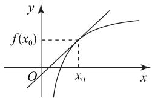
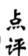
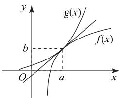
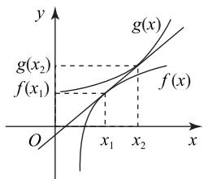

# 导数背景下曲线切线问题的类型及处理策略

黄巧丽

(山东省青岛市即墨区第二中学)

函数曲线的切线问题是高考命题的常考题型,此类问题常借助导数的几何意义来处理,即函数在切点处的导数值为曲线在该点处的切线斜率.从命题视角来看,主要有曲线在某点的切线、过某点的切线,两条曲线共切点的公切线、不共切点的公切线等.综合来看,处理此类问题主要借助切点在曲线上、切线上、切点处的导数值等于切线的斜率来解决,切点未知时可设出切点的坐标.下面举例分析.

# 1 曲线在某点的切线问题

曲线 $y=f(x)$ 在点 $(x_{0},f(x_{0}))$ 处的切线, 如图 1所示,该点为切点,既在曲线上,又在切线上, $f'(x_{0})$ 为切线的斜率.

text_image

y
f(x₀)
O
x₀
x

图1

例 1 （2023 年北京卷20,节选)设函数 $f(x) = x -$ $x^{3}e^{ax+b}$ ，曲线 $y=f(x)$ 在点 $(1,f(1))$ 处的切线方程为 $y=-x+1$ ，求 a 和 b 的值.

求导得 $f'(x)=1-\mathrm{e}^{ax+b}(3x^{2}+ax^{3})$ . 由导析数的几何意义得 $f'(1)=1-\mathrm{e}^{a+b}(3+a)=$ -1.由切点既在曲线上，也在切线上得 $f(1) = 1 - \mathrm{e}^{a + b} = 0$ ，两式联立可得 $a = -1, b = 1$ .

本题条件中给出了切线方程以及切点的横坐标,故切线的斜率已知,切点的纵坐标可求,建立等式关系,联立即可求得参数 a 和 b 的值.

# 2 曲线过某点的切线问题

曲线 $y = f(x)$ 过点 $(a, b)$ 的切线，即切线过该点，该点可能在曲线上，也可能不在曲线上，此时可引入切点的坐标 $(x_{0}, f(x_{0}))$ ，切线的斜率为 $f'(x_{0})$ ，进一步利用点 $(a, b)$ 和 $(x_{0}, f(x_{0}))$ 均在切线上，可求得切线的方程，进而解决问题.

例2 已知函数 $f(x) = 2x^{3} - 3x$ ，如果过点$M(1,a)$ 存在 3 条直线与曲线 $y=f(x)$ 相切，则实数 a 的取值范围是 \_\_\_\_.

  
解析

假设过点 $M(1, a)$ 的直线与曲线 $y = f(x)$ 相切于点 $(x_0, y_0)$ ，且 $y_0 = 2x_0^3 - 3x_0$ 。对函数$f(x)$ 求导得 $f'(x)=6x^{2}-3$ ，根据导数的几何意义可知切线斜率为 $6x_{0}^{2}-3$ ，则可得切线方程为 $y-y_{0}=(6x_{0}^{2}-3)(x-x_{0})$ ，又因为切线过点 $M(1,a)$ ，将其代入切线方程，结合 $y_{0}=2x_{0}^{2}-3x_{0}$ ，得 $a-y_{0}=(6x_{0}^{2}-3)(1-x_{0})$ ，整理得 $4x_{0}^{3}-6x_{0}^{2}+a+3=0$ ，所以问题等价于 $a=-4x_{0}^{3}+6x_{0}^{2}-3$ 有 3 个根.

设函数 $g(x) = -4x^{3} + 6x^{2} - 3$ ，则 $g'(x) = -12x^{2} + 12x = -12x(x - 1)$ ，令 $g'(x) = 0$ ，可得 $x_{1} = 0, x_{2} = 1$ ，在 $(-∞, 0), (1, +∞)$ 上， $g'(x) < 0$ ，所以函数 $g(x)$ 单调递减；在 $(0, 1)$ 上， $g'(x) > 0$ ，所以函数 $g(x)$ 单调递增，进而可知函数 $g(x)$ 的极小值为 $g(0) = -3$ ，极大值为 $g(1) = -1$ 。

当 $a \in (-3, -1)$ 时，过点 $M(1, a)$ 存在3条直线与 $y = f(x)$ 相切.

  
点评

曲线过某点的切线往往不止一条,具体有几条,可通过关于切点的方程的解的个数来判断.本题中过点 $M(1,a)$ 的切线有3条,则关于x的方程的解的个数有3个,进而结合函数的零点存在定理可判断参数的取值范围.

# 3 两条曲线共切点的公切线问题

曲线 $y=f(x)$ 与 $y=g(x)$ 有公共点 $(a,b)$ ，且在

点 $(a,b)$ 有公切线,如图2所示,则两条曲线在该点的导数值相等,即 $f'(a)=g'(a)$ ,在该点的函数值相等,即 $f(a)=g(a)$ ,可据此建立等量关系解决问题.

text_image

y
g(x)
b
f(x)
O
a
x

图2

例3 已知定义在正实数集上的函数 $f(x) =$ $\frac{1}{2}x^{2}+2ax, g(x)=3a^{2}\ln x+b$ ，其中 a>0。若两条曲线 $y=f(x)$ 与 $y=g(x)$ 有公共点，且在公共点处的切线相同，用 a 表示 b，并求 b 的最大值。

设曲线 $y = f(x)$ 与 $y = g(x)$ 的公共点为 $(x_0, y_0)$ ，则

$$
\frac {1}{2} x _ {0} ^ {2} + 2 a x _ {0} = 3 a ^ {2} \ln x _ {0} + b. \tag {①}
$$

分别对两函数求导得 $f'(x)=x+2a$ , $g'(x)=\frac{3a^{2}}{x}$ ,
则 $x_{0}+2a=\frac{3a^{2}}{x_{0}}$ ，即 $x_{0}^{2}+2ax_{0}-3a^{2}=0$ ，解得 $x_{0}=-3a$ （舍）或 a，将 $x_{0}=a$ 代入式①可得

$$
b = \frac {5}{2} a ^ {2} - 3 a ^ {2} \ln a.
$$

令 $h(a)=\frac{5}{2}a^{2}-3a^{2}\ln a$ ，则 $h'(a)=2a(1-3\ln a)$ ，由 $h'(a)=0$ ，得 a=0（舍）或 $e^{\frac{1}{3}}$ 。当 $0<a<e^{\frac{1}{3}}$ 时， $h'(a)>0$ ，函数 $h(a)$ 单调递增；当 $a>e^{\frac{1}{3}}$ 时， $h'(a)<0$ ，函数 $h(a)$ 单调递减，所以函数 $h(a)$ 的最大值为 $h(e^{\frac{1}{3}})=\frac{3}{2}e^{\frac{2}{3}}$ ，即 b 的最大值为 $\frac{3}{2}e^{\frac{2}{3}}$ 。

本题求解中在设出两条曲线的公共点，即切
点坐标后，联立 $\left\{\begin{aligned}f(x_{0})&=g(x_{0}),\\ f'(x_{0})&=g'(x_{0}),\end{aligned}\right.$ 可得b关

于 $a$ 的关系式，再将 $a$ 视为自变量构造函数，利用导数求函数的最值，求解过程中要注意 $a$ 的取值范围.

# 4 两条曲线不共切点的公切线问题

两条曲线 $y=f(x)$ 与 $y=g(x)$ 的公切线与两条曲线的切点是两个不同的点，如图3所示，则可分别引入两个切点的坐标为 $(x_{1},f(x_{1})),(x_{2},g(x_{2}))$ ，利用导数的几何意义得出两条切线的斜率 $k_{1}=f'(x_{1})$ ， $k_{2}=f'(x_{2})$ ，两条切线的方程分别为 $y-f(x_{1})=f'(x_{1})(x-x_{1})$ ， $y-g(x_{2})=g'(x_{2})(x-x_{2})$ ，再利用这两条切线实为同一条直线建立等量关系解题.

text_image

y
g(x)
g(x₂)
f(x₁)
f(x)
O
x₁
x₂
x

图3

例4 已知函数 $f(x) = \ln x - \frac{x + 1}{x - 1}$ .

(1) 讨论函数 $f(x)$ 的单调性, 并证明 $f(x)$ 有且仅有 2 个零点;

(2) 设 $x_{0}$ 是函数 $f(x)$ 的 1 个零点, 证明: 曲线 $y = \ln x$ 在点 $A(x_{0}, \ln x_{0})$ 处的切线也是曲线 $y = e^{x}$ 的切线.

# 解析

(1) 证明过程略.

解析 (2)已知 $x_0$ 是函数 $f(x)$ 的1个零点, 则 $\ln x_0 - \frac{x_0 + 1}{x_0 - 1} = 0$ , 即 $\ln x_0 = \frac{x_0 + 1}{x_0 - 1}$ . 对 $y = \ln x$ 求导得 $y' = \frac{1}{x}$ , 则曲线 $y = \ln x$ 在点 $A(x_0, \ln x_0)$ 处的切线斜率为 $\frac{1}{x_0}$ . 因为 $\mathrm{e}^{-\ln x_0} = \frac{1}{x_0}$ , 所以点 $(- \ln x_0, \frac{1}{x_0})$ 在曲线 $y = \mathrm{e}^x$ 上, 且 $y = \mathrm{e}^x$ 在该点的切线斜率为 $\mathrm{e}^{-\ln x_0} = \frac{1}{x_0}$ , 从而可得直线 $AB$ 的斜率为

$$
\frac {\frac {1}{x _ {0}} - \ln x _ {0}}{- \ln x _ {0} - x _ {0}} = \frac {\frac {1}{x _ {0}} - \frac {x _ {0} + 1}{x _ {0} - 1}}{- \frac {x _ {0} + 1}{x _ {0} - 1} - x _ {0}} = \frac {1}{x _ {0}},
$$

所以曲线 $y=\ln x$ 在点 $A(x,\ln x)$ 处的切线也是曲线 $y=e^{x}$ 的切线.

本题条件中给出曲线 $y=\ln x$ 上的切点 $A(x_{0},\ln x_{0})$ ，关键是寻找 $y=e^{x}$ 上的切点，此时可采用分析法，即从所证结论入手进行分析，曲线 $y = \ln x$ 在点 $A(x_0, \ln x_0)$ 处的切线斜率为 $\frac{1}{x_0}$ ，则 $y = e^x$ 在某一点处的切线斜率也应该是 $\frac{1}{x_0}$ ，设 $y = e^x$ 上的切点坐标为 $(t, e^t)$ ，再利用导数的几何意义得切线的斜率为 $e^t$ ，则 $e^t = \frac{1}{x_0}$ ，所以 $t = -\ln x_0$ ，进行得出切点坐标 $(-\ln x, \frac{1}{x_0})$ ，再判断点 $A(x_0, \ln x_0)$ 是否在该切线即可证明结论.

综上所述,在处理与函数曲线的切线有关的问题时,首先要明确切线的类型,是一条曲线的切线,还是两条曲线的公切线.对于一条曲线的切线问题,要注意是在某一点,还是过某一点的切线.在某一点的切线,则该点即为切点.过某一点的切线,该点不一定是切点.对于两条曲线的公切线问题,要明确是共切点,还是不共切点.共切点,则该点也是两条曲线的公共点.明确了切线的相关类型后,即可采用本文所述的策略解决问题.

(完)