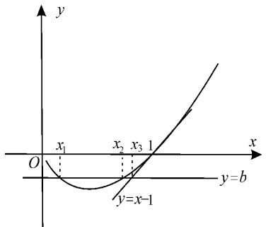
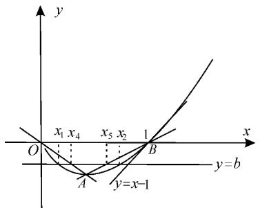

natural_image

Illustration of a child sitting among lotus flowers and clover plants (no text or symbols)

# 导数背景下破解多元不等式问题的五大法宝

■湖北省仙桃八中刘少平名师工作室 刘少平 周凌

在近年的高考和模拟考试中，以多元不等式模型为载体的试题频繁亮相，它因变量多、内涵丰富、解法灵活多变而具有较强的挑战性，成为考试的热点和难点。解决这类问题总的指导思想是减元，即先通过消元、换元、主元法，及放缩手段，尽量化为一元问题，再构造新函数，实现问题的解决。若消元困难，还可借助同构函数、切割线放缩、不等式放缩等特殊手段来处理。下面举例分析此类题型的命题规律，揭示这类试题的解决方法，希望对同学们有所帮助。

# 一、消参减元，构建单变量函数

例 1 已知函数 $f(x)=2x-\frac{a}{x}-8\ln x(a\in\mathbb{R})$ 。当函数 $f(x)$ 有两个极值点 $x_{1}, x_{2}(x_{1}<x_{2})$ 且 $x_{1}\neq1$ 时，总有 $\frac{a\ln x_{1}}{1-x_{1}}>m(5x_{2}-x_{2}^{2})$ 成立，则实数 m 的取值范围为 \_\_\_\_。

解析: 已知 $f(x)=2x-\frac{a}{x}-8\ln x$ (x>0)，则 $f'(x)=\frac{2x^{2}-8x+a}{x^{2}}$ 。

因为 $x_{1}, x_{2}$ 是函数 $f(x)$ 的两个极值点，所以 $x_{1}, x_{2} (x_{1} < x_{2})$ 是方程 $2x^{2} - 8x + a = 0$ 两个不同的正根。

于是 $\Delta=64-8a>0$ ，且 $\left\{\begin{aligned}x_{1}+x_{2}&=4,\\ x_{1}\cdot x_{2}&=\frac{a}{2}\end{aligned}\right.$ 则

$$
\left\{ \begin{array}{l l} x _ {2} = 4 - x _ {1}, \\ a = 2 x _ {1} (4 - x _ {1}), \end{array} \text {且} x _ {1} \in (0, 1) \bigcup (1, 2) \right. 。
$$

原不等式可转化为 $\frac{2x_{1}(4-x_{1})\ln x_{1}}{1-x_{1}}>$ $m[5(4-x_{1})-(4-x_{1})^{2}]$ ，即 $\frac{2x_{1}\ln x_{1}}{1-x_{1}}>$ $m(1+x_{1})$ ，于是 $m<\frac{2x_{1}\ln x_{1}}{1-x_{1}^{2}}$ 。

因此可构造函数 $g(x)=\frac{2x\ln x}{1-x^{2}},x\in(0,1)\cup(1,2)$ ，则 $g'(x)=\frac{2(1+x^{2})}{(1-x^{2})^{2}}\cdot\left(\ln x+\frac{2}{1+x^{2}}-1\right)$ 。

令 $\varphi(x) = \ln x + \frac{2}{1 + x^2} - 1, x \in (0,1) \cup (1,2)$ , 则 $\varphi'(x) = \frac{(x^2 - 1)^2}{x(1 + x^2)^2} > 0, \varphi(x)$ 在 $(0,1)$ 和 $(1,2)$ 上分别单调递增。

因为 $\varphi(1)=0$ ，所以当 $x\in(0,1)$ 时， $\varphi(x)<0$ ， $g(x)$ 单调递减；当 $x\in(1,2)$ 时， $\varphi(x)>0$ ， $g(x)$ 单调递增。

由洛必达法则可知， $\lim_{x\to1}g(x)=\lim_{x\to1}\frac{2\ln x+2}{-2x}=-1$ 。故 $g(x)>-1$ ，实数m的取值范围为 $(-∞,-1]$ 。

评注:本题借助根与系数的关系将 $a, x_{2}$ 用 $x_{1}$ 表示, 将多个变量减少为一个变量, 然后构造单变量函数使问题得以解决。

例 2 已知函数 $f(x)=a(1+x)\mathrm{e}^{-x}$

$+x^{2}$ 。

(1) 讨论 $f(x)$ 的零点个数；  
(2) 若 $f(x)$ 存在两个极值点，记 $x_{0}$ 为 $f(x)$ 的极大值点， $x_{1}$ 为 $f(x)$ 的零点，证明： $x_{0}-2x_{1}>2$ 。

解析:(1)因为 $f(x)=a(1+x)\mathrm{e}^{-x}+x^{2}$ ，所以 $f'(x)=-axe^{-x}+2x=\frac{x(2\mathrm{e}^{x}-a)}{\mathrm{e}^{x}}$ 。

(i) 当 a<0 时， $2e^{x}-a>0$ 恒成立，所以当 $x\in(-\infty,0)$ 时， $f'(x)<0,f(x)$ 单调递减；当 $x\in(0,+\infty)$ 时， $f'(x)>0,f(x)$ 单调递增。

又 $f(0) = a < 0, f(-1) = 1 > 0$ ，当 $x \to +\infty$ 时， $(x + 1)\mathrm{e}^{-x} \to 0, x^2 \to +\infty, f(x) \to +\infty$ 。由零点存在定理知， $f(x)$ 有两个零点。

(ii) 当 $a = 0$ 时, $f(x) = x^2$ , 可知 $f(x)$ 在 $(- \infty, 0)$ 上单调递减, 在 $(0, +\infty)$ 上单调递增。又 $f(0) = 0$ , 故 $f(x)$ 仅有一个零点。

（iii）当 $a > 0$ 时，令 $f^{\prime}(x) = 0$ ，得 $x = 0$ 或 $x = \ln \frac{a}{2}$ 。

①当 a=2 时， $f'(x) \geqslant 0$ ，所以 $f(x)$ 在 $(-∞,+∞)$ 上单调递增。又 $f(-1)=1>0, f(-2)=-2e^{2}+4<0$ ，故 $f(x)$ 仅有一个零点。  
②当 0 < a < 2 时， $\ln \frac{a}{2} < 0$ ，所以 $f(x)$ 在 $\left(-\infty, \ln \frac{a}{2}\right)$ 上单调递增，在 $\left(\ln \frac{a}{2}, 0\right)$ 上单调递减，在 $(0, +\infty)$ 上单调递增。

易知 $f(0)=a>0$ 。

$f\left(-1-\frac{1}{a}\right)=-\mathrm{e}^{1+\frac{1}{a}}+\left(1+\frac{1}{a}\right)^{2}$ ，令 $t=1+\frac{1}{a}$ ，易证 $f(-t)=-\mathrm{e}^{t}+t^{2}<0$ ， $f(x)$ 仅有一个零点。

③当 a > 2 时， $\ln \frac{a}{2} > 0$ ，所以 $f(x)$ 在 $(-∞, 0)$ 上单调递增，在 $\left(0, \ln \frac{a}{2}\right)$ 上单调递减，在 $\left(\ln \frac{a}{2}, +∞\right)$ 上单调递增。

又 $f(0) = a > 0, f\left(\ln \frac{a}{2}\right) =$

$a\left(\ln \frac{a}{2} + 1\right)\mathrm{e}^{-\ln \frac{a}{2}} + \left(\ln \frac{a}{2}\right)^{2} = \left(\ln \frac{a}{2}\right)^{2} + 2\ln \frac{a}{2} + 2 = \left(\ln \frac{a}{2} + 1\right)^{2} + 1 > 0$ ，且 $f(-2) = -a\mathrm{e}^{2} + 4 < -2\mathrm{e}^{2} + 4 < 0$ ，所以 $f(x)$ 仅有一个零点。

综上, 当 $a \geqslant 0$ 时, $f(x)$ 仅有一个零点; 当 a < 0 时, $f(x)$ 有两个零点。

(2) 若 $f(x)$ 存在两个极值点，由(1)可知 $a \in (0, 2) \cup (2, +\infty)$ 。

①当 $a \in (2, +\infty)$ 时， $f(x)$ 的极大值点 $x_{0} = 0$ 。  
由零点存在定理得 $f(x)$ 的零点 $x_{1} \in (-2, -1)$ ，所以 $x_{0} - 2x_{1} > 0 - 2 \times (-1) = 2$ 。  
②当 $a \in (0,2)$ 时， $f(x)$ 的极大值点 $x_{0} = \ln \frac{a}{2}$ 。由零点存在定理得 $f(x)$ 的零点 $x_{1} \in \left(-1 - \frac{1}{a}, -1\right)$ 。

因为 $x_0 = \ln \frac{a}{2}, a(x_1 + 1)\mathrm{e}^{-x_1} + x_1^2 = 0$ 所以 $a = 2\mathrm{e}^{x_0}, a = \frac{-x_1^2\mathrm{e}^{x_1}}{x_1 + 1}, x_1 \in (-\infty, -1)$ 即 $2\mathrm{e}^{x_0} = -\frac{x_1^2\mathrm{e}^{x_1}}{x_1 + 1}$ ，整理可得 $\mathrm{e}^{x_0 - 2x_1} = \frac{\mathrm{e}^{x_0}}{\mathrm{e}^{2x_1}} = -\frac{x_1^2\mathrm{e}^{-x_1}}{2(x_1 + 1)}$ 。

令 $p(x) = -\frac{x^2\mathrm{e}^{-x}}{2(x + 1)} (x <   - 1)$ ，则 $p^{\prime}(x) =$ $\frac{x(x^2 - 2)\mathrm{e}^{-x}}{2(x + 1)^2}$ 。又 $x\in (-\infty , - 1)$ ，故 $p^{\prime}(x) = 0$ 的根为 $-\sqrt{2},p(x)$ 在 $(- \infty , - \sqrt{2})$ 上单调递减，在 $(-\sqrt{2}, - 1)$ 上单调递增， $p(x)\geqslant p(-\sqrt{2}) =$ $-\frac{2\mathrm{e}^{\sqrt{2}}}{2\times(-\sqrt{2} + 1)} = (\sqrt{2} +1)\cdot \mathrm{e}^{\sqrt{2}}$

则 $\mathrm{e}^{x_0 - 2x_1}\geqslant (\sqrt{2} +1)\mathrm{e}^{\sqrt{2}}$ ，即 $x_0 - 2x_1\geqslant$ $\ln (\sqrt{2} +1) + \sqrt{2}$ 。

易证 $\ln x \leqslant x - 1, x \in (0, +\infty)$ ，所以 $\ln \frac{1}{x} \leqslant \frac{1}{x} - 1$ ，即 $\ln x \geqslant 1 - \frac{1}{x}$ ，当且仅当 $x = 1$ 时取等号，故 $x_0 - 2x_1 \geqslant \ln (\sqrt{2} + 1) + \sqrt{2} > 1 - \frac{1}{\sqrt{2} + 1} + \sqrt{2} = 2$ 。

综上， $x_{0}-2x_{1}>2$ 总成立。

评注:本题借助极大值点和零点的定义,得出 $a=2e^{x_{0}}$ 和 $a=\frac{-x_{1}^{2}e^{x_{1}}}{x_{1}+1}$ , 然后借助参数 a 得出 $2e^{x_{0}}=-\frac{x_{1}^{2}e^{x_{1}}}{x_{1}+1}$ ，于是有 $e^{x_{0}-2x_{1}}=-\frac{x_{1}^{2}e^{-x_{1}}}{2(x_{1}+1)}$ ，从而将双变量变为单变量，再构造函数，通过放缩法来实现不等式的证明。

# 二、借助换元，构建单变量函数

# 1. 比值换元

例 3 已知函数 $f(x)=a \cdot e^{2x}-x^{2}$ ， $a \in R$ 。

(1) 设 $f(x)$ 的导函数为 $g(x)$ ，讨论 $g(x)$ 的零点个数；  
(2) 设 $f(x)$ 的极值点为 $x_{1}, x_{2} (x_{1} < x_{2})$ ，若 $\frac{e}{e-2} x_{1} + x_{2} \geqslant \lambda x_{1} x_{2}$ 恒成立，求实数 $\lambda$ 的取值范围。

解析:(1) $g(x)=f'(x)=2a\cdot e^{2x}-2x$ ，则 $g'(x)=4a\mathrm{e}^{2x}-2$ 。

①当 $a \leqslant 0$ 时， $g'(x) < 0, g(x)$ 在 R 上单调递减。又当 $x \to -\infty$ 时， $g(x) \to +\infty$ ，当 $x \to +\infty$ 时， $g(x) \to -\infty$ ，由函数零点存在定理可得 $g(x)$ 存在唯一零点。  
②当 a>0 时，令 $g'(x)=4a \cdot e^{2x}-2>0$ ，解得 $x > -\frac{\ln 2a}{2}$ 。

故当 $x \in \left(-\frac{\ln 2a}{2}, +\infty\right)$ 时， $g'(x) > 0$ ，
g(x)单调递增。

同理当 $x \in \left(-\infty, -\frac{\ln 2a}{2}\right)$ 时， $g(x)$ 单调递减。

所以 $g(x)_{\min}=g\left(-\frac{\ln 2a}{2}\right)=1+\ln 2a$ 。

易知当 $x \to -\infty$ 时， $g(x) \to +\infty$ ，当 $x \to +\infty$ 时， $g(x) \to +\infty$ 。

当 $g\left(-\frac{\ln 2a}{2}\right)<0$ 时，即 $0<a<\frac{1}{2e}$ ，由零点存在定理知 $g(x)$ 存在 2 个零点；

当 $a=\frac{1}{2e}$ 时， $g(x)$ 存在 1 个零点；

当 $a > \frac{1}{2e}$ 时， $g(x)$ 无零点。

(2)结合(1)知， $f(x)$ 的极值点为 $x_{1}, x_{2}$ ( $x_{1} < x_{2}$ )，即方程 $2a e^{2x} - 2x = 0$ 的两根为 $x_{1}, x_{2}$ ，则 $0 < a < \frac{1}{2e}$ ，所以 $a e^{2x_{1}} = x_{1} > 0$ ， $a e^{2x_{2}} = x_{2} > 0$ 。两式相除并取自然对数得：

$2(x_{2} - x_{1}) = \ln \frac{x_{2}}{x_{1}} >0$

由 $\frac{\mathrm{e}}{\mathrm{e} - 2} x_1 + x_2 \geqslant \lambda x_1 x_2$ ，得：

$$
2 \left(x _ {2} - x _ {1}\right) \left(\frac {\mathrm{e}}{\mathrm{e} - 2} x _ {1} + x _ {2}\right) \geqslant \lambda x _ {1} x _ {2} \ln \frac {x _ {2}}{x _ {1}} 。
$$

整理得 $\lambda\leqslant\frac{2\left(\frac{2}{\mathrm{e}-2}+\frac{x_{2}}{x_{1}}-\frac{\mathrm{e}}{\mathrm{e}-2}\cdot\frac{x_{1}}{x_{2}}\right)}{\ln\frac{x_{2}}{x_{1}}}$ 。

令 $t=\frac{x_{2}}{x_{1}}>1$ 。

令 $h(t)=\frac{2\left(\frac{2}{\mathrm{e}-2}+t-\frac{\mathrm{e}}{\mathrm{e}-2}\cdot\frac{1}{t}\right)}{\ln t}(t>$ 1)，则 $\lambda\leqslant h(t)$ 恒成立，易得 $h'(t)=\frac{2\left[\left(t^{2}+\frac{\mathrm{e}}{\mathrm{e}-2}\right)\ln t-\left(\frac{2t}{\mathrm{e}-2}+t^{2}-\frac{\mathrm{e}}{\mathrm{e}-2}\right)\right]}{t^{2}\left(\ln t\right)^{2}}$ 。

令 $\varphi(t) = \left(t^2 + \frac{\mathrm{e}}{\mathrm{e}-2}\right)\ln t - \left(\frac{2t}{\mathrm{e}-2} + t^2 - \frac{\mathrm{e}}{\mathrm{e}-2}\right)(t > 1)$ , 则 $\varphi'(t) = 2t\ln t - t + \frac{\mathrm{e}}{\mathrm{e}-2} \cdot \frac{1}{t} - \frac{2}{\mathrm{e}-2}$ 。因为 $\varphi''(t) = 2\ln t + 1 - \frac{\mathrm{e}}{\mathrm{e}-2} \cdot \frac{1}{t^2}$ 在 $(1, +\infty)$ 上单调递增，且 $\varphi''(1) = \frac{-2}{\mathrm{e}-2} < 0, \varphi''(\mathrm{e}) = 3 - \frac{1}{\mathrm{e}^2 - 2\mathrm{e}} > 0$ ，所以存在 $t_0 \in (1, \mathrm{e})$ ，使得 $\varphi''(t_0) = 0$ 。当 $t \in (1, t_0)$ 时， $\varphi''(t) < 0, \varphi'(t)$ 单调递减；当 $t \in (t_0, +\infty)$ 时， $\varphi''(t) > 0, \varphi'(t)$ 单调递增。

又 $\varphi'(1)=0,\varphi'(e)>0$ ，则存在 $t_{1}\in(1,$ e)使得 $\varphi'(t_{1})=0$ 。当 $t\in(1,t_{1})$ 时， $\varphi'(t)<0,\varphi(t)$ 单调递减；当 $t\in(t_{1},+\infty)$ 时， $\varphi'(t)>0,\varphi(t)$ 单调递增。

又 $\varphi(1)=\varphi(e)=0$ ，当 $t\in(1,e)$ 时， $\varphi(t)<0,h'(t)<0,h(t)$ 单调递减；当 $t\in(\mathrm{e},+\infty)$ 时， $\varphi(t)>0,h'(t)>0,h(t)$ 单调递增。

所以 $h(t)_{\min}=h(e)=\frac{2(e-1)^{2}}{e-2}$ ，则 $\lambda$ 的

取值范围为 $\left(-\infty,\frac{2(e-1)^{2}}{e-2}\right]$ 。

评注:比值换元的目的是消参减元,就是根据极值点之间的关系构建等式 $\left\{\begin{aligned}a\mathrm{e}^{2x_{1}}&=x_{1},\\ a\mathrm{e}^{2x_{2}}&=x_{2},\end{aligned}\right.$ 将两式相除并取对数得 $2(x_{2}-x_{1})=\ln\frac{x_{2}}{x_{1}}$ ,然后在不等式 $\frac{\mathrm{e}}{\mathrm{e}-2}x_{1}+x_{2}\geqslant\lambda x_{1}x_{2}$ 左侧乘以 $2(x_{2}-x_{1})$ ,右侧乘以 $\ln\frac{x_{2}}{x_{1}}$ ,得到含有 $\frac{x_{2}}{x_{1}}$ 的表达式,用 $t=\frac{x_{2}}{x_{1}}$ 表示两极值点的比值,从而实现消参减元,将问题转化为关于t的函数问题求解。

# 2. 差值换元

例 4 已知函数 $f(x)=x+\frac{m}{\mathrm{e}^{x}}$ 。

(1) 讨论 $f(x)$ 的单调性；  
(2) 若 $x_{1} \neq x_{2}$ ，且 $f(x_{1}) = f(x_{2}) = 2$ ，证明：0 < m < e，且 $x_{1} + x_{2} < 2$ 。

解析:(1) $f(x)$ 的定义域为 R, $f'(x)=1-\frac{m}{\mathrm{e}^{x}}=\frac{\mathrm{e}^{x}-m}{\mathrm{e}^{x}}$ 。

若 $m \leqslant 0$ ，则 $f'(x) > 0$ 恒成立， $f(x)$ 单调递增。

若 m>0，则当 $x\in(-\infty,\ln m)$ 时， $f'(x)<0,f(x)$ 单调递减；当 $x\in(\ln m,+\infty)$ 时， $f'(x)>0,f(x)$ 单调递增。

综上, 当 $m \leqslant 0$ 时, $f(x)$ 在 R 上单调递增; 当 m > 0 时, $f(x)$ 在区间 $(-\infty, \ln m)$ 上单调递减, 在区间 $(\ln m, +\infty)$ 上单调递增。

(2)①先证明 0<m<e。由题意得 $x_{1}$ ， $x_{2}$ 是方程 $x+\frac{m}{\mathrm{e}^{x}}=2$ ，即 $m=\mathrm{e}^{x}(2-x)$ （m 为参数）的两个实数根。

令 $g(x)=\mathrm{e}^{x}(2-x)$ ，则 $g'(x)=\mathrm{e}^{x}(1-x)$ 。当 $x\in(-\infty,1)$ 时， $g'(x)>0$ ， $g(x)$ 单调递增；当 $x\in(1,+\infty)$ 时， $g'(x)<0$ ， $g(x)$ 单调递减。

所以 $g(x)_{\max}=g(1)=\mathrm{e}$ 。

又当 $x \to -\infty$ 时， $g(x) \to 0$ ，且 $g(x) > 0$ ，当 $x \to +\infty$ 时， $g(x) \to -\infty$ ，故 0 < m < e。

②再证明 $x_{1} + x_{2} < 2$ 。由 $f(x_{1}) =$

$f(x_{2})=2$ ，得 $x_{1}, x_{2}$ 是方程 $x+\frac{m}{e^{x}}=2$ 的两个实数根。由 m>0，可得 $x_{1}\neq2, x_{2}\neq2$ ，所以 $x_{1}, x_{2}$ 是方程 $e^{x}=\frac{m}{2-x}$ （m 为参数）的两

个实数根， $\left\{\begin{aligned}\mathrm{e}^{x_{1}}&=\frac{m}{2-x_{1}},\\ \mathrm{e}^{x_{2}}&=\frac{m}{2-x_{2}}.\end{aligned}\right.$ 不妨设 $t=x_{2}-x_{1}>$

0, 则 $x_{2} = x_{1} + t$ 。所以 $\frac{\mathrm{e}^{x_1}}{\mathrm{e}^{x_2}} = \frac{2 - x_2}{2 - x_1} = \frac{2 - x_1 + (x_1 - x_2)}{2 - x_1} = 1 - \frac{x_2 - x_1}{2 - x_1}, \frac{1}{\mathrm{e}^t} = 1 - \frac{t}{2 - x_1}$ , 得 $x_{1} = 2 - \frac{t\mathrm{e}^{t}}{\mathrm{e}^{t} - 1}$ 。则 $x_{1} + x_{2} = 2x_{1} + t = 4 - \frac{2te^{t}}{\mathrm{e}^{t} - 1} + t$ 。要证 $x_{1} + x_{2} < 2$ , 即证 $4 - \frac{2te^{t}}{\mathrm{e}^{t} - 1} + t < 2$ , 也即证 $t + 2 < \frac{2te^{t}}{\mathrm{e}^{t} - 1}$ 。

因为 t>0，所以 $e^{t}-1>0$ 。上式可化为 $(t+2)(e^{t}-1)<2te^{t}$ ，即 $(t-2)e^{t}+t+2>0$ 。

记 $p(t) = (t - 2)\mathrm{e}^t +t + 2(t > 0)$ ，则 $p^{\prime}(t) = (t - 1)\mathrm{e}^{t} + 1$

记 $q(t)=p'(t)=(t-1)e^{t}+1(t>0)$ ，则 $q'(t)=te^{t}, q'(t)>0, q(t)$ 在 $(0,+\infty)$ 上单调递增。

所以 $q(t) > q(0) = (0 - 1)e^{0} + 1 = 0$ ，即 $p'(t) > 0, p(t)$ 在 $(0, +\infty)$ 上单调递增。

故 $p(t) > p(0) = (0 - 2)\mathrm{e}^0 +0 + 2 = 0$ 即 $(t - 2)\mathrm{e}^t +t + 2 > 0$ ，则 $x_{1} + x_{2} <   2$ ，证毕。

评注:差值换元主要用于解决与指数型函数有关的问题,依据指数基本运算 $\frac{e^{x_{1}}}{e^{x_{2}}} = e^{x_{1} - x_{2}}$ ,进而引入 $t = x_{2} - x_{1}$ 。解题的关键:①找到两个零点的相应关系;②通过方程组的变形达到消参减元的目的,利用t分别表示变量 $x_{1}, x_{2}$ ,将所证不等式转化为关于t的不等式;③构造函数,转化为函数的最值问题,即可进一步求解。

# 三、利用主元法消元，构建单变量函数

例 5 已知函数 $f(x)=x^{3}+k\ln x$ ， $f'(x)$ 为 $f(x)$ 的导函数。当 $k \geqslant -3$ 时，求证：对任意的 $x_{1}, x_{2} \in [1, +\infty)$ ，当 $x_{1} > x_{2}$ 时， $\frac{f'(x_{1})+f'(x_{2})}{2}>\frac{f(x_{1})-f(x_{2})}{x_{1}-x_{2}}$ 。

证明:由题意知, $f'(x)=3x^{2}+\frac{k}{x}$ 。要证 $\frac{f'(x_{1})+f'(x_{2})}{2}>\frac{f(x_{1})-f(x_{2})}{x_{1}-x_{2}}$ ，即证

$$
\frac {1}{2} \left(3 x _ {1} ^ {2} + \frac {k}{x _ {1}} + 3 x _ {2} ^ {2} + \frac {k}{x _ {2}}\right) > \frac {x _ {1} ^ {3} - x _ {2} ^ {3} + k \ln \frac {x _ {1}}{x _ {2}}}{x _ {1} - x _ {2}},
$$

也即证 $\frac{3}{2} (x_1^2 + x_2^2) + \frac{k}{2} \cdot \frac{x_1 + x_2}{x_1x_2} > x_1^2 +$

$$
x _ {1} x _ {2} + x _ {2} ^ {2} + k \cdot \frac {\ln \frac {x _ {1}}{x _ {2}}}{x _ {1} - x _ {2}}, \text {变形可得} (x _ {1} - x _ {2}) ^ {3}
$$

$$
+ k \cdot \frac {x _ {1} ^ {2} - x _ {2} ^ {2}}{x _ {1} x _ {2}} - 2 k \ln \frac {x _ {1}}{x _ {2}} > 0 。
$$

把 $x_{1}$ 看作自变量， $x_{2}$ 和 $k$ 看作参数，可构造函数 $g(x) = (x - x_{2})^{3} + k \cdot \frac{x^{2} - x_{2}^{2}}{x_{2}x} -$

$2k\ln\frac{x}{x_{2}},x>x_{2}\geqslant1$ ，则 $g'(x)=3(x-x_{2})^{2}+$

$$
k \left(\frac {1}{x _ {2}} + \frac {x _ {2}}{x ^ {2}}\right) - \frac {2 k}{x} = \frac {(x - x _ {2}) ^ {2} (3 x _ {2} x ^ {2} + k)}{x _ {2} x ^ {2}} >
$$

0, 故 $g(x)$ 在 $(x_{2}, +\infty)$ 上单调递增，即 $g(x) > g(x_{2}) = 0$ ，不等式得证。

评注: 当题中变量比较多时, 可以根据解题需要, 选择一个变量作为主元, 以此为线索来解题, 化多元为一元, 从而达到减元的目的。

# 四、利用同构函数整体消元

例6 已知函数 $f(x) = (a + 1)\ln x + ax^2 + 1$ 。

(1) 讨论函数 $f(x)$ 的单调性；

(2) 设实数 $a < -1$ ，如果 $\forall x_1, x_2 \in (0, +\infty)$ ， $|f(x_1) - f(x_2)| \geqslant 4|x_1 - x_2|$ ，求实数 $a$ 的取值范围。

解析:(1) $f(x)$ 的定义域为 $(0,+\infty)$ , $f'(x)=\frac{a+1}{x}+2ax=\frac{2ax^{2}+a+1}{x}$ 。

当 $a \geqslant 0$ 时， $f'(x) > 0, f(x)$ 在 $(0, +\infty)$ 上单调递增。

当 $a \leqslant -1$ 时， $f'(x) < 0$ ，故 $f(x)$ 在 $(0, +\infty)$ 上单调递减。

当 $-1 < a < 0$ 时，令 $f'(x) = 0$ ，解得 $x = \sqrt{-\frac{a + 1}{2a}}$ 。则当 $x \in \left(0, \sqrt{-\frac{a + 1}{2a}}\right)$ 时，

$f'(x)>0,\ f(x)$ 单调递增；当 $x\in\left(\sqrt{-\frac{a+1}{2a}},+\infty\right)$ 时， $f'(x)<0,f(x)$ 单调递减。

(2)由(1)知,当 a<-1 时, $f(x)$ 在 $(0,+\infty)$ 上单调递减。

不妨设 $x_{1} \geqslant x_{2}$ , 从而 $\forall x_{1}, x_{2} \in (0, +\infty), |f(x_{1}) - f(x_{2})| \geqslant 4|x_{1} - x_{2}|$ , 等价于 $\forall x_{1}, x_{2} \in (0, +\infty), f(x_{2}) + 4x_{2} \geqslant f(x_{1}) + 4x_{1}$ 。①

令 $g(x)=f(x)+4x$ ，则 $g'(x)=\frac{a+1}{x}+2ax+4$ 。

①式等价于 $g(x)$ 在 $(0, +\infty)$ 上单调递减，即 $\frac{a+1}{x} + 2ax + 4 \leqslant 0$ 恒成立，从而 $a \leqslant \frac{-4x - 1}{2x^{2} + 1}$ 。

令 $h(x) = \frac{-4x - 1}{2x^2 + 1}, x \in (0, +\infty)$ ，则 $h'(x) = \frac{4(2x - 1)(x + 1)}{(2x^2 + 1)^2}$ 。

当 $x \in \left(0, \frac{1}{2}\right)$ 时， $h'(x) < 0, h(x)$ 单调递减；当 $x \in \left(\frac{1}{2}, +\infty\right)$ 时， $h'(x) > 0, h(x)$ 单调递增。

所以 $h(x)_{\min}=h\left(\frac{1}{2}\right)=-2$ 。

因此,实数 a 的取值范围为 $(-∞,-2]$ 。

评注:通过对给出的双参不等式变形重组,从中识别、寻找、挖掘不等式两边的共性,推出了一个新函数的单调性,再利用此单调性转化出一个恒成立不等式,解决了参数的取值范围问题。同构消参是解题的关键。

例 7 已知函数 $f(x)=(x-1)\mathrm{e}^{x}-\frac{a}{2}x^{2}$ ，对任意 $x_{1}\in\mathbb{R}, x_{2}\in(0,+\infty)$ ，都有 $f(x_{1}+x_{2})-f(x_{1}-x_{2})>-2x_{2}$ 成立，则实数 a 的最大整数值为 \_\_\_\_。

解析:对题设中的不等式实施等价变形,可得 $f(x_{1}+x_{2})+x_{1}+x_{2}>f(x_{1}-x_{2})+(x_{1}-x_{2})$ 。于是可构造函数 $g(x)=f(x)+x$ , 由 $x_{1}\in\mathbf{R}, x_{2}\in(0,+\infty)$ , 知 $x_{1}+x_{2}>$ $x_{1}-x_{2}$ ，因此只需证明 $g(x)$ 在 R 上单调递增，即 $g'(x)=xe^{x}-ax+1\geqslant0$ 对任意 $x\in R$ 恒成立。

当 x=0 时， $g'(0)=1>0$ ，结论显然成立。

当 x<0 时，要使 $g'(x)\geqslant0$ ，只需 $a\geqslant e^{x}+\frac{1}{x}$ 恒成立。由 $e^{x}>x+1(x\neq0)$ ，知 $e^{x}+\frac{1}{x}>x+\frac{1}{x}+1$ 。又 x<0，则 $x+\frac{1}{x}+1\leqslant-2+1=-1$ ，故 a>-1。

当 x>0 时，要使 $g'(x)\geqslant0$ ，只需 $a\leqslant e^{x}+\frac{1}{x}$ 恒成立。由 $e^{x}>x+1$ ，得 $e^{x}+\frac{1}{x}>x+\frac{1}{x}+1\geqslant2+1=3$ ，故 $a\leqslant3$ 。

综上,实数 a 的最大整数值为 3。

评注:本题是涉及三个变量的不等式,看似无从下手,实则通过变形与转化,寻找出不等式两边中对应关系的共性,进行同构,将问题转化为含参函数单调性判断问题,即可顺利解决。

# 五、利用放缩法简化不等式

# 1. 利用切割线放缩

例8 已知函数 $f(x) = ax\ln x - x^3 - 1$ 。

(1) 若 a=1，求 $f(x)$ 的单调区间；

(2) 若 $0 \leqslant a \leqslant 3$ ，求证： $f(x) < 0$ ;

(3) 若 $h(x)=\frac{f(x)+x^{3}+1}{a}, \exists x_{1}\neq x_{2}$ ，使得 $h(x_{1})=h(x_{2})=b$ ，求证： $be+1<|x_{1}-x_{2}|<b+1$ 。

解析:(1)答案略。

(2) 证明过程略。

(3) $h(x)=x\ln x$ ，则 $h'(x)=\ln x+1$ 。令 $h'(x)<0$ ，则 $0<x<\frac{1}{e}$ ，故 $h(x)$ 在区间 $\left(0,\frac{1}{e}\right)$ 上单调递减，在区间 $\left(\frac{1}{e},+\infty\right)$ 上单调递增。因为 $h(1)=0,h\left(\frac{1}{e}\right)=-\frac{1}{e}$ ， $\lim_{x\to0^{+}}h(x)=0$ ，所以 $b\in\left(-\frac{1}{e},0\right)$ 。不妨设 $x_{1}<x_{2}$ ，则 $x_{1}\in\left(0,\frac{1}{e}\right),x_{2}\in\left(\frac{1}{e},1\right)$ 。

先证 $x_{2} - x_{1} < b + 1$ 。

易知 $h(x)$ 在 x=1 处的切线方程为 y=x-1，设切线与直线 y=b 的交点横坐标为 $x_{3}=b+1$ ，如图 1 所示。令 $g(x)=h(x)-(x-1)=x\ln x-x+1$ ，则 $g'(x)=\ln x$ 。当 $x\in(0,1)$ 时， $g'(x)<0$ ，此时 $g(x)>g(1)=0,y=x-1$ 的图像在 $y=h(x)$ 的图像下方。

text_image

y
x₁ x₂ x₃ 1 x
O y=b
y=x-1

图1

故 $x_{3} > x_{2} - x_{1}$ ，即 $x_{2} - x_{1} < b + 1$ 。

再证 $x_{2}-x_{1}>be+1$ 。设 $A\left(\frac{1}{e},-\frac{1}{e}\right)$ ， $B(1,0)$ ，易知直线 OA 的方程为 y=-x，直线 AB 的方程为 $y=\frac{1}{e-1}(x-1)$ 。如图 2，直线 OA，AB 与 y=b 的交点横坐标分别为 $x_{4}=-b$ ， $x_{5}=(e-1)b+1$ ，则 $x_{5}-x_{4}=be+1$ ，故 $x_{4}=-b=-x_{1}\ln x_{1}>x_{1}$ 。

text_image

y
x₁ x₄ x₅ x₂ 1
O B
y=b
A y=x-1

图2

同理可证 $x_{4}<x_{2}$ ，故 $x_{1}<x_{4}<x_{2}$ 。

类似还可以证明 $x_{1} < x_{5} < x_{2}$ ，则 $x_{5} - x_{4} < x_{2} - x_{1}$ ，即 $b\mathrm{e} + 1 < x_{2} - x_{1}$ 。

因此 $be+1<|x_{1}-x_{2}|<b+1$ 。

评注:本题涉及含有两个零点的 $h(x)$ 的解析式,并且方程 $h(x)=b$ 有两个实根,要证明两个实根之差小于(或大于)某个表达式,解题策略是画出 $h(x)$ 的图像,并求出 $h(x)$ 在两零点处的切线方程(有时候不是找切线,而是找过曲线上某两点的直线),然后严格证明曲线 $h(x)$ 在切线(或所在直线)的上方或下方,进而对 $x_{1}, x_{2}$ 放大或者缩小,从而实现证明。

# 2. 利用不等式放缩

例 9 已知函数 $f(x)=\frac{1}{2}x^{2}-a\cos x+bx\ln x-bx,a,b\in\mathbf{R}$ 。

(1) 若 b=0，且函数 $f(x)$ 在 $\left(0, \frac{\pi}{2}\right)$ 上单调递增，求实数 a 的取值范围。  
(2) 设 $f(x)$ 的导函数为 $f'(x)$ ，若 0 < a < 1, $x_{1}, x_{2}$ 满足 $f'(x_{1}) = f'(x_{2})$ ，证明： $\sqrt{x_{1}}+\sqrt{x_{2}}>2\sqrt{\frac{-b}{1+a}}$ 。

解析:(1)当 b=0 时, $f(x)=\frac{1}{2}x^{2}-a\cos x,f'(x)=x+a\sin x$ 。

因为 $f(x)$ 在 $\left(0, \frac{\pi}{2}\right)$ 上单调递增，所以 $f'(x)=x+a\sin x\geqslant0$ 在 $\left(0,\frac{\pi}{2}\right)$ 上恒成立。

令 $g(x)=x+a\sin x$ ，则 $g'(x)=1+a\cos x$ 。

① 若 $a \geqslant -1$ ，则当 $x \in \left(0, \frac{\pi}{2}\right)$ 时， $g(x) \geqslant x - \sin x$ 。

令 $p(x)=x-\sin x, x\in\left(0,\frac{\pi}{2}\right)$ ，则 $p'(x)=1-\cos x\geqslant0,p(x)$ 在 $\left(0,\frac{\pi}{2}\right)$ 上单调递增。故当 $x\in\left(0,\frac{\pi}{2}\right)$ 时， $p(x)>p(0)=0$ ， $g(x)>0$ 恒成立，符合题意。

②若 a<-1，则 $g'(x)$ 在 $\left(0,\frac{\pi}{2}\right)$ 上单调递增，且 $g'(0)=1+a<0, g'\left(\frac{\pi}{2}\right)=1>0$ ，所以存在唯一 $x_{0}\in\left(0,\frac{\pi}{2}\right)$ 使得 $g'(x_{0})=0$ 。当 $x\in(0,x_{0})$ 时， $g'(x)<0, g(x)$ 单调递减，即 $\forall x\in(0,x_{0}), g(x)<g(0)=0$ ，不符合题意。

综上,实数 a 的取值范围为 $\left[-1,+\infty\right)$ 。

(2) $f'(x)=x+a\sin x+b\ln x,x>0$ 。当 $a\in(0,1)$ 时，函数 $y=x+a\sin x$ 在(0，

$+\infty)$ 上单调递增。依题意分析可知 b<0。

不妨设 $0 < x_{1} < x_{2}$ ，由 $x_{1} + a\sin x_{1} + b\ln x_{1} = x_{2} + a\sin x_{2} + b\ln x_{2}$ ，移项得 $(x_{2} - x_{1}) + a(\sin x_{2} - \sin x_{1}) = (-b)(\ln x_{2} - \ln x_{1})$ 。

由(1)知 $x_{2}-\sin x_{2}>x_{1}-\sin x_{1}$ ，即 $\sin x_{2}-\sin x_{1}<x_{2}-x_{1}$ ，所以 $(-b)(\ln x_{2}-\ln x_{1})<(a+1)(x_{2}-x_{1})$ 。

故 $(-b)\ln \frac{x_2}{x_1} < (a + 1)(x_2 - x_1)$ 。(※)

设 $h(x)=\ln x-2\cdot\frac{x-1}{x+1}(x>1)$ ，则 $h'(x)=\frac{1}{x}-\frac{4}{(x+1)^{2}}=\frac{(x-1)^{2}}{x(x+1)^{2}}>0.$

故当 $x > 1$ 时， $h(x) > h(1) = 0$ ，即 $\ln x > 2 \cdot \frac{x - 1}{x + 1}$ ，于是有 $\ln \sqrt{x} > 2 \cdot \frac{\sqrt{x} - 1}{\sqrt{x} + 1}$ ，也即 $\ln x > 4 \cdot \frac{\sqrt{x} - 1}{\sqrt{x} + 1}$ ，所以 $\ln \frac{x_2}{x_1} > 4 \cdot \frac{\sqrt{x_2} - 1}{\sqrt{x_2} + 1} = 4 \cdot \frac{\sqrt{x_2} - \sqrt{x_1}}{\sqrt{x_2} + \sqrt{x_1}}$ 。

结合(※)式, 得 $4(-b)\frac{\sqrt{x_{2}}-\sqrt{x_{1}}}{\sqrt{x_{2}}+\sqrt{x_{1}}}<(a+1)(x_{2}-x_{1})=(a+1)(\sqrt{x_{2}}-\sqrt{x_{1}})\cdot(\sqrt{x_{2}}+\sqrt{x_{1}})$ ，即 $\frac{-4b}{a+1}<(\sqrt{x_{2}}+\sqrt{x_{1}})^{2}$ ，故 $\sqrt{x_{1}}+\sqrt{x_{2}}>2\sqrt{\frac{-b}{a+1}}$ ，得证。

评注:要证的不等式中有四个变量,不易消元,于是通过对 $\sin x, \ln x$ 实施放缩来达成目标。第一步放缩是借助 $\sin x_{2}-\sin x_{1}<x_{2}-x_{1}$ 将等式 $(x_{2}-x_{1})+a(\sin x_{2}-\sin x_{1})=(-b)(\ln x_{2}-\ln x_{1})$ 转化为不等式 $(-b)(\ln x_{2}-\ln x_{1})<(a+1)(x_{2}-x_{1})$ , 去掉 $\sin x_{1}, \sin x_{2}$ 使不等式更简捷; 第二步通过 $\ln x>2\cdot\frac{x-1}{x+1}(x>1)$ 实施放缩, 得到 $\ln\frac{x_{2}}{x_{1}}>4\cdot\frac{\sqrt{x_{2}}-\sqrt{x_{1}}}{\sqrt{x_{2}}+\sqrt{x_{1}}}$ , 最终完成不等式的证明。

(责任编辑 徐利杰)