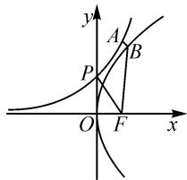
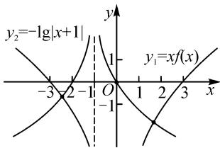

# 导数视角下不等式恒成立相关问题

# 山东省济北中学 高永禄

摘要: 不等式恒成立问题是高中数学的重要题型之一. 解题中可以根据需要将问题转化为函数问题, 运用导数研究函数单调性, 通过等价转化或求函数最值求得结果. 文章选取经典案例, 重点探讨导数视角下不等式恒成立问题的解题方法, 展示相关的解题过程, 给解答相关习题带来启发.

关键词:高中数学;导数;不等式;恒成立

高中数学中不等式恒成立问题,因习题创设的情境不同,采用的解题方法也存在一定的差别 $^{[1]}$ .其中当题干中涉及的函数并非五类基本初等函数时,可以根据需要考虑构造新的函数,对所构造的函数进行求导,确定函数的单调性或计算最值,通过等价转化完成不等式恒成立问题的求解.

# 1 求参数范围

例 1 已知函数 $h(x)=\frac{\mathrm{e}^{2x}-1}{\mathrm{e}^{x}}+\frac{2}{2^{x}+1}$ ，不等式 $h(ax^{2}-2)+h(2ax)\leqslant2$ 对 $\forall x\in R$ 恒成立，则实数 a 的取值范围是（）.

A. $(-2,+\infty)$

B. $(-∞,2)$

C. $(0,2)$

D. $\left[-2,0\right]$

解析: $h(x)=\frac{\mathrm{e}^{2x}-1}{\mathrm{e}^{x}}+\frac{2}{2^{x}+1}=\mathrm{e}^{x}-\mathrm{e}^{-x}+\frac{2}{2^{x}+1},$

则 $h(x)+h(-x)=\frac{2}{2^{x}+1}+\mathrm{e}^{x}-\mathrm{e}^{-x}+\frac{2}{2^{-x}+1}+$ $e^{-x}-e^{x}=\frac{2}{2^{x}+1}+\frac{2\cdot2^{x}}{2^{x}+1}=2.$

令 $f(x)=h(x)-1$ ，可得 $f(x)+f(-x)=0$ ，则函数 $f(x)$ 为奇函数。

$$
f ^ {\prime} (x) = \mathrm{e} ^ {x} + \mathrm{e} ^ {- x} - \frac {2 ^ {x} \ln 4}{(2 ^ {x} + 1) ^ {2}} = \mathrm{e} ^ {x} + \frac {1}{\mathrm{e} ^ {x}} -
$$

$\frac{\ln 4}{2^x + \frac{1}{2^x} + 2}$ . 由 $\mathrm{e}^x + \frac{1}{\mathrm{e}^x} \geqslant 2$ ，当且仅当 $\mathrm{e}^x = \frac{1}{\mathrm{e}^x}$ ，即 $x = 0$

时等号成立， $\frac{\ln 4}{2^x + \frac{1}{2^x} + 2}\leqslant \frac{\ln 4}{4} = \frac{\ln 2}{2} < 1$ ，当且仅当

$2^{x}=\frac{1}{2^{x}}$ ，即 x=0 时等号成立，易得 $f'(x)>0$ ，则函数 $f(x)$ 在 R 上单调递增.

由 $h(ax^2 - 2) + h(2ax) \leqslant 2$ ，可得 $f(ax^2 - 2) + f(2ax) \leqslant 0$ ，则 $f(ax^2 - 2) \leqslant f(-2ax)$ ，则 $ax^2 - 2 \leqslant -2ax$ ，即 $ax^2 + 2ax - 2 \leqslant 0$ 在 $\mathbf{R}$ 上恒成立。显然 $a = 0$

时满足. 当 $a \neq 0$ 时, 需满足 $\left\{\begin{aligned}a &<0,\\ \Delta &=4a^{2}+8a \leqslant 0,\end{aligned}\right.$ 解得 $-2 \leqslant a < 0$ . 综上, 可得 $a \in [-2,0]$ . 故选: D.

点评:该题考查函数的奇偶性、导数、不等式、二次函数性质等知识.其中所给的函数较复杂,要求的不等式中含有常数,形如“ $f(a)\pm f(b)\geqslant C$ ”或“ $f(a)\pm f(b)\leqslant C$ ”.解答这一类型的不等式问题,需要根据实际情况采取不同的解题方法.当C=0时,不需要构造新的函数,借助函数的奇偶性、运用导数确定原函数的单调性后,直接去掉对应法则“f”,转化为常规的不等式问题;当 $C\neq0$ 时,需要在明确原函数奇偶性的基础上构造新的函数,而后借助导数研究新函数的单调性,再将新函数的对应法则去掉,转化为常规的不等式问题.

# 2 求最值

例 2 已知 $x, y \in R$ ，若不等式 $m \leqslant \frac{y^{2}}{4} + \sqrt{\left(x - \frac{y^{2}}{4}\right)^{2} + \left(\mathrm{e}^{x} - y\right)^{2}} + 1$ 恒成立，则实数 m 的最大值是（）.

$$
\mathrm{A.} 2 - \sqrt {2}
$$

$$
\mathrm{B.} \sqrt {2} - 1
$$

$$
\mathrm{C.} \sqrt {2} + 1
$$

$$
\mathrm{D.} \sqrt {2}
$$

解析： $\sqrt{\left(x - \frac{y^2}{4}\right)^2 + (\mathrm{e}^x - y)^2}$

$A(x,e^{x})$ 与 $B\left(\frac{y^{2}}{4},y\right)$ 间的距离，点 A 在曲线 $y=e^{x}$ 上，点 B 在曲线 $y^{2}=4x$ 上.

画出两曲线 $y=e^{x}$ 与 $y^{2}=4x$ 的图象，如图 1. 其中 $|AB|=\sqrt{\left(x-\frac{y^{2}}{4}\right)^{2}+\left(\mathrm{e}^{x}-y\right)^{2}}$ . 由抛物

text_image

y
A
B
P
O
F
x

图1

线的性质可得 $\left|BF\right|=\frac{y^{2}}{4}+1$ ，曲线 $y^{2}=4x$ 的焦点为 $F(1,0)$ .

因此问题转化为求 $|AB| + |BF|$ 的最小值，即求点 $F(1,0)$ 到曲线 $y = e^{x}$ 的最小值。由两点间距离公式可得 $|AF|^2 = (1 - x)^2 + (0 - e^x)^2 = x^2 - 2x + 1 + e^{2x}$ 。

令 $g(x)=x^{2}-2x+1+\mathrm{e}^{2x}$ ，则 $g'(x)=2x-2+2\mathrm{e}^{2x}, g''(x)=2+4\mathrm{e}^{2x}>0$ ，则 $g'(x)$ 单调递增.

令 $g'(x)=0$ ，解得x=0。

所以，当 $x < 0$ 时， $g'(x) < 0, g(x)$ 单调递减；当 $x > 0$ 时， $g'(x) > 0, g(x)$ 单调递增。所以 $g(x)_{\min} = g(0) = 2$ ，则 $|AB| + |BF|$ 的最小值为 $\sqrt{2}$ ，即 $m \leqslant \sqrt{2}$ ，因此 $m$ 的最大值为 $\sqrt{2}$ 。故选：D.

点评:通常情况下,要求的不等式中含有平方及开方时,需要将其转化为两点间的距离进行分析 $^{[2]}$ .同时,在确定两点时,需要联系所给的表达式,明确对应点满足的函数关系,最终将问题转化为求距离的问题.当然,为更好地找到解题思路,应根据需要画出对应的函数方程,借助函数的性质,对要求的问题再次进行转化,构造新的函数.最后运用导数研究新的函数,求出新函数的最值.

# 3 求零点个数

例 3 若定义在 R 上的奇函数 $y = f(x)$ 满足 $f(3) = 0$ ，且当 x > 0 时， $f(x) > -xf'(x)$ 恒成立，则函数 $g(x) = xf(x) + \lg |x + 1|$ 的零点个数为（）.

A.1

B.2

C.3

D.4

解析:由 $f(x)>-xf'(x)$ ，得 $f(x)+xf'(x)>0$ .

令 $p(x)=xf(x)$ ，由 x>0 时 $p'(x)=f(x)+xf'(x)>0$ ，得函数 $p(x)$ 单调递增.

由 $p(-x) = -xf(-x) = -x[-f(x)] = xf(x) = p(x)$ ，得函数 $p(x)$ 为偶函数，则当 $x < 0$ 时， $p(x)$ 单调递减.

由 $p(3)=3f(3)=0$ , 得 $p(-3)=0$ .

令 $y_{1}=xf(x)$ , $y_{2}=-\lg|x+1|$ ，画出二者的大致图象，如图2.

由图可知两个函数的图象有3个交点，即 $g(x)=xf(x)+\lg|x+1|$ 有3个零点.故选：C.

  
图 2

点评:该题考查函数的奇偶性、导数、函数零点等内容.其中能够由“当x>0时, $f(x)>-xf'(x)$ 恒成立”这一条件想到构造函数是解题的关键.通过构造函数,明确所构造函数的单调性,并借助已知条件判断其奇偶性,从而能大致地画出函数 $y_{1}=xf(x)$ 的图象.对于函数 $y_{2}=-\lg|x+1|$ 的图象,则可以联系对数函数图象,通过平移、对称等画出.在此基础上,便可直观得到函数图象的交点个数.

# 4 探寻大小关系

例4 已知 $\forall m, n \in (0, +\infty)$ , 不等式 $\mathrm{e}^{\frac{m^2}{2}} + 4ne \leqslant \frac{\mathrm{e}}{2}m^2 + \mathrm{eln}(4ne)$ 恒成立, 则( ).

A. $m^{2}+n>\frac{9}{4}$

B. $m^2 - n < 1$

C. $m^2 - n^2 < 2$

D. $m^2 n^2 > 1$

解析: 将 $e^{\frac{m^{2}}{2}} + 4ne \leqslant \frac{e}{2}m^{2} + \ln(4ne)$ 两边均除以 e, 得 $e^{\frac{m^{2}}{2}-1} + 4n \leqslant \frac{1}{2}m^{2} + \ln(4ne)$ , 则

$$
\mathrm{e} ^ {\frac {m ^ {2}}{2} - 1} - \frac {1}{2} m ^ {2} + (4 n - 1) - \ln 4 n \leqslant 0. \tag {①}
$$

令 $f(x)=\mathrm{e}^{x-1}-x$ ，则 $f'(x)=\mathrm{e}^{x-1}-1$ 。当 x=1 时， $f'(x)=0$ 。又 $f'(x)$ 单调递增，则 0<x<1 时， $f'(x)<0$ ， $f(x)$ 单调递减，x>1 时， $f'(x)>0$ ， $f(x)$ 单调递增。所以 $f(x)\geqslant f(1)=0$ ，当 x=1 时， $e^{x-1}=x$ 。

令 $g(x)=x-1-\ln x(x>0)$ ，则 $g'(x)=1-\frac{1}{x}=\frac{x-1}{x}$ ，则 0<x<1 时， $g'(x)<0$ ， $g(x)$ 单调递减，x>1 时， $g'(x)>0$ ， $g(x)$ 单调递增。所以 $g(x)\geqslant g(1)=0$ ，当 x=1 时， $x-1=\ln x$ 。

于是可得 $\mathrm{e}^{\frac{m^2}{2} - 1}\geqslant \frac{1}{2} m^2,4n - 1\geqslant \ln (4n)$ ，则

$$
\mathrm{e} ^ {\frac {m ^ {2}}{2} - 1} - \frac {1}{2} m ^ {2} + (4 n - 1) - \ln 4 n \geqslant 0. \tag {②}
$$

由①②可得 $\mathrm{e}^{\frac{m^2}{2} - 1} - \frac{1}{2} m^2 + (4n - 1) - \ln 4n = 0$ 则 $\mathrm{e}^{\frac{m^2}{2} - 1} = \frac{1}{2} m^2, 4n - 1 = \ln 4n$ ，则 $\frac{1}{2} m^2 = 1, 4n = 1$ ，解得 $m^2 = 2, n = \frac{1}{4}$ . 易得 $m^2 + n = \frac{9}{4}, m^2 - n = \frac{7}{4} > 1$ ， $m^2 - n^2 = \frac{31}{16} < 2, m^2 n^2 = \frac{1}{8} < 1$ . 故选：C.

点评:该题较为新颖,考查的内容主要有对数运算法则、导数、不等式等.解题的关键在于合理构造函数并正确求导,通过导数研究函数的单调性,寻找隐含的不等关系,结合已知条件,将不等关系转化为相等关系.其中构造函数部分难度较大,且具有较强的技巧性,对推理及分析问题能力的要求较高.学习过程中,应认真思考和揣摩,从解题中获得新的感悟,更好地掌握其中的细节与精髓.

# 参考文献：

[1]祁颖.导数研究不等式恒成立问题的多解视角[J].中学生数学,2025(1):11-14.

[2] 李海. 例析导数中恒成立问题的解题方法 [J]. 数理化学习 (教研版), 2024(10): 12-14. Z