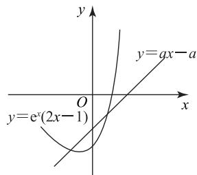
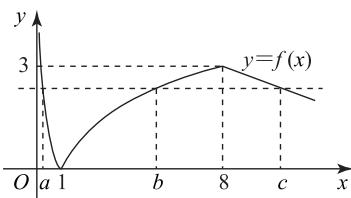
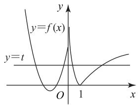
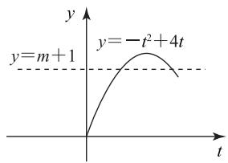

# 巧妙求解指数、对数型函数含参问题

严国华

(湖南省长沙县实验中学)

指数、对数型函数的含参问题涉及的知识点较多，可以与不等式、函数、几何等内容有机地融合在一起，能很好地发展学生的数学运算、直观想象、数学抽象、逻辑推理等核心素养。含参问题复杂多样、综合性强、解法灵活等特点使其成为了近几年高考的热点之一，本文介绍五种常见含参问题的求解策略，供读者借鉴和参考。

# 1 双管齐下程序化

对于含指数、对数式的复合函数和分段函数的单调性含参问题,我们可以采用“双管齐下程序化”的策略求解.具体来说,在解决复合函数的单调性含参问题时,除了根据“同增异减”分析内、外层函数的单调性外,还应考虑函数的定义域,列出关于参数的不等式组求解;在解决分段函数的单调性含参问题时,除了保证每段函数的单调性相同外,还应根据单调函数的图像特点得出间断点处函数值的大小关系,列出关于参数的不等式组进行求解.

例 1 已知函数 $f(x)=\log_{a}(6-ax)$ (a>0 且 $a\neq1$ ) 是 $[0,2]$ 上的减函数，求 a 的取值范围.

解析 令 $y = \log_a u (a > 0 \text{且 } a \neq 1), u = 6 - ax$ ，因为函数 $f(x) = \log_a (6 - ax)$ 在[0,2]上是减函数， $u = 6 - ax$ 在[0,2]上是减函数，所以 $y = \log_a u$ 是增函数且 $u > 0$ 在[0,2]上恒成立，即 $\begin{cases} a > 1, \\ 6 - 2a > 0, \end{cases}$ 解得 $1 < a < 3$ ，所以 $a$ 的取值范围是(1,3).

例2 已知 $a > 0$ 且 $a \neq 1$ , 函数

$$
f (x) = \left\{ \begin{array}{l l} x ^ {2} - (3 a + 1) x + 2, & x <   1, \\ a ^ {x}, & x \geqslant 1, \end{array} \right.
$$

若 $f(x)$ 是 R 上的减函数, 求实数 a 的取值范围.

因为函数 $f(x)$ 是 R 上的减函数, 所以

$$
\left\{ \begin{array}{l} 0 <   a <   1, \\ \frac {3 a + 1}{2} \geqslant 1, \\ 1 ^ {2} - (3 a + 1) + 2 \geqslant a, \end{array} \right.
$$

解得 $\frac{1}{3} \leqslant a \leqslant \frac{1}{2}$ , 所以实数 $a$ 的取值范围为 $[\frac{1}{3}, \frac{1}{2}]$ .

点评

解决复合函数、分段函数的单调性含参问题,我们可以将问题分解,采用“双管齐下程

序化”解题.

# 2 比翼双飞对偶化

对于指数、对数型复合函数的奇偶性含参问题，我们可采用“比翼双飞对偶化”的策略。在解题时经常利用奇函数图像关于原点对称的性质，构造对偶式，两式相加，比翼双飞，达到整体计算的目的。

例3（多选题）已知 $f(x) = \ln (\sqrt{1 + x^2} +x)$

$g(x)=f(x)+2\ 022$ , 下列判断中正确的是().

A. $f(x)$ 是奇函数

B. 若实数 $m$ 满足 $g(m) = -5$ , 则 $g(-m) = 5$

C. 若实数 $a, b$ 满足 $f(a) + f(b - 1) = 0$ ，则 $a + b = 1$

D. 设函数 $g(x)$ 在 $[-2\ 023, 2\ 023]$ 上的最大值为 M，最小值为 m，则 $M + m = 2\ 022$

解析

因为 $f(x)$ 的定义域为 $\mathbf{R}$ , 且

$$
f (- x) + f (x) = \ln \left(1 + x ^ {2} - x ^ {2}\right) = 0,
$$

所以 $f(x)$ 是奇函数， $g(-x) + g(x) = 4044$ 。若 $g(m) = -5$ ，则 $g(-m) = 4049$ ，故A正确，B错误。

显然 $f(x)$ 在 $[0, +\infty)$ 上单调递增，从而 $f(x)$ 在 $\mathbf{R}$ 上单调递增.若 $f(a) + f(b - 1) = 0$ ，则 $a + b - 1 = 0$ ，即 $a + b = 1$ ，故C正确.

奇函数 $f(x) = g(x) - 2022$ 在 $[-2023, 2023]$ 上的最大值 $M - 2022$ 与最小值 $m - 2022$ 之和为 0，所以 $M + m = 2022 \times 2 = 4044$ ，故 D 错误.

综上,选 AC.

点评

求解这类问题的关键在于观察函数的结构，

构造出一个奇函数,再利用奇函数的性质解

题.有些问题是直观的,直接应用即可,但有些问题是复杂的,需要变形转化才能应用.熟悉以下几个常见的奇函数,可以使化简的目标更明确.

$$
f (x) = \frac {a ^ {x} - 1}{a ^ {x} + 1}, f (x) = \frac {a ^ {x} + 1}{a ^ {x} - 1},
$$

$$
f (x) = a ^ {x} - a ^ {- x}, f (x) = \log_ {a} \frac {c - x}{c + x},
$$

$$
f (x) = \log_ {a} \left(\sqrt {1 + x ^ {2}} \pm x\right),
$$

$f(x) = \log_a(\sqrt{1 + (tx)^2} \pm tx)$ （其中 $a > 0$ 且 $a \neq 1$ ）.

# 3 引参换元简单化

对于指数、对数型函数的最值问题可以采用“引参换元简单化”的策略.解题时，把某个式子看成一个整体，用一个变量去代替它，从而使问题得到简化，转化成熟悉的问题，但解题时要特别注意新元的取值范围.

例4 若函数 $f(x) = \log_3 x (1 \leqslant x \leqslant 9)$ ，求函数$y=\left[f(x)\right]^{2}+f(x^{2})$ 的值域.

因为 $f(x)$ 的定义域为 [1,9]，所以函数 y=$[f(x)]^2 + f(x^2)$ 中的 $x$ 需满足 $\left\{ \begin{array}{l} 1 \leqslant x \leqslant 9, \\ 1 \leqslant x^2 \leqslant 9, \end{array} \right.$ 解得 $1 \leqslant x \leqslant 3$ ，所以 $0 \leqslant \log_3 x \leqslant 1$ ，令 $t = \log_3 x (1 \leqslant x \leqslant 3)$ ，因为 $f(x^2) = \log_3 x^2 = 2\log_3 x$ ，所以

$$
y = [ f (x) ] ^ {2} + f \left(x ^ {2}\right) = t ^ {2} + 2 t =
$$

$$
(t + 1) ^ {2} - 1 (t \in [ 0, 1 ]),
$$

当 t=0 时， $y=(0+1)^{2}-1=0$ ; 当 t=1 时， $y=(1+1)^{2}-1=3$ ，利用二次函数的性质可得函数 $y=[f(x)]^{2}+f(x^{2})$ 的值域为 $[0,3]$ .

例5 已知函数 $f(x) = x^{2} - 2x + a(\mathrm{e}^{x - 1} +$ $e^{-x+1}$ 有唯一零点，则a=\_\_\_\_.

因为 $f(x)=x^{2}-2x+a\left(\mathrm{e}^{x-1}+\mathrm{e}^{-x+1}\right)=$ $(x - 1)^{2} + a(\mathrm{e}^{x - 1} + \mathrm{e}^{-x + 1}) - 1.$ 设 $t = x - 1$ 令 $g(t)=t^{2}+a(e^{t}+e^{-t})-1.$

因为 $g(t)=g(-t)$ ，所以 $g(t)$ 为偶函数，若函数 $f(x)$ 有唯一零点，则函数 $g(t)$ 有唯一零点，根据偶函数的性质可知，只有当 t=0 时， $g(t)=0$ 才满足题意，即 x=1 是函数 $f(x)$ 的唯一零点，所以 $f(1)=2a-1=0$ ，解得 $a=\frac{1}{2}$ .

换元法又称辅助元素法、变量代换法，通过引进新的变量,可以让隐含的条件显露出来,或者将问题变为熟悉的形式.换元法经常用于研究指数、对数型函数的值域、三角函数式的化简求值、解析几何中的最值计算等.

# 4 数形结合直观化

有关不等式恒成立、最值、交点、方程的根等含参问题可转化为两个函数的图像问题，解题时要特别注意图像中隐含的定点、定值以及图像的渐近线和切线，通过平移或旋转确定临界位置.

例6 设函数 $f(x) = \mathrm{e}^{x}(2x - 1) - ax + a$ ，其中a<1, 若存在唯一的整数 $x_{0}$ ，使得 $f(x_{0})<0$ ，则 a 的取值范围是 \_\_\_\_.

# 解析

设 $g(x) = \mathrm{e}^{x}(2x - 1),y = a(x - 1)$ ，由题意知，函数 $y = g(x)$ 在直线 $y = ax - a$ 下方的图像中只有一个点的横坐标为整数. 因为 $g'(x)=\mathrm{e}^{x}(2x+1)$ ，当 $x<-\frac{1}{2}$ 时， $g'(x)<0$ ；当 $x>-\frac{1}{2}$ 时，$g'(x)>0$ , 故函数 $y=g(x)$ 的最小值为 $g(-\frac{1}{2})=$ $-2e^{-\frac{1}{2}}$ ，又 $g(0)=-1, g(1)=e>0$ ，直线 y=ax-a恒过定点(1,0)且斜率为 a(如图1)，故 $-a>g(0)=$ -1 且 $g(-1) = -\frac{3}{\mathrm{e}} \geqslant$ -a-a，解得 $\frac{3}{2e}\leqslant a<1$ ，则a 的取值范围是 $\left[\frac{3}{2e},1\right)$ .

text_image

y
y=qx-a
O
x
y=e^x(2x-1)

图1

例7 已知 $f(x) = \left\{ -\frac{1}{4} x + 5, x > 8, \right.$

若 a, b, c 互不相等，且 $f(a) = f(b) = f(c)$ ，则 abc 的取值范围是 \_\_\_\_.

# 析

不妨设 a<b<c，画出函数 $f(x)$ 图像，如图2 所示. 因为 $f(a)=f(b)=f(c)$ ，所以

$$
- \log_ {2} a = \log_ {2} b = - \frac {1}{4} c + 5,
$$

$$
\log_ {2} (a b) = 0, 0 <   - \frac {1}{4} c + 5 <   3,
$$

解得 ab=1,8<c<20，所以 8<abc<20.

line

| x | y |
|---|---|
| a | 0 |
| 1 | 0 |
| b | 2 |
| 8 | 3 |
| c | 2 |

图2

例8 已知函数 $f(x) = \begin{cases} |\ln x|, & x > 0, \\ x^2 + 4x + 3, & x \leqslant 0, \end{cases}$ 若函数 $g(x) = [f(x)]^2 - 4f(x) + m + 1$ 恰有8个零点，则 $m$ 的范围为 \_\_\_\_.

解析 画出函数 $f(x)$ 的图像，如图3所示，设 $f(x) = t$ ，由 $g(x) = [f(x)]^2 - 4f(x) + m + 1 = 0$ ，得 $t^2 - 4t + m + 1 = 0$ . 结合 $f(x)$ 的图像可得方程 $f(x) = t$ 在 $t \in (0,3]$ 内有4个不同的实根. 因为 $g(x)$ 有8个零点，所以方程 $t^2 - 4t + m + 1 = 0$ 在 $(0,3]$ 内必有2个不等的实数根，即 $m + 1 = -t^2 + 4t$ 在 $t \in (0,3]$ 内有2个不同的实根，画出 $y = -t^2 + 4t$ 的图像，如图4所示. 结合图像可知， $3 \leqslant m + 1 < 4$ ，故 $2 \leqslant m < 3$ .

text_image

y
y=f(x)
y=t
O
1
x

图3

text_image

y
y=m+1
y=-t²+4t
t

图4

在解决有些问题时,仅从代数方面考虑过程较为烦琐,若既能分析数式特征,又能揭示几何意义,巧妙结合,则更有利于问题的解决.

# 5 指对转换同构化

针对指数函数与对数函数混合的试题,我们可利用“指对转换同构化”的策略.解题时可以通过移项、取对数、利用恒等式 $b=a^{\log_{a}b}=\log_{a}a^{b}$ 代换等.特别是取对数和利用恒等式代换,可将一些结构不良的等式(或不等式)变形为两边有相同结构特征的等式(或不等式),或者把两个不同结构特征的等式变得结构相同,然后引入新函数,利用函数性质求解,我们将这种方法称之为指对同构.

例 9 若实数 a, b 满足 $a + 3^{a} = 7$ ,$\log_3\sqrt[3]{3b + 1} + b = 2$ ，求 $a + 3b$ 的值.

方法1 由 $\log_3\sqrt[3]{3b + 1} + b = 2$ ，可得

$$
\log_ {3} (3 b + 1) + 3 b + 1 = 7,
$$

即 $\log_{3}(3b+1)+3^{\log_{3}(3b+1)}=7$ ，又 $a+3^{a}=7$ ，构造函数 $f(x)=x+3^{x}$ ，显然 $f(x)$ 是增函数，则 $\log_{3}(3b+1)=a$ ，所以 $\log_{3}(3b+1)+3^{\log_{3}(3b+1)}=a+3b+1=7$ ，故 $a+3b=6$ 。

方法2 由 $\log_3\sqrt[3]{3b + 1} + b = 2$ ，可得 $\log_3(3b+$

58

数理化

$1) + 3b + 1 = 7.$ 又 $a + 3^{a} = 7$ 可变形为 $\log_33^a +3^a = 7$ 构造函数 $f(x) = x + \log_3x$ ，显然函数 $f(x)$ 是增函数，所以 $3b + 1 = 3^{a}$ ，故 $a + 3b = a + 3^{a} - 1 = 6.$

例10 已知函数 $f(x) = a\mathrm{e}^{x - 1} - \ln x + \ln a$ . 若 $\geqslant 1$ ，求 $a$ 的取值范围.

$f(x)$ 的定义域是 $(0, +\infty)$ ，由 $f(x) \geqslant 1$ ，得解析 $a\mathrm{e}^{x - 1} - \ln x + \ln a\geqslant 1$ ，即 $\mathrm{e}^{\ln a}\mathrm{e}^{x - 1} - \ln x+$ $\ln a\geqslant 1$ ，从而 $\mathrm{e}^{\ln a + x - 1} + \ln a + x - 1\geqslant x + \ln x$ ，即

$$
\mathrm{e} ^ {\ln a + x - 1} + \ln a + x - 1 \geqslant \mathrm{e} ^ {\ln x} + \ln x.
$$

设 $g(x)=\mathrm{e}^{x}+x$ ，则 $g'(x)=\mathrm{e}^{x}+1>0$ ， $g(x)$ 在 R 上单调递增，又 $g(\ln a+x-1)\geqslant g(\ln x)$ ，所以 $\ln a+x-1\geqslant\ln x$ ，从而 $\ln a\geqslant\ln x-x+1$ 。

设 $h(x)=\ln x-x+1$ ，则 $h'(x)=\frac{1-x}{x}$ ，当 0<x<1 时， $h'(x)>0$ ；当 x>1 时， $h'(x)<0$ ，故当 x=1 时， $h(x)$ 有极大值，也是最大值，且 $h(1)=0$ ，所以 $\ln a\geqslant0$ ，得 $a\geqslant1$ ，故 a 的取值范围是 $[1,+\infty)$ .

# 点评

要想用好“同构”这个解题技巧,需要做到以下两点:

1) “函数模型”要储备完善. 同构变形往往归结为一些常见的函数模型, 如 $y = x e^{x}$ , $y = \frac{\ln x}{x}$ 等. 熟练掌握这些函数模型的性质 (尤其是单调性), 可有效提高解题效率.

2) 熟悉同构变形的常用技巧. 如移项、取对数、利用恒等式 $b = a^{\log_{a} b}$ 代换等. 特别是取对数和利用恒等式代换, 如 $x e^{x} = e^{x + \ln x}, \frac{e^{x}}{x} = e^{x - \ln x}, \ln x e^{x} = x + \ln x, \ln \frac{e^{x}}{x} = x - \ln x$ 等.

总之，对于指数、对数型函数中的含参问题，因其覆盖的知识点广、求解方法多，应充分运用各种思维策略，既要能熟练掌握基本初等函数的图像与性质，又要会充分运用数形结合、分类讨论、转化与化归、函数与方程等数学思想方法解题，最后还需积极总结与归纳近几年高考题型，积累经验，不断充实题目的类型，升华解题的境界。

（本文系湖南省长沙市教育科学“十四五”规划一般资助课题“大单元设计下高中数学建模与探究的实践研究”（项目编号：CJK2022059）的阶段性研究成果。）

(完)

