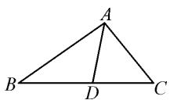
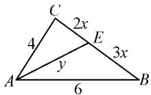
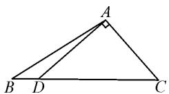
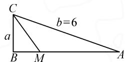
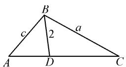
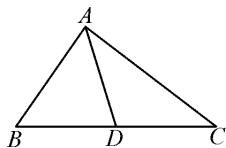

# 张角定理在解三角形中的应用

# ● 哈尔滨师范大学教师教育学院 刘凯歌

解三角形是几何与代数学中的一个重要部分,主要探究三角形的边长和角之间的关系,注重将几何直观和代数操作相结合;解三角形一直也是高考命题的热点,与它相关题型的难度“变化多端”.张角定理为几何与代数之间建立了一座桥梁,给解三角形问题的解决提供了一种简便快捷的方法,既可以深化学生对解三角形知识的理解,同时也有助于提高学生的解题效率.

# 1 张角定理

所谓张角,其实就是张开角度的意思.张角定理是指从三角形一个顶点出发的三条边所构成的图形里的一种边与角的关系.

张角定理 在 $\triangle ABC$ 中，三个内角 $A, B, C$ 的对边分别为 $a, b, c$ ，如果 $\angle BAD = \alpha, \angle CAD = \beta$ ，则

$$
\frac {\sin (\alpha + \beta)}{A D} = \frac {\sin \alpha}{b} + \frac {\sin \beta}{c}.
$$

推论 在 $\triangle ABC$ 中, 三个内角 A, B, C 的对边分别为 a, b, c, 如果 $\angle BAD = \alpha$ , AD 是 $\angle BAC$ 的角平分线, 则

$$
\cos \alpha = \frac {1}{2} \left(\frac {A D}{b} + \frac {A D}{c}\right).
$$

# 2 张角定理的优越性

例 1 如图 1, 已知 AD 是 $\triangle ABC$ 中 $\angle BAC$ 的角平分线, 交 BC 边于点 D.

  
图1

(1)证明: $\frac{AB}{AC}=\frac{BD}{DC};$   
(2) 若 $\angle BAC = 120^{\circ}, AB = 2, AC = 1$ ，求 AD 的长.

解析: 第(1)问略; 对于(2)有如下两种方法.

方法 1:(常规解法)根据余弦定理,先求出 BC 的值,再利用角平分线和余弦定理,即可求出 AD 的长.

根据条件,结合余弦定理可得到 $\cos\angle BAC=\frac{BA^{2}+AC^{2}-BC^{2}}{2\times AB\times AC}$ ，即 $\cos120^{\circ}=\frac{2^{2}+1^{2}-BC^{2}}{2\times2\times1}$ ，解得 $BC=\sqrt{7}$ 。又 $\frac{AB}{AC}=\frac{BD}{DC}$ ，所以 $\frac{BD}{DC}=\frac{2}{1}$ ，解得 $CD=\frac{\sqrt{7}}{3}$ ， $BD=\frac{2\sqrt{7}}{3}$ 。设 AD=x，则在 $\triangle ABD$ 与 $\triangle ADC$ 中，根

据余弦定理, 可得 $\cos60^{\circ}=\frac{1+x^{2}-\left(\frac{\sqrt{7}}{3}\right)^{2}}{2\times x\times1}$ 且 $\cos60^{\circ}=$ $\frac{2^{2}+x^{2}-\left(\frac{2\sqrt{7}}{3}\right)^{2}}{2\times x\times2}$ ，解得 $x=\frac{2}{3}$ ，即 AD 的长为 $\frac{2}{3}$ .

方法 2: 根据张角定理, 直接求出 AD 的长.

由 AD 是 $\angle BAC$ 的角平分线，可知 $\angle BAD = \angle DAC$ . 又 $\angle BAC = 120^{\circ}, AB = 2, AC = 1$ ，所以由张角定理得 $\frac{\sin\angle BAC}{AD} = \frac{\sin\angle BAD}{1} + \frac{\sin\angle DAC}{2}$ ，则 $AD = \frac{2}{3}$ .

例 2 在 $\triangle ABC$ 中, 角 A, B, C 的对边分别为 a, b, c, 已知 b=4, c=6, 点 E 在 BC 上, AE 是 $\angle BAC$ 的平分线, 则 AE 的取值范围为 \_\_\_\_.

方法 1: (常规解法) 利用平面向量的相关知识和余弦定理求解.

如图 2 所示, 设 $\angle BAC = \theta$ ,
AE=y，则 $\overrightarrow{AE}=\frac{2}{5}\overrightarrow{AB}+\frac{3}{5}\overrightarrow{AC}$ 所以 $|\overrightarrow{AE}|^2 = y^2 = \frac{4}{25} |\overrightarrow{AB}|^2 +$

  
图2

$$
\frac {9}{2 5} | \overrightarrow {A C} | ^ {2} + \frac {1 2}{2 5} \overrightarrow {A B} \cdot \overrightarrow {A C} = \frac {2 8 8}{2 5} + \frac {2 8 8}{2 5} \cos \theta , \theta \in (0, \pi),
$$

故 $0 < y^{2} < \left(\frac{24}{5}\right)^{2}$ , 即 $0 < y < \frac{24}{5}$ .

方法 2: 利用张角定理建立等式, 直接求解.

设 $\angle BAE = \angle CAE = \theta$ ，则 $0^{\circ} <   \theta <  90^{\circ}$

由张角定理，得

$$
\cos \theta = \frac {1}{2} \left(\frac {A E}{A B} + \frac {A E}{A C}\right) = \frac {1}{2} \left(\frac {A E}{6} + \frac {A E}{4}\right) = \frac {5 A E}{2 4}.
$$

所以 $AE=\frac{24}{5}\cos\theta.$

又 $0^{\circ}<\theta<90^{\circ}$ ，所以 $0<AE<\frac{24}{5}$ .

点评:从上述解法可以发现,使用常规解法时,步骤较为繁琐,不仅需要多次的推导和验证,还容易因为计算过程中的疏漏导致错误,从而增加了解题的难度和时间成本.而采用张角定理,则可以大幅简化这一过程,只需将题目中的已知条件直接代入公式,便可快速得出答案.这种方法不仅提高了计算效率,也降低了出错的风险.这种几何与代数的结合,既体现了数学方法的抽象性和通用性,也为复杂问题的求解提供了新的思路和工具.

# 3 张角定理在解三角形中的应用举例

# 3.1 求三角形的边长

例 3 在 $\triangle ABC$ 中，角 A, B, C 所对的边分别为 a, b, c. 如图 3，已知点 D 在 BC 边上， $AD \perp AC$ ， $\sin \angle BAC = \frac{2\sqrt{2}}{3}$ ， $AB = 3\sqrt{2}$ ，AD = 3，求 CD 的长.

  
图3

解:由题意可知 $\frac{\pi}{2}<\angle BAC<\pi$ ,且 $\sin\angle BAC=\frac{2\sqrt{2}}{3}$ ，则 $\cos\angle BAC=-\frac{1}{3}$ .又 $\angle BAD=\angle BAC-\angle DAC$ ，所以 $\sin\angle BAD=\sin(\angle BAC-\angle DAC)=\sin\left(\angle BAC-\frac{\pi}{2}\right)=-\cos\angle BAC=\frac{1}{3}$ .由张角定理，
得 $\frac{\frac{2\sqrt{2}}{3}}{3}=\frac{\frac{1}{3}}{AC}+\frac{1}{3\sqrt{2}}$ ，所以 $AC=3\sqrt{2}$ .

故在 Rt△ADC 中 $DC=\sqrt{3^{2}+(3\sqrt{2})^{2}}=3\sqrt{3}$ .

# 3.2 求三角函数值

例 4 如图 4, 已知 $\triangle ABC$ 中, 角 A, B, C 的对边分别为 a, b, c, 且 $b \cos C = a$ , 点 M 在线段 AB 上, $\angle ACM = \angle BCM$ , AC = 6CM = 6, 求 $\cos \angle BCM$ 的

  
图4

解: 因为 $b \cos C = a$ ，所以由正弦定理可以得到 $\sin B \cos C = \sin A$ ，即 $\sin B \cos C = \sin (B + C)$ ，可得 $\sin B \cos C = \sin B \cos C + \sin C \cos B$ ，所以 $\sin C \cos B = 0$ 。又 $\sin C > 0$ ，所以 $\cos B = 0$ 。又 $0 < B < \pi$ ，则 $B = \frac{\pi}{2}$ 。

又 AC=6CM=6，所以 CM=1，则在 Rt△BCM 中， $a=CM\times\cos\angle BCM=\cos\angle BCM$ 。又由角平分线张角定理，可得 $\cos\angle BCM=\frac{1}{2}\left(\frac{CM}{CB}+\frac{CM}{AC}\right)$ ，即 $\cos\angle BCM=\frac{1}{2}\left(\frac{1}{a}+\frac{1}{6}\right)=\frac{1}{2}\left(\frac{1}{\cos\angle BCM}+\frac{1}{6}\right)$ ，则 $\cos\angle BCM=\frac{3}{4}$ 或 $\cos\angle BCM=-\frac{2}{3}$ （舍）。

# 3.3 求三角形面积的最值

例 5 在 $\triangle ABC$ 中, 内角 A, B, C 的对边分别为 a, b, c, 如图 5, $\angle ABC = \frac{2\pi}{3}$ , BD 平分

  
图 5

$\angle ABC$ 交 AC 于点 D, BD=2, 求三角形 ABC 的面积的最小值.

解: 因为 BD 平分 $\angle ABC$ ，所以 $\angle ABD = \angle CBD = \frac{1}{2} \angle ABC = \frac{\pi}{3}$ ，由张角定理得 $\frac{\sin \angle ABC}{BD} = \frac{\sin \angle ABD}{BC} + \frac{\sin \angle DBC}{AB}$ ，即 $\frac{\sin \frac{2\pi}{3}}{2} = \frac{\sin \frac{\pi}{3}}{a} + \frac{\sin \frac{\pi}{3}}{c}$ ，所以 $\frac{1}{a} + \frac{1}{c} = \frac{1}{2}$ 。由 $\frac{1}{a} + \frac{1}{c} = \frac{1}{2} \geqslant 2\sqrt{\frac{1}{ac}}$ ，得 $\sqrt{ac} \geqslant 4, ac \geqslant 16$ ，当且仅当 a = c 时，等号成立。

所以 $\triangle ABC$ 的面积 $S_{\triangle ABC} = \frac{1}{2}\times a\times c\times \sin \frac{2\pi}{3}\geqslant$ $\frac{1}{2}\times 16\times \frac{\sqrt{3}}{2} = 4\sqrt{3}.$

故 $\triangle ABC$ 面积的最小值为 $4\sqrt{3}$ .

# 3.4 求代数式最值

例 6 在 $\triangle ABC$ 中，角 A, B, C 所对的边分别为 a, b, c，如图 6, AD 是 $\angle BAC$ 的角平分线，若 $\angle BAC = \frac{\pi}{3}$ , $AD = 2\sqrt{3}$ ，求 $2b + c$ 的最小值.

  
图6

解:由 AD 是 $\angle BAC$ 的角平分线, 可知 $\angle BAD = \angle CAD = \frac{1}{2} \angle BAC = \frac{\pi}{6}$ . 由张角定理得 $\frac{\sin \angle BAC}{AD} = \frac{\sin \angle BAD}{AC} + \frac{\sin \angle DAC}{AB}$ , 即 $\frac{\sin \frac{\pi}{3}}{2\sqrt{3}} = \frac{\sin \frac{\pi}{6}}{b} + \frac{\sin \frac{\pi}{6}}{c}$ , 则 $\frac{1}{b} + \frac{1}{c} = \frac{1}{2}$ , 所以 $2b + c = (2b + c) \left( \frac{1}{b} + \frac{1}{c} \right) \times 2 = \frac{2c}{b} + \frac{4b}{c} + 6 \geqslant 6 + 2\sqrt{\frac{2c}{b} \times \frac{4b}{c}} = 6 + 4\sqrt{2}$ , 当且仅当 $\frac{2c}{b} = \frac{4b}{c}$ , 即 $c = \sqrt{2}b$ 时, 等号成立.

所以 $2b+c$ 的最小值是 $6+4\sqrt{2}$ .

高考数学中解三角形问题一直是命题人的偏爱，所以解三角形也是学生需要精通的一部分。在解三角形问题时，若只掌握常规解三角形问题的方法（正弦定理、余弦定理等），不仅会局限学生对知识的理解，也会影响学生的解题效率。张角定理不仅可以拓宽问题的解决思路，同时也可以将求解问题的过程化繁为简，使几何问题的解决得到极大的简化。Z