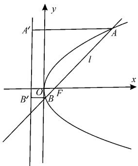
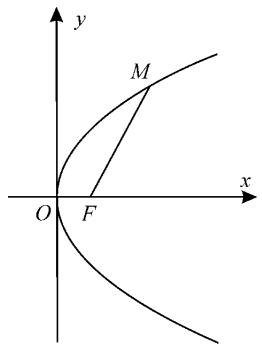
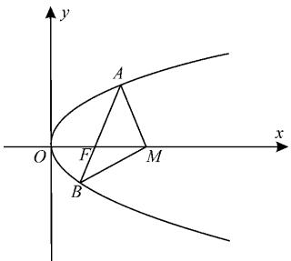
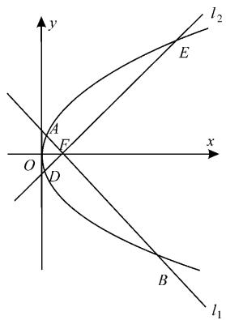
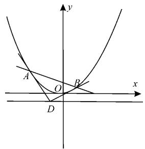

# 抛物线焦点弦的性质及应用

# ■河南省洛阳市第一高级中学 闫雍恒

经过抛物线 C 的焦点 F 作直线 l，当直线 l 与抛物线 C 相交于 A, B 两点时，线段 AB 通常称为抛物线 C 的一条焦点弦，其中线段 AF、BF 叫作焦半径。

抛物线有着丰富的几何性质,尤其是抛物线焦点弦的性质。

普通高中教科书人教 A 版《数学选择性必修第一册》第 135 页的例 4 就是一道关于焦点弦的题目：

斜率为 1 的直线 l 经过抛物线 $y^{2}=4x$ 的焦点 F，且与抛物线相交于 A, B 两点，求线段 AB 的长。

由抛物线的方程可以得到它的焦点坐标, 又直线 l 的斜率为 1, 所以可以求出直线 l 的方程; 与抛物线的方程联立, 可以求出 A, B 两点的坐标; 利用两点间的距离公式可以求出 $\left|AB\right|$ 。

这种方法思路直接,具有一般性。

此外，还可用另外一种方法——数形结合法。如图1所示，设 $A(x_{1},y_{1})$ ， $B(x_{2},y_{2})$ 。由抛物线的定义可知， $|AF|$ 等于点 $A$ 到准线的距离 $\left|AA^{\prime}\right|$ 。由 $p = 2$ ，得 $\frac{p}{2} = 1, \left|AA^{\prime}\right| =$

text_image

y
A'
l
A
x
B'
O
B
F

图1

$x_{1} + \frac{p}{2} = x_{1} + 1$ ，于是 $|AF| = x_1 + 1$ 。同理，

$$
\mid B F \mid = \mid B B ^ {\prime} \mid = x _ {2} + \frac {p}{2} = x _ {2} + 1 。
$$

于是 $|AB|=|AF|+|BF|=x_{1}+x_{2}+p=x_{1}+x_{2}+2$ 。

由此可见, 只要求出点 A, B 的横坐标之和 $x_{1} + x_{2}$ , 就可以求出 $|AB|$ 的值。

教科书第 136 页的例 5 也是如此：

经过抛物线焦点 F 的直线交抛物线于 A, B 两点, 经过点 A 和抛物线顶点的直线交抛物线的准线于点 D, 求证: 直线 DB 平行于抛物线的对称轴。

还有教科书第 138 页习题 3.3 复习巩固
第 5 题：

如图 2, M 是抛物线 $y^{2}=4x$ 上的一点，F 是抛物线的焦点，以 Fx 为始边、FM 为终边的角 $\angle xFM=60^{\circ}$ ，求 $|FM|$ 。

text_image

y
M
O F x

图2

以上三例都是有关抛物线焦点弦的问题,下面我们就一起来研究抛物线焦点弦的常用性质及应用。

# 一、抛物线焦点弦的常用几何性质

以抛物线 $y^{2}=2px(p>0)$ 为例，焦点为 F，准线为 $l_{0}$ 。过焦点 F 的直线 l 的倾斜角为 $\theta$ ，与抛物线交于 $A(x_{1},y_{1})$ ， $B(x_{2},y_{2})$ 两点。

性质 1: 焦点弦端点坐标的性质

$$
x _ {1} x _ {2} = \frac {p ^ {2}}{4}, y _ {1} y _ {2} = - p ^ {2} 。
$$

此结论可以推广到一般的情况:一般地,如果直线 l 恒过定点 $M(m,0)$ 与抛物线 $y^{2}=2px(p>0)$ 交于 A,B 两点,那么 $x_{1}x_{2}=m^{2}$ , $y_{1}y_{2}=-2pm$ 。于是,若 $OA\perp OB$ ,则 AB 恒过定点 $(2p,0)$ 。

性质 2: 焦半径长度与倾斜角的关系

(1) $|AF|=x_{1}+\frac{p}{2},|BF|=x_{2}+\frac{p}{2},$ $|AB|=x_{1}+x_{2}+p$

若焦点弦 AB 的中点坐标为 $(x_{0}, y_{0})$ ，则 $|AB| = 2\left(x_{0} + \frac{p}{2}\right)$ 。

(2) $|AF|=\frac{p}{1-\cos\theta},|BF|=\frac{p}{1+\cos\theta},$ $\frac{1}{|AF|}+\frac{1}{|BF|}=\frac{2}{p}$

在此基础上,我们还可以推得 $\left|AB\right|=\frac{2p}{\sin^{2}\theta},\left|AB\right|=2p\left(1+\frac{1}{k^{2}}\right),S_{\triangle OAB}=\frac{p^{2}}{2\sin\theta}$ 。

特别地, 当 $\theta=\frac{\pi}{2}$ 时, 直线 $l\perp x$ 轴, 此时焦点弦 AB 叫作抛物线的通径。

性质 3: 抛物线通径的性质

(1)通径长为 2p。  
(2)焦点弦中,通径最短。  
(3)通径越长,抛物线开口越大。

性质 4: 与圆相关的几个结论

过点 A, B 分别作准线的垂线, 垂足分别为 D, E, 则:

(1)以 AB 为直径的圆与准线相切；  
(2)以 DE 为直径的圆与 AB 切于焦点 F;  
(3)以焦半径 AF 为直径的圆与 y 轴相切,以焦半径 BF 为直径的圆与 y 轴相切;  
(4)A,O,E三点共线,B,O,D三点共线。

性质 5: 正交焦点弦的性质

已知 F 为抛物线 $C: y^{2} = 2px (p > 0)$ 的焦点，过 F 作两条互相垂直的直线 $l_{1}, l_{2}$ ，直线 $l_{1}$ 与抛物线 C 交于 A, B 两点，直线 $l_{2}$ 与抛物线 C 交于 D, E 两点。

(1) $|AB|$ , $|DE|$ 的调和平均数为定值,
即 $\frac{1}{|AB|}+\frac{1}{|DE|}=\frac{1}{2p}$ 。  
(2) 已知 AB, DE 是抛物线 $C: y^{2} = 2px$ (p > 0) 中过焦点 F 的两条互相垂直的弦，则 $|AB| + |DE|$ 存在最小值，最小值为 8p。  
（3）四边形 ADBE 面积的最小值为 $8p^{2}$ 。

性质 6: 焦点弦两端点处的切线及其性质

(1)一般地,抛物线 $C: y^{2} = 2px (p > 0)$ 在点 $P(x_{0}, y_{0})$ 处的切线方程为 $y_{0}y = p(x + x_{0})$ 。在焦点弦 AB 两端点 $A(x_{1}, y_{1})$ , $B(x_{2}, y_{2})$ 处的切线方程分别为 $y_{1}y = p(x + x_{1})$ , $y_{2}y = p(x + x_{2})$ 。  
(2) 过焦点弦的端点的切线互相垂直且交点 Q 在准线上, $QF \perp AB$ , $|FA| \cdot |FB| = |QF|^{2}$ 。  
(3) 过抛物线准线上任意一点 Q 作抛物线的切线, 则过两切点的弦必过焦点, 过两切点的弦最短时即为通径, 且此时取得 $\triangle QAB$ 面积的最小值 $p^{2}$ 。  
(4) 过点 A, B 分别作准线的垂线, 垂足分别为 D, E, Q 为 A, B 两处切线的交点, 则 QA 平分 $\angle DAB$ , QB 平分 $\angle EBA$ 。  
(5)两条切线的交点 Q 与弦中点 M 的连线平行于对称轴, QM 与抛物线的交点恰好是 QM 的中点。

下面我们来探究这些性质的应用。

# 二、典型例题

例 1 已知 O 为坐标原点, 过抛物线 C: $y^{2}=2px (p>0)$ 的焦点 F 的直线与抛物线 C 交于 A, B 两点, 其中点 A 在第一象限, 点 $M(p,0)$ 。若 $|AF|=|AM|$ , 则()。

A. 直线 $AB$ 的斜率为 $2\sqrt{6}$   
B. $|OB|=|OF|$   
C. $\left|AB\right|>4\left|OF\right|$   
D. $\angle OAM + \angle OBM < 180^{\circ}$

分析:先由已知条件可得点 A 的坐标,再由抛物线焦点弦的性质求得点 B 的坐标,然后逐一分析四个选项的答案。

解:如图3,因为 $F\left(\frac{p}{2},0\right)$ , $M(p,0)$ , 且 $|AF| = |AM|$ , 所以 $A\left(\frac{3p}{4},\frac{\sqrt{6}p}{2}\right)$ 。

由抛物线焦点弦的性质可得

text_image

y
A
O
F
M
B
x

图3

$x_{A} \cdot x_{B} = \frac{p^{2}}{4}$ ，则 $x_{B} = \frac{p}{3}$ , $B\left(\frac{p}{3}, -\frac{\sqrt{6} p}{3}\right)$ 。

故 $k_{AB} = k_{AF} = \frac{\frac{\sqrt{6}p}{2} - 0}{\frac{3p}{4} - \frac{p}{2}} = 2\sqrt{6}$ ，A正确。

$$
\mid O B \mid = \sqrt {\frac {p ^ {2}}{9} + \frac {6 p ^ {2}}{9}} = \frac {\sqrt {7} p}{3}, \mid O F \mid = \frac {p}{2},
$$

故 $|OB| \neq |OF|$ ，B错误。

同样，由抛物线焦点弦的性质可得 $|AB|=\frac{3p}{4}+\frac{p}{3}+p=\frac{25p}{12}>2p=4|OF|$ ，故C正确。

易知 $|OA|^{2} = \frac{33p^{2}}{16}, |OB|^{2} = \frac{7p^{2}}{9},$ $|AM|^{2} = \frac{25p^{2}}{16}, |BM|^{2} = \frac{10p^{2}}{9}, |OM| = p$ .

因为 $|OA|^{2}+|AM|^{2}>|OM|^{2},|OB|^{2}+|BM|^{2}>|OM|^{2}$ ，所以 $\angle OAM,\angle OBM$ 均为锐角。可得 $\angle OAM+\angle OBM<180^{\circ}$ ，故D正确。

故选 ACD。

例 2 过抛物线 $x^{2}=8y$ 的焦点 F 的直线交抛物线于 M, N 两点，若 $\overrightarrow{MF}=\lambda\overrightarrow{FN}$ ， $|MN|=9$ ，则 $\lambda$ 的值为（）。

A. $\frac{1}{3}$

B. $\frac{1}{2}$

C. $\frac{1}{3}$ 或 3

D. $\frac{1}{2}$ 或2

分析:根据题意用 $y=kx+2$ 表示过抛物线 $C:x^{2}=8y$ 的焦点的直线,得出 $|MF|+|FN|=9$ 。结合抛物线焦点弦的性质可得 $\frac{1}{|MF|}+\frac{1}{|FN|}=\frac{2}{p}=\frac{1}{2}$ ,求得 $|MF|,|FN|$ 的值,即可求解。

解:根据题意,抛物线 $C: x^{2} = 8y$ 的焦点为 $(0, 2)$ 。可设 $y = kx + 2$ 为过抛物线 $C: x^{2} = 8y$ 的焦点的直线方程。

因为 $\left|MN\right|=9$ ，所以 $\left|MF\right|+\left|FN\right|=9$ 。

由抛物线焦点弦的性质, 可得 $\frac{1}{|MF|} + \frac{1}{|FN|} = \frac{2}{p} = \frac{1}{2}$ 。

联立方程组,可得:

$\left\{ \begin{array}{l} |MF| = 6, \\ |FN| = 3, \end{array} \right.$ 或 $\left\{ \begin{array}{l} |MF| = 3, \\ |FN| = 6. \end{array} \right.$

因为 $\overrightarrow{MF}=\lambda\overrightarrow{FN}$ ，所以 $\lambda=\frac{1}{2}$ 或 2，选 D。

例 3 如图 4, 已知 F 为抛物线 C: $y^{2}=4x$ 的焦点, 过 F 作两条互相垂直的直线 $l_{1}, l_{2}$ , 直线 $l_{1}$ 与抛物线 C 交于 A, B 两点, 直线 $l_{2}$ 与抛物线 C 交于 D, E 两点, 则 $|AB|+|DE|$ 的最小值为()。

A. 16

B. 14

C. 12

D. 10

思路一:根据题意可判断当 A 与 D, B 与 E 关于 x 轴对称, 即直线 DE 的斜率为 1 时, $\left|AB\right| + \left|DE\right|$ 的值最小, 根据弦长公式计算即可。

解法一:由题意知 $l_{1}\perp l_{2}$ ，直线 $l_{1}$ 与抛物线C交于A，B两点，直线 $l_{2}$ 与抛物线C交于D，E两点。由图像可知，要使 $|AB|+|DE|$ 的值最小，则A与D，B与E关于x轴对称，即直线DE的斜率为1。

text_image

y
l₂
E
A
F
O
x
D
B
l₁

图 4

又直线 $l_{2}$ 过点
(1,0)，则直线 $l_{2}$ 的方程为 y = x - 1。

联立 $\left\{\begin{aligned}y^{2}&=4x,\\ y&=x-1,\end{aligned}\right.$ 得 $y^{2}-4y-4=0$ 。

故 $y_{1}+y_{2}=4,y_{1}y_{2}=-4$ 。

$|DE|=\sqrt{1+\frac{1}{k^{2}}}|y_{1}-y_{2}|=\sqrt{2}\times\sqrt{32}=8$ 。

$|AB|+|DE|$ 的最小值为 $2|DE|=16$ ，选 A。

思路二:本题考查了抛物线的几何性质及直线和抛物线的位置关系。同学们解有关过焦点弦的问题时,若能熟练掌握相关结论,则会事半功倍。设直线 $l_{1}$ 的倾斜角为 $\theta$ , 则 $l_{2}$ 的倾斜角为 $\theta - \frac{\pi}{2}$ , 利用焦点弦的弦长公式分别表示出 $|AB|$ , $|DE|$ , 整理求得结果。

解法二: 设直线 $l_{1}$ 的倾斜角为 $\theta$ ，则 $l_{2}$ 的倾斜角为 $\theta - \frac{\pi}{2}$ 。

根据焦点弦长公式可得 $|AB| = \frac{2p}{\sin^2\theta} = \frac{4}{\sin^2\theta}, |DE| = \frac{2p}{\sin^2\left(\theta - \frac{\pi}{2}\right)} = \frac{2p}{\cos^2\theta} = \frac{4}{\cos^2\theta}$ 。

则 $|AB| + |DE| = \frac{4}{\sin^2\theta} + \frac{4}{\cos^2\theta} = \frac{4}{\sin^2\theta\cos^2\theta} = \frac{16}{\sin^2 2\theta}$ 。

已知 $0 < \sin^{2}2\theta \leqslant 1$ ，要使 $|AB| + |DE|$ 的值最小，则 $\sin^{2}2\theta = 1, 2\theta = k\pi + \frac{\pi}{2}, k \in Z$ ，即 $\theta = \frac{k\pi}{2} + \frac{\pi}{4}, k \in Z$ 。

当 k=1 时满足题意，则 $\theta=\frac{3\pi}{4}$ 。

当 $\theta=\frac{3\pi}{4}$ 时， $|AB|+|DE|$ 的值最小，最小值为 16，选 A。

思路三:由题意知 AB, DE 是抛物线 C: $y^{2}=4x$ 中过焦点 F 的两条互相垂直的弦, 结合抛物线正交焦点弦的性质可得 $\frac{1}{|AB|}+\frac{1}{|DE|}=\frac{1}{4}$ , 利用基本不等式中的常数代换法, 可求出 $|AB|+|DE|$ 的最小值。

解法三:由题意知 AB, DE 是抛物线 C: $y^{2}=4x$ 中过焦点 F 的两条互相垂直的弦。

由抛物线正交焦点弦的性质可得 $\frac{1}{|AB|}+\frac{1}{|DE|}=\frac{1}{4}$ 。

故 $|AB|+|DE|$

$$
= 4 (| A B | + | D E |) \cdot \left(\frac {1}{| A B |} + \frac {1}{| D E |}\right)
$$

$$
= 4 \left(1 + 1 + \frac {| A B |}{| D E |} + \frac {| D E |}{| A B |}\right) \geqslant 1 6, \text {当且}
$$

仅当 $|AB|=|DE|$ 时等号成立。

$|AB|+|DE|$ 的最小值为 $2|DE|=16$ ，故选 A。

例 4 已知抛物线 C: $x^{2} = -2py (p > 0)$ 的焦点 F 与 $\frac{y^{2}}{8} + \frac{x^{2}}{4} = 1$ 的一个焦点重合，过焦点 F 的直线与抛物线 C 交于 A, B 两个不同的点，抛物线 C 在 A, B 两点的切线相交于点 M，且点 M 的横坐标为 4，则弦长 $|AB| = (\quad)$ 。

A. 16

B. 26

C. 14

D. 24

思路一:由椭圆方程求得点 F 的坐标,并求得 p, 设直线 AB 的方程为 $y = kx - 2$ , $A(x_{1}, y_{1})$ , $B(x_{2}, y_{2})$ 。利用导数写出抛物线在 A, B 处的切线方程, 结合已知条件求得 A, B 的横坐标之和, 联立直线方程与抛物线方程, 利用根与系数的关系求得 k, 进一步求出 A, B 的纵坐标之和, 然后由抛物线的弦长公式求出 $|AB|$ 的值。

解法一:由题意可得, $F(0,-2)$ ,则p=4,抛物线C的方程为 $x^{2}=-8y$ 。

设直线 AB 的方程为 y=kx-2, $A(x_{1}, y_{1}), B(x_{2}, y_{2})$ , 其中 $y_{1}=-\frac{x_{1}^{2}}{8}, y_{2}=-\frac{x_{2}^{2}}{8}$ 。

由 $y=-\frac{x^{2}}{8}$ ，得 $y'=-\frac{x}{4}$ 。

因此，在点 A 处的切线方程为 $y - y_{1} = -\frac{x_{1}}{4}(x - x_{1})$ ，化简得 $y = -\frac{x_{1}}{4}x + \frac{x_{1}^{2}}{8}$ 。①

同理可得,在点 B 处的切线方程为 $y = -\frac{x_{2}}{4}x + \frac{x_{2}^{2}}{8}$ 。②

联立①②，得 $x_{M}=\frac{x_{1}+x_{2}}{2}$ 。

由点 M 的横坐标为 4，得 $x_{1} + x_{2} = 8$ 。

将直线 AB 的方程代入抛物线方程, 可得 $x^{2} + 8kx - 16 = 0$ 。

则 $x_{1}+x_{2}=-8k=8$ ，解得 k=-1。

$$
\begin{array}{r l} & y _ {1} + y _ {2} = k \left(x _ {1} + x _ {2}\right) - 4 = - 1 \times 8 - 4 = \\ & - 1 2 。 \end{array}
$$

弦长 $\left|AB\right|=p-\left(y_{1}+y_{2}\right)=4-(-12)=16$ 。故选 A。

思路二: 利用前面的性质 6(1), 可直接获得切线方程。又两条切线的交点为定点，可代入切线方程，从而得到 A, B 两点坐标均满足的二元一次方程，通过同构可得切点弦所在直线的方程，从而得解。

解法二：由相关性质可得 $\left\{\begin{aligned}xx_{1}&=-4(y+y_{1}),\\ xx_{2}&=-4(y+y_{2})\end{aligned}\right.$

由相关性质 6(2) 可知, 两条切线均过点 M(4,2), 则 $\left\{\begin{aligned}4x_{1}&=-4(y_{1}+2),\\ 4x_{2}&=-4(y_{2}+2)\end{aligned}\right.$ 。

即 $A(x_{1},y_{1})$ , $B(x_{2},y_{2})$ 均满足 4x = -4(y+2)，直线 AB 的方程为 $x+y+2=0$ 。

当 x=4 时，y=-6，设点 $Q(4,-6)$ 。

根据性质 6(5) 知, Q 为 AB 的中点。

$$
\mid Q M \mid = 2 + 6 = 8, \mid A B \mid = 2 \mid Q M \mid = 1 6 。
$$

例 5 如图 5, 已知抛物线 $C: y = \frac{x^{2}}{2}$ , D 为直线 $y = -\frac{1}{2}$ 上的动点, 过点 D 作抛物线 C 的两条切线, 切点分别为 A, B。

text_image

y
A
O
B
x
D

图 5

(1)证明:直线 AB 过定点。

(2) 若以 $E\left(0, \frac{5}{2}\right)$ 为圆心的圆与直线 AB 相切，且切点为线段 AB 的中点，求该圆的方程。

分析:(1)设 $D\left(t,-\frac{1}{2}\right)$ , $A(x_{1},y_{1})$ ，则 $x_{1}^{2}=2y_{1}$ ，利用导数求斜率及两点坐标求斜率可得 $2tx_{1}-2y_{1}+1=0$ 。设 $B(x_{2},y_{2})$ ，同理可得 $2tx_{2}-2y_{2}+1=0$ ，得到直线 AB 的方程为 $2tx-2y+1=0$ ，由直线系方程求直线 AB 过的定点。

(2)由(1)得直线 AB 的方程为 $y = tx + \frac{1}{2}$ ，与抛物线方程联立，先利用中点坐标公式

及根与系数的关系求得线段 $AB$ 的中点 $M\left(t,t^2 +\frac{1}{2}\right)$ ，再由 $\overrightarrow{EM}\bot \overrightarrow{AB}$ ，得到关于 $t$ 的方程，求得 $t = 0$ 或 $t = \pm 1$ 。然后分类求得 $|\overrightarrow{EM} |$ 的值及所求圆的方程。

解:(1)设 $D\left(t,-\frac{1}{2}\right)$ , $A\left(x_{1},y_{1}\right)$ ，则 $x_{1}^{2}=2y_{1}$ 。

由于 $y' = x$ ，故切线 DA 的斜率为 $x_{1}$ ， $\frac{y_{1}+\frac{1}{2}}{x_{1}-t}=x_{1}$ 。

整理可得 $2tx_{1}-2y_{1}+1=0$ 。

设 $B(x_{2},y_{2})$ ，同理可得 $2tx_{2} - 2y_{2} + 1 = 0$ 。

故直线 AB 的方程为 $2tx - 2y + 1 = 0$ 。

直线 AB 过定点 $\left(0, \frac{1}{2}\right)$ 。

(2)由(1)得直线 AB 的方程为 $y=tx+\frac{1}{2}$ 。

由 $\left\{\begin{aligned}y&=tx+\frac{1}{2},\\ y&=\frac{x^{2}}{2},\end{aligned}\right.$ 可得 $x^{2}-2tx-1=0$ 。

于是 $x_{1} + x_{2} = 2t, y_{1} + y_{2} = t(x_{1} + x_{2}) + 1 = 2t^{2} + 1$ 。

设 M 为线段 AB 的中点, 则 $M\left(t, t^{2} + \frac{1}{2}\right)$ 。

由于 $\overrightarrow{EM} \perp \overrightarrow{AB}$ ，且 $\overrightarrow{EM} = (t, t^{2} - 2)$ ， $\overrightarrow{AB}$ 与向量 $(1, t)$ 平行，故 $t + (t^{2} - 2)t = 0$ ，解得 t = 0 或 $t = \pm 1$ 。

当 t=0 时， $\left|\overrightarrow{EM}\right|=2$ ，所求圆的方程为 $x^{2}+\left(y-\frac{5}{2}\right)^{2}=4$ 。

当 $t=\pm1$ 时， $\left|\overrightarrow{EM}\right|=\sqrt{2}$ ，所求圆的方程为 $x^{2}+\left(y-\frac{5}{2}\right)^{2}=2$ 。

综上所述,该圆的方程为 $x^{2}+\left(y-\frac{5}{2}\right)^{2}=4$ 或 $x^{2}+\left(y-\frac{5}{2}\right)^{2}=2$ 。

抛物线焦点弦的性质很丰富,应用也非常广泛,仅举以上几例,同学们可以在学习的过程中继续积累、实践。

(责任编辑 徐利杰)