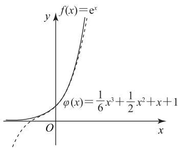
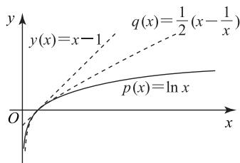
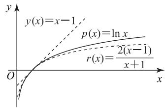

# 指向拔尖创新人才培养的导数试题解法——回穿构造

范明辉

(湖北省荆门市龙泉中学)

高考数学试题要发挥人才选拔功能,尤其是筛选出拔尖创新人才.而导数试题往往综合性较强,能够较好地考查学生的数学综合素养,是体现数学拔尖创新人才综合能力的重要载体.本文结合回穿构造原理,以2024年全国甲卷文科、理科导数解答题为例,阐述处理导数试题的一种解法.

# 1 回穿构造原理

人教 A 版普通高中教科书数学选择性必修第二册 99 页习题 5.3 第 12 题, 利用函数的单调性, 证明不等式: $\mathrm{e}^{x} > 1 + x (x \neq 0)$ , 并通过函数图像进行直观验证. 不等式的证明是比较容易的, 此处略去. 如图 1 所示, 在同一平面直角坐标系中作出函数的图像, 我们知道函数 $f(x) = \mathrm{e}^{x}$ 在 x = 0 处的切线为 $g(x) =$ $1+x$ , 函数 $f(x)$ 的图像始终位于 $g(x)$ 的上方, 称这种状态为“回”, 即有 $e^{x} \geqslant 1 + x$ (当且仅当 x = 0 时, 等号成立).

接下来，对不等式 $\mathrm{e}^x\geqslant 1 + x$ 左右两边同时进行反向求导(求积分)，即寻找不等式左右两侧函数的原函数： $(\mathrm{e}^{x})^{\prime} = \mathrm{e}^{x},(\frac{1}{2} x^{2} + x + c)^{\prime} = x + 1(c\in \mathbf{R})$ ，代入原取等条件 $x = 0$ ，可得 $c = 1$ ，即 $h(x) = \frac{1}{2} x^2 +x + 1.$ 如图1所示，当 $x <   0$ 时，函数 $f(x)$ 的图像始终位于 $h(x)$ 的下方；当 $x > 0$ 时，函数 $f(x)$ 的图像始终位于 $h(x)$ 的上方.也就是说在点(0,1)两侧，图像分别是一上一下，称这种状态为“穿”.由此，可以得到两个不等式： $\mathrm{e}^x\geqslant \frac{1}{2} x^2 +x + 1(x\geqslant 0),\mathrm{e}^x\leqslant \frac{1}{2} x^2 +x + 1(x\leqslant$ 0).如果继续对不等式左右两侧反向求导，则可以得到不等式： $\mathrm{e}^x\geqslant \frac{1}{6} x^3 +\frac{1}{2} x^2 +x + 1$ （当且仅当 $x = 0$ 时, 等号成立). 作出不等式两侧函数的图像, 如图 2 所示, 则函数 $f(x)$ 的图像始终位于 $\varphi(x)$ 的上方, 二者又呈现出“回”的状态. 这种“一穿一回”的构造原理, 就是回穿构造.可以发现,通过回穿构造原理,可以进一步导出泰勒公式,同时还能得出许多不等式,用多项式去逼近函数.

text_image

f(x)=e^x
φ(x)=\frac{1}{6}x^3+\frac{1}{2}x^2+x+1

图2

# 2 基于回穿构造的对数不等式

从高考试题的考查情况来看,除了指数不等式之外,常考的还有对数不等式.借助不等式 $e^{x} \geqslant 1 + x$ (当且仅当 x = 0 时, 等号成立) 进行同构变换, 用 $\ln x$ 替换不等式中的 x, 可得 $\ln x \leqslant x - 1$ (当且仅当 x = 1 时, 等号成立). 基于回穿构造原理, 对不等式左右两侧函数反向求导 (求积分), 即 $(x \ln x - x)' = \ln x$ , $(\frac{1}{2}x^{2} - x + c)' = x - 1$ , 代入取等条件 x = 1, 可得 $c = -\frac{1}{2}$ . 化简整理得

$$
\ln x \leqslant \frac {1}{2} (x - \frac {1}{x}) (x \geqslant 1),
$$

$$
\ln x \geqslant \frac {1}{2} (x - \frac {1}{x}) (0 <   x \leqslant 1),
$$

作出函数的图像,如图 3 所示.

text_image

y
y(x)=x-1
q(x)=\frac{1}{2}(x-\frac{1}{x})
O
p(x)=ln x
x

图3

除此之外，用 $\frac{1}{x}$ 替换不等式 $\ln x \leqslant x - 1$ 中的 $x$

可得 $\ln x \geqslant 1 - \frac{1}{x}$ (当且仅当 x = 1 时, 等号成立). 此对数不等式在人教 A 版普通高中教科书数学选择性必修第二册第 89 页例 4 中也出现过. 同样利用回穿构造原理可得 $\ln x \geqslant \frac{2(x - 1)}{x + 1} (x \geqslant 1)$ , $\ln x \leqslant \frac{2(x - 1)}{x + 1} (0 < x \leqslant 1)$ , 作出函数的图像, 如图 4 所示.

text_image

y
y(x)=x-1
p(x)=ln x
r(x)=\frac{2(x-1)}{x+1}
O
x

图4

将以上 4 个不等式串联起来, 得

$$
\frac {2 (x - 1)}{x + 1} \leqslant \ln x \leqslant \frac {1}{2} \left(x - \frac {1}{x}\right) (x \geqslant 1),
$$

$$
\frac {1}{2} (x - \frac {1}{x}) \leqslant \ln x \leqslant \frac {2 (x - 1)}{x + 1} (0 <   x \leqslant 1).
$$

这两组对数不等式,在高考试题中应用相当广泛,结合三个函数的图像形似三根“飘带”,因此也称其为“对数飘带不等式”.

# 3 2024 年全国甲卷导数试题解法探究

例 1 （2024 年全国甲卷文 20）已知函数 $f(x)=$ $a(x-1)-\ln x+1.$

(1) 求 $f(x)$ 的单调区间；

(2) 若 $a \leqslant 2$ , 证明: 当 $x > 1$ 时, $f(x) < \mathrm{e}^{x - 1}$ 恒成立.

(1)由题意得 $f(x)$ 的定义域为 $(0, +\infty)$ ,$f'(x)=a-\frac{1}{x}=\frac{ax-1}{x}.$ 因此，当 $a\leqslant0$ 时，$f(x)$ 在 $(0, +\infty)$ 上单调递减；当 a > 0 时， $f(x)$ 在 $(\frac{1}{a}, +\infty)$ 上单调递增，在 $(0, \frac{1}{a})$ 上单调递减.

(2)由题意需证明当 $x > 1$ 时， $\mathrm{e}^{x - 1} - a(x - 1) + \ln x - 1 > 0$ 在 $a\leqslant 2$ 上恒成立，考虑用 $x + 1$ 替换不等式中的 $x$ ，得 $\mathrm{e}^x +\ln (x + 1) - ax - 1 > 0(x > 0)$ ，进行恒等变形得 $\mathrm{e}^x -\frac{1}{2} x^2 -x - 1 + \ln (x + 1) - x+$ $\frac{1}{2} x^2 +(2 - a)x > 0(x > 0).$

由前述分析可知 $\mathrm{e}^x -\frac{1}{2} x^2 -x - 1 > 0(x > 0)$ ，且

容易证明得到 $\ln(x+1)-x+\frac{1}{2}x^{2}>0(x>0)$ . 又 $a\leqslant2$ , 故 $(2-a)x\geqslant0(x>0)$ , 因此, 原不等式恒成立.

# 点评

试题第(2)问,使用 $x+1$ 替换原不等式中的 x 后将待证不等式化归为熟悉的 $e^{x}$ 结构,基于指数 $e^{x}$ 进行回穿构造得到的不等式 $e^{x}-\frac{1}{2}x^{2}-x-1>0(x>0)$ ，进行恒等变形，然后依次说明余下结构的非负性，即完成证明。值得注意的是 $\ln(x+1)-x+\frac{1}{2}x^{2}$ 其实是对数函数 $y=\ln(x+1)$ 在 x=0 处的二阶泰勒展开式。可借助对数函数 $y=\ln(x+1)$ 在 x=0 处一阶导函数的切线进行回穿构造。 $y'=\frac{1}{x+1}$ ，则 $y'(0)=1, y''=-\frac{1}{(x+1)^{2}}, y''(0)=-1$ ，故函数 $y=\frac{1}{x+1}$ 在 x=0 处的切线方程为 y=-x+1，则 $\frac{1}{x+1}\geqslant-x+1(x\geqslant0)$ ，左右两侧反向求导可得 $\ln(x+1)\geqslant-\frac{1}{2}x^{2}+x+c(x\geqslant0)$ ，代入取等条件 x=0，得 c=0，则有 $\ln(x+1)\geqslant-\frac{1}{2}x^{2}+x(x\geqslant0)$ 。

例 2 （2024 年全国甲卷理 21）已知函数 $f(x)=ax)\ln(1+x)-x$ .

(1) 当 a = -2 时, 求 $f(x)$ 的极值;  
(2) 当 $x \geqslant 0$ 时, $f(x) \geqslant 0$ , 求 a 的取值范围.

(1) 当 $a = -2$ 时, $f(x) = (1 + 2x)\ln (1 + x) -$

x, 则 $f'(x)=2\ln(1+x)+\frac{x}{1+x}$ . 当 -1<x<0 时, $f'(x)<0$ , $f(x)$ 单调递减; 当 x>0 时, $f'(x)>0$ , $f(x)$ 单调递增, 则 $f(x)$ 的极小值为 $f(0)=0$ , 无极大值.

(2) 因为 $\ln x \geqslant \frac{2(x - 1)}{x + 1} (x \geqslant 1)$ , 故 $\ln (x + 1) \geqslant \frac{2x}{x + 2} (x \geqslant 0)$ , 即 $(x + 2) \ln (x + 1) - 2x \geqslant 0$ , 则 $f(x) = (1 - ax) \ln (1 + x) - x = (\frac{1}{2} x + 1) \ln (x + 1) - x + (-a - \frac{1}{2}) x \ln (x + 1) \geqslant 0$ 在 $x \geqslant 0$ 上恒成立.

当 $-a-\frac{1}{2}\geqslant0$ ，即 $a\leqslant-\frac{1}{2}$ 时，原不等式恒成立，
且 $f(0)=0$ ; 当 $a > -\frac{1}{2}$ 时，有

# 紧扣课标,聚焦四基,考查四能——对 2024 年高考函数试题的点评

李波 $^{1}$ 林定明 $^{2}$

(1.四川省南充高级中学 2.四川省南充市教育科学研究所)

# 1 学业要求

四基是指进一步学习和未来发展所必需的数学基础知识、基本技能、基本思想、基本活动经验，四能是指从数学角度发现和提出问题的能力、分析和解决问题的能力。帮助学生提高学习数学的兴趣，增强学好数学的信心，养成良好的数学学习习惯，树立敢于质疑、善于思考、严谨求实的科学精神，掌握四基、提升四能是高中数学教学的课程目标。函数是现代数学基本的概念，是描述客观世界中变量关系和规律的基本数学语言和工具，在解决实际问题中发挥着重要的作用，是贯穿整个高中数学课程的主线。《普通高中数学课程标准(2017年版2020年修订)》（以下简称《课程标准》）要求，通过必修课程“函数”主题学习，学生能从两个变量之间的依赖关系、实数集合之间的对应关系、函数图像的几何直观等多个角度，理解函数的意义与数学表达；理解函数符号表达与抽象定义之间的关联,知道函数抽象概念的意义.发展数学抽象、逻辑推理和数学运算素养.学生能够通过具体情境,直观理解导数概念,感悟极限思想,知道极限思想是人类深刻认识和表达现实世界必备的思维品质,能够运用导数研究简单函数的性质和变化规律,能够利用导数解决简单的实际问题.

# 2 高考试题的命题分析

2024年高考命题以《课程标准》为依据，试题回归教材，深化基础知识，注重理性思维，突出数学应用，引导学生会用数学的眼光观察世界，会用数学的思维思考世界，会用数学的语言表达世界。与往年高考相比，2024年新课标Ⅰ卷和Ⅱ卷题量有所减少，且运算量均有所下降，但思维量增加，考查学生对主干知识的掌握情况，体现了高考“立德树人，服务选材，引导教学”的功能；部分试题考查情境探究和创新实践，解答时间充足，考查学生的数学运算、逻辑推理等核心素

$$
f ^ {\prime} (x) = - a \ln (1 + x) + \frac {1 - a x}{1 + x} - 1,
$$

且 $f'(0)=0$ . 记 $g(x)=f'(x)$ ，则 $g'(x)=\frac{-a}{1+x}+\frac{-a-1}{(1+x)^2}$ ，且 $g'(0)=-2a-1<0$ ，故存在 $x_0\in(0,+\infty)$ ，使得 $g'(x)<0$ 在 $(0,x_0)$ 上恒成立，则 $g(x)$ 在 $(0,x_0)$ 上单调递减，所以 $g(x)=f'(x)<0$ （ $0<x<x_0$ ），故 $f(x)$ 在 $(0,x_0)$ 上单调递减，且 $f(x)<0$ （ $0<x<x_0$ ），与 $f(x)\geqslant0$ 矛盾，不符合题意，舍去.

综上，a 的取值范围为 $(-∞,-\frac{1}{2}]$ .

基于回穿构造原理,根据题设条件中的函数 $y=\ln(x+1)$ 得出相应的不等式,其关键在于抓住取等条件.在本题中,利用原不等式在 x=0 处

取等, 故而在 x=0 处构造不等式, 将原函数拆分变形后求解就能清晰明了. 不难发现这种解法已经无限贴近试题的命制逻辑了.

# 4 小结

回穿构造原理,利用了反向求导(求积分)的思想,还原试题的命制逻辑,从试题的本源入手.这种解法,可在学生学习选修课程时系统讲解,也可在日常的课堂教学中加以引导、逐步渗透.掌握这一方法,有利于学生了解用导数工具研究函数的性质、解决不等式问题的本质,同时也能够让学生提前接触微积分的基本思想,这对于助力拔尖创新人才的培养是有积极作用的.

(完)