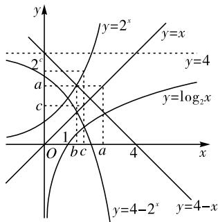

# 指数函数与对数函数综合题的求解策略

江苏靖江市刘国钧中学(214500) 周丽

[摘 要]指数函数与对数函数互为反函数,在考试命题中常常被命制在同一道题目中,以考查考生的综合应用能力。文章结合几个典型例题对指数函数与对数函数综合题的求解策略进行分析探讨,以帮助学生突破解题难点,拓宽学生的思维路径,发展学生的核心素养。

[关键词]指数函数;对数函数;综合题

[中图分类号] G633.6 [文献标识码] A [文章编号] 1674-6058(2023)35-0014-03

指数函数与对数函数互为反函数,它们之间有着紧密的联系,在考试命题中常常被命制在同一道题目中,以考查考生的综合应用能力。面对这类题型,我们该如何破解呢?本文对指数函数与对数函数综合题的求解策略加以探究,以供大家参考。

# 一、数形结合策略

因为指数函数与对数函数互为反函数,它们的图象关于直线 y = x 对称,当其函数与它们的图象相交时,比较有关数或者式子的大小可以一目了然。采用数形结合思想解答指数函数与对数函数综合题的关键是找到容易作图的函数。

[例 1]已知正实数 a、b、c 满足 $a + \log_{2}a = b + 2^{b} = 2^{c} + \log_{2}c = 4$ ，则以下结论正确的是()。

A. $b + \log_2a > 4$

B. $a + \log_2c > 4$

C. $2^{b} + c > 4$

D. $2^{c} + \log_{2}b > 4$

分析:由已知条件分析出 a 是函数 $y = \log_{2}x$ 与 y = 4 - x 交点的横坐标, b 是函数 $y = 2^{x}$ 与 y = 4 - x 的交点的横坐标, c 是函数 $y = \log_{2}x$ 与 $y = 4 - 2^{x}$ 交点的横坐标, 在同一直角坐标系中画出图象, 由图象得出 1 < b < c < a < 4, 再画出 y = x 的图象, 分析出 $2^{c} > a > c$ , 利用不等式的性质即可判断出答案。

解： $\because a + \log_{2}a = b + 2^{b} = 2^{c} + \log_{2}c = 4, \therefore \log_{2}a =$

$4 - a, 2^{b} = 4 - b, \log_{2}c = 4 - 2^{c}, \therefore a$ 是函数 $y = \log_{2}x$ 与 $y = 4 - x$ 的交点的横坐标， $b$ 是函数 $y = 2^{x}$ 与 $y = 4 - x$ 的交点的横坐标， $c$ 是函数 $y = \log_{2}x$ 与 $y = 4 - 2^{x}$ 的交点的横坐标，如图1所示，则 $1 < b < c < a < 4$ ，且 $2^{c} > a > c$ 。

text_image

y
y=2^x
y=x
y=4
a
c
y=log₂x
1
O b c a 4 x
y=4-2^x y=4-x

图1

$\because a + \log_{2}a = 4$ , 且 $a > b$ , $\therefore b + \log_{2}a < 4$ , 故 A 错误; $\because 2^{c} + \log_{2}c = 4$ , 且 $2^{c} > a$ , $\therefore a + \log_{2}c < 4$ , 故

B错误； $\because b + 2^{b} = 4$ ，且 $c > b$ ， $\therefore c + 2^{b} > 4$ ，故C正确； $\because c > b > 1$ ， $\therefore \log_{2}c > \log_{2}b$ ，又 $\because 2^{c} + \log_{2}c = 4$ ， $\therefore 2^{c} + \log_{2}b < 4$ ，故D错误，故选C。

# 二、构造函数策略

为了解决比较复杂的问题,往往需要先“修路建桥”。对于某些与对数函数和指数函数有关的比较大小问题,当应用简单的函数的单调性无法解决时,往往需要构造新的函数,并研究和利用该函数的单调性。

[例 2] 已知 a、b、c 满足 $a = \log_{5}(2^{b} + 3^{b})$ , $c = \log_{3}(5^{b} - 2^{b})$ , 则()。

A. $\left|a-c\right|\geqslant\left|b-c\right|,\left|a-b\right|\geqslant\left|b-c\right|$

B. $\left|a-c\right|\geqslant\left|b-c\right|,\left|a-b\right|\leqslant\left|b-c\right|$

C. $\left|a-c\right|\leqslant\left|b-c\right|,\left|a-b\right|\geqslant\left|b-c\right|$

D. $\left|a-c\right|\leqslant\left|b-c\right|,\left|a-b\right|\leqslant\left|b-c\right|$

分析: 构造函数 $f(x)=\left(\frac{2}{5}\right)^{x}+\left(\frac{3}{5}\right)^{x}$ ，利用其单调性，分 b>1, b=1, b<1 讨论即可。

解:由题意得 $5^{b}-2^{b}>0$ ，即 $5^{b}>2^{b}$ ，则 $0<\left(\frac{2}{5}\right)^{b}<1$ ，则b>0。令 $f(x)=\left(\frac{2}{5}\right)^{x}+\left(\frac{3}{5}\right)^{x}$ ， $f(1)=1$ ，根据“减函数加减函数为减函数”的结论可知 $f(x)$ 在R上单调递减，当b>1时，可得 $\left(\frac{2}{5}\right)^{b}+\left(\frac{3}{5}\right)^{b}<1$ ， $\therefore2^{b}+3^{b}<5^{b}$ ，两边同取以5为底的对数，得 $a=\log_{5}(2^{b}+3^{b})<\log_{5}5^{b}=b$ ，对 $2^{b}+3^{b}<5^{b}$ 通过移项得 $5^{b}-2^{b}>3^{b}$ ，两边同取以3为底的对数得 $c=\log_{3}(5^{b}-2^{b})>b$ ，所以c>b>a,-b<-a，所以c-b<c-a，且c-b>0，c-a>0。所以 $|a-c|>|b-c|$ ，故C、D选项错误。

当 $b = 2$ 时， $a = \log_513, c = \log_321, c - b = \log_321 - 2 = \log_3\frac{7}{3} \in \left(\frac{1}{2}, 1\right), b - a = 2 - \log_513 = \log_5\frac{25}{13} \in \left(0, \frac{1}{2}\right)$ ， $\therefore c - b > b - a$ ，且 $c - b > 0, c - a > 0$ ，故A错误。

$$
\begin{array}{l} b - \log_ {5} \left(2 ^ {b} + 3 ^ {b}\right) = \log_ {5} \left(\frac {5 ^ {b}}{2 ^ {b} + 3 ^ {b}}\right) = \log_ {5} \left(\frac {1}{\left(\frac {2}{5}\right) ^ {b} + \left(\frac {3}{5}\right) ^ {b}}\right), \\ c - b = \log_ {3} \left(5 ^ {b} - 2 ^ {b}\right) - b = \log_ {3} \left[ \left(\frac {5}{3}\right) ^ {b} - \left(\frac {2}{3}\right) ^ {b} \right] 。 \\ \end{array}
$$

下面严格证明当b>1时,0<b-a<c-b。b-a=

根据函数 $h(x) = \left(\frac{5}{3}\right)^x -\left(\frac{2}{3}\right)^x$ 在 $\mathbf{R}$ 上单调递增，且 $h(1) = 1$ ，则当 $b > 1$ 时，有 $1 <   \left(\frac{5}{3}\right)^b -\left(\frac{2}{3}\right)^b,\because 0<$ $\left(\frac{2}{5}\right)^b +\left(\frac{3}{5}\right)^b <   1,\therefore 1 <   \frac{1}{\left(\frac{2}{5}\right)^b + \left(\frac{3}{5}\right)^b}\circ$

$$
\begin{array}{l} \left(\frac {5}{3}\right) ^ {b} - \left(\frac {2}{3}\right) ^ {b}, \text {则} 0 <   b - a = \log_ {5} \left(\frac {1}{\left(\frac {2}{5}\right) ^ {b} + \left(\frac {3}{5}\right) ^ {b}}\right) <  \\ \log_ {5} \left[ \left(\frac {5}{3}\right) ^ {b} - \left(\frac {2}{3}\right) ^ {b} \right] <   \log_ {3} \left[ \left(\frac {5}{3}\right) ^ {b} - \left(\frac {2}{3}\right) ^ {b} \right] = c - b _ {\circ} \\ \end{array}
$$

下面证明： $\frac{5^{b}}{2^{b}+3^{b}}<\frac{5^{b}-2^{b}}{3^{b}},b>1$ 。要证 $\frac{5^{b}}{2^{b}+3^{b}}<\frac{5^{b}-2^{b}}{3^{b}}$ ，即证 $15^{b}<(2^{b}+3^{b})(5^{b}-2^{b})$ ，等价于证明 $4^{b}+6^{b}<10^{b}$ ，即证 $\left(\frac{2}{5}\right)^{b}+\left(\frac{3}{5}\right)^{b}<1$ ，此式开头已证明。对 $\frac{5^{b}}{2^{b}+3^{b}}<\frac{5^{b}-2^{b}}{3^{b}}$ ，左边分子和分母同除以 $5^{b}$ ，右边分子和分母同除以 $3^{b}$ ，得 $\frac{1}{\left(\frac{2}{5}\right)^{b}+\left(\frac{3}{5}\right)^{b}}<$

故当 $b > 1$ 时， $0 < b - a < c - b$ ，则 $|a - b| < |b - c|$ ，当 $0 < b < 1$ 时，可得 $\left(\frac{2}{5}\right)^b + \left(\frac{3}{5}\right)^b > 1, \therefore 2^b + 3^b > 5^b$ ，两边同取以5为底的对数得 $a = \log_5(2^b + 3^b) > \log_55^b = b$ ，对 $2^b + 3^b > 5^b$ 通过移项得 $5^b - 2^b < 3^b$ ，两边同取以3为底的对数得 $c = \log_3(5^b - 2^b) < b$ ，所以 $c < b < a$ ，所以 $-b > -a$ ，所以 $c - b > c - a$ ，且 $c - b < 0, c - a < 0$ ，故 $0 < b - c < a - c$ ，故 $|a - c| > |b - c|$ 。

下面严格证明当0<b<1时,c-b<b-a<0。

当 0 < b < 1 时，根据函数 $f(x) = \left(\frac{2}{5}\right)^{x} + \left(\frac{3}{5}\right)^{x}$ ， $f(1)=1$ ，且其在R上单调递减，可知 $\left(\frac{2}{5}\right)^{b}+\left(\frac{3}{5}\right)^{b}>1$ 则 $b-a=\log_{5}\left(\frac{1}{\left(\frac{2}{5}\right)^{b}+\left(\frac{3}{5}\right)^{b}}\right)<0$ ，则 $0<\frac{1}{\left(\frac{2}{5}\right)^{b}+\left(\frac{3}{5}\right)^{b}}<1$ ，
根据函数 $h(x)=\left(\frac{5}{3}\right)^{x}-\left(\frac{2}{3}\right)^{x}$ 在 R 上单调递增，且 $h(1)=1$ ，则当0<b<1时， $0<\left(\frac{5}{3}\right)^{b}-\left(\frac{2}{3}\right)^{b}<1$ 。

下面证明： $\frac{5^{b}}{2^{b}+3^{b}}>\frac{5^{b}-2^{b}}{3^{b}}\quad(b<1)$ 。要证 $\frac{5^{b}}{2^{b}+3^{b}}>$ $\frac{5^{b}-2^{b}}{3^{b}}$ ，即证 $15^{b}>(2^{b}+3^{b})(5^{b}-2^{b})$ ，等价于证明 $4^{b}+6^{b}>10^{b}$ ，即证 $\left(\frac{2}{5}\right)^{b}+\left(\frac{3}{5}\right)^{b}>1$ ，此式已证明。对 $\frac{5^{b}}{2^{b}+3^{b}}>\frac{5^{b}-2^{b}}{3^{b}}$ ，左边分子和分母同除以 $5^{b}$ ，右边分子和分母同除以 $3^{b}$ ，得 $\frac{1}{\left(\frac{2}{5}\right)^{b}+\left(\frac{3}{5}\right)^{b}}>\left(\frac{5}{3}\right)^{b}-\left(\frac{2}{3}\right)^{b}$ ，则 $c-b=\log_{3}\left[\left(\frac{5}{3}\right)^{b}-\left(\frac{2}{3}\right)^{b}\right]<\log_{5}\left[\left(\frac{5}{3}\right)^{b}-\left(\frac{2}{3}\right)^{b}\right]<b-$ $c - b = \log_{3}\left[\left(\frac{5}{3}\right)^{b} - \left(\frac{2}{3}\right)^{b}\right] < \log_{5}\left[\left(\frac{5}{3}\right)^{b} - \left(\frac{2}{3}\right)^{b}\right] < b - a = \log_{5}\left(\frac{1}{\left(\frac{2}{5}\right)^{b} + \left(\frac{3}{5}\right)^{b}}\right) < 0,$ 故 0 < b < 1 时，c - b < b - a < 0，则 $|a - b| < |b - c|$ 。当 b = 1 时， $a = \log_{5} 5 = 1, c = \log_{3} 3 = 1$ ，则 $|a - c| = |b - c|, |a - b| = |b - c|$ 。综上， $|a - c| \geqslant |b - c|, |a - b| \leqslant |b - c|$ ，故选B。

# 三、转化策略

合理转化,化复杂为简单,化陌生为熟悉,是数学解题的根本途径。当指数函数与对数函数综合题中出现不等式恒(能)成立,或已知方程解的情况求参数的取值范围时,通常采用换元法,将其转化成简单函数的最值问题或简单方程的根分布问题。

[例 3] 已知函数 $f(x)=\log_{4}(4^{x}+1)-\log_{4}2^{x}$ ， $g(x)=\log_{4}\left(a\cdot2^{x-1}-\frac{2}{3}a\right)$ 。

(1) 若 $\forall x_{1} \in \mathbf{R}$ , 对 $\exists x_{2} \in [-1, 1]$ , 使得 $f(x_{1}) + 4^{x_{2}} - m \cdot 2^{x_{2}} \geqslant 0$ 成立, 求实数 $m$ 的取值范围;  
(2) 若函数 $f(x)$ 与 $g(x)$ 的图象有且只有一个公共点，求实数 a 的取值范围。

分析:(1)由已知 $f(x)_{\min} \geqslant m \cdot 2^{x_2} - 4^{x_2}$ ，利用基本不等式求得 $f(x)_{\min} = \frac{1}{2}$ ，可得出 $m \cdot 2^{x_2} - 4^{x_2} \leqslant \frac{1}{2}$ ，令 $p = 2^{x_2} \in \left[\frac{1}{2}, 2\right]$ ，分离参数可得 $m \leqslant \frac{1}{2p} + p$ ，利用函

数的单调性求出函数 $h(p)=p+\frac{1}{2p}$ 在 $\left[\frac{1}{2},2\right]$ 上的最大值,即可得出实数m的取值范围。

(2) 令 $t = 2^x > 0$ ，分析可知关于 $t$ 的方程 $\left(\frac{a}{2} - 1\right)t^2 - \frac{2}{3} at - 1 = 0$ 有且只有一个正根，分 $a = 2, a < 2, a > 2$ 三种情况讨论，当 $a = 2$ 时，直接求出方程的根，验证即可。在 $a < 2, a > 2$ 这两种情况下，利用二次函数的零点分布可得出关于实数 $a$ 的不等式组，综合可解得实数 $a$ 的取值范围。

解：(1) $f(x_{1})+4^{x_{2}}-m\cdot2^{x_{2}}\geqslant0$ ，即 $f(x_{1})\geqslant m\cdot2^{x_{2}}-4^{x_{2}}$ ，若 $\forall x_{1}\in R$ ，使得 $f(x_{1})+4^{x_{2}}-m\cdot2^{x_{2}}\geqslant0$ 成立，只需要 $f(x_{1})_{\min}\geqslant m\cdot2^{x_{2}}-4^{x_{2}}$ 成立。因为 $f(x)=\log_{4}(4^{x}+1)-\log_{4}2^{x}=\log_{4}\frac{4^{x}+1}{2^{x}}=\log_{4}\left(2^{x}+\frac{1}{2^{x}}\right)$ ，由基本不等式可得 $2^{x}+\frac{1}{2^{x}}\geqslant2\sqrt{2^{x}\cdot\frac{1}{2^{x}}}=2$ ，当且仅当x=0时等号成立，所以 $f(x)_{\min}=f(0)=\log_{4}2=\frac{1}{2}$ ，则 $m\cdot2^{x_{2}}-4^{x_{2}}\leqslant\frac{1}{2}$ ，因为 $x_{2}\in[-1,1]$ ，令 $p=2^{x_{2}}\in\left[\frac{1}{2},2\right]$ ，分离参数可得 $m\leqslant\frac{1}{2p}+p$ ，令 $h(p)=p+\frac{1}{2p}$ ，其中 $p\in\left[\frac{1}{2},2\right]$ ，任取 $p_{1},p_{2}\in\left[\frac{1}{2},2\right]$ 且 $p_{1}<p_{2}$ ，则 $h(p_{1})-h(p_{2})=\left(p_{1}+\frac{1}{2p_{1}}\right)-\left(p_{2}+\frac{1}{2p_{2}}\right)=\left(p_{1}-p_{2}\right)+\left(\frac{1}{2p_{1}}-\frac{1}{2p_{2}}\right)=\left(p_{1}-p_{2}\right)+\frac{p_{2}-p_{1}}{2p_{1}p_{2}}=\frac{\left(p_{1}-p_{2}\right)\left(2p_{1}p_{2}-1\right)}{2p_{1}p_{2}}$ 。当 $\frac{1}{2}\leqslant p_{1}<p_{2}\leqslant\frac{\sqrt{2}}{2}$ 时， $p_{1}-p_{2}<0,\frac{1}{4}<p_{1}p_{2}<\frac{1}{2}$ ，则 $h(p_{1})>h(p_{2})$

当 $\frac{\sqrt{2}}{2} \leqslant p_1 < p_2 \leqslant 2$ 时， $p_1 - p_2 < 0, \frac{1}{2} < p_1 p_2 < 4$ 则 $h(p_1) < h(p_2)$ ，所以函数 $h(p)$ 在 $\left[\frac{1}{2}, \frac{\sqrt{2}}{2}\right]$ 上单调递减，在 $\left[\frac{\sqrt{2}}{2}, 2\right]$ 上单调递增，故 $h(p)_{\max} = \max \left\{h\left(\frac{1}{2}\right), h(2)\right\} = h(2) = \frac{9}{4}$ ，故 $m \leqslant \frac{9}{4}$ 。

(2) 由 (1) 可得 $f(x) = \log_4(4^x + 1) - \log_42^x = \log_4\frac{4^x + 1}{2^x} = \log_4\left(2^x + \frac{1}{2^x}\right)$ ，由题意知，方程 $\log_4(2^x +$ $2^{-x})=\log_{4}\left(a\cdot2^{x-1}-\frac{2}{3}a\right)$ 有且只有一个实根，即方程 $2^{x}+2^{-x}=a\cdot2^{x-1}-\frac{2}{3}a$ 有且只有一个实根，令t= $2^{x}>0$ ，则方程 $t+\frac{1}{t}=\frac{a}{2}t-\frac{2}{3}a$ 有且只有一个正根，即方程 $\left(\frac{a}{2}-1\right)t^{2}-\frac{2}{3}at-1=0$ 有且只有一个正根，构造函数 $\varphi(t)=\left(\frac{a}{2}-1\right)t^{2}-\frac{2}{3}at-1$ 。

①当 a = 2 时， $\varphi(t) = -\frac{4}{3}t - 1$ ，令 $\varphi(t) = 0$ ，解得 $t = -\frac{3}{4}$ ，不合题意。

②当 $a < 2$ 时，则 $\frac{a}{2} - 1 < 0$ ，二次函数 $\varphi(t)$ 的图象开口向下，对称轴为直线 $t = \frac{2a}{3(a - 2)}$ ， $\Delta = \left(-\frac{2}{3} a\right)^2 + 4\left(\frac{a}{2} - 1\right) = \frac{4}{9} a^2 + 2a - 4 = \frac{2}{9}(2a^2 + 9a - 18) = \frac{2}{9}(2a - 3)(a + 6)$ ，由于 $\varphi(0) = -1 < 0$ ，要使得方程 $\left(\frac{a}{2} - 1\right)t^2 - \frac{2}{3} at - 1 = 0$ 有且只有一个正根，则 $\left\{ \begin{array}{l} \Delta = 0, \\ \frac{2a}{3(a - 2)} > 0, \end{array} \right.$ ，解得 $a = -6$ 。

③当 $a > 2$ 时，则 $\frac{a}{2} - 1 > 0, \Delta = \frac{2}{9}(2a - 3)(a + 6) > 0$ ，设方程 $\left(\frac{a}{2} - 1\right)t^2 - \frac{2}{3}at - 1 = 0$ 的两根分别为 $t_1, t_2$ ，由韦达定理可得 $t_1t_2 = -\frac{2}{a - 2} < 0$ ，满足方程 $\left(\frac{a}{2} - 1\right)t^2 - \frac{2}{3}at - 1 = 0$ 有且只有一个正根。

综上所述,实数a的取值范围是 $\{-6\}\cup(2,+\infty)$ 。

从以上三个例子的分析不难看出,求解指数函数与对数函数综合题必须具体问题具体分析,把握住问题的本质,利用数形结合、构造函数、合理转化、分类讨论等策略进行破解。

# [参考文献]

[1] 王凯阅. 数学文化融入高中数学课堂教学的研究 [D]. 大连: 辽宁师范大学, 2023.

[2] 徐敏嘉. 新高考数学创新试题教学实践策略浅析 [J]. 延边教育学院学报, 2023(2): 154-158.

(责任编辑 黄桂坚)