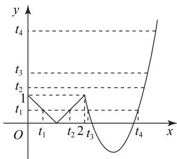
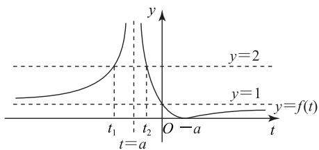
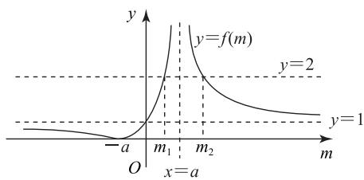
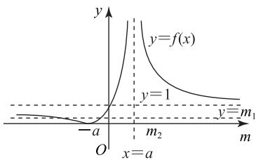
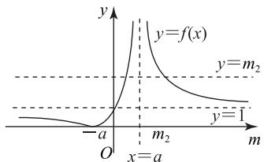
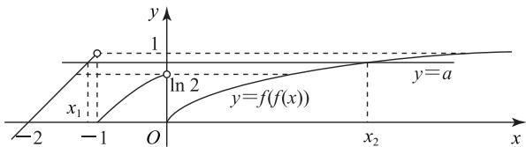

# 探析嵌套函数 $y=f(f(x))$ 的零点问题

郑淑茹

(福建省厦门第一中学)

嵌套函数 $y=f(f(x))$ 的零点问题是较难的一类问题, 求解这类问题的主要思想方法是换元法和数形结合思想, 本文分类解析, 供大家参考.

# 1 嵌套函数 $y = f(f(x))$ 零点个数的确定

例1 已知函数

$$
f (x) = \left\{ \begin{array}{l l} | x - 1 |, & 0 \leqslant x <   2, \\ 2 (x - 3) ^ {2} - 1, & x \geqslant 2, \end{array} \right.
$$

则函数 $y=f(f(x))-\frac{1}{2}$ 的零点个数为 \_\_\_\_.

函数 $y=f(f(x))-\frac{1}{2}$ 的零点个数即为方程

$f(f(x)) = \frac{1}{2}$ 根的个数. 令 $f(x) = t$ ，则 $f(t) = \frac{1}{2}$ ，可以求得 $t_1 = \frac{1}{2}, t_2 = \frac{3}{2}, t_3 = 3 - \frac{\sqrt{3}}{2}, t_4 = 3 + \frac{\sqrt{3}}{2}$ . 作出

$y=f(x)$ 和 $y=t(t=t_{1},t_{2},t_{3}$ 或 $t_{4})$ 的图像，如图1所示，由图可知一共有7个交点，所以方程有7个根，即函数 $y=f(f(x))-\frac{1}{2}$ 的零

line

| x    | y    |
| ---- | ---- |
| t₁   | 1    |
| t₂   | 2    |
| t₃   | 1    |
| t₄   | 0    |

图1

点个数为7.

求解嵌套函数零点问题的常用方法为设 $f(x)=t$ ，求出t的值，然后结合图像得出答

案.嵌套函数 $y=f(f(x))$ 的零点个数问题除了采用函数图像法外,有时也可以借助函数零点存在定理进行判断.

变式 已知函数

$$
f (x) = \left\{ \begin{array}{l l} \mathrm{e} ^ {x - 1} + 1, & x \leqslant 1, \\ | \ln (x - 1) |, & x > 1, \end{array} \right.
$$

则函数 $F(x)=f(f(x))-2f(x)-\frac{1}{2}$ 的零点个数为 \_\_\_\_.

答案 5.

42

数理化

# 2 已知嵌套函数 $y = f(f(x))$ 的零点个数求参数的取值范围

例2 已知函数 $f(x) = \left|\frac{x + a}{x - a}\right| (x \neq a)$ ，若关于

x 的方程 $f(f(x))=2$ 恰有 3 个不相等的实数解，则实数 a 的取值范围为 \_\_\_\_.

解析

$f(x) = |\frac{x + a}{x - a}| = |1 + \frac{2a}{x - a} | (x \neq a)$ , 当 $a =$

0 时, $f(x)=1(x\neq0)$ ,此时 $f(f(x))=2$ 无解,不满足题意.

当 $a < 0$ 时，设 $t = f(x)$ ，则 $y = f(t)$ 与 $y = 2$ 的大致图像如图2所示，则 $f(t) = 2$ 对应的2个根为 $t_1 < a < t_2 < 0$ ，此时方程 $f(x) = t_{1},f(x) = t_{2}$ 均无解，即方程 $f(f(x)) = 2$ 无解，不满足题意.

line

| t    | y = 1 | y = 2 |
| ---- | ----- | ----- |
| t₁   | -     | -     |
| t₂   | -     | -     |

图2

当 $a > 0$ 时，设 $m = f(x)$ ，则 $y = f(m)$ 与 $y = 2$ 大致图像如图3所示，故 $f(m) = 2$ 对应的2个根为 $0 < m_{1} < a < m_{2}$ .若方程 $f(f(x)) = 2$ 恰有3个不相等的实数根，则 $y = m_{1},y = m_{2}$ 与函数 $y = f(x)$ 的图像共有3个不同的交点.

line

| x     | y=f(m) |
|-------|--------|
| -a    | -      |
| m₁    | y      |
| m₂    | y=2    |
| m     | y=1    |

图3

当 $0 < a < 1$ 时， $y = m_1$ 与函数 $f(x)$ 的图像共有2个交点，如图4所示，所以 $y = m_2$ 与函数 $f(x)$ 的图像只有1个交点，则 $m_2 = 1$ ，所以 $\left|\frac{1 + a}{1 - a}\right| = 2$ ，解得 $a =$

3(舍)或 $\frac{1}{3}$ .

text_image

y
y=f(x)
y=1
y=m₁
-a
m₂
m
O
x=a

图4

当 $a = 1$ 时， $y = m_1$ 与函数 $f(x)$ 的图像共有2个交点，所以 $y = m_2$ 与函数 $f(x)$ 的图像只有1个交点，则 $m_2 = 1$ ，与 $m_2 > a$ 矛盾，不符合题意.

当 $a > 1$ 时， $y = m_2$ 与函数 $f(x)$ 的图像共有2个交点,如图 5 所示,所以$y=m_{1}$ 与函数 $f(x)$ 的图像只有 1 个交点，则$m_{1} = 1$ ，所以 $\left|\frac{1 + a}{1 - a}\right| = 2,$ 解得 $a=\frac{1}{3}$ (舍)或3.

text_image

y
y=f(x)
y=m₂
y=1
-a
O
m₂
x=a

图5

综上，a 的取值范围为 $\left\{\frac{1}{3},3\right\}$ .

# 点评

求解本题的关键在于作出函数 $f(x)$ 的图像, 将方程 $f(f(x)) = 2$ 恰有 3 个不相等的实数解转化为2条直线与函数 $f(x)$ 图像的只有3个交点的问题.对于此类问题，通常采用数形结合思想，先将解析式变形，进而构造两个函数，然后在同一平面直角坐标系中画出函数的图像，结合图像求解.

变式 若函数 $f(x)$ 满足: 当 $x \leqslant -1$ 或 $x \geqslant 1$ 时, $f(x) = 1 + a \mid x \mid$ ; 当 -1 < x < 1 时, $f(x) = \lg(1 - x) - \lg(1 + x)$ . 若函数 $y = 2 - f(f(x))$ 有 5 个零点, 则实数 a 的取值范围是 \_\_\_\_.

答案 $(0, \frac{\sqrt{5}-1}{2}]$ .

# 3 求嵌套函数 $y = f(f(x))$ 零点(或关于零点的关系式)的取值范围

例3 已知函数 $f(x) = \begin{cases} x + 1, & x < 0, \\ \ln (x + 1), & x \geqslant 0, \end{cases}$ 若关于 x 的方程 $f(f(x))=a$ 恰有 2 个不相等的实数根 $x_{1}, x_{2}$ ，且 $x_{1}<x_{2}$ ，则 $\frac{x_{2}+1}{x_{1}+2}$ 的取值范围是 \_\_\_\_.

易知函数 $f(x)$ 在 $(-∞,0)$ 上单调递增， $f(x)<1,f(x)$ 在 $[0,+\infty)$ 上单调递增，

$f(x)\geqslant 0.$ 当 $f(x) <   0$ ，即 $x <   - 1$ 时， $f(f(x)) = x+$ 2，且 $f(f(x)) <   1.$ 当 $-1\leqslant x <   0$ ，即 $0\leqslant f(x) <   1$ 时， $f(f(x)) = \ln (x + 2)$ ，且 $0\leqslant f(f(x)) <   \ln 2.$ 当 $x\geqslant$ 0，即 $f(x)\geqslant 0$ 时， $f(f(x)) = \ln (\ln (x + 1) + 1)$ ，且 $f(f(x))\geqslant 0$ ，所以

$$
f (f (x)) = \left\{ \begin{array}{l l} x + 2, & x <   - 1, \\ \ln (x + 2), & - 1 \leqslant x <   0, \\ \ln (\ln (x + 1) + 1), & x \geqslant 0. \end{array} \right.
$$

在平面直角坐标系内作出函数 $y = f(f(x))$ 的图像，如图6所示，再作出直线 $y = a$ ，则方程 $f(f(x)) = a$ 有2个不相等的实数根，当且仅当直线 $y = a$ 与函数 $y = f(f(x))$ 的图像有2个不同的交点。观察图像可知方程 $f(f(x)) = a$ 有2个不相等的实数 $x_{1}, x_{2} (x_{1} < x_{2})$ ，当且仅当 $\ln 2 \leqslant a < 1$ ，此时 $x_{1} + 2 = a$ ，且 $\ln (\ln (x_{2} + 1) + 1) = a$ ，即 $x_{1} + 2 = a$ ，且 $x_{2} + 1 = \mathrm{e}^{\mathrm{e}a - 1}$ ，则 $\frac{x_2 + 1}{x_1 + 2} = \frac{\mathrm{e}^{\mathrm{e}a - 1}}{a}$ 。

text_image

y
1
ln 2
y=a
x₁
y=f(f(x))
-2
-1
O
x₂
x

图6

令 $g(x)=\frac{\mathrm{e}^{\mathrm{e}x-1}}{x}(\ln2\leqslant x<1)$ ，求导得 $g'(x)=\frac{\mathrm{e}^{\mathrm{e}x-1}(x\mathrm{e}^{x}-1)}{x^{2}}$ ，令 $h(x)=x\mathrm{e}^{x}-1$ ，则

$$
h ^ {\prime} (x) = (x + 1) \mathrm{e} ^ {x}.
$$

当 $\ln 2 < x < 1$ 时， $h'(x) > 0$ ，即函数 $h(x)$ 在 $(\ln 2, 1)$ 上单调递增。 $h(x) > h(\ln 2) = 2\ln 2 - 1 = \ln 4 - 1 > 0$ ，即 $g'(x) > 0$ ，则函数 $g(x)$ 在 $[\ln 2, 1)$ 上单调递增， $g(\ln 2) = \frac{\mathrm{e}}{\ln 2}$ ，而 $g(1) = \mathrm{e}^{\mathrm{e} - 1}$ 。当 $\ln 2 \leqslant x < 1$ 时， $\frac{\mathrm{e}}{\ln 2} \leqslant g(x) < \mathrm{e}^{\mathrm{e} - 1}$ ，则 $\frac{\mathrm{e}}{\ln 2} \leqslant \frac{\mathrm{e}^{ea - 1}}{a} < \mathrm{e}^{e - 1}$ ，所以 $\frac{x_2 + 1}{x_1 + 2}$ 的取值范围是 $[\frac{\mathrm{e}}{\ln 2}, \mathrm{e}^{\mathrm{e} - 1})$ 。

# 点评

涉及给定函数零点个数,可将其转化为直线与函数图像的交点个数问题,求解这类问题将零点(或关于零点的关系式)用含有参数示出来,进而求出该函数的值域.

(完)